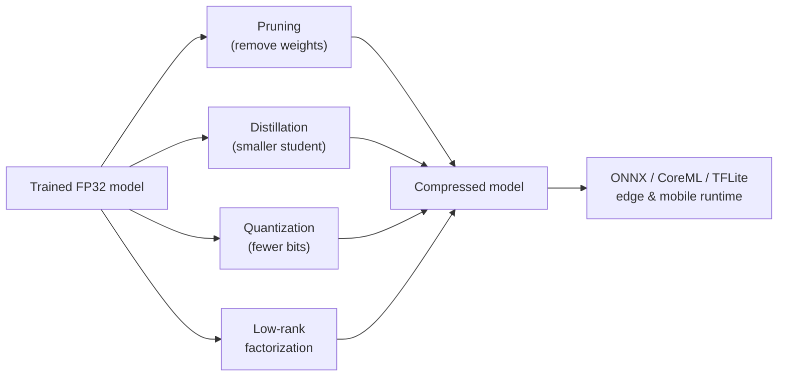
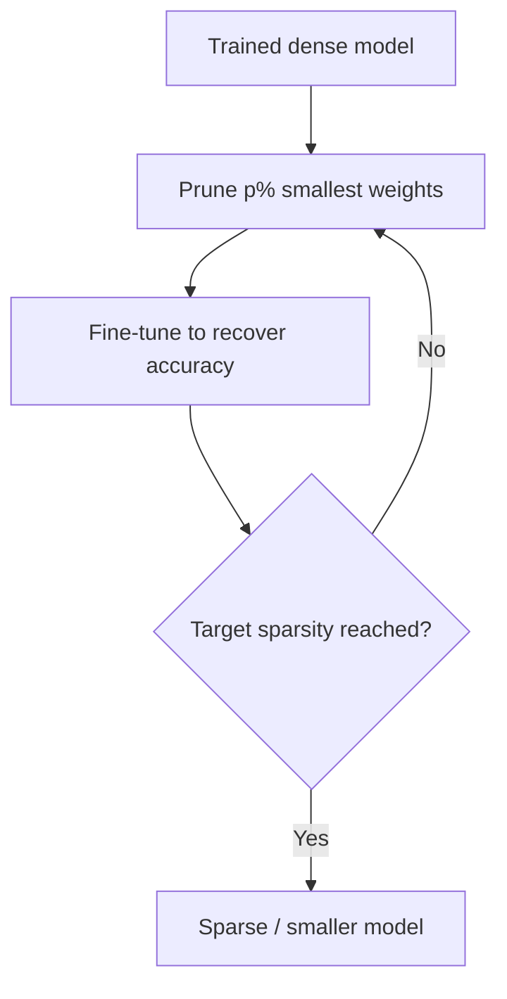
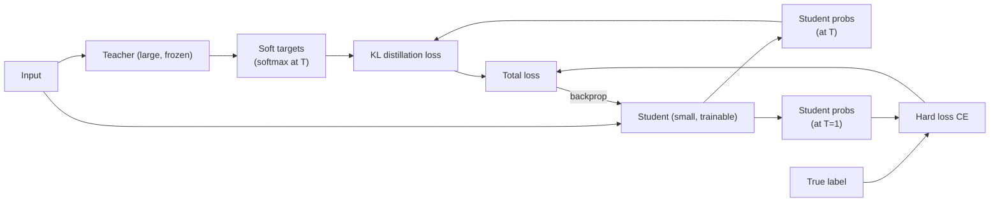
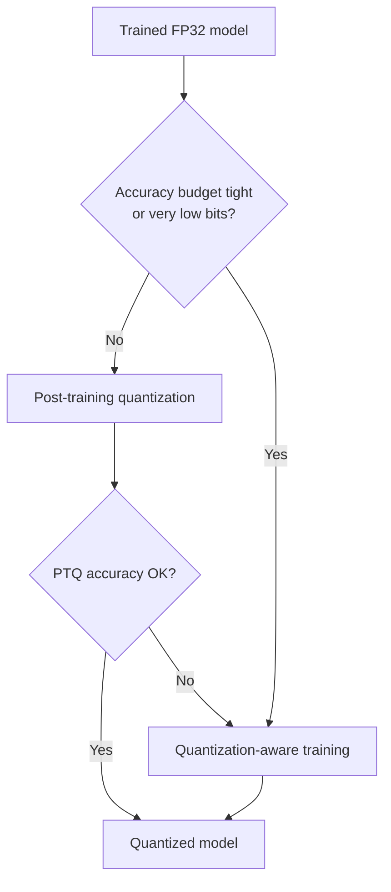
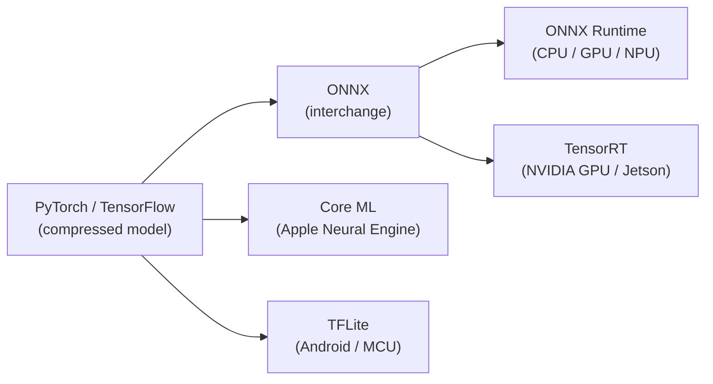
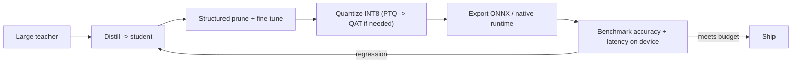

<div class="hero-section" style="background: linear-gradient(135deg, #667eea 0%, #764ba2 100%); color: white; padding: 3rem 2rem; margin: -2rem -3rem 2rem -3rem; text-align: center;">
  <h1 style="color: white; margin: 0; font-size: 2.5rem;">Model Compression</h1>
  <p style="font-size: 1.25rem; margin-top: 1rem; opacity: 0.9;">Shrinking neural networks for faster, cheaper inference: pruning, distillation, quantization, low-rank factorization, and edge deployment - and the accuracy you trade for them.</p>
</div>

[AI/ML Documentation](./) &raquo; Model Compression

<div class="code-example" markdown="1">
How to make a trained model smaller and faster without throwing away the accuracy you paid to train: remove redundant weights, teach a small student to mimic a large teacher, store weights in fewer bits, factor big matrices into thin ones, and ship the result to a phone or microcontroller.
</div>

## Why Compress a Model?

A trained network and a *deployable* network are rarely the same thing. Training optimizes for accuracy with abundant GPU memory and no latency budget; deployment runs on a phone, a browser, a microcontroller, or a cost-sensitive cloud instance where memory, energy, and milliseconds all matter. Compression closes that gap.

The four levers, which can be combined, are:

| Technique | What it removes / changes | Typical size reduction | Typical speedup |
|-----------|---------------------------|------------------------|-----------------|
| Pruning | Redundant weights or whole channels | 2-10x (sparse) | 1x-4x (needs HW support) |
| Knowledge distillation | Trains a smaller architecture entirely | 2-10x | proportional to size |
| Quantization | Bits per weight/activation (FP32 to INT8/INT4) | 2-8x | 2-4x |
| Low-rank factorization | Replaces a matrix with two thin ones | 1.5-4x per layer | proportional to FLOP cut |

Each technique attacks a different kind of redundancy, and the best results usually come from stacking them - for example distill, then quantize, then prune.



## The Core Trade-off

Every compression method trades one or more of these quantities:

- **Accuracy** - top-1 / top-5, BLEU, mAP, perplexity, etc.
- **Latency** - time per inference, often the user-facing metric.
- **Memory** - both model size on disk and peak RAM at runtime.
- **Energy** - critical on battery-powered devices.

A useful way to compare techniques is the *accuracy-vs-cost frontier*: plot accuracy against latency (or size) for many configurations and keep only the non-dominated points. A method is worthwhile only if it pushes that frontier out - giving more accuracy at a given latency, or the same accuracy at lower latency.

A common pitfall is to report parameter count or FLOPs as the cost. Neither directly predicts latency: an unstructured-sparse model has few FLOPs but may run *slower* than the dense original on hardware that cannot exploit sparsity. Always measure wall-clock latency on the target device.

## Pruning

Pruning removes weights (or larger structures) that contribute little to the output, exploiting the observation that most large networks are heavily over-parameterized.

### Unstructured vs. Structured Pruning

This distinction governs whether pruning actually speeds up inference.

| | Unstructured | Structured |
|---|---|---|
| Granularity | Individual weights set to zero | Whole channels / filters / heads / blocks removed |
| Resulting tensor | Same shape, sparse | Physically smaller, dense |
| Compression of size | High (with sparse storage) | Moderate |
| Speedup on commodity HW | Often none (dense kernels) | Yes - it shrinks real dimensions |
| Needs special HW/kernels | Yes (e.g. NVIDIA 2:4 sparsity) | No |

**Unstructured pruning** zeroes individual weights. It achieves the highest sparsity for a given accuracy because it has the most freedom, but a sparse matrix with random zeros still runs through dense matrix-multiply kernels at full cost unless the hardware and library support sparse computation. NVIDIA's *2:4 structured sparsity* (exactly 2 of every 4 contiguous weights are zero) is a middle ground that Ampere+ GPUs accelerate.

**Structured pruning** removes entire units - convolutional filters, channels, attention heads, or transformer FFN blocks - so the remaining tensors are smaller but still dense. This translates almost directly into FLOP and latency reductions on any hardware, which is why it dominates in practice for deployment.

### Magnitude Pruning

The simplest and surprisingly strong criterion is to remove the weights with the smallest absolute value, the assumption being that small weights matter least. For a weight matrix, we keep the top-`k` by magnitude and zero the rest. Sparsity at a layer is

$$
s = \frac{\text{number of zeroed weights}}{\text{total weights}}.
$$

A typical recipe is **iterative magnitude pruning with fine-tuning**: prune a fraction, fine-tune to recover accuracy, repeat. Pruning everything in one shot to high sparsity usually destroys accuracy; spreading it over rounds lets the network reallocate capacity.



### Structured Importance Scores

For structured pruning we need a score per *channel* or *filter* rather than per weight. Common choices:

- **L1/L2 norm of the filter** - prune filters with the smallest norm.
- **First-order (Taylor) importance** - approximate the change in loss `L` from removing a unit with weight `w` using the gradient: the importance is roughly $|w \cdot g|$ where `g` is the gradient of the loss with respect to `w`. This estimates how much the loss would move, not just how small the weight is.
- **Batch-norm scale (gamma)** - a small BN scaling factor means the channel's output is suppressed, so it is a cheap importance proxy.

### The Lottery Ticket Hypothesis

The *lottery ticket hypothesis* observes that a dense network contains a sparse subnetwork ("winning ticket") which, when trained in isolation *from the original initialization*, can match the full network's accuracy. It reframes pruning as finding a well-initialized small network rather than merely deleting weights after the fact, and it explains why fine-tuning after pruning works so well: the surviving weights were the ones that were going to do the work anyway.

### Worked Example: Pruning a Linear Layer (PyTorch)

```python
import torch
import torch.nn.utils.prune as prune

layer = torch.nn.Linear(512, 512)

# Unstructured: zero the 60% smallest-magnitude weights
prune.l1_unstructured(layer, name="weight", amount=0.6)
sparsity = float(torch.sum(layer.weight == 0)) / layer.weight.nelement()
print(f"unstructured sparsity: {sparsity:.2f}")  # ~0.60, same tensor shape

# Structured: remove the 4 lowest-L2-norm output neurons (rows)
prune.ln_structured(layer, name="weight", amount=4, n=2, dim=0)

# Make pruning permanent (removes the mask, bakes zeros into the weight)
prune.remove(layer, "weight")
```

Note that `prune.remove` in PyTorch bakes the zeros in but does **not** shrink the tensor; turning structured pruning into an actually-smaller model requires rebuilding the layer with fewer neurons, which libraries like Torch-Pruning automate by tracing dependencies across layers.

## Knowledge Distillation

Knowledge distillation (KD) trains a small **student** network to reproduce the behavior of a large **teacher** (or an ensemble). Instead of compressing an existing model, it transfers what the teacher learned into a smaller architecture from the start.

### Soft Targets and Temperature

The key insight is that a teacher's output distribution carries more information than the hard label. When a teacher classifies an image of a dog, it might assign 90% dog, 8% wolf, 2% cat - the relative probabilities of the wrong classes ("dark knowledge") tell the student that dogs look more like wolves than cats. The student learns from these *soft targets*.

To expose that structure we soften the softmax with a temperature `T`. Given logits `z_i`, the softened probability is

$$
p_i = \frac{\exp(z_i / T)}{\sum_j \exp(z_j / T)}.
$$

`T = 1` is the ordinary softmax; larger `T` flattens the distribution and amplifies the small probabilities the student should imitate. The distillation loss combines a soft term (match the teacher) and a hard term (match the true label `y`):

$$
L = (1 - \alpha) \, L_{CE}(y, p_S^{(1)}) + \alpha \, T^2 \, L_{KL}\big(p_T^{(T)} \,\|\, p_S^{(T)}\big),
$$

where $p_S^{(1)}$ is the student's prediction at `T = 1`, $p_T^{(T)}$ and $p_S^{(T)}$ are the teacher and student distributions at temperature `T`, and `alpha` balances the two terms. The $T^2$ factor rescales the soft-target gradients, which otherwise shrink as $1/T^2$, so that the two loss terms stay comparably weighted.



### Variants

- **Response-based** (above) - match output logits/probabilities. Simplest, architecture-agnostic.
- **Feature-based** - also match intermediate activations (e.g. FitNets), giving the student richer guidance but requiring matching/projecting feature dimensions.
- **Relation-based** - match relationships *between* examples or layers rather than raw activations.
- **Self-distillation** - teacher and student share architecture; deeper layers teach shallower ones, or a model teaches a copy of itself across epochs.

Distillation is the workhorse behind compact production models such as DistilBERT (about 40% smaller and 60% faster than BERT while retaining ~97% of its language-understanding performance) and TinyBERT.

### Worked Example: Distillation Loss (PyTorch)

```python
import torch.nn.functional as F

def distillation_loss(student_logits, teacher_logits, labels, T=4.0, alpha=0.7):
    # Soft term: KL between softened teacher and student, scaled by T^2
    soft = F.kl_div(
        F.log_softmax(student_logits / T, dim=-1),
        F.softmax(teacher_logits / T, dim=-1),
        reduction="batchmean",
    ) * (T * T)
    # Hard term: ordinary cross-entropy with true labels
    hard = F.cross_entropy(student_logits, labels)
    return alpha * soft + (1.0 - alpha) * hard
```

## Quantization

Quantization stores and computes with lower-precision numbers - replacing 32-bit floats with 8-bit or even 4-bit integers. Because memory traffic and integer arithmetic dominate inference cost, this is often the single highest-leverage compression technique: 4x smaller and 2-4x faster with INT8, frequently for under 1% accuracy loss.

### The Quantization Map

Quantization maps a real value `r` to an integer `q` via a scale `S` and zero-point `Z`:

$$
q = \mathrm{round}\!\left(\frac{r}{S}\right) + Z, \qquad r \approx S \,(q - Z).
$$

- **Symmetric** quantization sets `Z = 0`, mapping a range $[-a, a]$ symmetrically; good for weights, which are roughly centered on zero.
- **Asymmetric** (affine) quantization uses a nonzero `Z` to cover an arbitrary range $[r_{min}, r_{max}]$; better for activations such as ReLU outputs that are non-negative.

For an unsigned 8-bit target with range $[r_{min}, r_{max}]$:

$$
S = \frac{r_{max} - r_{min}}{255}, \qquad Z = \mathrm{round}\!\left(-\frac{r_{min}}{S}\right).
$$

**Granularity** also matters: a single scale for an entire tensor (*per-tensor*) is cheapest, while a separate scale per output channel (*per-channel*) tracks differing weight ranges and usually recovers most of the accuracy lost at low precision.

### Precision Levels

| Format | Bits | Size vs FP32 | Typical use |
|--------|------|--------------|-------------|
| FP16 / BF16 | 16 | 0.5x | Default GPU inference, training |
| INT8 | 8 | 0.25x | Mainstream deployment, CPU/edge/GPU |
| INT4 | 4 | 0.125x | LLM weights, aggressive edge |
| Binary / ternary | 1-2 | ~0.03-0.06x | Research, extreme edge |

INT4 and below are dominated by *weight-only* quantization for large language models, where weights are the memory bottleneck and activations stay in higher precision (e.g. GPTQ, AWQ). The matmul dequantizes weights on the fly, so the win is in memory bandwidth, not integer arithmetic.

### Post-Training Quantization (PTQ)

PTQ quantizes an *already trained* model with no further training:

- **Dynamic** - weights are quantized ahead of time; activation scales are computed on the fly per inference. Easiest, no calibration data, common for transformers/RNNs on CPU.
- **Static** - both weights and activations are quantized, with activation ranges determined by running a small **calibration** set (a few hundred representative inputs) through the model to observe activation distributions. Faster at inference than dynamic.

PTQ is fast (minutes), needs little or no data, and is the right first attempt. INT8 PTQ typically costs well under 1% accuracy on vision and NLP models.

### Quantization-Aware Training (QAT)

When PTQ loses too much accuracy - common at INT4, or for compact models with little redundancy - QAT *simulates* quantization during training so the network learns weights robust to it. Forward passes insert "fake quantization" nodes that round activations and weights to the target precision; the backward pass uses a **straight-through estimator (STE)** to pass gradients through the non-differentiable rounding as if it were the identity:

$$
\frac{\partial \,\mathrm{round}(x)}{\partial x} \approx 1.
$$

QAT recovers most of the PTQ accuracy gap at the cost of a full (usually short, fine-tuning-length) training run and access to the training data.

| | PTQ | QAT |
|---|---|---|
| Needs training data | None / small calibration set | Full training set |
| Compute cost | Minutes | A training run |
| Accuracy at INT8 | Usually excellent | Excellent |
| Accuracy at INT4 | Often degraded | Much better |
| When to use | First attempt, low risk | When PTQ accuracy is insufficient |



### Worked Example: INT8 PTQ (PyTorch)

```python
import torch

model_fp32 = MyModel().eval()

# Dynamic quantization: simplest PTQ, great for Linear/LSTM-heavy models
model_int8 = torch.quantization.quantize_dynamic(
    model_fp32, {torch.nn.Linear}, dtype=torch.qint8
)

# Static PTQ sketch: fuse, set qconfig, calibrate, convert
model_fp32.qconfig = torch.quantization.get_default_qconfig("fbgemm")  # x86
torch.quantization.prepare(model_fp32, inplace=True)
for inputs, _ in calibration_loader:      # ~100-500 representative batches
    model_fp32(inputs)                    # observe activation ranges
model_static_int8 = torch.quantization.convert(model_fp32, inplace=False)
```

## Low-Rank Factorization

Many weight matrices are close to low rank - their information lives in far fewer dimensions than their shape suggests. Low-rank factorization replaces a large matrix `W` (of shape `m x n`) with the product of two thin matrices:

$$
W \approx U V, \qquad U \in \mathbb{R}^{m \times r}, \quad V \in \mathbb{R}^{r \times n}, \quad r \ll \min(m, n).
$$

The original layer costs $m \cdot n$ parameters and FLOPs; the factored pair costs $r\,(m + n)$. The compression ratio is

$$
\rho = \frac{m \cdot n}{r\,(m + n)},
$$

which is large whenever the chosen rank `r` is small relative to the dimensions. The optimal rank-`r` approximation in the least-squares sense comes from the **singular value decomposition (SVD)**: keep the `r` largest singular values. The discarded singular values bound the approximation error, so the spectrum tells you how compressible a layer is - a quickly-decaying spectrum means a low rank suffices.

For convolutions the same idea applies to the (reshaped) kernel tensor, with tensor decompositions such as Tucker or CP factorization replacing one expensive convolution with a sequence of cheaper ones.

This is the same mathematics behind **LoRA**, which freezes `W` and *learns* a low-rank update $\Delta W = U V$ - factorization for compression instead replaces `W` itself. See [LoRA Training](lora-training.html) for the training-time adapter view.

```python
import torch

W = layer.weight.data                         # shape (m, n)
U, S, Vh = torch.linalg.svd(W, full_matrices=False)
r = 64                                         # chosen rank
U_r = U[:, :r] * S[:r]                          # fold singular values in
V_r = Vh[:r, :]
# Replace one (m x n) layer with two: (m x r) then (r x n)
W_approx = U_r @ V_r                            # rank-r reconstruction
```

After factorization a short fine-tune typically recovers any accuracy lost to truncation.

## Edge and Mobile Deployment

A compressed model still has to *run* on the target device. Deployment runtimes convert the model to an optimized, often hardware-specific format and apply graph-level optimizations (operator fusion, constant folding, memory planning) on top of whatever compression you applied.

### Deployment Formats

| Format | Owner / ecosystem | Best target | Notes |
|--------|-------------------|-------------|-------|
| **ONNX** | Open standard | Cross-platform | Interchange format; run with ONNX Runtime on CPU/GPU/NPU. Supports INT8 quantization. |
| **TensorFlow Lite (TFLite)** | Google | Android, microcontrollers | INT8/INT4 quant, delegates for GPU/NNAPI/Hexagon; TFLite Micro runs on MCUs. |
| **Core ML** | Apple | iOS / macOS | Runs on the Apple Neural Engine; convert via `coremltools`, supports palettization and quantization. |
| **TensorRT** | NVIDIA | NVIDIA GPUs / Jetson | Aggressive fusion + INT8/FP16; rebuilds engine per GPU. |

A typical pipeline trains in PyTorch or TensorFlow, exports to **ONNX** as a neutral hand-off, then converts to the device-native format (Core ML for iPhones, TFLite for Android, TensorRT for Jetson/data-center GPUs).



### Hardware Backends

The speedup from quantization or pruning is only realized if the runtime and chip support it:

- **CPU** - INT8 via vectorized instructions (AVX-512 VNNI on x86, dot-product instructions on ARM); broad support, modest speedups.
- **GPU** - FP16/INT8 tensor cores; 2:4 structured sparsity on Ampere and later.
- **Mobile NPU / DSP** - Apple Neural Engine, Qualcomm Hexagon, Google Edge TPU - heavily favor INT8 and fixed shapes.
- **Microcontrollers** - TFLite Micro runs INT8 models in kilobytes of RAM with no operating system.

This is why measuring latency *on the target* is non-negotiable: a model that is faster on a server GPU may be slower on a phone NPU that lacks the needed kernels.

### Example: Export to ONNX and Quantize

```python
import torch
from onnxruntime.quantization import quantize_dynamic, QuantType

# 1. Export the trained model to ONNX
dummy = torch.randn(1, 3, 224, 224)
torch.onnx.export(model, dummy, "model.onnx", opset_version=17,
                  input_names=["input"], output_names=["logits"])

# 2. Quantize the ONNX graph to INT8 (dynamic, weight-only)
quantize_dynamic("model.onnx", "model.int8.onnx", weight_type=QuantType.QInt8)
```

## Putting It Together

Compression techniques compose, and order matters. A common production recipe:

1. **Distill** a large teacher into a smaller student architecture (biggest structural win).
2. **Prune** the student with structured, iterative magnitude pruning + fine-tuning.
3. **Quantize** to INT8 with PTQ; fall back to QAT if accuracy slips.
4. **Export** to ONNX, then convert to the device-native runtime and benchmark on the target.

At every step, validate against held-out data and measure real latency on the deployment hardware - not FLOPs, not parameter count.



## Common Pitfalls

- **Optimizing FLOPs instead of latency.** Unstructured sparsity cuts FLOPs but rarely cuts wall-clock time without sparse hardware support.
- **Quantizing without calibration.** Static PTQ with a poor or unrepresentative calibration set produces clipped activations and large accuracy drops.
- **One-shot high-sparsity pruning.** Pruning 90% of weights at once usually collapses accuracy; iterate with fine-tuning.
- **Ignoring the data layer.** Outlier activations (common in LLMs) wreck naive quantization; per-channel scales or outlier-aware methods (e.g. SmoothQuant, AWQ) are needed.
- **Skipping device benchmarks.** A win on a desktop GPU can be a loss on a mobile NPU lacking the required kernels.

## Key Takeaways

<div class="takeaway-card" markdown="1">
- **Four levers, often stacked:** pruning (remove weights), distillation (smaller student trained from a teacher), quantization (fewer bits), and low-rank factorization (thin matrices) attack different redundancies.
- **Structured beats unstructured for speed.** Removing whole channels/heads shrinks real tensors and speeds up any hardware; unstructured sparsity needs special kernels to pay off.
- **Quantization is the highest-leverage single step:** INT8 gives ~4x smaller and 2-4x faster for usually under 1% accuracy loss; try PTQ first, use QAT when accuracy slips or you go below 8 bits.
- **Distillation transfers "dark knowledge"** via soft targets at a temperature; it is how compact models like DistilBERT keep most of a large model's accuracy.
- **Measure latency on the target device,** not FLOPs or parameter count, and export through ONNX to the native runtime (Core ML, TFLite, TensorRT) for the real win.
</div>

---

<div class="see-also-card" markdown="1">
#### See Also

- [Model Types Explained](model-types.html) - Checkpoints, LoRAs, VAEs, and how components combine
- [LoRA Training](lora-training.html) - Low-rank adaptation as a training-time technique
- [Base Models Comparison](base-models-comparison.html) - Trade-offs across model families and sizes
- [Advanced Techniques](advanced-techniques.html) - Further optimization and workflow methods
- [AI/ML Documentation Hub](./) - Complete AI/ML documentation index
</div>
