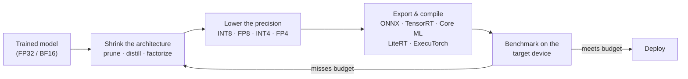
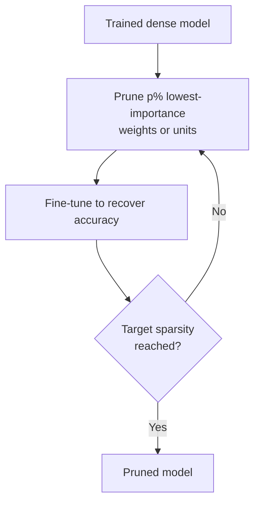
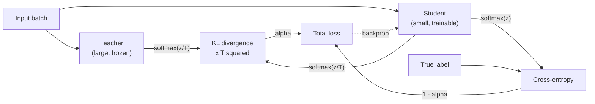
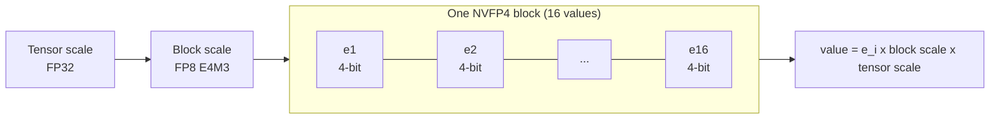
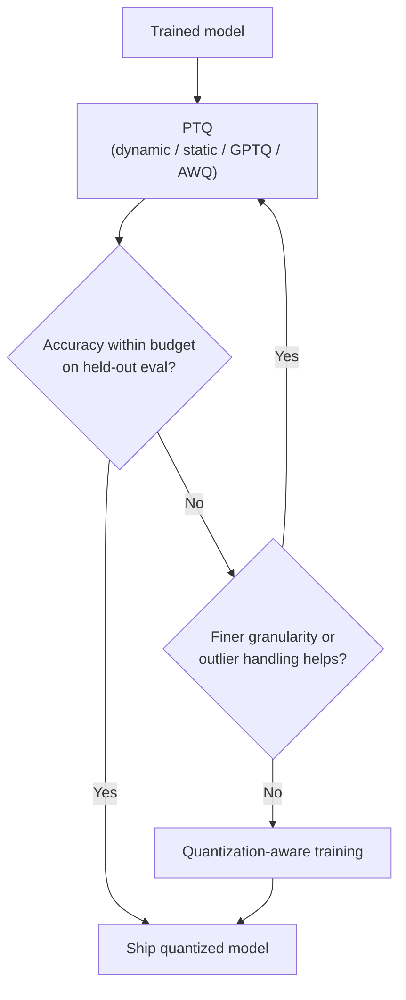
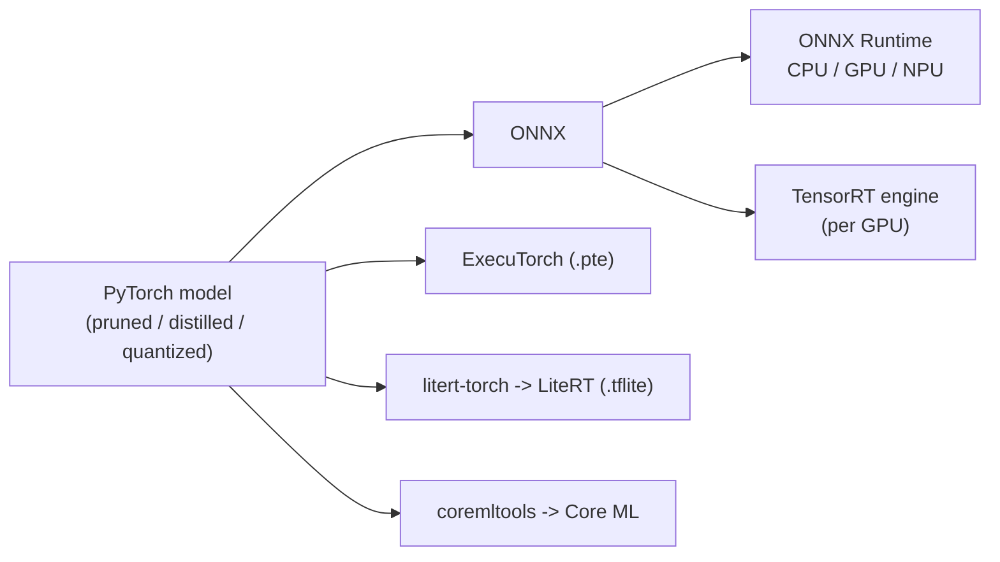

[AI/ML Documentation](./) &raquo; Model Compression

**Model compression** is the set of techniques for making a trained neural network smaller, faster, or cheaper to run while keeping as much of its accuracy as possible. There are four main techniques. **Pruning** removes weights. **Knowledge distillation** trains a smaller network to copy a larger one. **Quantization** stores and computes with fewer bits. **Low-rank factorization** replaces a large matrix with two thin ones. This page covers how each technique works, how they combine, how the large-language-model era changed them, and how a compressed model gets deployed on real hardware. For runtime tactics that don't change the model (offloading, attention kernels, batching), see [Optimization & Performance](optimization-guide.html).

## Overview

A model as it comes out of training is rarely the model you want to deploy. Training runs with plenty of accelerator memory and no latency budget. Deployment runs on a phone, a browser, a microcontroller, or a cloud GPU billed by the hour, where memory, energy, and milliseconds all matter.

| Technique | What it changes | Typical size reduction | Speedup depends on |
|-----------|-----------------|------------------------|--------------------|
| [Pruning](#pruning) | Removes weights, channels, heads, or layers | 1.5-10x | Structured vs. unstructured; sparse-kernel support |
| [Knowledge distillation](#knowledge-distillation) | Trains a smaller architecture to imitate a teacher | 2-10x | Size of the student |
| [Quantization](#quantization) | Bits per weight and/or activation (16 to 8 to 4) | 2-8x | Whether the hardware has low-precision math units |
| [Low-rank factorization](#low-rank-factorization) | Factors a matrix into two thin matrices | 1.5-4x per layer | Proportional to the FLOP reduction |

Each technique removes a different kind of redundancy, so they stack. A typical order is to shrink the architecture first (prune and/or distill), then lower the precision (quantize), then compile for the target runtime.



### Measuring the trade-off

Every method trades among four quantities: **accuracy** (top-1, mAP, perplexity, task benchmarks), **latency** (time per request or per token), **memory** (on-disk size and peak runtime RAM/VRAM), and **energy**. A useful way to compare methods is the *Pareto frontier*: plot accuracy against latency or size for many configurations and keep only the points that no other configuration beats on both axes. A method is worth using only if it pushes that frontier outward.

Parameter count and FLOPs are poor stand-ins for cost. An unstructured-sparse model has few effective FLOPs but can run *slower* than the dense original on hardware without sparse kernels. A 4-bit weight-only model saves memory bandwidth but does no less arithmetic. Always measure wall-clock latency and peak memory on the deployment target.

## Pruning

Pruning removes parameters that contribute little to the output. It works because large networks are heavily over-parameterized: many weights can be removed with almost no effect on the loss.

### Granularity: unstructured, semi-structured, structured

The granularity of pruning decides whether it makes the model *faster* or just more compressible.

| | Unstructured | Semi-structured (N:M) | Structured |
|---|---|---|---|
| What is removed | Individual weights | N of every M consecutive weights (e.g. 2:4) | Whole channels, filters, heads, FFN neurons, or layers |
| Resulting tensor | Same shape, irregular zeros | Same shape, regular zero pattern + index metadata | Physically smaller, dense |
| Accuracy at a given sparsity | Best | Good | Lowest |
| Speedup on commodity hardware | Usually none | Yes on sparse tensor cores (NVIDIA Ampere and later) | Yes, on any hardware |

- **Unstructured pruning** has the most freedom, so it reaches the highest sparsity for a given accuracy. But a matrix with scattered zeros still goes through dense matrix-multiply kernels at full cost, so the benefit is mostly smaller compressed storage.
- **2:4 semi-structured sparsity** requires exactly two zeros in every group of four contiguous weights. NVIDIA sparse tensor cores (Ampere onward) skip the zeros, which gives up to 2x math throughput on the pruned matmuls. End-to-end gains are usually smaller because only some operations are sparse.
- **Structured pruning** removes whole units, so the remaining tensors are smaller and still dense. The FLOP and latency savings apply on any hardware, which is why structured pruning dominates in practice for deployment.

### Importance criteria

To prune, you need a score for how much each weight or unit matters.

| Criterion | Score | Notes |
|-----------|-------|-------|
| Magnitude | $\lvert w \rvert$ (or the L1/L2 norm of a filter) | Simple and strong baseline for CNNs |
| First-order Taylor | $\lvert w \cdot \partial L / \partial w \rvert$ | Estimates the change in loss if the weight is removed |
| BN scale | $\lvert \gamma \rvert$ of the following batch-norm | Cheap proxy for channel importance in CNNs |
| Wanda (LLMs) | $\lvert w_{ij} \rvert \cdot \lVert X_j \rVert_2$ | Weight magnitude times input-activation norm; one-shot, no weight update |
| SparseGPT (LLMs) | Second-order (Hessian) reconstruction | Prunes and updates the remaining weights layer by layer to compensate |
| Activation / layer importance | Output norm, or accuracy drop when the unit is removed | Used for head, neuron, and depth pruning (e.g. Minitron) |

### Iterative magnitude pruning

Pruning to high sparsity in one step usually destroys accuracy. The standard recipe for CNNs and small transformers is to prune in rounds and fine-tune after each round so the network can move capacity into the surviving weights:



The **lottery ticket hypothesis** (Frankle and Carbin, 2019) partly explains why this works. A dense network contains a sparse subnetwork that, retrained from its *original* initialization, matches the full network's accuracy. Seen this way, pruning is a search for a well-initialized small network rather than just deleting weights after training.

### Pruning large language models

Iterating with fine-tuning costs too much for multi-billion-parameter models, so LLM pruning has moved in two directions:

- **One-shot pruning with calibration data.** SparseGPT and Wanda reach 50% unstructured or 2:4 sparsity from a few hundred calibration sequences, with no retraining. Quality holds up well at 50% on large models and drops faster on small ones.
- **Structured pruning plus distillation.** NVIDIA's **Minitron** method removes whole layers (depth pruning) or hidden, attention, and MLP dimensions (width pruning). It then *retrains the pruned model by distilling from the original*. Llama-3.1-Minitron-4B was made this way from Llama 3.1 8B, using a small fraction of the tokens needed to train a 4B model from scratch. In that work, the depth-pruned variant ran about 2.7x faster than the teacher and the width-pruned variant about 1.8x faster. The width-pruned variant had the better accuracy.

### Example: pruning in PyTorch

```python
import torch
import torch.nn.utils.prune as prune

layer = torch.nn.Linear(512, 512)

# Unstructured: zero the 60% smallest-magnitude weights (a mask is attached)
prune.l1_unstructured(layer, name="weight", amount=0.6)
print(f"sparsity: {(layer.weight == 0).float().mean():.2f}")   # ~0.60, same shape

# Structured: additionally zero the 4 output neurons (rows) with lowest L2 norm
prune.ln_structured(layer, name="weight", amount=4, n=2, dim=0)

# Make it permanent: bake the zeros into .weight and drop the mask
prune.remove(layer, "weight")
```

`torch.nn.utils.prune` only *masks* weights. The tensor keeps its shape, so nothing gets faster. To actually shrink a layer you have to rebuild it with fewer channels and fix up every layer that consumes its output. Libraries such as **Torch-Pruning** (`torch_pruning`) do this by tracing dependencies across the graph. For 2:4 sparsity on GPUs, PyTorch provides `torch.sparse.to_sparse_semi_structured`.

## Knowledge Distillation

**Knowledge distillation** (Hinton, Vinyals and Dean, 2015) trains a small **student** network to reproduce the outputs of a large **teacher** network (or an ensemble). It doesn't edit an existing model. It moves what the teacher learned into a new, cheaper architecture.

### Soft targets and temperature

A teacher's full output distribution carries more information than the hard label. A teacher that says "90% dog, 8% wolf, 2% cat" is telling the student that dogs look more like wolves than cats. Hinton called this information in the non-target probabilities *dark knowledge*. To expose it, the softmax is softened with a temperature $T$:

$$
p_i^{(T)} = \frac{\exp(z_i / T)}{\sum_j \exp(z_j / T)}
$$

$T = 1$ gives the ordinary softmax. Larger $T$ flattens the distribution and brings out the small probabilities. The student is trained on a weighted sum of a soft loss (match the teacher) and a hard loss (match the label $y$):

$$
\mathcal{L} = (1 - \alpha)\, \mathcal{L}_{\mathrm{CE}}\!\left(y,\, p_S^{(1)}\right) + \alpha\, T^2\, D_{\mathrm{KL}}\!\left(p_T^{(T)} \,\middle\|\, p_S^{(T)}\right)
$$

Here $p_T^{(T)}$ and $p_S^{(T)}$ are the teacher and student distributions at temperature $T$. The $T^2$ factor makes up for the soft-loss gradients shrinking as $1/T^2$, so the two terms stay on a comparable scale when $T$ changes.



### What gets matched

| Variant | Student is trained to match | Example |
|---------|------------------------------|---------|
| Response-based | Output logits / probabilities | Hinton KD, DistilBERT (partly) |
| Feature-based | Intermediate activations, via a projection if widths differ | FitNets, TinyBERT |
| Relation-based | Similarities between examples or between layers | RKD, attention-map transfer |
| Self-distillation | A copy of itself, or deep layers teaching shallow ones | Born-Again Networks |
| Sequence-level (LLMs) | Text generated by the teacher (train on teacher outputs) | Synthetic-data fine-tuning |
| On-policy / generalized (LLMs) | Teacher token distributions on *student-generated* sequences | GKD, MiniLLM |

DistilBERT is the classic example of a compact production model: 40% fewer parameters than BERT-base and 60% faster, while keeping about 97% of its GLUE performance. Distillation has since become standard for LLMs. Small open-weight models are routinely distilled from larger siblings, either on logits (Minitron, Gemma 2's smaller sizes) or on teacher-generated text such as reasoning traces. In diffusion, *step distillation* (LCM, SDXL-Turbo, Lightning) teaches a student to get the same result in fewer denoising steps instead of with fewer parameters. See [Optimization & Performance](optimization-guide.html#fewer-steps-distilled-models-and-caching).

### Example: distillation loss in PyTorch

```python
import torch.nn.functional as F

def distillation_loss(student_logits, teacher_logits, labels, T=4.0, alpha=0.7):
    # Soft term: KL(teacher || student) at temperature T, rescaled by T^2
    soft = F.kl_div(
        F.log_softmax(student_logits / T, dim=-1),
        F.log_softmax(teacher_logits / T, dim=-1),
        reduction="batchmean",
        log_target=True,
    ) * (T * T)
    hard = F.cross_entropy(student_logits, labels)
    return alpha * soft + (1.0 - alpha) * hard
```

`F.kl_div` expects the *student* log-probabilities as its first argument. Passing the teacher as log-probabilities with `log_target=True` is more numerically stable than passing probabilities.

## Quantization

**Quantization** represents weights and/or activations with fewer bits, for example 8-bit integers or 4-bit floats instead of 16- or 32-bit floats. Inference is usually limited by memory bandwidth, and low-precision tensor cores do far more operations per second, so quantization is often the single highest-leverage compression step. INT8 typically costs well under 1% accuracy on vision and NLP models. Weight-only 4-bit is now the default way to run LLMs locally.

### The affine quantization map

A real value $r$ maps to an integer $q$ through a **scale** $S$ and a **zero-point** $Z$:

$$
q = \mathrm{clamp}\!\left(\mathrm{round}\!\left(\frac{r}{S}\right) + Z,\; q_{\min},\; q_{\max}\right), \qquad \hat{r} = S\,(q - Z)
$$

- **Symmetric** quantization fixes $Z = 0$. For signed INT8 the scale is $S = \max\lvert r \rvert / 127$. This suits weights, which are roughly centered on zero.
- **Asymmetric (affine)** quantization uses a nonzero $Z$ to cover an arbitrary range $[r_{\min}, r_{\max}]$. It suits skewed activations such as post-ReLU outputs. For unsigned 8-bit:

$$
S = \frac{r_{\max} - r_{\min}}{255}, \qquad Z = \mathrm{round}\!\left(-\frac{r_{\min}}{S}\right)
$$

Values outside the range are **clipped** and values inside it are **rounded**. Choosing the range is a trade-off between clipping error and rounding error. That is why calibration methods such as percentile or MSE-optimal ranges often beat plain min/max.

### Granularity

| Granularity | One scale per | Cost | Accuracy |
|-------------|---------------|------|----------|
| Per-tensor | Whole tensor | Lowest | One outlier stretches the range for every element |
| Per-channel | Output channel / row | Low | Standard for INT8 weights |
| Per-token | Activation row (dynamic) | Low | Standard for INT8 activations in LLMs |
| Per-group / block | Block of 16-128 contiguous values | Moderate metadata | Needed below 8 bits; basis of GPTQ/AWQ group sizes, GGUF k-quants, MX/NVFP4 |

### Number formats

| Format | Bits | Size vs. FP32 | Hardware (NVIDIA example) | Typical use |
|--------|------|---------------|---------------------------|-------------|
| FP16 / BF16 | 16 | 0.5x | All modern GPUs | Default inference and training precision |
| INT8 | 8 | 0.25x | Turing and later; CPUs (VNNI, ARM dot-product); NPUs | Mainstream CNN and edge deployment; W8A8 LLMs |
| FP8 (E4M3 / E5M2) | 8 | 0.25x | Ada, Hopper, Blackwell | LLM and diffusion inference; FP8 training |
| INT4 (weight-only) | 4 | ~0.13x plus scales | Dequantized in-kernel on any GPU | LLM weights (GPTQ, AWQ, GGUF) |
| MXFP4 | 4 (+ shared 8-bit exponent per 32) | ~0.13x | Blackwell; OCP standard, also AMD | Open-weight releases such as gpt-oss |
| NVFP4 | 4 (+ FP8 scale per 16) | ~0.14x | Blackwell | Highest-throughput FP4 inference |
| Binary / ternary | 1-2 | ~0.03-0.06x | Custom kernels | Research, extreme edge (e.g. BitNet b1.58) |

**Microscaling (MX) formats** push per-block scaling into the hardware. Each small block of 4-bit E2M1 values shares one scale factor. In MXFP4 the block has 32 elements and the scale is a power of two (E8M0). NVIDIA's NVFP4 uses 16-element blocks with an FP8 (E4M3) scale plus a per-tensor FP32 scale, which tracks local magnitude more closely. Blackwell tensor cores apply these scales natively, so FP4 is a real compute format there, not just a storage format.



### Weight-only vs. weight-and-activation

- **Weight-only (W4A16, W8A16).** Weights are stored in low precision and dequantized inside the matmul kernel. Arithmetic stays in BF16/FP16. The gain is memory footprint and bandwidth, which is what limits small-batch LLM decoding.
- **Weight and activation (W8A8, FP8, W4A4).** Both operands are low precision, so the matmul itself runs on low-precision tensor cores. This helps compute-bound workloads such as large batches, prefill, and diffusion. It is harder, because activations contain outliers.

LLM activations contain a few channels with values 10-100x larger than the rest. These outliers ruin naive per-tensor activation quantization. **SmoothQuant** moves the difficulty from activations into weights with a mathematically equivalent per-channel rescale. **AWQ** protects the weight channels that see large activations. Rotation methods such as **QuaRot** and **SpinQuant** apply orthogonal (Hadamard) rotations that spread outliers across channels before quantizing, which makes 4-bit activations practical. **SVDQuant** (used for 4-bit FLUX in Nunchaku) absorbs the outliers into a small 16-bit low-rank branch and quantizes the residual.

### Post-training quantization (PTQ)

PTQ quantizes an already-trained model without further training:

- **Dynamic PTQ.** Weights are quantized ahead of time, and activation scales are computed on the fly per batch or per token. It needs no calibration data and is common for transformers on CPU.
- **Static PTQ.** Activation ranges are fixed in advance by running a **calibration set** (a few hundred representative inputs) through the model. It is faster at inference because no ranges are computed at run time.
- **Reconstruction-based PTQ (LLMs).** **GPTQ** quantizes one column at a time and uses second-order (Hessian) information to update the not-yet-quantized weights so they compensate for each rounding error. **AWQ** searches for per-channel scales that protect salient weights. Both need only a small calibration set and minutes to hours of GPU time.

PTQ is cheap and low-risk, so it is always the first thing to try.

### Quantization-aware training (QAT)

When PTQ loses too much accuracy (common at 4 bits, or for compact models with little redundancy), QAT inserts *fake-quantize* operations into training. The forward pass sees rounded values, and the network learns weights that are robust to rounding. Rounding has zero gradient almost everywhere, so the backward pass uses the **straight-through estimator (STE)** and treats it as the identity:

$$
\frac{\partial\, \mathrm{round}(x)}{\partial x} \approx 1
$$

QAT now shows up in LLM releases too. Several model families ship 4-bit QAT checkpoints (Google's Gemma 3 QAT builds, for example) that hold up noticeably better than PTQ quants of the same model.

| | PTQ | QAT |
|---|---|---|
| Data needed | None, or a small calibration set | Training data (or a distillation set) |
| Compute | Minutes to hours | A fine-tuning run |
| Accuracy at 8-bit | Usually near-lossless | Near-lossless |
| Accuracy at 4-bit and below | Method-dependent; can degrade | Best available |
| When to use | Always first | When PTQ accuracy is insufficient |



### Example: quantization in PyTorch with torchao

PyTorch's quantization tooling has moved to the **torchao** library. The older `torch.ao.quantization` / `torch.quantization` eager and FX APIs are deprecated and scheduled for removal, and PT2E quantization now lives in `torchao.quantization.pt2e`. The eager-mode replacement is `quantize_` with a config object:

```python
import torch
from torchao.quantization import (
    quantize_,
    Int8DynamicActivationInt8WeightConfig,   # W8A8, dynamic per-token activations
    Int4WeightOnlyConfig,                    # W4A16, group-wise weights
)

model = MyModel().eval().to("cuda", torch.bfloat16)

# Pick one:
quantize_(model, Int8DynamicActivationInt8WeightConfig())
# quantize_(model, Int4WeightOnlyConfig(group_size=128))

model = torch.compile(model)   # torchao kernels are designed to run under compile
```

Hugging Face `transformers` and `diffusers` expose the same backends through `TorchAoConfig`, alongside `BitsAndBytesConfig`, GPTQ/AWQ loaders, and FP8 options. For production LLM serving, **LLM Compressor** (from the vLLM project) produces GPTQ, AWQ, FP8, and NVFP4 checkpoints in the format vLLM loads directly, and **NVIDIA TensorRT Model Optimizer** does the same for TensorRT-LLM.

## Low-Rank Factorization

Many weight matrices are close to low rank: their information lives in far fewer dimensions than their shape suggests. Low-rank factorization replaces an $m \times n$ matrix $W$ with a product of two thin matrices:

$$
W \approx U V, \qquad U \in \mathbb{R}^{m \times r}, \quad V \in \mathbb{R}^{r \times n}, \quad r \ll \min(m, n)
$$

The original layer costs $mn$ parameters and multiply-accumulates per input vector. The factored pair costs $r(m + n)$, a compression ratio of

$$
\rho = \frac{mn}{r\,(m + n)}
$$

For a $4096 \times 4096$ layer at rank $r = 512$, $\rho = 4096^2 / (512 \cdot 8192) = 4$. The factorization only pays off when $r < mn/(m+n)$, which is 2048 in this example.

By the Eckart-Young theorem, the best rank-$r$ approximation (in Frobenius or spectral norm) comes from the truncated **singular value decomposition**: keep the $r$ largest singular values. The discarded singular values give the approximation error exactly, so a layer's singular-value spectrum shows how compressible it is. For convolutions, tensor decompositions (Tucker, CP) replace one expensive convolution with a sequence of cheap ones.

```python
import torch

W = layer.weight.data                          # (out_features, in_features) = (m, n)
U, S, Vh = torch.linalg.svd(W.float(), full_matrices=False)
r = 64
A = U[:, :r] * S[:r]                           # (m, r), singular values folded in
B = Vh[:r, :]                                  # (r, n)

# Replace y = x W^T with two smaller layers: x -> B -> A
first = torch.nn.Linear(W.shape[1], r, bias=False)
second = torch.nn.Linear(r, W.shape[0], bias=layer.bias is not None)
first.weight.data, second.weight.data = B, A
if layer.bias is not None:
    second.bias.data = layer.bias.data
```

A short fine-tune after factorization usually recovers the accuracy lost to truncation. Plain SVD ignores which directions matter for real inputs, so activation-aware variants (for example ASVD and SVD-LLM) weight the decomposition by input statistics and truncate more safely.

**LoRA** uses the same mathematics the other way around. It freezes $W$ and *learns* a low-rank update $\Delta W = BA$, while factorization for compression replaces $W$ itself. QLoRA combines the two ideas: a 4-bit quantized frozen base plus a trainable low-rank adapter. See [LoRA Training](lora-training.html).

## Deployment Runtimes

A compressed model still has to *run*. Deployment runtimes convert it to a hardware-specific format and add graph-level optimizations such as operator fusion, constant folding, memory planning, and kernel selection. Whether a given compression actually speeds things up depends on the runtime having kernels for it.

| Runtime | Ecosystem | Best target | Compression support |
|---------|-----------|-------------|---------------------|
| **ONNX Runtime** | Open standard | Cross-platform CPU/GPU/NPU via execution providers | INT8 static/dynamic, INT4 weight-only (MatMulNBits) |
| **TensorRT / TensorRT-LLM** | NVIDIA | NVIDIA GPUs, Jetson | FP16, INT8, FP8, INT4 AWQ, NVFP4; 2:4 sparsity |
| **LiteRT** (formerly TensorFlow Lite) | Google | Android, embedded, microcontrollers (LiteRT Micro) | INT8, INT16 activations, weight-only; GPU/NPU delegates |
| **Core ML** | Apple | iOS, macOS (Apple Neural Engine) | Palettization, linear quantization, pruning via `coremltools` |
| **ExecuTorch** | PyTorch | Mobile and embedded from PyTorch | Backends for XNNPACK, Core ML, Qualcomm, Vulkan, Arm |
| **llama.cpp (GGUF)** | Open source | CPU, Apple Silicon, consumer GPUs | 1.5-8-bit k-quants and i-quants |
| **vLLM / SGLang** | Open source | Data-center LLM serving | FP8, INT8, GPTQ, AWQ, MXFP4, NVFP4 |

Google renamed TensorFlow Lite to **LiteRT** in September 2024. The `.tflite` format is unchanged, and PyTorch models convert through the `litert-torch` package (formerly `ai-edge-torch`). **ONNX** is still the most common neutral hand-off between training frameworks and non-PyTorch runtimes.



### Hardware backends

- **CPU.** INT8 through vector dot-product instructions (AVX-512 VNNI and AMX on x86, SDOT/I8MM on Arm). Support is broad and speedups are moderate. Weight-only 4-bit also helps a lot on memory-bound CPUs.
- **Data-center and desktop GPU.** FP16/BF16 everywhere. INT8 tensor cores from Turing. FP8 from Ada and Hopper. FP4 (MXFP4/NVFP4) from Blackwell. 2:4 sparse tensor cores from Ampere.
- **Mobile NPU / DSP** (Apple Neural Engine, Qualcomm Hexagon, Google Edge TPU). These strongly prefer INT8 or INT16 and static shapes. An unsupported operator falls back to the CPU and can wipe out the gain.
- **Microcontrollers.** LiteRT Micro and similar runtimes run INT8 models in tens to hundreds of kilobytes of RAM with no operating system.

### Example: export to ONNX and quantize

```python
import torch
from onnxruntime.quantization import quantize_dynamic, QuantType

model.eval()
example = (torch.randn(1, 3, 224, 224),)

# PyTorch 2.9+ uses the torch.export-based exporter by default (dynamo=True)
onnx_program = torch.onnx.export(
    model, example, dynamo=True,
    input_names=["input"], output_names=["logits"],
    dynamic_shapes=({0: torch.export.Dim("batch")},),
)
onnx_program.save("model.onnx")

# Weight INT8 quantization in ONNX Runtime (activations quantized dynamically)
quantize_dynamic("model.onnx", "model.int8.onnx", weight_type=QuantType.QInt8)
```

With the torch.export-based exporter, use `dynamic_shapes` instead of the legacy `dynamic_axes`. For static INT8, ONNX Runtime's `quantize_static` takes a `CalibrationDataReader` that feeds representative inputs.

## Combining Techniques

The order matters because each step changes what the next one sees:

1. **Distill and/or structurally prune** to a smaller architecture. This is the biggest structural win, and fine-tuning is cheap at this stage.
2. **Quantize** the result. Try PTQ first, add outlier handling (SmoothQuant, AWQ, rotations) if needed, and fall back to QAT if accuracy still slips.
3. **Export and compile** for the target runtime, then **benchmark on the device**: accuracy on held-out data, latency at realistic batch sizes, and peak memory.

Quantizing *before* pruning usually works worse, because importance scores computed on rounded weights are noisy. The exception is QLoRA-style workflows that fine-tune on top of an already-quantized base.

## Common Pitfalls

- **Optimizing FLOPs or parameter count instead of latency.** Unstructured sparsity and weight-only quantization cut those numbers without necessarily cutting wall-clock time.
- **Unrepresentative calibration data.** Static PTQ or GPTQ calibrated on the wrong distribution clips real activations. Calibrate on data that looks like production traffic, including long sequences for LLMs.
- **One-shot high sparsity without recovery.** Pruning 80-90% at once usually collapses accuracy. Iterate, or prune and then distill.
- **Ignoring activation outliers.** Per-tensor INT8 activations on an LLM fail badly. Use per-token scales, SmoothQuant, or FP8.
- **Evaluating only perplexity.** Low-bit LLMs can keep perplexity while losing long-context retrieval, reasoning, or instruction following. Evaluate on the tasks you actually care about.
- **Skipping on-device benchmarks.** A model that is faster on a desktop GPU can be slower on a phone NPU that lacks a kernel and falls back to the CPU.

## See Also

- [Optimization & Performance](optimization-guide.html) - Runtime memory and speed tactics: offload, attention kernels, compilation, batching
- [LoRA Training](lora-training.html) - Low-rank adaptation and QLoRA
- [Model Types Explained](model-types.html) - File formats and quantized checkpoints in the diffusion ecosystem
- [MLOps & Production](mlops-production.html) - Serving, monitoring, and deploying models
- [GPU Optimization](../optimization/gpu-optimization.html) - Kernel-level GPU performance
- [AI/ML Documentation Hub](./) - Complete AI/ML documentation index
