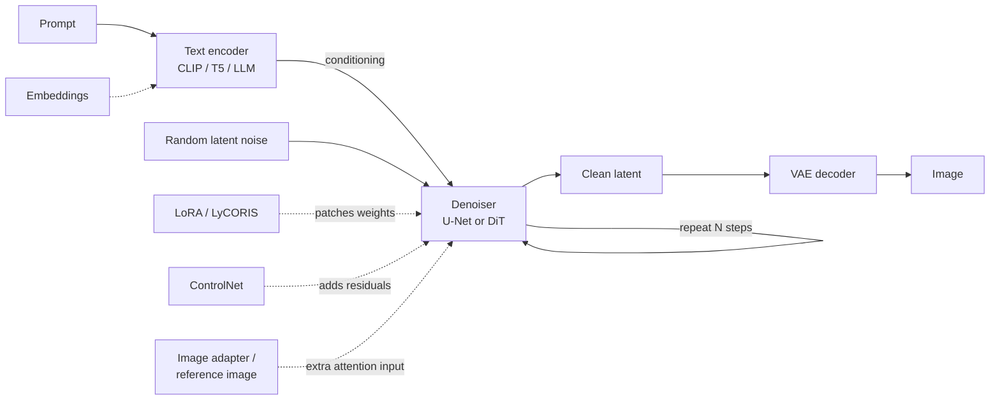
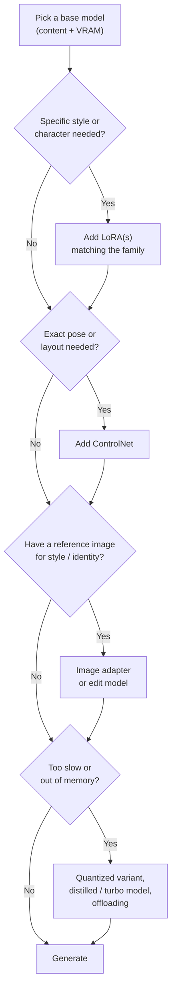

[AI/ML Documentation](./) &raquo; Model Types Explained

A diffusion image generator is not one file. It is a pipeline of separately trained networks: a **text encoder** that turns the prompt into embeddings, a **denoiser** (U-Net or diffusion transformer) that generates in a compressed latent space, and a **VAE** that decodes latents into pixels. Around that core sit **add-ons**: LoRAs and other adapters that change the denoiser's behavior, and control models that steer it with images. This page explains what each component is, how the model families differ, which file formats and precisions you will run into, and what is compatible with what.

## Quick Reference

| Component | Role | Required? | Typical size | Details |
|-----------|------|-----------|--------------|---------|
| Denoiser (U-Net / DiT) | Generates the image in latent space; the "model" | Yes | 1.7-64 GB | [Base models](#base-models-and-families) |
| Text encoder | Converts the prompt into conditioning vectors | Yes | 0.25-48 GB | [Text encoders](#text-encoders) |
| VAE | Encodes pixels to latents and decodes latents to pixels | Yes | 80-350 MB | [VAE](#vae-variational-autoencoder) |
| LoRA / LyCORIS | Small learned weight delta: style, character, concept | No | 5-500 MB | [LoRA](#lora-and-lycoris) |
| ControlNet / control LoRA | Conditions on structure (pose, depth, edges) | No | 0.3-3.5 GB | [ControlNet](#controlnet-and-structural-control) |
| Image adapter / edit model | Uses reference images for style, identity, or edits | No | 0.1-20 GB | [Image prompting](#image-prompting-and-editing) |
| Embedding (textual inversion) | New "word" vectors for a CLIP text encoder | No | 4-200 KB | [Embeddings](#embeddings-textual-inversion) |

A **checkpoint** in the SD 1.5/SDXL sense is a single `.safetensors` file that bundles the denoiser, text encoder(s), and VAE. Newer and larger models are usually distributed as **separate component files** instead, because the text encoder alone can be larger than an entire SDXL checkpoint and is often swapped for a quantized copy.

## How the Components Fit Together



1. The **text encoder** runs once per prompt and produces a sequence of embedding vectors (plus, for some models, a pooled summary vector).
2. The **denoiser** starts from random noise in latent space and removes noise over a series of steps (roughly 20-50 for standard models, 1-8 for distilled ones). At each step it attends to the text embeddings. Classifier-free guidance (CFG) usually runs it twice per step, once with and once without the prompt.
3. The **VAE decoder** turns the final latent into pixels. For all current families the latent is 8x smaller than the image in each spatial dimension, so a 1024x1024 image is denoised as a 128x128 latent.

The dashed add-ons never replace the base model. A LoRA patches its weights, a ControlNet injects extra features, and an image adapter adds another input for attention. That is why add-ons are tied to one specific base architecture. See [Stable Diffusion Fundamentals](stable-diffusion-fundamentals.html) for the underlying diffusion process.

## Base Models and Families

The denoiser defines the **family**, and the family decides which text encoder, VAE, LoRAs, and control models are compatible. The field moved from convolutional U-Nets (SD 1.5, SDXL) to **diffusion transformers** (DiT/MMDiT) trained with flow matching (SD3, FLUX, Qwen-Image, Z-Image), and from CLIP text encoders to T5 and then to full LLM or vision-language encoders.

| Family | Released | Denoiser | Params | Text encoder(s) | Latent channels | License (weights) |
|--------|----------|----------|--------|-----------------|-----------------|-------------------|
| SD 1.5 | 2022 | U-Net | ~0.86B | CLIP ViT-L/14 | 4 | CreativeML OpenRAIL-M |
| SDXL (and Pony, Illustrious, NoobAI) | 2023 | U-Net | ~2.6B | CLIP ViT-L + OpenCLIP ViT-bigG | 4 | OpenRAIL++-M |
| SD 3.5 Large / Medium | 2024 | MMDiT | 8.1B / 2.5B | CLIP-L + CLIP-G + T5-XXL | 16 | Stability Community |
| FLUX.1 [dev] / [schnell] | 2024 | MMDiT + single-stream DiT | 12B | CLIP-L + T5-XXL | 16 | Non-commercial / Apache 2.0 |
| FLUX.2 [dev] | Nov 2025 | DiT | 32B | Mistral Small 3.x (24B) | New FLUX.2 VAE | Non-commercial |
| FLUX.2 [klein] | Jan 2026 | DiT | 4B / 9B | Qwen3 | FLUX.2 VAE | 4B: Apache 2.0; 9B: non-commercial |
| Qwen-Image | Aug 2025 | MMDiT | 20B | Qwen2.5-VL 7B | 16 | Apache 2.0 |
| Z-Image (Turbo) | Late 2025 | Single-stream DiT | 6B | Qwen3-4B | 16 | Apache 2.0 |

Parameter counts are for the denoiser only. Check each model card for exact license terms, which vary between variants. Pony Diffusion V6, Illustrious-XL, and NoobAI-XL are SDXL-architecture fine-tunes: they load anywhere SDXL loads, but their LoRAs work best within their own lineage. See [Pony and Fine-Tunes](pony-and-finetunes.html), [SDXL](sdxl-guide.html), [SD3](sd3-guide.html), [FLUX](flux-guide.html), and [Base Models Comparison](base-models-comparison.html) for per-family guidance.

### Choosing a base model by content

| Goal | Good starting points |
|------|----------------------|
| General-purpose, prompt adherence | FLUX.1 [dev], FLUX.2, Qwen-Image |
| Legible text in images, layouts, posters | Qwen-Image, FLUX.2, Z-Image |
| Photorealism on consumer GPUs | Z-Image Turbo, FLUX.1 fine-tunes, SDXL photo fine-tunes (e.g. Juggernaut XL, RealVisXL) |
| Anime / illustration | Illustrious-XL and NoobAI-XL derivatives, Pony V6 |
| Low VRAM (6-8 GB), huge LoRA ecosystem | SDXL fine-tunes; SD 1.5 for very old hardware |
| Instruction-based editing | FLUX.1 Kontext [dev], Qwen-Image-Edit, FLUX.2 (multi-reference) |

## File Formats and Precision Variants

### Container formats

| Format | Extension | Notes |
|--------|-----------|-------|
| SafeTensors | `.safetensors` | The standard. Stores tensors only, so it cannot run code; memory-mappable and fast to load |
| Pickle checkpoint | `.ckpt`, `.pt`, `.bin` | Legacy. Python pickle can execute arbitrary code on load; avoid untrusted files |
| GGUF | `.gguf` | Block-quantized weights (from llama.cpp), loaded in ComfyUI via the ComfyUI-GGUF custom nodes |
| Diffusers folder | directory with `model_index.json` | Hugging Face layout, one subfolder per component; used from Python |

### Single-file vs. split components

SD 1.5 and SDXL are usually shared as one all-in-one checkpoint. FLUX, SD 3.5, Qwen-Image, Z-Image, and video models such as Wan are usually shared as **separate files**: a diffusion-model file, one or more text-encoder files, and a VAE file. In ComfyUI these go in different folders and use different loader nodes, such as *Load Diffusion Model*, *Load CLIP* / *DualCLIPLoader*, and *Load VAE*.

### Precision variants

The same model is often published at several precisions. Smaller variants need less VRAM. Quality loss is negligible at 8 bits and noticeable in fine detail at 4 bits.

| Variant | Bits per weight | Size vs. BF16 | Runs fast on | Notes |
|---------|-----------------|---------------|--------------|-------|
| `bf16` / `fp16` | 16 | 1x | Any modern GPU | Reference quality |
| `fp8_e4m3fn` (and "scaled" fp8) | 8 | ~0.5x | Ada, Hopper, Blackwell (older GPUs upcast) | The most common way to fit FLUX-class models |
| GGUF `Q8_0` | ~8.5 | ~0.53x | Any GPU (dequantized on the fly) | Close to bf16 quality |
| GGUF `Q5_K` / `Q4_K` | ~5.5 / ~4.5 | ~0.35x / ~0.3x | Any GPU | Lets 12B-20B models run on 8-12 GB cards |
| NVFP4 / SVDQuant (Nunchaku) | ~4 | ~0.28x | Blackwell (FP4); SVDQuant INT4 on older GPUs | Also *faster*, not just smaller |

For the mechanics of these formats, see [Model Compression](model-compression.html#quantization) and [Optimization & Performance](optimization-guide.html#quantization-for-diffusion-models).

## Text Encoders

The text encoder decides how well a model understands the prompt. Each generation of models has used a more capable encoder:

| Encoder | Used by | Max tokens | Best prompt style |
|---------|---------|------------|-------------------|
| CLIP ViT-L/14 | SD 1.5 (and SDXL, SD3, FLUX.1 as a second encoder) | 77 per chunk | Comma-separated tags and short phrases |
| OpenCLIP ViT-bigG | SDXL, SD 3.5 (as "CLIP-G") | 77 per chunk | Tags plus short sentences |
| T5-XXL (encoder only, ~4.7B) | SD 3.5, FLUX.1 | 256 (schnell) / 512 (dev) | Full natural-language descriptions |
| LLM / VLM encoders | FLUX.2 (Mistral Small), Qwen-Image (Qwen2.5-VL), Z-Image and FLUX.2 [klein] (Qwen3) | Long | Detailed natural language; understands layout, counting, and text to render |

- **The 77-token limit** belongs to CLIP. UIs such as ComfyUI and A1111 work around it by splitting long prompts into 77-token chunks and concatenating the embeddings, which works but weakens attention to later chunks.
- **CLIP skip** takes the embedding from an earlier CLIP layer. Many anime fine-tunes of SD 1.5 were trained with CLIP skip 2 and look worse without it. SDXL fine-tunes vary, so follow the model card. CLIP skip has no meaning for T5 or LLM encoders.
- **Prompt weighting** syntax such as `(word:1.3)` was designed around CLIP embeddings. Its effect on T5 and LLM encoders is weaker and less predictable.
- **Encoder size matters for VRAM.** FLUX.1's T5-XXL is ~9.5 GB in bf16, and FLUX.2's 24B text encoder is larger than its entire denoiser was a generation ago. Loading the encoder in fp8 or GGUF, or offloading it after encoding, is often the cheapest VRAM win. The encoder runs only once per prompt, so offloading it costs almost nothing.

## VAE (Variational Autoencoder)

The **VAE** compresses images into the latent space the denoiser works in, and decodes the result back to pixels. Every family has its own VAE, and a latent from one family's denoiser cannot be decoded by another family's VAE.

| VAE | Used by | Latent channels | Notes |
|-----|---------|-----------------|-------|
| SD 1.x VAE (`kl-f8`), `vae-ft-mse-840000-ema` | SD 1.5 | 4 | The fine-tuned MSE version gives cleaner faces; baked into most fine-tunes |
| SDXL VAE, `sdxl-vae-fp16-fix` | SDXL, Pony, Illustrious | 4 | The original produces NaNs (black images) in fp16; use the fp16-fix or run the VAE in fp32/bf16 |
| SD3 / FLUX.1 VAE | SD 3.5, FLUX.1 | 16 | More channels keep far more fine detail and text |
| FLUX.2 VAE | FLUX.2 | New design | Retrained autoencoder, Apache 2.0 licensed |

More latent channels means less information is lost in compression. That is a large part of why the 16-channel models render small text and textures so much better than SD 1.5/SDXL.

**When to change the VAE.** Consider it for faded or desaturated colors (common with SD 1.5 fine-tunes that shipped without a baked VAE), for black or NaN images from SDXL in fp16, or for a VAE mismatch after merging models. Otherwise, use the VAE that ships with the model.

**Tiled VAE.** Decoding a high-resolution latent is a memory spike of its own. Tiled decoding (ComfyUI *VAE Decode (Tiled)*, diffusers `enable_vae_tiling()`) processes overlapping tiles and uses far less peak memory, at a small speed cost and occasionally faint seams.

## LoRA and LyCORIS

A **LoRA** (Low-Rank Adaptation) stores a learned *difference* to some of the denoiser's weight matrices (and optionally the text encoder's) as the product of two thin matrices. At load time the difference is added to the base weights, scaled by a user-chosen strength. This makes LoRAs small and stackable, and it also means they only fit the architecture they were trained on. How LoRAs are trained is covered in [LoRA Training](lora-training.html).

### Using LoRAs

| LoRA purpose | Typical strength | Notes |
|--------------|------------------|-------|
| Style | 0.6-1.0 | Can override a base model's look entirely |
| Character / likeness | 0.7-1.0 | Usually needs a trigger word |
| Concept (object, pose, clothing) | 0.5-0.9 | Weaker settings blend better with other LoRAs |
| Detail / quality tweaker | 0.2-0.6 | Some are designed to be used at negative strength too |

- **Trigger words.** Many LoRAs were trained with a specific token or phrase in their captions. Include it in the prompt. It is listed on the model page or in the file's metadata (`ss_tag_frequency`).
- **Stacking.** Effects add, so two strong LoRAs can over-saturate or distort the image. Lower each strength as you add more, and watch for LoRAs that fight over the same features, such as two faces or two styles.
- **Model vs. CLIP strength.** ComfyUI's *LoraLoader* has separate strengths for the denoiser and the text encoder. Most modern LoRAs, including nearly all FLUX LoRAs, train only the denoiser.

### LyCORIS and other variants

**LyCORIS** is a family of LoRA-like parameterizations with different trade-offs. Current tools (ComfyUI, Forge, diffusers via PEFT) load the common ones directly.

| Variant | Idea | Typical use |
|---------|------|-------------|
| LoRA | $\Delta W = BA$, low-rank product | Default for everything |
| LoCon | LoRA extended to convolution layers | Styles and textures on U-Net models |
| LoHa | Hadamard product of two low-rank products | More expressive at the same file size |
| LoKr | Kronecker-product factorization | Very small files; popular for FLUX and SDXL |
| DoRA | Separates weight *magnitude* and *direction*, applies LoRA to direction | Often closer to full fine-tune quality |

### Compatibility

A LoRA works only with the architecture it was trained for:

| LoRA trained on | Works with |
|-----------------|------------|
| SD 1.5 | SD 1.5 and its fine-tunes |
| SDXL | SDXL, Pony, Illustrious, NoobAI (best within the same lineage) |
| SD 3.5 Large / Medium | The same SD 3.5 size only |
| FLUX.1 [dev] | FLUX.1 [dev], [schnell], and FLUX.1 fine-tunes (quality varies on schnell) |
| FLUX.2, Qwen-Image, Z-Image | Only the same model family (and usually the same size) |

Loading a LoRA on the wrong architecture fails outright ("keys not found" or shape mismatch) or does nothing. Loading an SDXL LoRA on a *distant* SDXL fine-tune loads fine but can give weak or odd results.

## ControlNet and Structural Control

A **ControlNet** is a trainable copy of the denoiser's encoder that takes a control image (pose skeleton, depth map, edges, and so on) and adds its features into the base model, so the output follows that structure. Full coverage, including preprocessors, is in [ControlNet](controlnet.html).

| Goal | Control type | Preprocessor output |
|------|--------------|---------------------|
| Match a human pose | OpenPose / DWPose | Stick-figure skeleton |
| Keep spatial layout and depth | Depth (Depth Anything, MiDaS) | Grayscale depth map |
| Keep outlines precisely | Canny, Lineart | Edge map |
| Sketch to image | Scribble, Lineart | Rough strokes |
| Keep composition loosely | Tile, Blur | Downscaled / blurred source |

- **Union / Pro models.** A single ControlNet that accepts many control types, such as Xinsir's ControlNet Union for SDXL and InstantX/Shakker Union for FLUX.1. One file replaces a folder of single-purpose models.
- **Lighter alternatives.** T2I-Adapters are small and fast. For FLUX.1, Black Forest Labs' official *FLUX.1 Canny/Depth* came as both full models and control LoRAs.
- **Strength and timing.** Strength 0.5-0.8 guides the image while leaving the model room to work. 1.0 is strict. Applying control only over the first 30-60% of steps (*start/end percent*) fixes composition and leaves details free.

## Image Prompting and Editing

Several kinds of model let a *reference image* steer generation. They differ in what they take from the image:

| Approach | Examples | What it takes from the reference |
|----------|----------|----------------------------------|
| Image-prompt adapters | IP-Adapter (Plus, FaceID), FLUX.1 Redux | Style, subject, overall look, via image embeddings in extra cross-attention |
| Identity adapters | InstantID, PuLID | A specific face, kept consistent across poses |
| Instruction editing models | FLUX.1 Kontext, Qwen-Image-Edit | Whole image, changed according to a text instruction ("make it night", "replace the text") |
| Native multi-reference | FLUX.2 | Several reference images combined in one generation |

**Adapters vs. ControlNet.** An image adapter says what the output should *look like* (style, identity, content). A ControlNet says where things should *be* (structure). They combine well: IP-Adapter for style plus OpenPose for pose gives a specific character in a specific pose.

Edit models have taken over much of what inpainting and adapter stacks used to do. See [Inpainting & Editing](inpainting-editing.html).

## Embeddings (Textual Inversion)

A **textual inversion embedding** is a handful of learned vectors that act as a new "word" in a CLIP text encoder's vocabulary. The model's weights are not changed, which makes the files tiny (kilobytes). The trade-off is that an embedding can only express what the frozen model can already draw.

- **Main use today:** negative embeddings for SD 1.5 and SDXL, such as *EasyNegative* and *badhandv4* for SD 1.5 and assorted SDXL equivalents. You reference them by filename in the negative prompt, for example `embedding:EasyNegative` in ComfyUI.
- **Compatibility:** an embedding is tied to its text encoder. SD 1.5 embeddings don't work on SDXL (which needs vectors for both of its CLIP encoders). Embeddings have essentially no role with T5 or LLM encoders, so there is no FLUX, SD 3.5, or Qwen-Image equivalent in common use.

## Legacy: Hypernetworks

**Hypernetworks** were small networks that modified the cross-attention layers of SD 1.x. LoRAs replaced them in 2023 because LoRAs are smaller, faster, easier to train, and give better results. You will only meet hypernetworks in old SD 1.5 archives.

## Model Merging

Merging combines the weights of models *of the same architecture* into a new checkpoint. Many popular community checkpoints are merges.

| Method | Formula | Use |
|--------|---------|-----|
| Weighted sum | $W = (1-\alpha) W_A + \alpha W_B$ | Blend two fine-tunes' looks |
| Add difference | $W = W_A + \lambda\,(W_B - W_C)$ | Transplant what fine-tune B learned relative to its base C onto model A |
| Block-weighted | Different $\alpha$ per U-Net/DiT block | Take composition from one model and detail from another |
| TIES / DARE | Prune and resolve sign conflicts between task vectors before adding | Merge several fine-tunes with less interference |
| LoRA baking | $W = W_{\text{base}} + s \cdot BA$ | Make a LoRA permanent in a checkpoint |

Merging is empirical. Results are hard to predict, and a merged model's license is bounded by the most restrictive ingredient.

## Speed-Optimized Variants

**Step-distilled** models generate in 1-8 denoising steps instead of 20-50, trading some diversity and fine detail for speed. They usually need CFG near 1 and a matching sampler and scheduler.

| Variant | Form | Steps | Base |
|---------|------|-------|------|
| LCM-LoRA, TCD | LoRA | 4-8 | SD 1.5, SDXL |
| SDXL-Turbo, SD-Turbo | Checkpoint | 1-4 | SDXL / SD 2.1 |
| SDXL-Lightning, Hyper-SD, DMD2 | LoRA or checkpoint | 1-8 | SDXL (Hyper-SD also FLUX.1) |
| FLUX.1 [schnell] | Checkpoint | 1-4 | FLUX.1 |
| FLUX.2 [klein] (distilled) | Checkpoint | ~4 | FLUX.2 |
| Z-Image Turbo | Checkpoint | ~8 | Z-Image |
| Lightning/turbo LoRAs for Qwen-Image, Wan | LoRA | 4-8 | Respective family |

*Guidance-distilled* models such as FLUX.1 [dev] are a separate case. They take guidance as an input and run one pass per step instead of two, but they still need about 20-30 steps. See [Optimization & Performance](optimization-guide.html#fewer-steps-distilled-models-and-caching).

## Memory Requirements

Approximate weight sizes. Peak VRAM is higher because activations add to it, and it depends on resolution and batch size.

| Model | bf16 / fp16 | fp8 / Q8 | ~4-bit (GGUF Q4 / NVFP4) |
|-------|-------------|----------|---------------------------|
| SD 1.5 (all-in-one) | ~2 GB | - | - |
| SDXL (all-in-one) | ~6.5 GB | ~3.5 GB | - |
| SD 3.5 Large (denoiser) | ~16 GB | ~8 GB | ~5 GB |
| FLUX.1 [dev] (denoiser) | ~24 GB | ~12 GB | ~7 GB |
| T5-XXL encoder | ~9.5 GB | ~4.9 GB | ~3 GB |
| Qwen-Image (denoiser) | ~41 GB | ~20 GB | ~12 GB |
| Z-Image (denoiser) | ~12 GB | ~6 GB | ~4 GB |
| FLUX.2 [dev] (denoiser) | ~64 GB | ~32 GB | ~18 GB |
| LoRA | 5-500 MB | | |
| ControlNet (SDXL / FLUX.1) | 1.2-3.5 GB | | |

The weights don't all need to be on the GPU at once. The text encoder, denoiser, and VAE run one after another, and ComfyUI and diffusers offload whichever component is idle. That is how a 12 GB card runs FLUX.1 [dev] in fp8. See [Optimization & Performance](optimization-guide.html) for offloading and other VRAM tactics.

## Organizing Model Files

ComfyUI's default layout, which other tools largely mirror:

```
models/
├── checkpoints/       # All-in-one SD 1.5 / SDXL checkpoints
├── diffusion_models/  # Standalone denoisers: FLUX, SD 3.5, Qwen-Image, Z-Image, Wan
│                      #   (older name: unet/)
├── text_encoders/     # CLIP-L, CLIP-G, T5-XXL, Qwen, Mistral encoders (older name: clip/)
├── vae/               # Standalone VAEs
├── loras/             # LoRA and LyCORIS files
├── controlnet/        # ControlNets, T2I-Adapters
├── clip_vision/       # Image encoders used by IP-Adapter / Redux
├── embeddings/        # Textual inversions
└── upscale_models/    # ESRGAN-style upscalers
```

Put the family and precision in filenames (for example `detailer_lora_sdxl.safetensors` or `flux1-dev_fp8_e4m3fn.safetensors`). Architecture mismatch is the most common cause of silent failures.

## Choosing Components

Start with a base model that fits your content and hardware, and add components only when a specific need comes up:



## See Also

- [Stable Diffusion Fundamentals](stable-diffusion-fundamentals.html) - How latent diffusion works
- [Base Models Comparison](base-models-comparison.html) - Family-by-family comparison
- [FLUX Guide](flux-guide.html) - FLUX.1 and FLUX.2 in detail
- [LoRA Training](lora-training.html) - Training your own LoRAs
- [ControlNet](controlnet.html) - Structural control in depth
- [ComfyUI Guide](comfyui-guide.html) - Wiring these components together in node workflows
- [Model Compression](model-compression.html) - How quantized variants are produced
- [AI/ML Documentation Hub](./) - Complete AI/ML documentation index
