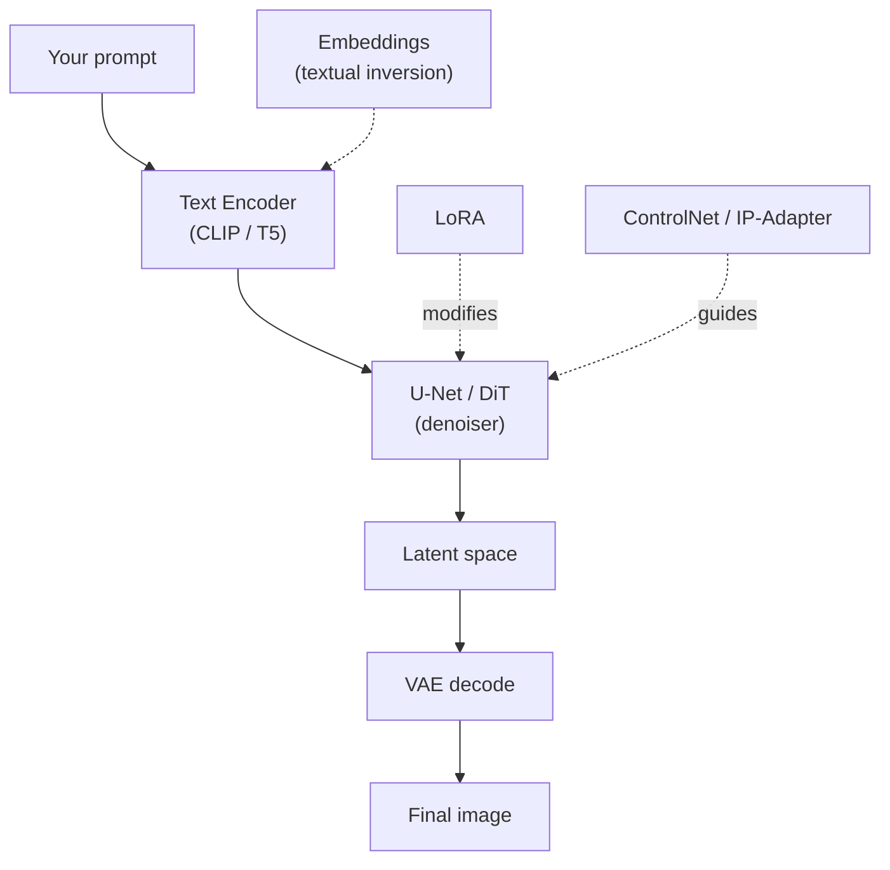
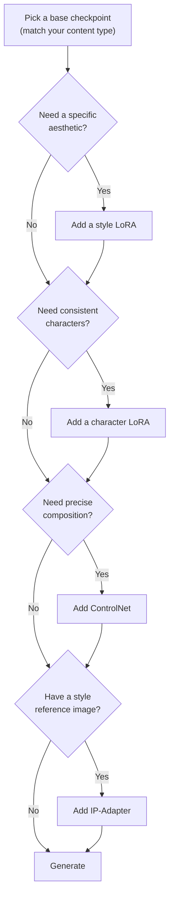

<div class="hero-section" style="background: linear-gradient(135deg, #667eea 0%, #764ba2 100%); color: white; padding: 3rem 2rem; margin: -2rem -3rem 2rem -3rem; text-align: center;">
  <h1 style="color: white; margin: 0; font-size: 2.5rem;">Model Types Explained</h1>
  <p style="font-size: 1.25rem; margin-top: 1rem; opacity: 0.9;">A practical guide to checkpoints, LoRAs, VAEs, ControlNet, and other AI image generation components - what each does and how they work together.</p>
</div>

[AI/ML Documentation](./) &raquo; Model Types Explained

<div class="code-example" markdown="1">
A practical guide to the building blocks of AI image generation: what each component does, when to use it, and how they work together.
</div>

## Quick Reference: Model Types at a Glance

Start here. This table is the at-a-glance map of every component covered on this page — skim it to find what you need, then jump to the matching section below for detail. The two structural sections that follow ([How Components Work Together](#how-components-work-together) and the per-component reference) explain the *why*; the [decision guide at the end](#choosing-models-a-decision-guide) ties them together into a recommended build order.

| Component | What It Does | When You Need It | Size | Detail |
|-----------|-------------|------------------|------|--------|
| Checkpoint | The complete base model | Always required | 2-12 GB | [Jump](#base-models-checkpoints) |
| LoRA | Adds styles, characters, or concepts | Custom content | 10-300 MB | [Jump](#lora-low-rank-adaptation) |
| VAE | Handles image compression/decompression | Usually included, swap for color issues | 300-500 MB | [Jump](#vae-variational-autoencoder) |
| Text Encoder | Interprets your prompt | Usually included, rarely changed | 500 MB-10 GB | [Jump](#text-encoders-clip-and-t5) |
| ControlNet | Guides composition with reference images | Precise pose/layout control | 1-2 GB | [Jump](#controlnet) |
| Embedding | Teaches new words to the text encoder | Simple concepts, quality tags | 10-100 KB | [Jump](#embeddings-textual-inversions) |
| IP-Adapter | Uses images as prompts | Style transfer, character consistency | 500 MB-1 GB | [Jump](#ip-adapter) |

> **In a hurry?** You only *need* a checkpoint to start. Everything else is optional and additive. Skip to [Choosing Models: A Decision Guide](#choosing-models-a-decision-guide) for a build order, or read on for what each piece does.

### Why Understanding Model Types Matters

When you generate an image, multiple specialized components work together. Understanding what each one does helps you:

- **Troubleshoot problems** - Know which component to adjust when results disappoint
- **Optimize your setup** - Use the right models for your hardware and goals
- **Combine models effectively** - Stack LoRAs and choose compatible components
- **Make informed downloads** - Understand what you are getting from model repositories

You do not need to understand every model type before generating images. Start with a base model (checkpoint) and add components as your needs grow. This guide serves as a reference for when you want to customize your workflow.

## How Components Work Together

The generation pipeline flows through several stages, with optional components plugging into the U-Net:



Each component can be swapped or enhanced independently. This modularity is what makes the ecosystem so flexible: the dashed arrows are optional add-ons that steer or augment the base model without retraining it.

---

## Component Reference

The sections below cover each component in turn — what it is, when to reach for it, and how to use it well. They follow the pipeline order from the [Quick Reference](#quick-reference-model-types-at-a-glance): the required checkpoint first, then the optional add-ons that plug into it. Skip to whichever one you came for.

## Base Models (Checkpoints)

Checkpoints are complete models that can generate images on their own. Every other component modifies or enhances what a checkpoint can do.

### Choosing a Checkpoint

Your checkpoint choice fundamentally shapes your results. Different checkpoints excel at different content types:

| Checkpoint Type | Best For | Examples |
|-----------------|----------|----------|
| General purpose | Wide variety of content | SDXL Base, SD 1.5 |
| Photorealistic | Photographs, portraits | Juggernaut, RealVisXL |
| Anime/Illustration | Stylized art, characters | Pony, Anything v5 |
| Artistic | Paintings, creative styles | Deliberate, DreamShaper |

### File Formats Explained

| Format | Extension | Why Choose It |
|--------|-----------|---------------|
| SafeTensors | .safetensors | Preferred - secure and fast loading |
| CKPT | .ckpt | Legacy - only if SafeTensors unavailable |
| GGUF | .gguf | Quantized - smaller size, lower VRAM |
| Diffusers | folder | HuggingFace - for programmatic use |

**When to use quantized models:** If a full checkpoint exceeds your VRAM, look for fp16 or fp8 versions. Quality loss is minimal for most uses.

## LoRA (Low-Rank Adaptation)

LoRAs are the most common way to customize base models. They teach existing models new styles, characters, or concepts without replacing the entire checkpoint.

### Why Use LoRAs

- **Small size** - A 50MB LoRA can add a new art style that would require a 6GB checkpoint otherwise
- **Combinable** - Stack multiple LoRAs to get character + style + enhancement together
- **Preserves flexibility** - The base model retains all its capabilities

### Types of LoRAs

| LoRA Type | What It Adds | Typical Strength | Use Case |
|-----------|-------------|------------------|----------|
| Style | Artistic rendering style | 0.6-1.0 | "Watercolor painting", "80s anime" |
| Character | Specific person/character | 0.7-0.9 | Consistent character across images |
| Concept | Objects, poses, clothing | 0.5-0.8 | Specific items or compositions |
| Enhancement | Quality improvements | 0.3-0.6 | Detail boost, hand fixes |

### Using LoRAs Effectively

**Strength settings:** Start at 0.7 and adjust. Too high causes artifacts; too low has no effect.

**Trigger words:** Most LoRAs require specific words in your prompt to activate. Check the model page for required triggers.

**Stacking multiple LoRAs:**
- Reduce strength as you add more (e.g., 0.7, 0.5, 0.3)
- Watch for conflicts between similar LoRAs
- Style + Character + Enhancement is a common effective stack

### Compatibility

LoRAs are only compatible with the model architecture they were trained on:

| LoRA Trained On | Works With |
|-----------------|------------|
| SD 1.5 | SD 1.5 checkpoints only |
| SDXL | SDXL checkpoints only |
| FLUX | FLUX checkpoints only |

Mixing architectures does not work.

## Text Encoders (CLIP and T5)

Text encoders translate your prompt into numbers the model understands. Different model generations use different encoders with different capabilities.

### Text Encoder Comparison

| Model | Text Encoder | Max Words | Prompt Style |
|-------|--------------|-----------|--------------|
| SD 1.5 | CLIP ViT-L | ~77 tokens | Tags and keywords |
| SDXL | CLIP + OpenCLIP | ~77 tokens each | Mixed tags and sentences |
| FLUX/SD3 | T5-XXL | ~256 tokens | Natural language |

### When Text Encoders Matter

**CLIP Skip** - For anime-style checkpoints, CLIP Skip 2 often produces better results. This setting is found in advanced options.

**Prompt length** - If your prompts exceed token limits, later words get ignored. T5-based models (FLUX, SD3) handle longer prompts better.

**Natural language vs tags** - CLIP understands "a cat, sitting, orange fur" well. T5 understands "An orange cat sitting on a windowsill in the afternoon sun" better.

### Practical Advice

Most users never need to change text encoders. Focus on writing better prompts instead. If you are using an anime checkpoint and results seem off, try CLIP Skip 2.

## VAE (Variational Autoencoder)

The VAE handles the final step of converting the model's internal representation into a visible image. Most checkpoints include a VAE, but swapping it can improve colors and details.

### When to Swap VAEs

Change your VAE when you notice:
- Washed-out or dull colors
- Strange color tints
- Lack of contrast
- Poor skin tones in portraits

### Recommended VAEs by Use Case

| Use Case | VAE Choice | Effect |
|----------|------------|--------|
| General SD 1.5 | vae-ft-mse-840000 | Balanced, reliable |
| Anime/Art | vae-ft-ema-560000 | Brighter, more saturated |
| SDXL | sdxl_vae | Optimized for SDXL resolution |
| Photorealism | blessed2.vae | Better color accuracy |

### Tiled VAE for Large Images

If decoding high-resolution images causes memory errors, enable "Tiled VAE" in your workflow tool. This processes the image in chunks, using less memory at the cost of slightly longer processing time.

## ControlNet

ControlNet gives you precise control over composition by using reference images to guide generation. Instead of hoping your prompt produces the right pose or layout, you can show the model exactly what you want.

### When to Use ControlNet

| Goal | ControlNet Type | How It Works |
|------|-----------------|--------------|
| Match a pose | OpenPose or DWPose | Extracts skeleton from reference |
| Keep architectural structure | Canny or Depth | Preserves edges or spatial layout |
| Turn sketch to image | Scribble | Follows rough drawn lines |
| Match lighting/depth | Depth | Maintains 3D spatial relationships |
| Follow reference composition | Canny | Traces important edges |

### Practical Usage

1. **Choose your reference image** - A photo with the pose/composition you want
2. **Pick the right preprocessor** - Match to your control type (OpenPose for poses, Canny for edges)
3. **Adjust strength** - Start at 0.7-1.0, lower if results are too rigid
4. **Write your prompt** - Describe the content, let ControlNet handle composition

### ControlNet Strength Tips

| Strength | Effect | When to Use |
|----------|--------|-------------|
| 0.3-0.5 | Light guidance, flexible | Loose inspiration from reference |
| 0.7-0.9 | Strong guidance, some freedom | Most use cases |
| 1.0+ | Strict adherence | Exact pose/layout reproduction |

**Start/End percent:** For advanced control, you can have ControlNet apply only during certain steps. Early steps affect composition; later steps affect details.

## Embeddings (Textual Inversions)

Embeddings are tiny files (usually under 100KB) that teach the text encoder new words. They are simpler and smaller than LoRAs but less powerful.

### When Embeddings Make Sense

| Use Case | Why Embedding | Why Not LoRA |
|----------|---------------|--------------|
| Negative prompts | "EasyNegative" captures many bad patterns | Overkill for quality filtering |
| Simple concepts | Quick to train, easy to share | LoRA needed for complex concepts |
| Combining many | Dozens can stack with minimal overhead | LoRAs consume more memory |

### Common Negative Embeddings

These popular embeddings improve quality when added to negative prompts:

- **EasyNegative** - General quality improvement
- **BadHands** - Reduces hand deformities
- **NG_DeepNegative** - Alternative quality filter

### Using Embeddings

Add the embedding name to your prompt:
- Positive: `"photo in xyz_style, portrait"`
- Negative: `"EasyNegative, blurry, low quality"`

Most workflow tools automatically load embeddings from a designated folder.

## Hypernetworks

Hypernetworks are an older technology largely superseded by LoRAs. They modify model behavior but are slower and typically produce lower quality results.

### Should You Use Hypernetworks?

Generally no. LoRAs are better in almost every way. The main reason to use hypernetworks is when you find one trained for a specific style that has no LoRA equivalent.

## Advanced LoRA Variants (LyCORIS)

Several improved LoRA techniques exist, collectively called LyCORIS (LoRA beYond Conventional). These offer better quality for specific use cases but require compatible workflow tools.

### When to Consider Advanced Variants

| Variant | Best For | Trade-off |
|---------|----------|-----------|
| LoCon | Style transfer, textures | Slightly larger files |
| LoHa | Maximum quality | Slower training, larger files |
| LCM-LoRA | Fast generation (4-8 steps) | Specific to speed optimization |
| DoRA | Better weight learning | Newer, less tested |

### Practical Recommendation

**Start with standard LoRAs.** They work everywhere and produce good results. Only explore LyCORIS variants when you have specific quality needs that standard LoRAs cannot meet.

LCM-LoRA is the notable exception - it serves a specific purpose (faster generation) and is worth using when speed matters.

## Model Merging

You can combine multiple models to create hybrids that blend their characteristics.

### Why Merge Models

- **Combine strengths** - Blend a photorealistic model with an artistic one
- **Reduce LoRA overhead** - Merge frequently-used LoRAs into a checkpoint
- **Create unique styles** - Experiment with combinations others have not tried

### Basic Merge Concept

Most merges blend two models with weights:
- 70% Model A + 30% Model B = Merged result
- Adjust ratios to favor one model's characteristics

### Practical Advice

Model merging is experimental. Results are unpredictable. If you find a merged model you like, keep it. If merging a LoRA into a checkpoint simplifies your workflow, do it. Otherwise, simpler setups with LoRAs are usually easier to manage.

## IP-Adapter

IP-Adapter lets you use images as part of your prompt. Instead of describing a style in words, you can show an example image and say "generate something in this style."

### When to Use IP-Adapter

| Goal | IP-Adapter Variant | How It Helps |
|------|-------------------|--------------|
| Match an art style | IP-Adapter or Plus | Captures color palette, brushwork |
| Keep character consistent | IP-Adapter Face | Maintains facial features across images |
| Use reference composition | IP-Adapter | Guides layout and arrangement |
| Blend multiple references | IP-Adapter Plus | Combine multiple image influences |

### IP-Adapter vs ControlNet

These serve different purposes:

| Feature | IP-Adapter | ControlNet |
|---------|------------|------------|
| Controls | Style, color, general feel | Structure, pose, edges |
| Reference type | Aesthetic inspiration | Compositional guidance |
| Flexibility | More creative interpretation | More precise following |

**Use together:** IP-Adapter for style reference + ControlNet for pose = character in specific style doing specific pose.

## Organizing Your Models

As your collection grows, organization becomes important for finding the right model quickly.

### Recommended Folder Structure

```
models/
├── checkpoints/     # Base models (2-12 GB each)
├── loras/           # LoRA models (10-300 MB each)
├── vae/             # VAE models (~300 MB each)
├── controlnet/      # Control models (~1 GB each)
├── embeddings/      # Textual inversions (~100 KB each)
└── ipadapter/       # IP-Adapter models (~500 MB each)
```

### Naming Tips

- Include the base model compatibility: `style_lora_sdxl.safetensors`
- Add version numbers for iterations: `character_v2.safetensors`
- Note the format: `flux_fp8.safetensors`

## Speed-Optimized Models

Recent developments focus on faster generation without sacrificing too much quality.

### LCM and Turbo Models

| Model Type | Steps Needed | Trade-off |
|------------|--------------|-----------|
| Standard | 30-50 | Highest quality |
| LCM | 4-8 | Slight quality loss, much faster |
| Turbo | 1-4 | Fastest, noticeable quality trade-off |

**When to use:** LCM-LoRAs are useful for rapid iteration. Turbo models work for real-time applications where speed matters more than perfection.

## Memory and Performance

### VRAM Usage Reference

| Component | Approximate VRAM |
|-----------|-----------------|
| SD 1.5 checkpoint | 2-4 GB |
| SDXL checkpoint | 6-8 GB |
| FLUX (fp8) | 12-16 GB |
| LoRA | 100-300 MB |
| ControlNet | 1-2 GB |
| IP-Adapter | 500 MB-1 GB |

### Reducing Memory Usage

1. Use quantized models (fp16, fp8)
2. Enable model offloading to CPU
3. Load fewer simultaneous components
4. Use LoRAs instead of merged checkpoints

## Compatibility Quick Reference

Before downloading models, verify compatibility:

| Component Type | SD 1.5 | SDXL | FLUX |
|---------------|--------|------|------|
| SD 1.5 LoRAs | Yes | No | No |
| SDXL LoRAs | No | Yes | No |
| FLUX LoRAs | No | No | Yes |
| Most ControlNets | Yes | Yes | Yes |
| Embeddings | Yes | Partial | No |

## Choosing Models: A Decision Guide

This is the capstone that ties the whole [Component Reference](#component-reference) together. Now that you know what each piece does, here is the order to assemble them in — start with the checkpoint and add components only when a concrete need appears.

Start with this flowchart approach:



1. **Choose your base model** based on your content type (see Checkpoints section)
2. **Add a style LoRA** if you need a specific aesthetic
3. **Add a character LoRA** if you need consistent characters
4. **Add ControlNet** if you need precise composition control
5. **Add IP-Adapter** if you need style reference from images

### Starting Simple

A powerful setup that covers most needs:
- One SDXL checkpoint for your primary style (photorealistic or artistic)
- 2-3 versatile LoRAs (style, quality enhancement)
- One ControlNet (OpenPose or Canny covers most cases)
- One negative embedding (EasyNegative or similar)

You can add more components as your needs become clearer.

## Conclusion

The Stable Diffusion ecosystem offers many specialized components. Start with just a checkpoint and add pieces as you discover needs. Each component solves a specific problem:

- **LoRAs** for new styles and subjects
- **VAE** for color improvements
- **ControlNet** for composition control
- **IP-Adapter** for style reference
- **Embeddings** for quality and simple concepts

Understanding what each piece does helps you build workflows that produce exactly what you envision.

## Key Takeaways

<div class="takeaway-card" markdown="1">
- **The checkpoint is the foundation;** everything else (LoRA, VAE, ControlNet, IP-Adapter, embeddings) modifies or steers it without retraining.
- **Match the family.** SD 1.5 LoRAs, SDXL LoRAs, and FLUX LoRAs are not interchangeable — compatibility is the most common source of broken results.
- **Pick the right tool for the job:** LoRA for new styles/subjects, VAE for color, ControlNet for structure, IP-Adapter for style-from-image, embeddings for quality/concepts.
- **Quantization saves VRAM.** fp16/fp8 versions cut memory with minimal quality loss; LCM/Turbo variants cut steps for speed.
- **Start minimal** (one checkpoint) and add components only as a concrete need appears.
</div>

---

<div class="see-also-card" markdown="1">
#### See Also

- [Stable Diffusion Fundamentals](stable-diffusion-fundamentals.html) - Core concepts explained
- [Base Models Comparison](base-models-comparison.html) - SD 1.5, SDXL, FLUX compared
- [LoRA Training](lora-training.html) - Train custom models
- [ControlNet](controlnet.html) - Precise control over generation
- [ComfyUI Guide](comfyui-guide.html) - Visual workflow creation
- [Output Formats](output-formats.html) - Exporting and using generated content
- [AI/ML Documentation Hub](./) - Complete AI/ML documentation index
</div>
