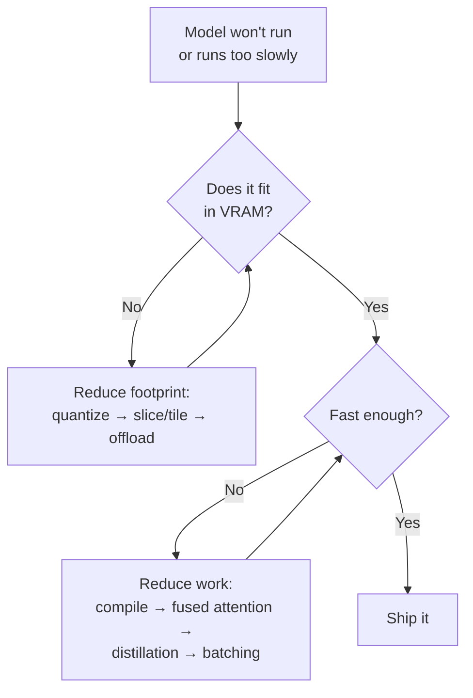
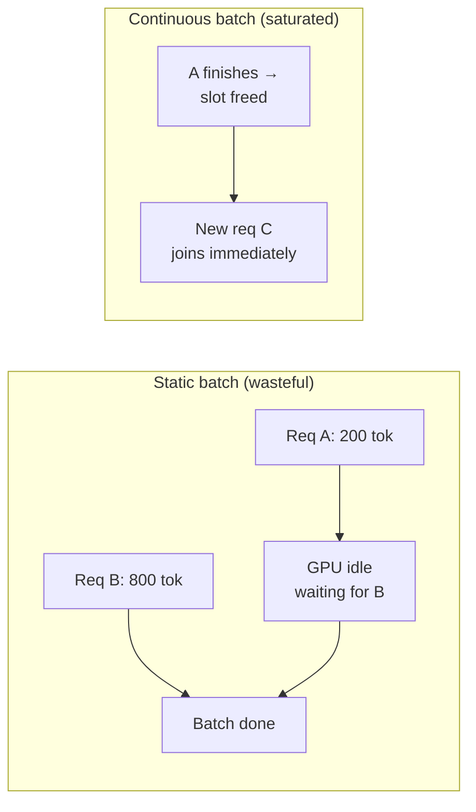

[AI/ML Documentation](./) &raquo; Optimization & Performance

A consolidated reference for the two questions every practitioner eventually hits: *"How do I make this fit in my VRAM?"* and *"How do I make it run faster?"* — covering quantization, memory-reduction tactics, inference acceleration, and batching across both diffusion and LLM workloads.

- **Quantize First.** Lower-precision weights (bf16 → fp8 → 4-bit) are the single biggest lever for fitting big models on consumer GPUs, with minor quality cost.
- **Trade Time for Memory.** Attention slicing, tiling, and CPU offload all swap speed for VRAM headroom — the difference between OOM and a working pipeline.
- **Then Trade Memory for Time.** torch.compile, fused attention, distillation, and batching reclaim throughput once the model fits.

## The Two Bottlenecks

Almost every performance problem in generative AI reduces to one of two limits:

- **Memory-bound (VRAM):** the model, its activations, and the KV cache don't fit. You hit *out-of-memory* (OOM) errors. The fixes shrink footprint — quantization, slicing, tiling, offload.
- **Compute-bound (time):** the model fits, but each generation is too slow. The fixes shrink work — fewer/cheaper operations, distillation, compilation, batching.

The order matters: **make it fit, then make it fast.** A model that OOMs has infinite latency, so memory always comes first. Once it fits, profile to find the actual bottleneck before optimizing — wall-clock time and peak VRAM per run tell you which lever to pull rather than guessing.



## Numeric Precision and Quantization

Every weight and activation in a model is a number stored in some format. Using **fewer bits per number** shrinks the model and often speeds it up, because memory bandwidth — not arithmetic — is usually the limiting resource. The cost is precision: rounding errors that, kept small, barely affect output quality.

### Floating-Point Formats

The standard formats trade off range (how large/small a value can be) against precision (how finely values are resolved):

| Format | Bits | Range | Precision | Typical use |
|--------|------|-------|-----------|-------------|
| fp32 | 32 | Wide | High | Training reference, master weights |
| tf32 | 19* | fp32 range | ~fp16 mantissa | Ampere+ matmul accumulation (transparent) |
| fp16 | 16 | Narrow | Medium | Inference; can overflow without loss scaling |
| bf16 | 16 | fp32 range | Lower mantissa | Training/inference; stable, the modern default |
| fp8 (E4M3 / E5M2) | 8 | Narrow | Low | Hopper/Ada inference, large-model weights |

*tf32 stores 19 bits internally but occupies an fp32 slot.

**fp16 vs. bf16** is the most common choice. Both are 16-bit, halving memory versus fp32, but they split the bits differently:

- **fp16** spends more bits on the mantissa (precision) and fewer on the exponent (range). It is precise but overflows easily — large activations become `inf`/`NaN`, which is why fp16 *training* needs loss scaling.
- **bf16** keeps fp32's full exponent range with a coarser mantissa. It almost never overflows, so it is far more stable. On Ampere and newer hardware, **bf16 is the default** for both training and inference.

The general rule: store the master copy of weights in a wider format when training, but run inference in 16-bit (bf16 preferred) for a free 2x memory saving with negligible quality loss.

### fp8 and Sub-8-Bit

Going below 16 bits enters dedicated *quantization* territory. **fp8** comes in two variants — `E4M3` (more precision, less range) for weights and activations, and `E5M2` (more range) for gradients. On Hopper (H100) and Ada (RTX 40-series) GPUs, fp8 matmul runs at roughly double bf16 throughput while halving weight memory again. For diffusion, fp8 is often the difference between a model like FLUX fitting in 12 GB or not.

Below 8 bits, formats become **integer** quantization (int8, int4) with explicit scale factors, because there aren't enough bits left for a useful floating-point exponent. These are the realm of the LLM quantization schemes below.

### How Quantization Works

The core operation maps a high-precision range onto a small integer range using a **scale** $s$ and (optionally) a **zero-point** $z$:

$$q = \text{round}\left(\frac{x}{s}\right) + z, \qquad \hat{x} = s \,(q - z)$$

Here $x$ is the original value, $q$ the stored integer, and $\hat{x}$ the dequantized approximation. The **quantization error** $x - \hat{x}$ is what costs quality. Two design choices control it:

- **Granularity.** A single scale per tensor (*per-tensor*) is cheapest but lets one outlier stretch the range and crush everyone else's resolution. *Per-channel* or *per-group* scales (a separate $s$ for each row, or each block of 64–128 weights) track local magnitude far better — the basis of GPTQ/AWQ group sizes.
- **Symmetry.** Symmetric quantization fixes $z = 0$ (range centered on zero), which is simpler and standard for weights. Asymmetric quantization tunes $z$ to fit skewed distributions like post-ReLU activations.

**Quantization-aware vs. post-training.** Post-training quantization (PTQ) quantizes an already-trained model — fast, no retraining, slight quality loss. Quantization-aware training (QAT) simulates the rounding during training so the model adapts to it — higher quality at low bit-widths, but it requires a training run. Most LLM and diffusion quants you download are PTQ.

### LLM Quantization Formats

For large language models, the dominant ecosystem revolves around three named schemes plus a container format. They differ in *how* they choose scales and *what* they protect:

| Format | Bits (typical) | Method | Strength |
|--------|----------------|--------|----------|
| **GGUF** | 2–8 (Q2–Q8) | Block-wise k-quants, CPU+GPU | Runs on CPU/Apple Silicon via llama.cpp; flexible offload |
| **GPTQ** | 3–4 | Layer-wise error compensation (Hessian-based) | Strong 4-bit accuracy; GPU inference |
| **AWQ** | 4 | Protects salient (high-activation) weight channels | Fast, accurate 4-bit; good kernel support |
| **bitsandbytes (NF4)** | 4 | NormalFloat4 + double quantization | Drop-in for training/QLoRA; widely supported |

- **GGUF** (the successor to GGML) is a *container* format used by **llama.cpp** and tools built on it (Ollama, LM Studio, KoboldCpp). Its "k-quant" variants (`Q4_K_M`, `Q5_K_M`, `Q6_K`, …) quantize weights in small blocks with mixed precision — more bits for the layers that need them. Its standout feature is flexible **CPU/GPU split**: you can offload as many layers to the GPU as fit and run the rest on CPU, letting a 70B model run on a single consumer card (slowly). GGUF is also the diffusion world's portable quant format (FLUX `Q4`–`Q8`).
- **GPTQ** quantizes one layer at a time, using second-order (Hessian) information to compensate for the error introduced in each weight as it rounds the rest. This makes its 4-bit models notably more accurate than naive rounding. It targets GPU inference (ExLlama/AutoGPTQ kernels).
- **AWQ** (Activation-aware Weight Quantization) observes that a small fraction of weight channels — those multiplied by large activations — dominate output quality. It scales those salient channels to protect them before quantizing, achieving accuracy close to GPTQ with simpler, faster kernels.
- **bitsandbytes NF4** underpins **QLoRA**: it stores frozen base weights in a 4-bit NormalFloat format (information-theoretically optimal for normally-distributed weights) and trains LoRA adapters on top in bf16, making it possible to fine-tune a 65B model on a single 48 GB GPU.

#### Choosing an LLM Quant Level

The accuracy-vs-size curve is steep at the bottom and flat near the top:

| Quant | Size vs. fp16 | Quality | When to use |
|-------|---------------|---------|-------------|
| Q8 / 8-bit | ~50% | Near-lossless | Plenty of VRAM, quality-critical |
| Q5_K_M / 5-bit | ~35% | Excellent | Sweet spot for most chat/coding |
| Q4_K_M / 4-bit | ~28% | Very good | Best size/quality trade-off, the default |
| Q3 / 3-bit | ~20% | Noticeable degradation | Only if 4-bit won't fit |
| Q2 / 2-bit | ~15% | Significant degradation | Last resort for huge models |

**Q4_K_M (or AWQ/GPTQ 4-bit) is the default recommendation** — it captures most of the quality of the full model at roughly a quarter of the size. Drop to 3-bit only when 4-bit won't fit; the quality cliff below 4-bit is steep.

### Quantization for Diffusion Models

Diffusion models quantize too, with their own conventions:

- **fp8** is the most common diffusion quant (FLUX, SDXL). A single `_fp8` checkpoint halves the UNet/transformer footprint with minimal visible quality loss, and runs faster on Ada/Hopper.
- **GGUF** diffusion quants (`Q4_0` through `Q8_0`, plus k-quants) let very large models like FLUX run on 8–12 GB cards, decoded by ComfyUI's GGUF loader nodes. Lower quants soften fine detail.
- **Text-encoder quantization.** FLUX's T5-XXL text encoder is itself huge; quantizing *it* (fp8 or GGUF) often frees more VRAM than quantizing the diffusion model, because the encoder runs once per prompt and can be offloaded between runs.

A practical FLUX-on-12-GB recipe: fp8 (or `Q5_K_M`) diffusion model, fp8 T5 text encoder, and sequential CPU offload of whichever component is idle.

## Reducing VRAM Footprint

Quantization shrinks the *weights*. The techniques below shrink everything else — activations, attention buffers, and the cost of keeping all components resident at once. They mostly **trade time for memory**: each makes the model fit on a smaller card at some speed cost.

### Attention Slicing

Attention computes an $N \times N$ score matrix over $N$ tokens (or image patches). At high resolution that matrix dominates memory. **Attention slicing** computes it in chunks — a few query rows at a time — so the peak buffer is a fraction of the full matrix:

```python
pipe.enable_attention_slicing()        # auto chunk size
pipe.enable_attention_slicing(1)       # maximum slicing, slowest, lowest VRAM
```

It is the simplest OOM fix for diffusion and costs only modest speed, but on modern stacks it is largely superseded by *memory-efficient attention* (below), which gets the same memory benefit with little or no slowdown.

### Memory-Efficient Attention: xFormers, SDPA, FlashAttention

Naive attention materializes the full score matrix in memory. **FlashAttention** restructures the computation to never store it: it tiles the calculation and fuses softmax into the matmul, streaming results so memory scales **linearly** in sequence length instead of quadratically, while *also* running faster (fewer memory round-trips). This is why it underpins essentially all modern LLM and diffusion inference.

You consume it through one of three interfaces:

| Interface | Where it lives | Notes |
|-----------|----------------|-------|
| **PyTorch SDPA** | `scaled_dot_product_attention` (built-in) | Auto-selects FlashAttention/memory-efficient/math backend; the modern default |
| **FlashAttention 2/3** | `flash-attn` package | Hand-tuned kernels; fastest on supported (Ampere+) hardware |
| **xFormers** | `xformers` package | Memory-efficient attention for older stacks; mostly superseded by SDPA |

In current PyTorch and diffusers, **SDPA is on by default** and routes to FlashAttention when available — you usually get this for free by keeping your stack current. Explicitly:

```python
# diffusers — enable memory-efficient attention on older versions
pipe.enable_xformers_memory_efficient_attention()

# transformers — request FlashAttention 2 for an LLM
model = AutoModelForCausalLM.from_pretrained(
    name, torch_dtype=torch.bfloat16, attn_implementation="flash_attention_2"
)
```

The win is dual: lower peak VRAM *and* higher throughput, with no quality change. There is rarely a reason not to use it when your hardware supports it.

### Tiled VAE and Tiled Diffusion

For diffusion at very high resolution, the **VAE decode** (latent → pixels) is a memory spike all its own — it expands the latent by 8x in each spatial dimension. **Tiled VAE** decodes the image in overlapping tiles, so peak memory scales with tile size, not full resolution:

```python
pipe.enable_vae_tiling()    # decode in tiles — the standard high-res OOM fix
pipe.enable_vae_slicing()   # decode a batch one image at a time
```

**Tiled diffusion** (e.g. *Mixture-of-Diffusers*, *Ultimate SD Upscale*) extends the idea to the denoising loop itself, generating the image tile-by-tile with overlap blending — the basis of upscaling far beyond a model's native resolution without OOM. (See [Advanced Techniques](advanced-techniques.html) for the multi-stage upscaling workflow this enables.)

### CPU Offload and Sequential Loading

When even a quantized model won't fit, keep idle components in system RAM and stream them to the GPU only when needed. Diffusers exposes two granularities:

| Method | What it does | Speed cost | Fits |
|--------|--------------|-----------|------|
| `enable_model_cpu_offload()` | Moves *whole submodels* (text encoder, UNet, VAE) on/off GPU around their use | Small | Most pipelines on mid cards |
| `enable_sequential_cpu_offload()` | Streams individual *layers* on demand | Large (much slower) | Extreme cases / tiny VRAM |

```python
pipe.enable_model_cpu_offload()        # good default when slightly VRAM-bound
pipe.enable_sequential_cpu_offload()   # last resort; runs but is slow
```

**Model offload** moves a component to the GPU just before it runs and evicts it after — only one of {text encoder, UNet, VAE} is resident at a time, which is enough to run SDXL/FLUX on 6–8 GB at a small speed cost. **Sequential offload** goes further, streaming layer-by-layer; it lets enormous models run on tiny cards but is dramatically slower because of constant PCIe transfers.

For LLMs, the analogous mechanism is **layer offload**: GGUF's `n_gpu_layers` puts as many transformer layers on the GPU as fit and runs the rest on CPU. The accelerate library's `device_map="auto"` does the same for transformers models, spilling overflow layers to CPU (or disk). Throughput is gated by whichever layers run on the slow device, so offload as few as possible.

### Other Memory Levers

- **Gradient checkpointing** (training only) recomputes activations during the backward pass instead of storing them, cutting activation memory at a ~20–30% compute cost. Essential for training large models or LoRAs on limited VRAM (see [LoRA Training](lora-training.html)).
- **8-bit optimizers** (`bitsandbytes` AdamW8bit) quantize the optimizer *state* — the running moments Adam keeps per parameter — halving optimizer memory with negligible quality loss. Standard for LoRA training.
- **KV-cache management (LLMs).** During generation an LLM caches the keys and values of every past token; this **KV cache** grows linearly with context length and can dwarf the weights at long contexts. Quantizing the cache (8-bit KV), using paged attention (vLLM's *PagedAttention*), or grouped-query attention (GQA, baked into the model) keeps long-context inference in budget.
- **Batch size.** The simplest VRAM lever of all — activations scale with batch size, so reducing it is the first thing to try on an OOM, and raising it is how you reclaim throughput once you have headroom (see [Batching](#batching-and-throughput)).

## Speeding Up Inference

Once the model fits, the goal flips to throughput. These techniques **trade memory (or a one-time cost) for speed**.

### torch.compile

`torch.compile` traces the model into an optimized graph and fuses operations into fewer, larger kernels — eliminating Python overhead and memory round-trips. It is a one-line wrapper with a large payoff after a warm-up compilation:

```python
pipe.unet = torch.compile(pipe.unet, mode="reduce-overhead", fullgraph=True)
# or for an LLM
model = torch.compile(model)
```

The first call is slow (it compiles); subsequent calls are typically **20–50% faster** for diffusion UNets/transformers. Caveats: the compile cost is paid again whenever input shapes change (so keep resolution/batch fixed), and `fullgraph=True` will error on code it can't trace — useful for catching graph breaks. Modes like `reduce-overhead` (CUDA graphs) and `max-autotune` push further at the cost of longer compilation.

### TensorRT and Optimized Runtimes

For production, **TensorRT** (NVIDIA) compiles a model into a hardware-specific engine with kernel fusion, precision calibration (fp16/int8/fp8), and tactic auto-tuning. It typically beats `torch.compile`, often by another 1.5–2x, but at a cost in flexibility: the engine is built for a fixed set of input shapes and a specific GPU, and building it takes minutes. It shines when you serve one model at scale on known hardware.

| Runtime | Best for | Trade-off |
|---------|----------|-----------|
| `torch.compile` | General PyTorch speedup, flexible | Recompiles on shape change |
| **TensorRT** (diffusion) | Fixed-shape production serving | Inflexible engines, long build |
| **TensorRT-LLM / vLLM** | High-throughput LLM serving | Setup complexity |
| **ONNX Runtime** | Cross-platform / non-NVIDIA | Fewer cutting-edge kernels |

For LLMs specifically, **vLLM** and **TensorRT-LLM** add throughput tricks beyond raw kernels: continuous batching, PagedAttention, and speculative decoding (below).

### Fewer Steps: Distillation, Turbo, and LCM

Diffusion's biggest time cost is the **step count** — 20–50 denoising passes, each a full model forward. Distillation trains a *student* model to reach the same result in far fewer steps, collapsing 30+ steps to single digits. You **consume** these as checkpoints or LoRAs rather than implement them:

| Method | Steps | CFG | How you use it |
|--------|-------|-----|----------------|
| **LCM** (Latent Consistency) | 4–8 | ~1–2 | Portable LCM-LoRA, applies to existing models |
| **LCM/TCD LoRA** | 4–8 | ~1 | Drop-in adapter; lowest-friction speedup |
| **SDXL-Turbo / SD-Turbo** (ADD) | 1–4 | 1 (disabled) | Dedicated distilled checkpoint |
| **SDXL-Lightning** | 1–8 | varies | Checkpoint or LoRA, several step variants |
| **FLUX-schnell** | 1–4 | guidance-distilled | Dedicated fast FLUX variant |

The mechanics: **consistency distillation** (LCM/TCD) trains the student so that *any* noisy point on a trajectory maps to the same clean endpoint, letting a handful of big steps replace many small ones. **Adversarial distillation** (ADD → SDXL-Turbo, LADD → SD3-Turbo) adds a GAN-style discriminator so even a *single*-step output looks real rather than blurry. Both trade some diversity and fine fidelity for a large speedup. (The math and the related flow-matching idea are covered in [Advanced Techniques](advanced-techniques.html).)

The practical recipe: a distilled model with **CFG near 1** and a compatible scheduler (e.g. LCM scheduler) turns a 2-second generation into a sub-second one — enough for live preview and interactive use. For LLMs, the analogous "fewer forward passes" trick is **speculative decoding**: a small draft model proposes several tokens that the large model verifies in one pass, cutting latency with no quality change.

### Cheaper Attention and Token Merging

Beyond memory-efficient attention (which is also a speedup), **Token Merging (ToMe)** reduces the *number* of tokens attention must process by merging redundant ones before each block and unmerging after. A single ratio knob (~0.5) trades a little fidelity for a meaningful diffusion speedup. It composes with everything else here.

## Batching and Throughput

Latency (time for *one* result) and throughput (results per second across *many* requests) are different goals, and **batching** is the main lever for the second. GPUs are massively parallel, so processing several inputs together costs far less than the sum of processing them individually — up to the point where you saturate compute or run out of VRAM.

### Static Batching (Diffusion)

For diffusion, generating $N$ images at once shares the model load and runs the denoising loop in parallel across the batch:

```python
images = pipe([prompt] * 8, num_images_per_prompt=1).images   # 8 in one batch
```

Throughput rises with batch size until VRAM (activations scale with batch) or compute saturates — typically the per-image time keeps dropping until the GPU is fully utilized, then flattens. This is the right mode for offline/bulk generation. Pair it with **best-of-N selection** (generate a batch, keep the best) to turn spare throughput into quality.

### Continuous Batching (LLM Serving)

LLM requests have wildly different lengths, so a *static* batch wastes the GPU waiting for the longest sequence. **Continuous batching** (a.k.a. in-flight batching, the core of vLLM and TGI) instead injects new requests into the batch as soon as others finish, keeping the GPU saturated:



Combined with **PagedAttention** (non-contiguous KV-cache memory, eliminating fragmentation), continuous batching is why dedicated servers like vLLM achieve many times the throughput of naive `generate()` loops. For self-hosted LLM serving at any real volume, this is the single highest-leverage optimization.

### Choosing a Batch Strategy

| Workload | Strategy | Why |
|----------|----------|-----|
| Bulk image generation | Large static batch | Uniform work; maximize GPU utilization |
| Interactive single image | Batch of 1, distilled model | Latency-bound; few-step model wins |
| Multi-user LLM serving | Continuous batching (vLLM/TGI) | Variable lengths; keep GPU saturated |
| Single-user local LLM | Batch of 1, quantized + KV cache | Latency-bound; offload only what's needed |

## Putting It Together: Worked Recipes

The techniques stack. A few known-good combinations:

**FLUX.1-dev on a 12 GB GPU (quality-leaning):**
- fp8 (or `Q5_K_M` GGUF) diffusion model + fp8 T5 text encoder
- `enable_model_cpu_offload()` so the encoder and VAE don't co-reside with the transformer
- SDPA/FlashAttention (default), VAE tiling for high-res
- Optionally `torch.compile` the transformer once shapes are fixed

**Interactive SDXL preview (latency-leaning):**
- SDXL base + LCM-LoRA (or SDXL-Turbo), CFG ≈ 1, 4–8 steps
- Model loaded once, text encodings cached for repeated prompts
- `torch.compile` with `reduce-overhead`; fp16/bf16 weights

**70B LLM on a single 24 GB GPU:**
- 4-bit quant (AWQ/GPTQ for GPU, or GGUF `Q4_K_M` with layer offload)
- FlashAttention 2, 8-bit KV cache for long context
- For serving multiple users: vLLM with continuous batching + PagedAttention

**Training a LoRA on 8–12 GB:**
- bf16 mixed precision + NF4-quantized base (QLoRA) when needed
- Gradient checkpointing + AdamW8bit optimizer
- Batch size 1–2; see [LoRA Training](lora-training.html) for the full recipe

## Trade-Off Summary

Every optimization moves along one of two axes — *cheaper memory* or *cheaper time* — and most cost a little of the other resource or a little quality:

| Technique | Saves | Costs | Quality impact |
|-----------|-------|-------|----------------|
| bf16/fp16 weights | ~50% memory | — | Negligible |
| fp8 / 4-bit quant | 50–75% memory | — | Minor → moderate |
| Attention slicing | Memory | Speed | None |
| Memory-efficient attention | Memory **and** time | — | None |
| VAE/diffusion tiling | Memory (high-res) | Slight speed | None (minor seams) |
| Model CPU offload | Memory | Speed (small) | None |
| Sequential offload | Memory (a lot) | Speed (a lot) | None |
| Gradient checkpointing | Memory (training) | ~25% compute | None |
| `torch.compile` | Time | One-time compile | None |
| TensorRT | Time (a lot) | Flexibility, build time | None (or calibrated) |
| Distillation / Turbo / LCM | Time (a lot) | — | Minor (diversity/detail) |
| Static batching | Time/image | Memory | None |
| Continuous batching | Throughput | Setup complexity | None |

## Key Takeaways

- **Make it fit, then make it fast.** Memory-bound problems (OOM) come first because they make latency infinite; once the model fits, profile before optimizing for speed.
- **Quantization is the biggest memory lever.** bf16 is the modern 16-bit default; fp8 halves again on Ada/Hopper; 4-bit (AWQ/GPTQ/GGUF `Q4_K_M`) is the LLM sweet spot, capturing most quality at a quarter of the size.
- **Memory-efficient attention is a free lunch** — FlashAttention/SDPA cuts both VRAM and time with no quality change. Slicing, tiling, and CPU offload trade speed for further VRAM headroom.
- **Inference speedups trade memory or a one-time cost for time:** `torch.compile` (20–50%), TensorRT (more, less flexible), and distillation (LCM/Turbo) that collapses 30+ diffusion steps to single digits.
- **Batching maximizes throughput** — static batches for bulk diffusion, continuous batching + PagedAttention (vLLM/TGI) for multi-user LLM serving — the highest-leverage win for serving at volume.

## See Also

- [Advanced Techniques](advanced-techniques.html) - Distillation, flow matching, and multi-stage workflows in depth
- [LoRA Training](lora-training.html) - Gradient checkpointing, 8-bit optimizers, and QLoRA-style training
- [Base Models Comparison](base-models-comparison.html) - VRAM budgets and quant options per model family
- [Model Types](model-types.html) - How checkpoints, GGUF, and LoRAs relate
- [ComfyUI Guide](comfyui-guide.html) - Applying offload and tiling in node workflows
- [Stable Diffusion Fundamentals](stable-diffusion-fundamentals.html) - Core diffusion concepts these optimizations target
- [AI/ML Documentation Hub](./) - Complete AI/ML documentation index
