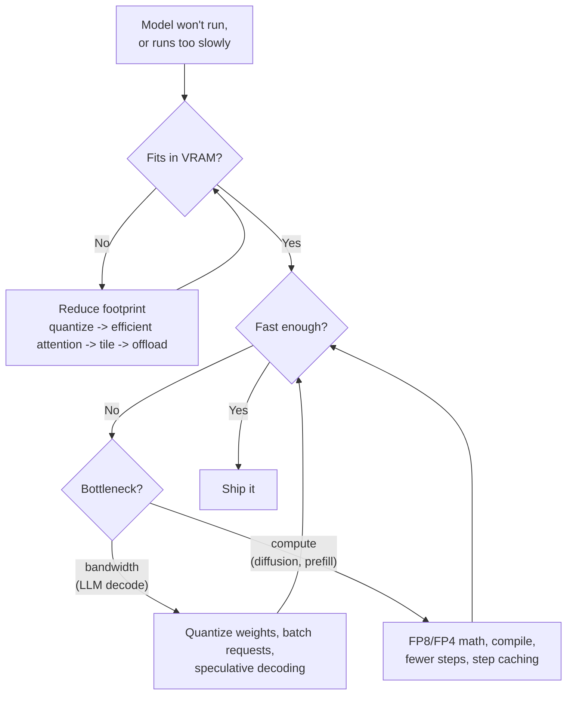
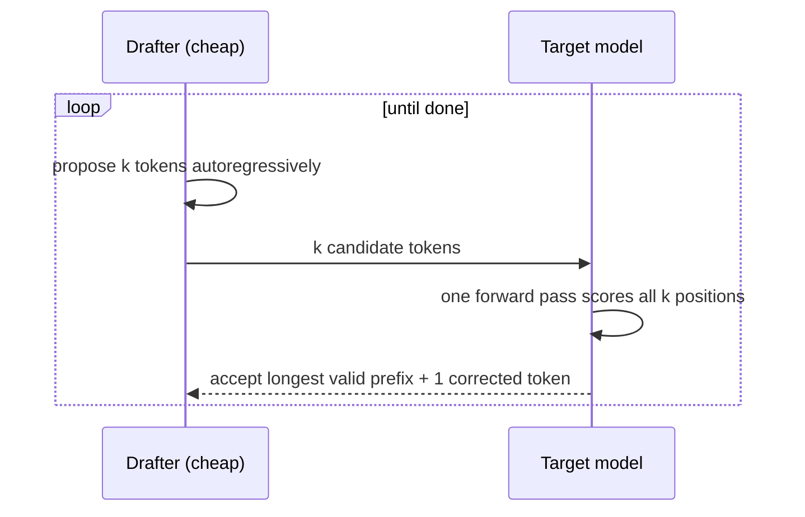

[AI/ML Documentation](./) &raquo; Optimization & Performance

This page is a practical reference for two questions about running generative models: *how do I make it fit in memory?* and *how do I make it faster?* It covers diffusion image and video models and large language models (LLMs). Topics include how to estimate a memory budget, numeric precision and quantization formats, memory-reduction techniques (efficient attention, tiling, offloading, KV-cache management), speed techniques (compilation, optimized runtimes, step distillation, caching, speculative decoding), and batching for throughput. Training-time compression methods such as pruning, distillation, and QAT are covered in [Model Compression](model-compression.html).

## Diagnosing the Bottleneck

Nearly every performance problem comes down to one of three limits:

| Limit | Symptom | Typical workloads | Levers |
|-------|---------|-------------------|--------|
| **Memory capacity** | Out-of-memory (OOM) error | Large models on consumer GPUs; long LLM contexts | Quantize, offload, tile, shrink the KV cache |
| **Memory bandwidth** | GPU "busy" but tensor cores mostly idle | LLM token generation (decode) at small batch sizes | Fewer bytes per weight (quantization), batching, speculative decoding |
| **Compute** | Tensor cores saturated | Diffusion denoising, LLM prompt processing (prefill), large batches | Lower-precision math (FP8/FP4), fewer steps, caching, compilation |

The order of work is **make it fit, then make it fast**. A model that doesn't fit has no latency to optimize. Once it fits, measure before changing anything. `torch.cuda.max_memory_allocated()`, `nvidia-smi`, and a profiler (PyTorch Profiler, Nsight Systems) tell you which limit you are actually hitting.



### Estimating memory

The main memory cost is the weights:

$$
M_{\text{weights}} \approx N_{\text{params}} \times \frac{b}{8} \text{ bytes}
$$

where $b$ is bits per weight. A 12B-parameter model needs about 24 GB in BF16, 12 GB in FP8, and about 7 GB at 4.5 bits per weight. For LLMs the **KV cache** comes on top. It stores keys and values for every past token in every layer:

$$
M_{\text{KV}} = 2 \times L \times H_{\text{kv}} \times d_{\text{head}} \times T \times B \times \text{bytes per element}
$$

for $L$ layers, $H_{\text{kv}}$ key/value heads, head dimension $d_{\text{head}}$, context length $T$, and batch size $B$. Take Llama 3.1 8B ($L = 32$, $H_{\text{kv}} = 8$, $d_{\text{head}} = 128$) in BF16. That is 128 KiB per token, so a single 128K-token context needs about 16 GiB of KV cache, which is more than the 8B weights themselves. Activations, the CUDA context, and allocator fragmentation add a further 10-30%.

### Estimating LLM decode speed

When generating one token at a time, every weight has to be read from memory once per token. At batch size 1 this gives an upper bound on speed:

$$
\text{tokens/s} \lesssim \frac{\text{memory bandwidth}}{M_{\text{weights}}}
$$

An 8B model at ~4.5 bits per weight (~4.5 GB) on a GPU with 1 TB/s of bandwidth tops out near 220 tokens/s. The same model on a dual-channel DDR5 desktop CPU (~80 GB/s) tops out near 18 tokens/s. This is why quantization speeds up local LLMs even though it adds arithmetic, and why offloading layers to system RAM slows them down so sharply.

## Numeric Precision and Quantization

Storing each number in fewer bits shrinks the model. On hardware with native low-precision tensor cores, it also speeds up the math. The cost is rounding error, which is negligible at 16 and 8 bits and noticeable, depending on the method, at 4 bits and below.

### Floating-point formats

| Format | Bits (sign/exp/mantissa) | Dynamic range | Native tensor-core support (NVIDIA) | Typical use |
|--------|--------------------------|---------------|-------------------------------------|-------------|
| FP32 | 1/8/23 | Wide | All | Master weights, optimizer state, reductions |
| TF32 | 1/8/10 (in a 32-bit slot) | FP32 range | Ampere+ | Transparent FP32-matmul speedup |
| FP16 | 1/5/10 | Narrow (max 65504) | Volta+ | Inference; training needs loss scaling |
| BF16 | 1/8/7 | FP32 range | Ampere+ | The default for training and inference |
| FP8 E4M3 / E5M2 | 1/4/3, 1/5/2 | Narrow, needs scaling | Ada, Hopper, Blackwell | Inference weights and activations; FP8 training |
| FP4 E2M1 (MXFP4, NVFP4) | 1/2/1 + block scale | Needs per-block scale | Blackwell | 4-bit inference with native FP4 math |

- **FP16 vs. BF16.** Both halve memory compared with FP32. FP16 has more mantissa bits but overflows easily, so large activations become `inf` or `NaN`. This is the cause of the well-known black images from the SDXL VAE in FP16. BF16 keeps FP32's exponent range, rarely overflows, and is the right default on Ampere and newer GPUs.
- **FP8.** E4M3 (more precision) is used for weights and activations, and E5M2 (more range) for gradients. FP8 needs a scale factor per tensor, channel, or block. On Ada, Hopper, and Blackwell, FP8 matmuls run at about twice BF16 throughput. On older GPUs, FP8 weights save memory but are upcast before computing.
- **FP4 microscaling.** MXFP4 (OCP standard: 32-element blocks, power-of-two scale) and NVIDIA's NVFP4 (16-element blocks, FP8 scale) store 4-bit values that share a scale per block. Blackwell tensor cores compute on them directly, so FP4 is both smaller and faster there. The format details are in [Model Compression](model-compression.html#number-formats).

### How integer quantization works

A value $x$ is stored as an integer $q$ with a scale $s$ and optional zero-point $z$:

$$
q = \mathrm{round}\!\left(\frac{x}{s}\right) + z, \qquad \hat{x} = s\,(q - z)
$$

The difference $x - \hat{x}$ is the quantization error. The main design choice is **granularity**. One scale for the whole tensor lets a single outlier waste most of the range. Per-channel scales, or per-group scales over blocks of 32-128 weights, track local magnitude much better, and every modern 4-bit scheme uses them. Most models you download were quantized **post-training** (PTQ). **Quantization-aware training** (QAT) gives better 4-bit quality but needs a training run, and some model families now ship official QAT checkpoints.

### LLM quantization formats

| Format | Typical bits | How scales are chosen | Runs on | Main tooling |
|--------|--------------|-----------------------|---------|--------------|
| **GGUF** (k-quants, i-quants) | 1.5-8 | Block-wise; optional importance matrix (imatrix) from calibration text | CPU, Apple Silicon, CUDA/ROCm/Vulkan GPUs | llama.cpp, Ollama, LM Studio |
| **GPTQ** | 3-4 (8) | Layer-wise error compensation using second-order (Hessian) information | GPU | vLLM, SGLang, transformers; created with LLM Compressor / GPTQModel |
| **AWQ** | 4 | Rescales salient channels (those that see large activations) before rounding | GPU | vLLM, SGLang, TensorRT-LLM |
| **bitsandbytes NF4 / int8** | 4 / 8 | NormalFloat4 codebook + double quantization; quantized at load time | GPU | transformers; QLoRA fine-tuning |
| **FP8 (W8A8)** | 8 | Per-tensor or per-channel scales, dynamic per-token activations | Ada / Hopper / Blackwell | vLLM, SGLang, TensorRT-LLM |
| **MXFP4 / NVFP4** | 4 | Hardware block scaling | Blackwell (MXFP4 also AMD MI350) | vLLM, SGLang, TensorRT-LLM |
| **EXL3** | 1.5-8 | Trellis-coded quantization (from QTIP) | NVIDIA GPU | ExLlamaV3, TabbyAPI |

- **GGUF** is the single-file container used by **llama.cpp** and everything built on it. K-quants such as `Q4_K_M` and `Q5_K_M` quantize in small blocks and keep sensitive tensors at higher precision. I-quants (`IQ2_XS` to `IQ4_XS`) use lattice codebooks for better quality below 4 bits, especially with an imatrix. GGUF's main strength is **partial offload**: `-ngl` / `n_gpu_layers` puts as many layers on the GPU as fit and runs the rest on the CPU.
- **GPTQ and AWQ** are the standard GPU formats for data-center serving. Their accuracy at 4-bit is similar. AWQ is simpler and needs less calibration.
- **bitsandbytes NF4** quantizes when the model is loaded, with no calibration file. It is the basis of **QLoRA**, where a frozen NF4 base plus BF16 LoRA adapters allowed fine-tuning a 65B model on a single 48 GB GPU in the original paper.

#### Choosing a GGUF quant level

| Quant | Approx. bits/weight | Size vs. FP16 | Quality |
|-------|---------------------|---------------|---------|
| `Q8_0` | 8.5 | ~53% | Practically lossless |
| `Q6_K` | 6.6 | ~41% | Indistinguishable in most use |
| `Q5_K_M` | 5.7 | ~36% | Excellent |
| `Q4_K_M` | 4.8 | ~30% | Very good; the usual default |
| `IQ3_M` / `Q3_K_M` | 3.7-3.9 | ~24% | Noticeable loss; prefer a smaller model at 4-bit if one exists |
| `IQ2_XS` / `Q2_K` | 2.3-3.0 | ~16-19% | Large loss; last resort for very large models |

Quality falls off steeply below about 4 bits per weight, and small models lose more than large ones. A larger model at 4-bit usually beats a smaller model at 8-bit for the same memory, down to about 3 bits.

### Quantization for diffusion models

Diffusion models use the same ideas with their own conventions:

- **FP8** (`fp8_e4m3fn`, including "scaled" variants with per-tensor scales) is the most common diffusion quantization. It halves the denoiser with almost no visible change and runs faster on Ada, Hopper, and Blackwell.
- **GGUF** (`Q8_0` down to `Q3_K`) makes 12B-32B models such as FLUX.1, FLUX.2, and Qwen-Image usable on 8-16 GB cards through ComfyUI-GGUF. It is a memory saving, not a speedup, because weights are dequantized on the fly. Lower levels soften fine texture and small text.
- **4-bit compute formats.** **SVDQuant** (served by the Nunchaku engine) quantizes both weights and activations to 4 bits. It moves outliers into a small 16-bit low-rank branch and runs real 4-bit kernels: INT4 on RTX 30/40-series, NVFP4 on Blackwell. For FLUX.1 it reports about 3.5x less memory and about 3x speedup over an NF4 weight-only baseline on an RTX 4090. ComfyUI also loads NVFP4 checkpoints natively on Blackwell.
- **Text encoders.** T5-XXL (FLUX.1, SD 3.5) and the LLM encoders of FLUX.2 (24B Mistral Small), Qwen-Image, and Z-Image are large. Quantizing the encoder to FP8 or GGUF, or offloading it after encoding, often frees more VRAM than quantizing the denoiser. The encoder runs once per prompt.

In diffusers, the same backends are available through `PipelineQuantizationConfig` / `BitsAndBytesConfig` / `TorchAoConfig` at load time, and FP8 storage with BF16 compute through layerwise casting (see [Offloading](#offloading-and-layerwise-casting)).

## Reducing Memory

These techniques shrink everything other than the weight bits: attention buffers, activations, and the cost of keeping every component on the GPU at once. Most of them **trade speed for memory**.

### Efficient attention kernels

Standard attention builds an $N \times N$ score matrix for $N$ tokens or image patches. At 1024x1024 a FLUX-class model attends over 4096 image tokens plus text tokens, and video models attend over tens of thousands. **FlashAttention** tiles the computation, fuses the softmax into the matmuls, and never stores the full matrix. Memory then grows *linearly* with sequence length, and it also runs faster because it makes fewer trips to memory.

| Kernel | Hardware | Notes |
|--------|----------|-------|
| PyTorch SDPA (`scaled_dot_product_attention`) | Any | Built-in dispatcher; picks FlashAttention-2, memory-efficient, or cuDNN backends automatically. On by default in diffusers and transformers |
| FlashAttention-2 | Ampere+ | `flash-attn` package; `attn_implementation="flash_attention_2"` in transformers |
| FlashAttention-3 | Hopper | Uses Hopper asynchrony and supports FP8 |
| FlashAttention-4 | Hopper, Blackwell | Written in CuTe DSL; up to ~1.3x over cuDNN on B200 in BF16 |
| SageAttention 2 / 3 | Ampere+ / Blackwell (v3, FP4) | *Quantized* attention (INT8/FP8, or FP4 in v3); 2-5x faster than FlashAttention with small quality impact; popular for FLUX and video models in ComfyUI |
| xFormers | Older stacks | Largely superseded by SDPA |

**Attention slicing** (`pipe.enable_attention_slicing()`) computes attention a few rows at a time. It dates from before memory-efficient kernels were common, and with SDPA it usually just makes things slower. Use it only as a last resort on very old stacks.

### Tiled VAE and tiled diffusion

Decoding latents to pixels multiplies the spatial size by 8 in each dimension, so the **VAE decode** is often the memory peak at high resolution, and even more so for video. Tiled decoding processes overlapping tiles:

```python
pipe.vae.enable_tiling()     # decode in overlapping tiles: the standard high-res OOM fix
pipe.vae.enable_slicing()    # decode a batch one image at a time
```

**Tiled diffusion** (MultiDiffusion, Mixture of Diffusers, Ultimate SD Upscale) applies the same idea to the denoising loop. It generates large images tile by tile and blends the overlaps. This is the usual basis for upscaling well past a model's native resolution (see [Advanced Techniques](advanced-techniques.html)).

### Offloading and layerwise casting

When the weights don't fit, keep idle parts in system RAM and move them to the GPU only when needed. Diffusers offers several granularities:

| Method | What moves | Speed cost | When to use |
|--------|-----------|------------|-------------|
| `pipe.enable_model_cpu_offload()` | Whole components (text encoder, denoiser, VAE) around their use | Small | Slightly VRAM-bound; the usual default |
| `model.enable_group_offload(..., use_stream=True)` | Groups of layers, prefetched on a CUDA stream so transfers overlap compute | Moderate | Denoiser alone doesn't fit; much faster than sequential |
| `pipe.enable_sequential_cpu_offload()` | Individual layers, synchronously | Large | Last resort for tiny VRAM |
| `model.enable_layerwise_casting(storage_dtype=torch.float8_e4m3fn, compute_dtype=torch.bfloat16)` | Nothing; weights are *stored* in FP8 and upcast per layer | Small | Halve weight memory on GPUs without FP8 math |

```python
import torch
from diffusers import FluxPipeline

pipe = FluxPipeline.from_pretrained("black-forest-labs/FLUX.1-dev", torch_dtype=torch.bfloat16)
pipe.transformer.enable_layerwise_casting(
    storage_dtype=torch.float8_e4m3fn, compute_dtype=torch.bfloat16
)
pipe.enable_model_cpu_offload()   # text encoders, transformer, and VAE take turns on the GPU
pipe.vae.enable_tiling()
```

**ComfyUI** manages this automatically. It loads models to the GPU on demand, evicts or partially loads them under memory pressure, and exposes `--lowvram`, `--novram`, and `--reserve-vram` flags for manual control.

For **LLMs**, the equivalent is **layer offload**: llama.cpp's `-ngl`, or `device_map="auto"` with `max_memory` in transformers/accelerate, which puts leftover layers on the CPU or disk. Throughput then depends on the layers running on the slow device, because each token has to wait for them. Offload as few layers as possible, and prefer a smaller quant that fits entirely.

### KV-cache and context memory (LLMs)

At long contexts the KV cache can be larger than the weights (see the [estimate above](#estimating-memory)).

- **Architecture.** Grouped-query attention (GQA) shares each K/V head across several query heads, cutting the cache 4-8x compared with full multi-head attention. DeepSeek's multi-head latent attention (MLA) compresses K/V into a low-rank latent. Sliding-window or hybrid attention layers cap the cache for part of the network. These are properties of the model, so check them before you pick a model for long-context work.
- **KV-cache quantization.** FP8 KV cache (`--kv-cache-dtype fp8` in vLLM) halves cache memory with little quality loss. llama.cpp supports `q8_0` and `q4_0` cache types.
- **PagedAttention.** vLLM stores the cache in fixed-size pages, the way an operating system handles virtual memory. This avoids fragmentation and over-reservation and lets requests share pages for common prefixes.
- **Prefix caching.** Reusing the KV cache for a shared system prompt or document (vLLM automatic prefix caching, SGLang RadixAttention) saves both memory and prefill compute.

### Training-time levers

- **Gradient checkpointing** recomputes activations during the backward pass instead of storing them. It cuts activation memory a lot for roughly 20-30% more compute, and it is standard for LoRA training on consumer GPUs.
- **8-bit and paged optimizers** (bitsandbytes `AdamW8bit`, `PagedAdamW8bit`) quantize Adam's two moment buffers, which otherwise take twice the parameter memory in FP32.
- **Mixed precision** (BF16 autocast with FP32 master weights) is standard. FP8 training is used in large-scale pretraining on Hopper and Blackwell.
- **Batch size** scales activation memory linearly. It is the first thing to lower on OOM, and gradient accumulation keeps the effective batch size. See [LoRA Training](lora-training.html).

## Speeding Up Inference

Once the model fits, the goal becomes latency or throughput. These techniques trade a one-time cost, some memory, or a little quality for speed.

### torch.compile

`torch.compile` captures the model into a graph and generates fused kernels, which removes Python overhead and extra memory traffic. It is usually 1.2-1.5x faster for diffusion transformers after warm-up. It combines well with quantization and is required for torchao's quantized kernels to reach full speed.

```python
# Diffusion: compile only the repeated transformer block ("regional compilation").
# Same runtime gain as compiling the whole model, with several times shorter compile time.
pipe.transformer.compile_repeated_blocks(fullgraph=True)

# Whole-model compile (LLMs, U-Nets)
model = torch.compile(model, mode="max-autotune")
```

A change in input shape (resolution, batch size) triggers a recompile unless you mark dimensions as dynamic. `mode="reduce-overhead"` uses CUDA graphs to cut kernel-launch overhead at small batch sizes, and `max-autotune` searches kernel configurations at the cost of a longer compile. `fullgraph=True` raises an error on graph breaks, which is a good way to find them.

### Optimized runtimes and serving engines

| Runtime | Best for | Notes |
|---------|----------|-------|
| **vLLM** | General LLM serving | PagedAttention, continuous batching, prefix caching, speculative decoding, broad quantization and hardware support |
| **SGLang** | LLM serving with shared prefixes, structured output, agents | RadixAttention prefix cache; performance comparable to vLLM |
| **TensorRT-LLM** | Highest throughput on NVIDIA | Ahead-of-time engines with FP8/NVFP4, in-flight batching; more setup |
| **llama.cpp / Ollama / LM Studio** | Local, single-user, CPU and Apple Silicon | GGUF; partial GPU offload |
| **TensorRT** (diffusion) | Fixed-shape production diffusion on NVIDIA | Engine built per GPU and shape range; minutes to build |
| **ONNX Runtime** | Cross-vendor, CPU, DirectML, NPUs | Broadest portability |

Hugging Face **TGI** (text-generation-inference) entered maintenance mode in December 2025, and Hugging Face now recommends vLLM or SGLang for new deployments.

### Fewer steps: distilled models and caching

For diffusion, total cost is roughly *steps x cost per step*, and CFG doubles the cost per step. There are three ways to cut it.

**1. Step-distilled models** reach a usable image in 1-8 steps:

| Method | Steps | CFG | Form |
|--------|-------|-----|------|
| LCM / LCM-LoRA, TCD | 4-8 | ~1-2 | LoRA for SD 1.5 / SDXL |
| SDXL-Turbo (ADD) | 1-4 | off | Checkpoint |
| SDXL-Lightning, Hyper-SD, DMD2 | 1-8 | off or low | LoRA or checkpoint |
| FLUX.1 [schnell] | 1-4 | off | Checkpoint |
| FLUX.2 [klein] (distilled), Z-Image Turbo | ~4-8 | off | Checkpoint |
| Lightning LoRAs for Qwen-Image, Wan | 4-8 | off | LoRA |

*Consistency distillation* (LCM, TCD) trains the model to map any point on a denoising trajectory directly to the same clean endpoint. *Adversarial* and *distribution-matching* distillation (ADD/LADD, DMD2) add a discriminator or a distribution-level loss so that one- or few-step outputs stay sharp. These methods lose some diversity and fine detail. **Guidance distillation** (FLUX.1 [dev]) is different: it folds CFG into a single forward pass, halving the cost per step without reducing the number of steps. Background is in [Advanced Techniques](advanced-techniques.html).

**2. Step caching** exploits the fact that a diffusion transformer's internal features change little between neighboring steps. It skips most blocks on some steps and reuses cached residuals. These methods need no training and give roughly 1.5-2x speedups, with a quality threshold you tune:

| Method | Skip decision |
|--------|---------------|
| TeaCache | Change in timestep-modulated input exceeds a threshold |
| First Block Cache | Change in the first block's output is small, so the rest are reused |
| MagCache | Accumulated residual-magnitude error budget |
| TaylorSeer | Predicts skipped features with a Taylor expansion |

```python
from diffusers.hooks import apply_first_block_cache, FirstBlockCacheConfig
apply_first_block_cache(pipe.transformer, FirstBlockCacheConfig(threshold=0.2))
```

ComfyUI exposes the same ideas through nodes (built-in *EasyCache*, TeaCache, and WaveSpeed First Block Cache custom nodes).

**3. Token merging (ToMe)** reduces the number of tokens that attention has to process in U-Net models by merging similar ones. It gives a moderate speedup at ratios around 0.3-0.5 and matters less for modern DiTs, where caching is more effective.

### Speculative decoding (LLMs)

At small batch sizes, LLM decoding is limited by memory bandwidth and leaves compute idle. **Speculative decoding** uses that idle compute. A cheap *drafter* proposes $k$ tokens, and the target model checks all of them in one forward pass, accepting the longest correct prefix. The acceptance rule preserves the target model's output distribution exactly, so quality is unchanged.



| Drafter | Extra memory | Notes |
|---------|--------------|-------|
| Separate small model (same tokenizer) | High | Simple; needs a well-matched small model |
| EAGLE-3 head | Moderate | Light head trained on the target's hidden states; among the best speedups (often 2-3x) |
| MTP (multi-token prediction) heads | Low | Built into some models (e.g. DeepSeek-V3, Qwen3-Next) |
| N-gram / prompt lookup | None | Copies from the prompt; strong for editing, RAG, and code |

The speedup shrinks as batch size grows, because compute stops being idle. Speculative decoding helps latency-sensitive, low-concurrency serving the most.

## Batching and Throughput

Latency is the time for one result. Throughput is results per second across many requests. **Batching** trades a little latency for a lot of throughput, because GPUs are wide and one request rarely fills them.

### Static batching (diffusion)

Generating several images in one call shares the model's memory traffic across the batch:

```python
images = pipe(prompt, num_images_per_prompt=4).images
```

Time per image falls as the batch grows until compute is saturated, and memory grows linearly. This is the right mode for bulk or offline generation. It also makes best-of-N selection cheap: generate a batch and keep the best image.

### Continuous batching (LLM serving)

LLM requests vary a lot in length. With a static batch, finished requests leave their slots idle until the longest one ends. **Continuous batching** (also called in-flight batching) schedules at the level of individual iterations: when a request finishes, a waiting one takes its slot on the next step.

| Batch slot | t1 | t2 | t3 | t4 | t5 | t6 |
|------------|----|----|----|----|----|----|
| **Static**, slot 1 | A | A | idle | idle | idle | idle |
| **Static**, slot 2 | B | B | B | B | B | B |
| **Continuous**, slot 1 | A | A | C | C | D | D |
| **Continuous**, slot 2 | B | B | B | B | B | B |

Serving engines combine continuous batching with **chunked prefill**, which splits long prompts so they don't stall ongoing decodes, PagedAttention, and prefix caching. Together these give many times the throughput of a naive `generate()` loop. For any multi-user LLM deployment, running a real serving engine (vLLM, SGLang, TensorRT-LLM) is the most important optimization.

### Choosing a strategy

| Workload | Strategy |
|----------|----------|
| Bulk image or video generation | Large static batch, FP8 or 4-bit weights, step caching |
| Interactive image generation | Batch of 1, distilled model, compiled denoiser |
| Multi-user LLM serving | vLLM or SGLang, continuous batching, FP8 weights and KV cache, prefix caching |
| Single-user local LLM | Largest quant that fits fully in VRAM, speculative decoding if supported |

## Worked Recipes

**FLUX.1 [dev] on a 12 GB GPU:**
- FP8 (or GGUF `Q5_K`/`Q6_K`) transformer and FP8 T5-XXL text encoder.
- Model CPU offload so the text encoder and VAE don't sit next to the transformer on the GPU. VAE tiling for anything above about 1.5 MP.
- SDPA by default, or SageAttention in ComfyUI. Optionally First Block Cache or TeaCache for about 1.5x more speed.
- On RTX 30/40/50-series, Nunchaku's 4-bit SVDQuant model is both smaller and roughly 3x faster.

**Interactive SDXL preview:**
- SDXL fine-tune plus a DMD2 or Lightning LoRA, 4-8 steps, CFG 1, the matching sampler.
- Keep the pipeline resident, cache prompt embeddings, and compile the U-Net with `mode="reduce-overhead"`.

**70B LLM on local hardware:**
- `Q4_K_M` weights are about 42 GB, so a single 24 GB GPU can't hold them. On one 24 GB card, either offload about half the layers to CPU (expect single-digit tokens/s) or drop to `IQ2_XS`/`IQ3` and accept the quality loss.
- Two 24 GB GPUs or one 48 GB GPU hold a 4-bit 70B model with room for 8K-32K of context using an 8-bit KV cache. Unified-memory machines (Apple Silicon, AMD Strix Halo) fit it at lower bandwidth.
- In many cases a newer 27B-32B model at `Q5`/`Q6` fits entirely on one 24 GB card and is faster and just as capable. Compare against the tasks you actually run.

**Multi-user LLM serving on one data-center GPU:**
- vLLM or SGLang with FP8 (Hopper) or NVFP4 (Blackwell) weights, FP8 KV cache, prefix caching on, and EAGLE-3 speculative decoding for latency-sensitive traffic.

**LoRA training on 8-12 GB:**
- BF16 mixed precision, gradient checkpointing, `AdamW8bit`. Load the base model in FP8 or NF4 (QLoRA-style) for large models such as FLUX.
- Batch size 1-2 with gradient accumulation. Cache latents and text embeddings to disk. See [LoRA Training](lora-training.html).

## Trade-Off Summary

| Technique | Saves | Costs | Quality impact |
|-----------|-------|-------|----------------|
| BF16/FP16 instead of FP32 | ~50% memory, time | - | Negligible |
| FP8 weights (+ activations on Ada+) | ~50% memory; time on Ada+ | - | Negligible to minor |
| 4-bit weights (GGUF, AWQ, GPTQ, NF4) | ~70% memory; decode time | Slower compute-bound work unless native FP4/INT4 | Minor to moderate |
| FP4 / SVDQuant W4A4 | ~70% memory and time | Needs supported GPU/kernels | Minor to moderate |
| Efficient attention (Flash / SDPA) | Memory and time | - | None |
| Quantized attention (SageAttention) | Time | - | Small |
| VAE / diffusion tiling | Peak memory | Slight time | Rare seams |
| Model / group offload | Memory | Small to moderate time | None |
| Sequential / layer offload to CPU | Much memory | Much time | None |
| KV-cache FP8, PagedAttention | Memory at long context | - | Negligible |
| Gradient checkpointing | Training memory | ~20-30% compute | None |
| `torch.compile` | Time | Compile warm-up | None |
| TensorRT / TensorRT-LLM | Time | Flexibility, build time | None or calibrated |
| Step distillation | Much time | Diversity, fine detail | Minor to moderate |
| Step caching | Time | - | Tunable, minor |
| Speculative decoding | Latency at low concurrency | Drafter memory | None (exact) |
| Static / continuous batching | Throughput | Per-request latency, memory | None |

## See Also

- [Model Compression](model-compression.html) - Pruning, distillation, quantization theory, and deployment runtimes
- [Advanced Techniques](advanced-techniques.html) - Distillation, flow matching, and multi-stage upscaling in depth
- [LoRA Training](lora-training.html) - Memory-efficient fine-tuning
- [Model Types](model-types.html) - Checkpoint formats, precision variants, and component sizes
- [Base Models Comparison](base-models-comparison.html) - VRAM budgets per model family
- [ComfyUI Guide](comfyui-guide.html) - Applying offload, tiling, and caching in node workflows
- [GPU Optimization](../optimization/gpu-optimization.html) - GPU architecture and kernel-level performance
- [MLOps & Production](mlops-production.html) - Serving and operating models in production
- [AI/ML Documentation Hub](./) - Complete AI/ML documentation index
