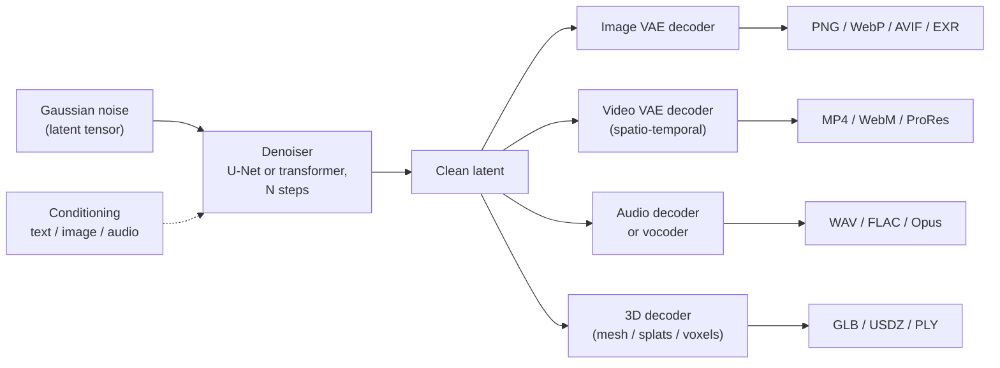
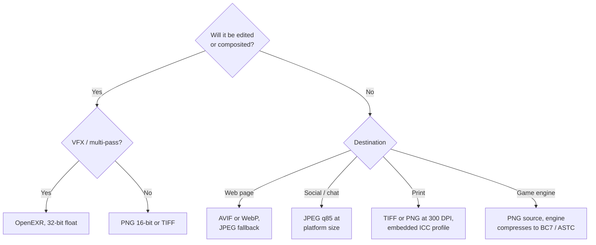
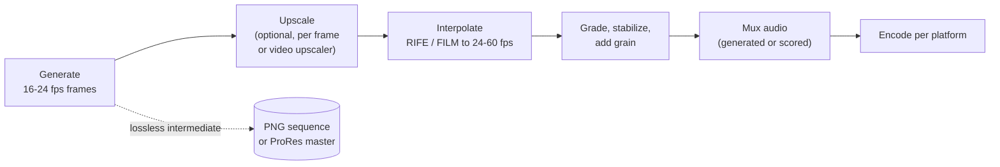
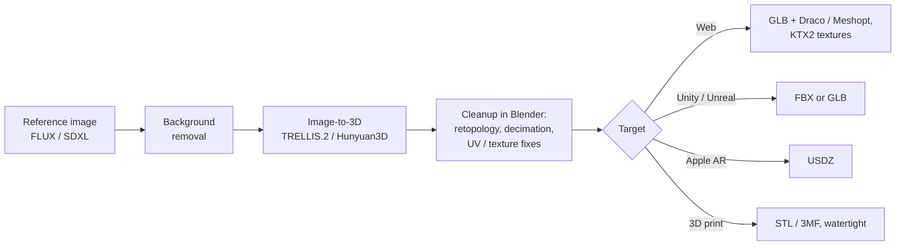

Diffusion and flow-matching models now generate images, video, audio, 3D assets, and, experimentally, text. This page is a reference for what each modality produces, which file formats and encoder settings suit which destination, how to get from a model's raw output to a deliverable, and how to record provenance so outputs are reproducible and properly labelled as AI-generated. It assumes the basics from [Stable Diffusion Fundamentals](stable-diffusion-fundamentals.html).

## One Mechanism, Many Modalities

Every modality below uses the same recipe: start from noise in a latent space, denoise it step by step under some conditioning (text, image, audio), then decode the latent into the target medium. Only the latent's shape and the decoder change.



| Modality | Representative models (2026) | Native output | Typical exports |
|----------|------------------------------|---------------|-----------------|
| Image | SDXL, SD3.5, FLUX.1/FLUX.2, Qwen-Image | Latent decoded to RGB | PNG, WebP, AVIF, JPEG, EXR |
| Video | Wan 2.x, HunyuanVideo, LTX-2 (open); Veo 3, Sora 2, Kling (hosted) | Frame sequence, sometimes with audio | MP4 (H.264/H.265/AV1), WebM, ProRes, image sequence |
| Audio | Stable Audio, ACE-Step, MMAudio, F5-TTS | Waveform (often via a latent autoencoder) | WAV, FLAC, MP3, AAC, Opus/OGG |
| 3D | TRELLIS.2, Hunyuan3D 2.1, Stable Fast 3D, TripoSR | Mesh with PBR textures, Gaussian splats, or radiance field | GLB/glTF, FBX, OBJ, USD/USDZ, STL, PLY/SPZ |
| Text (experimental) | Mercury, Gemini Diffusion, LLaDA | Token sequence | Plain text, Markdown, JSON |

Mainstream language models (GPT, Claude, Gemini) are **autoregressive**, not diffusion-based. Text diffusion is covered at the end as an emerging line of work.

## Images

Images are the most mature output and the one where format choice has the most visible consequences. Save a lossless master first and derive everything else from it.

### Format Comparison

| Format | Compression | Bit depth | Alpha | HDR | Best use |
|--------|-------------|-----------|-------|-----|----------|
| **PNG** | Lossless | 8/16-bit | Yes | Yes (cICP chunk, PNG 3rd ed.) | Masters, editing, anything with metadata |
| **JPEG** | Lossy | 8-bit | No | No | Universal sharing, previews |
| **WebP** | Lossy or lossless | 8-bit | Yes | No | Web delivery; ~25-35% smaller than JPEG at similar quality |
| **AVIF** | Lossy or lossless (AV1) | 8/10/12-bit | Yes | Yes | Smallest web files; supported in all major browsers |
| **JPEG XL** | Lossy, lossless, lossless JPEG recompression | Up to 32-bit float | Yes | Yes | Archival; web use still limited |
| **TIFF** | Lossless (LZW/ZIP) | 8/16/32-bit | Yes | Yes | Print and pre-press hand-off |
| **OpenEXR** | Lossless or lossy float | 16/32-bit float | Yes | Yes | VFX compositing, multi-channel passes |

Practical defaults:

- **PNG** is the working and archival format. It is the only common format in which ComfyUI and Automatic1111 embed generation metadata by default. Use 16-bit when heavy grading follows. The PNG Third Edition (W3C Recommendation, June 2025) formally adds APNG animation, the `cICP` chunk for HDR, and `eXIf` metadata.
- **JPEG** at quality 80-90 with progressive encoding for sharing. Avoid repeated re-saves, because generation loss compounds.
- **WebP** at quality ~85-90 for web pages that need transparency or animation.
- **AVIF** where file size matters most. Encoding is slower, so derive it offline.
- **JPEG XL** has strong technical properties and Safari support, and Chromium re-added a decoder (behind a flag) in early 2026. Until it is on by default everywhere, serve it only with fallbacks.
- **EXR** only for compositing pipelines that need float precision or multiple named channels.

Note that model outputs are 8-bit sRGB in practice: the VAE decodes to values clamped to [0, 1] and quantized. Saving 16-bit PNG does not recover lost precision, but it prevents banding from compounding during later edits.



### Resolution and Upscaling

Generate at the model's native resolution (about 1 megapixel for SDXL, SD3.5, and FLUX.1, in any supported aspect ratio), then resize for the target. Generating directly at an unusual small size degrades composition, and generating far above native size causes duplicated subjects.

To reach print or 4K sizes:

1. Generate at native resolution.
2. Upscale 2-4x with a model upscaler (Real-ESRGAN, 4x-UltraSharp, or a SwinIR/DAT-family model).
3. Optionally run a low-denoise (0.2-0.45) img2img pass, tiled with a tile ControlNet or a tiled-diffusion node, to add real detail instead of enlarged pixels.

Enable **tiled VAE decode** for large images; VAE decoding is often the step that runs out of memory. See [Advanced Techniques](advanced-techniques.html) for hires-fix and tiled-upscale workflows.

| Destination | Typical size | Format |
|-------------|--------------|--------|
| Instagram feed | 1080×1350 (4:5) or 1080×1080 | JPEG q85 |
| Stories / Reels / Shorts cover | 1080×1920 (9:16) | JPEG |
| Web hero image | 1600-2560 px wide, several `srcset` widths | AVIF + WebP + JPEG fallback |
| Discord / chat | Under the upload limit (10 MB for free Discord accounts) | WebP or JPEG |
| Game texture | Power-of-two (1024, 2048, 4096) | PNG source |
| Print | Pixels = inches × 300 | TIFF / PNG with ICC profile |

Platform specifications change often; check the platform's current guidance before a large export.

### Text Inside Images

Legible typography depends mostly on the text encoder. CLIP-only models (SD 1.5, SDXL) cannot spell reliably; models with a T5 or LLM text encoder can.

| Model | In-image text | Notes |
|-------|---------------|-------|
| FLUX.1 / FLUX.2, Qwen-Image | Very good | Short to medium strings; Qwen-Image is notably strong on multi-line and Chinese text |
| SD3.5 | Good | Put the literal text in quotes |
| SDXL and fine-tunes | Poor | Expect retries or use the methods below |
| SD 1.5 | Very poor | Composite real type instead |

When direct generation is not reliable enough:

1. **ControlNet from rendered type.** Render the words in a real font, extract Canny or lineart, and condition on it so the model styles exact letterforms.
2. **Inpaint the text region.** Generate the scene, mask the area, and inpaint only the lettering, possibly with a stronger model than the one that made the scene.
3. **Composite in post.** For logos, legal text, or anything that must be exactly right, set real type in an editor.

Describing the physical medium ("neon sign reading OPEN on a brick wall, night photograph") works better than naming the words alone, because the model has seen that context. For print deliverables such as book covers, generate the art at print resolution and add title typography in a layout tool that exports PDF/X with bleed and CMYK conversion.

### Multi-Pass and Layered Outputs

Running estimators alongside generation yields companion data for downstream tools:

| Output | Produced by | Use | Format |
|--------|-------------|-----|--------|
| Depth map | Depth Anything V2, MiDaS | Parallax, relighting, AR occlusion, depth ControlNet | 16-bit PNG or EXR channel |
| Normal map | Normal estimators (e.g. Marigold-style models) | Relighting, game materials | PNG (linear) or EXR |
| Segmentation masks | SAM 2 | Per-object editing, layered PSD export | PNG masks, PSD layers |
| Alpha / background removal | BiRefNet, RMBG | Stickers, product shots, compositing | PNG or WebP with alpha |
| PBR material set | Texture models or derivation from albedo | Game and real-time materials | Albedo (sRGB), normal (linear), packed ORM (R=AO, G=roughness, B=metallic) |

Keep derived maps at the same dimensions as the color image, and mark color-space correctly: albedo is sRGB, while normal, roughness, and depth are linear data.

## Video

Video models denoise a spatio-temporal latent, so frames are coherent by construction rather than generated independently. The field changed quickly in 2024-2025. Short-clip add-ons such as AnimateDiff and Stable Video Diffusion have largely given way to dedicated text/image-to-video transformers, and the leading hosted models now generate synchronized audio as well.

### Models

| Model | Access | Input | Output (typical) | Notes |
|-------|--------|-------|------------------|-------|
| Wan 2.1 / 2.2 (Alibaba) | Open weights | Text, image | 5 s at 480p-720p | Strong quality; 5B variant runs on consumer GPUs with offloading |
| HunyuanVideo / 1.5 (Tencent) | Open weights | Text, image | ~5 s at 720p | Natural motion; FP8 builds fit 24 GB cards |
| LTX-Video / LTX-2 (Lightricks) | Open weights | Text, image | Short clips, fast | LTX-2 generates synchronized audio and video |
| Veo 3 / 3.1 (Google) | Hosted API | Text, image | 8 s clips with native audio | Dialogue, effects, and ambience generated together |
| Sora 2 (OpenAI) | Hosted app/API | Text, image | Short clips with native audio | Released September 2025 |
| Kling, Runway, Hailuo | Hosted | Text, image | 5-10 s clips | Commercial services |
| AnimateDiff, SVD | Open (legacy) | Text / single image | 14-32 frames at low fps | Still useful for stylized loops on SD 1.5/SDXL checkpoints |

Open video models are VRAM-hungry. Most local workflows depend on FP8 or GGUF quantization, block swapping or offloading, and tiled VAE decoding. Clip length is typically bounded by training length (roughly 5 seconds), so longer pieces are built by extending from the last frame or by editing shots together.

### From Model Output to Deliverable



- Keep a **lossless or mezzanine master** (PNG sequence, ProRes 422 HQ/4444, or DNxHR) and encode delivery files from it.
- **Frame interpolation** (RIFE for speed, FILM for large motion) raises low native frame rates. Interpolating generated motion can produce warping on fast action, so check the result.
- Encode with **constant quality** (CRF/CQ) rather than a fixed bitrate for archival and web, and let platforms re-encode uploads.

### Codecs and Containers

| Need | Recommendation |
|------|----------------|
| Maximum compatibility | MP4, H.264 High profile, yuv420p, AAC audio |
| Smaller files, modern devices | H.265/HEVC (Apple ecosystem) or AV1 (broad browser and platform support) |
| Web embed | AV1 or VP9 in WebM/MP4, with H.264 fallback |
| Editing intermediate | ProRes 422 HQ / 4444 (alpha), DNxHR |
| Transparency | ProRes 4444 or VP9 with alpha in WebM |
| Short loops in chat | MP4 or animated WebP; GIF only when nothing else is accepted (256 colors, large files) |
| Game engine | Image sequence or sprite sheet; engine-native video for cutscenes |

A typical high-compatibility encode with ffmpeg:

```bash
ffmpeg -framerate 24 -i frames/%05d.png -i audio.wav \
  -c:v libx264 -preset slow -crf 18 -pix_fmt yuv420p \
  -c:a aac -b:a 192k -movflags +faststart -shortest out.mp4
```

`-pix_fmt yuv420p` is required for playback in many browsers and phones, and `+faststart` moves the index to the front so web playback can begin before the download completes.

## Audio

Audio generators denoise a latent from a waveform autoencoder or a mel-spectrogram, then decode it to samples. Not every modern speech model is diffusion-based: many TTS systems are autoregressive codec models, while others (F5-TTS, for example) use flow matching.

| Need | Examples | Notes |
|------|----------|-------|
| Music | Stable Audio (Open, 2.5, 3.0), ACE-Step | Stable Audio Open generates up to ~47 s; Stability's commercial versions produce full-length tracks, and Stable Audio 3.0 (May 2026) is trained on licensed data |
| Sound effects | Stable Audio Open, AudioLDM 2 | Short SFX and ambience |
| Audio for video (Foley) | MMAudio; native audio in Veo 3, Sora 2, LTX-2 | Conditions on video frames for sync |
| Speech | F5-TTS and other open TTS; hosted voice APIs | Voice cloning raises consent and legal issues |

### Export Settings

| Use | Format | Settings |
|-----|--------|----------|
| Mixing and mastering | WAV or FLAC | 48 kHz, 24-bit (32-bit float for intermediates) |
| Video soundtrack | AAC in the MP4 | 48 kHz, 192-320 kbps |
| Streaming / podcast | MP3 or AAC | 44.1 or 48 kHz, 128-320 kbps |
| Web and games | Opus (WebM/OGG) or Ogg Vorbis | Opus at 96-160 kbps is transparent for most content |

Normalize **loudness**, not peaks. Common targets are about -14 LUFS integrated for YouTube and Spotify and -16 LUFS for Apple Music and podcasts, with true peak at or below -1 dBTP. Generated audio often has a sample rate below 48 kHz (many models work at 44.1 kHz or lower), so resample with a high-quality resampler before muxing with video. For game loops, generate longer than needed and cut at a zero crossing, with a short crossfade.

## 3D

3D generation matured quickly. Early single-image reconstructors (TripoSR, 2024) produced rough vertex-colored meshes. Current open models generate clean geometry with full PBR materials and export GLB directly.

| Method | Output | Speed | Notes |
|--------|--------|-------|-------|
| TRELLIS.2 (Microsoft, 4B, MIT) | Mesh with PBR (base color, roughness, metallic, opacity) as GLB | Seconds to a minute | Sparse-voxel structured latent; handles complex topology |
| Hunyuan3D 2.1 (Tencent) | Mesh + PBR textures; GLB, OBJ, PLY | About a minute | Separate shape and texture stages; weights and training code released |
| Stable Fast 3D (Stability) | UV-unwrapped textured mesh | Under a second | Fast previews and prototypes |
| TripoSR | Vertex-colored mesh | Seconds | Early fast baseline |
| 3D Gaussian Splatting | Millions of anisotropic Gaussians | Minutes to train from photos | Photoreal real-time rendering; captured scenes or generated splats |
| NeRF (Instant-NGP, Nerfstudio) | Radiance field, then mesh or video | Minutes | Largely superseded by splatting for real-time viewing |

For image-to-3D, generate the input with a single centered subject, a plain background, and even lighting ("game asset, neutral lighting, white background"). Then remove the background before reconstruction.



### 3D Formats

| Target | Format | Notes |
|--------|--------|-------|
| Web (three.js, Babylon.js, model-viewer) | glTF 2.0 / GLB | Draco or Meshopt geometry compression; KTX2/Basis textures |
| Unity / Unreal | FBX or GLB | Both engines import glTF natively or via official plugins |
| Film / DCC interchange | OpenUSD, Alembic | OpenUSD is the Pixar-originated standard, now governed by the Alliance for OpenUSD |
| Apple AR Quick Look | USDZ | Packaged USD with textures |
| Blender and general exchange | GLB, FBX, OBJ + MTL | OBJ lacks PBR metallic/roughness in its base spec |
| 3D printing | STL, 3MF | Must be watertight and manifold; 3MF carries units and color |
| Gaussian splats | PLY, SPZ, glTF `KHR_gaussian_splatting` | PLY is the de facto raw format; SPZ is a compressed alternative; the Khronos glTF extension reached release-candidate status in February 2026 |

Generated meshes are usually dense, triangulated, and unevenly UV-mapped. Plan on decimation or retopology and texture baking before using them as real-time game assets.

## Provenance and AI Disclosure

Metadata answers two different questions: *how was this made* (reproducibility) and *was this made by AI* (disclosure). Treat both as part of the output.

### Reproducibility Metadata

Record at minimum the prompt and negative prompt; the model, LoRAs, and VAE with hashes; sampler, scheduler, steps, CFG or guidance, seed, and resolution; and the tool and version, plus the full workflow graph.

| Where | How | Survives |
|-------|-----|----------|
| PNG text chunks | ComfyUI writes `prompt` (API graph) and `workflow` (UI graph); A1111/Forge write `parameters` | Lossless copies only; stripped by most social platforms and by re-encoding |
| EXIF / XMP | Supported in JPEG, WebP, AVIF, and PNG (`eXIf`) | Varies; often stripped on upload |
| JSON sidecar | A file next to each output | Anything you control; the most durable option |
| Manifest / database | One record per output, keyed by content hash | Survives renames and conversions |

Dragging a ComfyUI PNG back into ComfyUI restores its exact graph, so keep the original PNG even when delivering other formats. Pipelines that automate this are covered in [Production Pipelines](production-pipelines.html#provenance).

### Disclosure: Content Credentials and Watermarks

- **C2PA Content Credentials** attach a cryptographically signed manifest recording that the content was generated, by what tool, and any subsequent edits. Major image tools, cameras, and several social platforms read or write them. The **IPTC Digital Source Type** value `trainedAlgorithmicMedia` is the standard metadata term for fully AI-generated media.
- **Invisible watermarks** embed a signal in the pixels or audio itself (for example Google's SynthID), so they can survive metadata stripping and some re-encoding.
- **Regulation.** The EU AI Act's Article 50 transparency obligations, applicable from 2 August 2026, require providers of generative AI systems to mark synthetic output in a machine-readable, detectable way. Deployers must also disclose deepfakes. The Commission's guidance points toward layered approaches (signed metadata plus watermarking) rather than any single technique. If you distribute generated media in the EU, check the current requirements and implementation deadlines for your role.

Metadata alone is fragile, because most platforms strip it on upload. Combining a signed manifest with a watermark, and keeping your own sidecar records, is the robust approach.

## Post-Processing

A light finishing pass fixes common generation artifacts without overworking them:

- **Images:** small contrast and vibrance adjustments, sharpening matched to output size, and a denoise pass only if high CFG introduced grain. Check hands, text, and symmetric details at 100% zoom.
- **Video:** stabilize jitter, interpolate frames, grade to a consistent look (LUT), add light grain to hide banding, then mix audio with headroom.
- **Audio:** EQ, gentle compression, limiting, then loudness normalization to the target. Keep a 24-bit master.

## Live Previews and Streaming

Because sampling is iterative, intermediate latents can be decoded cheaply for previews. A tiny approximate decoder (TAESD and its SDXL/SD3/FLUX variants) turns a latent into a low-resolution image in milliseconds. ComfyUI streams these previews as binary WebSocket frames (see [Production Pipelines](production-pipelines.html#tracking-progress)). Few-step models (LCM, Turbo, Lightning, and distilled FLUX variants) make near-interactive generation possible; see [Advanced Techniques](advanced-techniques.html).

## Text Diffusion (Experimental)

Diffusion language models (dLLMs) start from a fully masked or noised token sequence and refine all positions in parallel over a number of steps, rather than emitting one token at a time. Their appeal is throughput and the ability to revise earlier tokens.

| Model | Status |
|-------|--------|
| Mercury (Inception Labs) | Commercial dLLM API since 2025, marketed on very high tokens-per-second |
| Gemini Diffusion (Google DeepMind) | Experimental model announced May 2025 |
| LLaDA / LLaDA 2.0 | Open research models; LLaDA 2.0 scaled the approach to around 100B parameters |
| Dream, Seed Diffusion | Open and preview research models |

Output handling is identical to any LLM: tokens become plain text, Markdown, JSON, or code. Nothing about output formats is diffusion-specific here, and autoregressive models remain the default for most text work.

## Quick Reference

| Priority | Image | Video | Audio | 3D |
|----------|-------|-------|-------|-----|
| Quality / master | PNG-16, EXR | ProRes 4444, DNxHR, PNG sequence | WAV 24-bit / 32-bit float | OpenUSD, GLB with full textures |
| Smallest size | AVIF > WebP > JPEG | AV1 > H.265 > H.264 | Opus > AAC > MP3 | GLB + Draco/Meshopt + KTX2; SPZ for splats |
| Compatibility | JPEG q85 | H.264 MP4, yuv420p | MP3 or AAC | GLB or OBJ + MTL |

The durable strategy is a **format-agnostic pipeline**: keep one high-quality master with its metadata, derive target formats on demand, and let new formats (JPEG XL on the web, glTF splats) slot in without regenerating anything.

## See Also

- [Stable Diffusion Fundamentals](stable-diffusion-fundamentals.html) - The denoising process shared by every modality
- [Production Pipelines](production-pipelines.html) - Automating generation, metadata, and derivative exports
- [ComfyUI Guide](comfyui-guide.html) - Visual workflow creation
- [Advanced Techniques](advanced-techniques.html) - Upscaling, few-step models, and multi-stage workflows
- [Inpainting and Editing](inpainting-editing.html) - Region edits, including text repair
- [ControlNet](controlnet.html) - Structural control, including rendered-text conditioning
- [Base Models Comparison](base-models-comparison.html) - Which model to use for which output
- [AI/ML Documentation Hub](./) - Complete AI/ML documentation index
