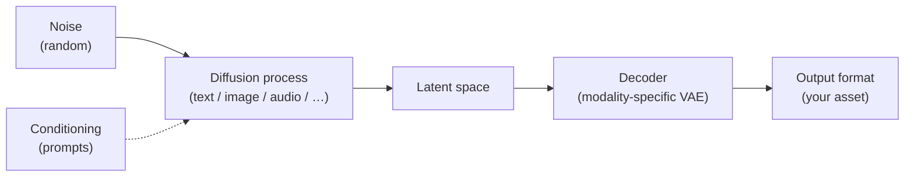
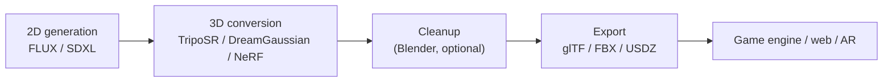

  <h1 style="color: white; margin: 0; font-size: 2.5rem;">Diffusion Model Outputs</h1>
  
Master the complete spectrum of diffusion outputs across text, images, audio, video, and 3D for professional multi-modal workflows.

The same denoising principle behind Stable Diffusion now generates images, audio, video, 3D, and even text. This guide covers the output formats each modality produces, how to choose the right export for your destination, and the workflows that connect them.

## Who This Is For and What It Covers

This is a reference for choosing **output formats and export workflows** once you can already generate content. It assumes you know the basics from [Stable Diffusion Fundamentals](stable-diffusion-fundamentals.html). Use it to answer practical questions: which image format preserves quality, how to get a smooth video out of an 8 fps model, what 3D format your engine wants, and how to keep outputs reproducible.

## Every Medium, One Principle

Diffusion models work by gradually denoising random data into coherent outputs. That single principle now spans several modalities, each with its own conditioning, decoder, and native file formats:

| Modality | Representative models | Native output | Typical export |
|----------|----------------------|---------------|----------------|
| Image | Stable Diffusion, SDXL, FLUX | Latent → pixels (VAE) | PNG, WebP, JPEG, EXR |
| Video | AnimateDiff, SVD, Sora-class | Frame sequence | MP4 (H.264), WebM, PNG sequence |
| Audio | Stable Audio, AudioLDM 2, MusicGen, Bark | Waveform / mel-spectrogram | WAV, FLAC, MP3, OGG |
| 3D | TripoSR, DreamGaussian, NeRF | Mesh / point cloud / splats | glTF, FBX, OBJ, PLY, USDZ |
| Text | LLaDA, Mercury, Gemini Diffusion (experimental) | Token sequence | Markdown, JSON, plain text |

> **A note on text diffusion:** most production language models (including the mainstream Gemini, GPT, and Claude families) are **autoregressive**, not diffusion-based. Text *diffusion* is a real but still-experimental line of research (LLaDA, Mercury, Google's Gemini Diffusion preview) that denoises whole token sequences in parallel. Treat it as emerging, not the default way text is generated today.

### The Unified Diffusion Pipeline

Every modality shares the same backbone — only the conditioning and the decoder change:

Diffusion models now span generative AI well beyond images. The sections below work through each modality's outputs and the export decisions that matter, starting with images (the most mature) and ending with text (the least).

## Text Diffusion (Experimental)

Unlike autoregressive models that emit one token at a time, **text diffusion** models denoise an entire sequence in parallel, refining a noisy draft toward coherent text over a few steps. The appeal is speed (parallel generation) and global coherence; the catch is that the technique is still research-stage and far less mature than image diffusion.

| Model | Status | Notable for |
|-------|--------|-------------|
| LLaDA | Open research model | Large diffusion language model, openly available |
| Mercury (Inception Labs) | Commercial preview | Diffusion LLM marketed for low-latency generation |
| Gemini Diffusion | Google research preview | Experimental, separate from the mainstream autoregressive Gemini |

Output handling is the same as any LLM: the model emits tokens, and you format them as Markdown, JSON, code, or plain text downstream. There is nothing format-specific about diffusion here beyond the generation method, so for practical text work the autoregressive models remain the default. The genuinely format-rich modalities are images, video, audio, and 3D, covered next.

## Image Diffusion Outputs: The Visual Foundation

Images are the most mature diffusion output. Because they are decoded from latent space, the format you save in determines how much of that quality you keep — and how large the file gets.

### Choosing an Image Format

#### Format Comparison at a Glance

| Format | Quality | File Size | Use Case | Pro Tip |
|--------|---------|-----------|----------|----------|
| **PNG** | Lossless | Large | Portfolio, Editing | Best for further processing |
| **JPEG** | Good | Small | Social Media | 85% quality sweet spot |
| **WebP** | Great | Tiny | Modern Web | 25-35% smaller than JPEG |
| **AVIF** | Excellent | Smallest | Cutting Edge | HDR support built-in |
| **EXR** | Perfect | Huge | Compositing | Stores multiple passes |

**Practical defaults:**

- **PNG** — your working/archival format. Use 16-bit when you will edit further, and it is the only common option that carries an alpha channel for transparent subjects.
- **JPEG** — for sharing and previews where size matters. Quality 85 with progressive encoding is the size/quality sweet spot; never re-save a JPEG repeatedly (generation loss compounds).
- **WebP** — a near-PNG-quality web format 25-35% smaller than JPEG, with optional transparency and animation. Quality ~90, method 6 for best compression.
- **AVIF** — smallest of all at comparable quality, with HDR and wide-gamut support. Browser support is now broad; encoding is slower.
- **EXR** — only for VFX/compositing, where you need 32-bit float and multiple render passes (depth, normals) in one file.

> **JPEG XL (JXL)** offers lossless JPEG transcoding and progressive decoding, but browser support stalled, so it remains an archival-only choice for now.

### Resolution Sweet Spots by Platform

> **Generate at your model's native resolution, then downscale** for a specific target — downscaling a clean high-res image beats generating directly at an odd small size.

| Platform | Optimal Size | Aspect Ratio | Model Choice | Format |
|----------|-------------|--------------|--------------|--------|
| Instagram Feed | 1080×1080 | 1:1 | SDXL/FLUX | JPEG 85% |
| Twitter/X | 1200×675 | 16:9 | Any | WebP/JPEG |
| Discord Sticker | 320×320 | 1:1 | SD 1.5 | WebP animated |
| Game Asset | 1024×1024+ | Any | SDXL | PNG 16-bit |
| Print (300 DPI) | 3000×3000+ | Any | FLUX | PNG/TIFF |

### Scaling Up: From Generation to Production

A common constraint is wanting a 4K image on a GPU that cannot generate one directly. The reliable answer is to generate small and upscale, rather than fight VRAM limits up front.

**Two-stage upscaling (recommended for limited VRAM):**

1. Generate at the model's native resolution (1024×1024 for SDXL/FLUX).
2. Run a dedicated upscaler — **Real-ESRGAN** or **SwinIR** for general images, **4x-UltraSharp** for crisp detail — to 2x-4x.
3. Optionally add a low-denoise (0.3-0.5) img2img/hires-fix pass to introduce genuine detail rather than just enlarging pixels.

**Direct high-res** is viable only with 16GB+ VRAM, and even then enabling **tiled VAE** prevents decode-time out-of-memory errors. Use it when you specifically need coherent large-scale composition that tiled upscaling can break apart.

| Goal | Approach |
|------|----------|
| Print / professional | AI upscaler + low-denoise refinement pass |
| Web display | Standard upscale (no refinement) is fine |
| Further editing | Keep the native-resolution PNG, upscale later |

### Professional Formats: When PNG Isn't Enough

If you composite in software like Nuke or After Effects, you need **EXR** — a 32-bit float format that stores multiple render passes (beauty, depth, normals, cryptomatte) in a single file with lossless compression. A diffusion pipeline can populate these passes by running depth and normal preprocessors alongside the main generation and saving them as named EXR channels.

#### When to Use Professional Formats

| If you're... | Use This | Why |
|--------------|----------|------|
| Compositing in Nuke/AE | EXR | Multi-channel support |
| Color grading | DPX/EXR | High bit depth |
| Creating HDR content | EXR/AVIF | HDR metadata |
| Archiving originals | PNG-16/TIFF | Lossless quality |

## Video Diffusion Outputs: Temporal Coherence

Video diffusion models extend denoising across time, generating a temporally coherent sequence rather than independent frames. The two practical questions are which model to use for your input, and how to get smooth, platform-ready output from a model that natively produces only a handful of low-fps frames.

### Video Diffusion Model Comparison

| Method | Input | Output | Speed | Best For |
|--------|-------|--------|-------|----------|
| **AnimateDiff** | Text prompt | 16-32 frames | Fast | Seamless loops, stylized motion |
| **Stable Video Diffusion (SVD)** | Single image | 14-25 frames | Medium | Animating a still image |
| **Sora-class** (Sora, Veo, Kling) | Text prompt | Many seconds | Slow / API | Full clips with scene coherence |
| **Frame interpolation** (RIFE, FILM) | Frame sequence | Smoothed video | Fast | Raising fps of any of the above |

The open, locally-runnable options are **AnimateDiff** (text-driven motion on top of an SD/SDXL checkpoint) and **SVD** (image-to-video). The proprietary Sora-class text-to-video models (Sora, Veo, Kling) produce long, highly coherent clips via API. As of 2026 the gap has narrowed considerably: capable open, locally-runnable long-video models now exist too — for example **Wan**, **HunyuanVideo**, **Mochi**, and **LTX-Video** — though they remain VRAM-hungry. If you are building now, prototype with AnimateDiff/SVD or one of these open video models so the rest of your pipeline is ready to swap them in.

### AnimateDiff: Loops and Stylized Motion

AnimateDiff adds a **motion module** to a normal checkpoint, so it inherits that checkpoint's style. Key settings:

- `frames`: 16 is the common baseline; keep it divisible by the context overlap.
- `context_overlap`: ~4 — this is what makes a loop seamless, by blending the end back into the start.
- Generate at a low native fps (8) and **interpolate up to 24-30 fps** in post rather than asking the model for more frames.

### SVD: Animating a Still Image

SVD takes one image and produces a short (roughly 2-4 second) clip. A typical flow: generate a strong still with FLUX/SDXL at SVD's preferred ratio (e.g. 1024×576), feed it to `svd_xt`, then interpolate to a smooth frame rate.

Useful SVD knobs:

- `motion_bucket_id` (0-255): higher means more movement; start around 127.
- `fps`: native output is ~6, so plan to interpolate.
- `decode_chunk_size`: lower it if VAE decode runs out of VRAM.

### From Low-fps Model Output to Smooth Video

Both AnimateDiff and SVD output few frames at low fps. The standard finishing step is **frame interpolation** — RIFE (fast, great quality) or FILM (slower, smoother) synthesize intermediate frames to reach 24-30 fps. After Effects, DaVinci Resolve, and Premiere also offer optical-flow interpolation built in.

### Platform Export Requirements

Different platforms expect different containers, codecs, and dimensions — there is no single export that fits all.

| Platform | Format | Resolution | Codec | Bitrate | Special Notes |
|----------|--------|------------|-------|---------|---------------|
| YouTube | MP4 | 1920×1080 | H.264 | 10-15 Mbps | Add motion blur |
| Instagram | MP4 | 1080×1080 | H.264 | 5-8 Mbps | 60s max |
| Twitter/X | MP4 | 1280×720 | H.264 | 5 Mbps | 2:20 max |
| Discord | GIF/MP4 | 800×600 | H.264 | 3 Mbps | <8MB for free |
| Game Engine | PNG Seq | Original | None | Lossless | Import as frames |

### Choosing a Video Export Format

| Need | Use |
|------|-----|
| Short loop | GIF (smallest, 256-color) or MP4 (quality) |
| Web embed | WebM/VP9 (modern, smaller) or MP4/H.264 (compatible) |
| Further editing | ProRes or a PNG sequence (no generation loss) |
| Social media | MP4 / H.264 (works everywhere) |
| Game asset | PNG sequence or a packed sprite sheet |

## Audio Diffusion Outputs: Sound from Noise

Audio diffusion models generate sound by denoising in waveform or mel-spectrogram latent space. The practical decisions are which model fits your need (music, SFX, or speech) and which container/bitrate your destination expects.

### Audio Diffusion Models by Output Type

| You need... | Common model | Notes |
|-------------|--------------|-------|
| Music | Stable Audio | Length depends on version: Stable Audio Open generates ~47s, Stable Audio 2.0 up to ~3 min of stereo; can output stems on some versions |
| Sound effects | AudioLDM 2 | Fast, good for short game/video SFX |
| Music from a melody | MusicGen (Meta) | Conditions on a hummed/played melody or text |
| Voice / speech | Bark, XTTS | Expressive TTS with emotion cues and voice cloning |

A note on capability: expressive TTS models like **Bark** support non-verbal cues in the text (`[laughs]`, `[sighs]`) and voice cloning, going well beyond flat read-aloud TTS. For looping game ambience, generate slightly long and trim to a clean loop point.

### Audio Export Guide

The right format depends entirely on the destination — lossless for anything you will mix further, compressed for delivery.

| Use Case | Format | Settings | Why |
|----------|--------|----------|-----|
| Music production / mixing | WAV or FLAC | 48 kHz, 24-bit | Lossless headroom for editing |
| Podcast / YouTube | MP3 | 44.1 kHz, 192-320 kbps | Universally compatible |
| Game assets | OGG Vorbis | 44.1 kHz, variable | Small, loops cleanly in engines |
| Web background | MP3 / M4A | 44.1 kHz, 128 kbps | Streaming-friendly size |
| Mastering target | WAV | 48 kHz, 32-bit float | Maximum precision before final export |

For delivery, normalize loudness to about **-14 LUFS** (the common streaming target) rather than to peak, so playback levels match other content.

## Rendering Text Inside Images

Legible text in generated images was a long-standing weakness. The transformer/T5-based models (FLUX, SD3) handle it far better than the older CLIP-based models because their text encoders carry character-level information into the diffusion process.

### Text Rendering by Model

| Model | Text quality | Best for | Tip |
|-------|--------------|----------|-----|
| FLUX | Excellent | Logos, signs, short phrases | Write the exact words naturally in the prompt |
| SD3 | Very good | Posters, book covers | Put the target text in quotes |
| SDXL | Fair, better with a text LoRA | Simple words | Keep it short; expect retries |
| SD 1.5 | Poor | Avoid — use ControlNet from a rendered text image | Composite real type instead |

### Three Ways to Get Text Right

1. **Direct generation (FLUX/SD3).** Write the exact string in quotes: `a minimalist logo for "NEXUS AI", clean typography, white background`. Keep it to a few words; long passages still drift.
2. **ControlNet from rendered type (any model).** Render the words in a real font, run Canny on it, and use that as a ControlNet — the model styles around exact letterforms.
3. **Inpaint the text region.** Generate the background, mask the area for the text, and inpaint just the lettering. This is the reliable path for older models and for precise placement.

> **Describe the medium, not just the words.** "neon sign saying OPEN 24/7 on a brick wall, night photography" succeeds far more often than "the text OPEN 24/7" because the model has seen that physical context. The same trick works for carved stone, LED boards, graffiti, embossed metal, and vintage posters.

For something like a book cover, layer the approaches: generate the background art at print resolution, then inpaint the title and author into defined regions, and export to a print-ready format (PDF, CMYK, ~300-400 DPI, with bleed).

## Multi-Pass and Layered Outputs

A single generation can yield more than a flat image. By running depth, normal, or segmentation preprocessors alongside the main output, you produce companion data that downstream tools (game engines, compositors, editors) consume directly.

| Output combination | What you get | Common use | File format |
|--------------------|--------------|------------|-------------|
| Image + depth | 2.5D scene data | AR filters, parallax, 3D effects | EXR channel or PNG pair |
| Image + segmentation | Editable layers | Per-object editing in Photoshop | PSD / TIFF |
| Image + normals | Surface detail | Game-engine materials | EXR channels |
| Video + audio | Complete clip | Social delivery | MP4 container |

**Depth for AR:** generate the subject, run a depth preprocessor (e.g. Depth Anything / MiDaS), and save image + depth together — that pair is what ARKit, ARCore, and Lens Studio expect.

**Segmentation for editing:** run Segment Anything (SAM) over a generated scene and export each segment as its own layer to a PSD, so every object can be moved or restyled independently.

**PBR texture sets for games:** a generated material isn't just a color map. Engines want a set — base color (sRGB), normal map (linear), and a packed roughness/metallic/AO map (often R=AO, G=roughness, B=metallic) — typically at 2048px for the albedo/normal and 1024px for the packed maps. Generate the base color, derive the rest, and keep them in matching dimensions.

## 3D Diffusion Outputs: Spatial Denoising

3D generation methods range from near-instant single-image reconstruction to slow, photoreal scene capture. Pick by how much quality and time you can spend; for most asset work, start fast and only escalate if the result isn't good enough.

### 3D Generation Methods

| Method | Speed | Output | Best for |
|--------|-------|--------|----------|
| TripoSR | Seconds | Mesh | Fast prototypes, single-image to 3D |
| One-2-3-45 | ~1 min | Textured mesh | Game-ready assets |
| DreamGaussian | 1-2 min | Gaussian splats / mesh | Real-time viewing, quick quality |
| NeRF (e.g. Instant-NGP) | Minutes-plus | Radiance field → mesh/video | Photoreal capture from many photos |

> **Single-image-to-3D works best with a clean subject:** generate the input with a neutral, plain background and even lighting (`fantasy sword, game asset, neutral lighting, white background`). Busy backgrounds confuse reconstruction.

A typical asset flow: generate a clean reference with SDXL/FLUX, run **TripoSR** for a quick mesh (or **DreamGaussian** if you want higher quality), then export to the format your target needs — glTF/GLB for web, FBX for Unity/Unreal, OBJ for Blender.

### Understanding 3D Formats

Choose the export by destination, not by feature count:

| If you're using... | Export as... | Why | Settings |
|-------------------|--------------|-----|----------|
| **Unity/Unreal** | FBX | Full feature support | Embed textures |
| **Web (Three.js)** | GLTF/GLB | Optimized loading | Draco compression |
| **Blender** | OBJ or FBX | Maximum compatibility | Y-up axis |
| **3D Printing** | STL | Geometry only | Watertight mesh |
| **Apple AR** | USDZ | Native support | Include materials |

### Gaussian Splatting and NeRF

**Gaussian splatting** represents a scene as millions of colored 3D blobs rather than a mesh. It renders view-dependent effects (reflections, fine detail) in real time on consumer hardware and stores as a `.ply` point cloud viewable in the browser. DreamGaussian can produce a splat from a single image; full-scene splats come from multi-photo capture.

**NeRF** (neural radiance fields) reconstructs a scene from many photos (often ~30+ around the subject) into a radiance field you can render from any angle. Fast variants like NVIDIA's **Instant-NGP** train in minutes; results are photoreal and can be exported as turntable video, a textured mesh, or a point cloud. Use NeRF when capture quality matters more than speed.

### 3D Workflow at a Glance

## Choosing a Format: Decision Matrix

When in doubt, decide by your single highest priority — quality, size, or compatibility — then read across:

| Priority | Image | Video | Audio | 3D |
|----------|-------|-------|-------|-----|
| Maximum quality | PNG-16 / EXR | ProRes 4444 / DNxHR | WAV 32-bit float | USD / FBX with textures |
| Smallest size | AVIF > WebP > JPEG | AV1 > H.265 > H.264 | Opus > AAC > MP3 | Draco-compressed glTF / PLY |
| Maximum compatibility | JPEG (q85) | H.264 MP4 | MP3 192 kbps | OBJ + MTL |

A single high-resolution master can feed every target: keep one lossless original, then derive platform-specific exports (resized, re-encoded) from it rather than re-generating. For a web gallery, generate AVIF/WebP with a JPEG fallback at several widths for a responsive `srcset`.

### Output Targets by Platform

| Modality | Web | Print / production | Social | Game / engine |
|----------|-----|--------------------|--------|---------------|
| Image | WebP / AVIF, progressive | PNG-16 / TIFF, color profile embedded | JPEG 85%, platform dimensions | PNG / packed PBR maps |
| Video | WebM VP9 | ProRes / DNxHR | MP4 H.264 | Image sequence + audio |
| Audio | MP3 / AAC 128-192 kbps | WAV 24-bit, 48 kHz | MP3, normalized | OGG Vorbis, loopable |
| 3D | glTF + Draco | USD / Alembic | — | FBX with textures |

## Post-Processing Diffusion Outputs

A raw generation is rarely the final deliverable. A light, modality-aware finishing pass cleans up denoising artifacts without overworking the result.

**Images** — subtle is the rule. A small vibrance/contrast lift (5-10%) and resolution-aware sharpening (unsharp mask only above ~2K) is usually enough. Only run a denoise pass if you generated at high CFG, which tends to add grain.

**Video** — stabilize to remove AI jitter, interpolate up to 24-30 fps (RIFE/FILM), then color-grade with a LUT and add light film grain for cohesion. Sync and mix audio last with headroom to spare.

**Audio** — a standard mastering chain (gentle EQ → compression → limiting → loudness normalization to ~-14 LUFS) takes a raw generation to delivery quality. Keep a 24-bit WAV master and export compressed copies from it.

### Metadata: Make Outputs Reproducible

The single most valuable post-step is recording how an output was made. Months later, "how did I generate this?" is unanswerable without it. Embed the generation settings in the file (PNG text chunks, EXIF, or XMP) **and** write a JSON sidecar as a durable backup. Capture at minimum:

- Prompt and negative prompt
- Model name and hash, plus any LoRAs/VAE
- Sampler, scheduler, steps, CFG/guidance, seed, and resolution
- Workflow tool and version (and the workflow file itself for ComfyUI)

ComfyUI already embeds the full workflow graph in saved PNGs by default — preserve that and you can drag the image back into ComfyUI to recover the exact graph.

## Real-Time and Streaming Outputs

Because diffusion is iterative, you can decode and display intermediate latents during generation — useful for live previews, art-stream overlays, and client demos. The pattern is to decode a low-resolution preview every few steps and push it over a WebSocket, then send the full-quality image when sampling completes. LCM/Turbo models (1-8 steps) make this responsive enough for interactive use; see [Advanced Techniques](advanced-techniques.html) for the few-step methods behind real-time generation.

## Industry-Specific Export Notes

Different deliverables have hard requirements that a generic export will not meet:

- **Film / VFX** — multi-pass EXR (beauty, depth, motion, normals, cryptomatte) at 32-bit linear, delivered as a DPX/EXR sequence in a managed color space (e.g. ACEScg). Single flattened PNGs are not enough for compositing.
- **Game development** — a full PBR texture set (albedo, normal, packed ORM) at power-of-two resolutions with mipmaps, exported in a GPU-friendly compression (BC7). Provide LOD resolutions (512-4096) and pack atlases where possible.
- **Web / mobile** — responsive `srcset` exports: AVIF/WebP with a JPEG fallback, at multiple widths and pixel densities, named so the markup can select per device.

## Future of Diffusion Outputs

The output landscape is still moving. A few trends worth tracking:

| Trend | Status | Why it matters |
|-------|--------|----------------|
| AVIF | Production-ready | ~50% smaller than JPEG with HDR; safe to adopt now |
| JPEG XL | Stalled browser support | Strong format technically, but archival-only for now |
| Gaussian splatting | Maturing fast | Real-time, view-dependent 3D on consumer hardware |
| OpenUSD | Industry standard for 3D | Pixar's interchange format; the safe long-term 3D choice |
| WebGPU | Emerging | Browser-native GPU access for in-page 3D and inference |

The durable strategy is **format-agnostic pipelines**: keep a high-quality master, generate target formats on demand, and add a fallback chain so a new format slots in without reworking everything. Longer-horizon ideas — neural/learned compression and "semantic" formats that store meaning rather than pixels — are research-stage; design so you can adopt them later, but don't depend on them today.

## Key Takeaways

- **One principle, every medium.** Noise → conditioned denoising → latent → decoder applies across image, audio, video, and 3D (and experimentally, text) — only the conditioning and decoder change.
- **The decoder is the final quality gate.** Match it to the modality (image VAE, audio vocoder, mesh extractor) and pick the right export format for your destination.
- **Temporal/structural coherence is the hard part** for video and 3D — frame interpolation, motion modules, and consistency techniques exist to address it.
- **Preserve metadata.** Recording seeds, prompts, and parameters makes outputs reproducible and workflows debuggable.
- **Cross-modal pipelines compound value:** text → image, image → video, audio + video — the shared latent paradigm makes these combinations natural.

---

*Continue your diffusion journey with [Stable Diffusion Fundamentals](stable-diffusion-fundamentals.html) for deep model understanding, or explore [Advanced Techniques](advanced-techniques.html) for cutting-edge diffusion methods.*

---

#### See Also

- [Stable Diffusion Fundamentals](stable-diffusion-fundamentals.html) - The denoising principle shared by every modality
- [ComfyUI Guide](comfyui-guide.html) - Visual workflow creation
- [Advanced Techniques](advanced-techniques.html) - Cutting-edge workflows
- [Model Types](model-types.html) - Understanding LoRAs, VAEs, embeddings
- [Base Models Comparison](base-models-comparison.html) - SD 1.5, SDXL, FLUX compared
- [ControlNet](controlnet.html) - Precise control over generation
- [AI/ML Documentation Hub](./) - Complete AI/ML documentation index

