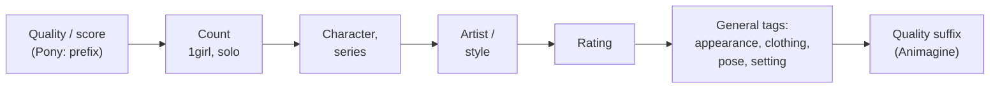
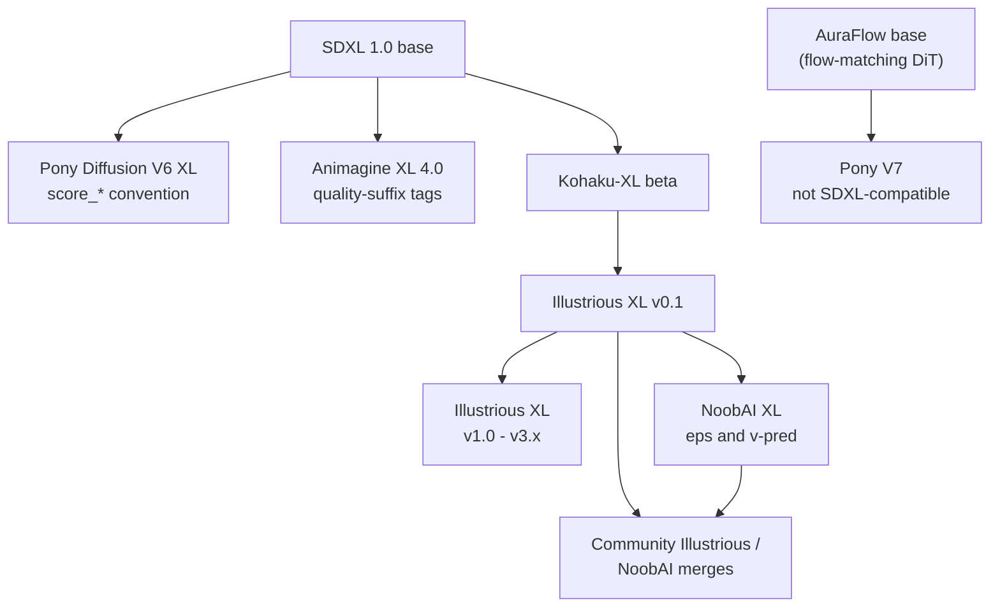
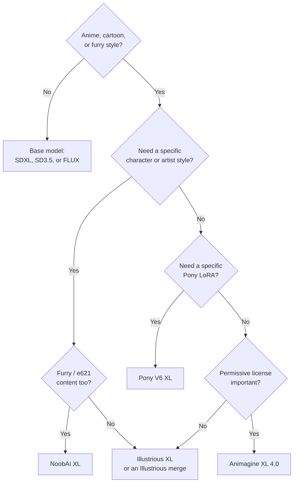

[AI/ML Documentation](./) &raquo; [Base Models Comparison](base-models-comparison.html) &raquo; Pony &amp; Community Fine-Tunes

The most widely used stylized-art checkpoints are not base models but **community fine-tunes of SDXL**: Pony Diffusion V6 XL, Illustrious XL, NoobAI XL, and Animagine XL. They share SDXL's architecture and add-on ecosystem but each expects its own prompting dialect. This page covers what fine-tuning changes, each family's tag conventions and recommended settings, how the families relate, and when to choose one over a base model. It also notes the 2025-2026 move of some of these projects off SDXL, such as Pony V7 on AuraFlow.

## Fine-Tunes vs. Base Models

A **base model** is trained from scratch (or near it) by a well-resourced lab on a broad dataset: SD 1.5, SDXL, SD3.5, and FLUX are base models. A **fine-tune** continues training a base checkpoint on a narrower, curated dataset to shift its domain, default aesthetic, and prompting convention. The large anime fine-tunes are unusually heavy: millions of images and hundreds to thousands of GPU-hours. That is enough to overwrite much of SDXL's prior, but the architecture is untouched.

| Unchanged by an SDXL fine-tune | Changed by an SDXL fine-tune |
|--------------------------------|------------------------------|
| U-Net architecture, dual CLIP text encoders | Default look and content bias |
| VAE and latent space | Vocabulary (booru tags, character and artist names) |
| ControlNet / IP-Adapter compatibility | Prompting convention (score, quality, date tags) |
| ~1 MP native resolution and aspect buckets | Recommended CFG, sampler, and CLIP skip |
| Attention-weighting syntax `(tag:1.2)` | Sometimes the **prediction type** (eps vs. v-prediction) |

The last row is a newer wrinkle. Some recent fine-tunes (NoobAI V-Pred, some Illustrious releases) were converted to **v-prediction with zero-terminal-SNR**, which fixes SDXL's inability to produce truly dark or truly bright images but requires matching sampler settings. Loading a v-pred checkpoint as a normal eps model produces washed-out, noisy output.

Because the latent space is shared, SDXL add-ons *load* on any fine-tune. Whether they *look right* depends on how far the fine-tune has drifted, which is why LoRAs are usually trained per family (see [Cross-Compatibility](#cross-compatibility)).

## Booru Tag Conventions

All four families learned their vocabulary from **Danbooru-style image boards** (plus e621 for Pony and NoobAI), so tag-based prompting is the core skill. Base SDXL and FLUX, by contrast, respond best to sentences.

### Tag Syntax

- **Spaces, not underscores.** Booru tags are stored as `long_hair`, but these models were trained with underscores converted to spaces, so write `long hair`. Most UIs do *not* convert between the two for you, and an underscore splits differently in the CLIP tokenizer. Short tags like `1girl` are written as-is.
- **Escape parentheses.** Qualified tags such as `hatsune miku \(cosplay\)` or `horror \(theme\)` need backslash-escaped parentheses, because bare parentheses are attention-weighting syntax in A1111/Forge/ComfyUI.
- **Count tags anchor composition.** `1girl`, `2girls`, `1boy`, `solo`, `multiple girls`, `no humans`.
- **Character and series tags.** Named characters use the booru form `name \(series\)` plus a separate series tag. A known tag recalls the canonical design far more reliably than a description.
- **Artist tags** act as strong style controls on Illustrious and NoobAI (NoobAI's card uses the form `artist:name`). Pony V6 deliberately obfuscated artist names during training, so they have little effect there.
- **Attention weighting** is standard SDXL syntax: `(twintails:1.2)` strengthens a tag and `(background:0.8)` weakens it.

### Tag Order

CLIP gives earlier tokens somewhat more influence, and most of these datasets were captioned in a fixed order. Match that order:



Where the quality tags go differs by family: Pony wants its score string first, while Animagine 4.0 was trained with quality tags at the *end*.

## Pony Diffusion V6 XL

Pony Diffusion V6 XL (PDXL), released by PurpleSmartAI in early 2024, is the most influential SDXL fine-tune for anime, cartoon, furry, and pony content. Its LoRA library on Civitai is still one of the largest for any checkpoint.

| Property | Value |
|----------|-------|
| Base | SDXL 1.0 |
| Training data | ~2.6M images, balanced roughly 1:1 across anime / cartoon / furry / pony sources and across safe / questionable / explicit ratings |
| Captions | Booru tags; about half the images also have natural-language captions |
| Prompt system | `score_*` aesthetic tags + `source_*` + `rating_*` |
| CLIP skip | **2** (required for good output) |
| License | Custom Pony license: generated images may be used commercially; commercial hosting of the model is restricted |

### The `score_*` System

Every training image was rated by an aesthetic classifier trained on human preference data, and the rating was written into the caption. At inference you prepend the score tags to request high-rated output.

The model author's recommended prefix is the **full string**:

```text
score_9, score_8_up, score_7_up, score_6_up, score_5_up, score_4_up
```

This looks redundant, but it reflects how captions were written during training: the high-score captions contained that whole sequence, so it is the string the model actually associated with quality. `score_9` alone works but has a weaker effect. Many users shorten it to `score_9, score_8_up, score_7_up`, which is usually close enough.

Pony's card also notes that negative prompts are rarely needed and that generic quality words (`masterpiece`, `hd`) do nothing useful. A common optional practice is to put `score_4, score_5, score_6` in the negative prompt.

### Source and Rating Tags

| Tag | Effect |
|-----|--------|
| `source_anime` | 2D anime styling |
| `source_cartoon` | Western cartoon styling |
| `source_furry` | Anthro / furry styling |
| `source_pony` | My Little Pony-derived content |
| `rating_safe`, `rating_questionable`, `rating_explicit` | Content rating |

The dataset is balanced across ratings, so the model does not default to SFW output. Put `rating_safe` in the positive prompt and the other rating tags in the negative prompt when you need safe results.

### Recommended Settings

| Setting | Value |
|---------|-------|
| Resolution | SDXL buckets, e.g. 1024×1024, 832×1216, 1216×832 |
| Steps | ~25 |
| CFG | 6-8 (5-7 with many LoRAs stacked) |
| Sampler | Euler a (author's recommendation); DPM++ 2M Karras also common |
| CLIP skip | 2 |
| VAE | Baked in (standard SDXL VAE) |

```text
Positive: score_9, score_8_up, score_7_up, score_6_up, score_5_up, score_4_up,
          source_anime, rating_safe, 1girl, solo, long hair, blue eyes,
          school uniform, sitting, classroom, window, soft lighting

Negative: score_4, score_5, score_6, rating_explicit, rating_questionable
```

### Pony V7

Pony Diffusion V7 (October 2025) is **not** an SDXL model. It is a ~7B-parameter model on the **AuraFlow** architecture, a flow-matching transformer, trained on about 10M images selected from a pool of over 30M. Its model card recommends a structured natural-language template (special tags, then a factual description, then a stylistic description, then extra content tags), 768-1536 px resolutions, and at least 30 steps. It also cautions that V7 prompting can be inconsistent and that `score_*` tags have much weaker effect than in V6. Because the architecture differs, **no SDXL LoRA, ControlNet, or IP-Adapter works on V7**, and V6's ecosystem does not carry over. At the time of writing V6 remains the more widely used Pony checkpoint.

## Illustrious XL

**Illustrious XL** (OnomaAI Research, first released September 2024 with an accompanying arXiv paper) is trained on a large, carefully labeled Danbooru dataset. It is valued for accurate native recall of characters, artists, and tags without a score prefix.

- **Prompting:** plain Danbooru tags with conventional quality tags (`masterpiece, best quality`) and negatives such as `worst quality, low quality`.
- **Versions:** v0.1 (itself trained on top of Kohaku-XL beta, an earlier SDXL anime fine-tune) is the openly released checkpoint that most community merges (and NoobAI) build on. Later releases raised native resolution: v1.0 targets up to 1536×1536, v2.0 supports 512-1536 px with more natural-language captions, and v3.x (with v-prediction variants) targets up to 2048×2048 on data through late 2024. Availability and licensing of the later versions have differed from v0.1, so check each release's model page.
- **Settings:** CFG ~4-7, 20-30 steps, Euler a or DPM++ 2M; CLIP skip 1 or 2 depending on the derivative (check the card).

Since 2025, "Illustrious" is effectively an ecosystem label on Civitai: many popular anime checkpoints are Illustrious or NoobAI merges, and LoRAs are tagged against that base.

## NoobAI XL

**NoobAI XL** (Laxhar Lab) continues training from the Illustrious early-release base on the **full Danbooru dataset (up to late October 2024) plus e621**, with native tags and natural-language captions. It ships in two lines:

- **Epsilon-prediction** (standard SDXL behavior).
- **V-prediction** (`noobai-XL-Vpred-1.0`), which the card flags prominently: it **requires v-prediction sampling with zero-terminal-SNR** and the Euler sampler. In ComfyUI, add a `ModelSamplingDiscrete` node set to `v_prediction` with `zsnr` enabled, unless the checkpoint carries that metadata and your frontend applies it automatically. In diffusers, configure the scheduler with `prediction_type="v_prediction"` and `rescale_betas_zero_snr=True`.

NoobAI's card documents its conditioning tags precisely, and the scheme is worth knowing because many derivatives inherit it:

| Tag type | Tags | Meaning |
|----------|------|---------|
| Quality (popularity percentile) | `masterpiece` > 95th, `best quality` 85-95th, `good quality` 60-85th, `normal quality` 30-60th, `worst quality` ≤30th | Popularity rank, time-decayed so recent preferences dominate |
| Aesthetic | `very awa` (top 5% by aesthetic scorer), `worst aesthetic` (bottom 5%) | Classifier-based aesthetic score |
| Period | `old` 2005-2010, `early` 2011-2014, `mid` 2014-2017, `recent` 2018-2020, `newest` 2021-2024 | Era of the art style |
| Year | `year 2023` etc. | Specific year |

Recommended V-Pred 1.0 settings from the card:

| Setting | Value |
|---------|-------|
| Resolution | ~1 MP; 832×1216 preferred (also 768×1344, 896×1152, 1024×1024, and landscape equivalents) |
| Steps | 28-35 |
| CFG | 4-5 |
| Sampler | Euler (other samplers "will not work properly") |
| Positive prefix | `masterpiece, best quality, newest, absurdres, highres, safe,` |
| Negative | `nsfw, worst quality, old, early, low quality, lowres, signature, username, logo, bad hands, mutated hands, mammal, anthro, furry, ambiguous form, feral, semi-anthro` |

The negative prompt's furry terms exist because the e621 data otherwise pulls outputs toward anthro characters. Caption order on the card is: count, character, series, artists, special tags, general tags.

## Animagine XL

**Animagine XL** (Cagliostro Research Lab) is a long-running anime series. **Animagine XL 4.0** (January 2025, with a refined "4.0 Opt" in February 2025) was retrained from SDXL 1.0 rather than continued from 3.x, and is released under CreativeML Open RAIL++-M, the most permissive license of the four families.

- **Structure:** `1girl/1boy/1other, character, series, rating, general tags..., quality tags` with **quality tags at the end**.
- **Quality tags:** `masterpiece, high score, great score, absurdres`; negatives include `low score, bad score, average score` alongside the usual `worst quality, low quality, lowres, bad anatomy, bad hands`.
- **Settings:** CFG 4-7 (5 recommended), 25-28 steps, Euler a, standard SDXL resolutions from 1024×1024 to 1536×640.

## Comparing the Families

| | Pony V6 XL | Illustrious XL | NoobAI XL | Animagine XL 4.0 |
|--|-----------|----------------|-----------|------------------|
| Base | SDXL | SDXL (via Kohaku-XL) | Illustrious v0.1 | SDXL (retrained) |
| Data | Booru + e621 + others, ~2.6M | Danbooru | Full Danbooru + e621 | Danbooru-style, curated |
| Prediction | eps | eps (v-pred variants exist) | eps and v-pred lines | eps |
| Quality convention | `score_9, score_8_up, ...` prefix | `masterpiece, best quality` | Percentile + `very awa` + period tags | Suffix: `masterpiece, high score, great score, absurdres` |
| Artist tags | Obfuscated (weak) | Strong | Strong | Supported |
| CLIP skip | 2 | 1-2 | 1-2 | Default |
| Typical CFG | 6-8 | 4-7 | 4-5 | 5 |
| License | Custom (hosting restricted) | Fair AI Public License 1.0-SD (v0.1); later versions vary | Fair AI Public License 1.0-SD | Open RAIL++-M |

### Lineage



**LoRAs follow the branch they were trained on.** A Pony LoRA assumes Pony's priors and score context; an Illustrious LoRA assumes plain-tag priors and generally works across NoobAI and Illustrious merges, since they share the v0.1 root.

### The Same Intent, Five Dialects

| Model | Prompt |
|-------|--------|
| SDXL base | `anime illustration of a girl with long blue hair in a school uniform, clean line art` |
| Pony V6 | `score_9, score_8_up, score_7_up, source_anime, rating_safe, 1girl, solo, long hair, blue hair, school uniform` |
| Illustrious XL | `masterpiece, best quality, 1girl, solo, long hair, blue hair, school uniform` |
| NoobAI XL | `masterpiece, best quality, newest, absurdres, highres, safe, 1girl, solo, long hair, blue hair, school uniform` |
| Animagine XL 4.0 | `1girl, solo, safe, long hair, blue hair, school uniform, masterpiece, high score, great score, absurdres` |

## Choosing a Fine-Tune

A fine-tune trades generality for strength in its niche. The choice depends mostly on domain fit and prompting style, not raw capability.



**Choose a fine-tune when:**

- The target is anime, cartoon, or furry art. These models far outperform stock SDXL on line quality, character coherence, and style consistency.
- You need **character or artist recall**. Booru-trained models know thousands of characters by tag.
- You want a learned **quality control**: Pony's score tags, NoobAI's percentile and aesthetic tags.

**Stay on a base model when:**

- You need **photorealism**. Anime fine-tunes are biased away from photographic output.
- You want to write **long natural-language prompts**. SD3.5 and FLUX, with their T5 or LLM text encoders, reward sentences.
- You need **legible text in the image**. The SDXL fine-tunes inherit SDXL's weak text rendering.
- You need **licensing clarity** for commercial work. Check each fine-tune's license; Pony's and NoobAI's include use restrictions beyond Open RAIL++-M.

## Cross-Compatibility

| You have... | On Pony V6 | On Illustrious / NoobAI | On Pony V7 | Notes |
|-------------|-----------|-------------------------|-----------|-------|
| SDXL ControlNet / IP-Adapter | Yes | Yes | No | Shared SDXL latent space; anime-specific ControlNets often work better |
| LoRA trained on stock SDXL | Usually | Usually | No | Often off-style because the priors have shifted |
| LoRA trained on Pony V6 | Best | Often degraded | No | Assumes score-tag context |
| LoRA trained on Illustrious / NoobAI | Often degraded | Best | No | Plain-tag priors |
| eps LoRA on a v-pred checkpoint | — | Usually works | — | LoRA weights load; sampling settings follow the checkpoint |
| SD 1.5, SD3.5, or FLUX add-ons | No | No | No | Different architecture |

## See Also

- [Base Models Comparison](base-models-comparison.html) - SD 1.5, SDXL, SD3, FLUX, and Pony side by side
- [SDXL Guide](sdxl-guide.html) - The architecture all four families share
- [Stable Diffusion Fundamentals](stable-diffusion-fundamentals.html) - Noise prediction, v-prediction, and samplers
- [Model Types](model-types.html) - Checkpoints, LoRAs, VAEs, and embeddings
- [LoRA Training](lora-training.html) - Training LoRAs against a fine-tune base
- [ControlNet](controlnet.html) - Structural control across the SDXL family
- [ComfyUI Guide](comfyui-guide.html) - Visual workflow creation
- [AI/ML Documentation Hub](./) - Complete AI/ML documentation index
