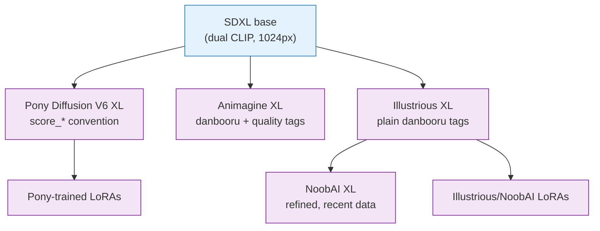
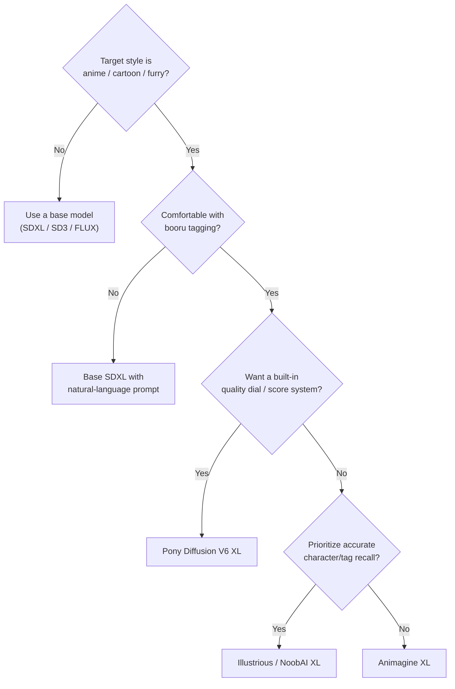

[AI/ML Documentation](./) &raquo; [Base Models Comparison](base-models-comparison.html) &raquo; Pony &amp; Community Fine-Tunes

A deep dive into the most popular community fine-tunes of SDXL — Pony Diffusion, Illustrious, NoobAI, and Animagine — including the `score_*` scoring system, danbooru tag conventions, and a decision guide for choosing a fine-tune over a stock base model.

## Fine-Tunes vs. Base Models

A **base model** (sometimes called a *foundation* checkpoint) is trained from scratch or near-scratch by a well-resourced lab on a broad, general dataset — SD 1.5, SDXL, SD3, and FLUX are all base models. A **fine-tune** takes one of those base checkpoints and continues training it on a narrower, curated dataset to push the model toward a particular domain, aesthetic, or prompting convention.

Pony Diffusion and its peers are all **fine-tunes of SDXL**. That single fact carries enormous practical consequences: because the underlying architecture, VAE, and latent space are unchanged, every Pony-family model shares SDXL's LoRAs, ControlNets, IP-Adapters, and tooling. You are not adopting a new ecosystem — you are adopting a new *dialect* of prompting on top of one you already have.

- **Same Engine, New Dialect.** Pony, Illustrious, and NoobAI are SDXL underneath — they share its LoRAs and ControlNets but expect very different prompts.
- **Quality as a Tag.** Pony bakes a learned quality ladder (`score_9` … `score_4`) into the prompt; you steer aesthetics by naming a rating.
- **Booru Tagging.** These models think in danbooru tags, not sentences. Tag order, underscores, and known character names matter.

### What Fine-Tuning Changes (and What It Doesn't)

| Unchanged by an SDXL fine-tune | Changed by an SDXL fine-tune |
|--------------------------------|------------------------------|
| Architecture (enlarged U-Net, dual text encoders) | Aesthetic "default look" and bias |
| Latent space / VAE compatibility | Vocabulary the model responds to (tags, characters) |
| LoRA, ControlNet, IP-Adapter compatibility | Prompting convention (e.g. `score_*` prefixes) |
| Native 1024×1024 resolution | Content distribution (anime/furry vs. photo) |
| Sampler/scheduler behavior | Recommended CFG and CLIP-skip values |

Because the latent space is preserved, you can mix and match: an SDXL LoRA trained on the stock base will *usually* work on Pony, though the result is often slightly off-aesthetic because the fine-tune shifted the model's priors. LoRAs trained **on Pony itself** are the safe choice for Pony, and similarly for Illustrious/NoobAI.

## Pony Diffusion V6 XL

### Overview

Pony Diffusion V6 XL (commonly just "Pony" or "PDXL") is the most influential SDXL fine-tune for anime, cartoon, and furry content. It was trained on a large, heavily curated booru-style dataset with a custom aesthetic-scoring pipeline, and it reshaped how a generation of users prompt for stylized art.

### Technical Profile

| Property | Value |
|----------|-------|
| Base | SDXL (a fine-tune, not a from-scratch model) |
| Specialization | Anime / cartoon / furry |
| Training data | Curated booru datasets with aesthetic scoring |
| Prompt system | `score_*` quality tags + danbooru tags |
| Native resolution | 1024×1024 |
| File size | ~6.5 GB |
| Ecosystem | Full SDXL LoRA / ControlNet compatibility |

### The `score_*` Scoring System

Pony's defining quirk is **score-based prompting**. During training, every image was assigned an aesthetic rating, and that rating was injected into the caption as a `score_N` tag. The model therefore learned to associate the literal strings `score_9`, `score_8_up`, and so on with quality tiers. At inference time you *prepend* these tags to steer the model toward (or away from) higher-rated output.

The scale runs from `score_9` (the highest tier) down to `score_4` and below. Two related tag forms exist:

- **`score_N`** — names a single tier (e.g. `score_9` = the top bucket).
- **`score_N_up`** — names that tier *and everything above it* (e.g. `score_7_up` = tiers 7, 8, and 9).

In practice the community converged on a "quality stack" prefix that lists several `_up` tags together, which empirically produces the cleanest output:

```text
score_9, score_8_up, score_7_up
```

This is not redundant superstition in the way SD 1.5's `masterpiece, best quality` spam often was — the tags were genuinely present in Pony's training captions, so they carry real signal. The leading `score_*` tags act as a **quality dial**: include high tiers in the positive prompt, and push low tiers (`score_4`, `score_5`, `score_6`) into the **negative** prompt to suppress low-rated aesthetics.

> **Why three tags and not one?** Each tier was a slightly different slice of the data. Stacking `score_9, score_8_up, score_7_up` blends the top buckets and avoids over-committing to the narrow, sometimes-overcooked `score_9`-only look. Treat it as the default and adjust to taste.

### Source Tags

Pony also learned **rating/source tags** that act as a coarse content and style switch. These are part of why a single Pony checkpoint can swing between very different looks:

| Tag | Effect |
|-----|--------|
| `source_anime` | Pushes toward 2D anime styling |
| `source_cartoon` | Western cartoon styling |
| `source_furry` | Anthro / furry styling |
| `source_pony` | The MLP-derived content the model was originally named for |
| `rating_safe` / `rating_questionable` / `rating_explicit` | Coarse content-safety steering |

Including `rating_safe` and pushing explicit ratings into the negative prompt is the standard way to keep Pony output SFW, since the model otherwise drifts toward NSFW without careful prompting.

### Recommended Settings

| Setting | Value |
|---------|-------|
| Resolution | 1024×1024 (SDXL aspect buckets) |
| Steps | 25-30 |
| CFG scale | 6-8 |
| Sampler | `euler_a` or `dpmpp_2m_sde` |
| CLIP skip | 2 (important for anime fine-tunes) |
| Positive prefix | `score_9, score_8_up, score_7_up` |
| Negative prefix | `score_6, score_5, score_4` |

### Prompt Structure

A workable Pony prompt follows a consistent left-to-right ordering — quality and source tags first, then subject, then descriptive booru tags:

- **Positive:** `score_9, score_8_up, score_7_up, source_anime, rating_safe, 1girl, [character name], [outfit], [pose], [expression], [setting], [lighting], [style tags]`
- **Negative:** `score_6, score_5, score_4, source_furry, rating_explicit, worst quality, low quality, bad anatomy, bad hands, extra digits`

The leading `score_*` and `source_*` tags do the heavy lifting; everything after them is ordinary danbooru tagging, where tags earlier in the prompt carry slightly more weight.

```text
# Example
Positive: score_9, score_8_up, score_7_up, source_anime, rating_safe,
          1girl, solo, long hair, blue eyes, school uniform, sitting,
          classroom, window, soft lighting, detailed background

Negative: score_6, score_5, score_4, source_furry, rating_explicit,
          worst quality, low quality, blurry, bad anatomy, bad hands,
          extra digits, watermark, signature
```

## Booru Tag Conventions

All of the anime fine-tunes — Pony included — inherit their vocabulary from **danbooru-style image boards**, so understanding booru tagging is the key skill for prompting them. This is the single biggest difference from prompting a base SDXL or FLUX model, which prefer natural-language descriptions.

### Tag Syntax

- **Underscores in training, spaces in prompts.** Booru tags are stored with underscores (`blue_eyes`), but most UIs convert spaces to underscores internally, so you can write `blue eyes` and it resolves correctly. When a tag is genuinely a single token (`1girl`), write it as-is.
- **Count tags.** `1girl`, `2girls`, `1boy`, `multiple_girls`, `solo` are first-class tags that strongly anchor composition. Lead with them.
- **Character tags.** The model knows many characters by their booru tag, often in the form `character_name_(series_name)`. Naming a known character recalls its canonical design far more reliably than describing it.
- **Attribute tags.** Hair (`long_hair`, `twintails`), eyes (`red_eyes`), clothing (`thigh-highs`, `hoodie`), and pose (`looking_at_viewer`, `arms_up`) tags compose freely.
- **Meta/quality tags.** `masterpiece`, `best_quality`, `highres`, `absurdres` exist as separate signals from the `score_*` system; on Pony the `score_*` tags dominate, but meta tags still nudge.

### Tag Order and Weighting

Booru models read prompts roughly left-to-right with decreasing emphasis, so the convention is:

1. Quality / score tags
2. Source / rating tags
3. Subject count + character
4. Major attributes (hair, eyes, body)
5. Clothing
6. Pose / action
7. Setting / background
8. Style / lighting modifiers

You can also use the standard SDXL attention-weighting syntax to emphasize a tag — `(twintails:1.2)` increases its strength, `(background:0.8)` decreases it. This is identical to base SDXL because the attention mechanism is unchanged by the fine-tune.

## The Major Fine-Tunes Compared

Pony is the most famous, but it is one of several major SDXL anime fine-tunes, and the others differ chiefly in their **tag conventions** and **training freshness**. All of them are SDXL underneath and therefore share its LoRA/ControlNet ecosystem.

| Fine-tune | Prompt convention | Notable for |
|-----------|-------------------|-------------|
| Pony Diffusion V6 XL | `score_9, score_8_up, ...` prefix + `source_*` | Huge community, strong style control, deep LoRA library |
| Illustrious XL | Plain danbooru tags (no `score_*`) | Accurate native character/tag recall |
| NoobAI XL | Plain danbooru tags + optional quality tags | Recent training data; refined Illustrious lineage |
| Animagine XL | Plain danbooru tags + quality/year tags | Clean anime aesthetic, structured quality tags |

### How They Relate

These models form a small family tree branching off SDXL, with Illustrious and its descendants forming one branch and Pony forming another:



The key practical takeaway: **LoRAs follow the branch they were trained on.** A LoRA trained on Pony assumes Pony's shifted priors and `score_*` context; one trained on Illustrious/NoobAI assumes plain-tag context. Mixing across branches works but usually costs some fidelity.

### Illustrious XL and NoobAI XL

**Illustrious XL** trained directly on a large, well-labeled booru dataset and is prized for **accurate native tag and character recognition** — you often get the right character design from a plain `character_name_(series)` tag without any quality-prefix gymnastics. It deliberately drops Pony's `score_*` convention in favor of plain danbooru tags, which many users find cleaner.

**NoobAI XL** is a further refinement built on the Illustrious lineage, trained on more recent data. It keeps the plain-tag convention but reintroduces optional quality tags (e.g. `masterpiece`, `best quality`, and sometimes a `very awa` / `worst quality` style ladder) for users who want a quality dial without Pony's full `score_*` stack.

### Animagine XL

**Animagine XL** is another SDXL anime fine-tune known for a clean, consistent anime aesthetic. It uses plain danbooru tags augmented with structured **quality tags** (`masterpiece`, `best quality`) and sometimes **year tags** (e.g. `newest`, `recent`) that bias toward a particular era of art style. Like the others, it is fully SDXL-compatible.

### Prompting the Same Image Across Fine-Tunes

The same intent translates differently depending on the model's convention:

| Model | Equivalent prompt |
|-------|-------------------|
| SDXL base | "anime illustration of a girl with long blue hair, school uniform, masterpiece" |
| Pony V6 | `score_9, score_8_up, source_anime, 1girl, long hair, blue hair, school uniform` |
| Illustrious XL | `1girl, long hair, blue hair, school uniform` |
| NoobAI XL | `masterpiece, best quality, 1girl, long hair, blue hair, school uniform` |
| Animagine XL | `masterpiece, best quality, newest, 1girl, long hair, blue hair, school uniform` |

## When to Choose a Fine-Tune Over a Base Model

The decision is almost entirely about **domain fit** and **prompting style**, not raw capability. A fine-tune trades generality for excellence within its niche.

### Reach for a Fine-Tune When

- **Your target is anime, cartoon, or furry art.** These fine-tunes massively outperform stock SDXL on stylized content, with better line quality, character coherence, and style consistency.
- **You want strong character recall.** Booru-trained models know thousands of characters by tag; describing them on base SDXL is far less reliable.
- **You already think in tags.** If booru tagging is natural to you, Pony/Illustrious/NoobAI will feel intuitive and precise.
- **You want a quality dial.** Pony's `score_*` system (or NoobAI/Animagine's quality tags) gives a direct, learned lever on aesthetics.

### Stay on the Base Model When

- **You need photorealism.** Anime fine-tunes are biased away from photographic output; stock SDXL or FLUX is the right call.
- **You want long natural-language prompts.** Base SDXL's dual encoders — and especially SD3/FLUX's T5 encoder — reward sentences. Booru fine-tunes want tags.
- **You need legible text in the image.** That is an SD3/FLUX strength; the SDXL fine-tunes inherit SDXL's weak text rendering.
- **You want maximum subject generality.** A base model has not been pulled toward any single content distribution.

### Decision Flow



### Cross-Compatibility Cheat Sheet

| You have… | Works on Pony? | Works on Illustrious/NoobAI? | Notes |
|-----------|----------------|------------------------------|-------|
| An SDXL ControlNet | Yes | Yes | Architecture is shared |
| An SDXL IP-Adapter | Yes | Yes | Latent space unchanged |
| A LoRA trained on stock SDXL | Usually | Usually | May be slightly off-aesthetic |
| A LoRA trained on Pony | Best on Pony | Often degraded | Assumes `score_*` priors |
| A LoRA trained on Illustrious | Often degraded | Best on Illustrious/NoobAI | Plain-tag priors |
| A FLUX or SD 1.5 add-on | No | No | Wrong architecture/lineage entirely |

## Key Takeaways

- **Pony, Illustrious, NoobAI, and Animagine are all SDXL fine-tunes** — same architecture, same LoRA/ControlNet ecosystem, different prompting dialects.
- **Pony's `score_*` system is a learned quality dial.** Lead with `score_9, score_8_up, score_7_up` and push `score_4/5/6` into the negative prompt.
- **Booru tagging is the core skill** for these models: count tags first, then character, attributes, clothing, pose, setting, style — order matters.
- **Illustrious/NoobAI/Animagine drop the `score_*` prefix** for plain danbooru tags, trading Pony's quality dial for cleaner native tag recall.
- **Choose a fine-tune for anime/stylized work and tag-based prompting; stay on a base model for photorealism, natural-language prompts, or in-image text.**
- **LoRAs follow the branch they were trained on** — Pony LoRAs assume Pony priors, Illustrious LoRAs assume plain-tag priors.

## See Also

- [Base Models Comparison](base-models-comparison.html) - SD 1.5, SDXL, SD3, FLUX, and Pony side by side
- [Stable Diffusion Fundamentals](stable-diffusion-fundamentals.html) - Core concepts explained
- [Model Types](model-types.html) - Understanding checkpoints, LoRAs, VAEs, embeddings
- [LoRA Training](lora-training.html) - Train custom models for these fine-tunes
- [ControlNet](controlnet.html) - Precise control that works across the SDXL family
- [ComfyUI Guide](comfyui-guide.html) - Visual workflow creation
- [AI/ML Documentation Hub](./) - Complete AI/ML documentation index
