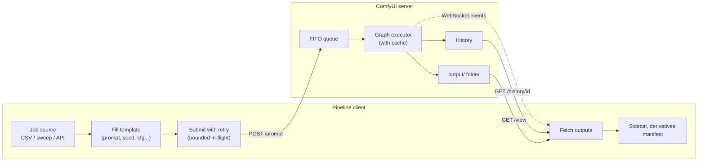
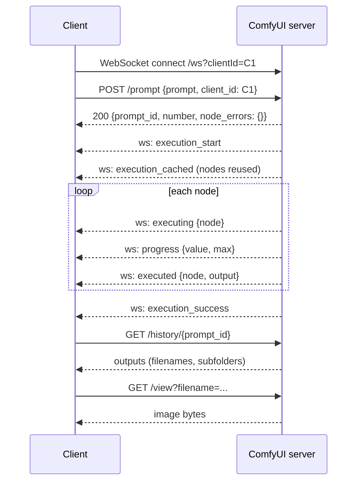
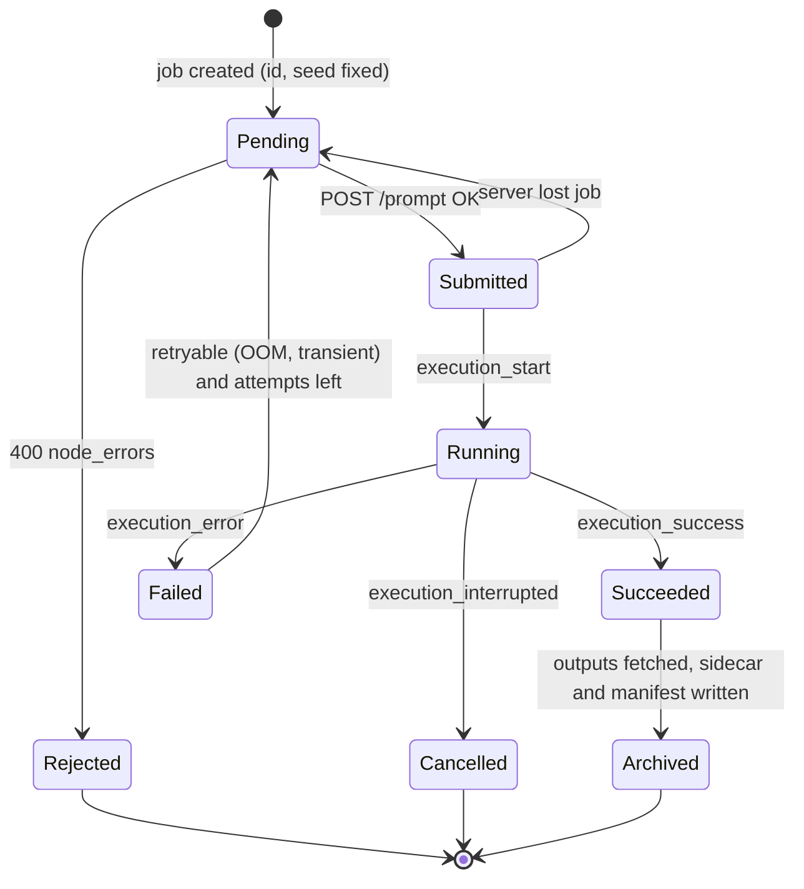
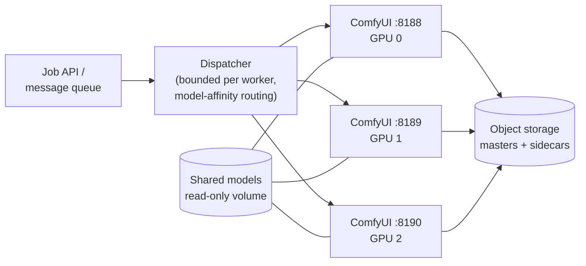

[AI/ML Documentation](./) &raquo; Production Pipelines &amp; Automation

A workflow that produces one good image by hand is a prototype. A **production pipeline** turns it into a service: it accepts parameters, runs unattended, sweeps variations, survives failures, and files every output with enough metadata to reproduce it. This page covers that automation layer for ComfyUI: the API-format workflow, the HTTP and WebSocket interface, batch and sweep patterns, queue control, error handling, asset management, and scaling to several GPUs. It assumes you can build workflows in the [ComfyUI Guide](comfyui-guide.html) and know the sampling parameters from [Stable Diffusion Fundamentals](stable-diffusion-fundamentals.html).

## Architecture Overview

Every pipeline on this page has the same shape: a client holds a workflow template, fills in parameters per job, submits the job to a ComfyUI server, follows its progress, and post-processes the results.



ComfyUI is the most common execution engine for this because the same graph you design interactively is the thing you deploy. A pipeline built directly on the Hugging Face **diffusers** library is the main alternative. It is easier to embed in an existing Python service and to unit-test, but you rebuild each workflow in code instead of exporting it.

## The API-Format Workflow

The ComfyUI UI saves workflows in a **UI format** that records node positions, links, groups, and widget layout. The `/prompt` endpoint accepts a different **API format**: a flat JSON object keyed by node id, where each node lists its `class_type` and `inputs`.

To export it in the current frontend, choose **Export (API)** from the top-left workflow menu (labelled File in some frontend versions). Older builds hid this behind a "dev mode" setting; it is now a standard menu entry. The result looks like this:

```json
{
  "3": {
    "class_type": "KSampler",
    "inputs": {
      "seed": 12345, "steps": 30, "cfg": 7.0,
      "sampler_name": "dpmpp_2m", "scheduler": "karras", "denoise": 1.0,
      "model": ["4", 0], "positive": ["6", 0],
      "negative": ["7", 0], "latent_image": ["5", 0]
    },
    "_meta": { "title": "KSampler" }
  },
  "4": { "class_type": "CheckpointLoaderSimple",
         "inputs": { "ckpt_name": "sdxl_base.safetensors" },
         "_meta": { "title": "Load Checkpoint" } },
  "5": { "class_type": "EmptyLatentImage",
         "inputs": { "width": 1024, "height": 1024, "batch_size": 1 } },
  "6": { "class_type": "CLIPTextEncode",
         "inputs": { "text": "a serene mountain lake at dawn", "clip": ["4", 1] },
         "_meta": { "title": "Positive" } },
  "7": { "class_type": "CLIPTextEncode",
         "inputs": { "text": "blurry, low quality", "clip": ["4", 1] },
         "_meta": { "title": "Negative" } },
  "8": { "class_type": "VAEDecode", "inputs": { "samples": ["3", 0], "vae": ["4", 2] } },
  "9": { "class_type": "SaveImage",
         "inputs": { "filename_prefix": "prod", "images": ["8", 0] } }
}
```

Three properties make the format scriptable:

- **Inputs are either literals or links.** A literal (`"steps": 30`) is what you parameterize. A link (`"model": ["4", 0]`) is a `[node_id, output_index]` pair; leave links alone unless you are rewiring the graph.
- **Node ids are stable strings** within an exported file, so you can address the positive prompt as node `"6"`.
- **`_meta.title` carries the node's display title.** Renaming nodes in the UI ("Positive", "Main Sampler") and looking them up by title makes scripts survive re-exports that renumber nodes.

```python
def node_by_title(workflow: dict, title: str) -> dict:
    """Return the node whose _meta.title matches; raise if missing or ambiguous."""
    hits = [n for n in workflow.values() if n.get("_meta", {}).get("title") == title]
    if len(hits) != 1:
        raise KeyError(f"expected one node titled {title!r}, found {len(hits)}")
    return hits[0]
```

The rest of this page uses literal ids for brevity. In real pipelines, prefer title lookup.

## The ComfyUI Server API

ComfyUI serves HTTP and WebSocket on the same port as the UI (default `8188`). Every route is also available under an `/api` prefix (for example `/api/prompt`), which is convenient when a reverse proxy routes by path.

| Endpoint | Method | Purpose |
|----------|--------|---------|
| `/prompt` | POST | Enqueue a workflow; returns `prompt_id`, queue `number`, and `node_errors` |
| `/prompt` | GET | Queue size and exec info |
| `/queue` | GET | Running and pending items |
| `/queue` | POST | `{"clear": true}` or `{"delete": [prompt_id, ...]}` for pending items |
| `/interrupt` | POST | Stop execution; optional `{"prompt_id": ...}` interrupts only if that prompt is running |
| `/history` | GET | Completed runs keyed by `prompt_id` (supports `max_items`) |
| `/history/{prompt_id}` | GET | Outputs and status for one run |
| `/history` | POST | `{"clear": true}` or `{"delete": [...]}` to prune history |
| `/view` | GET | Download an output (`filename`, `subfolder`, `type`) |
| `/upload/image`, `/upload/mask` | POST | Upload inputs for img2img, inpainting, ControlNet |
| `/object_info`, `/object_info/{class}` | GET | Node schemas: inputs, types, defaults, enum values |
| `/models`, `/models/{folder}` | GET | Installed model files per folder |
| `/system_stats` | GET | Python/ComfyUI versions, devices, VRAM |
| `/free` | POST | `{"unload_models": true, "free_memory": true}` to release VRAM |
| `/ws?clientId=...` | WebSocket | Execution and progress events |

Recent releases also add a **jobs API** (`GET /api/jobs` with status filtering and pagination, `GET /api/jobs/{id}`, `POST /api/jobs/{id}/cancel`) that unifies the queue and history into one job view. Check `/system_stats` for the server version before depending on it.

### Request Lifecycle



### Submitting a Prompt

The POST body carries the workflow and a `client_id`, which tags WebSocket events for this client. It also accepts several optional fields:

| Field | Effect |
|-------|--------|
| `client_id` | Routes execution events to your WebSocket |
| `prompt_id` | Client-chosen id (canonical lowercase UUID); lets you record the id *before* submitting, which makes retries idempotent |
| `front` | `true` places the job at the front of the queue |
| `number` | Explicit queue priority (lower runs first) |
| `extra_data` | Passed through to execution (for example, workflow metadata to embed in outputs) |
| `partial_execution_targets` | Run only the listed output nodes |

```python
import json
import uuid
import urllib.error
import urllib.request

SERVER = "http://127.0.0.1:8188"
CLIENT_ID = str(uuid.uuid4())

class GraphError(Exception):
    """The server rejected the workflow (HTTP 400 with node_errors)."""

def queue_prompt(workflow: dict, prompt_id: str | None = None,
                 front: bool = False) -> str:
    payload = {"prompt": workflow, "client_id": CLIENT_ID, "front": front}
    if prompt_id:
        payload["prompt_id"] = prompt_id
    req = urllib.request.Request(
        f"{SERVER}/prompt", data=json.dumps(payload).encode(),
        headers={"Content-Type": "application/json"})
    try:
        with urllib.request.urlopen(req) as resp:
            return json.load(resp)["prompt_id"]
    except urllib.error.HTTPError as e:
        if e.code == 400:
            raise GraphError(e.read().decode()) from e
        raise
```

A **400** response means validation failed: a missing link, an out-of-range value, an unknown node class, or a model file that does not exist. The body contains an `error` object and a `node_errors` map naming the offending node and input. Surface it verbatim, and do not retry, since the same graph will fail the same way.

### Tracking Progress

Polling `/history` works but adds latency and load. The WebSocket streams events for your `client_id`:

| Event `type` | Meaning |
|--------------|---------|
| `status` | Queue length changed (`exec_info.queue_remaining`) |
| `execution_start` | Your prompt began executing |
| `execution_cached` | Nodes whose outputs were reused from cache |
| `executing` | A node started; `node: null` is the legacy "prompt finished" signal |
| `progress` | Step `value`/`max` for the active node (samplers) |
| `executed` | A node produced UI output (image filenames appear here) |
| `execution_success` | All nodes finished successfully |
| `execution_error` | A node raised; includes node id, exception type and message, traceback |
| `execution_interrupted` | Stopped by `/interrupt` or a cancel |
| binary frame | Live preview image (when previews are enabled) |

Wait for one of the three terminal events rather than `executing` with `node: null`:

```python
import websocket  # pip install websocket-client

TERMINAL = {"execution_success", "execution_error", "execution_interrupted"}

def wait_for(prompt_id: str, ws: websocket.WebSocket) -> dict:
    """Block until prompt_id finishes; return the terminal event."""
    while True:
        msg = ws.recv()
        if not isinstance(msg, str):
            continue  # binary preview frame
        event = json.loads(msg)
        data = event.get("data", {})
        if data.get("prompt_id") != prompt_id:
            continue
        if event["type"] == "progress":
            print(f"  node {data['node']}: {data['value']}/{data['max']}")
        elif event["type"] in TERMINAL:
            return event

ws = websocket.WebSocket()
ws.connect(f"ws://127.0.0.1:8188/ws?clientId={CLIENT_ID}")
```

Open the WebSocket **before** submitting, or a fast (fully cached) prompt can finish before you are listening. For robustness, treat the WebSocket as a latency optimization and fall back to polling `/history/{prompt_id}` if the connection drops.

### Retrieving Outputs

`/history/{prompt_id}` lists each output node's files; download them from `/view`:

```python
from urllib.parse import urlencode

def fetch_outputs(prompt_id: str) -> list[tuple[dict, bytes]]:
    with urllib.request.urlopen(f"{SERVER}/history/{prompt_id}") as r:
        entry = json.load(r)[prompt_id]
    results = []
    for node_out in entry["outputs"].values():
        for f in node_out.get("images", []):  # video/audio nodes use other keys
            qs = urlencode({"filename": f["filename"],
                            "subfolder": f["subfolder"], "type": f["type"]})
            with urllib.request.urlopen(f"{SERVER}/view?{qs}") as r:
                results.append((f, r.read()))
    return results
```

Use `urlencode` rather than string concatenation: filenames and subfolders can contain spaces and other characters that must be escaped. The history entry's `status` field also records whether the run completed and the messages it produced, which is useful when reconciling after a client crash.

### Validating Against Node Schemas

`/object_info` returns every installed node's inputs, types, defaults, and valid enum values, including the actual list of installed checkpoints, samplers, and schedulers. Read it once at startup and validate jobs locally, so a typo fails immediately rather than after queueing:

```python
with urllib.request.urlopen(f"{SERVER}/object_info") as r:
    info = json.load(r)
ks = info["KSampler"]["input"]["required"]
VALID = {
    "sampler_name": set(ks["sampler_name"][0]),
    "scheduler": set(ks["scheduler"][0]),
    "ckpt_name": set(info["CheckpointLoaderSimple"]["input"]["required"]["ckpt_name"][0]),
}

def validate(job: dict) -> list[str]:
    return [f"{k}={job[k]!r} not installed/valid"
            for k, allowed in VALID.items() if k in job and job[k] not in allowed]
```

## Batch Generation

ComfyUI caches node outputs by their inputs. When only the seed changes between jobs, the loaded model and the encoded prompts are reused, so everything after the first job costs only sampling and decoding.

There are two levels of batching, and they compose:

| Level | Mechanism | Pros | Cons |
|-------|-----------|------|------|
| In-graph | `EmptyLatentImage.batch_size = N` | Best GPU utilization per image | One prompt for all N; whole batch must fit in VRAM |
| Job-level | N separate `/prompt` submissions | Every job can differ; flat VRAM use | More per-job overhead |

A small helper deep-copies the template per job and sets only the fields that vary:

```python
import copy
import random

def build_job(template: dict, job: dict) -> dict:
    wf = copy.deepcopy(template)  # never mutate the shared template
    wf["6"]["inputs"]["text"] = job["prompt"]
    wf["3"]["inputs"]["seed"] = job.get("seed") or random.randint(0, 2**63 - 1)
    wf["3"]["inputs"]["cfg"] = job.get("cfg", 7.0)
    wf["9"]["inputs"]["filename_prefix"] = f"{job.get('project', 'batch')}/{job['name']}"
    return wf
```

Always **record the seed you actually sent**. A random seed chosen client-side is reproducible only if it is logged; `-1` or "randomize" widgets in the UI do not apply to the API, where the literal value in the JSON is used.

Job lists should come from data, not code, so that non-programmers can edit them:

```python
import csv

def jobs_from_csv(path: str) -> list[dict]:
    with open(path, newline="") as f:
        return [
            {"name": row["name"],
             "prompt": row["prompt"],
             "seed": int(row["seed"]) if row.get("seed") else None,
             "cfg": float(row["cfg"]) if row.get("cfg") else 7.0}
            for row in csv.DictReader(f)
        ]
```

## Parameter Sweeps and Grids

A **sweep** generates every combination of chosen parameter values so the differences can be compared side by side. It is the headless, arbitrary-axis version of Automatic1111's XY plot. With M CFG values, N samplers, and K seeds, a sweep produces $M \cdot N \cdot K$ images, so choose axes deliberately.

```python
from itertools import product

FIELD_MAP = {  # sweep axis -> (node id, input name)
    "cfg": ("3", "cfg"), "steps": ("3", "steps"),
    "sampler_name": ("3", "sampler_name"), "scheduler": ("3", "scheduler"),
    "seed": ("3", "seed"), "prompt": ("6", "text"),
}

def sweep(template: dict, axes: dict) -> list[tuple[dict, dict]]:
    names = list(axes)
    cells = []
    for values in product(*(axes[n] for n in names)):
        combo = dict(zip(names, values))
        wf = copy.deepcopy(template)
        for k, v in combo.items():
            node, field = FIELD_MAP[k]
            wf[node]["inputs"][field] = v
        tag = "_".join(f"{k}-{v}" for k, v in combo.items() if k != "prompt")
        wf["9"]["inputs"]["filename_prefix"] = f"sweep/{tag}"
        cells.append((combo, wf))
    return cells

cells = sweep(template, {
    "cfg": [4, 6, 8, 10],
    "sampler_name": ["euler", "dpmpp_2m", "dpmpp_3m_sde"],
    "seed": [42],  # fixed: CFG and sampler are the only variables
})
```

### Designing a Sweep

Change one thing at a time. Fixing the seed across a CFG sweep means every visible difference comes from CFG, not from a different starting noise. Then repeat the winning settings across several seeds to confirm the result is not one lucky roll.

| Axis | Useful range | What it reveals |
|------|--------------|-----------------|
| CFG | 3-11 for SD 1.5/SDXL; 3-5 for SD3.5 | Prompt adherence vs. oversaturation |
| FLUX guidance | 2-5 via `FluxGuidance`, with KSampler cfg fixed at 1 | Same trade-off for guidance-distilled models |
| Steps | 10, 20, 30, 50 | Point of diminishing returns |
| Sampler | euler, dpmpp_2m, dpmpp_3m_sde, uni_pc | Texture and convergence behavior |
| Scheduler | normal, karras, exponential, sgm_uniform, beta | Effect of noise schedule on detail |
| Seed | 4-8 fixed seeds | Variance: separates the settings from luck |
| LoRA strength | 0.4-1.0 in 0.2 steps | Style strength vs. artifacts |
| Denoise (img2img) | 0.3-0.8 | Fidelity to source vs. freedom |

A coarse pass (wide range, few points) followed by a fine pass around the best cell finds the optimum with far fewer renders than a dense grid. Four CFG values × three samplers × five seeds is already 60 images.

### Contact Sheets

A sweep is useful only when all its cells are visible at once. Tile outputs into a labeled grid:

```python
from PIL import Image, ImageDraw

def contact_sheet(images: list[Image.Image], cols: int,
                  labels: list[str], pad: int = 28) -> Image.Image:
    w, h = images[0].size
    rows = -(-len(images) // cols)  # ceiling division
    sheet = Image.new("RGB", (w * cols, (h + pad) * rows), "white")
    draw = ImageDraw.Draw(sheet)
    for i, (img, label) in enumerate(zip(images, labels)):
        x, y = (i % cols) * w, (i // cols) * (h + pad)
        draw.text((x + 4, y + 6), label, fill="black")
        sheet.paste(img, (x, y + pad))
    return sheet
```

## Queue Management

ComfyUI runs **one execution queue per server process**: prompts execute one at a time on one GPU, ordered by queue number. A pipeline submitting hundreds of jobs should control that queue deliberately.

| Strategy | How it works | Use when |
|----------|--------------|----------|
| Fire-and-track | Submit everything, collect by `prompt_id` | Small and medium batches |
| Bounded in-flight | Keep at most K jobs queued; submit more as jobs finish | Large sweeps; clean cancellation; sharing the server |
| Drip | Submit one, wait, repeat | Strict ordering or a GPU shared with interactive users |

The bounded strategy is the right default. A small K (2-4) keeps the GPU busy while leaving the queue short enough that other users, urgent jobs, and cancellations are not stuck behind hundreds of items:

```python
from collections import deque

def run_bounded(workflows: list[dict], ws, max_in_flight: int = 3) -> dict:
    pending = deque(workflows)
    in_flight: set[str] = set()
    results: dict[str, str] = {}
    while pending or in_flight:
        while pending and len(in_flight) < max_in_flight:
            in_flight.add(queue_prompt(pending.popleft()))
        event = json.loads(recv_text(ws))  # next text frame
        pid = event.get("data", {}).get("prompt_id")
        if pid in in_flight and event["type"] in TERMINAL:
            in_flight.discard(pid)
            results[pid] = event["type"]
    return results

def recv_text(ws):
    while True:
        msg = ws.recv()
        if isinstance(msg, str):
            return msg
```

### Controlling the Queue

- **Cancel the running job:** `POST /interrupt` with `{"prompt_id": id}`. Execution stops at the next interruptible point and emits `execution_interrupted`. Without a `prompt_id` it interrupts whatever is running.
- **Remove pending jobs:** `POST /queue` with `{"delete": [id, ...]}`, or `{"clear": true}` to empty the pending queue.
- **Priority:** submit with `"front": true` to jump the queue, or pass an explicit `number`.
- **Free VRAM** between phases that use different models: `POST /free` with `{"unload_models": true, "free_memory": true}`.

### Model Loading and VRAM

In mixed batches, **model loading** often costs more than denoising. ComfyUI keeps loaded models resident until memory pressure forces an unload, so **sort jobs by checkpoint (and LoRA set)** so that each model loads once. Launch flags such as `--highvram`, `--normalvram`, and `--lowvram` control how aggressively models are offloaded to system RAM, and `--reserve-vram` holds back headroom for other processes.

## Error Handling and Reliability

An unattended run will hit failures. Classify them, because the right response differs:

| Failure | Symptom | Response |
|---------|---------|----------|
| Invalid graph | HTTP 400 with `node_errors` | Do not retry; fix the job; validate against `/object_info` first |
| Node exception | `execution_error` event | Log the traceback, mark failed, continue the batch |
| Out of memory | `execution_error` with an OOM exception type | Retry once at a smaller batch or resolution, or after `/free` |
| Server unreachable | Connection refused, WebSocket drop | Retry with exponential backoff and jitter |
| Server restarted mid-job | Job missing from queue and history | Resubmit (safe if the job is idempotent) |



The two reliability primitives are **idempotent jobs** and **bounded retries**:

- A job is idempotent when its parameters, including the seed, are fixed before submission, and its output path is deterministic. Submitting with a client-generated `prompt_id` also lets you check `/history/{prompt_id}` after a crash to see whether the job already ran.
- Retries use exponential backoff with jitter and a cap, so one poison job cannot stall the batch.

```python
import random
import time

def submit_with_retry(workflow: dict, prompt_id: str, attempts: int = 4) -> str | None:
    for i in range(attempts):
        try:
            return queue_prompt(workflow, prompt_id=prompt_id)
        except GraphError:
            raise                      # permanent: do not retry
        except (urllib.error.URLError, ConnectionError, TimeoutError):
            if i == attempts - 1:
                return None
            time.sleep(min(30, 2 ** i) + random.random())  # backoff + jitter
```

Checkpoint progress to disk: append a manifest row as each job completes, and on restart skip any job whose output already exists. A crashed overnight run then resumes instead of starting over.

## Asset Management

The last step turns a folder of PNGs into a usable library: consistent naming, embedded provenance, derived delivery formats, and a queryable index. For file formats and metadata standards in more depth, see [Output Formats](output-formats.html).

### Naming and Folders

`SaveImage.filename_prefix` accepts subfolders, so structure can be encoded directly. The `%date:yyyy-MM-dd%` style tokens you may use in the UI are expanded by the browser frontend, not the server, so an API client should build the date and other path parts itself:

```text
output/
  catalog-q3/
    2026-09-22/
      portrait_cfg-7_euler_seed-42_00001_.png
      portrait_cfg-7_euler_seed-42_00001_.json
```

A scheme like `{project}/{date}/{variant}_{key-params}_{counter}` makes outputs sortable, greppable, and self-describing without opening a database.

### Provenance

By default ComfyUI embeds both the API prompt and the UI workflow as PNG text chunks. Dragging such a PNG back into ComfyUI restores the graph. That metadata is lost on re-encoding to JPEG or WebP and is stripped by most social platforms, so also write a **JSON sidecar**:

```python
import hashlib
import json
from pathlib import Path

def write_sidecar(image_path: Path, job: dict, prompt_id: str, server_version: str):
    meta = {
        "prompt_id": prompt_id,
        "parameters": job,        # prompt, negative, seed, cfg, sampler, scheduler, size
        "workflow_sha256": hashlib.sha256(
            json.dumps(job.get("workflow", {}), sort_keys=True).encode()).hexdigest(),
        "tool": f"ComfyUI {server_version}",
        "sha256": hashlib.sha256(image_path.read_bytes()).hexdigest(),
    }
    image_path.with_suffix(".json").write_text(json.dumps(meta, indent=2))
```

Record at minimum the prompt and negative prompt; the model, LoRAs, and VAE with their hashes; sampler, scheduler, steps, CFG or guidance, seed, and resolution; and the tool version, plus the workflow itself. If outputs are published, also consider signed **C2PA Content Credentials**. The EU AI Act's transparency obligations for providers of generative systems (machine-readable marking of AI-generated content) apply from August 2026; see [Output Formats](output-formats.html#provenance-and-ai-disclosure).

### Derivatives and Indexing

Keep one **lossless master** and derive every delivery format from it rather than regenerating:

```python
from PIL import Image

def derive(master: Path, manifest: Path, meta: dict):
    img = Image.open(master)
    img.save(master.with_suffix(".webp"), quality=90, method=6)
    img.convert("RGB").save(master.with_suffix(".jpg"), quality=85, progressive=True)
    thumb = img.copy()
    thumb.thumbnail((256, 256))
    thumb.save(master.with_name(master.stem + "_thumb.webp"), quality=80)
    with manifest.open("a") as f:
        f.write(json.dumps({"master": str(master), **meta}) + "\n")
```

A JSONL manifest (one record per line) is enough to power search, deduplication by hash, and a gallery, and loads easily into a database later.

## Scaling and Deployment

One ComfyUI process drives one GPU. To scale out, run **one server per GPU** (each pinned with `CUDA_VISIBLE_DEVICES` or `--cuda-device`) behind a dispatcher that assigns jobs and tracks each server's WebSocket. Because jobs are idempotent and servers keep no state between prompts beyond caches, this needs no coordination beyond the dispatcher.



| Concern | Single server | Horizontal scale |
|---------|---------------|------------------|
| Throughput | One prompt at a time | N prompts on N GPUs |
| Dispatch | Built-in queue | External dispatcher; route jobs to the worker that already has the model loaded |
| Failure isolation | A crash stops the batch | Reschedule to another worker |
| Models | Local disk | Shared read-only volume, or pre-baked into the image |
| Custom nodes | Installed by hand | Pinned versions in the container image (for example with `comfy-cli`) |

Operational notes:

- **Security.** ComfyUI has no authentication and custom nodes execute arbitrary Python. Bind workers to localhost or a private network (the default `--listen 127.0.0.1`), expose only your dispatcher, and install custom nodes only from sources you trust, pinned to reviewed versions.
- **Reproducibility across workers.** Pin the ComfyUI version, custom-node commits, PyTorch/CUDA versions, and model hashes. Identical seeds can still produce slightly different pixels across GPU models or driver versions because of non-deterministic kernels, so reproduce critical assets on the same hardware class.
- **Managed options.** If you would rather not run GPUs yourself, serverless GPU platforms and hosted ComfyUI services accept the same API-format workflow; the retry, sidecar, and manifest logic above still applies.

For a containerized single-node setup, the [ComfyUI Guide](comfyui-guide.html) shows the `docker compose` entry point. For model serving and monitoring beyond image generation, see [MLOps in Production](mlops-production.html).

## See Also

- [ComfyUI Guide](comfyui-guide.html) - Build the workflows this pipeline automates
- [Output Formats](output-formats.html) - Export formats, metadata, and provenance
- [Stable Diffusion Fundamentals](stable-diffusion-fundamentals.html) - The parameters you sweep over
- [Optimization Guide](optimization-guide.html) - Speed and VRAM tuning per job
- [Advanced Techniques](advanced-techniques.html) - Multi-stage and few-step methods worth automating
- [Base Models Comparison](base-models-comparison.html) - Per-model settings that change sweep ranges
- [MLOps in Production](mlops-production.html) - Serving, monitoring, and deployment practices
- [AI/ML Documentation Hub](./) - Complete AI/ML documentation index
