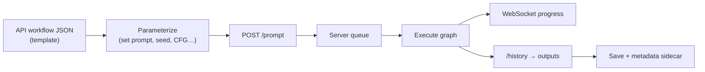
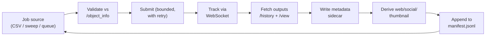

<div class="hero-section" style="background: linear-gradient(135deg, #667eea 0%, #764ba2 100%); color: white; padding: 3rem 2rem; margin: -2rem -3rem 2rem -3rem; text-align: center;">
  <h1 style="color: white; margin: 0; font-size: 2.5rem;">Production Pipelines &amp; Automation</h1>
  <p style="font-size: 1.25rem; margin-top: 1rem; opacity: 0.9;">Move from clicking "Queue Prompt" to running reproducible, headless generation at scale — batch jobs, parameter sweeps, the ComfyUI API, queue management, and asset pipelines.</p>
</div>

[AI/ML Documentation](./) &raquo; Production Pipelines &amp; Automation

<div class="code-example" markdown="1">
A workflow that produces one good image by hand is a prototype. A production pipeline turns that workflow into a service: it accepts parameters, runs unattended, sweeps variations, recovers from failures, and files every output with the metadata needed to reproduce it. This guide covers the automation layer that sits on top of the generation techniques you already know.
</div>

<div class="key-insights">
  <div class="insight-card">
    <i class="fas fa-robot"></i>
    <h4>Headless First</h4>
    <p>Export a workflow as API JSON, parameterize the nodes you care about, and submit it over HTTP — no browser, no clicking, fully scriptable.</p>
  </div>
  <div class="insight-card">
    <i class="fas fa-th"></i>
    <h4>Sweep, Don't Guess</h4>
    <p>Cartesian grids over prompts, seeds, CFG, and samplers turn tuning into a systematic search you can compare side by side.</p>
  </div>
  <div class="insight-card">
    <i class="fas fa-stream"></i>
    <h4>Queue &amp; Recover</h4>
    <p>A durable queue, WebSocket progress, retries, and structured outputs let a pipeline run for hours and survive failures.</p>
  </div>
</div>

## Who This Is For and What It Covers

This is a reference for taking generation from interactive use to **unattended production**. It assumes you can already build workflows in the [ComfyUI Guide](comfyui-guide.html) and understand the parameters from [Stable Diffusion Fundamentals](stable-diffusion-fundamentals.html). Here we focus on the automation around generation: running batches, sweeping parameters into grids, driving ComfyUI headlessly through its API, managing the job queue, and organizing the resulting assets so they stay reproducible.

The [ComfyUI Guide](comfyui-guide.html) introduces the API in a few lines; this page is the full treatment — the endpoints, the WebSocket protocol, queue control, error handling, and the pipeline patterns that wrap them.

## From Interactive to Headless

Interactive generation hides a request/response loop behind the UI. When you click **Queue Prompt**, the browser POSTs your graph to the ComfyUI server, polls for progress over a WebSocket, and downloads the result. Automation reproduces that loop in code.

The single most important step is exporting the workflow in **API format**. The normal "Save" format describes the visual graph (node positions, links, widget layout); the API format is a flat JSON object keyed by node id, with each node's `class_type` and `inputs`. That is the format the `/prompt` endpoint accepts.

To export it, enable **Dev mode** in ComfyUI settings, then use **Save (API Format)**. You get something like:

```json
{
  "3": {
    "class_type": "KSampler",
    "inputs": {
      "seed": 12345,
      "steps": 30,
      "cfg": 7.0,
      "sampler_name": "dpmpp_2m",
      "scheduler": "karras",
      "denoise": 1.0,
      "model": ["4", 0],
      "positive": ["6", 0],
      "negative": ["7", 0],
      "latent_image": ["5", 0]
    }
  },
  "4": { "class_type": "CheckpointLoaderSimple", "inputs": { "ckpt_name": "sdxl_base.safetensors" } },
  "5": { "class_type": "EmptyLatentImage", "inputs": { "width": 1024, "height": 1024, "batch_size": 1 } },
  "6": { "class_type": "CLIPTextEncode", "inputs": { "text": "a serene mountain lake at dawn", "clip": ["4", 1] } },
  "7": { "class_type": "CLIPTextEncode", "inputs": { "text": "blurry, low quality", "clip": ["4", 1] } },
  "8": { "class_type": "VAEDecode", "inputs": { "samples": ["3", 0], "vae": ["4", 2] } },
  "9": { "class_type": "SaveImage", "inputs": { "filename_prefix": "prod", "images": ["8", 0] } }
}
```

Two structural facts make this format scriptable:

- **Inputs are either literal values or connections.** A literal (`"steps": 30`) is what you parameterize. A connection (`"model": ["4", 0]`) is a `[node_id, output_index]` pair — leave those alone unless you are rewiring the graph.
- **Node ids are stable strings.** Once you know that node `"6"` is your positive prompt and `"3"` is the sampler, you can mutate exactly those fields and resubmit.

The headless loop, then, is: load the API JSON, overwrite the inputs you want to vary, POST it, and collect the output. Everything else in this guide builds on that loop.



## The ComfyUI API

ComfyUI serves an HTTP + WebSocket API on the same port as the UI (default `8188`). These are the endpoints a pipeline actually uses.

| Endpoint | Method | Purpose |
|----------|--------|---------|
| `/prompt` | POST | Enqueue a workflow; returns a `prompt_id` |
| `/prompt` | GET | Current queue state and exec info |
| `/history` | GET | Completed runs, keyed by `prompt_id` |
| `/history/{prompt_id}` | GET | Outputs for one run |
| `/queue` | GET | Pending and running items |
| `/queue` | POST | Clear or delete queued items |
| `/interrupt` | POST | Stop the currently executing prompt |
| `/view` | GET | Download an output file (`filename`, `subfolder`, `type`) |
| `/upload/image` | POST | Upload an input image (for img2img / ControlNet) |
| `/object_info` | GET | Schema of every node type (inputs, defaults, enums) |
| `/system_stats` | GET | VRAM, device, and queue diagnostics |
| `/ws` | WebSocket | Live execution + progress events |

### Submitting a Prompt

A POST to `/prompt` carries the workflow plus a `client_id` (so the server tags your WebSocket events) and returns a `prompt_id` you use to correlate progress and results:

```python
import json
import uuid
import urllib.request

SERVER = "http://localhost:8188"
CLIENT_ID = str(uuid.uuid4())

def queue_prompt(workflow: dict) -> str:
    payload = {"prompt": workflow, "client_id": CLIENT_ID}
    data = json.dumps(payload).encode("utf-8")
    req = urllib.request.Request(f"{SERVER}/prompt", data=data,
                                 headers={"Content-Type": "application/json"})
    resp = json.loads(urllib.request.urlopen(req).read())
    return resp["prompt_id"]
```

If the graph is invalid (a missing connection, an out-of-range value, an unknown node), the server responds **400** with a `node_errors` object naming the offending node and field. Surface that message verbatim — it is far more actionable than a generic failure.

### Tracking Progress over WebSocket

Polling `/history` works but is laggy. The WebSocket gives live events: which node is executing, sampler step progress, and a terminal "executing → null" signal when the prompt for your `client_id` finishes.

```python
import json
import websocket  # websocket-client

def wait_for_completion(prompt_id: str):
    ws = websocket.WebSocket()
    ws.connect(f"ws://localhost:8188/ws?clientId={CLIENT_ID}")
    while True:
        msg = ws.recv()
        if not isinstance(msg, str):
            continue  # binary frames are preview images; skip
        event = json.loads(msg)
        etype, data = event["type"], event.get("data", {})
        if etype == "progress":
            print(f"  step {data['value']}/{data['max']}")
        elif etype == "executing" and data.get("node") is None \
                and data.get("prompt_id") == prompt_id:
            ws.close()
            return  # this prompt is done
```

The key event types:

| Event `type` | Meaning |
|--------------|---------|
| `status` | Queue size changed (`exec_info.queue_remaining`) |
| `execution_start` | The server picked up your prompt |
| `executing` | A node started; `node: null` with your `prompt_id` means done |
| `progress` | Sampler step `value`/`max` for the active node |
| `executed` | A node produced outputs (images appear here) |
| `execution_error` | A node raised; carries the traceback |
| binary frame | A live preview image (when preview is enabled) |

### Retrieving Outputs

After completion, `/history/{prompt_id}` returns each output node's results. `SaveImage` nodes list filenames, subfolders, and a `type` (`output`/`temp`); fetch the bytes from `/view`:

```python
def fetch_images(prompt_id: str) -> list[bytes]:
    hist = json.loads(urllib.request.urlopen(
        f"{SERVER}/history/{prompt_id}").read())[prompt_id]
    images = []
    for node_out in hist["outputs"].values():
        for img in node_out.get("images", []):
            url = (f"{SERVER}/view?filename={img['filename']}"
                   f"&subfolder={img['subfolder']}&type={img['type']}")
            images.append(urllib.request.urlopen(url).read())
    return images
```

### Discovering Node Schemas

`/object_info` returns the full schema of every installed node — required and optional inputs, their types, defaults, and the valid enum values (e.g. the exact list of installed checkpoints, samplers, and schedulers). A robust pipeline reads this once at startup to **validate parameters before submitting**, so a typo in a sampler name fails locally instead of after the job hits the queue:

```python
info = json.loads(urllib.request.urlopen(f"{SERVER}/object_info").read())
samplers = info["KSampler"]["input"]["required"]["sampler_name"][0]  # list of valid names
checkpoints = info["CheckpointLoaderSimple"]["input"]["required"]["ckpt_name"][0]
```

## Batch Generation Workflows

The simplest production task is generating many images from one template — varying only the seed, or running a list of prompts. Because ComfyUI caches by input, changing only the seed reuses the loaded model and text encoding, so a batch of seeds is cheap after the first.

There are two batching levels, and they compose:

- **In-graph batch** — set `EmptyLatentImage.batch_size` to N to denoise N latents in one pass. Fastest per image, but every image shares one prompt and the whole batch must fit in VRAM.
- **Job-level batch** — submit N separate prompts, each with its own parameters. Slower (more passes) but each can differ completely, and the queue serializes them so VRAM use stays flat.

A clean pattern wraps the template in a small helper that deep-copies it per job, sets the fields, and submits:

```python
import copy
import random

def run_batch(template: dict, jobs: list[dict]) -> list[str]:
    """Each job dict names the fields to override. Returns prompt_ids."""
    prompt_ids = []
    for job in jobs:
        wf = copy.deepcopy(template)
        wf["6"]["inputs"]["text"] = job["prompt"]
        wf["3"]["inputs"]["seed"] = job.get("seed", random.randint(0, 2**32 - 1))
        wf["3"]["inputs"]["cfg"]  = job.get("cfg", 7.0)
        wf["9"]["inputs"]["filename_prefix"] = job.get("name", "batch")
        prompt_ids.append(queue_prompt(wf))
    return prompt_ids

jobs = [
    {"prompt": "a red fox in snow",   "name": "fox",   "seed": 1},
    {"prompt": "a blue jay on a branch", "name": "jay", "seed": 2},
    {"prompt": "a green frog on a leaf",  "name": "frog", "seed": 3},
]
ids = run_batch(workflow_template, jobs)
```

`deepcopy` matters: mutating a shared template would leak the previous job's values into the next. For seeds, an explicit seed makes a job reproducible; `-1`/random is for exploration, but record the seed the server actually used (from `/history`) so you can reproduce a favorite later.

### Reading Jobs from a File

For real batches the job list comes from data, not code — a CSV of prompts, a JSONL of parameter dicts, or a spreadsheet export. Keep the template and the job list separate so non-programmers can edit the latter:

```python
import csv

def jobs_from_csv(path: str) -> list[dict]:
    with open(path, newline="") as f:
        return [
            {"prompt": row["prompt"],
             "seed": int(row["seed"]) if row.get("seed") else None,
             "cfg": float(row.get("cfg", 7.0)),
             "name": row.get("name", "batch")}
            for row in csv.DictReader(f)
        ]
```

## Parameter Sweeps and Grids

Tuning by hand — change CFG, regenerate, squint — does not scale. A **sweep** systematically generates every combination of a set of parameter values so you can compare them side by side. This is the same idea as an XY plot in Automatic1111, generalized to any axes and run headlessly.

A sweep is a **Cartesian product** of the axes you choose. If you vary M values of CFG and N samplers and K seeds, you get M·N·K images. That product grows fast, so pick axes deliberately.

```python
from itertools import product

def sweep(template: dict, axes: dict) -> list[tuple[dict, dict]]:
    """axes: {field_name: [values]}. Returns (combo, workflow) per cell."""
    names = list(axes.keys())
    runs = []
    for values in product(*(axes[n] for n in names)):
        combo = dict(zip(names, values))
        wf = copy.deepcopy(template)
        if "cfg" in combo:          wf["3"]["inputs"]["cfg"] = combo["cfg"]
        if "steps" in combo:        wf["3"]["inputs"]["steps"] = combo["steps"]
        if "sampler_name" in combo: wf["3"]["inputs"]["sampler_name"] = combo["sampler_name"]
        if "seed" in combo:         wf["3"]["inputs"]["seed"] = combo["seed"]
        if "prompt" in combo:       wf["6"]["inputs"]["text"] = combo["prompt"]
        # Encode the combo in the filename so cells are identifiable on disk
        tag = "_".join(f"{k}-{v}" for k, v in combo.items())
        wf["9"]["inputs"]["filename_prefix"] = f"sweep/{tag}"
        runs.append((combo, wf))
    return runs

cells = sweep(workflow_template, {
    "cfg": [4, 6, 8, 10],
    "sampler_name": ["euler", "dpmpp_2m", "dpmpp_3m_sde"],
    "seed": [42],   # fix the seed so CFG/sampler differences are the only variable
})
```

### Designing a Useful Sweep

The discipline is **isolate one thing at a time**. Fixing the seed across a CFG sweep means every difference you see comes from CFG, not from a different random starting point. The table below is a practical starting set of axes and ranges.

| Axis | Useful range | What it reveals |
|------|--------------|-----------------|
| CFG / guidance | 3–11 (FLUX: fix cfg=1, sweep FluxGuidance 2–5) | Prompt adherence vs. over-saturation |
| Steps | 10, 20, 30, 50 | The point of diminishing returns |
| Sampler | euler, dpmpp_2m, dpmpp_3m_sde, ddim | Texture and convergence character |
| Scheduler | normal, karras, sgm_uniform | Noise-schedule effect on detail |
| Seed | 4–8 fixed seeds | Variance — separates "the prompt" from "a lucky roll" |
| LoRA strength | 0.4–1.0 in 0.2 steps | The strength that applies style without artifacts |
| Denoise (img2img) | 0.3–0.8 | Fidelity to source vs. creative freedom |

> **Combinatorics bite.** Four CFG values × three samplers × five seeds is already 60 images. Sweep two axes at a time, fix the rest, and only expand the axis that looked promising. A coarse pass (wide range, few points) followed by a fine pass (narrow range, more points) around the winner finds the sweet spot in a fraction of the renders.

### Assembling a Contact Sheet

A sweep is only useful if you can see all cells at once. After the runs complete, tile the outputs into a labeled grid (a "contact sheet" / XY plot) with row and column headers:

```python
from PIL import Image, ImageDraw

def contact_sheet(images: list[Image.Image], cols: int,
                  labels: list[str]) -> Image.Image:
    w, h = images[0].size
    rows = (len(images) + cols - 1) // cols
    sheet = Image.new("RGB", (w * cols, h * rows + 24), "white")
    draw = ImageDraw.Draw(sheet)
    for i, img in enumerate(images):
        x, y = (i % cols) * w, (i // cols) * h + 24
        sheet.paste(img, (x, y))
        draw.text((x + 4, y + 4), labels[i], fill="yellow")
    return sheet
```

This is the payoff of sweeping over guessing: differences that are invisible one-at-a-time become obvious when the whole grid is in front of you.

## Queue Management

ComfyUI runs a **single execution queue** — prompts run one at a time, in submission order, on one GPU. A pipeline that submits hundreds of jobs has to think about that queue deliberately rather than firing and forgetting.

### Submission Strategies

| Strategy | How it works | When to use |
|----------|--------------|-------------|
| Fire-and-track | Submit all jobs up front, collect by `prompt_id` later | Small/medium batches that comfortably fit the queue |
| Bounded pipeline | Keep at most K prompts in flight; submit the next when one finishes | Large sweeps; bounds memory and lets you cancel cleanly |
| Throttled drip | Submit one, await completion, repeat | When you need outputs in order or are sharing the GPU |

For large jobs the **bounded** strategy is the right default. Watch the queue depth from the `status` WebSocket event (`exec_info.queue_remaining`) or by polling `/queue`, and only submit when there is room:

```python
def queue_depth() -> int:
    q = json.loads(urllib.request.urlopen(f"{SERVER}/queue").read())
    return len(q["queue_running"]) + len(q["queue_pending"])

def run_bounded(workflows: list[dict], max_in_flight: int = 3):
    pending = list(workflows)
    while pending or queue_depth() > 0:
        while pending and queue_depth() < max_in_flight:
            queue_prompt(pending.pop(0))
        # ...await a completion event, then loop...
```

### Controlling the Queue

- **Cancel the running prompt:** `POST /interrupt`. Execution stops at the next node boundary; partial outputs may or may not be saved.
- **Clear pending:** `POST /queue` with `{"clear": true}` empties everything not yet started.
- **Delete one item:** `POST /queue` with `{"delete": [prompt_id]}` removes a specific queued prompt.
- **Priority:** the queue is FIFO; there is no priority field, so order your submissions accordingly or use a bounded loop to interleave urgent jobs.

### Model Loading and VRAM

The dominant cost in a batch is often **model loading**, not denoising. Group jobs that share a checkpoint so the model stays resident — ComfyUI's caching keeps a loaded model in VRAM until a different one is needed, at which point it swaps (and may offload to system RAM with `--normalvram`/`--lowvram`). Sorting a mixed batch by checkpoint can cut wall-clock time dramatically by avoiding repeated reloads.

If you have multiple GPUs, run **one ComfyUI server per GPU** (each pinned with `CUDA_VISIBLE_DEVICES`) and put a small dispatcher in front that round-robins prompts across them. There is no built-in multi-GPU queue, so horizontal scaling is "more servers behind a load balancer," covered below.

## Error Handling and Reliability

An unattended run will hit failures — an out-of-memory on a large latent, a missing model after a server restart, a transient network blip. Production pipelines treat these as expected, not exceptional.

| Failure | Symptom | Handling |
|---------|---------|----------|
| Invalid graph | `400` with `node_errors` on submit | Validate against `/object_info` first; log and skip the job |
| Node raised | `execution_error` WS event with traceback | Capture traceback, mark job failed, continue the batch |
| Out of memory | CUDA OOM in the error event | Lower `batch_size`/resolution; retry once at reduced size |
| Server unreachable | Connection refused / WS drop | Exponential-backoff retry on the HTTP/WS connection |
| Lost result | `/history` missing the `prompt_id` | Re-submit the (deterministic, seeded) job |

The two reliability primitives are **idempotent jobs** and **bounded retries**. A job is idempotent when it carries an explicit seed and a deterministic filename — resubmitting it reproduces the same output, so a retry is safe. Wrap submission in a retry with backoff, and cap attempts so one poison job cannot stall the batch:

```python
import time

def submit_with_retry(workflow: dict, attempts: int = 3) -> str | None:
    for i in range(attempts):
        try:
            return queue_prompt(workflow)
        except Exception as e:  # connection or 4xx/5xx
            if i == attempts - 1:
                log_failure(workflow, e)
                return None
            time.sleep(2 ** i)  # 1s, 2s, 4s backoff
```

Always **checkpoint progress** to disk: write a manifest row as each job completes so a crashed run resumes from where it stopped instead of regenerating everything. Make completion idempotent by skipping any job whose deterministic output file already exists.

## Asset Pipelines

The last mile is what separates a pile of PNGs from a usable asset library: consistent naming, embedded provenance, derivative formats, and an index you can query. Every output should answer "how was this made?" on its own — see [Output Formats](output-formats.html) for the format and metadata details this section builds on.

### Naming and Foldering

A flat `output/` directory becomes unusable within a day. Encode the structure in paths via `SaveImage.filename_prefix`, which accepts subfolders and date/counter tokens:

```text
output/
  2026-06-06/
    portraits/
      portrait_cfg-7_euler_seed-42_00001_.png
    landscapes/
      landscape_cfg-9_dpmpp_seed-7_00001_.png
```

A scheme like `{project}/{date}/{variant}_{key-params}_{counter}` makes outputs sortable, greppable, and self-describing without opening a database.

### Provenance and Sidecars

ComfyUI embeds the **full workflow graph** in saved PNGs by default — dragging such a PNG back into ComfyUI restores the exact graph. Preserve that (avoid lossy re-encoding the master), and also write a **JSON sidecar** as a durable, queryable backup that survives format conversion:

```python
import json, hashlib

def write_sidecar(image_path: str, combo: dict, prompt_id: str):
    meta = {
        "prompt_id": prompt_id,
        "parameters": combo,                 # prompt, seed, cfg, sampler…
        "model": combo.get("checkpoint"),
        "tool": "ComfyUI",
        "sha256": hashlib.sha256(open(image_path, "rb").read()).hexdigest(),
    }
    with open(image_path.rsplit(".", 1)[0] + ".json", "w") as f:
        json.dump(meta, f, indent=2)
```

Record at minimum: prompt and negative prompt; model name and hash plus any LoRAs/VAE; sampler, scheduler, steps, CFG/guidance, seed, and resolution; and the tool/version (plus the workflow file itself). With that, any output is reproducible months later.

### Derivative Formats and Indexing

Keep one **lossless master** (PNG-16/TIFF) and derive every delivery format from it on demand rather than regenerating — resize, re-encode to WebP/AVIF/JPEG, and build responsive `srcset` sets from the same source. A small post-step turns each master into its web, social, and thumbnail variants and appends a row to a manifest:

```python
def index_output(master: str, meta: dict, manifest: str = "manifest.jsonl"):
    derive_webp(master, quality=90)         # web delivery
    derive_jpeg(master, quality=85)         # social
    derive_thumbnail(master, size=256)      # gallery index
    with open(manifest, "a") as f:
        f.write(json.dumps({"master": master, **meta}) + "\n")
```

A JSONL manifest (one record per line) is enough to power search, dedup by hash, and a gallery — and it is trivial to load into a database later. The principle is **format-agnostic pipelines**: archive the master, generate targets on demand, and a new format slots in without reworking anything upstream.

### The End-to-End Pipeline

Putting the pieces together, a production run is a loop over a job source that submits with retries, tracks via WebSocket, fetches outputs, writes provenance, derives formats, and records a manifest:



## Scaling and Deployment

A single ComfyUI process is a single GPU. To raise throughput, run **N identical servers** (containers, one GPU each via `CUDA_VISIBLE_DEVICES`) behind a dispatcher that load-balances prompts and aggregates their WebSockets. Because each server is stateless between prompts and jobs are idempotent (seeded, deterministic filenames), this scales horizontally without coordination beyond the dispatcher.

| Concern | Single server | Horizontal scale |
|---------|---------------|------------------|
| Throughput | One prompt at a time | N prompts across N GPUs |
| Dispatch | Built-in FIFO queue | External dispatcher round-robins |
| Failure isolation | One crash stops the batch | Reschedule failed job to another server |
| Model storage | Local | Shared volume so all servers see the same models |

For a managed setup, put the dispatcher and servers in containers (the [ComfyUI Guide](comfyui-guide.html) shows the `docker compose up -d comfyui-server` entry point), mount models from a shared volume, and expose only the dispatcher. The same retry, bounded-queue, and manifest logic from the single-server pipeline applies unchanged — you are just spreading the queue across more workers.

## Key Takeaways

<div class="takeaway-card" markdown="1">
- **API format is the foundation.** Export the workflow as API JSON, mutate only literal inputs (never connection `[id, index]` pairs), and POST to `/prompt`. Everything else is a loop around that.
- **Track over WebSocket, fetch from history.** `client_id` ties events to your jobs; `executing` with `node: null` signals done; `/history` + `/view` retrieve the bytes.
- **Sweep one axis at a time.** Fix the seed, vary one parameter, assemble a contact sheet — and remember the Cartesian product grows fast, so go coarse then fine.
- **Bound the queue and make jobs idempotent.** Seeded, deterministically-named jobs are safe to retry; a manifest checkpoint lets a crashed run resume instead of restart.
- **Provenance is non-negotiable.** Embed the workflow in the PNG, write a JSON sidecar, keep a lossless master, and derive delivery formats on demand.
</div>

---

<div class="see-also-card" markdown="1">
#### See Also

- [ComfyUI Guide](comfyui-guide.html) - Build the workflows this pipeline automates
- [Stable Diffusion Fundamentals](stable-diffusion-fundamentals.html) - The parameters you sweep over
- [Advanced Techniques](advanced-techniques.html) - Multi-stage and few-step methods worth automating
- [Output Formats](output-formats.html) - Export formats, metadata, and reproducibility
- [Base Models Comparison](base-models-comparison.html) - Per-model settings that change your sweep ranges
- [ControlNet](controlnet.html) - Conditioning inputs you upload via the API
- [LoRA Training](lora-training.html) - Produce the custom models your pipeline serves
- [AI/ML Documentation Hub](./) - Complete AI/ML documentation index
</div>
