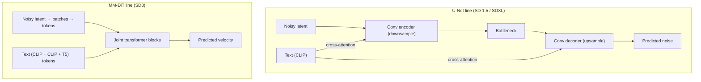
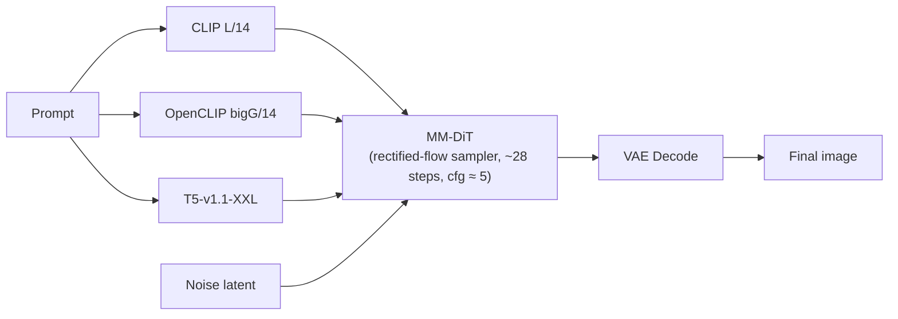

[AI/ML Documentation](./) &raquo; Stable Diffusion 3 Guide

A focused guide to Stable Diffusion 3 (and SD3.5): the Multimodal Diffusion Transformer backbone, rectified-flow / flow-matching training, why it renders text and follows prompts better than SDXL, and the licensing you need to understand before deploying it.

## Overview

SD3 marks the Stable Diffusion lineage's shift from the U-Net to a **Multimodal Diffusion Transformer (MM-DiT)** trained with **rectified flow** - the same family of ideas behind FLUX, but with different design choices and lower resource demands. It is the bridge between the mature U-Net ecosystem (SD 1.5, SDXL, Pony) and the newer transformer flow-matching models, and it was the first model in the family to bring credible in-image text rendering and strong prompt adherence to consumer hardware.

If you have read [Stable Diffusion Fundamentals](stable-diffusion-fundamentals.html), the short version is this: SD3 keeps the latent-diffusion idea (work in a compressed VAE latent, not pixels) but replaces *both* the denoising network (U-Net → transformer) *and* the training objective (noise prediction → velocity / rectified flow). Three changes define the family:

- **Transformer, not U-Net.** MM-DiT processes image and text tokens jointly with shared attention, replacing the convolutional U-Net and its cross-attention.
- **Rectified flow.** Trained to follow a near-straight path from noise to data, so fewer steps and a lower CFG produce coherent images.
- **Text you can read.** A large T5 encoder alongside two CLIP encoders lets SD3 render legible words and follow long natural-language prompts.

## Technical Specifications

| Property | Value |
|----------|-------|
| Architecture | MM-DiT (Multimodal Diffusion Transformer) |
| Parameters | 2B (Medium), 8B (Large) |
| Text encoders | CLIP L/14 + OpenCLIP bigG/14 + T5-v1.1-XXL (77 + 77 + 256 tokens) |
| Training | Rectified flow (like FLUX) |
| Resolution | 1024×1024 base, up to 2048×2048 |
| File size | ~6 GB (Medium), ~18 GB (Large) |

> **Use SD3.5, not the original SD3 Medium.** The 3.5 Large/Medium refresh fixed much of the launch-day anatomy and licensing criticism and is the practical choice in this family today. Throughout this guide "SD3" refers to the family; settings apply to both unless noted.

## The MMDiT Architecture

### From U-Net to Diffusion Transformer

The classic Stable Diffusion denoiser is a **convolutional U-Net**: it encodes the noisy latent down to a bottleneck and decodes it back up, injecting the text prompt at each level through **cross-attention** layers. The image is the "main" signal; the text is a side input that the image attends to.

SD3 throws this out. Its denoiser is a **Diffusion Transformer (DiT)**: the noisy latent is cut into patches, each patch becomes a token (just like a vision transformer), and a stack of transformer blocks processes those tokens. There is no convolutional up/down sampling - the model is essentially a sequence model over image patches plus text tokens.

### What the "MM" (Multimodal) Means

A plain DiT only attends over image tokens and pushes text in as a conditioning vector. SD3's **MM-DiT** instead treats the two **modalities** - image patches and text tokens - as **two token streams that attend to each other**. Concretely, in each block:

- Image tokens and text tokens each get their **own** weights for the query/key/value projections and the feed-forward layer (the two streams are not forced to share parameters), and
- They are **concatenated and run through one shared self-attention** so image patches can attend to text tokens and vice versa.

This bidirectional, joint attention is the key difference from cross-attention. In a U-Net the text is read-only - the image attends to it but the text never "sees" the image. In MM-DiT the text representation is *updated* by the image as denoising proceeds, which is a large part of why SD3 follows prompts more faithfully and binds attributes to the right objects ("a **red** cube next to a **blue** sphere") more reliably than SDXL.

| Aspect | U-Net cross-attention (SDXL) | MM-DiT joint attention (SD3) |
|--------|------------------------------|------------------------------|
| Backbone | Convolutional U-Net | Transformer over patch + text tokens |
| Text role | Read-only conditioning | Co-equal token stream, updated each block |
| Attribute binding | Weaker (attributes can swap) | Stronger (joint attention disambiguates) |
| Scaling behavior | Saturates with depth | Scales smoothly with parameters (DiT property) |

### Patches, Positions, and Scaling

Because MM-DiT is a transformer over patches, it inherits the transformer's clean scaling story: Stability's SD3 paper reports that validation loss keeps falling predictably as you grow the model, which is why the family ships at multiple sizes (2B Medium, 8B Large) from one recipe. The 2D patch positions are encoded so the model knows where each patch sits in the image, and the same backbone handles 1024×1024 up to 2048×2048 by feeding more patch tokens.

## Rectified Flow and Flow Matching

### The objective, in one idea

Traditional Stable Diffusion (DDPM) trains the network to **predict the noise** that was added to an image. Sampling then runs a stochastic reverse process over many steps. SD3 instead uses **rectified flow**, a form of **flow matching**: it learns a **velocity field** that transports a sample along a straight-ish path between pure noise and a real image.

Think of it as defining, for each training pair, a straight line that interpolates between a data sample $x_0$ and a noise sample $x_1$:

$$
x_t = (1 - t)\, x_0 + t\, x_1, \qquad t \in [0, 1]
$$

The *target* velocity along that line is simply the constant direction from data to noise:

$$
v_t = \frac{d x_t}{d t} = x_1 - x_0
$$

The network $v_\theta(x_t, t, c)$ - conditioned on the timestep $t$ and the text $c$ - is trained to regress that velocity with a plain mean-squared error:

$$
\mathcal{L} = \mathbb{E}_{t,\, x_0,\, x_1}\left[\; \lVert v_\theta(x_t, t, c) - (x_1 - x_0) \rVert^2 \;\right]
$$

### Why "rectified"

If the learned paths from noise to data were perfectly straight, you could integrate them in a **single Euler step** - that is the appeal of flow matching. In practice the paths bend, but they bend far less than a DDPM trajectory, so SD3 needs **far fewer steps** (≈28, sometimes fewer) than the old hundreds-of-steps DDPM regime, and the trajectory is **deterministic** given the starting noise.

To sample, you start from noise $x_1$ and integrate the velocity field backward to $t = 0$:

$$
x_{t - \Delta t} = x_t - \Delta t \cdot v_\theta(x_t, t, c)
$$

repeating for the number of steps in your scheduler.

### Timestep weighting and "shift"

Not all timesteps are equally important - the hardest denoising happens in the middle of the trajectory, so SD3 trains with a **logit-normal** weighting that samples those middle timesteps more often. At inference, a **resolution-dependent timestep shift** rebalances where the model spends its steps; this surfaces as the **`shift`** parameter (~3.0 by default) in SD3 samplers. Raising shift pushes more sampling effort toward the high-noise end, which matters when you generate at higher resolutions. This is the SD3-specific knob with no SDXL analog.

### How this changes guidance

Because the model follows a near-straight, well-conditioned path, classifier-free guidance does not need to be cranked the way it is on U-Net models. SDXL typically runs CFG ≈ 5-9; SD3 runs at **CFG ≈ 5 or lower**, and pushing it high tends to over-saturate and "fry" the image rather than improve adherence.

| Aspect | DDPM noise prediction (SDXL) | Rectified flow (SD3) |
|--------|------------------------------|----------------------|
| Network predicts | Added noise | Velocity (data → noise direction) |
| Trajectory | Curved, stochastic | Near-straight, deterministic |
| Typical steps | 25-50 | ~28 (can go lower) |
| Typical CFG | 5-9 | ~5 or below |
| Extra knob | — | `shift` (timestep rebalancing) |

## Triple Text Encoding and Text Rendering

### Three encoders, two jobs

SD3's headline feature is **triple text encoding**. It runs the prompt through three encoders in parallel:

| Encoder | Tokens | What it contributes |
|---------|--------|---------------------|
| CLIP ViT-L/14 | 77 | Visual concept vocabulary (the SD 1.5 encoder) |
| OpenCLIP bigG/14 | 77 | Richer visual concept vocabulary (the SDXL encoder) |
| T5-v1.1-XXL | 256 | Natural-language understanding, spelling, long prompts |

The two CLIP encoders supply the "what does this concept look like" signal that earlier Stable Diffusion relied on. The large **T5** encoder is the new ingredient: a text-to-text language model that actually parses grammar, word order, and - critically - **individual letters**. That is what enables two of SD3's real advantages over SDXL: notably **stronger prompt adherence** and the ability to **render legible text** inside images.

### Why text rendering finally works

Rendering "OPEN" on a neon sign requires the model to know the *spelling* of the word as a sequence of glyphs, then place those glyphs coherently. CLIP encodes text as a bag of visual concepts and is famously bad at spelling; T5 carries character-level information through to the MM-DiT, where joint attention can lay the letters out. Combined, T5's spelling knowledge plus MM-DiT's joint attention is why SD3 can produce readable words where SDXL produces glyph soup.

### The T5 trade-off

T5-XXL is large (~4.7B parameters in fp16), so the triple encoder adds setup complexity and memory. Two practical notes:

- You can **drop T5 at inference** to save VRAM. The model still works - you keep concept fidelity from the CLIP encoders - but you lose most of the long-prompt comprehension and text rendering. T5 is the part that makes SD3 special, so dropping it is a fallback, not a recommendation.
- Stability ships **fp8 and other quantized T5 builds** specifically to make the triple encoder fit on consumer cards.

### Prompting SD3

Because of T5, SD3 rewards **natural-language description** over keyword spam - closer to how you prompt FLUX than how you prompt SD 1.5. Quality-tag stacks (`masterpiece, best quality, ...`) help far less here than they did on the U-Net models; a clear sentence that names the subject, setting, style, and any text-to-render does more work.

For in-image text, put the literal words in quotes, e.g. *a vintage shop window with a neon sign reading "OPEN", rainy night, cinematic*. Keep rendered strings short - a few words render far more reliably than a full sentence.

## Strengths and Weaknesses

| Strengths | Weaknesses |
|-----------|------------|
| Best-in-class prompt following | More restrictive licensing than SD 1.5/SDXL |
| Can render readable words and letters | Smaller ecosystem, fewer fine-tunes |
| Medium runs well on ~10 GB VRAM | Triple encoder adds setup complexity |
| FLUX-class quality at lower cost; standard workflows | Large variant is resource-heavy |

## Optimal Settings

| Setting | Value |
|---------|-------|
| Resolution | 1024×1024 |
| Steps | 28 (Stability's recommendation) |
| CFG scale | ~5 (lower than U-Net models) |
| Sampler | `dpmpp_2m` |
| Shift | ~3.0 (important SD3 flow parameter) |

A few practical pointers that follow from the architecture above:

- **Do not raise CFG to SDXL levels.** Rectified flow follows prompts at a low guidance scale; CFG ≈ 8 over-saturates SD3.
- **Tune `shift` with resolution.** At 1024 the default ~3.0 is fine; if you push toward 2048 a higher shift spends more steps on the structure-defining high-noise phase.
- **Keep T5 loaded for text/long prompts.** If you only need stylized concept art on a tight VRAM budget, a CLIP-only run is acceptable - but you forfeit the feature set that justifies choosing SD3.

### SD3 Inference Pipeline

The data flow makes the triple-encoder + flow design concrete - three encoders feed the MM-DiT, which integrates the velocity field, and a VAE decodes the result:

## Licensing Notes

SD3 shipped under terms that are noticeably more restrictive than the permissive licenses behind SD 1.5 and SDXL, and the launch licensing was one of the loudest community criticisms. Treat licensing as a first-class part of model selection here.

- **Not the old CreativeML/OpenRAIL terms.** SD 1.5 and SDXL are governed by permissive open licenses that allowed broad commercial use. SD3 moved to Stability's own community/commercial license structure with usage gates.
- **Free tier with limits.** Stability's **Community License** generally permits research, non-commercial use, and commercial use **below a revenue/scale threshold**; organizations above that threshold need a paid **Enterprise** agreement. Thresholds and exact terms have changed across releases.
- **The SD3.5 refresh eased concerns.** Part of why SD3.5 is the practical choice is that the relaunch clarified and loosened terms relative to the original SD3 Medium rollout.
- **Verify before you ship.** License terms for this family have been revised multiple times. Always read the current license on the model's official Hugging Face card before any commercial deployment - do not rely on a guide (including this one) as legal authority.

> **Rule of thumb:** for hobby and research use SD3.5 is freely usable; for a funded product, confirm whether your revenue/headcount crosses Stability's commercial threshold and obtain an Enterprise license if it does.

## SD3 vs SDXL vs FLUX

SD3 sits between the mature U-Net ecosystem and FLUX. The table summarizes where it lands:

| | SDXL | SD3 / SD3.5 | FLUX |
|--|------|-------------|------|
| Backbone | U-Net | MM-DiT | DiT |
| Training | DDPM noise prediction | Rectified flow | Flow matching |
| Text encoders | 2× CLIP | 2× CLIP + T5 | T5 + CLIP |
| Text rendering | Limited | Good | Excellent |
| Typical CFG | 5-7 | ~5 | 1.0 (distilled guidance) |
| VRAM (practical) | 8 GB | ~10 GB | 12 GB+ |
| Ecosystem | Deepest, mature | Smaller, growing | Maturing fast |
| Licensing | Permissive | Gated community/enterprise | Gated (varies by variant) |

For the full cross-family treatment - including SD 1.5, SD 2.x, Pony, and FLUX variants - see the [Base Models Comparison](base-models-comparison.html).

## Key Takeaways

- **SD3 swaps the whole denoiser:** convolutional U-Net → Multimodal Diffusion Transformer (MM-DiT) with joint image+text attention.
- **It is trained with rectified flow,** learning a velocity field along near-straight noise→data paths - hence ~28 steps, a low CFG (~5), and the SD3-specific `shift` knob.
- **Triple text encoding (2× CLIP + T5)** is what unlocks legible in-image text and strong prompt adherence; T5 is the special ingredient and prompting is natural-language.
- **Prefer SD3.5** over the original SD3 Medium - it fixed launch-day anatomy and licensing complaints.
- **Mind the license:** SD3 uses Stability's gated community/enterprise terms, not the permissive SD 1.5/SDXL licenses. Verify the current Hugging Face terms before any commercial use.

## See Also

- [Base Models Comparison](base-models-comparison.html) - SD3 in context with SD 1.5, SDXL, Pony, and FLUX
- [Stable Diffusion Fundamentals](stable-diffusion-fundamentals.html) - Latent diffusion, the forward/reverse process, and flow matching
- [Model Types](model-types.html) - Checkpoints, LoRAs, VAEs, and how the pieces fit together
- [ComfyUI Guide](comfyui-guide.html) - Building the SD3 inference graph visually
- [LoRA Training](lora-training.html) - Training custom models on transformer backbones
- [ControlNet](controlnet.html) - Precise control over generation
- [Advanced Techniques](advanced-techniques.html) - Cutting-edge workflows
- [AI/ML Documentation Hub](./) - Complete AI/ML documentation index
