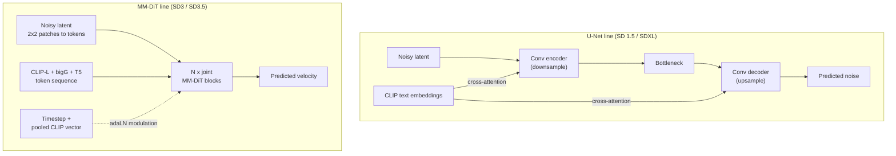
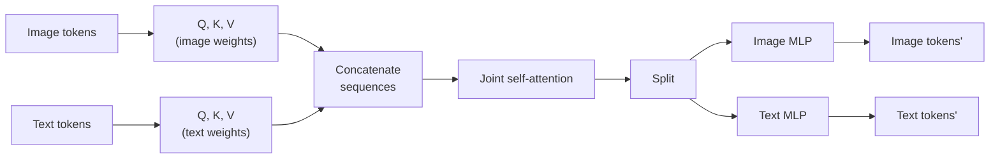
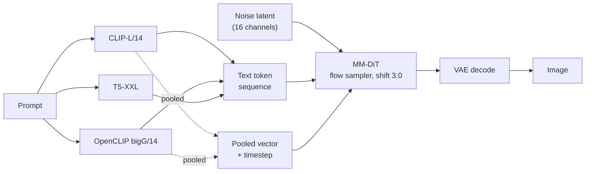

[AI/ML Documentation](./) &raquo; Stable Diffusion 3 Guide

**Stable Diffusion 3** (SD3) and its refresh **SD3.5** are Stability AI's transformer-based text-to-image models. They replace the U-Net used by SD 1.5 and SDXL with a **Multimodal Diffusion Transformer (MM-DiT)**, train it with **rectified flow**, and condition it on three text encoders including T5-XXL. This page covers the architecture, the flow-matching objective, the model variants and their settings, licensing, and where the family sits relative to SDXL and FLUX as of late 2026.

## Overview

SD3 was announced in February 2024; the 2B-parameter **SD3 Medium** weights followed in June 2024. That first release was widely criticized, for anatomy failures on simple prompts (people lying on grass became a running joke) and for a license that was unclear about commercial use and fine-tunes. Stability answered in October 2024 with **SD3.5**: an 8.1B **Large** model, a 4-step distilled **Large Turbo**, and a redesigned 2.5B **Medium**, all released under a clearer Community License. ControlNets for 3.5 Large (Blur, Canny, Depth) followed in November 2024.

Architecturally, SD3 keeps the latent-diffusion idea (denoise a compressed VAE latent rather than pixels) but changes nearly everything else:

| Component | SD 1.5 / SDXL | SD3 / SD3.5 |
|-----------|---------------|-------------|
| Denoiser | Convolutional U-Net | MM-DiT (transformer over patch and text tokens) |
| Text conditioning | Cross-attention (text is read-only) | Joint attention (text and image streams update each other) |
| Text encoders | CLIP (SD 1.5), CLIP-L + OpenCLIP-bigG (SDXL) | CLIP-L + OpenCLIP-bigG + T5-XXL |
| Training objective | Noise prediction (DDPM-style) | Rectified flow (velocity prediction) |
| VAE latent | 4 channels | 16 channels |

The 16-channel VAE is easy to overlook. Quadrupling the latent channels lets the autoencoder keep much more fine detail (small text, faces at a distance, fabric texture), and the SD3 paper shows reconstruction quality rising with channel count. It is also why SD3 LoRAs, ControlNets, and VAEs are incompatible with SDXL ones: the latent space itself is different.

## Model Variants

| Variant | Released | Parameters | Native resolution | Steps / CFG (reference) | Notes |
|---------|----------|------------|-------------------|-------------------------|-------|
| SD3 Medium | Jun 2024 | 2B | ~1 MP | 28 / ~4.5-7 | Original release; superseded, avoid for new work |
| SD3.5 Large | Oct 2024 | 8.1B | ~1 MP | 28 / 3.5-4.5 | Highest quality in the family; QK-normalization |
| SD3.5 Large Turbo | Oct 2024 | 8.1B | ~1 MP | 4 / 0 (no CFG) | Adversarial diffusion distillation of Large |
| SD3.5 Medium | Oct 2024 | 2.5B | 0.25-2 MP | 40 / 4.5 | MMDiT-X backbone; progressive multi-resolution training |

Weight files are roughly 16 GB (Large, bf16) and 5 GB (Medium), **not counting the text encoders**. T5-XXL alone is about 4.7B parameters (roughly 9.5 GB in fp16, half that in fp8), which is why quantized T5 builds matter on consumer GPUs.

**MMDiT-X** (3.5 Medium only) adds extra image-only self-attention modules to the first 13 transformer layers and was trained progressively at 256, 512, 768, 1024, and 1440 px, with a final mixed-scale stage. The result is a small model that tolerates a wide range of output sizes. Stability also recommends **Skip Layer Guidance** (SLG) for 3.5 Medium: an extra guidance term computed by skipping a few middle layers during a portion of sampling, which improves structure and anatomy. ComfyUI exposes it as a node; diffusers exposes it as pipeline arguments.

## The MM-DiT Architecture

### From U-Net to Diffusion Transformer

A U-Net denoiser downsamples the noisy latent to a bottleneck and upsamples it back, reading the prompt at each resolution through cross-attention. A **Diffusion Transformer (DiT)** has no convolutional pyramid: the latent is cut into 2×2 patches, each patch becomes a token with a positional embedding, and a stack of transformer blocks processes the sequence. Timestep and a pooled text embedding modulate every block through adaptive layer norm (adaLN).



### What "Multimodal" Means

A plain DiT attends only over image tokens and injects text as a conditioning vector. MM-DiT treats image patches and text tokens as **two streams with separate weights** (their own Q/K/V projections, MLPs, and norms) that are **concatenated for a single shared attention operation**:



Because attention runs over the combined sequence, image patches attend to words and words attend to image patches. In a U-Net the text embedding is fixed for the whole denoising process; in MM-DiT the text representation is refined block by block in light of the emerging image. This is the main reason SD3 binds attributes to the correct objects ("a **red** cube on a **blue** sphere") more reliably than SDXL.

| Aspect | U-Net cross-attention (SDXL) | MM-DiT joint attention (SD3) |
|--------|------------------------------|------------------------------|
| Text role | Read-only conditioning | Co-equal token stream, updated each block |
| Attribute binding | Attributes can leak between objects | Stronger binding |
| Scaling | Gains flatten with depth | Validation loss falls predictably with size |
| Cost driver | Resolution (convolutions) | Sequence length (attention is quadratic in tokens) |

The SD3 paper trained a series of models with increasing depth and found validation loss decreased smoothly with model size and compute, correlating with human preference scores. SD3.5 Large also adds **QK-normalization** (normalizing queries and keys before the attention product), which stabilizes mixed-precision training at 8B scale. FLUX.1 uses a closely related hybrid: double-stream MM-DiT blocks followed by single-stream blocks.

## Rectified Flow

### The Objective

DDPM-style models are trained to predict the noise added to an image and sample with a curved, many-step reverse process. SD3 uses **rectified flow**, a form of flow matching: the network learns a velocity field that moves samples along straight paths between data and noise.

With data sample $x_0$, Gaussian noise $\epsilon$, and $t \in [0, 1]$, the forward path is a straight line:

$$
x_t = (1 - t)\, x_0 + t\, \epsilon
$$

Its time derivative, the target velocity, is constant along the path:

$$
v = \frac{d x_t}{d t} = \epsilon - x_0
$$

The network $v_\theta(x_t, t, c)$, conditioned on the timestep and the text $c$, regresses that velocity:

$$
\mathcal{L} = \mathbb{E}_{t,\, x_0,\, \epsilon}\left[ w(t)\, \lVert v_\theta(x_t, t, c) - (\epsilon - x_0) \rVert^2 \right]
$$

where $w(t)$ is the timestep weighting discussed below. Sampling starts from pure noise at $t = 1$ and integrates the learned field back to $t = 0$; the simplest solver is Euler:

$$
x_{t - \Delta t} = x_t - \Delta t \; v_\theta(x_t, t, c)
$$

### Why Straight Paths Help

If the learned trajectories were perfectly straight, one Euler step would suffice. They are not, because many data points map to overlapping noise regions and the averaged field bends, but they are much straighter than DDPM trajectories. That is why SD3 produces coherent images in roughly 28 steps with a deterministic ODE sampler, and why distillation to 4 steps (Large Turbo) works well.

### Timestep Sampling and Shift

The SD3 paper compared many timestep distributions and found that sampling $t$ from a **logit-normal** distribution, which concentrates training on intermediate noise levels where the prediction task is hardest, worked best.

At higher resolutions a given noise level destroys proportionally less information (neighboring pixels are more correlated), so the schedule has to be shifted toward high noise. The paper derives a resolution-dependent remapping; in practice it is exposed as a single **shift** parameter $s$:

$$
t' = \frac{s\, t}{1 + (s - 1)\, t}
$$

With $s = 1$ the schedule is unchanged; larger $s$ spends more of the step budget at high noise, where global composition is decided. SD3 uses $s = 3.0$ by default (ComfyUI's `ModelSamplingSD3` node). FLUX uses the same idea with a shift computed automatically from image size.

### Consequences for Guidance

A near-straight, well-conditioned flow does not need heavy classifier-free guidance. SD3.5 Large works best around CFG 3.5-4.5, and pushing toward SDXL-style values (7-9) oversaturates and "fries" images.

| Aspect | Noise prediction (SDXL) | Rectified flow (SD3) |
|--------|-------------------------|----------------------|
| Network predicts | Added noise $\epsilon$ | Velocity $\epsilon - x_0$ |
| Trajectory | Curved | Near-straight |
| Typical steps | 25-50 | 28 (Large), 40 (Medium), 4 (Turbo) |
| Typical CFG | 5-9 | 3.5-4.5 |
| Schedule knob | Karras / exponential sigmas | `shift` (default 3.0) |

## Text Encoders and Text Rendering

### Three Encoders

| Encoder | Parameters | Context | Contribution |
|---------|-----------:|---------|--------------|
| CLIP ViT-L/14 | ~0.12B (text) | 77 tokens | Visual-concept vocabulary (the SD 1.5 encoder) |
| OpenCLIP ViT-bigG/14 | ~0.7B (text) | 77 tokens | Richer concept vocabulary (the SDXL encoder) |
| T5-v1.1-XXL (encoder) | ~4.7B | 77/256 tokens in training | Syntax, word order, spelling, long prompts |

The per-token outputs of the two CLIP encoders are concatenated and padded to T5's width, then joined with the T5 tokens to form the text stream; the two CLIP pooled vectors feed the adaLN conditioning. T5 was trained with 77- and later 256-token contexts, so prompts longer than about 256 T5 tokens can produce artifacts even though the pipeline accepts up to 512.

### Why Text Rendering Works

CLIP encodes text as a bag of visual concepts and is notoriously weak at spelling. T5 is a general language model whose SentencePiece tokens carry sub-word and character-level information into the transformer, and joint attention lets that information shape specific image regions. Together with the 16-channel VAE, which can actually reconstruct small glyphs, this is why SD3 renders short strings legibly where SDXL produces glyph soup.

### Dropping or Quantizing T5

T5 can be omitted at inference (pass empty or zero T5 embeddings). The model still runs on the CLIP signal and keeps most concept fidelity, but loses much of its long-prompt comprehension and nearly all of its text rendering. fp8 or GGUF-quantized T5 is almost always the better trade-off on limited VRAM.

### Prompting

Write prompts as natural-language descriptions, closer to FLUX than to SD 1.5. Quality-tag stacks (`masterpiece, best quality`) contribute little. Put literal text in quotes and keep it short:

```text
A vintage shop window at night with a neon sign reading "OPEN",
rain-streaked glass, warm interior light, 35mm photograph
```

Negative prompts matter less than on U-Net models, and Turbo ignores them entirely because it runs without CFG.

## Recommended Settings

| Setting | SD3.5 Large | SD3.5 Large Turbo | SD3.5 Medium |
|---------|-------------|-------------------|--------------|
| Resolution | ~1 MP (e.g. 1024×1024, 1152×896) | ~1 MP | 0.25-2 MP; 1024-1440 px sides |
| Steps | 28 | 4 | 40 |
| CFG | 3.5-4.5 | 0 (disabled) | 4.5 |
| Sampler (ComfyUI) | `euler` or `dpmpp_2m` | `euler` | `euler` or `dpmpp_2m` |
| Scheduler | `sgm_uniform` / `simple` | `sgm_uniform` | `sgm_uniform` |
| Shift | 3.0 | 3.0 | 3.0 |
| Extras | ControlNets available | — | Skip Layer Guidance recommended |

Practical notes:

- **Keep CFG low.** Above about 5 on Large, colors oversaturate and contrast blows out before prompt adherence improves.
- **Raise shift for large images.** If you generate well above 1 MP (Medium at 1440 px, or upscaling passes), a higher shift helps preserve global structure.
- **Keep T5 loaded** for anything involving text or long prompts; drop it only when VRAM forces the choice.

### Inference Pipeline



### diffusers Example

```python
import torch
from diffusers import StableDiffusion3Pipeline

pipe = StableDiffusion3Pipeline.from_pretrained(
    "stabilityai/stable-diffusion-3.5-large",
    torch_dtype=torch.bfloat16,
)
pipe.enable_model_cpu_offload()  # helps on 16-24 GB cards

image = pipe(
    'a vintage shop window with a neon sign reading "OPEN", rainy night',
    num_inference_steps=28,
    guidance_scale=3.5,
    max_sequence_length=256,
).images[0]
image.save("sd35_large.png")
```

The repositories are gated on Hugging Face: accept the license on the model page and authenticate (`hf auth login`) before downloading.

## Ecosystem and Tooling

- **ControlNets:** Stability released Blur (tile-style upscaling), Canny, and Depth ControlNets for SD3.5 Large in November 2024. Coverage for Medium and for other control types is thinner than for SDXL.
- **LoRA training:** supported by diffusers training scripts, kohya-ss `sd-scripts`, and SimpleTuner. Transformer LoRAs typically target the attention and MLP projections of the MM-DiT blocks; see [LoRA Training](lora-training.html).
- **Runtimes:** native support in ComfyUI and diffusers; Stability has also published TensorRT-optimized builds and an NVIDIA NIM package for deployment.
- **Adoption:** community fine-tuning of SD3.5 remained modest. Most hobbyist effort went to FLUX and, for anime, to SDXL fine-tunes such as Illustrious and NoobAI (see [Pony & Community Fine-Tunes](pony-and-finetunes.html)). Expect fewer ready-made LoRAs and checkpoints than for SDXL or FLUX.1.

## Licensing

SD3 and SD3.5 are released under the **Stability AI Community License**, not the CreativeML Open RAIL-M/++-M licenses that cover SD 1.5 and SDXL.

| Use | Terms (SD3.5 Community License) |
|-----|---------------------------------|
| Research and non-commercial | Free |
| Commercial, total annual revenue under US$1M | Free, including derivative fine-tunes |
| Commercial, revenue US$1M or more | Requires a Stability Enterprise license |

The original SD3 Medium launch terms were narrower and caused some hosts to pause SD3 uploads until the license was revised. Terms have changed more than once, so read the current license on the Hugging Face model card before commercial deployment; this page is not legal advice.

## SD3.5 vs SDXL vs FLUX

| | SDXL | SD3.5 | FLUX.1 [dev] | FLUX.2 [dev] |
|--|------|-------|--------------|--------------|
| Released | Jul 2023 | Oct 2024 | Aug 2024 | Nov 2025 |
| Backbone | U-Net (~2.6B) | MM-DiT (2.5B / 8.1B) | Hybrid MM-DiT (12B) | Rectified-flow transformer (32B) |
| Objective | Noise prediction | Rectified flow | Rectified flow | Rectified flow |
| Text encoders | CLIP-L + bigG | CLIP-L + bigG + T5-XXL | CLIP-L + T5-XXL | Mistral Small 3.2 (24B VLM) |
| Text rendering | Poor | Good | Very good | Very good |
| Guidance | CFG 5-9 | CFG 3.5-4.5 | Distilled guidance ~3.5, CFG 1 | Distilled guidance |
| Practical VRAM | 8 GB | ~10 GB (Medium), 16 GB+ (Large) | 12 GB+ (quantized) | 24 GB+ (quantized) |
| Ecosystem | Deepest | Small | Large | Growing |
| License | Open RAIL++-M | Community (<$1M revenue free) | Non-commercial | Non-commercial |

When SD3.5 is still the right choice:

- You need **commercial use without a paid license** at small scale and want better prompt adherence and text than SDXL.
- You want a **small transformer model**: 3.5 Medium runs on mid-range GPUs and handles a broad range of aspect ratios.
- You need the official **Blur/Canny/Depth ControlNets** on a flow-matching model.

For raw quality and ecosystem depth, FLUX-family and newer open models (for example Qwen-Image, a 20B MM-DiT released under Apache 2.0 in August 2025) generally outperform it. See the [FLUX Guide](flux-guide.html) and [Base Models Comparison](base-models-comparison.html).

## See Also

- [Base Models Comparison](base-models-comparison.html) - SD3 in context with SD 1.5, SDXL, Pony, and FLUX
- [FLUX Guide](flux-guide.html) - The other major MM-DiT, flow-matching family
- [Stable Diffusion Fundamentals](stable-diffusion-fundamentals.html) - Latent diffusion, the forward/reverse process, and flow matching
- [Model Types](model-types.html) - Checkpoints, LoRAs, VAEs, and how the pieces fit together
- [ComfyUI Guide](comfyui-guide.html) - Building the SD3 inference graph visually
- [LoRA Training](lora-training.html) - Training adapters on transformer backbones
- [ControlNet](controlnet.html) - Structural control over generation
- [AI/ML Documentation Hub](./) - Complete AI/ML documentation index
