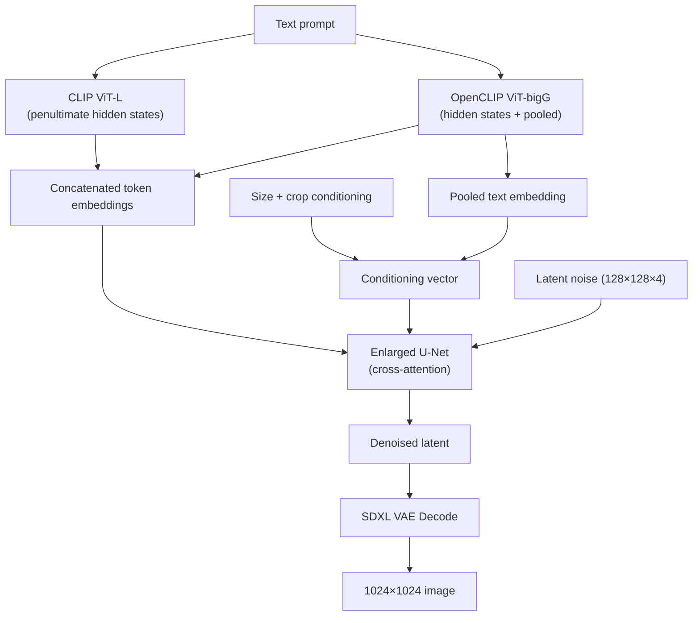
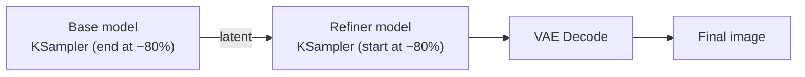

[AI/ML Documentation](./) &raquo; SDXL Guide

Everything you need to work effectively with SDXL: how the architecture differs from SD 1.5, why it conditions on resolution and crop, when the refiner helps, what resolutions to use, and which fine-tunes (Pony, Illustrious, NoobAI) extend it.

## Why SDXL Is the Default All-Rounder

SDXL (Stable Diffusion XL, released July 2023) was the first open Stable Diffusion model to combine native megapixel output, strong composition, and a broad, mature add-on ecosystem in one package. Years later it remains the **safest all-around choice**: it runs on consumer 8 GB cards, produces photorealistic and stylized work equally well, and sits at the center of the deepest collection of LoRAs, ControlNets, and fine-tunes outside the SD 1.5 legacy world.

If you are deciding *which* base model to use at all, start with the [Base Models Comparison](base-models-comparison.html). This guide assumes you have already chosen SDXL (or one of its fine-tunes) and want to understand and exploit it fully. Three structural changes define it:

- **Two text encoders.** CLIP ViT-L and OpenCLIP ViT-bigG read the prompt together, improving prompt comprehension and composition over SD 1.5's single encoder.
- **Conditioned on size and crop.** SDXL is told the target resolution and crop offset, which reduces the zoom/crop artifacts that plagued earlier models.
- **Optional refiner.** A second model can finish the last ~20% of denoising for extra micro-detail — though modern fine-tunes often look excellent base-only.

## Architecture Overview

SDXL keeps the U-Net diffusion architecture of SD 1.5/2.x but scales it up and adds two structural changes — dual text encoding and conditioning augmentation — plus an optional second-stage refiner model.

### Technical Specifications

| Property | Value |
|----------|-------|
| Architecture | Enlarged U-Net (+ optional Refiner) |
| Parameters | ~3.5B base (+ ~3.5B refiner) |
| Training resolution | 1024×1024 (multi-aspect buckets) |
| Text encoders | CLIP ViT-L + OpenCLIP ViT-bigG (77 tokens each) |
| Conditioning | Size + crop conditioning |
| VAE | SDXL VAE (improved color accuracy) |
| File size | ~6.5 GB (base only) |
| Latent space | KL-f8 (8× downsample, 4 latent channels) |

### How the Pieces Fit Together

SDXL is a latent diffusion model: it denoises in a compressed latent space rather than at pixel resolution, then decodes once at the end. The encoders condition the U-Net through cross-attention, and the conditioning vector carries the extra size/crop information.



At 1024×1024 the VAE's 8× downsampling means the U-Net operates on a 128×128×4 latent — four times the latent area of SD 1.5's 64×64, which is the main reason SDXL needs more VRAM and runs slower.

## Dual Text Encoders

The single most consequential change from SD 1.5 is that SDXL reads the prompt with **two** text encoders at once and concatenates their outputs.

### What Each Encoder Contributes

| Encoder | Role | Output used |
|---------|------|-------------|
| CLIP ViT-L/14 | The same encoder SD 1.5 used; strong on concrete tags and learned tokens | Token-level hidden states |
| OpenCLIP ViT-bigG/14 | A much larger encoder; better at composition and broader semantics | Token-level hidden states **and** a pooled embedding |

SDXL concatenates the per-token hidden states from both encoders along the feature dimension to form the cross-attention context, and uses the **pooled** embedding from the bigG encoder as part of the global conditioning vector. Each encoder still has a 77-token limit, so the practical prompt budget is unchanged from SD 1.5 — but the model understands those tokens better.

### Practical Consequences

- **Natural language helps.** The larger bigG encoder rewards descriptive phrasing. An SD 1.5 keyword soup like `1girl, best quality, masterpiece, park` underperforms a short sentence: *"a young woman sitting on a park bench on a sunny day, professional photography, shallow depth of field."*
- **Quality-spam tags matter less.** Tokens like `masterpiece, best quality` carry far less weight on base SDXL than on SD 1.5 (they regain importance on tag-trained fine-tunes like Pony).
- **Dual-prompt control.** Some tools (ComfyUI's `CLIPTextEncodeSDXL`, certain A1111/Forge fields) let you feed the two encoders *different* text — e.g. a detailed description to one and style tags to the other. This is optional; feeding both the same prompt is the normal default.

### Conditioning Math

For a prompt token sequence, let `h_L` be the CLIP-L hidden states and `h_G` the OpenCLIP-bigG hidden states. The cross-attention context `c` is their channel-wise concatenation:

$$
c = \mathrm{concat}(h_L, h_G) \in \mathbb{R}^{77 \times (d_L + d_G)}
$$

while the global conditioning vector combines the pooled bigG embedding `p_G` with the size/crop embeddings (next section):

$$
v = \mathrm{concat}(p_G,\; e_{\text{orig}},\; e_{\text{crop}},\; e_{\text{target}})
$$

The U-Net attends to `c` in its cross-attention layers and adds `v` to its timestep embedding, so both the *words* and the *geometry* steer every denoising step.

## Size and Crop Conditioning

Earlier SD models were trained on whatever crops the dataset provided, so they learned spurious habits — e.g. associating low resolution with blur, or center-cropping people's heads off. SDXL fixes this by **telling the model, at training time, the geometry of each example**, then letting you set those values at inference.

### The Three Conditioning Signals

| Signal | Meaning | Inference effect |
|--------|---------|------------------|
| `original_size` (`width`, `height`) | The native resolution of the training image | Set high (e.g. 1024×1024 or larger) to request "high-quality source" behavior; setting it low induces low-res/blurry output |
| `crop_coords_top_left` (`crop_top`, `crop_left`) | The pixel offset of the training crop | Set to `(0, 0)` for a centered, uncropped composition; nonzero values shift/zoom the framing |
| `target_size` (`width`, `height`) | The output resolution bucket | Set to your intended output size |

Because the model saw the *true* crop coordinates during training, it learned to disentangle "this is a cropped image" from content. At inference you exploit that: requesting `crop_top = crop_left = 0` reliably yields well-framed subjects instead of the head-cropping that SD 1.5 is notorious for.

### Why This Matters

This is why SDXL "just frames better" than SD 1.5 without any prompt tricks. In ComfyUI these values live on the `CLIPTextEncodeSDXL` and the SDXL-specific empty-latent/conditioning nodes; in A1111/Forge they are exposed as advanced fields and usually left at sensible defaults. For normal use, leave `original_size` and `target_size` at your working resolution and keep the crop at `(0, 0)`.

## Resolutions and Aspect Ratios

SDXL was trained with **multi-aspect bucketing**: instead of forcing everything to a square, the training pipeline sorted images into buckets of differing aspect ratios that all hold roughly 1024×1024 = ~1.05M pixels. The model therefore generates clean non-square images natively, as long as you stay near that pixel budget and use dimensions that are multiples of 64.

### Recommended Native Resolutions

| Aspect ratio | Resolution | Use |
|--------------|-----------|-----|
| 1:1 | 1024×1024 | Square / icons / general |
| 4:3 | 1152×896 | Standard landscape |
| 3:4 | 896×1152 | Standard portrait |
| 16:9 | 1344×768 | Widescreen / cinematic |
| 9:16 | 768×1344 | Phone / vertical |
| 3:2 | 1216×832 | Photographic landscape |
| 2:3 | 832×1216 | Photographic portrait |
| 21:9 | 1536×640 | Ultrawide |

### Resolution Rules of Thumb

- **Stay near ~1 megapixel.** Total pixel count should hover around 1024×1024. Drifting far above it (e.g. trying 2048×2048 directly) tends to produce duplicated subjects and "double-head" artifacts because the U-Net never saw that scale.
- **Use multiples of 64.** The 8× VAE downsample plus U-Net stride means non-multiples get padded or cropped, costing alignment.
- **Go bigger with upscaling, not bigger latents.** For 2K/4K output, generate at native resolution then use a [high-resolution upscale pass](advanced-techniques.html) (img2img at low denoise, or a tiled/ControlNet upscaler) rather than asking SDXL for a huge canvas in one shot.

## Strengths and Weaknesses

| Strengths | Weaknesses |
|-----------|------------|
| Photorealistic quality, excellent micro-detail | Needs 8 GB+ VRAM |
| Native 1024×1024+, strong composition | 40-50% slower than SD 1.5 |
| Improved (if imperfect) text rendering | Best quality wants the two-model pipeline |
| Works across all styles; deepest modern ecosystem | ~13 GB for the full base + refiner |

Compared with the transformer/flow-matching models (SD3, FLUX), SDXL gives up some prompt-adherence precision and legible-text quality, but in exchange it runs lighter, faster, and on a far deeper ecosystem of community add-ons.

## Optimal Settings

| Setting | Value |
|---------|-------|
| Resolution | 1024×1024 (or a native bucket above) |
| Base steps | 25-35 |
| Refiner steps | 10-15 (if used) |
| CFG scale | 5-7 |
| Sampler | `dpmpp_2m_sde` (Karras) |
| Refiner switch | ~0.8 |
| Negative prompt | Critical for quality |

A few notes:

- **CFG runs lower than SD 1.5.** SDXL likes `cfg ≈ 5-7`; pushing it toward SD 1.5's `7-9` oversaturates and "fries" output.
- **Karras schedules pair well** with the `dpmpp_2m` / `dpmpp_2m_sde` samplers for the best detail-per-step.
- **Negative prompts still matter**, though SDXL needs less aggressive negatives than SD 1.5 thanks to its cleaner training.

## The Refiner Pipeline

The SDXL release shipped **two** models: the **base** and a separate **refiner**. The refiner is a specialist trained only on the *low-noise* end of the diffusion process — the final timesteps where fine texture and micro-detail are resolved.

### How the Handoff Works

The two-stage handoff is a single latent passed between two samplers — the base stops early and the refiner finishes:



Concretely, the base model denoises from step 0 to roughly 80% of the schedule, then hands the partially-denoised **latent** (not a decoded image) to the refiner, which finishes the remaining ~20% before a single VAE decode. The switch point is the `refiner_switch` / `denoise` boundary near `0.8`.

### Should You Use the Refiner?

| Use the refiner when... | Skip the refiner when... |
|-------------------------|--------------------------|
| You want maximum micro-detail on the base SDXL checkpoint | You are using a modern community fine-tune (most look great base-only) |
| You have the VRAM/disk for ~13 GB of models | You are VRAM- or disk-constrained (8 GB cards) |
| You are doing final, high-stakes renders | You are iterating quickly on prompts |

In practice, the ecosystem moved away from the refiner: most popular SDXL fine-tunes (Juggernaut, RealVisXL, DreamShaper XL, the Pony/Illustrious family) were trained to look excellent in a single base pass, and many users never load the refiner at all. Treat it as an optional finishing tool, not a requirement.

### Ensemble vs. Two-Stage

Two ways of combining base and refiner exist:

1. **Two-stage (sequential).** Run the base to ~80%, then the refiner to 100%. This is the diagram above and the common workflow.
2. **Ensemble of experts.** Conceptually, base and refiner are "experts" specialized on different noise levels of the *same* schedule, and the refiner only ever sees low-noise steps it was trained for. The two-stage workflow is the practical realization of this idea.

## Migrating from SD 1.5 to SDXL

The biggest shift is from terse tags to natural description. An SD 1.5 prompt like `masterpiece, best quality, 1girl, sitting, park bench` becomes, for SDXL, something closer to a sentence: *"a young woman sitting on a park bench on a sunny day, professional photography, shallow depth of field."* SDXL's dual encoders reward this; quality-spam tags help much less than they did on SD 1.5.

A quick translation table:

| Concern | SD 1.5 habit | SDXL adjustment |
|---------|--------------|-----------------|
| Prompt style | Comma-separated tags | Natural language + a few tags |
| Quality boosters | `masterpiece, best quality` carry real weight | Mostly inert on base SDXL |
| Resolution | 512×512 | 1024×1024 native buckets |
| CFG | 7-9 | 5-7 |
| Add-ons | SD 1.5 LoRAs/ControlNets | **Must** use SDXL-specific LoRAs/ControlNets (not cross-compatible) |
| Framing tricks | Manual prompt wrangling | Built-in crop conditioning at `(0, 0)` |

The hard compatibility rule: **SD 1.5 LoRAs, embeddings, and ControlNets do not load on SDXL.** They target a different U-Net shape and text-encoder setup. You must download SDXL versions of any add-on.

## Ecosystem and Fine-Tunes

SDXL's lasting advantage is the breadth of work built on top of it. Because every fine-tune below shares the SDXL architecture, they also **share its LoRAs and ControlNets** — a LoRA trained for SDXL generally works on Pony, Illustrious, and the photorealistic checkpoints alike (with varying aesthetic fit).

### Photorealistic and General Fine-Tunes

| Fine-tune | Focus |
|-----------|-------|
| Juggernaut XL | Versatile photorealism, very popular general checkpoint |
| RealVisXL | High-fidelity photorealistic people and scenes |
| DreamShaper XL | Balanced semi-realistic / stylized all-rounder |
| SDXL Turbo / Lightning / LCM | Distilled few-step variants for fast (1-8 step) generation |

### Anime and Stylized Fine-Tunes

The anime/stylized branch of SDXL is large enough to feel like its own model family. All three below are SDXL underneath and differ mainly in prompt convention and training data.

| Fine-tune | Prompt convention | Notable for |
|-----------|-------------------|-------------|
| Pony Diffusion V6 | `score_9, score_8_up, ...` prefix | Huge community, strong style control |
| Illustrious XL | Plain danbooru tags | Accurate character/tag recall |
| NoobAI XL | Plain danbooru tags | Recent training data, refined Illustrious base |

Pony's defining quirk is **score-based prompting**: it learned a quality ladder (`score_9`, `score_8_up`, ...) that you prepend to steer toward higher-rated output. Illustrious and NoobAI drop that convention in favor of plain danbooru tags. For a fuller treatment of these and how they compare to other base models, see the Pony section of the [Pony & Fine-Tunes guide](pony-and-finetunes.html#pony-diffusion-v6-xl).

### Distilled Speed Variants

Several distillation techniques produce SDXL checkpoints that generate in a handful of steps:

- **SDXL Turbo** — 1-4 step generation via adversarial diffusion distillation; great for previews, weaker on fine detail.
- **SDXL Lightning** — 2-8 step variants with better quality retention than Turbo.
- **LCM / LCM-LoRA** — a Latent Consistency Model approach available as a LoRA you can drop onto an existing SDXL checkpoint for ~4-8 step inference.

These trade some peak quality for a large speed gain and are ideal for rapid iteration before a final full-step render.

## Worked Example: A Clean SDXL Generation

A reproducible base-only SDXL setup (no refiner), suitable for an 8 GB card:

```text
Checkpoint:   Juggernaut XL (or any SDXL fine-tune)
Resolution:   1216×832  (3:2 landscape, native bucket)
Positive:     "a golden retriever puppy sitting in tall summer grass at
               sunset, warm rim light, professional wildlife photography,
               shallow depth of field, sharp focus"
Negative:     "blurry, low quality, deformed, extra limbs, watermark, text"
Steps:        30
CFG:          6.0
Sampler:      dpmpp_2m_sde
Scheduler:    karras
Crop cond:    crop_top = 0, crop_left = 0   (centered framing)
Size cond:    original/target = 1216×832
```

If you want extra micro-detail and have the VRAM, add the refiner: stop the base at `0.8`, hand off to the refiner for the final 20%, then decode once.

## Key Takeaways

- **SDXL is the safe default** — native 1024px output, strong composition, and the deepest mature ecosystem of LoRAs, ControlNets, and fine-tunes.
- **Two text encoders** (CLIP ViT-L + OpenCLIP bigG) make SDXL reward natural-language prompts and care less about SD 1.5 quality-spam tags.
- **Size/crop conditioning** is why SDXL frames subjects better than SD 1.5 — keep the crop at `(0, 0)` for centered compositions.
- **Stay near ~1 megapixel** using native aspect buckets and multiples of 64; upscale for bigger output rather than asking for a giant latent.
- **The refiner is optional** — most modern fine-tunes look excellent base-only; reach for it only for maximum micro-detail.
- **Add-ons must be SDXL-specific** — SD 1.5 LoRAs and ControlNets do not load on SDXL, but they are shared across SDXL fine-tunes (Pony, Illustrious, NoobAI).

## See Also

- [Base Models Comparison](base-models-comparison.html) - How SDXL stacks up against SD 1.5, SD3, FLUX, and Pony
- [Stable Diffusion Fundamentals](stable-diffusion-fundamentals.html) - The diffusion process SDXL is built on
- [Model Types](model-types.html) - Understanding LoRAs, VAEs, embeddings
- [ComfyUI Guide](comfyui-guide.html) - Building the SDXL base+refiner workflow visually
- [LoRA Training](lora-training.html) - Train custom SDXL LoRAs
- [ControlNet](controlnet.html) - Precise control over SDXL generation
- [Advanced Techniques](advanced-techniques.html) - High-resolution upscaling and beyond
- [AI/ML Documentation Hub](./) - Complete AI/ML documentation index
