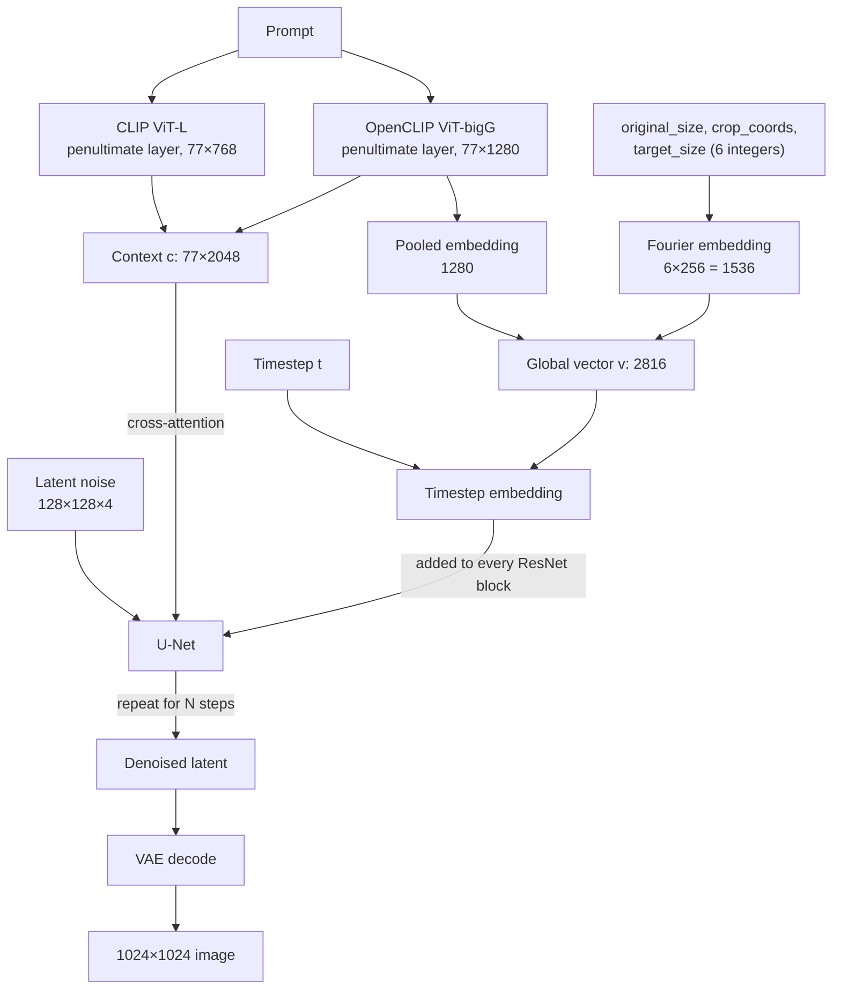
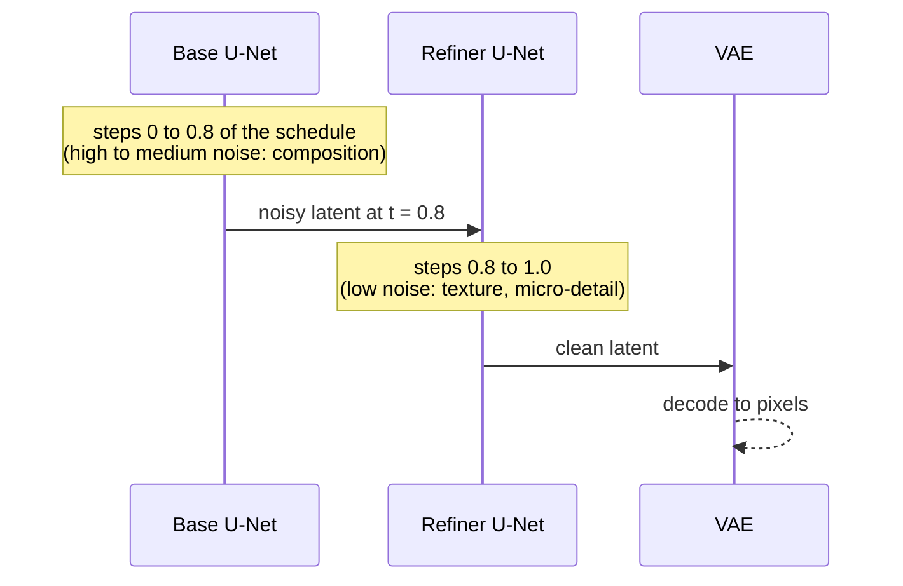
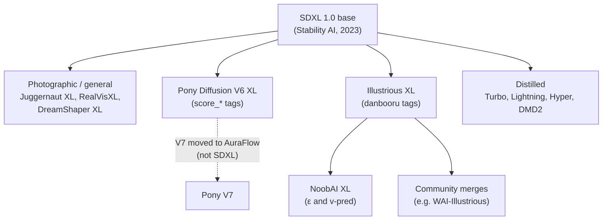

[AI/ML Documentation](./) &raquo; SDXL Guide

**Stable Diffusion XL (SDXL)** is a latent diffusion text-to-image model released by Stability AI in July 2023. It keeps the U-Net design of SD 1.5 but scales it roughly threefold, reads the prompt with two text encoders, conditions on image size and crop geometry, and generates natively at about one megapixel. This page covers how the architecture works, the settings it expects, the optional refiner stage, and the fine-tunes (Pony V6, Illustrious, NoobAI) built on it. For choosing between SDXL and other base models, see the [Base Models Comparison](base-models-comparison.html); for the underlying diffusion process, see [Stable Diffusion Fundamentals](stable-diffusion-fundamentals.html).

## Position in 2026

SDXL is no longer the most capable open image model. FLUX.1 (2024) and FLUX.2 (November 2025), Qwen-Image, and Z-Image all follow complex prompts and render text more reliably, using transformer backbones and rectified-flow training. SDXL is still widely used for three reasons:

| Reason | Detail |
|--------|--------|
| Hardware | Runs well on 8 GB GPUs at fp16. Current flagship models need 16-24 GB or heavy quantization. |
| Ecosystem | Has the largest collection of LoRAs, ControlNets, IP-Adapters, and full fine-tunes of any architecture after SD 1.5. |
| Speed | A 1024×1024 image takes about 30 U-Net steps, or 4-8 steps with a distilled variant (Lightning, Hyper-SD, DMD2). |

The anime and illustration community in particular still works mostly on SDXL, through Illustrious XL and NoobAI XL. The Pony line is the exception: Pony Diffusion V7 (November 2025) moved from SDXL to the AuraFlow architecture, so V6 is the last SDXL-based Pony.

## Architecture

### Specifications

| Property | Value |
|----------|-------|
| Backbone | U-Net with transformer blocks, ~2.6B parameters |
| Total base model | ~3.5B parameters (U-Net + both text encoders + VAE) |
| Refiner | Separate ~2.3B U-Net; ~6.6B parameters for base + refiner together |
| Text encoders | CLIP ViT-L/14 (hidden size 768) + OpenCLIP ViT-bigG/14 (hidden size 1280) |
| Cross-attention context | 77 tokens × 2048 channels |
| Extra conditioning | Pooled text embedding + original size, crop offset, target size |
| Latent space | KL-f8 VAE: 8× spatial downsample, 4 channels (128×128×4 at 1024×1024) |
| Training objective | ε-prediction (noise prediction), discrete DDPM schedule |
| Native resolution | ~1024×1024, multi-aspect buckets |
| Checkpoint size | ~6.9 GB base, ~6.1 GB refiner (fp16 safetensors) |
| License | CreativeML Open RAIL++-M |

### Data Flow

SDXL is a latent diffusion model. It denoises a compressed latent rather than pixels and decodes to an image only once, at the end. Both text encoders feed the U-Net's cross-attention layers. A separate global vector, which carries the pooled text embedding and the geometry values, is added to the timestep embedding.



### U-Net Changes Relative to SD 1.5

The extra parameters are not spread evenly across the network. SDXL rebalances where computation happens:

- **Three resolution levels instead of four.** The lowest level (8× downsampling inside the U-Net) is removed.
- **No attention at the highest resolution.** The first level has only convolutional blocks. The second and third levels contain 2 and 10 transformer blocks respectively, so most attention runs on small feature maps, where it is cheap.
- **Larger context.** Cross-attention reads a 2048-channel context, compared with 768 in SD 1.5.

At 1024×1024 the U-Net processes a 128×128×4 latent. That is four times the latent area of SD 1.5 at 512×512, and it is the main reason SDXL is slower and needs more VRAM.

## Dual Text Encoders

The most consequential change from SD 1.5 is that SDXL encodes the prompt with two text encoders and concatenates their outputs.

| Encoder | Origin | What SDXL uses |
|---------|--------|----------------|
| CLIP ViT-L/14 | OpenAI; the same encoder SD 1.5 used | Penultimate-layer token states (768-d) |
| OpenCLIP ViT-bigG/14 | LAION-trained; about 5× larger | Penultimate-layer token states (1280-d) **and** the pooled embedding |

If $h_L$ and $h_G$ are the per-token hidden states of the two encoders, the cross-attention context is their channel-wise concatenation:

$$
c = \mathrm{concat}(h_L, h_G) \in \mathbb{R}^{77 \times 2048}
$$

The global conditioning vector joins the pooled bigG embedding $p_G$ with Fourier-feature embeddings of the six geometry integers described in the next section:

$$
v = \mathrm{concat}\big(p_G,\; \phi(h_{\text{orig}}, w_{\text{orig}}),\; \phi(c_{\text{top}}, c_{\text{left}}),\; \phi(h_{\text{tgt}}, w_{\text{tgt}})\big) \in \mathbb{R}^{1280 + 1536}
$$

The U-Net reads $c$ in every cross-attention layer and adds $v$ to its timestep embedding, so both the words and the requested geometry affect every denoising step.

### Consequences for Prompting

- **Descriptive phrasing works.** The bigG encoder handles short natural-language sentences better than SD 1.5's encoder did. For base SDXL and photographic fine-tunes, *"a young woman sitting on a park bench on a sunny afternoon, shallow depth of field"* usually beats a comma-separated tag list. CLIP is still a bag-of-concepts encoder, though. Complex spatial relations ("the red cube to the left of the blue sphere") remain unreliable. Models with T5 or LLM text encoders handle those better.
- **Quality tags have little effect on base SDXL.** `masterpiece, best quality` carry much less weight than on SD 1.5. They matter again on fine-tunes trained with them, such as Illustrious and NoobAI (`masterpiece, best quality`) and Pony V6 (`score_9, score_8_up, ...`).
- **Each encoder still has a 77-token window.** Front-ends such as ComfyUI, A1111, and Forge encode longer prompts in 75-token chunks and concatenate the results. This works, but concepts in later chunks tend to have weaker influence.
- **The two encoders can take different text.** ComfyUI's `CLIPTextEncodeSDXL` node exposes separate `text_g` and `text_l` inputs, and diffusers accepts `prompt` and `prompt_2`. Most people send the same text to both, and there is little evidence that splitting it helps consistently.

## Size and Crop Conditioning

Earlier Stable Diffusion models had two training problems. Images below the training resolution were either discarded, which wasted data, or upscaled, which taught the model that blur is normal. Random crops also taught it to produce framing with subjects cut off at the edge, which is the source of SD 1.5's cropped heads. SDXL addresses both by passing each training image's geometry to the model as conditioning. At inference time you choose the values.

| Signal | Meaning during training | Effect at inference |
|--------|------------------------|---------------------|
| `original_size` (h, w) | Resolution of the source image before resizing | Large values ask for "high-resolution source" behavior. Small values (e.g. 256×256) produce blurry, low-detail output. |
| `crops_coords_top_left` (top, left) | Pixel offset of the random crop | `(0, 0)` gives centered, uncropped framing. Non-zero values produce subjects cut off at the edges. |
| `target_size` (h, w) | Output bucket resolution | Set it to the resolution you are generating. |

Because the model learned to treat "this image was cropped" or "this image was upscaled" as separate from content, you can ask for clean, well-framed, sharp output independently of the prompt. For normal use, set `original_size` and `target_size` to your working resolution (or `original_size` somewhat larger) and leave the crop at `(0, 0)`.

Where these values are set:

- **ComfyUI:** `width`, `height`, `crop_w`, `crop_h`, `target_width`, and `target_height` on `CLIPTextEncodeSDXL`. The plain `CLIPTextEncode` node fills in defaults.
- **diffusers:** `original_size`, `crops_coords_top_left`, and `target_size` on the SDXL pipelines, plus `negative_original_size` and related arguments for the negative branch. A common trick is to set `negative_original_size=(512, 512)` so that low-resolution appearance is steered away from.
- **A1111 and Forge:** handled internally with sensible defaults.

## Resolutions and Aspect Ratios

SDXL was trained with **multi-aspect bucketing**. Images were grouped into buckets of different aspect ratios that all hold about 1024² ≈ 1.05 megapixels, with both sides a multiple of 64. Generating at one of these buckets gives the cleanest results.

| Aspect ratio | Width × height | Typical use |
|--------------|----------------|-------------|
| 1:1 | 1024×1024 | General purpose |
| 9:7 / 7:9 | 1152×896 / 896×1152 | Standard landscape / portrait |
| 19:13 / 13:19 | 1216×832 / 832×1216 | Photographic 3:2-like |
| 7:4 / 4:7 | 1344×768 / 768×1344 | Widescreen / phone |
| 12:5 / 5:12 | 1536×640 / 640×1536 | Ultrawide / banners |

Practical rules:

- **Stay near one megapixel.** Much larger latents (e.g. 2048×2048 in one pass) produce duplicated subjects, extra limbs, and tiled composition because the U-Net never saw that scale during training. Much smaller canvases (e.g. 512×512) look soft and badly composed.
- **Use multiples of 64.** Other sizes work but may be padded or cropped internally, and they fall between trained buckets.
- **Upscale in a second pass for large output.** Generate at a native bucket, then upscale and run img2img at low denoise (about 0.3-0.45), or use a tiled upscaler with a tile ControlNet. See [Advanced Techniques](advanced-techniques.html) for multi-stage workflows.

## Recommended Settings

These values are for base SDXL and most photographic fine-tunes. Anime fine-tunes publish their own recommendations, and those take precedence.

| Setting | Recommended | Notes |
|---------|-------------|-------|
| Resolution | A native bucket (table above) | |
| Steps | 25-35 | Beyond ~40 there is little gain with DPM++ samplers |
| CFG scale | 5-7 | Lower than SD 1.5. Values of 8 or more oversaturate and "fry" the image. |
| Sampler | DPM++ 2M or DPM++ 2M SDE; Euler a for anime fine-tunes | |
| Scheduler | Karras | Or `exponential` / `sgm_uniform` for distilled models |
| CLIP skip | Not applicable to base SDXL | SDXL already uses penultimate-layer states. Some anime fine-tunes recommend `clip skip 2`, which in A1111 means the same thing. |
| Negative prompt | Short and specific | Long SD 1.5-style negative lists help little |
| VAE precision | fp32, bf16, or the `sdxl-vae-fp16-fix` VAE | The original SDXL VAE overflows in fp16 and produces black or NaN images |

### VAE Precision

The SDXL VAE has the same architecture as the SD 1.x VAE but was retrained, and it gives better color and fine detail. Its internal activations exceed the fp16 range, so decoding in pure fp16 can return an all-black image. There are three fixes: decode in fp32 (A1111's `--no-half-vae`), decode in bf16, or use the community `madebyollin/sdxl-vae-fp16-fix` weights. That VAE is fine-tuned to stay in the fp16 range and decodes almost identically. Most current fine-tunes ship with the fixed VAE baked in.

### ε-Prediction vs v-Prediction Checkpoints

Base SDXL predicts noise (ε). Some later fine-tunes, notably the **NoobAI XL V-Pred** series and later Illustrious v-pred releases, were retrained to predict *velocity* (v-prediction), often with a zero-terminal-SNR schedule. This extends the tonal range to true blacks and brights and fixes the washed-out mid-gray bias of ε-models. A v-pred checkpoint loaded as an ε-model produces gray, noisy garbage. In ComfyUI, add a `ModelSamplingDiscrete` node set to `v_prediction` (with `zsnr` if the model card says so). Forge and recent A1111 builds detect it from checkpoint metadata. LoRAs usually transfer between ε and v-pred models of the same family, but not always cleanly.

## The Refiner

SDXL 1.0 shipped a second model, the **refiner**. It is a U-Net trained only on the low-noise end of the schedule, the last ~20% of timesteps, where fine texture is resolved. It differs from the base model in three ways: it uses only the OpenCLIP bigG encoder, it has a different channel layout, and it adds an **aesthetic-score** conditioning input (diffusers defaults: 6.0 positive, 2.5 negative).

### Handoff

The base model denoises from pure noise to about 80% of the schedule. It then passes the partially denoised **latent**, not a decoded image, to the refiner, which runs the remaining steps. The VAE decodes once, at the end.



The SDXL paper calls this an **ensemble of expert denoisers**: two models, each specialized on part of the same noise schedule. A second, cruder mode also exists, in which the base finishes completely, the result is decoded, and the refiner runs as a low-denoise img2img pass. It works but wastes one decode and gives the refiner inputs it was not trained on.

In diffusers the handoff uses `denoising_end` and `denoising_start`:

```python
import torch
from diffusers import StableDiffusionXLPipeline, StableDiffusionXLImg2ImgPipeline

base = StableDiffusionXLPipeline.from_pretrained(
    "stabilityai/stable-diffusion-xl-base-1.0",
    torch_dtype=torch.float16, variant="fp16", use_safetensors=True,
).to("cuda")
refiner = StableDiffusionXLImg2ImgPipeline.from_pretrained(
    "stabilityai/stable-diffusion-xl-refiner-1.0",
    text_encoder_2=base.text_encoder_2, vae=base.vae,   # share weights
    torch_dtype=torch.float16, variant="fp16", use_safetensors=True,
).to("cuda")

prompt = "a lighthouse on a basalt cliff at dusk, long exposure, sharp focus"
latents = base(prompt=prompt, num_inference_steps=40,
               denoising_end=0.8, output_type="latent").images
image = refiner(prompt=prompt, num_inference_steps=40,
                denoising_start=0.8, image=latents).images[0]
```

In ComfyUI the same pattern uses two `KSamplerAdvanced` nodes. The base node gets `end_at_step = 32` and `return_with_leftover_noise = enable`. The refiner node gets `start_at_step = 32` and `add_noise = disable`, with the same total of 40 steps.

### Whether to Use the Refiner

In practice the community largely dropped it. Popular fine-tunes such as Juggernaut XL, RealVisXL, DreamShaper XL, and the entire anime branch were trained to look finished in one pass. A refiner trained against base SDXL can also pull a fine-tune's style back toward the base look. The refiner is only compatible with base SDXL's latent distribution, and LoRAs trained on the base do not apply to it.

| Use it when | Skip it when |
|-------------|--------------|
| Rendering with the original `sd_xl_base_1.0` checkpoint | Using any modern fine-tune |
| You want maximum photographic micro-texture and have ~13 GB of disk and VRAM headroom | On 8 GB cards or iterating quickly |
| No LoRA controls style | A LoRA or fine-tune controls style (the refiner ignores it) |

A cheaper way to add detail is a hires-fix pass (upscale plus low-denoise img2img) with the same model.

## Distilled Few-Step Variants

Several distillation methods produce SDXL checkpoints or LoRAs that need far fewer steps. They run at CFG ≈ 1-2 (guidance is baked in), so negative prompts have little or no effect.

| Variant | Method | Steps | Notes |
|---------|--------|-------|-------|
| LCM / LCM-LoRA (2023) | Latent consistency distillation | 4-8 | Available as a LoRA that plugs into any SDXL fine-tune; softer detail |
| SDXL Turbo (Nov 2023) | Adversarial diffusion distillation (ADD) | 1-4 | Trained at 512×512; non-commercial license |
| SDXL Lightning (Feb 2024, ByteDance) | Progressive + adversarial distillation | 1, 2, 4, 8 | Full checkpoints and LoRAs; 1024px; good quality retention |
| Hyper-SD (2024, ByteDance) | Trajectory-segmented consistency + human feedback | 1-8 | LoRAs for SDXL, some CFG-preserving |
| DMD2 (2024) | Distribution matching distillation | 4 | Often the sharpest 4-step SDXL option; available as a LoRA |

Distilled LoRAs are commonly stacked on a normal fine-tune for fast previews. For the final render you then either keep the LoRA or switch back to a full-step sampler. See the [Optimization Guide](optimization-guide.html) for how distillation compares with other speed techniques.

## Fine-Tune Ecosystem

Every model below shares the SDXL architecture. SDXL LoRAs, ControlNets, and IP-Adapters therefore load on all of them, although a LoRA trained on a photographic checkpoint may look wrong on an anime one. The deeper a fine-tune's continued training, the further it drifts from base SDXL, and cross-compatibility degrades accordingly.



### Photographic and General

| Fine-tune | Focus |
|-----------|-------|
| Juggernaut XL | Versatile photorealism; one of the most used SDXL checkpoints |
| RealVisXL | Photorealistic people and scenes |
| DreamShaper XL | Semi-realistic and stylized all-rounder |

### Anime and Illustration

| Fine-tune | Prompt convention | Notes |
|-----------|-------------------|-------|
| Pony Diffusion V6 XL | `score_9, score_8_up, score_7_up, ...` prefix plus `source_*` tags | Huge LoRA library; separate LoRA ecosystem that only partly transfers to other SDXL models |
| Illustrious XL (v0.1 → v2.x; later v3.x v-pred) | Danbooru tags plus quality tags | Strong character and artist recall. v1.0 and later add higher native resolutions; v2.0 was released untuned as a training base. |
| NoobAI XL (ε and V-Pred 1.0) | Danbooru and e621 tags | Continued pretraining of Illustrious by Laxhar Lab (from November 2024); strong tag comprehension |

Pony's quirk is **score-based prompting**: it learned a quality ladder (`score_9` down to `score_4`) that you prepend to steer toward higher-rated output. Illustrious and NoobAI use plain danbooru tags with conventional quality tags instead. See the [Pony & Fine-Tunes guide](pony-and-finetunes.html) for tag conventions and settings.

## Migrating from SD 1.5

| Concern | SD 1.5 habit | SDXL adjustment |
|---------|--------------|-----------------|
| Prompt style | Comma-separated tags | Natural language on base and photographic models; tags on anime fine-tunes |
| Quality boosters | `masterpiece, best quality` carry weight | Mostly inert on base SDXL; they matter again on Illustrious and NoobAI |
| Resolution | 512×512 | 1024×1024-class buckets |
| CFG | 7-9 | 5-7 |
| Negative prompt | Long "bad anatomy" lists and negative embeddings | Short, targeted negatives |
| Framing | Prompt tricks to avoid cropped heads | Crop conditioning at `(0, 0)` |
| VAE | Swap in `vae-ft-mse-840000` | Built-in VAE, or the fp16-fix VAE |
| Add-ons | SD 1.5 LoRAs, embeddings, ControlNets | **Must be SDXL versions.** SD 1.5 add-ons do not load. |

The compatibility rule is strict. SD 1.5 LoRAs, textual-inversion embeddings, and ControlNets target a different U-Net shape and text-encoder width, so they fail to load or have no effect on SDXL. SDXL embeddings contain two tensors, `clip_l` and `clip_g`, one for each encoder.

## Worked Example

A base-only setup for an 8 GB card:

```text
Checkpoint:  Juggernaut XL (any photographic SDXL fine-tune)
Resolution:  1216×832 (native landscape bucket)
Positive:    a golden retriever puppy sitting in tall summer grass at sunset,
             warm rim light, professional wildlife photography,
             shallow depth of field, sharp focus
Negative:    blurry, lowres, watermark, text
Steps:       30
CFG:         6.0
Sampler:     dpmpp_2m_sde
Scheduler:   karras
Size cond:   original_size = target_size = 1216×832
Crop cond:   (0, 0)
VAE:         fp16-fix (or decode in bf16/fp32)
```

To go larger, upscale the result 1.5-2× with an ESRGAN-family model, then run img2img at denoise 0.35 with the same prompt. A tile ControlNet keeps composition locked while detail is added.

## See Also

- [Base Models Comparison](base-models-comparison.html) - SDXL against SD 1.5, SD3, FLUX, and others
- [Stable Diffusion Fundamentals](stable-diffusion-fundamentals.html) - The diffusion process SDXL is built on
- [Pony & Fine-Tunes](pony-and-finetunes.html) - Pony, Illustrious, and NoobAI prompting in detail
- [FLUX Guide](flux-guide.html) and [SD3 Guide](sd3-guide.html) - The transformer and flow-matching successors
- [Model Types](model-types.html) - LoRAs, VAEs, and embeddings
- [ComfyUI Guide](comfyui-guide.html) - Building SDXL workflows visually
- [LoRA Training](lora-training.html) - Training SDXL LoRAs
- [ControlNet](controlnet.html) - Structural control for SDXL
- [Optimization Guide](optimization-guide.html) - VRAM and speed techniques
- [Advanced Techniques](advanced-techniques.html) - Upscaling and multi-stage workflows
- [AI/ML Documentation Hub](./) - Complete AI/ML documentation index
