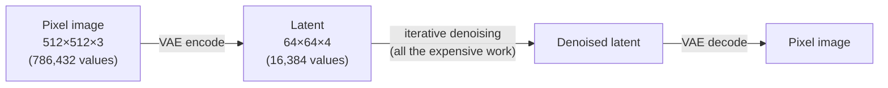
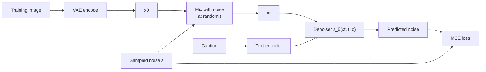
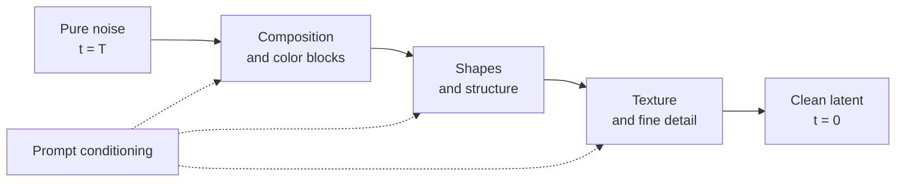
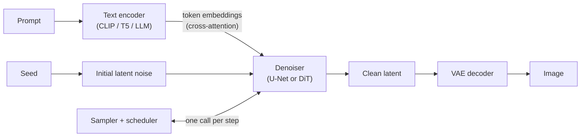
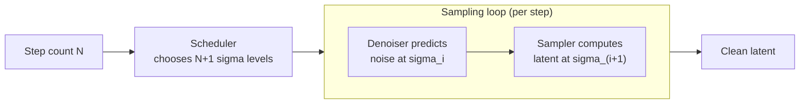
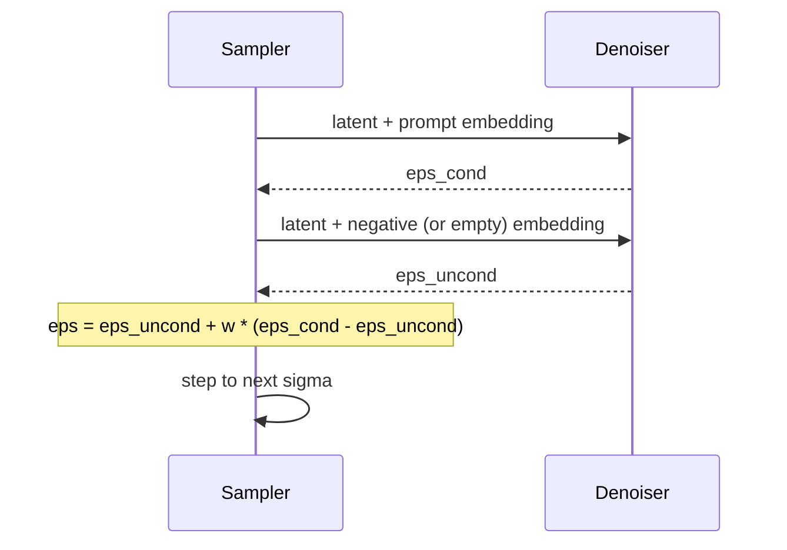
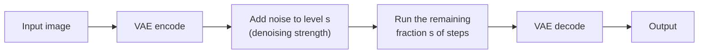

[AI/ML Documentation](./) &raquo; Stable Diffusion Fundamentals

**Stable Diffusion** is a family of open-weight *latent diffusion* models that generate images from text. A diffusion model is trained to remove noise from corrupted images. To generate, it starts from random noise and removes noise step by step, with a text prompt guiding the result. This page explains that mechanism and the three networks that implement it. It then covers what each generation setting does: sampler, scheduler, steps, CFG scale, seed, resolution, and denoising strength. The concepts apply with small changes to every model in the family, from SD 1.5 through SDXL, and to flow-matching successors such as SD3 and FLUX.

## Latent Diffusion

Early diffusion models denoised directly in pixel space, which made each step very expensive at useful resolutions. Stable Diffusion, released in August 2022 and based on the latent diffusion paper by Rombach et al., moves the iterative work into a compressed **latent space**. A variational autoencoder (VAE) encodes an image into a latent roughly 48× smaller. All denoising steps run on that latent, and the result is decoded back to pixels once, at the end.

Text-to-image generation never needs the encoder. It starts from latent noise and uses only the decoder. The encoder is needed only when an input image is involved: img2img, inpainting, and training.

### Model Lineage

The table lists Stability AI's releases, the successors that replaced them, and the newer open models they are commonly compared against.

| Model | Released | Denoiser | Training objective | Text encoder(s) | Native resolution |
|-------|----------|----------|--------------------|-----------------|-------------------|
| SD 1.4 / 1.5 | Aug / Oct 2022 | U-Net, ~0.86B | ε-prediction | CLIP ViT-L | 512² |
| SD 2.0 / 2.1 | Nov / Dec 2022 | U-Net, ~0.87B | v-prediction (768 model) | OpenCLIP ViT-H | 768² |
| SDXL | Jul 2023 | U-Net, ~2.6B | ε-prediction | CLIP ViT-L + OpenCLIP ViT-bigG | 1024² |
| SD3 / SD3.5 | Jun / Oct 2024 | MMDiT transformer, 2-8B | Rectified flow | CLIP-L + CLIP-G + T5-XXL | 1024² |
| FLUX.1 (Black Forest Labs) | Aug 2024 | Hybrid MMDiT, 12B | Rectified flow | CLIP-L + T5-XXL | ~1 MP, flexible |
| Qwen-Image (Alibaba) | Aug 2025 | MMDiT, 20B | Flow matching | Qwen2.5-VL | ~1 MP+ |
| FLUX.2 (Black Forest Labs) | Nov 2025 | Flow transformer, 32B (dev) | Rectified flow | Mistral Small 3.x (24B VLM) | up to ~4 MP |
| Z-Image (Alibaba Tongyi) | Nov 2025 | Single-stream DiT, 6B | Flow matching, distilled Turbo | Qwen-family LLM | ~1 MP+ |

The broad trend runs from U-Net to transformer (DiT/MMDiT) denoisers, from noise prediction to flow matching, and from CLIP to large language-model text encoders. The mechanism described on this page is the same across all of them. Model-specific details are covered in the [SDXL](sdxl-guide.html), [SD3](sd3-guide.html), and [FLUX](flux-guide.html) guides.

## The Diffusion Process

### Forward Process (Adding Noise)

The **forward process** gradually corrupts a clean latent $x_0$ with Gaussian noise over $T$ timesteps (typically $T = 1000$). Because each step adds independent Gaussian noise, any timestep can be sampled directly in closed form:

$$
x_t = \sqrt{\bar{\alpha}_t}\, x_0 + \sqrt{1 - \bar{\alpha}_t}\, \epsilon, \qquad \epsilon \sim \mathcal{N}(0, I)
$$

The **noise schedule** $\bar{\alpha}_t$ decreases from close to 1 (almost clean) at $t = 0$ toward 0 (almost pure noise) at $t = T$. Samplers often describe the same thing with the noise level $\sigma_t = \sqrt{(1 - \bar{\alpha}_t)/\bar{\alpha}_t}$, which is why sampler settings talk about "sigmas".

### Training Objective

The denoiser $\epsilon_\theta(x_t, t, c)$ receives the noisy latent, the timestep, and the text conditioning $c$, and predicts the noise that was added. Training minimizes the mean squared error:

$$
\mathcal{L} = \mathbb{E}_{x_0,\, \epsilon,\, t}\left[\, \lVert \epsilon - \epsilon_\theta(x_t, t, c) \rVert^2 \,\right]
$$

The network never learns to "draw" directly. It learns one function, *given a noisy input, what does the noise look like?*, at every noise level. Sampling, guidance, img2img, and inpainting are all built on repeated calls to that function.

### Prediction Targets

Predicting the noise is only one way to parameterize the output. The alternatives are mathematically interchangeable but behave differently in practice, and a checkpoint must be run with the parameterization it was trained with.

| Target | Network predicts | Used by | Notes |
|--------|------------------|---------|-------|
| ε-prediction | The noise $\epsilon$ | SD 1.x, SDXL, most SDXL fine-tunes | Poorly conditioned at very high noise; struggles to produce very dark or very bright images |
| v-prediction | $v = \sqrt{\bar\alpha_t}\,\epsilon - \sqrt{1-\bar\alpha_t}\,x_0$ | SD 2.x (768), NoobAI XL V-Pred | Stable across all noise levels; paired with a zero-terminal-SNR schedule it produces full tonal range |
| Flow velocity | $v = \epsilon - x_0$ along a straight path | SD3, FLUX, Qwen-Image, Z-Image | See [Flow Matching](#flow-matching) |

Loading a v-prediction checkpoint as if it were ε-prediction, or the reverse, gives gray, washed-out, or noisy output. This is a common source of "broken model" reports.

### Reverse Process (Generation)

Generation runs the process backwards. It starts from pure noise $x_T$. At each step the denoiser estimates the noise, the sampler uses that estimate to compute a slightly less noisy latent, and the loop repeats until $t = 0$. Early steps, at high noise, determine composition and color layout. Late steps, at low noise, add texture and fine detail. This split is why the SDXL refiner and hires-fix passes work on the low-noise end only.

## The Three Networks

A Stable Diffusion checkpoint bundles three separately trained networks.

### VAE

The VAE maps between pixels and latents. SD 1.x and SDXL use a KL-regularized autoencoder with 8× spatial downsampling and 4 latent channels. SD3 and FLUX.1 moved to 16-channel latents, and FLUX.2 introduced a new autoencoder, which preserve much more fine detail (small text, faces at a distance) at the cost of a harder denoising task. The VAE sets an upper bound on detail and color fidelity. It is also the usual cause of washed-out colors, color casts, or black images (fp16 overflow in the original SDXL VAE). VAEs are architecture-specific: an SD 1.5 VAE cannot decode SDXL or FLUX latents.

### Denoiser (U-Net or DiT)

The denoiser is the large network that predicts noise or velocity at every step, and it holds most of the parameters.

- **U-Net** (SD 1.x, 2.x, SDXL): a convolutional encoder-decoder with skip connections. Transformer blocks inside it apply self-attention (image regions attend to each other) and cross-attention (image regions attend to prompt tokens).
- **Diffusion Transformer, DiT / MMDiT** (SD3, FLUX, and newer models): the latent is cut into patches and processed as a token sequence. MMDiT processes text and image tokens jointly, with information flowing both ways, instead of injecting text only through cross-attention. Transformers scale more predictably with parameters and data, which is why every new flagship model uses one.

LoRAs, and most other fine-tuning, modify the denoiser's attention and projection weights. Some LoRAs also modify the text encoder.

### Text Encoder

The text encoder turns the prompt into a sequence of embeddings that condition the denoiser. Its capacity largely determines how well the model follows prompts.

| Model | Text encoder | Token window | Practical effect |
|-------|--------------|--------------|------------------|
| SD 1.5 | CLIP ViT-L | 77 | Keyword-style prompts; weak at relations and counting |
| SDXL | CLIP ViT-L + OpenCLIP ViT-bigG | 77 each (front-ends chunk longer prompts) | Better composition; short sentences work |
| SD3 / SD3.5 | CLIP-L + CLIP-G + T5-XXL | 77 (CLIP), up to 256 by default (T5) | Long natural-language prompts, legible short text |
| FLUX.1 | CLIP-L (pooled) + T5-XXL | 256 (schnell) / 512 (dev) | Strong prompt adherence and text rendering |
| FLUX.2, Qwen-Image, Z-Image | LLM or VLM encoder | Long | Multi-subject scenes, layout instructions, multilingual text |

CLIP was trained to match images with short captions, so it encodes a loose set of concepts. T5 and LLM encoders encode syntax, which is why "a red cube on top of a blue sphere" works reliably only on the newer models.

## Samplers and Schedulers

Two settings control *how* the reverse process is integrated. They are chosen independently.

- **Sampler** (solver): the numerical method that turns each noise prediction into the next latent, such as Euler, DPM++ 2M, or UniPC.
- **Scheduler** (sigma schedule): which noise levels the N steps visit, and how they are spaced.

### Samplers

| Sampler | Type | Behavior | Typical use |
|---------|------|----------|-------------|
| Euler | Deterministic, 1st order | Simple and robust | Previews; the default for flow models (SD3, FLUX) |
| Euler a (ancestral) | Stochastic | Injects fresh noise each step, so the image keeps changing as steps increase | Anime fine-tunes, exploration |
| DDIM | Deterministic | The original fast sampler; supports exact inversion | Legacy workflows, inversion-based editing |
| DPM++ 2M | Deterministic, 2nd-order multistep | Sharp results in 20-30 steps; converges as steps increase | General default for U-Net models |
| DPM++ 2M SDE / 3M SDE | Stochastic | More texture and detail; needs a few more steps | Photographic final renders |
| UniPC | Deterministic, predictor-corrector | Good quality at 10-20 steps | Low step counts |
| LCM | Consistency sampler | Only for LCM-distilled models or LoRAs | 4-8 step generation |

Two properties matter more than the name of the sampler:

- **Deterministic vs stochastic.** With a fixed seed, every sampler is reproducible on the same hardware and software. Only deterministic samplers **converge**, though: adding steps refines the same image. Ancestral and SDE samplers inject new noise, so 30 steps and 50 steps give noticeably different images.
- **Order.** Higher-order and multistep solvers (DPM++ 2M, UniPC) reach a given quality in fewer steps than Euler, but can overshoot at very low step counts or very high CFG.

### Schedulers

Common options in ComfyUI and A1111/Forge:

| Scheduler | Spacing | Notes |
|-----------|---------|-------|
| `normal` / `simple` | Follows the model's training schedule | Safe default; `simple` is the usual choice for flow models |
| `karras` | Denser steps at low noise (Karras et al., 2022) | Better detail per step for U-Net models; pairs well with DPM++ |
| `exponential` | Evenly spaced in log-sigma | Good for SDE samplers and some distilled models |
| `sgm_uniform` | Uniform over training timesteps | Recommended for SDXL Turbo and Lightning |
| `beta` | Concentrates steps at both ends | Popular with FLUX and flow models |
| Align Your Steps (AYS) | Schedules optimized per model (NVIDIA, 2024) | Better results at 10-20 steps; separate node in ComfyUI |

The scheduler used in *training* (for example linear or cosine $\bar\alpha_t$) is fixed by the checkpoint. The sampling scheduler only chooses which points on that curve to visit.

## Classifier-Free Guidance (CFG)

A conditional model's prediction alone follows the prompt only weakly. **Classifier-free guidance** runs the denoiser twice per step, once with the prompt ($\epsilon_{\text{cond}}$) and once with an empty or negative prompt ($\epsilon_{\text{uncond}}$), and extrapolates away from the unconditional prediction:

$$
\hat{\epsilon} = \epsilon_{\text{uncond}} + w \left(\epsilon_{\text{cond}} - \epsilon_{\text{uncond}}\right)
$$

At $w = 1$ this is simply the conditional prediction, with no extrapolation. Larger $w$ pushes the sample further toward what distinguishes the prompt from "anything". Prompt adherence and contrast increase until colors oversaturate and details burn.

Practical consequences:

- **The negative prompt replaces the unconditional branch.** This is how negative prompts work, and why they have no effect at CFG 1.
- **CFG roughly doubles compute per step**, because it runs two forward passes. This is why distilled models that run at CFG 1 are twice as fast per step.
- **Guidance-distilled models** (FLUX.1-dev, FLUX.2-dev) learned the guided output directly. They run at CFG 1 with a separate `guidance` value (about 2.5-4) passed as model input. Raising real CFG on them mostly degrades output.

| Model family | Typical CFG |
|--------------|-------------|
| SD 1.5 | 6-9 |
| SDXL and fine-tunes | 4-7 (Pony and Illustrious: 5-7) |
| SD3.5 | 3.5-5 |
| FLUX.1-dev / FLUX.2-dev | CFG 1, `guidance` ≈ 2.5-4 |
| Turbo, Lightning, LCM, schnell | 1-2 |

Several techniques reduce the side effects of high CFG: CFG rescale (introduced for zero-terminal-SNR models), dynamic thresholding, and APG (adaptive projected guidance). Perturbed-attention guidance (PAG) takes a different approach. It adds structure by contrasting against a deliberately degraded prediction instead of relying only on a high $w$. See [Advanced Techniques](advanced-techniques.html).

## Generation Parameters

### Resolution

Generate at or near the pixel count the model was trained on. The model learned composition at that scale. Much larger canvases produce duplicated subjects and repeated limbs, and much smaller ones look soft.

| Model | Native pixel budget | Example sizes |
|-------|---------------------|---------------|
| SD 1.5 | ~0.26 MP | 512×512, 512×768 |
| SDXL / Pony / Illustrious | ~1 MP | 1024×1024, 832×1216, 1344×768 |
| SD3.5, FLUX.1 | ~1 MP (FLUX tolerates 0.5-2 MP) | 1024×1024, 1152×896 |
| FLUX.2, Qwen-Image | ~1-4 MP | Model-card dependent |

For larger output, generate at native size and then upscale in a second pass: latent or pixel upscale, then img2img at about 0.3-0.5 denoise, optionally tiled with a tile ControlNet.

### Steps

| Steps | Use |
|-------|-----|
| 1-8 | Distilled models only (Turbo, Lightning, LCM, Hyper, DMD2, FLUX schnell, Z-Image Turbo) |
| 15-25 | Previews; flow models often look finished by about 20-28 |
| 25-35 | Standard for SD 1.5 and SDXL with DPM++ samplers |
| 40+ | Rarely worth it with deterministic samplers; SDE samplers benefit slightly |

### Seed

The seed initializes the random number generator that produces the starting noise. The same seed, prompt, settings, model, and software stack reproduce the same image. Results can still differ across GPU vendors, precisions, or attention backends, and between CPU- and GPU-generated noise (A1111 generates on the GPU by default, ComfyUI on the CPU). Keeping the seed fixed while changing one parameter is the standard way to see what that parameter does.

### Denoising Strength (img2img and Inpainting)

Image-to-image starts from an existing image instead of pure noise. The image is encoded, noised to an intermediate timestep, and the loop runs from there. **Denoising strength** (0-1) chooses how far into the schedule to start, which is the same as how much of the original the model may change.

| Strength | Effect | Typical use |
|----------|--------|-------------|
| 0.2-0.4 | Keeps structure and colors; refines texture | Hires-fix detailing, cleanup |
| 0.5-0.65 | Keeps layout; changes content and style | Restyling, variations |
| 0.7-0.85 | Loose reinterpretation | Sketch-to-image |
| 0.9-1.0 | Almost text-to-image | Input used as a vague color hint |

With 30 steps and strength 0.4, only the last 12 steps run. **Inpainting** applies the same process inside a mask. Dedicated inpainting checkpoints, or models with native editing such as FLUX.1 Kontext, blend the edges better. For structural control that img2img cannot give, see [ControlNet](controlnet.html) and [Inpainting & Editing](inpainting-editing.html).

## Prompting Mechanics

The prompt is split into tokens, the text encoder produces embeddings, and the denoiser attends to them through attention. Some consequences follow from that:

- **Earlier tokens tend to carry more weight in CLIP-based models.** CLIP's causal attention and training on short captions favor the start of the prompt. Put the subject first, then details, style, and lighting. This matters less with T5 or LLM encoders.
- **Cross-attention is local.** Each image region attends to the tokens most relevant to it, which is why concepts "bleed" (a "red hat" also turns the shirt red). Regional prompting and attention masking address this. See [Advanced Techniques](advanced-techniques.html).
- **Negative prompts** take the place of the unconditional branch in CFG (see above). Short, specific negatives work better than long boilerplate lists, especially on SDXL and newer models.
- **Prompt style depends on the training captions.** SD 1.5 anime fine-tunes and Pony, Illustrious, and NoobAI expect danbooru tags. Base SDXL accepts short sentences. SD3, FLUX, and LLM-encoder models expect full descriptive prose and can render quoted text.

### Weighting Syntax

A1111, Forge, and ComfyUI scale a token's embedding with the following syntax:

| Syntax | Effect | Supported by |
|--------|--------|--------------|
| `(word)` | ×1.1 | A1111, Forge, ComfyUI |
| `(word:1.4)` | ×1.4 | A1111, Forge, ComfyUI |
| `[word]` | ×0.9 (de-emphasis) | A1111 and Forge only; ComfyUI treats brackets literally |
| `[a:b:0.5]` | Prompt editing: switch from `a` to `b` halfway through the steps | A1111 and Forge (ComfyUI uses conditioning nodes) |

Weights above about 1.5 usually cause artifacts. On T5 and LLM-encoded models, weighting is less effective and often unsupported. Rephrase instead.

## Memory and Performance

Approximate VRAM needed to generate at native resolution with a single model loaded:

| Model | fp16 / bf16 | With fp8 or GGUF quantization, or offload |
|-------|-------------|--------------------------------------------|
| SD 1.5 | 4 GB | 2-3 GB |
| SDXL | 8 GB (fp16-fix VAE) | 6 GB |
| SD3.5 Large (8B) | ~18-20 GB | ~10-12 GB |
| FLUX.1-dev (12B) | ~24 GB | ~8-12 GB (fp8 or GGUF Q4-Q8) |
| FLUX.2-dev (32B + 24B encoder) | Datacenter-class | ~16-24 GB with 4-bit weights and offload |
| Z-Image Turbo (6B) | ~16 GB | Less with quantization |

In order of cost, the main levers are:

1. **Memory-efficient attention.** PyTorch SDPA (the default in current front-ends), xFormers, or FlashAttention.
2. **Lower-precision weights.** fp16/bf16, then fp8, then GGUF or NF4 4-bit quantization. Quality loss is small down to about 8 bits and noticeable below 5.
3. **Offloading.** Keep only the active network on the GPU. ComfyUI and Forge do this automatically, and diffusers exposes `enable_model_cpu_offload()`.
4. **Tiled VAE decode** for large images, where the decode alone can exceed VRAM.

See the [Optimization Guide](optimization-guide.html) for details.

## Flow Matching

SD3, FLUX, and most models since 2024 are trained with **rectified flow**, a form of flow matching, instead of the DDPM noise objective. The noisy sample is a straight-line interpolation between data $x_0$ and noise $\epsilon$:

$$
x_t = (1 - t)\, x_0 + t\, \epsilon, \qquad t \in [0, 1]
$$

The network $v_\theta$ is trained to predict the constant **velocity** along that line:

$$
\mathcal{L} = \mathbb{E}_{x_0,\, \epsilon,\, t}\left[\, \lVert (\epsilon - x_0) - v_\theta(x_t, t, c) \rVert^2 \,\right]
$$

Generation integrates the ordinary differential equation $\mathrm{d}x/\mathrm{d}t = v_\theta$ from $t = 1$ (noise) to $t = 0$ (data). Because the training paths are straight, even a plain Euler solver with 20-30 steps follows them accurately. Distillation can reduce this to 1-8 steps.

| | DDPM-style diffusion | Rectified flow |
|--|---------------------|----------------|
| Noisy sample | $\sqrt{\bar\alpha_t}\,x_0 + \sqrt{1-\bar\alpha_t}\,\epsilon$ | $(1-t)\,x_0 + t\,\epsilon$ |
| Network predicts | Noise $\epsilon$ (or $v$) | Velocity $\epsilon - x_0$ |
| Sampling paths | Curved | Nearly straight |
| Typical sampler | DPM++ 2M, Karras | Euler, `simple` or `beta` schedule |
| Models | SD 1.x, 2.x, SDXL | SD3, FLUX, Qwen-Image, Z-Image |

Flow models also use **timestep shift**. More sampling steps are spent at high noise for larger images, because a high-resolution image keeps its coarse structure visible at noise levels that would erase a small one. ComfyUI exposes this as `ModelSamplingSD3` or `ModelSamplingFlux` (`shift`).

## Few-Step Generation

Distillation trains a student model to match what the full model produces over many steps, but in only a few steps:

| Technique | Year | Idea | Steps |
|-----------|------|------|-------|
| Latent Consistency Models (LCM) | 2023 | Map any point on the trajectory directly to its endpoint | 4-8 |
| Adversarial Diffusion Distillation (SDXL Turbo, SD3 Turbo) | 2023-24 | Distillation plus a GAN discriminator | 1-4 |
| Progressive / adversarial (SDXL Lightning) | 2024 | Halve the step count repeatedly, with adversarial loss | 1-8 |
| Distribution Matching Distillation (DMD2) | 2024 | Match output distributions rather than individual trajectories | 1-4 |
| Guidance and timestep distillation (FLUX.1-schnell, Z-Image Turbo) | 2024-25 | Bake CFG and few-step sampling into the weights | 1-8 |

Distilled models run at CFG ≈ 1, ignore or weaken negative prompts, and usually need a specific sampler and scheduler, which the model card gives. See the [Optimization Guide](optimization-guide.html) for the speed trade-offs.

## Troubleshooting

| Symptom | Likely cause | Fix |
|---------|-------------|-----|
| Solid black image | fp16 VAE overflow (SDXL) or NaNs | Use the fp16-fix VAE, or decode in bf16/fp32 |
| Gray, low-contrast, noisy output | ε/v-prediction mismatch; wrong VAE | Set the model's prediction type; use the matching VAE |
| Oversaturated, "fried" colors | CFG too high for the model | Lower CFG (see the table above), or use CFG rescale |
| Duplicated subjects, extra heads | Resolution far above the native pixel budget | Generate at native size, then upscale |
| Soft, blurry result | Too few steps, resolution too low, distilled LoRA at full CFG | Raise steps, use a native bucket, match CFG to the model |
| Image keeps changing as steps increase | Ancestral or SDE sampler | Expected behavior; use DPM++ 2M or Euler for convergence |
| Prompt partly ignored | Token limit, concept bleed, CLIP's weak syntax | Shorten or reorder the prompt; regional prompting; a T5 or LLM-encoder model |
| LoRA has no effect or errors | LoRA built for a different architecture | Match the LoRA to the base (SD 1.5 vs SDXL vs FLUX) |

## See Also

- [SDXL Guide](sdxl-guide.html) - Dual encoders, size conditioning, and the refiner
- [SD3 Guide](sd3-guide.html) and [FLUX Guide](flux-guide.html) - Transformer and flow-matching models
- [Base Models Comparison](base-models-comparison.html) - Choosing a base model
- [Model Types](model-types.html) - Checkpoints, LoRAs, VAEs, and embeddings
- [ComfyUI Guide](comfyui-guide.html) - Building generation workflows
- [ControlNet](controlnet.html) - Structural control
- [Inpainting & Editing](inpainting-editing.html) - Masked and instruction-based editing
- [LoRA Training](lora-training.html) - Training custom styles and subjects
- [Optimization Guide](optimization-guide.html) - Quantization, attention backends, and distillation
- [Advanced Techniques](advanced-techniques.html) - Regional prompting, guidance variants, and upscaling
- [AI/ML Documentation Hub](./) - Complete AI/ML documentation index
