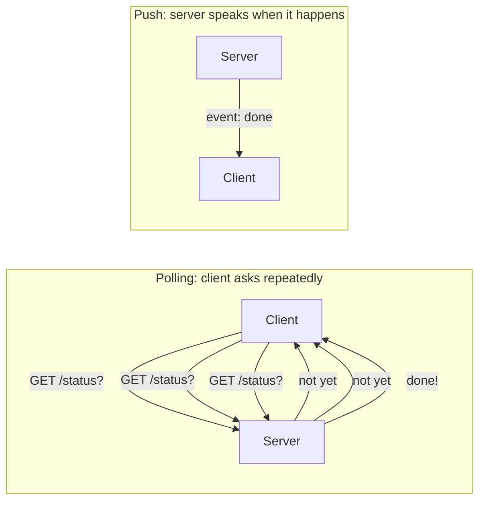
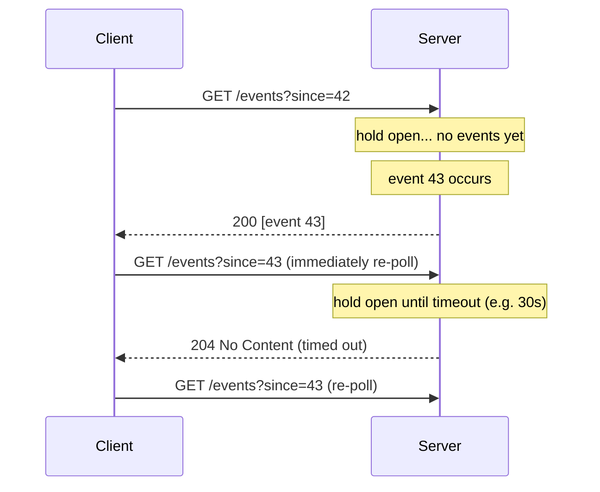
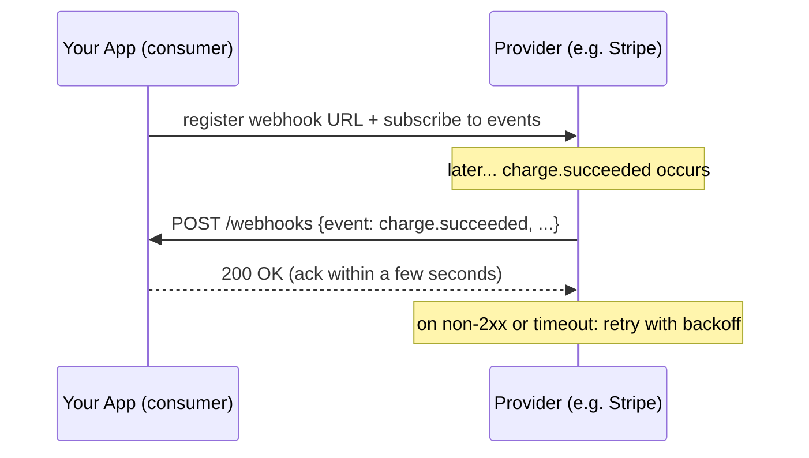
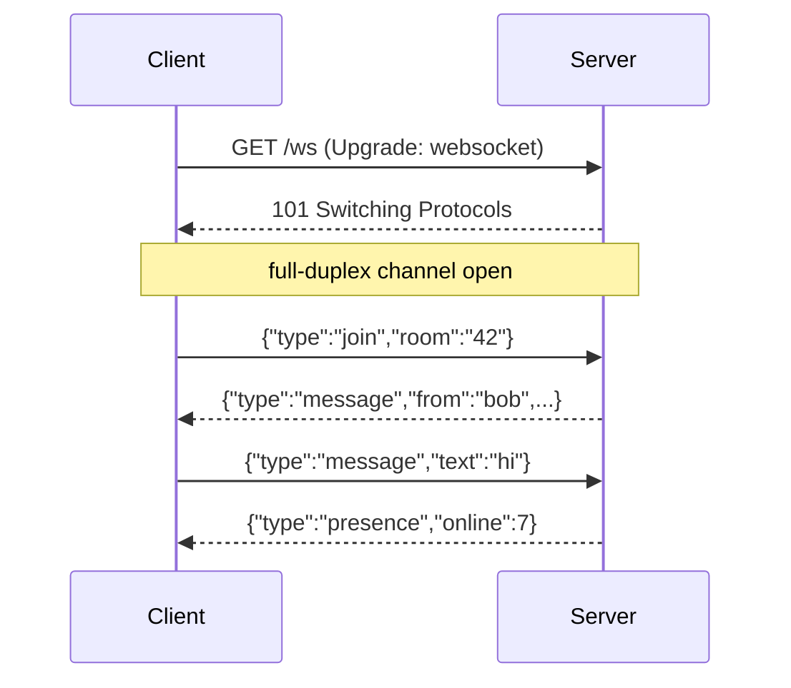
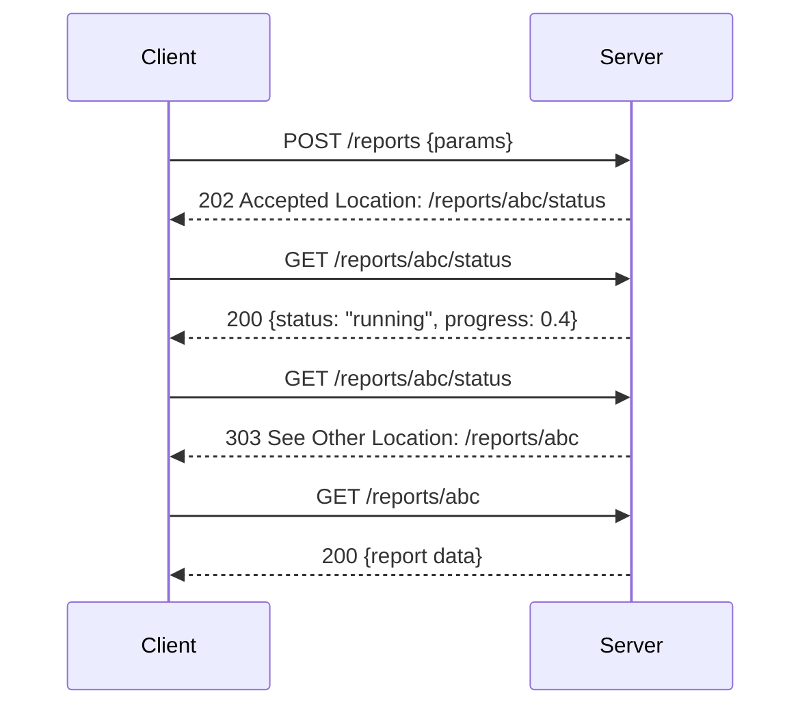
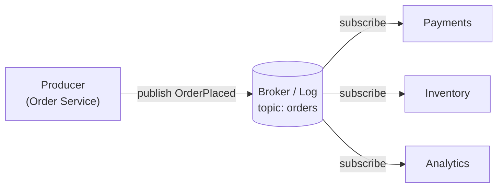
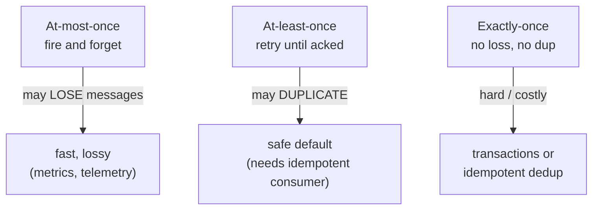
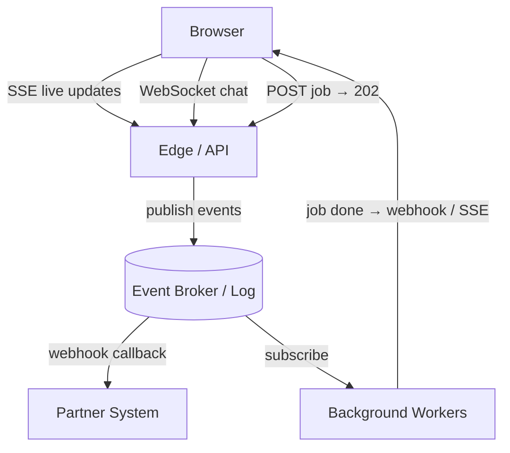

<div class="hero-section" style="background: linear-gradient(135deg, #667eea 0%, #764ba2 100%); color: white; padding: 3rem 2rem; margin: -2rem -3rem 2rem -3rem; text-align: center;">
  <h1 style="color: white; margin: 0; font-size: 2.5rem;">Async &amp; Event-Driven APIs</h1>
  <p style="font-size: 1.25rem; margin-top: 1rem; opacity: 0.9;">Webhooks, server-sent events, WebSockets, long polling, async request-reply, and the AsyncAPI spec — pushing data instead of polling for it, and getting delivery guarantees right.</p>
</div>

[API Design](./) &raquo; Async &amp; Event-Driven APIs

<div class="intro-card">
  <p class="lead-text">A classic request-response API answers the client's question and hangs up. But much of what an integration actually needs is the opposite shape: the server has news — a payment cleared, a build finished, a price ticked — and wants to tell the client <em>when it happens</em>, not when the client next asks. This page surveys the family of asynchronous and event-driven API styles: webhooks for server-to-server callbacks, Server-Sent Events and WebSockets for browser streams, long polling as the lowest-common-denominator fallback, the async request-reply pattern for slow operations behind a synchronous facade, and event/streaming APIs over brokers. It then covers the <strong>AsyncAPI</strong> specification that documents all of these, and the cross-cutting concerns that decide whether an async API is correct at all: idempotency, ordering, and at-least-once vs exactly-once delivery.</p>
</div>

<div class="key-insights">
  <div class="insight-card">
    <i class="fas fa-bell"></i>
    <h4>Push beats poll</h4>
    <p>Webhooks and streams deliver events as they occur, eliminating the latency and wasted traffic of polling for "anything new yet?".</p>
  </div>
  <div class="insight-card">
    <i class="fas fa-plug"></i>
    <h4>Pick the transport for the direction</h4>
    <p>One-way server-to-client favors SSE; bidirectional, low-latency interaction needs WebSockets; server-to-server uses webhooks.</p>
  </div>
  <div class="insight-card">
    <i class="fas fa-redo"></i>
    <h4>At-least-once is the default</h4>
    <p>Networks retry, so consumers must be idempotent — design every event handler to survive seeing the same event twice.</p>
  </div>
  <div class="insight-card">
    <i class="fas fa-file-contract"></i>
    <h4>AsyncAPI is the OpenAPI of events</h4>
    <p>A machine-readable contract for channels, messages, and bindings makes event-driven APIs documentable and tool-generatable.</p>
  </div>
</div>

## Table of contents
{: .no_toc .text-delta }

1. TOC
{:toc}

---

## Why Asynchronous APIs

The request-response model assumes the answer exists at the moment the question is asked. That assumption breaks in two common situations:

1. **The server originates the information.** The interesting moment ("your order shipped", "the GPU job finished") happens on the server's clock, not in response to a client request. The client cannot ask for something it does not yet know to ask about.
2. **The work takes too long to wait for.** A video transcode or a large report can take minutes. Holding an HTTP connection open that whole time wastes a socket, trips proxy timeouts, and gives the client nothing to do but block.

Both push you toward an **asynchronous** style where the result arrives *out of band* relative to the original request. The naive solution — have the client **poll** ("is it done yet?") on a timer — works but is wasteful: most polls return "nothing new," and the latency of learning about an event is, on average, half the poll interval. The async and event-driven styles below are all, at heart, ways to avoid that waste by letting the server speak first.



A useful way to organize the landscape is by **direction** and **who holds the connection**:

| Style | Direction | Connection holder | Typical use |
|-------|-----------|-------------------|-------------|
| Long polling | server → client | client (re-opens) | fallback when nothing better is available |
| Webhooks | server → client | server (calls client) | server-to-server callbacks |
| Server-Sent Events (SSE) | server → client | client (one long GET) | browser live feeds, notifications |
| WebSockets | bidirectional | either | chat, collaborative editing, games |
| Event/streaming APIs | server → consumers | broker | high-volume internal event distribution |
| Async request-reply | request now, reply later | mixed | slow operations behind an HTTP facade |

The rest of this page works through each, then the AsyncAPI contract that describes them and the delivery-semantics rules that make them correct.

## Long Polling

**Long polling** is the bridge between naive polling and true push, and it requires no protocol beyond ordinary HTTP — which is exactly why it remains the universal fallback.

The client issues a normal `GET`, but instead of replying immediately with "nothing new," the server **holds the request open** until either an event is available or a timeout elapses. When an event arrives, the server responds; the client processes it and *immediately re-issues* the request to wait for the next one. The result is near-real-time delivery using only request-response semantics that every proxy, firewall, and HTTP client already supports.



The two essential mechanics:

- **A cursor.** The client passes a `since` (or `Last-Event-ID`) token so a re-poll resumes exactly after the last event it saw, even if events occurred during the gap between responses. Without a cursor, the brief window between responding and re-polling drops events.
- **A bounded hold.** The server caps how long it holds the connection (commonly 25–30 s, under typical proxy idle timeouts) and returns an empty `204` on timeout, prompting an immediate, cheap re-poll.

Long polling's cost is one in-flight request per client at all times and a connection re-established on every event, which scales poorly compared to a single persistent stream. Use it as a fallback (the venerable [SockJS](https://github.com/sockjs) and Socket.IO libraries degrade to it automatically) and reach for SSE or WebSockets when the client environment supports them.

## Webhooks

A **webhook** inverts the client-server roles for delivery: instead of the consumer polling the provider, the **provider makes an HTTP request to a URL the consumer registered**. Stripe calls your `/webhooks/stripe` endpoint when a charge succeeds; GitHub `POST`s to your CI when a push lands. The consumer runs a small HTTP *server* to receive these callbacks. Webhooks are the dominant server-to-server async style because they require no persistent connection and reuse plain HTTP.



### Designing a webhook receiver

A correct receiver must handle four realities of webhook delivery:

1. **Verify authenticity.** Anyone can `POST` to a public URL, so the provider signs each payload (typically HMAC-SHA256 over the raw body with a shared secret) and sends the signature in a header. The receiver recomputes the HMAC over the **raw, unparsed** body and compares in constant time. Reject on mismatch.
2. **Acknowledge fast, process later.** Providers expect a `2xx` within a few seconds and will retry otherwise. Do *not* run the business logic inline; persist the event and return `200` immediately, then process from a queue. This keeps a slow downstream from causing duplicate deliveries.
3. **Deduplicate.** Webhook delivery is **at-least-once**: a slow ack or a network blip causes the provider to retry, and your endpoint sees the same event twice. Every event carries a unique ID; record processed IDs and ignore repeats (see [Idempotency](#idempotency--delivery-guarantees)).
4. **Tolerate reordering.** Events can arrive out of order (retries, parallel delivery). Carry a sequence number or timestamp and ignore events that are older than the state you already have.

```python
import hmac, hashlib

def verify_signature(raw_body: bytes, signature: str, secret: bytes) -> bool:
    expected = hmac.new(secret, raw_body, hashlib.sha256).hexdigest()
    # constant-time compare defeats timing attacks
    return hmac.compare_digest(expected, signature)

# Flask receiver
@app.post("/webhooks/payments")
def receive():
    raw = request.get_data()  # RAW bytes — do not use parsed JSON for the HMAC
    if not verify_signature(raw, request.headers["X-Signature"], WEBHOOK_SECRET):
        return "", 401

    event = request.get_json()
    if already_processed(event["id"]):     # dedupe — delivery is at-least-once
        return "", 200                     # already handled; ack and move on
    enqueue(event)                         # hand off to a worker, do not block
    mark_processed(event["id"])
    return "", 200                         # ack FAST so the provider does not retry
```

### Operational concerns

- **Retries and dead-lettering.** Providers retry with exponential backoff for hours; well-behaved providers eventually give up and surface failed deliveries in a dashboard for manual replay. As a *provider*, cap retries and dead-letter persistently failing endpoints rather than retrying forever.
- **The localhost problem.** A receiver behind NAT/firewall is unreachable for delivery. Development uses tunneling (ngrok, the provider's CLI `stripe listen`); production exposes a real HTTPS endpoint.
- **Thundering events.** A bulk operation can emit thousands of webhooks at once; receivers need rate-tolerant ingestion (queue first) and providers should batch where the semantics allow.

> **WebSub / PubSubHubbub** standardizes webhooks for content feeds: subscribers register a callback with a *hub*, publishers ping the hub, and the hub fans out webhook deliveries. It is the formalized, decoupled cousin of the bespoke webhook.

## Server-Sent Events (SSE)

**Server-Sent Events** is a W3C standard for a **one-way, server-to-client** stream over a single long-lived HTTP response. The client opens an ordinary `GET` with `Accept: text/event-stream`; the server keeps the connection open and writes events as a simple text format, one `data:` line at a time, flushing as it goes. The browser exposes this through the built-in `EventSource` API, which crucially **reconnects automatically** and replays missed events.

```
GET /stream HTTP/1.1
Accept: text/event-stream

HTTP/1.1 200 OK
Content-Type: text/event-stream
Cache-Control: no-cache

event: price
id: 101
data: {"symbol": "ACME", "px": 42.10}

event: price
id: 102
data: {"symbol": "ACME", "px": 42.15}

```

The wire format is deliberately trivial: blank-line-separated records of `field: value` lines. Three fields matter — `data` (the payload, repeatable for multi-line), `event` (a named type the client can listen for), and `id` (a cursor). When the connection drops, `EventSource` reconnects and sends the last `id` it saw in a `Last-Event-ID` header, letting the server resume the stream without gaps — the SSE protocol bakes the long-polling cursor in for free.

```javascript
const es = new EventSource("/stream");
es.addEventListener("price", (e) => {
  const tick = JSON.parse(e.data);
  render(tick);
});
es.onerror = () => { /* EventSource auto-reconnects with Last-Event-ID */ };
```

```python
# Flask SSE producer
@app.get("/stream")
def stream():
    def gen():
        for event in subscribe_to_prices():     # blocking generator
            yield f"event: price\nid: {event.id}\ndata: {json.dumps(event.data)}\n\n"
    return Response(gen(), mimetype="text/event-stream")
```

**Strengths:** dead-simple, runs over plain HTTP/HTTPS (no protocol upgrade, friendly to proxies and HTTP/2), automatic reconnection with replay, and a native browser API. It is the right default for **server-to-client live feeds**: notifications, progress bars, dashboards, log tails, and streaming LLM token output.

**Limits:** strictly one-directional (the client cannot send over the same channel — it makes ordinary requests for that); text-only (binary must be base64-encoded); and, over HTTP/1.1, browsers cap the connections-per-domain at ~6, which HTTP/2 multiplexing removes.

## WebSockets

When the interaction is genuinely **bidirectional and low-latency** — chat, collaborative editing, multiplayer games, live trading — neither webhooks, SSE, nor polling fits. **WebSockets** (RFC 6455) provide a full-duplex, persistent, message-oriented channel over a single TCP connection.

A WebSocket starts life as an HTTP request carrying an `Upgrade: websocket` header. If the server agrees, it responds `101 Switching Protocols` and the same TCP connection switches from HTTP framing to the WebSocket framing protocol. From then on, **either side may send a message at any time**, with no request-response pairing.



```javascript
const ws = new WebSocket("wss://example.com/ws");
ws.onopen  = () => ws.send(JSON.stringify({ type: "join", room: "42" }));
ws.onmessage = (e) => handle(JSON.parse(e.data));
// either side can send at any time; no request/response pairing
```

WebSockets carry **text or binary frames**, support application-defined sub-protocols (negotiated via `Sec-WebSocket-Protocol`), and include built-in ping/pong control frames for liveness. The cost is operational weight: long-lived stateful connections complicate load balancing (you need sticky routing or a shared pub/sub backplane like Redis to broadcast across server instances), reconnection and message-resume logic are *your* responsibility (unlike SSE there is no built-in `Last-Event-ID`), and the persistent state caps how many connections one server holds.

### SSE vs WebSockets: choosing

| | SSE | WebSockets |
|---|---|---|
| Direction | server → client only | bidirectional |
| Protocol | plain HTTP | HTTP upgrade → WS framing |
| Payload | text (UTF-8) | text or binary |
| Auto-reconnect + replay | yes (built in) | no (DIY) |
| Proxy / firewall friendliness | high | sometimes blocked |
| Best for | live feeds, notifications, streaming output | chat, games, collaborative editing |

The decision rule: if the client never needs to *push* over the channel, prefer **SSE** for its simplicity and free reconnection; reach for **WebSockets** only when you truly need the client-to-server direction at low latency. Many "realtime" features (notifications, progress, streaming AI responses) are one-directional and over-use WebSockets.

## Async Request-Reply

Sometimes a client *does* want a result for a specific request, but the work is too slow to wait for synchronously. The **async request-reply** pattern (a.k.a. the *polling* or *status-monitor* pattern) keeps a clean HTTP facade while doing the work in the background.

The shape, standardized by HTTP `202 Accepted`:

1. The client `POST`s the request. The server validates it, kicks off background work, and immediately returns `202 Accepted` with a `Location` (or `Content-Location`) header pointing at a **status resource**.
2. The client polls the status resource. While the job runs it returns `200` with `{"status": "running"}`; when finished it returns the result (or a `303 See Other` redirecting to the completed resource).
3. Optionally, the client supplies a webhook/callback URL so the server *pushes* completion instead of being polled.



```http
POST /v1/reports HTTP/1.1
Content-Type: application/json

{ "type": "monthly-revenue", "month": "2026-05" }

HTTP/1.1 202 Accepted
Location: /v1/reports/abc123/status
Retry-After: 5
```

The `Retry-After` header tells a polite client how long to wait before checking again, damping poll traffic. This pattern combines well with the others on this page: poll the status resource with **long polling**, stream progress over **SSE**, or register a **webhook** for completion — the `202`+status-resource contract is orthogonal to how the client learns of the result. It is the standard way to expose a long-running operation through an otherwise synchronous REST API.

> **Idempotent submission.** Because the client may retry the initial `POST` (it never saw the `202`), accept an `Idempotency-Key` header so a retried submission returns the *existing* job rather than starting a duplicate. See [Idempotency](#idempotency--delivery-guarantees).

## Event & Streaming APIs

The styles above are point-to-point: one provider notifies one consumer. At higher volume and fan-out, async APIs are built on a **message broker** — a publish/subscribe backbone where producers publish events to named channels and any number of consumers subscribe. This is the API surface of an **event-driven architecture**: the contract is no longer "endpoints and verbs" but "channels and message schemas."



Two broker families shape the API's semantics, exactly as covered on the event-driven hub:

- **Message queues** (RabbitMQ, SQS) treat a message as a *task* delivered once to a competing-consumer group and then removed. Good for work distribution.
- **Log-structured streams** (Apache Kafka, Kinesis, Pulsar) treat a message as an *immutable, ordered fact* retained and replayable, with each consumer group tracking its own offset. Good for event streaming, multiple independent subscribers, and replay.

A **streaming API** can also be exposed directly to external clients. Twitter's filtered stream, financial market-data feeds, and change-data-capture endpoints push a continuous flow of events over a held-open HTTP response (often SSE or chunked transfer) or a gRPC server-streaming call. The defining feature is that the response is *unbounded* — the client consumes events until it disconnects rather than receiving a finite body.

> This page covers async APIs as a **contract surface**. For the architecture behind them — brokers, Kafka partitions and offsets, choreography vs orchestration, the saga and transactional-outbox patterns, and event sourcing / CQRS — see the [Event-Driven Architecture hub](../distributed-systems/microservices-and-event-driven.html).

## The AsyncAPI Specification

REST APIs have OpenAPI; event-driven APIs have **AsyncAPI** — a machine-readable, JSON/YAML contract describing the channels an application publishes to and subscribes from, the message schemas, and the protocol **bindings** (Kafka, AMQP, MQTT, WebSocket, SSE, ...). It enables the same tooling ecosystem: generated documentation, generated client/server code stubs, contract validation, and mocks.

AsyncAPI's mental model deliberately mirrors and extends OpenAPI:

| OpenAPI concept | AsyncAPI concept |
|---|---|
| Path (`/orders`) | Channel (`order/placed`) |
| Operation (GET/POST) | Operation (`send` / `receive`) |
| Request/response body | Message (with payload schema) |
| Server (base URL) | Server (broker URL + protocol) |
| — | Bindings (protocol-specific config) |

A key subtlety is **perspective**. AsyncAPI 3.x describes operations from the point of view of the *application being documented*: an operation is `send` (the app publishes) or `receive` (the app consumes). The same channel is therefore a `send` in the producer's spec and a `receive` in the consumer's — the document is written from one application's vantage point, not the broker's.

```yaml
asyncapi: 3.0.0
info:
  title: Orders Service
  version: 1.0.0
servers:
  production:
    host: broker.example.com:9092
    protocol: kafka
channels:
  orderPlaced:
    address: order.placed                 # Kafka topic
    messages:
      OrderPlaced:
        $ref: '#/components/messages/OrderPlaced'
operations:
  publishOrderPlaced:
    action: send                          # this app PUBLISHES
    channel:
      $ref: '#/channels/orderPlaced'
components:
  messages:
    OrderPlaced:
      payload:
        type: object
        properties:
          orderId: { type: string }
          amount:  { type: number }
          placedAt: { type: string, format: date-time }
```

From this single document, the AsyncAPI Generator can emit interactive HTML docs, a typed producer/consumer in several languages, and validators that reject malformed events — making event-driven APIs as discoverable and contract-tested as REST ones. Bindings carry the protocol-specific details (Kafka partition key, AMQP exchange type, MQTT QoS, WebSocket sub-protocol) without polluting the protocol-agnostic core.

## Idempotency & Delivery Guarantees

Asynchronous APIs live or die on their **delivery semantics**. Because every async style above involves retries — a webhook re-sent after a slow ack, a Kafka message re-read after a consumer crash, a `POST` re-submitted after a lost `202` — the correctness of the *consumer* hinges on what guarantee the channel provides and how the consumer handles duplicates.

### The three delivery guarantees



- **At-most-once** — send and forget; never retry. Messages can be lost but never duplicated. Acceptable only where loss is tolerable (high-frequency telemetry, presence pings).
- **At-least-once** — retry until acknowledged. No message is lost, but a crash *after* doing the work and *before* acking causes a duplicate. This is the **default and the realistic baseline** for webhooks, Kafka, SQS, and almost every broker.
- **Exactly-once** — neither loss nor duplication. Genuinely hard end-to-end: it requires either distributed transactions (Kafka's transactional producer + read-process-write) or — far more commonly — **at-least-once delivery plus an idempotent consumer**, which yields exactly-once *effects* without exactly-once *delivery*.

The practical conclusion is unavoidable: **assume at-least-once and make consumers idempotent.** "Exactly-once delivery" over an unreliable network is, in the general case, impossible (it reduces to the Two Generals problem); what you can achieve is exactly-once *processing* by deduplicating.

### Idempotency in practice

An operation is **idempotent** if performing it twice has the same effect as performing it once. The standard techniques:

1. **Idempotency keys.** The producer attaches a unique key per logical operation (a UUID, the event's own ID, or a client-supplied `Idempotency-Key` header). The consumer records keys it has processed in a durable store and skips any it has seen. A short TTL bounds the dedup table's size against the realistic retry window.
2. **Natural idempotency.** Some operations are inherently idempotent: a `PUT` that *sets* a field, an upsert keyed by entity ID, or "mark order #42 as shipped." Prefer designing events so that applying them is naturally idempotent (set-to-value rather than increment-by) when you can.
3. **Conditional / versioned writes.** Carry a version or sequence number and apply an event only if it advances the state (`UPDATE ... WHERE version = n`). This both deduplicates and protects against out-of-order delivery.

```python
def handle_event(event):
    # at-least-once delivery: dedupe on the event's unique id
    if seen.contains(event["id"]):
        return                      # already processed — no-op
    apply(event)                    # the actual business effect
    seen.add(event["id"], ttl=DEDUP_WINDOW)
```

### Ordering

Most brokers guarantee order only within a partition/queue, not globally. If your domain needs per-entity ordering (all events for one account in order), **partition by a stable key** so related events share a partition — exactly the Kafka key-partitioning rule from the event-driven hub. Where order cannot be guaranteed, make handlers order-insensitive: carry a sequence number and ignore events older than the current state, so a late-arriving duplicate or reorder is a harmless no-op.

### The acknowledgement contract

Every reliable async channel rests on an **ack**: the consumer signals successful processing, and only then does the broker (or webhook sender) consider the message delivered. The ordering of *process* versus *ack* determines the guarantee:

- **Ack before processing** → at-most-once (a crash loses the message).
- **Ack after processing** → at-least-once (a crash between processing and ack redelivers).

Always **ack after processing**, and pair it with an idempotent consumer to neutralize the resulting duplicates. This single rule — process, then ack, then dedupe — is the backbone of correct asynchronous APIs.

## Putting It Together

A real system mixes these styles by direction and audience:



Choose **SSE** for one-way browser feeds, **WebSockets** when the browser must push back, **webhooks** for server-to-server callbacks, **long polling** as the compatibility fallback, **async request-reply** to expose slow work behind a clean HTTP facade, and an **event/streaming broker** for high-fan-out internal distribution. Document whichever you pick with **AsyncAPI**, and — across all of them — assume at-least-once delivery and make every consumer idempotent. The transport varies; the discipline of *process, then ack, then dedupe* does not.

## See Also

- **[API Design Hub](./)** — section overview: REST, GraphQL, gRPC, versioning, authentication, and the synchronous styles this page complements
- **[Event-Driven Architecture](../distributed-systems/microservices-and-event-driven.html)** — the architecture behind event/streaming APIs: brokers, Kafka partitions and offsets, choreography vs orchestration, sagas, the transactional outbox, and event sourcing / CQRS
- **[Distributed Systems Hub](../distributed-systems/)** — consistency models, resilience patterns, and observability for the async systems above
- **[Networking](../technology/networking/)** — HTTP, TCP, and the transport beneath SSE, WebSockets, and webhooks
- **[Resilience Patterns](../distributed-systems/resilience-patterns.html)** — retries, backoff, circuit breakers, and dead-letter queues for unreliable async delivery
