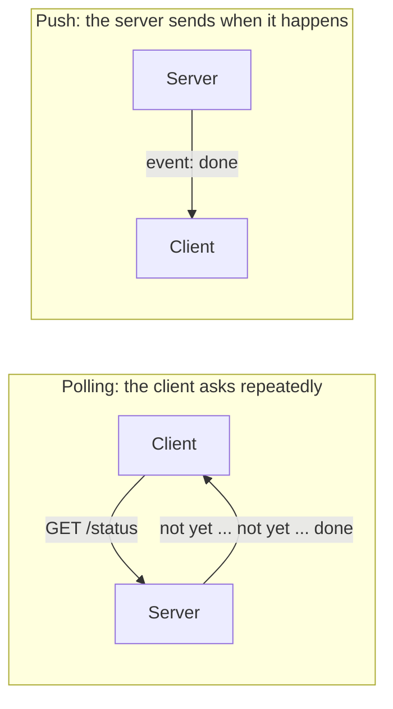
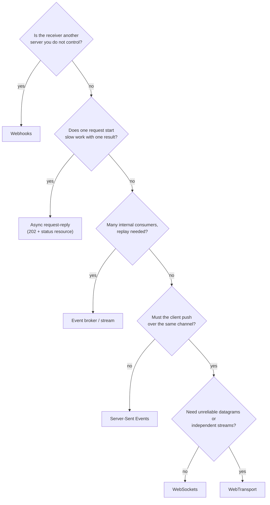
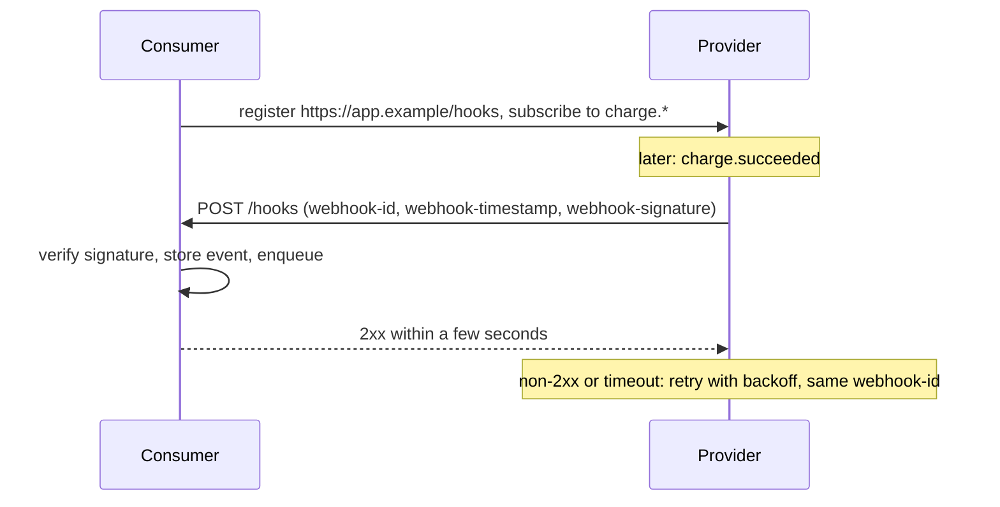
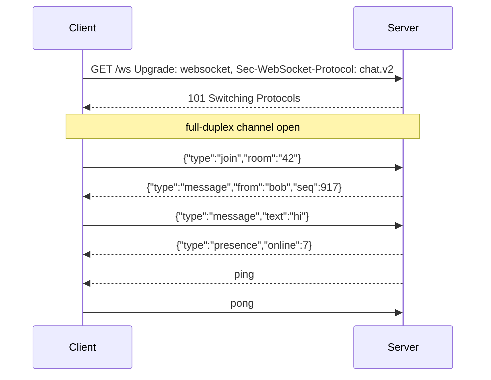
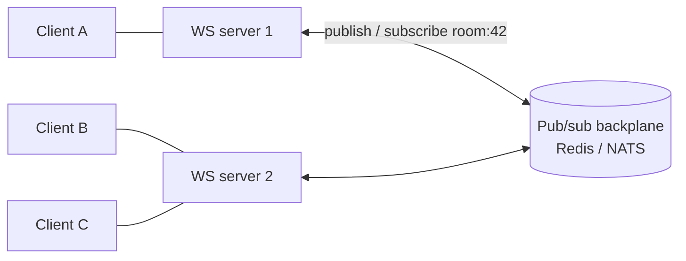
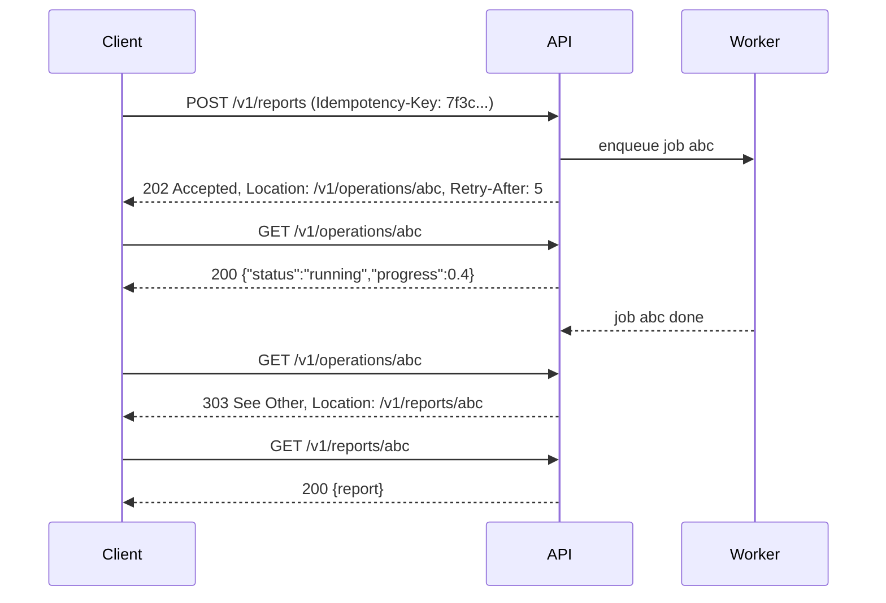
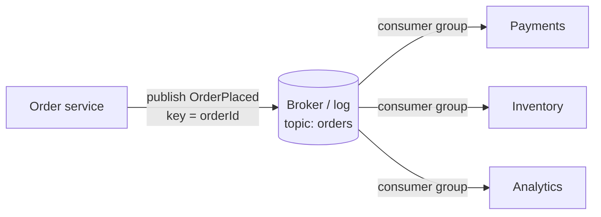
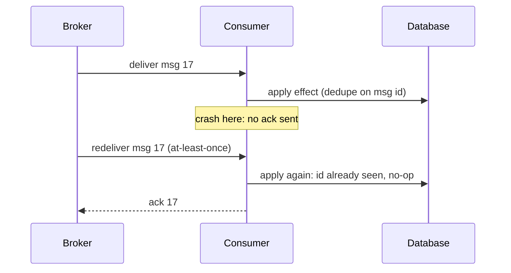
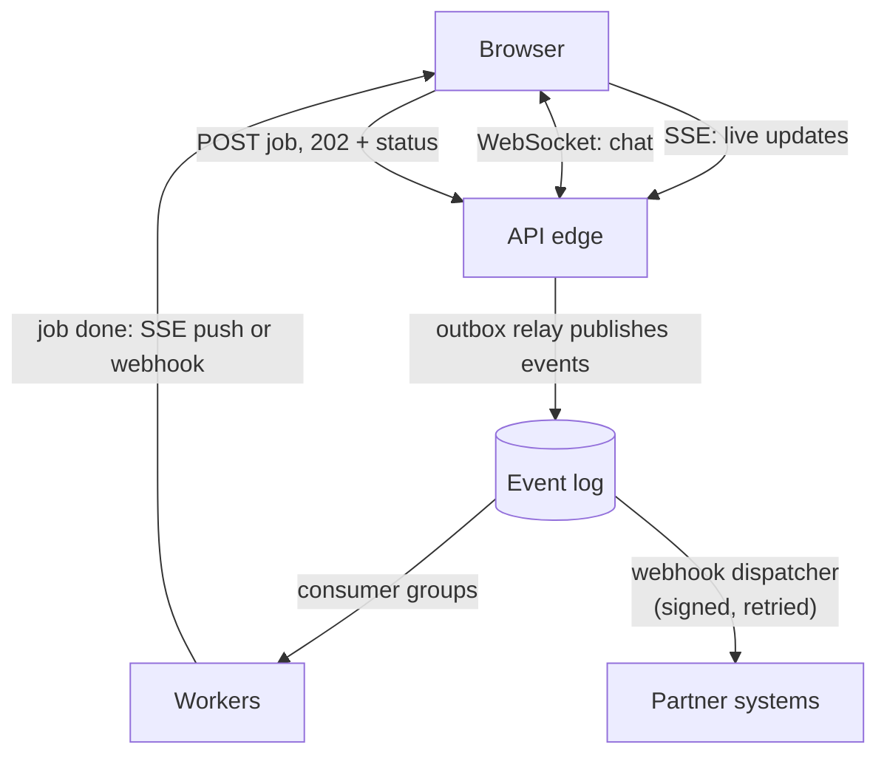

[API Design](./) &raquo; Async &amp; Event-Driven APIs

A request-response API answers a question and hangs up. Many integrations need the opposite: the server learns something (a payment cleared, a build finished, a price moved) and needs to tell the client **when it happens**, not when the client next asks. This page covers the asynchronous API styles that do this: **long polling**, **webhooks**, **Server-Sent Events**, **WebSockets**, **WebTransport**, the **async request-reply** pattern for slow operations, and **event/streaming APIs** over brokers. It then covers the contracts that describe them (**CloudEvents**, **AsyncAPI**) and the delivery semantics (at-least-once, idempotency, ordering, acknowledgement) that decide whether an async API is correct.

## Table of contents
{: .no_toc .text-delta }

1. TOC
{:toc}

---

## Why Asynchronous APIs

Request-response assumes the answer exists when the question is asked. Two common situations break that assumption:

1. **The server is the source of the event.** "Your order shipped" happens on the server's schedule. The client cannot ask about something it does not know exists yet.
2. **The work is too slow to wait for.** A video transcode or a large report can take minutes. Holding an HTTP request open that long ties up a socket, hits proxy idle timeouts, and blocks the client.

The simplest workaround is **polling**: the client asks "is it done yet?" on a timer. It works, but most polls return nothing, and on average the client learns of an event half a poll interval after it happens. Every style on this page avoids that waste by letting the server send first.



### The landscape

The styles differ mainly in **direction** and in **who holds the connection**:

| Style | Direction | Who holds the connection | Resume after a disconnect | Typical use |
|-------|-----------|--------------------------|---------------------------|-------------|
| Long polling | server to client | client (re-opens after each event) | client-held cursor | fallback when nothing better works |
| Webhooks | server to server | none; provider calls the consumer | provider retries | third-party callbacks (payments, CI, SaaS) |
| Server-Sent Events | server to client | client (one long `GET`) | built in (`Last-Event-ID`) | browser feeds, notifications, LLM token streams |
| WebSockets | bidirectional | client opens, both use | application-defined | chat, collaborative editing, games |
| WebTransport | bidirectional, multi-stream, datagrams | client opens (HTTP/3) | application-defined | low-latency media, games, telemetry |
| Async request-reply | request now, result later | mixed | status resource | slow jobs behind an HTTP API |
| Event/streaming APIs | producer to many consumers | broker | consumer offsets | internal fan-out, data pipelines |

A quick way to choose:



Long polling is missing from the chart on purpose. It is the fallback when none of the push transports work in a given client or network.

## Long Polling

**Long polling** needs nothing beyond ordinary HTTP, which is why it is still the universal fallback. The client sends a normal `GET`. Instead of answering "nothing new" right away, the server **holds the request open** until an event arrives or a timeout expires. Once it gets a response, the client immediately sends the next request.

```mermaid
sequenceDiagram
    participant C as Client
    participant S as Server
    C->>S: GET /events?after=42
    Note over S: hold open; no events yet
    Note over S: event 43 occurs
    S-->>C: 200 [event 43]
    C->>S: GET /events?after=43 (re-poll at once)
    Note over S: hold until timeout (about 30 s)
    S-->>C: 204 No Content
    C->>S: GET /events?after=43
```

Two mechanics make it correct:

- **A cursor.** The client sends the ID of the last event it saw (`after=43`), so events that occur between one response and the next request are not lost.
- **A bounded hold.** The server returns `204` (or an empty list) before typical proxy and load-balancer idle timeouts, commonly 20–30 s, and the client re-polls.

The cost is one request always in flight per client, plus a new request after every event. That scales worse than a single persistent stream. Libraries such as Socket.IO use long polling as the transport of last resort when WebSockets are blocked.

## Webhooks

A **webhook** reverses the usual roles: the **provider sends an HTTP `POST` to a URL the consumer registered**. Stripe calls your endpoint when a charge succeeds, and GitHub calls your CI when a push lands. The consumer runs a small HTTP server to receive these callbacks. Webhooks are the main server-to-server async style because they use plain HTTP and need no persistent connection.



### Standard Webhooks

Most providers used to invent their own header names and signing schemes. The **[Standard Webhooks](https://www.standardwebhooks.com/)** specification defines a common scheme, and providers such as OpenAI, Anthropic, Kong, Supabase and Svix have adopted it. Every delivery carries three headers:

| Header | Content | Purpose |
|--------|---------|---------|
| `webhook-id` | Unique event ID, the same on every retry | Deduplication key |
| `webhook-timestamp` | Unix seconds of this delivery attempt | Replay protection |
| `webhook-signature` | `v1,<base64 HMAC-SHA256>` (a list, separated by spaces, to allow key rotation) | Authenticity |

The signature is computed over `"{id}.{timestamp}.{raw body}"`, so an attacker cannot reuse a captured body with a new timestamp. Official verification libraries exist for Python, JavaScript, Go and other languages. Use them instead of writing your own.

### Building a correct receiver

A receiver has to deal with five facts about webhook delivery:

1. **Anyone can `POST` to a public URL.** Recompute the HMAC over the **raw, unparsed** body and compare in constant time. Re-serialized JSON will not match byte for byte.
2. **Captured requests can be replayed.** Reject deliveries whose timestamp is more than a few minutes old. Standard Webhooks libraries use a 5-minute tolerance.
3. **Providers time out quickly.** Store the event and return `2xx` right away, then process it from a queue. Running business logic inline turns a slow database into duplicate deliveries.
4. **Delivery is at-least-once.** A lost acknowledgement causes a retry with the same ID. Record IDs atomically, for example with a unique constraint, so the same event is never processed twice (see [Idempotency](#idempotency-in-practice)).
5. **Order is not guaranteed.** Retries and parallel delivery reorder events. Compare a version or timestamp with the state you already have, or treat the event as a notification and re-fetch the current resource.

```python
import base64, hashlib, hmac, time
from flask import Flask, request

app = Flask(__name__)
TOLERANCE = 5 * 60  # seconds

def verify(secret: bytes, msg_id: str, ts: str, body: bytes, sig_header: str) -> bool:
    if abs(time.time() - int(ts)) > TOLERANCE:          # replay protection
        return False
    signed = f"{msg_id}.{ts}.".encode() + body          # id.timestamp.body
    expected = base64.b64encode(hmac.new(secret, signed, hashlib.sha256).digest()).decode()
    # header may hold several "v1,<sig>" entries during key rotation
    return any(hmac.compare_digest(expected, s.split(",", 1)[1])
               for s in sig_header.split() if s.startswith("v1,"))

@app.post("/hooks/payments")
def receive():
    raw = request.get_data()                             # RAW bytes, not parsed JSON
    h = request.headers
    if not verify(SECRET, h["webhook-id"], h["webhook-timestamp"], raw, h["webhook-signature"]):
        return "", 401
    # INSERT ... ON CONFLICT DO NOTHING on webhook-id, in the same transaction
    # as the enqueue: a retry of an already-stored event becomes a no-op.
    store_and_enqueue_once(h["webhook-id"], raw)
    return "", 204                                       # ack fast
```

### Payload design: fat or thin events

| Style | Payload | Pros | Cons |
|-------|---------|------|------|
| **Fat** (event-carried state) | Full resource snapshot | Consumer needs no callback | Snapshot can be stale when it arrives; larger surface of sensitive data |
| **Thin** (notification) | Type plus resource ID | Consumer always fetches current state; small, safe to log | Extra API call per event; consumer needs read access |

Thin events avoid most of the ordering problem, because the consumer re-reads the latest state no matter what order notifications arrive in. Stripe's newer v2 "thin events" work this way.

### Operating webhooks

- **Retries and dead-lettering.** Providers retry with exponential backoff, typically for hours or days, and then mark the endpoint failed and show undelivered events for manual replay. A provider should cap retries and disable endpoints that keep failing.
- **Provider-side SSRF.** Delivering to URLs that users supply lets an attacker aim your delivery workers at internal addresses. Resolve the URL and block private and link-local ranges, or send from an isolated egress proxy.
- **Local development.** A laptop behind NAT cannot receive deliveries. Use a tunnel (ngrok, Cloudflare Tunnel) or a provider CLI that forwards events (`stripe listen`).
- **Bursts.** A bulk operation can emit thousands of events at once. Put a queue in front of the receiver and rate-limit on the provider side.

**WebSub** (a W3C Recommendation, formerly PubSubHubbub) standardizes a hub-based variant: subscribers register callbacks with a *hub*, publishers notify the hub, and the hub delivers to subscribers. It is used mainly for content feeds.

## Server-Sent Events (SSE)

**Server-Sent Events** is a **one-way, server-to-client** stream carried in one long-lived HTTP response. It is defined in the WHATWG HTML Living Standard. The client sends a `GET` with `Accept: text/event-stream`, and the server keeps the response open and writes events in a simple text format. Browsers expose this as the `EventSource` API, which **reconnects automatically** and tells the server where it left off.

```
GET /stream HTTP/1.1
Accept: text/event-stream

HTTP/1.1 200 OK
Content-Type: text/event-stream
Cache-Control: no-cache

retry: 5000

: heartbeat comment, ignored by the client

event: price
id: 101
data: {"symbol": "ACME", "px": 42.10}

event: price
id: 102
data: {"symbol": "ACME", "px": 42.15}

```

Each event is a set of `field: value` lines followed by a blank line:

| Field | Meaning |
|-------|---------|
| `data` | Payload. Repeat the field for multi-line data; lines are joined with `\n`. |
| `event` | Event type. The client listens for it with `addEventListener(type, ...)`; the default type is `message`. |
| `id` | Cursor. After a reconnect the browser sends it back as the `Last-Event-ID` request header. |
| `retry` | Reconnect delay in milliseconds. |
| `:` (comment) | Ignored. Useful as a heartbeat that keeps proxies from closing an idle connection. |

Resumption works only if the server can serve events after a given ID. It needs a replay buffer or a log to read from. The protocol carries the cursor, but the server has to keep the history.

```javascript
const es = new EventSource("/stream", { withCredentials: true });
es.addEventListener("price", (e) => render(JSON.parse(e.data)));
es.onerror = () => { /* the browser reconnects and sends Last-Event-ID */ };
```

```python
# Flask producer: resume from Last-Event-ID if present
@app.get("/stream")
def stream():
    after = request.headers.get("Last-Event-ID")
    def gen():
        for ev in prices_since(after):          # replay, then block for new events
            yield f"event: price\nid: {ev.id}\ndata: {json.dumps(ev.data)}\n\n"
    return Response(gen(), mimetype="text/event-stream",
                    headers={"X-Accel-Buffering": "no"})   # stop nginx buffering
```

**Strengths.** SSE is plain HTTP, with no protocol upgrade. It works through proxies, multiplexes over HTTP/2 and HTTP/3, reconnects on its own, and has a native browser API. It is the right default for one-way live data: notifications, progress, dashboards, log tails, and streaming LLM output. Most model-provider APIs stream tokens as SSE.

**Limits.**

- **One direction only.** The client sends data with ordinary requests.
- **UTF-8 text only.** Binary data has to be base64-encoded.
- **`EventSource` cannot set request headers**, so `Authorization: Bearer` is not possible. Use cookies, or read the stream with `fetch()` and a `ReadableStream` parser. Non-browser clients and LLM SDKs usually do the latter.
- **Connection limit on HTTP/1.1.** Browsers allow about 6 connections per origin, so several open tabs can use them all. HTTP/2 and HTTP/3 remove the limit.
- **Buffering.** Reverse proxies and compression middleware that buffer the response stop events from arriving. Disable buffering on the stream route.

## WebSockets

When both sides need to send at low latency (chat, collaborative editing, multiplayer games, trading), **WebSockets** ([RFC 6455](https://www.rfc-editor.org/rfc/rfc6455)) provide a persistent, full-duplex, message-based channel.

A WebSocket starts as an HTTP/1.1 request with `Upgrade: websocket`. The server answers `101 Switching Protocols`, and from then on the TCP connection carries WebSocket frames instead of HTTP. Either side can send a message at any time, and messages are not paired as requests and responses. [RFC 8441](https://www.rfc-editor.org/rfc/rfc8441) (HTTP/2) and [RFC 9220](https://www.rfc-editor.org/rfc/rfc9220) (HTTP/3) add an *extended CONNECT* bootstrap, so a WebSocket can run as one stream of a multiplexed connection instead of taking a TCP connection of its own.



```javascript
const ws = new WebSocket("wss://example.com/ws", ["chat.v2"]);
ws.onopen    = () => ws.send(JSON.stringify({ type: "join", room: "42", lastSeq: 916 }));
ws.onmessage = (e) => handle(JSON.parse(e.data));
ws.onclose   = () => scheduleReconnectWithBackoff();   // reconnect is your job
```

Frames carry text or binary data. Sub-protocols are negotiated with `Sec-WebSocket-Protocol`, and ping/pong control frames check that the connection is still alive. **You have to design:**

- **Your own message protocol.** WebSocket is a framing layer only. Define message types, request IDs for correlation, and a version.
- **Reconnect and resume.** There is no `Last-Event-ID` equivalent. Clients send the last sequence number they processed, and the server replays from that point.
- **Authentication.** The browser `WebSocket` constructor cannot set an `Authorization` header. Use a cookie, a short-lived ticket in the URL or the first message, and **always check the `Origin` header**. Without that check, cross-site WebSocket hijacking can ride on the user's cookies.
- **Horizontal scale.** Each connection is pinned to one server instance. To broadcast to a room whose members are on different instances, you need a pub/sub backplane (Redis, NATS, Kafka). Rolling deploys drop connections, so clients must reconnect smoothly.



## WebTransport

**WebTransport** is a W3C browser API over **HTTP/3 (QUIC)**. It gives a client multiple independent **reliable streams** plus **unreliable datagrams** on one connection. Streams do not block each other when a packet is lost, unlike the single ordered stream of a WebSocket. Datagrams suit data where a late packet is useless anyway, such as game state, cursor positions and live media. Chromium and Firefox have shipped it for years, and **Safari 26.4 (March 2026)** made it Baseline in all major browsers.

```javascript
const wt = new WebTransport("https://example.com:4433/game");
await wt.ready;
const writer = wt.datagrams.writable.getWriter();
writer.write(encodeState(player));                       // unreliable, unordered
const stream = await wt.createBidirectionalStream();     // reliable, ordered
```

It needs an HTTP/3-capable server and UDP that is not blocked on the path, so production deployments usually keep a WebSocket fallback. Choose it when head-of-line blocking or the lack of datagrams actually hurts. For typical chat or notifications, WebSockets or SSE are simpler.

### Choosing a browser transport

| | SSE | WebSockets | WebTransport |
|---|---|---|---|
| Direction | server to client | bidirectional | bidirectional |
| Underlying protocol | HTTP/1.1, /2, /3 response | HTTP/1.1 upgrade (or extended CONNECT on /2, /3) | HTTP/3 over QUIC |
| Payload | UTF-8 text | text or binary messages | byte streams and datagrams |
| Multiple independent streams | one per request | no (one ordered stream) | yes |
| Unreliable delivery | no | no | yes (datagrams) |
| Automatic reconnect and resume | yes | no | no |
| Custom auth headers from the browser | no (`EventSource`) | no | no; uses a URL and cookies |
| Proxy and firewall friendliness | highest | good; some proxies break upgrades | UDP is sometimes blocked |
| Best for | feeds, notifications, token streaming | chat, collaboration, games | real-time media, fast-paced games |

Use the simplest transport that fits. Notifications, progress updates and streamed AI responses only flow one way, and apps often use WebSockets for them when SSE would do.

## Async Request-Reply

Sometimes a client wants the result of one specific request, but the work is too slow to wait for. The **async request-reply** pattern (also called the *status-monitor* or *long-running operation* pattern) keeps a normal HTTP interface and does the work in the background:

1. The client `POST`s the request. The server validates it, starts the job, and returns **`202 Accepted`** with a `Location` header that points to a **status resource**.
2. The client polls the status resource, honoring `Retry-After`. While the job runs, the resource returns `200 {"status":"running"}`. When the job finishes, it returns the result or a `303 See Other` to the created resource.
3. Optionally, the client registers a callback (webhook) or subscribes to an SSE stream, so it does not have to poll.



```http
POST /v1/reports HTTP/1.1
Content-Type: application/json
Idempotency-Key: 7f3c2a8e-5a0b-4d6c-9b1e-2f4d8c6a1e90

{ "type": "monthly-revenue", "month": "2026-08" }

HTTP/1.1 202 Accepted
Location: /v1/operations/abc123
Retry-After: 5
```

The `202`-plus-status-resource contract does not depend on how the client learns about completion. It can poll, long-poll, subscribe to SSE, or register a webhook. Google's API design guidance ([AIP-151](https://google.aip.dev/151)) standardizes the same idea as an `Operation` resource with `done`, `metadata`, and either `response` or `error`. Status resources should also support cancellation (`POST /operations/abc:cancel` or `DELETE`) and expire after a documented retention period.

The client may resend the initial `POST` if it never received the `202`. Accept an `Idempotency-Key` header so that a resent request returns the **existing** operation and does not start a duplicate (see [REST idempotency](rest.html#idempotency-keys)).

## Event and Streaming APIs

The styles above connect one provider to one consumer. At higher volume and fan-out, async APIs sit on a **message broker**: producers publish to named channels, and any number of consumers subscribe. The API contract becomes "channels and message schemas" instead of "endpoints and verbs."



Two broker models give different semantics:

| | Message queue | Log-structured stream |
|---|---|---|
| Examples | RabbitMQ, Amazon SQS, Kafka share groups | Apache Kafka, Amazon Kinesis, Apache Pulsar, Redpanda |
| A message is | a task, removed once acknowledged | an immutable, ordered fact kept for the retention period |
| Consumers | compete; each message goes to one of them | each group tracks its own offset; every group sees every message |
| Replay | no (unless dead-lettered) | yes, by rewinding the offset |
| Ordering | usually per queue, weakened by redelivery | per partition |
| Good for | work distribution | event streaming, many independent subscribers, rebuilding state |

The two models are converging. **Apache Kafka 4.0** (March 2025) removed ZooKeeper and runs only in KRaft mode. **Kafka 4.2** (February 2026) made **share groups** ([KIP-932](https://cwiki.apache.org/confluence/display/KAFKA/KIP-932%3A+Queues+for+Kafka), "Queues for Kafka") production-ready. Share groups let consumers compete for records without partition assignment, with per-record acknowledgement and delivery-attempt counting, so one Kafka topic can serve both models.

Streaming APIs can also be **exposed to external clients** directly: market-data feeds, change-data-capture endpoints, and model-inference token streams. They are usually carried over SSE, chunked HTTP, WebSockets, or a gRPC server-streaming call. What makes them streams is that the response has no end. The client keeps consuming until it disconnects.

> This page treats async APIs as a **contract surface**. For the architecture behind them (partitions and offsets, choreography vs orchestration, sagas, the transactional outbox, event sourcing and CQRS) see [Microservices & Event-Driven Architecture](../distributed-systems/microservices-and-event-driven.html).

## Describing Events: CloudEvents

Every team tends to invent its own event envelope, with different names for the ID, type and timestamp. **[CloudEvents](https://cloudevents.io/)** (a CNCF project, graduated in January 2024) standardizes that envelope so that routers, SDKs and tooling can handle events from any producer. The payload stays yours. The spec fixes only the metadata:

| Attribute | Required | Meaning |
|-----------|:--------:|---------|
| `specversion` | yes | CloudEvents version, currently `1.0` |
| `id` | yes | Unique per `source`; the deduplication key |
| `source` | yes | URI reference identifying the producer context |
| `type` | yes | Reverse-DNS event type, e.g. `com.example.order.placed` |
| `time`, `subject`, `datacontenttype`, `dataschema` | no | Timestamp, sub-resource, payload media type, schema URI |

```json
{
  "specversion": "1.0",
  "id": "8d5c9e1a-2c3f-4b7e-9f10-6a4e2b1d7c33",
  "source": "/services/orders",
  "type": "com.example.order.placed",
  "subject": "orders/9912",
  "time": "2026-09-22T14:03:11Z",
  "datacontenttype": "application/json",
  "data": { "orderId": "9912", "amountCents": 4599 }
}
```

*Protocol bindings* define how the envelope maps onto HTTP, Kafka, AMQP, MQTT and NATS. In **structured mode** the whole JSON above is the message body. In **binary mode** the attributes travel as headers (`ce-id`, `ce-type`, ...) and the body is the raw `data`. Azure Event Grid, Google Eventarc, Knative Eventing and Argo Events all use CloudEvents natively.

CloudEvents and AsyncAPI are complementary. CloudEvents fixes *the shape of one event*. AsyncAPI documents *the whole API*: which channels exist, what flows on each, and who sends and receives.

## The AsyncAPI Specification

REST APIs have OpenAPI. Event-driven APIs have **[AsyncAPI](https://www.asyncapi.com/)**, a JSON or YAML contract that describes the channels an application sends to and receives from, the message schemas, and protocol-specific **bindings** (Kafka, AMQP, MQTT, NATS, WebSockets, HTTP, and others). It supports the same kinds of tooling as OpenAPI: generated documentation, code generation, validation and mocking.

Version **3.0** (December 2023) was a major redesign. It separated channels from operations, added first-class **request/reply**, and made channels reusable across operations. Version **3.1.0** (early 2026) is a compatible minor release that adds a ROS 2 binding among other changes. Moving a document from 3.0 to 3.1 only requires changing the version string.

| OpenAPI concept | AsyncAPI concept |
|---|---|
| Path (`/orders`) | Channel (with an `address`, e.g. topic `order.placed`) |
| Operation (`GET`, `POST`) | Operation (`action: send` or `receive`) |
| Request/response body | Message (headers + payload schema) |
| Server (base URL) | Server (broker host + protocol) |
| — | Bindings (protocol-specific settings: partition key, QoS, exchange) |

**Perspective matters.** A 3.x document describes operations from the point of view of *the application it documents*. The same channel is `send` in the producer's document and `receive` in the consumer's, and neither describes the broker.

```yaml
asyncapi: 3.1.0
info:
  title: Orders Service
  version: 1.4.0
servers:
  production:
    host: broker.example.com:9092
    protocol: kafka
channels:
  orderPlaced:
    address: order.placed                 # Kafka topic
    messages:
      OrderPlaced:
        $ref: '#/components/messages/OrderPlaced'
operations:
  publishOrderPlaced:
    action: send                          # this application publishes
    channel:
      $ref: '#/channels/orderPlaced'
    bindings:
      kafka:
        key:                              # partition by order for per-order ordering
          type: string
components:
  messages:
    OrderPlaced:
      contentType: application/json
      payload:
        type: object
        required: [orderId, amountCents, placedAt]
        properties:
          orderId:     { type: string }
          amountCents: { type: integer }
          placedAt:    { type: string, format: date-time }
```

The AsyncAPI CLI and Generator produce HTML docs and typed producers and consumers from this document. Schema registries (Confluent, Apicurio) can enforce the payload schemas at runtime. Treat event schemas like any public API: add optional fields freely, never change a field's meaning, and publish a new `type` or channel for a breaking change.

## Delivery Semantics and Idempotency

Every async style retries: a webhook resent after a slow acknowledgement, a Kafka record re-read after a consumer crash, a `POST` resent after a lost `202`. So a consumer is correct only if it knows what the channel guarantees and handles duplicates.

### The three delivery guarantees

| Guarantee | Behavior | Failure mode | Where used |
|-----------|----------|--------------|------------|
| **At-most-once** | Send once; never retry | Messages can be **lost** | Telemetry, presence, metrics where gaps are fine |
| **At-least-once** | Retry until acknowledged | Messages can be **duplicated** | Default for webhooks, SQS, Kafka, almost every broker |
| **Exactly-once** | No loss, no duplicates | Hard; limited scope | Kafka transactions (read-process-write inside Kafka); otherwise simulated |

Exactly-once *delivery* across an unreliable network is not achievable in general. The sender cannot tell a lost message from a lost acknowledgement (the Two Generals problem). What systems actually provide is **exactly-once effects**: at-least-once delivery plus an idempotent consumer. Kafka's exactly-once semantics are real, but they only cover reads and writes within Kafka. As soon as a consumer writes to an external database or calls an API, you need idempotency again.

**Assume at-least-once and make every consumer idempotent.**

### The acknowledgement contract

A consumer acknowledges (acks) a message to tell the broker it has been processed. Whether the ack comes before or after processing sets the guarantee:



- **Ack before processing** gives at-most-once: a crash after the ack loses the message.
- **Ack after processing** gives at-least-once: a crash before the ack causes a redelivery.

Ack after processing, and let the idempotent consumer absorb the duplicates.

### Idempotency in practice

An operation is **idempotent** if applying it twice has the same effect as applying it once. Common techniques:

1. **Deduplication keys.** Use the event's `id` (CloudEvents `id`, `webhook-id`) or a client-supplied `Idempotency-Key`. Record processed keys **in the same transaction as the effect**. If the key is recorded separately, a crash between the two writes lets a duplicate through. Expire keys after the longest realistic retry window.
2. **Naturally idempotent effects.** "Set status to shipped" and upserts keyed by entity ID are idempotent. "Add 10 to balance" is not. Design events as state assertions where you can.
3. **Versioned (conditional) writes.** Apply an event only if it moves the state forward, with `UPDATE ... WHERE version < :v`. This rejects both duplicates and events that arrive out of order.

```python
def handle(event, db):
    with db.transaction():
        inserted = db.execute(
            "INSERT INTO processed_events(id) VALUES (%s) ON CONFLICT DO NOTHING",
            (event["id"],)).rowcount
        if not inserted:
            return                         # duplicate: already applied
        apply_effect(event, db)            # same transaction as the dedupe record
```

On the producer side, the **transactional outbox** solves the matching problem of how to update the database *and* publish the event without losing one of them. The event is written to an outbox table in the same transaction as the state change, and a relay (often change data capture) publishes it afterward.

### Ordering

Brokers order messages within a partition or queue, not globally. If the domain needs per-entity ordering (all events for one account in order), **partition by a stable key** such as the account ID. Where ordering cannot be guaranteed (webhooks, multi-partition consumers, retries), make handlers insensitive to order: include a sequence number or version and ignore anything older than the current state.

## Putting It Together

A real system combines these styles according to direction and audience:



- **SSE** for one-way browser feeds.
- **WebSockets** when the browser has to send back.
- **WebTransport** when you need datagrams or independent streams.
- **Webhooks** (preferably Standard Webhooks) for callbacks to other servers.
- **Long polling** as the compatibility fallback.
- **Async request-reply** for slow work behind an HTTP API.
- **A broker** for internal fan-out.

Describe events with **CloudEvents** and document the API with **AsyncAPI**. Whatever the transport, assume at-least-once delivery, process and then acknowledge, and deduplicate in the same transaction as the effect.

## See Also

- **[API Design Hub](./)** — the synchronous styles this page complements, and concerns every style shares
- **[REST](rest.html)** — `202 Accepted`, `Idempotency-Key`, and the HTTP semantics async request-reply builds on
- **[gRPC & Protocol Buffers](grpc-and-protobuf.html)** — server, client, and bidirectional streaming RPCs as an alternative to WebSockets between services
- **[GraphQL](graphql.html)** — subscriptions over `graphql-ws` and SSE
- **[Microservices & Event-Driven Architecture](../distributed-systems/microservices-and-event-driven.html)** — brokers, partitions and offsets, sagas, the transactional outbox, event sourcing and CQRS
- **[Resilience Patterns](../distributed-systems/resilience-patterns.html)** — retries with backoff and jitter, circuit breakers, and idempotency
- **[Transport & Protocols](../technology/networking/transport-and-protocols.html)** — TCP, QUIC, HTTP/2, and HTTP/3 underneath SSE, WebSockets, and WebTransport

### Further Reading

- [Standard Webhooks specification](https://www.standardwebhooks.com/)
- [HTML Living Standard: Server-sent events](https://html.spec.whatwg.org/multipage/server-sent-events.html)
- [MDN: WebTransport API](https://developer.mozilla.org/en-US/docs/Web/API/WebTransport)
- [CloudEvents specification](https://github.com/cloudevents/spec)
- [AsyncAPI 3.x specification](https://www.asyncapi.com/docs/reference/specification/latest)
