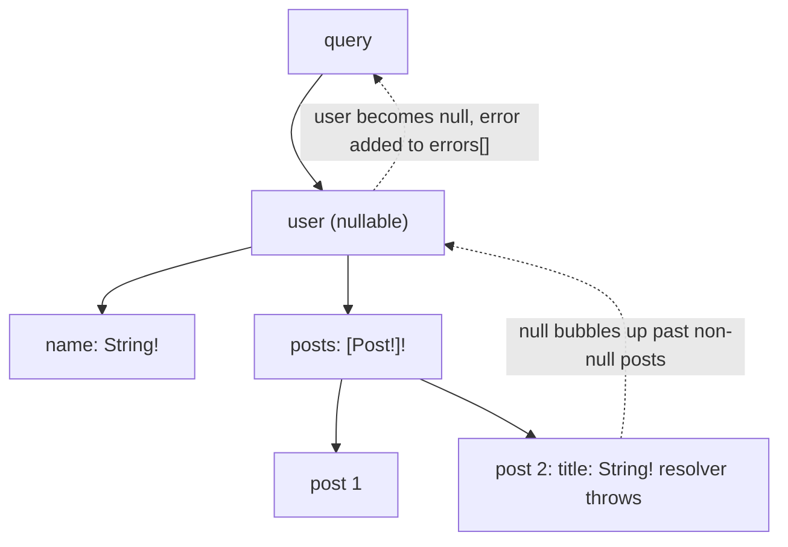
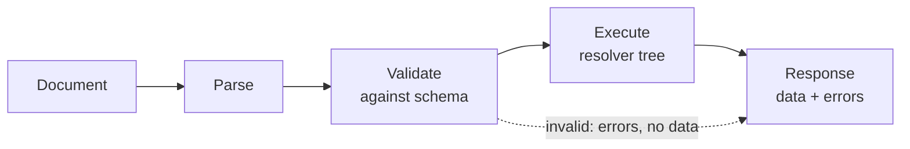
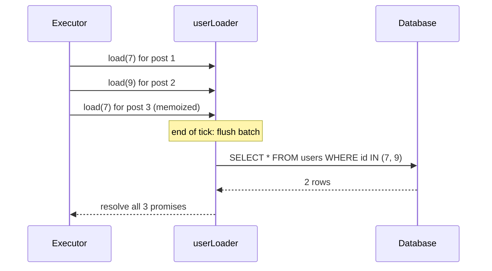
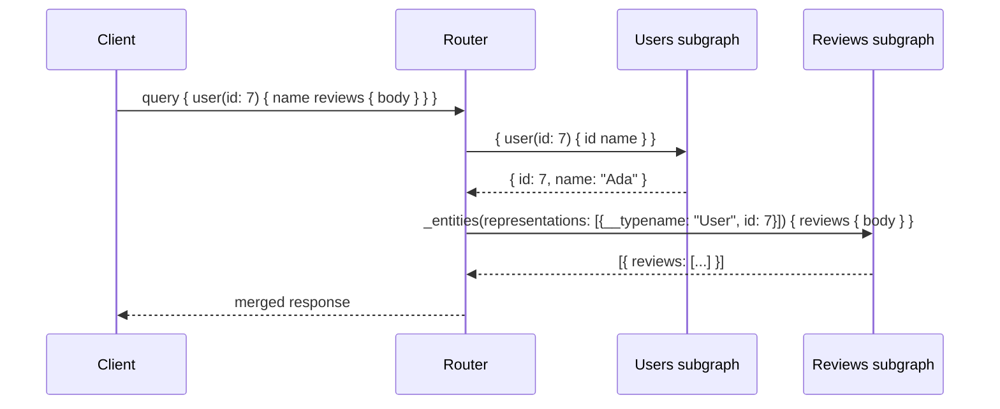
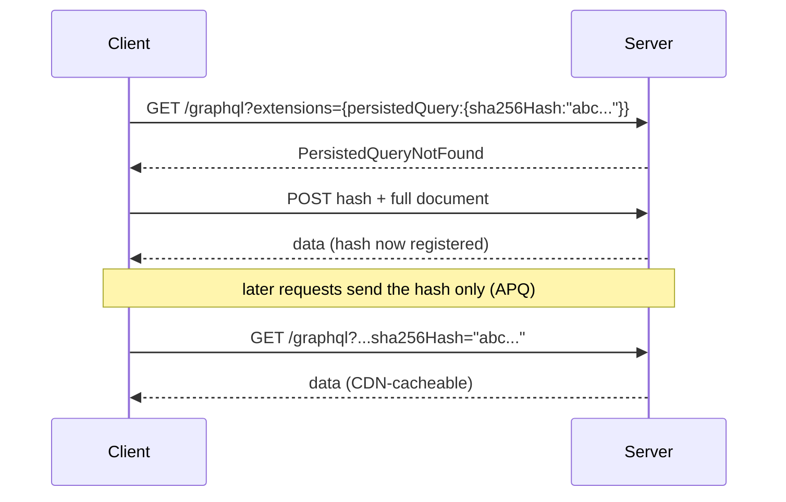

[API Design](./) &raquo; GraphQL

**GraphQL** is a query language for APIs and a runtime for executing those queries. The server publishes one strongly typed **schema** describing every type and field it can return. Clients send documents to a single endpoint and select exactly the fields they need, and the response has the same shape as the query. Over-fetching and under-fetching go away, many round trips collapse into one, and the schema documents itself. The server pays for this: it implements a **resolver** per field, has to defend against the N+1 query explosion that field-by-field execution invites, and gives up the HTTP caching REST gets from URLs. This page covers the type system, the three operation types, execution and resolvers, DataLoader, federation, pagination, caching and trusted documents, the HTTP transport, security, and when GraphQL is worth it.

## Table of contents
{: .no_toc .text-delta }

1. TOC
{:toc}

---

## Overview

GraphQL was built at Facebook in 2012 for mobile clients that needed many related objects in one round trip over slow networks. It was open-sourced in 2015 and moved to the vendor-neutral **GraphQL Foundation** (Linux Foundation) in 2019. The specification is published in dated editions. The **September 2025 edition** was the first new edition since October 2021. It added **OneOf input objects**, **schema coordinates**, descriptions on operations and fragments, and full Unicode support. The reference implementation, **GraphQL.js v17**, was released in June 2026.

The defining properties:

| Property | What it means |
|----------|---------------|
| **One endpoint** | A service exposes one URL (conventionally `/graphql`). The request body says which operation to run; the path and verb do not. |
| **Client-selected shape** | The response contains exactly the requested fields: no over-fetching and no follow-up request for related data. |
| **Strong typing** | Every field has a declared type. A document is **validated against the schema before execution**, so a malformed query fails up front with a precise error. |
| **Introspection** | The schema can be queried at runtime, which powers GraphiQL, code generators and editor autocomplete. |

```graphql
query {
  user(by: { id: "42" }) {
    name
    posts(first: 2) { nodes { title } }
  }
}
```

```json
{
  "data": {
    "user": {
      "name": "Ada Lovelace",
      "posts": {
        "nodes": [
          { "title": "On the Analytical Engine" },
          { "title": "Note G" }
        ]
      }
    }
  }
}
```

## The Type System

The schema is the contract. It is written in the **Schema Definition Language (SDL)** and is the source of truth for server validation, client introspection, and code generation.

### Scalars and object types

There are five built-in scalars: `Int` (32-bit signed), `Float`, `String`, `Boolean`, and `ID` (an opaque identifier serialized as a string). Custom scalars such as `DateTime`, `URL` or `JSON` need server-side serialization and parsing. Use `@specifiedBy(url: ...)` to point at the format they follow.

```graphql
scalar DateTime @specifiedBy(url: "https://www.rfc-editor.org/rfc/rfc3339")

type User {
  id: ID!
  name: String!
  email: String
  role: Role!
  posts(first: Int = 10, after: String): PostConnection!
}

type Post {
  id: ID!
  title: String!
  body: String!
  author: User!
  publishedAt: DateTime
}
```

### Nullability and lists

**Fields are nullable by default.** A trailing `!` marks a field **non-null**. This is the reverse of most programming languages, and it is deliberate: any field backed by a network call can fail, so nullable is the safe default. The position of `!` in a list type matters:

| Type | List can be `null` | Element can be `null` |
|------|:---:|:---:|
| `[Post]`   | yes | yes |
| `[Post!]`  | yes | no  |
| `[Post]!`  | no  | yes |
| `[Post!]!` | no  | no  |

If a resolver fails or returns `null` for a non-null field, the executor records an error and **propagates the null upward** to the nearest nullable ancestor, discarding that whole subtree:



One failing field can erase a large part of the response. Mark fields non-null only when the server can really guarantee them. Fields that depend on other services should stay nullable. The GraphQL Nullability working group is exploring ways for clients to turn off this propagation, but none of that is in a published spec edition yet.

### Enums, interfaces, and unions

```graphql
enum Role { ADMIN EDITOR VIEWER }

interface Node { id: ID! }                  # shared fields

type User implements Node { id: ID!  name: String! }
type Post implements Node { id: ID!  title: String! }

union SearchResult = User | Post | Comment  # one of several types, no shared fields
```

When a field returns an abstract type, the client uses **inline fragments** to select fields specific to each concrete type. The server needs a way to tell which concrete type each value is, for example a `__resolveType` function or an `isTypeOf` check, depending on the library.

```graphql
query {
  search(term: "graph") {
    __typename
    ... on User { name }
    ... on Post { title }
  }
}
```

### Input types and OneOf

Complex arguments use **input types**. Input types are separate from object types: they have no resolvers and can only appear as arguments. The September 2025 spec added **OneOf input objects**. Marked with `@oneOf`, such a type requires **exactly one** field to be set, which expresses "look up by X *or* Y" in the schema itself instead of in resolver checks:

```graphql
input CreatePostInput {
  title: String!
  body: String!
}

input UserBy @oneOf {
  id: ID
  email: String
  username: String
}

type Query {
  user(by: UserBy!): User       # user(by: { email: "ada@example.com" })
}
```

### Root operation types

A schema has up to three root types. They are ordinary object types, and the executor uses them as the entry points for the three kinds of operation. By convention they are named `Query`, `Mutation` and `Subscription`, in which case no explicit `schema { ... }` block is needed.

```graphql
type Query        { user(by: UserBy!): User }
type Mutation     { createPost(input: CreatePostInput!): CreatePostPayload! }
type Subscription { messageAdded(channelId: ID!): Message! }
```

### Schema evolution

GraphQL APIs are usually **versionless**. Because clients choose their fields, adding a field or type breaks no one. Removal is done by deprecation: mark the field `@deprecated(reason: "...")`, measure how much it is still used (field-level usage metrics are the main reason to run a schema registry), and remove it once traffic reaches zero. Breaking changes include removing or renaming a field, making a nullable field non-null in an input, and making a non-null output field nullable. Schema checks in CI (GraphQL Inspector, Apollo GraphOS, Hive) diff the schema against real client operations and fail the build when a change would break one of them.

## Operations: Queries, Mutations, Subscriptions

### Queries

A **query** is a read. Top-level fields may execute **in parallel**, because they are assumed to have no side effects. The main features of the query language:

| Feature | Example | Purpose |
|---------|---------|---------|
| Arguments | `user(by: {id: "42"})` | Parameterize a field |
| Variables | `query GetUser($id: ID!) { ... }` | Keep the document static; values travel separately. Required for caching and trusted documents. |
| Aliases | `me: user(...) { name } boss: user(...) { name }` | Request the same field twice |
| Fragments | `fragment UserCard on User { id name }` | Reusable selection sets, usually colocated with UI components |
| Directives | `@include(if: $x)`, `@skip(if: $x)`, `@deprecated` | Conditional selection; schema metadata |

```graphql
query GetUser($id: ID!, $withPosts: Boolean = false) {
  user(by: { id: $id }) {
    ...UserCard
    posts(first: 5) @include(if: $withPosts) { edges { node { title } } }
  }
}

fragment UserCard on User { id name email }
```

### Mutations

A **mutation** is a write. It differs from a query in one important way: **top-level mutation fields run serially, in the order written**, so `createUser` followed by `addToTeam` cannot race. Nested fields still resolve normally.

The common convention is **one input type in, one payload type out**. The payload returns the changed objects, so the client cache can update without another request, and it models expected, recoverable failures as data:

```graphql
type Mutation {
  createPost(input: CreatePostInput!): CreatePostPayload!
}

type CreatePostPayload {
  post: Post
  userErrors: [UserError!]!     # "title already used", "body too long"
}

type UserError {
  field: [String!]
  message: String!
  code: UserErrorCode!
}
```

Another option is a **result union** (`union CreatePostResult = CreatePostSuccess | TitleTaken | Forbidden`), which makes clients handle each case explicitly. Either way, keep the top-level `errors` array for *unexpected* failures such as bugs, timeouts and authorization faults, and model *expected* domain outcomes in the schema.

### Subscriptions

A **subscription** is a long-lived operation. The server pushes a new result each time an event occurs. It needs a streaming transport:

| Transport | Protocol | Notes |
|-----------|----------|-------|
| WebSocket | `graphql-transport-ws` (the `graphql-ws` library) | The current standard. The older `subscriptions-transport-ws` protocol is unmaintained and should be migrated away from. |
| Server-Sent Events | `graphql-sse` or GraphQL over SSE | Simpler; works over plain HTTP/2 through proxies |
| Multipart HTTP | `multipart/mixed` | Used by Apollo Router and by incremental delivery |

```graphql
type Subscription {
  messageAdded(channelId: ID!): Message!
}
```

The subscription resolver returns an **async iterator**. The server publishes events to a pub/sub backend (in memory for one node, Redis, NATS or Kafka for more), and each subscriber's iterator yields the events that match its arguments. Subscriptions are expensive to run. You have to manage connection state, backpressure, **authorization on every pushed event** (the user's permissions may have changed since they subscribed), and fan-out across instances. Use them only when you need server push. Often polling a query, or a plain SSE feed, is enough. See [Async & Event-Driven APIs](async-and-events.html) for the transport tradeoffs.

### Incremental delivery: `@defer` and `@stream`

`@defer` lets the server return the fast part of a response right away and send slow fragments later. `@stream` delivers list items as they resolve. The server sends one initial payload followed by incremental payloads that are patched into it:

```graphql
query {
  product(id: "p1") {
    name price
    ... @defer(label: "reviews") { reviews(first: 20) { body rating } }
  }
}
```

**Status as of late 2026.** Incremental delivery is a **draft RFC**. It is *not* in the September 2025 spec edition. GraphQL.js v17 implements it experimentally through a separate `experimentalExecuteIncrementally()` entry point, and Apollo Client, Apollo Router, Relay and several other servers support it. The response format has changed during the RFC process, so pin client and server versions that agree.

## Execution and Resolvers

A **resolver** is a function attached to one field that produces the field's value. Execution walks the selection tree. The executor calls the resolver for each requested field, passes its result as the `parent` to the resolvers of the field's sub-selections, and assembles the response from the results.



Every resolver takes `(parent, args, context, info)`:

| Argument | Contents |
|----------|----------|
| `parent` | The value the parent field's resolver returned |
| `args` | The field's arguments, already coerced to their declared types |
| `context` | A per-request object shared by every resolver: authenticated user, data sources, DataLoaders |
| `info` | The field's AST and path; used for lookahead and projection |

```javascript
const resolvers = {
  Query: {
    user: (_parent, { by }, ctx) =>
      by.id ? ctx.db.users.byId(by.id) : ctx.db.users.byEmail(by.email),
  },
  User: {
    posts: (user, args, ctx) => ctx.db.posts.byAuthor(user.id, args),
  },
  Post: {
    author: (post, _args, ctx) => ctx.db.users.byId(post.authorId),  // N+1 hazard
  },
};
```

Fields without an explicit resolver use the **default resolver**, which returns `parent[fieldName]`. You write resolvers only for fields that compute, fetch or transform something.

### The N+1 problem

Field-by-field resolution makes GraphQL flexible, and it also creates a performance trap:

```graphql
query {
  posts(first: 10) {           # 1 query: fetch 10 posts
    nodes {
      title
      author { name }          # Post.author runs once per post: 10 more queries
    }
  }
}
```

A list of *N* items, each resolving a related entity, costs **1 + N** round trips. Each extra level of nesting multiplies it. The client's query looks harmless, and the cost is hidden in the resolver tree. Eagerly joining everything in the top-level resolver over-fetches on every request, which defeats the reason for using GraphQL.

## DataLoader: Batching and Caching per Request

The standard fix is the **DataLoader** pattern: a small library, originally from Facebook, now available in most languages. It does two things:

1. **Batching.** `load(key)` does not fetch right away. It records the key and returns a promise. After the current tick, once every sibling resolver has called `load`, DataLoader calls your **batch function once** with all the collected keys.
2. **Memoization.** Within one request, loading the same key again returns the same promise, so an author referenced by ten posts is fetched once.



```javascript
import DataLoader from "dataloader";

export function createLoaders(db) {          // call once PER REQUEST
  return {
    user: new DataLoader(async (ids) => {
      const rows = await db.users.byIds(ids);          // one batched query
      const byId = new Map(rows.map((u) => [u.id, u]));
      return ids.map((id) => byId.get(id) ?? null);    // same length and order as ids
    }),
  };
}

const resolvers = {
  Post: {
    author: (post, _args, ctx) => ctx.loaders.user.load(post.authorId),
  },
};
```

A batch function has two rules. It **must return results in the same order and number as the input keys**, because DataLoader matches them by position. And you must **create fresh loaders for every request**, so memoized values never leak between users or go stale over the life of the process.

DataLoader reduces N+1 to one batched query per nesting level. Related techniques:

- **Lookahead and projection.** Inspect `info` to fetch only the columns and joins the selection needs. Tools that compile GraphQL to SQL, such as Hasura, PostGraphile and Grafast, build one query from the whole document.
- **Caching behind loaders.** Point the batch function at Redis for hot, read-mostly entities.
- **Cost limits.** See [Security](#security).

## Schema Federation and Composite Schemas {#schema-federation}

Once many teams contribute to one schema, a monolithic GraphQL server becomes an organizational bottleneck. **Federation** lets independent services each own part of the graph. A **router** (gateway) composes the parts into one *supergraph* that clients query as if it were a single schema.

**Apollo Federation 2** is the most widely used implementation. Each **subgraph** is an ordinary GraphQL service that imports federation directives with `@link`:

| Directive | Meaning |
|-----------|---------|
| `@key(fields: "id")` | Declares an **entity**: a type identified by these fields that other subgraphs can reference and extend |
| `@shareable` | Several subgraphs may resolve this field |
| `@external`, `@requires`, `@provides` | Fields owned elsewhere, and data dependencies between subgraphs |
| `@override(from: "...")` | Move a field's ownership between subgraphs gradually |

```graphql
# users subgraph: owns User
extend schema @link(url: "https://specs.apollo.dev/federation/v2.9", import: ["@key"])

type User @key(fields: "id") {
  id: ID!
  name: String!
}
```

```graphql
# reviews subgraph: contributes User.reviews
extend schema @link(url: "https://specs.apollo.dev/federation/v2.9", import: ["@key"])

type User @key(fields: "id") {
  id: ID!
  reviews: [Review!]!
}

type Review { id: ID!  body: String!  author: User! }
```

The router builds a **query plan**. It splits the incoming operation into fetches for each subgraph, calls the subgraphs (with parallel fetches where possible), resolves entity references through each subgraph's `_entities` field, and merges the results:



**The ecosystem in 2026.** Apollo's runtime is the Rust **Apollo Router**; the older JavaScript `@apollo/gateway` is legacy. Alternatives include WunderGraph Cosmo, The Guild's Hive Gateway, Grafbase, and ChilliCream Fusion. The GraphQL Foundation's **Composite Schemas** working group is writing a vendor-neutral specification for the same problem, using directives such as `@lookup` in place of `_entities`. It is still a draft.

Federation does for a schema what microservices do for a codebase. Teams deploy their part of the graph independently while clients see one coherent schema. It has real costs: a router to run, query-planning overhead, composition checks in CI, and entity fetches between subgraphs that reintroduce N+1 at the router if a subgraph's reference resolver does not batch. The older **schema stitching** approach puts hand-written delegation in the gateway. Federation moves ownership into the subgraphs and is generally the better choice for new systems.

## Pagination

Returning a whole list (`posts: [Post!]!`) does not scale. There are two strategies:

| | Offset (`limit`, `offset`) | Cursor (`first`, `after`) |
|---|---|---|
| Jump to page *n* | yes | no, only sequential |
| Stable when rows are inserted or deleted | no: items get skipped or duplicated | yes: anchored to a value |
| Cost deep into the list | `OFFSET 100000` scans and discards 100k rows | index seek (`WHERE (published_at, id) < (?, ?)`) |

### The Relay connections specification

Relay standardized cursor pagination as **Connections**, and most GraphQL APIs now follow it. A connection wraps a list in **edges**, each pairing a node with its cursor, plus **pageInfo**:

```graphql
type Query {
  posts(first: Int, after: String, last: Int, before: String): PostConnection!
}

type PostConnection {
  edges: [PostEdge!]!
  nodes: [Post!]!          # common shortcut when per-edge cursors are not needed
  pageInfo: PageInfo!
  totalCount: Int          # optional; often expensive
}

type PostEdge {
  node: Post!
  cursor: String!          # opaque, e.g. base64 of (publishedAt, id)
}

type PageInfo {
  hasNextPage: Boolean!
  hasPreviousPage: Boolean!
  startCursor: String
  endCursor: String
}
```

The client requests `posts(first: 20, after: $endCursor)` and keeps feeding back `pageInfo.endCursor` until `hasNextPage` is false. Cursors must stay **opaque** to clients, so the server can change the encoding later. Relay's companion convention, **global object identification** (a `Node` interface plus `node(id: ID!)` on `Query`), lets a client refetch any object by its globally unique ID. Normalized caches and federation both rely on it.

## Caching and Trusted Documents

### Why HTTP caching is not free

REST gets caching almost for free, because `GET /users/42` is a stable URL that browsers, CDNs and reverse proxies can key on. A GraphQL operation sent as a `POST` to one URL looks to those caches like one opaque endpoint. GraphQL caching therefore happens in three other places.

### Client-side normalized caches

Apollo Client, Relay, urql (Graphcache) and similar clients keep a **normalized cache**. Each object with a stable identity (`__typename` plus `id`) is stored **once**, and query results hold references to it:

- Two queries that both return `User:42` share one cache entry. Update it once and every view that shows it updates.
- A mutation that returns the changed object updates the cache without a refetch. This is why mutation payloads return the objects they changed.

### Server-side and CDN caching

- **Field or entity caching** behind DataLoaders (Redis).
- **Response caching with cache hints.** Server-specific directives or plugins, such as Apollo's `@cacheControl(maxAge:, scope:)` or GraphQL Yoga's response cache, compute a `Cache-Control` for the whole response from its fields. This only works well for responses that do not vary by user.
- **`GET` for queries.** The GraphQL-over-HTTP draft allows queries (never mutations) to be sent as `GET` with URL parameters. Combined with persisted documents, that makes them cacheable at a CDN again.

### Persisted queries and trusted documents

Operation documents are large and repetitive. **Persisted queries** replace the document with its **hash**, which gives two different features:

| | Automatic persisted queries (APQ) | Trusted documents (persisted-operation allow-list) |
|---|---|---|
| How documents get registered | At runtime: on a cache miss, the client resends the full document once | At build time: client code generation extracts every operation and uploads it to the server or registry |
| Can arbitrary operations run? | Yes | **No.** Only registered hashes execute. |
| Main benefit | Smaller requests, CDN-cacheable `GET`s | **Security**, plus smaller requests and caching |
| Suited to | Public APIs used by third parties | First-party clients (your web and mobile apps) |



For an API that only your own apps call, **trusted documents are the strongest single GraphQL hardening measure**. Attackers can no longer send arbitrary deep, aliased or batched operations, because anything the server has not seen before is rejected.

## GraphQL over HTTP

For years every server made up its own HTTP conventions. The **GraphQL over HTTP** specification (a GraphQL Foundation draft, widely implemented already) standardizes them:

- **Request.** `POST` with `Content-Type: application/json` and a body of `{"query", "variables", "operationName", "extensions"}`. `GET` with URL parameters is allowed for queries only, never mutations.
- **Response media type.** Clients should send `Accept: application/graphql-response+json`. With that media type, the status code is meaningful: a request that fails to parse or validate gets **4xx** (typically `400`), and a request that executed returns `2xx` even if some fields errored. With legacy `application/json`, servers return `200` for every well-formed response.
- **Error format.** Each entry in `errors` has a `message`, `locations`, a `path` to the failed field, and an optional `extensions` object for machine-readable codes. `data` and `errors` can both be present (a **partial success**).

```json
{
  "data": { "user": { "name": "Ada", "posts": null } },
  "errors": [{
    "message": "posts service timed out",
    "path": ["user", "posts"],
    "extensions": { "code": "UPSTREAM_TIMEOUT" }
  }]
}
```

Status codes alone therefore do not tell monitoring whether a GraphQL call succeeded. Monitor the `errors` array, broken down by `path` and `extensions.code`.

## Security

GraphQL lets clients write their own queries, so the server has to decide which queries it will run and what they may cost.

| Risk | Example | Mitigation |
|------|---------|------------|
| Deep or recursive queries | `user { friends { friends { friends ... } } }` | **Depth limit**; pagination arguments with capped `first` on every list |
| Expensive fan-out | `posts(first: 1000) { comments(first: 1000) { ... } }` | **Cost analysis**: assign each field a cost, multiply by list sizes, reject over budget before executing (IBM's GraphQL Cost Directives, `@cost`/`@listSize`) |
| Alias and batch amplification | 1,000 aliased `login(...)` fields in one request | Count aliases and operations toward rate limits and cost, not HTTP requests |
| Schema reconnaissance | Introspection maps every field | Disable introspection in production for private APIs (it is only a speed bump), or use trusted documents |
| Broken authorization | A field reachable through several paths checks auth on only one | Authorize in the **business or data layer** (or per type), not only in top-level resolvers |
| Information leakage | Stack traces in `errors[].message` | Mask unexpected errors; return stable `extensions.code` values |
| CSRF | Browser sends a `GET` query or a "simple" `POST` with cookies | Require a non-simple `Content-Type` or a CSRF header; never allow mutations over `GET` |

For first-party APIs, **trusted documents** cover most of the query-shape risks at once. The remaining work is authorization and rate limiting.

## Tradeoffs vs REST

GraphQL moves complexity from the client to the server. It is not a strict upgrade over REST.

| Dimension | REST | GraphQL |
|---|---|---|
| Fetching | Fixed response per endpoint; over- and under-fetching common | Client selects fields; one round trip for nested data |
| Contract | Optional (OpenAPI) | Mandatory typed schema, introspectable |
| HTTP caching | Native (`GET` + URL, ETags) | Needs client caches, cache hints, persisted `GET`s |
| Versioning | Often `/v2/` URLs | Evolve in place: add fields, deprecate, measure, remove |
| Server performance | Each endpoint controls its own queries | Field resolution invites N+1; needs DataLoader and cost limits |
| Errors | HTTP status codes, RFC 9457 problem details | Partial `data` + `errors`; domain errors in the schema |
| Rate limiting | Per request or endpoint | Per operation cost |
| File upload | Native multipart | Not in the spec; use a signed-URL upload or a multipart extension |
| Client tooling | Code generation from OpenAPI | First-class code generation and typed clients from the schema |

**GraphQL fits** when many different clients (web, iOS, Android, partners) need different slices of the same data, when the data is graph-shaped and deeply nested, when several backends must be aggregated behind one typed contract, and when front-end teams change quickly and benefit from choosing their own fields.

**REST fits** when the API is simple and resource-oriented, when HTTP and CDN caching of public, read-mostly data matters a lot, when broad compatibility and simple file handling matter, or when the team is too small for resolvers, schema governance and cost limits to pay for themselves. Many systems use both. REST or [gRPC](grpc-and-protobuf.html) connects the services, and GraphQL serves as a client-facing aggregation layer (a Backend-for-Frontend) over them.

## See Also

- **[API Design Hub](./)** — section overview and the concerns every API style shares
- **[REST](rest.html)** — resource modeling, HTTP caching, and problem-details errors that GraphQL trades away
- **[gRPC & Protocol Buffers](grpc-and-protobuf.html)** — schema-first RPC, often the service-to-service layer behind a GraphQL gateway
- **[Async & Event-Driven APIs](async-and-events.html)** — SSE and WebSockets, the transports beneath subscriptions
- **[Microservices & Event-Driven Architecture](../distributed-systems/microservices-and-event-driven.html)** — API gateways, Backend-for-Frontend, and the decomposition that federation mirrors
- **[Database Design](../technology/database-design/)** — indexes and the keyset queries that cursor pagination depends on

### Further Reading

- [GraphQL specification, September 2025 edition](https://spec.graphql.org/September2025/)
- [GraphQL over HTTP (draft)](https://graphql.github.io/graphql-over-http/draft/)
- [GraphQL Composite Schemas (draft)](https://graphql.github.io/composite-schemas-spec/draft/)
- [Relay Cursor Connections specification](https://relay.dev/graphql/connections.htm)
- [Apollo Federation documentation](https://www.apollographql.com/docs/graphos/schema-design/federated-schemas/federation)
