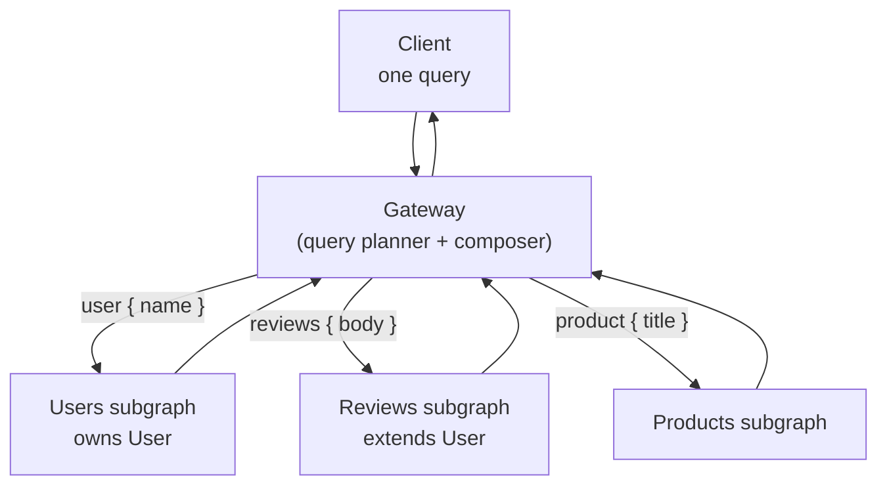
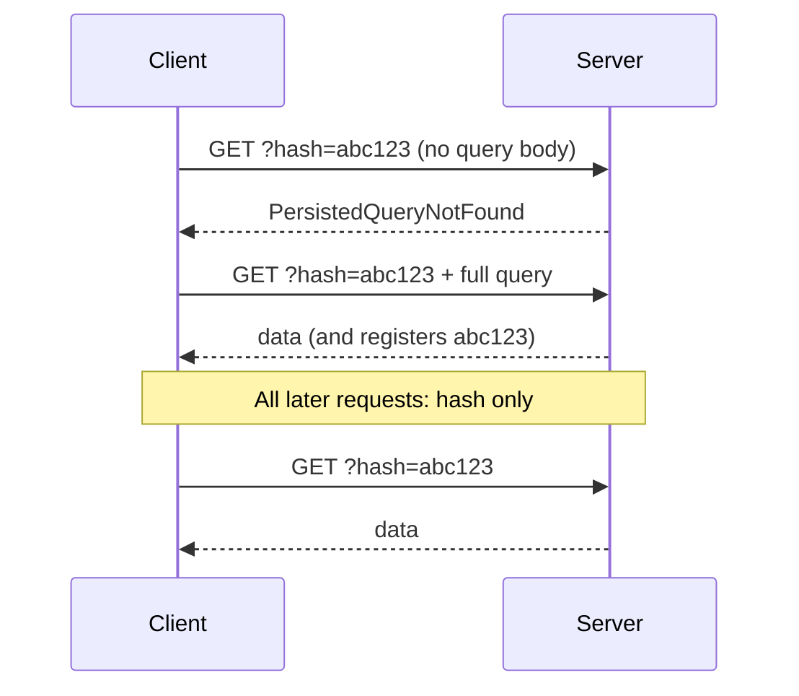

<div class="hero-section" style="background: linear-gradient(135deg, #667eea 0%, #764ba2 100%); color: white; padding: 3rem 2rem; margin: -2rem -3rem 2rem -3rem; text-align: center;">
  <h1 style="color: white; margin: 0; font-size: 2.5rem;">GraphQL</h1>
  <p style="font-size: 1.25rem; margin-top: 1rem; opacity: 0.9;">A typed query language for APIs: clients ask for exactly the data they need against a single strongly-typed schema, and the server resolves it field by field.</p>
</div>

[API Design](./) &raquo; GraphQL

<div class="intro-card">
  <p class="lead-text">GraphQL inverts the REST contract. Instead of the server defining a fixed set of resources at fixed URLs, the server publishes a single strongly-typed <em>schema</em> describing every type and field it can return, and the client sends a query selecting exactly the fields it wants from a single endpoint. This eliminates over-fetching and under-fetching, collapses many round trips into one, and makes the API self-documenting and introspectable. The cost is that the server must implement a <em>resolver</em> for every field, defend against the N+1 query explosion that field-by-field resolution invites, and give up the free HTTP-layer caching that REST gets from URLs and verbs. This page covers the type system and schema definition language, the three operation types (queries, mutations, subscriptions), how resolvers execute, the N+1 problem and the DataLoader pattern that solves it, schema federation across teams, cursor/Relay pagination, caching and persisted queries, and the honest tradeoffs against REST.</p>
</div>

<div class="key-insights">
  <div class="insight-card">
    <i class="fas fa-project-diagram"></i>
    <h4>One endpoint, one graph</h4>
    <p>The schema is a typed graph of your domain; clients traverse it in a single request and get back exactly the shape they asked for.</p>
  </div>
  <div class="insight-card">
    <i class="fas fa-sitemap"></i>
    <h4>Every field has a resolver</h4>
    <p>The server walks the query tree, calling a resolver per field. This is what makes GraphQL flexible — and what makes N+1 the central performance hazard.</p>
  </div>
  <div class="insight-card">
    <i class="fas fa-layer-group"></i>
    <h4>Batch, don't loop</h4>
    <p>DataLoader coalesces a tree's worth of per-row lookups into one batched query per tick, turning O(N) round trips into O(1).</p>
  </div>
  <div class="insight-card">
    <i class="fas fa-balance-scale"></i>
    <h4>You trade HTTP caching for flexibility</h4>
    <p>POST-to-one-URL kills CDN/proxy caching for free; you pay it back with normalized client caches and persisted queries.</p>
  </div>
</div>

## Table of contents
{: .no_toc .text-delta }

1. TOC
{:toc}

---

## What GraphQL Is

GraphQL is a query language for APIs and a runtime for executing those queries against a typed schema. It was created at Facebook in 2012 (open-sourced in 2015) to serve mobile clients that needed many related pieces of data in one round trip over slow networks, where the REST pattern of "one request per resource, fixed response shape" was both too chatty and too wasteful.

The defining properties:

- **One endpoint.** A GraphQL service exposes a single URL (conventionally `/graphql`). Operations are distinguished by their *body*, not their path or HTTP verb.
- **Client-specified shape.** The client sends a query naming exactly the fields it wants; the response mirrors that selection precisely — no more, no less. There is no over-fetching (getting fields you ignore) and no under-fetching (needing a second request for related data).
- **Strong typing.** Every field has a declared type. The server validates each query against the schema *before* executing it, so a malformed query is rejected up front with a precise error rather than failing halfway through.
- **Introspection.** The schema is queryable at runtime, which is what powers tools like GraphiQL, code generators, and editor autocomplete.

A query and its response are structurally identical, which is the feature that makes GraphQL feel immediate:

```graphql
# Request
query {
  user(id: "42") {
    name
    email
    posts(first: 2) {
      title
    }
  }
}
```

```json
// Response — same shape as the query
{
  "data": {
    "user": {
      "name": "Ada Lovelace",
      "email": "ada@example.com",
      "posts": [
        { "title": "On the Analytical Engine" },
        { "title": "Note G" }
      ]
    }
  }
}
```

## The Type System & Schema

The schema is the contract. It is written in the **Schema Definition Language (SDL)** — a small, language-agnostic syntax — and it is the single source of truth that the server validates against and that clients introspect.

### Scalar and Object Types

GraphQL ships five built-in scalars: `Int`, `Float`, `String`, `Boolean`, and `ID` (a serialized-as-string opaque identifier). You define custom scalars (e.g. `DateTime`, `JSON`, `Email`) by supplying serialization logic on the server.

An **object type** is a named collection of fields, each field having its own type. This is how you model your domain:

```graphql
type User {
  id: ID!
  name: String!
  email: String
  posts: [Post!]!
  role: Role!
}

type Post {
  id: ID!
  title: String!
  body: String!
  author: User!
  publishedAt: DateTime
}
```

### Nullability and Lists

By default **every field is nullable**. A trailing `!` marks it **non-null** — the server guarantees a value and the client may rely on it. This is the opposite default from most languages and is deliberate: networked fields fail, so nullable is the safe baseline.

Nullability composes with lists, and the position of `!` matters precisely:

| Type | `null` list? | `null` element? |
|------|:---:|:---:|
| `[Post]`   | yes | yes |
| `[Post!]`  | yes | no  |
| `[Post]!`  | no  | yes |
| `[Post!]!` | no  | no  |

A non-null violation is not silently coerced: if a resolver returns `null` for a non-null field, GraphQL **propagates the null upward** to the nearest nullable parent, nulling that entire subtree and recording an error. This bubbling rule is a frequent source of surprise — one missing required field can blank out a large branch of the response.

### Enums, Interfaces, and Unions

```graphql
enum Role { ADMIN EDITOR VIEWER }

# Interface: shared fields, polymorphic implementers
interface Node { id: ID! }

type User implements Node { id: ID!  name: String! }
type Post implements Node { id: ID!  title: String! }

# Union: a value that is one of several object types (no shared fields)
union SearchResult = User | Post | Comment
```

When a field returns an interface or union, the client uses **inline fragments** to select type-specific fields, and the server must implement a `__resolveType` function so the executor knows which concrete type each value is:

```graphql
query {
  search(term: "graph") {
    __typename
    ... on User { name }
    ... on Post { title }
  }
}
```

### Input Types and Arguments

Fields take **arguments**; complex arguments use **input types** (distinct from object types — inputs cannot have resolvers or circular non-null cycles, and are used only as parameters):

```graphql
input CreatePostInput {
  title: String!
  body: String!
  authorId: ID!
}
```

### The Three Root Types

Every schema has up to three special entry-point object types. They are ordinary object types, but the executor treats them as the roots of the three operation kinds:

```graphql
type Query    { ... }   # reads
type Mutation { ... }   # writes
type Subscription { ... } # live streams

schema {
  query: Query
  mutation: Mutation
  subscription: Subscription
}
```

## Queries, Mutations & Subscriptions

The three operation types correspond to read, write, and subscribe. They share syntax but differ in execution semantics.

### Queries

A **query** is a read. Top-level query fields execute **in parallel** (they are assumed side-effect-free), and the response is shaped by the selection set. Queries support:

- **Arguments** — `user(id: "42")`.
- **Aliases** — request the same field twice under different names: `me: user(id:"1") { name }  you: user(id:"2") { name }`.
- **Variables** — parameterize a query so the query string stays static (essential for caching and persisted queries, below):

```graphql
query GetUser($id: ID!) {
  user(id: $id) { name email }
}
```
```json
{ "id": "42" }
```

- **Fragments** — named, reusable selection sets that keep queries DRY:

```graphql
fragment UserCard on User { id name email }

query { user(id: "42") { ...UserCard } }
```

- **Directives** — `@include(if: $x)` and `@skip(if: $x)` conditionally include fields at execution time.

### Mutations

A **mutation** is a write. The only execution difference from queries is significant: **top-level mutation fields run serially, in the order written**, so that `createUser` then `addToTeam` cannot race. (Nested fields under each mutation still resolve in parallel.)

The strong convention is **one input type in, one payload type out**, where the payload returns the affected object(s) plus error information — so the client can immediately re-read the new state in the same round trip:

```graphql
type Mutation {
  createPost(input: CreatePostInput!): CreatePostPayload!
}

type CreatePostPayload {
  post: Post
  userErrors: [UserError!]!   # domain errors, modeled as data
}
```

Modeling expected, recoverable errors (validation failures, "title taken") as fields in the payload — rather than throwing — lets a single response carry partial success and typed error detail, which is far friendlier to clients than a top-level `errors` array.

### Subscriptions

A **subscription** is a long-lived operation that pushes a stream of results to the client whenever an event occurs (a new message, a price tick). Unlike queries/mutations (request/response, typically over HTTP POST), subscriptions need a persistent transport — historically WebSockets (`graphql-ws` protocol), increasingly Server-Sent Events for unidirectional streams.

```graphql
type Subscription {
  messageAdded(channelId: ID!): Message!
}
```

A subscription resolver returns an **async iterator**; the server `publish`es events to a pub/sub backend (in-memory for one node, Redis/Kafka for many) and each subscriber's iterator yields the events matching its arguments. Subscriptions add real operational weight — you must manage connection state, backpressure, authorization on every pushed event, and horizontal fan-out across server instances — so reach for them only when you genuinely need server-push; polling a query is often simpler and sufficient.

## Resolvers: How Execution Works

A **resolver** is a function attached to a single field that produces that field's value. Execution is a depth-first walk of the query tree: GraphQL calls the resolver for each requested field, passes the result as the *parent* to the resolvers of that field's sub-selections, and assembles the response from the leaves up.

Every resolver has the same signature — `(parent, args, context, info)`:

- **`parent`** — the value returned by the resolver one level up (the object this field belongs to).
- **`args`** — the field's arguments.
- **`context`** — a per-request object shared by *all* resolvers in one operation; the canonical home for the authenticated user, database connections, and DataLoaders.
- **`info`** — the AST and runtime info about the current field (rarely needed; used for advanced projection).

```javascript
const resolvers = {
  Query: {
    // parent is the root; fetch the user by id
    user: (_parent, { id }, ctx) => ctx.db.users.findById(id),
  },
  User: {
    // parent is the User object resolved above
    posts: (user, _args, ctx) => ctx.db.posts.findByAuthor(user.id),
  },
  Post: {
    author: (post, _args, ctx) => ctx.db.users.findById(post.authorId),
  },
};
```

### Default Resolvers and Trivial Resolvers

You do not write a resolver for every field. If a field has no explicit resolver, GraphQL uses the **default resolver**, which simply reads the property of the same name off `parent` (returning `parent.name` for field `name`). So `User.name` needs no code as long as the user object the database returned already has a `name` property. You only write resolvers for fields that require computation, a fetch, or a transformation.

### Why Resolution Order Creates the N+1 Problem

The field-by-field model is what makes GraphQL flexible, but it has a built-in performance trap. Consider:

```graphql
query {
  posts(first: 10) {     # 1 query: fetch 10 posts
    title
    author { name }      # resolver runs ONCE PER POST → 10 more queries
  }
}
```

The `posts` resolver runs once and returns 10 posts. Then GraphQL invokes the `Post.author` resolver **once for each of the 10 posts**, each firing an independent `findById`. That is 1 + 10 = 11 database queries for what should be 2. This is the **N+1 problem**, and it is the single most important performance issue in GraphQL — the subject of the next section.

## The N+1 Problem & DataLoader

### The Problem, Precisely

Because resolvers run per-field-per-parent, any nested field that fetches related data fires once per parent object. A list of N items, each resolving a related entity, produces **1 query for the list + N queries for the relations = N+1 queries**. Nest two levels (posts → authors → their teams) and it multiplies. The query *looks* innocent to the client; the cost is hidden in the resolver tree.

The naive "fix" — eagerly joining everything in the top resolver — defeats GraphQL's purpose: you would over-fetch on every request regardless of what the client selected, and you cannot know the selection in the parent resolver without parsing `info` yourself.

### DataLoader: Batch + Cache Per Request

The standard solution is the **DataLoader** pattern (a small library, originally from Facebook, ported to most languages). A DataLoader does two things:

1. **Batching.** Instead of fetching immediately, `load(key)` *records* the key and returns a promise. DataLoader waits until the end of the current event-loop tick (after all the per-parent resolvers have called `load`), then invokes your **batch function** *once* with the full array of collected keys. So 10 calls to `load(authorId)` become a single `SELECT * FROM users WHERE id IN (...)`.
2. **Per-request caching (memoization).** Within one request, `load(k)` for a repeated key `k` returns the cached promise — the same user referenced by ten posts is fetched once.

```javascript
const DataLoader = require('dataloader');

// One loader per request, stored on context
function buildLoaders(db) {
  const userLoader = new DataLoader(async (ids) => {
    // Called once with ALL ids collected this tick
    const users = await db.users.findByIds(ids);  // single batched query
    const byId = new Map(users.map(u => [u.id, u]));
    // MUST return results in the SAME ORDER as `ids`
    return ids.map(id => byId.get(id) ?? null);
  });
  return { userLoader };
}

const resolvers = {
  Post: {
    // Now batched + cached instead of one query per post
    author: (post, _args, ctx) => ctx.loaders.userLoader.load(post.authorId),
  },
};
```

The two iron rules of a batch function: it **must return an array the same length and order as the input keys** (DataLoader maps results back positionally), and you **create fresh loaders per request** so the cache cannot leak data between users or serve stale values across the lifetime of the process.

### Beyond DataLoader

DataLoader collapses N+1 into a small constant number of batched queries, but those batches can still be deep. Complementary tactics: **query-cost analysis** to reject pathologically expensive queries before execution (assign each field a cost, cap the total), **depth limiting** to forbid deeply nested recursive queries, and **lookahead/projection** (inspecting `info` to fetch only the columns and joins the selection actually needs). For read-heavy fields, a DataLoader can also sit in front of a cache (Redis) rather than the database directly.

## Schema Federation

A single monolithic schema becomes a bottleneck once many teams contribute to it. **Federation** lets independent services each own a slice of the graph, which a **gateway** composes into one unified schema that clients query as if it were monolithic.

The Apollo Federation model is the dominant one. Each **subgraph** is an ordinary GraphQL service that declares which types it owns and which types it *extends* from other subgraphs, using directives:

- `@key(fields: "id")` — declares that a type is an **entity** identifiable by the given fields, so other subgraphs can reference it.
- `@external`, `@requires`, `@provides` — describe fields owned elsewhere and data dependencies between subgraphs.

```graphql
# users subgraph — owns User
type User @key(fields: "id") {
  id: ID!
  name: String!
}

# reviews subgraph — extends User with reviews it owns
type User @key(fields: "id") {
  id: ID! @external
  reviews: [Review!]!
}
type Review { id: ID!  body: String!  author: User! }
```

The gateway builds a **query plan**: it splits an incoming query into per-subgraph fetches, calls each subgraph (resolving an entity's representation via the special `_entities` field and a `__resolveReference` resolver on the owning service), and stitches the results back into one response.



Federation is the GraphQL counterpart to microservices: it lets teams deploy and own their part of the graph independently while presenting clients a single, coherent schema. The older alternative, **schema stitching**, merges schemas at the gateway with manually written delegation/resolvers; federation moves that ownership into the subgraphs themselves and is generally preferred for new systems. The cost is real operational complexity — a gateway to run, query-plan latency, and cross-subgraph entity resolution that can reintroduce N+1 at the gateway boundary if not batched.

## Pagination: Relay & Cursor-Based

Returning a whole list (`posts: [Post!]!`) does not scale. The two pagination strategies are offset-based and cursor-based.

### Offset vs. Cursor

**Offset pagination** (`posts(limit: 20, offset: 40)`) is simple and allows jumping to an arbitrary page, but it breaks under mutation: if a row is inserted or deleted while the user paginates, offsets shift and items are skipped or duplicated. It is also slow at depth — `OFFSET 100000` still scans and discards 100,000 rows.

**Cursor pagination** instead asks for "items after this opaque cursor." The cursor encodes a stable position (typically the sort key of the last item, e.g. `(publishedAt, id)`). The query becomes `WHERE (published_at, id) < (?, ?) ORDER BY ... LIMIT 20` — index-friendly and *stable* under concurrent inserts, because it anchors to a value rather than a count. The tradeoff is you cannot jump to "page 7"; you can only walk forward (and backward) sequentially.

### The Relay Connections Spec

Relay standardized cursor pagination into the **Connections** specification, now near-universal in GraphQL. A connection wraps a list in a structure of **edges** (each pairing a node with its cursor) and **pageInfo** (the navigation metadata):

```graphql
type Query {
  posts(first: Int, after: String, last: Int, before: String): PostConnection!
}

type PostConnection {
  edges: [PostEdge!]!
  pageInfo: PageInfo!
  totalCount: Int        # optional, often expensive
}

type PostEdge {
  node: Post!
  cursor: String!        # opaque, base64-encoded position
}

type PageInfo {
  hasNextPage: Boolean!
  hasPreviousPage: Boolean!
  startCursor: String
  endCursor: String
}
```

A forward page is `posts(first: 20, after: $endCursor)`; the client reads `pageInfo.endCursor` from the response and feeds it back to fetch the next page until `hasNextPage` is false. The edge-level cursor (rather than a single page-level offset) is what makes the scheme robust: each item carries its own stable position, so the boundary between pages is anchored to data, not to a count that drifts. The verbosity (edges, nodes, cursors) is the price of that stability and of a uniform shape that tooling can rely on across every list in the schema.

## Caching & Persisted Queries

### Why HTTP Caching Doesn't Come for Free

REST gets caching almost for free: a `GET /users/42` is a stable, cacheable URL, and CDNs, browser caches, and reverse proxies all key on it natively. GraphQL forfeits this — every operation is a `POST` to the *same* `/graphql` URL with the query in the body, so URL-based HTTP caches see one opaque endpoint and cache nothing. Caching in GraphQL therefore moves to two other layers.

### Client-Side Normalized Caching

GraphQL clients (Apollo Client, Relay, urql) maintain a **normalized cache**. Every object that carries a stable identity (`__typename` + `id`, or a custom key) is stored *once* in a flat cache keyed by that identity, and query results hold references into it. This means:

- If two different queries both return `User:42`, they share one cache entry — update it once and every view reflects the change.
- After a mutation returns the modified object (the reason mutations return their payloads), the cache auto-updates and dependent components re-render without a refetch.

This normalized store is GraphQL's answer to the loss of HTTP caching: it deduplicates and reuses data across the whole client app, often eliminating more requests than an HTTP cache would have.

### Server-Side and CDN Caching

Servers can cache at the resolver/field level (a DataLoader backed by Redis), and the `@cacheControl` directive (or schema-level hints) lets a server declare per-field `maxAge` and `scope`, which a GraphQL-aware CDN (e.g. Apollo's) can use to cache whole responses. Whole-response caching only works well for queries with no per-user variance; per-user data is cached at the field level instead.

### Automatic Persisted Queries (APQ)

GraphQL query strings are large and repetitive, and `POST` bodies are not CDN-cacheable. **Persisted queries** fix both. The client and server agree on a query by its **hash** (typically SHA-256 of the query string):

1. The client sends only the hash. If the server already knows it, it executes — a tiny request.
2. On a cache miss, the server replies "unknown," the client retries sending the *full* query plus its hash once, and the server registers it for all future use.



Because a persisted query is now a small, stable, hashed `GET`, it becomes **CDN-cacheable again** — recovering much of REST's edge-caching benefit. As a bonus, an **allow-list** of pre-registered persisted queries can be enforced in production so the server *only* executes known-good operations, shutting down arbitrary or malicious queries entirely.

## Tradeoffs vs REST

GraphQL is not a strict upgrade over REST; it relocates complexity. The honest comparison:

| Dimension | REST | GraphQL |
|---|---|---|
| Fetching | Fixed response per endpoint; over/under-fetch common | Client selects exact fields; one round trip for nested data |
| Endpoints | Many URLs, HTTP verbs as semantics | One endpoint, operation in body |
| Typing/contract | Optional (OpenAPI) | Mandatory, introspectable schema is the contract |
| HTTP caching | Native, free (GET + URL) | Lost; needs client cache, `@cacheControl`, persisted queries |
| Versioning | Often `/v2/` URLs | Evolve in place: add fields, `@deprecated` old ones |
| N+1 / performance | Endpoint controls its own queries | Field resolution invites N+1; needs DataLoader |
| Error model | HTTP status codes | 200 + typed `errors`/payload errors; status alone insufficient |
| File upload, simplicity | Native, trivial | Needs multipart spec; more upfront machinery |
| Tooling for clients | Manual or codegen from OpenAPI | First-class codegen, autocomplete from schema |

**Reach for GraphQL** when you have many heterogeneous clients (web, iOS, Android) with divergent data needs, deeply nested/graph-shaped data, a desire to aggregate several backends behind one typed contract, or rapidly evolving frontend requirements that benefit from clients choosing their own fields.

**Stay with REST** when your API is simple and resource-oriented, when free HTTP/CDN caching is a major win (public, cacheable, read-mostly data), when you need trivial file handling and broad ecosystem compatibility, or when the team is small and the operational overhead of resolvers, schema governance, and N+1 defense does not pay for itself. Many systems do both: REST (or gRPC) for service-to-service and simple resources, GraphQL as a client-facing aggregation layer (a Backend-for-Frontend) over them.

The throughline: GraphQL trades the server's freedom (it must implement and defend every field) for the client's freedom (it asks for exactly what it needs). Whether that trade is worth it depends entirely on how many clients you have and how varied their data needs are.

## See Also

- **[Microservices & Event-Driven Architecture](../distributed-systems/microservices-and-event-driven.html)** — API gateways, Backend-for-Frontend, and the service decomposition that federation mirrors at the schema layer
- **[Distributed Systems Hub](../distributed-systems/)** — consistency, caching, and the failure modes a federated gateway must tolerate
- **[Database Design](../technology/database-design/)** — the data stores and indexes behind resolvers, and the index-friendly keyset queries cursor pagination relies on
- **[Networking](../technology/networking/)** — HTTP, WebSockets, and the transport beneath queries, mutations, and subscriptions
