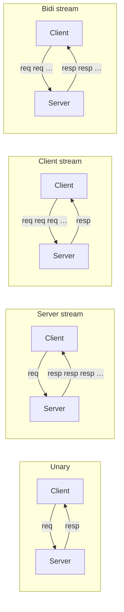
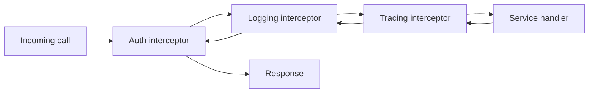
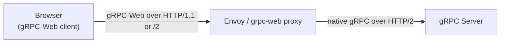

[API Design](./) &raquo; gRPC &amp; Protocol Buffers

gRPC is a high-performance RPC framework that pairs a compact, schema-driven serialization format (Protocol Buffers) with HTTP/2 as a transport. Instead of hand-writing URL routes and parsing JSON, you describe your messages and services once in a `.proto` file, a code generator emits typed stubs in a dozen languages, and the runtime handles framing, multiplexing, flow control, and streaming for you. The payoff is low latency, strong typing across service boundaries, first-class bidirectional streaming, and a forward/backward-compatible schema-evolution story — at the cost of human-unreadable wire bytes and weaker browser support. Four ideas recur below:

- **The schema is the contract.** A `.proto` file is the single source of truth; clients and servers in any language are generated from it, so interface drift becomes a compile error rather than a 3am pager.
- **Field numbers, not names, are the wire.** Protobuf serializes by tag number. Rename freely, but never reuse a number — that single rule is what makes schemas evolvable across decades.
- **HTTP/2 makes streaming native.** Multiplexed streams over one connection give you unary, server-stream, client-stream, and bidirectional calls without head-of-line blocking or connection-per-request overhead.
- **Deadlines propagate, not timeouts.** gRPC ships an absolute deadline down the call tree so the whole chain cancels together — back-pressure and cancellation are built into the model, not bolted on.

This page works from the wire format up: how protobuf encodes and evolves data, how gRPC layers four call types on HTTP/2, how code generation and channels work, and the cross-cutting concerns — deadlines, cancellation, interceptors, errors, gRPC-Web — you need before shipping.

## Table of contents
{: .no_toc .text-delta }

1. TOC
{:toc}

---

## Protocol Buffers: The Schema Language

Protocol Buffers ("protobuf") is the interface definition language (IDL) and serialization format underneath gRPC. You declare messages and services in a `.proto` file; everything else — the wire bytes, the typed classes, the validation of compatibility — derives from it.

### A First Schema

```protobuf
syntax = "proto3";

package shop.v1;

option go_package = "github.com/example/shop/v1;shopv1";

// A request to fetch a single order by id.
message GetOrderRequest {
  string order_id = 1;
}

message Order {
  string order_id   = 1;
  string customer   = 2;
  Status status     = 3;
  repeated LineItem items = 4;   // a list
  int64 created_at_unix = 5;
}

message LineItem {
  string sku  = 1;
  uint32 qty  = 2;
  int64 price_cents = 3;
}

enum Status {
  STATUS_UNSPECIFIED = 0;  // proto3 enums MUST have a zero value
  STATUS_PENDING     = 1;
  STATUS_SHIPPED     = 2;
  STATUS_CANCELLED   = 3;
}

service OrderService {
  rpc GetOrder(GetOrderRequest) returns (Order);
}
```

Several conventions in that snippet are load-bearing:

- **`syntax = "proto3"`** selects the proto3 dialect (the modern default; proto2 still exists but proto3 is what new services use).
- **`package`** namespaces the generated symbols and is conventionally versioned (`shop.v1`) so that a breaking change ships as `shop.v2` alongside `v1`.
- **Field numbers** (`= 1`, `= 2`, …) are the identity of each field on the wire — names are for humans and are discarded during encoding.
- **`repeated`** denotes a list; **`enum`** values must include a `0` default (`STATUS_UNSPECIFIED`) because proto3 has no concept of an unset scalar.

### Scalar Types and Defaults

| `.proto` type | Notes | Default value |
|---------------|-------|---------------|
| `int32`, `int64` | Variable-length; inefficient for negative numbers | `0` |
| `sint32`, `sint64` | ZigZag-encoded; efficient for negative numbers | `0` |
| `uint32`, `uint64` | Unsigned varint | `0` |
| `fixed64`, `sfixed64` | Always 8 bytes; faster when values are large | `0` |
| `bool` | One varint byte | `false` |
| `string` | UTF-8, length-prefixed | `""` |
| `bytes` | Arbitrary length-prefixed octets | empty |
| `double`, `float` | IEEE-754 | `0` |
| `message` | Nested type | *not set* (distinguishable from zero) |

In proto3, scalar fields have no "unset" state — a `string` that was never assigned reads back as `""`, indistinguishable from one explicitly set to `""`. When you genuinely need to tell "absent" from "zero" (a nullable column, a PATCH that omits a field), use a message-typed field (message presence *is* tracked), the well-known wrapper types (`google.protobuf.StringValue`, `Int32Value`, …), or mark the field `optional` (proto3 restored explicit field presence for scalars via the `optional` keyword).

### Composite Constructs

```protobuf
message Profile {
  // oneof: exactly one of these is set at a time (a tagged union)
  oneof contact {
    string email = 1;
    string phone = 2;
  }

  // map<K,V>: key/value pairs (sugar over a repeated entry message)
  map<string, string> labels = 3;

  // nested message + well-known types
  google.protobuf.Timestamp updated_at = 4;
  reserved 5, 6;                 // numbers we promise never to reuse
  reserved "legacy_name";        // a name we promise never to reuse
}
```

- **`oneof`** is a tagged union: setting one member clears the others, and the generated code exposes a "which-one-is-set" discriminator. It is the right tool for "a request that is one of several shapes."
- **`map<K,V>`** is syntactic sugar for `repeated` entries; map fields cannot themselves be `repeated` and have no guaranteed ordering on the wire.
- **`reserved`** fences off field numbers (and names) that a deleted field once used, so a future edit can't accidentally resurrect them with a new meaning — the cornerstone of safe deletion (see [evolution](#schema-evolution-rules)).
- **Well-known types** (`Timestamp`, `Duration`, `Any`, `Struct`, `FieldMask`, the wrapper types) are a standard library of messages shipped with protobuf — prefer them over reinventing a timestamp.

## The Wire Format

Understanding the encoding explains *why* the evolution rules exist. Protobuf is a sequence of **(field-number, wire-type, value)** triples — there is no framing of the message as a whole beyond an optional outer length prefix, and unknown triples are simply skipped.

### Tags and Varints

Each field on the wire is preceded by a one-or-more-byte **tag** that packs the field number and a 3-bit **wire type**:

$$
\text{tag} = (\text{field\_number} \ll 3) \mathbin{|} \text{wire\_type}
$$

The wire type tells a parser how to read the value even if it does not recognize the field:

| Wire type | Meaning | Used by |
|-----------|---------|---------|
| 0 | Varint | `int32/64`, `uint32/64`, `sint*`, `bool`, `enum` |
| 1 | 64-bit | `fixed64`, `sfixed64`, `double` |
| 2 | Length-delimited | `string`, `bytes`, embedded messages, packed `repeated` |
| 5 | 32-bit | `fixed32`, `sfixed32`, `float` |

A **varint** encodes an integer in 7-bit groups, little-endian, with the high bit of each byte signaling "more bytes follow." Small numbers cost one byte; this is why low field numbers (1–15) are preferable for frequently-set fields — their entire tag fits in a single byte (wire types 3 and 4, group-start/end, are deprecated).

Worked example: the message `Order{ order_id = "" omitted, status = STATUS_SHIPPED }` where `status` is field 3, an enum with value 2:

$$
\text{tag} = (3 \ll 3) \mathbin{|} 0 = 24 = \texttt{0x18}, \qquad \text{value} = 2 = \texttt{0x02}
$$

So the two bytes `18 02` encode "field 3, varint, value 2." A length-delimited field (`customer = "ann"`, field 2) emits the tag, then a varint length, then the UTF-8 bytes:

$$
\underbrace{\texttt{0x12}}_{(2 \ll 3)|2} \;\; \underbrace{\texttt{0x03}}_{\text{len}} \;\; \underbrace{\texttt{0x61}\,\texttt{0x6e}\,\texttt{0x6e}}_{\text{``ann''}}
$$

### ZigZag and Signed Integers

A naive `int32` stores `-1` as a 10-byte varint (two's-complement sign extension fills the high bits). **ZigZag** encoding maps signed integers onto unsigned ones so that small-magnitude negatives stay small:

$$
\text{zigzag}(n) = (n \ll 1) \oplus (n \gg 31) \quad \text{(for 32-bit; } \gg \text{ is arithmetic)}
$$

This sends `0 \to 0`, `-1 \to 1`, `1 \to 2`, `-2 \to 3`, …, so use `sint32`/`sint64` whenever a field is frequently negative, and plain `int32`/`int64` only when values are almost always non-negative.

### Two Properties That Fall Out of the Format

1. **Unknown fields are skippable.** Because every field carries a self-describing wire type, a parser that has never heard of field 7 can read its length (or varint) and skip it without corruption. This is *exactly* the property that lets a new client talk to an old server.
2. **There is no canonical encoding.** Map ordering, optional re-ordering of fields, and varying varint widths mean two semantically equal messages can serialize to different bytes. **Never hash or sign serialized protobuf and expect determinism across libraries/versions** — sign a canonicalized form or a separate digest instead.

## Schema Evolution Rules

The single most valuable property of protobuf is that schemas evolve without a flag day. Old and new code interoperate as long as you obey a short list of rules — all consequences of "field numbers are the wire, names are not, unknowns are skipped."

**Safe (backward- and forward-compatible) changes:**

- **Add a new field** with a fresh number. Old code skips it (forward-compatible); new code reads the type's default when an old message omits it (backward-compatible).
- **Rename a field or message.** Names aren't on the wire; only the number matters.
- **Add a value to an enum** — but be aware old code maps unknown values to the default/`UNSPECIFIED` (proto3 preserves unknown enum values as their integer).
- **Convert `single ↔ repeated`** for scalars and **promote a field into a `oneof`** under specific compatibility-preserving conditions (consult the protobuf docs; these are narrow).

**Breaking changes — never do these on a deployed field:**

- **Reuse a field number** for a different field. The wire type or semantics change underneath in-flight messages — catastrophic and silent.
- **Change a field's type** in a way that changes its wire type (e.g. `int32 → string`), or change its number.
- **Delete a field without reserving its number**, leaving the number free to be reused later by accident.

The discipline is therefore: to remove a field, delete it *and* `reserved` its number and name in the same change. To replace a field, add a new field with a new number and deprecate the old one. Tooling such as **Buf** (`buf breaking`) enforces these rules in CI by diffing a `.proto` against its previous version and failing the build on any incompatible change — the protobuf analogue of the html-proofer link check guarding this docs site.

```protobuf
message Order {
  string order_id = 1;
  string customer = 2;
  reserved 3;                 // was: Status status — removed safely
  reserved "status";
  repeated LineItem items = 4;
  OrderStatus order_status = 6;  // replacement, new number
}
```

## gRPC: RPC Over HTTP/2

gRPC takes the protobuf service definition and turns each `rpc` method into a network call. Three design choices define it: **HTTP/2** as the transport, **protobuf** as the default payload codec, and **streaming** as a first-class call shape.

### Why HTTP/2

gRPC maps each call onto an HTTP/2 **stream**. HTTP/2 contributes properties that REST-over-HTTP/1.1 cannot:

- **Multiplexing** — many concurrent streams share one TCP connection, eliminating the connection-per-request overhead and the head-of-line blocking of HTTP/1.1 pipelining.
- **Binary framing** — messages are split into `DATA`/`HEADERS` frames, which is what makes interleaved streaming possible.
- **Header compression (HPACK)** — repeated metadata (auth tokens, content-type) is sent once and referenced thereafter.
- **Flow control** — per-stream windows give back-pressure, so a slow consumer throttles a fast producer instead of drowning.

A gRPC call is an HTTP/2 `POST` to a path of the form `/package.Service/Method` (e.g. `/shop.v1.OrderService/GetOrder`), with `content-type: application/grpc+proto`, the request message in length-prefixed DATA frames, and the response status carried in HTTP/2 **trailers** (a `grpc-status` and optional `grpc-message`) after the body — a detail that matters for [gRPC-Web](#grpc-web-reaching-the-browser).

### The Four Call Types

The streaming keyword on either side of `returns` selects one of four shapes:

```protobuf
service Chat {
  // 1. Unary — one request, one response (classic RPC)
  rpc Send(Message) returns (Ack);

  // 2. Server streaming — one request, a stream of responses
  rpc Subscribe(Topic) returns (stream Message);

  // 3. Client streaming — a stream of requests, one response
  rpc Upload(stream Chunk) returns (UploadSummary);

  // 4. Bidirectional streaming — independent streams both ways
  rpc Converse(stream Message) returns (stream Message);
}
```



- **Unary** is the workhorse: a request/response that feels like a local function call.
- **Server streaming** suits feeds, large result sets, and progress updates — the server pushes messages until it half-closes the stream.
- **Client streaming** suits uploads and bulk ingestion — the client sends many messages, the server replies once with a summary.
- **Bidirectional streaming** runs both directions independently over the same stream; it powers chat, live telemetry, and protocols where each side reacts to the other in real time. Ordering is guaranteed *within* each direction, not across them.

## Code Generation

You never write gRPC wire-handling by hand. The protobuf compiler **`protoc`** (or the higher-level **`buf generate`**) reads `.proto` files and, via language plugins, emits message classes plus client **stubs** and server **base classes**.

```bash
# Generate Python message + gRPC code
python -m grpc_tools.protoc \
  -I proto \
  --python_out=gen \
  --grpc_python_out=gen \
  proto/shop/v1/order.proto

# Generate Go (via the modern buf toolchain)
buf generate
```

The generated artifacts are:

- **Message types** — immutable-ish builders with getters/setters, `SerializeToString`/`parse`, and equality.
- **A client stub** — one method per `rpc`, hiding HTTP/2 framing behind an ordinary function call.
- **A server base class / service interface** — you subclass it and implement each method; the runtime dispatches incoming calls to your handlers.

A minimal server and client in Python:

```python
# server.py
import grpc
from concurrent import futures
from gen.shop.v1 import order_pb2, order_pb2_grpc

class OrderService(order_pb2_grpc.OrderServiceServicer):
    def GetOrder(self, request, context):
        if not request.order_id:
            context.abort(grpc.StatusCode.INVALID_ARGUMENT, "order_id required")
        return order_pb2.Order(
            order_id=request.order_id,
            customer="ann",
            status=order_pb2.STATUS_SHIPPED,
        )

def serve():
    server = grpc.server(futures.ThreadPoolExecutor(max_workers=10))
    order_pb2_grpc.add_OrderServiceServicer_to_server(OrderService(), server)
    server.add_insecure_port("[::]:50051")  # use add_secure_port + TLS in prod
    server.start()
    server.wait_for_termination()
```

```python
# client.py
import grpc
from gen.shop.v1 import order_pb2, order_pb2_grpc

# A channel is a long-lived, reusable connection — create once, share widely.
with grpc.insecure_channel("localhost:50051") as channel:
    stub = order_pb2_grpc.OrderServiceStub(channel)
    resp = stub.GetOrder(
        order_pb2.GetOrderRequest(order_id="42"),
        timeout=2.0,  # sets a deadline (see below)
    )
    print(resp.customer, resp.status)
```

### Channels, Stubs, and Connection Reuse

A **channel** is gRPC's abstraction for a virtual connection to a server (or a load-balanced set of servers). It is **expensive to create and cheap to reuse** — it maintains HTTP/2 connections, name resolution, and a load-balancing policy. The rule is: create one channel per backend and share it across the whole process; do **not** open a channel per request. **Stubs** are lightweight views over a channel; create them freely. Channels are also where client-side load balancing (`round_robin`, `pick_first`), retries, and keepalive pings are configured.

## Deadlines, Timeouts, and Cancellation

In a synchronous call chain, one stalled dependency can pin resources across every upstream service. gRPC's answer is the **deadline**, and it is one of the framework's best ideas.

### Deadlines Propagate

A client sets a **deadline** — an *absolute* point in time by which the call must complete. gRPC serializes the remaining time into the `grpc-timeout` request header, so when service A (deadline 2 s) calls service B, B receives "you have ~1.8 s left," and when B calls C, C sees what's left of *that*. The deadline shrinks down the whole tree, and when it expires every in-flight call in the chain is cancelled and returns `DEADLINE_EXCEEDED`. Contrast this with a per-hop *timeout*, which resets at each hop and can let a deep chain run far longer than the user is willing to wait.

```python
import grpc, datetime

# Prefer an absolute deadline you can propagate, over a relative timeout.
try:
    resp = stub.GetOrder(req, timeout=2.0)
except grpc.RpcError as e:
    if e.code() == grpc.StatusCode.DEADLINE_EXCEEDED:
        ...  # back off / fail fast
```

On the server side, always **check the deadline before doing expensive work** — if the client has already given up, there is no point querying the database:

```python
def GetOrder(self, request, context):
    if context.is_active() is False:
        return order_pb2.Order()  # client gone
    remaining = context.time_remaining()  # seconds, or None
    if remaining is not None and remaining < 0.05:
        context.abort(grpc.StatusCode.DEADLINE_EXCEEDED, "no time left")
    ...
```

### Cancellation

Cancellation flows the same way. If a client disconnects, hits Ctrl-C, or the deadline fires, the server's `context` is cancelled; a well-behaved handler observes cancellation (via `context.is_active()`, a cancellation callback, or the language's context/`Context` object) and abandons work promptly. For streaming calls, cancellation lets either side tear down the stream cleanly. Propagating cancellation through to downstream calls (pass the same context) is what prevents orphaned work from piling up after a client walks away.

> **Always set a deadline.** A gRPC call with no deadline waits *forever* by default. In production, every call should carry a deadline derived from the user-facing budget, and that budget should be divided sensibly across the call tree.

## Interceptors

**Interceptors** are gRPC's middleware: they wrap every call so you can implement cross-cutting concerns — auth, logging, metrics, tracing, retries — once, instead of in every handler. They exist on both client and server, for both unary and streaming calls.

```python
# Server-side unary interceptor: enforce an auth token and emit a metric.
import grpc, time

class AuthInterceptor(grpc.ServerInterceptor):
    def intercept_service(self, continuation, handler_call_details):
        md = dict(handler_call_details.invocation_metadata)
        token = md.get("authorization", "")
        if not token.startswith("Bearer "):
            def deny(request, context):
                context.abort(grpc.StatusCode.UNAUTHENTICATED, "missing token")
            return grpc.unary_unary_rpc_method_handler(deny)
        return continuation(handler_call_details)  # proceed to the real handler

server = grpc.server(
    futures.ThreadPoolExecutor(max_workers=10),
    interceptors=[AuthInterceptor()],
)
```

```python
# Client-side interceptor: attach a token and time the call.
class TimingInterceptor(grpc.UnaryUnaryClientInterceptor):
    def intercept_unary_unary(self, continuation, call_details, request):
        start = time.perf_counter()
        response = continuation(call_details, request)
        # record start..now once the future resolves
        return response
```

Interceptors compose into a chain (an onion), each wrapping the next, with the actual handler at the center. This is exactly where you put: authentication/authorization, request logging with correlation IDs, distributed-tracing span creation and context propagation, rate limiting, and client-side retry/hedging policies. Keeping these in interceptors — not handlers — is what keeps service methods focused on business logic.



## The Error Model

gRPC does **not** use HTTP status codes. Every call completes with a **status code** from a fixed set, carried in the HTTP/2 trailers, plus an optional human-readable message and structured details.

### Canonical Status Codes

| Code | When to use |
|------|-------------|
| `OK` (0) | Success |
| `INVALID_ARGUMENT` | Client sent a malformed/invalid field (independent of system state) |
| `FAILED_PRECONDITION` | System state forbids the operation (retry won't help until state changes) |
| `OUT_OF_RANGE` | Value past a valid range (e.g. paging beyond the end) |
| `UNAUTHENTICATED` | Missing/invalid credentials |
| `PERMISSION_DENIED` | Authenticated but not allowed |
| `NOT_FOUND` | Entity doesn't exist |
| `ALREADY_EXISTS` | Entity the caller tried to create already exists |
| `RESOURCE_EXHAUSTED` | Quota/rate limit hit — usually safe to retry with backoff |
| `DEADLINE_EXCEEDED` | The deadline elapsed |
| `UNAVAILABLE` | Transient — server down/overloaded; safe to retry |
| `ABORTED` | Concurrency conflict (e.g. transaction); retry the whole sequence |
| `UNIMPLEMENTED` | Method not implemented/exposed |
| `INTERNAL` | Server-side invariant broken — a bug |
| `CANCELLED` | The operation was cancelled (often by the client) |

The distinction between **idempotent/retryable** (`UNAVAILABLE`, `RESOURCE_EXHAUSTED`, sometimes `ABORTED`) and **non-retryable** (`INVALID_ARGUMENT`, `NOT_FOUND`, `PERMISSION_DENIED`) is what client retry policies key off — retrying a `NOT_FOUND` is pointless, retrying `UNAVAILABLE` is correct.

### Rich Error Details

A bare code and string are often too coarse. The **richer error model** (`google.rpc.Status`) carries a `code`, a `message`, and a `repeated google.protobuf.Any details` list, into which you pack standard payloads like `BadRequest` (per-field violations), `RetryInfo` (how long to wait), `QuotaFailure`, `ErrorInfo`, or `LocalizedMessage`. This lets a server say "request invalid: field `qty` must be > 0, field `sku` is required" in a machine-readable way the client can render or react to:

```python
from google.rpc import status_pb2, error_details_pb2, code_pb2
from grpc_status import rpc_status

def GetOrder(self, request, context):
    if not request.order_id:
        detail = error_details_pb2.BadRequest(field_violations=[
            error_details_pb2.BadRequest.FieldViolation(
                field="order_id", description="must be non-empty")
        ])
        status = rpc_status.to_status(status_pb2.Status(
            code=code_pb2.INVALID_ARGUMENT,
            message="invalid GetOrderRequest",
            details=[_pack(detail)],
        ))
        context.abort_with_status(status)
```

## gRPC-Web: Reaching the Browser

Browsers cannot speak native gRPC: JavaScript has no access to HTTP/2 trailers or raw frame control, both of which gRPC depends on. **gRPC-Web** bridges the gap with a slightly different wire encoding (trailers are encoded *into* the response body) that a browser `fetch`/`XHR` can produce and consume.



Because of the encoding difference, you typically run a **proxy** — most commonly **Envoy** with its `grpc_web` filter, or an in-process middleware — that translates gRPC-Web ⟷ native gRPC. The same `.proto` generates the browser client, so the contract stays unified.

The practical limitations matter when choosing gRPC-Web for a frontend:

- **No client-side or bidirectional streaming.** Browser HTTP APIs can't stream a request body incrementally, so only unary and *server*-streaming calls work.
- **A proxy is (usually) required**, adding an operational hop.
- **CORS, auth headers, and the binary payload** need handling like any cross-origin API.

For these reasons many teams expose **REST/JSON at the browser edge** (often auto-generated from the same protos via a gRPC-gateway / transcoding) and reserve native gRPC for service-to-service traffic.

## gRPC vs REST: Choosing

gRPC and REST are not strictly ranked; they fit different niches. The decision turns on *who the client is* and *what the traffic looks like*.

| Dimension | gRPC | REST / JSON |
|-----------|------|-------------|
| Contract | Schema-first (`.proto`), generated stubs | Often schema-after (OpenAPI), hand-written clients |
| Payload | Binary protobuf — compact, fast | JSON text — verbose, human-readable |
| Transport | HTTP/2 (multiplexed, streaming) | Usually HTTP/1.1; HTTP/2 optional |
| Streaming | Native, all four shapes | Awkward (SSE, long-poll, WebSockets) |
| Browser support | Needs gRPC-Web + proxy | Native everywhere |
| Debuggability | Needs tooling (`grpcurl`, reflection) | `curl`, browser, any HTTP tool |
| Typing | Strong, cross-language, compile-checked | Loose unless layered with schema validation |
| Best fit | Internal east-west microservice calls, polyglot, low-latency, streaming | Public/edge APIs, browser clients, third-party integrators |

**Reach for gRPC when:** services call each other internally; you have many languages and want one generated contract; latency and payload size matter; you need real streaming; you want interface drift caught at build time. This is precisely the "internal synchronous calls" niche flagged in the microservices guidance — gRPC's typed stubs and HTTP/2 multiplexing lower both latency and integration risk between services.

**Reach for REST when:** the client is a browser or a third party; broad tooling and human-debuggability matter; the API is a public contract you can't regenerate everyone's clients for; caching via HTTP semantics (ETags, `Cache-Control`) is valuable. REST/JSON remains the lingua franca at the *edge*.

In practice large systems use **both**: REST (or GraphQL) at the public edge and gRPC behind it for service-to-service traffic, sometimes auto-transcoding one protocol to the other from a single set of protos.

## Production Checklist

A gRPC service is production-ready when it has:

- **TLS everywhere** — `add_secure_port` with real certificates; never `insecure` outside local dev.
- **Deadlines on every call** — derived from a user-facing budget, propagated through the tree.
- **A retry/hedging policy** scoped to retryable codes (`UNAVAILABLE`, `RESOURCE_EXHAUSTED`) with backoff and a cap.
- **Interceptors** for auth, structured logging with correlation/trace IDs, and metrics (request rate, error rate by status code, latency histograms).
- **Health checking** via the standard `grpc.health.v1.Health` service and **server reflection** for debugging with `grpcurl`.
- **Schema CI** (`buf lint` + `buf breaking`) so no incompatible `.proto` change ships, and versioned packages (`v1`, `v2`) for the rare unavoidable break.
- **Keepalive and flow-control** tuned for long-lived streams; channel reuse enforced.

## See Also

- **[API Design Hub](./)** — section overview and the other API styles (REST, GraphQL, versioning, auth).
- **[Microservices & Event-Driven Architecture](../distributed-systems/microservices-and-event-driven.html)** — where gRPC fits as the internal synchronous transport between services, alongside asynchronous messaging.
- **[Transport & Protocols](../technology/networking/transport-and-protocols.html)** — TCP, TLS, and the HTTP/2 substrate gRPC rides on.
- **[Networking](../technology/networking/)** — the unreliable transport beneath every RPC.
- **[Database Design](../technology/database-design/)** — the data stores your gRPC services front.
- **[Kubernetes](../technology/kubernetes/)** — deploying, load-balancing, and service-meshing gRPC backends.

### Further Reading

- [Protocol Buffers documentation](https://protobuf.dev/) — language guide, encoding spec, and well-known types
- [gRPC documentation](https://grpc.io/docs/) — concepts, language guides, and the core specification
- [Google API Improvement Proposals (AIPs)](https://google.aip.dev/) — design guidance for protobuf/gRPC APIs
- [Buf](https://buf.build/docs/) — modern `.proto` linting, breaking-change detection, and codegen
- "gRPC: Up and Running" by Kasun Indrasiri & Danesh Kuruppu
