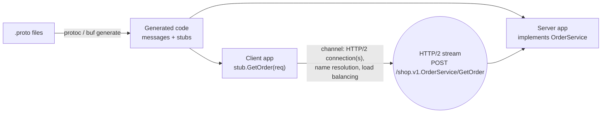
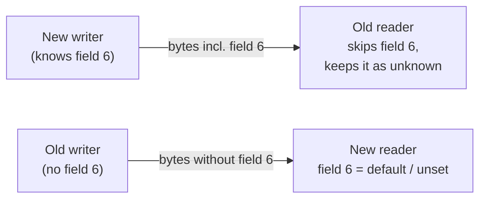
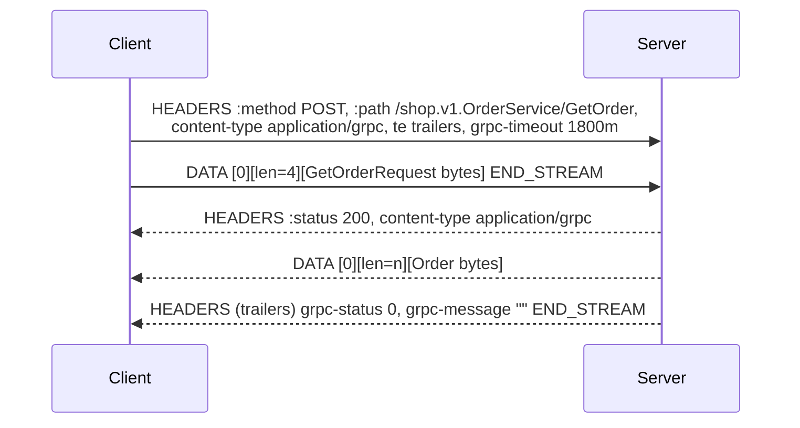
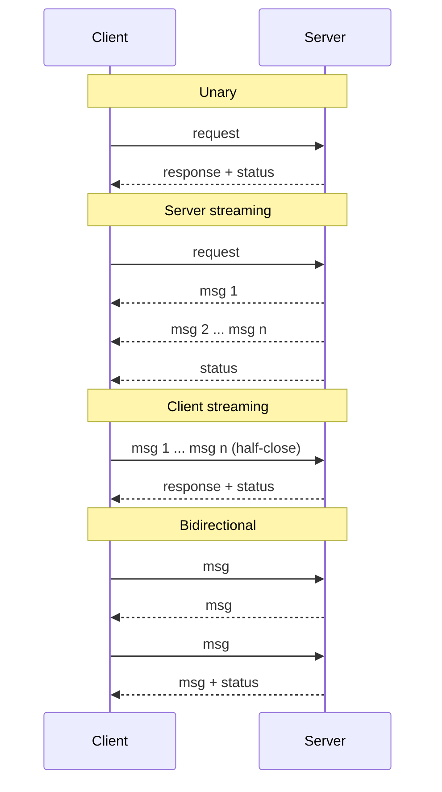
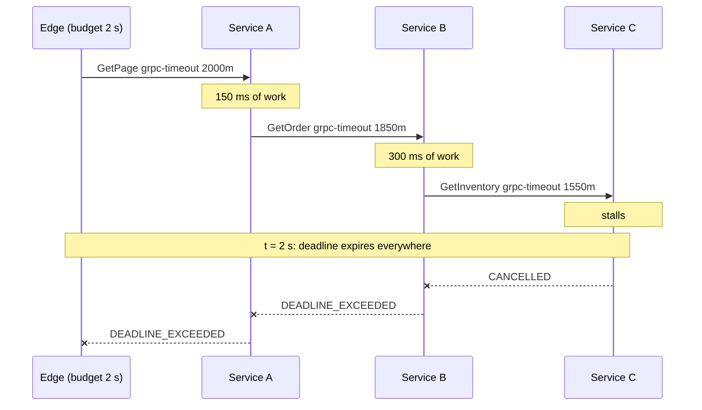
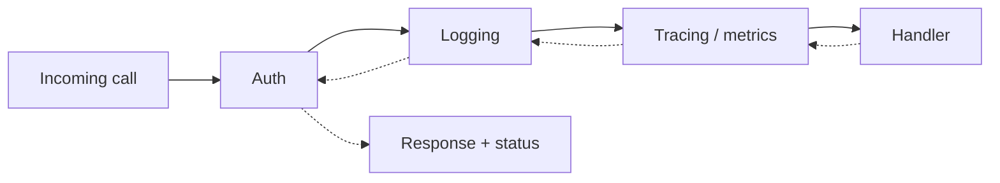
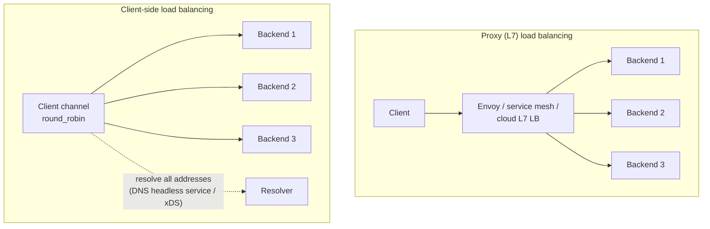

[API Design](./) &raquo; gRPC &amp; Protocol Buffers

**gRPC** is an open-source RPC framework, originally from Google and now a CNCF project. It pairs **Protocol Buffers** (protobuf), a compact serialization format defined by a schema, with **HTTP/2** as the transport. You describe messages and services once in a `.proto` file. A code generator produces typed clients and servers in more than a dozen languages, and the runtime handles framing, multiplexing, flow control, streaming, deadlines and cancellation. The benefits are low latency, strong typing across service boundaries, native streaming, and schemas that can evolve without breaking old clients. The costs are binary payloads that humans cannot read, and browsers that need a translation layer. This page starts from the wire format and works up: the protobuf schema language and editions, the encoding and the evolution rules that follow from it, how gRPC maps calls onto HTTP/2, and what you need before shipping (deadlines, interceptors, errors, load balancing, browser access).

## Table of contents
{: .no_toc .text-delta }

1. TOC
{:toc}

---

## Architecture at a Glance



The `.proto` file is the contract. Clients and servers in any language are generated from it, so a mismatched interface is caught at build time instead of in production. Protobuf is also used on its own, without gRPC, for storage formats, Kafka payloads and configuration files.

## Protocol Buffers: The Schema Language

### A first schema

```protobuf
syntax = "proto3";

package shop.v1;

option go_package = "github.com/example/shop/gen/shop/v1;shopv1";

import "google/protobuf/timestamp.proto";

// Fetch a single order by id.
message GetOrderRequest {
  string order_id = 1;
}

message Order {
  string order_id = 1;
  string customer = 2;
  Status status = 3;
  repeated LineItem items = 4;                  // a list
  google.protobuf.Timestamp created_at = 5;     // well-known type
}

message LineItem {
  string sku = 1;
  uint32 qty = 2;
  int64 price_cents = 3;
}

enum Status {
  STATUS_UNSPECIFIED = 0;   // first value must be 0: the default
  STATUS_PENDING = 1;
  STATUS_SHIPPED = 2;
  STATUS_CANCELLED = 3;
}

service OrderService {
  rpc GetOrder(GetOrderRequest) returns (Order);
}
```

Several details in that snippet are load-bearing:

| Element | Meaning |
|---------|---------|
| `syntax = "proto3"` | Selects the proto3 dialect. New files may use `edition = "2023"` or `"2024"` instead (see [Editions](#editions)). |
| `package shop.v1` | Namespace for generated symbols. Put the major version in it so a breaking redesign ships as `shop.v2` next to `v1`. |
| `= 1`, `= 2`, ... | **Field numbers** identify fields on the wire. Names are for humans and code generators only. Valid numbers run from 1 to $2^{29}-1$; 19000–19999 are reserved for the implementation. |
| `repeated` | A list. Scalar numeric lists are **packed** (one length-delimited blob) by default in proto3. |
| `enum ... = 0` | Enums need a zero value, which is the default. Name it `*_UNSPECIFIED` so "not set" is never confused with a real state. |

### Scalar types

| `.proto` type | Encoding | Use when |
|---------------|----------|----------|
| `int32`, `int64` | varint | values are usually non-negative (negative numbers always take 10 bytes) |
| `sint32`, `sint64` | ZigZag varint | values are often negative |
| `uint32`, `uint64` | varint | values are never negative |
| `fixed32`, `fixed64`, `sfixed*` | always 4 or 8 bytes | values are usually large (hashes, IDs spread across the range) |
| `bool` | varint | — |
| `float`, `double` | 4 or 8 bytes, IEEE 754 | — |
| `string` | length-delimited UTF-8 (validated) | text |
| `bytes` | length-delimited octets | binary data |

### Field presence

A proto3 scalar declared without a label has **no presence**. An unset `string` reads back as `""`, and you cannot tell it apart from one explicitly set to `""`, because default values are not serialized at all. When "absent" and "zero" mean different things (a nullable column, a PATCH that leaves a field alone), use one of these:

- **`optional`** on the field (proto3 since 3.15), which generates `has_x()` / `HasField("x")`;
- a **message-typed field**, which always tracks presence;
- the **wrapper types** (`google.protobuf.StringValue`, `Int64Value`, ...), a legacy approach that `optional` has mostly replaced;
- **editions**, where explicit presence is the default.

For partial updates, pair the request with a `google.protobuf.FieldMask` that lists which fields to change. This is the pattern Google's [AIP-134](https://google.aip.dev/134) describes for `Update` methods.

### Composite constructs

```protobuf
message Profile {
  oneof contact {                     // tagged union: at most one is set
    string email = 1;
    string phone = 2;
  }
  map<string, string> labels = 3;     // sugar for repeated key/value entries
  google.protobuf.Timestamp updated_at = 4;

  reserved 5, 6, 10 to 12;            // numbers that must never be reused
  reserved "legacy_name";             // names that must never be reused
}
```

- **`oneof`** is a tagged union. Setting one member clears the others, and generated code exposes which one is set. It fits requests that come in several shapes.
- **`map<K,V>`** is encoded as `repeated` entry messages. Maps cannot be `repeated`, and their order on the wire is not defined.
- **`reserved`** blocks the numbers and names of deleted fields so a later edit cannot reuse them with a different meaning.
- **Well-known types** such as `Timestamp`, `Duration`, `FieldMask`, `Struct`, `Any` and `Empty` ship with protobuf and have special JSON mappings. Use them instead of inventing your own.

### Editions

**Protobuf Editions** replace the `proto2`/`proto3` split with named editions and individually configurable **features**. Instead of choosing a dialect, a file declares `edition = "2023";` and gets a documented set of feature defaults. Any of them can be overridden per file, message or field. Edition 2023 became available with protoc 27, and **edition 2024** with protoc 32 (2025).

```protobuf
edition = "2023";

package shop.v1;

message Order {
  string order_id = 1;                                        // explicit presence by default
  string note = 2 [features.field_presence = IMPLICIT];       // proto3-style for this field
}
```

| Feature | proto2 behavior | proto3 behavior | Edition 2023 default |
|---------|-----------------|-----------------|----------------------|
| `field_presence` | explicit | implicit | **explicit** |
| `enum_type` | closed | open | open |
| `repeated_field_encoding` | expanded | packed | packed |
| `utf8_validation` | none | verify | verify |

Editions change only the *language*. The wire format is unchanged, so edition, proto2 and proto3 files interoperate. `protoc` and Buf can migrate existing files automatically. For a new API, proto3 with `optional` is still a reasonable choice. Editions matter most for large codebases that mix proto2 and proto3 files.

## The Wire Format

The encoding explains *why* the evolution rules exist. A serialized message is a flat sequence of **(field number, wire type, value)** records. Nothing frames the message as a whole, and a parser skips records it does not recognize.

### Tags and varints

Each record starts with a **tag**, a varint that packs the field number together with a 3-bit **wire type**:

$$
\text{tag} = (\text{field\_number} \ll 3) \mathbin{|} \text{wire\_type}
$$

| Wire type | Name | Used by |
|-----------|------|---------|
| 0 | VARINT | `int32/64`, `uint32/64`, `sint32/64`, `bool`, `enum` |
| 1 | I64 | `fixed64`, `sfixed64`, `double` |
| 2 | LEN | `string`, `bytes`, embedded messages, packed `repeated` |
| 3, 4 | SGROUP / EGROUP | deprecated groups |
| 5 | I32 | `fixed32`, `sfixed32`, `float` |

A **varint** stores an integer in 7-bit groups, least significant group first. The high bit of each byte means "more bytes follow." Values below 128 take one byte. Field numbers 1–15 fit in a one-byte tag, so give them to the most frequently set fields.

**Worked example.** Encode `Order{ customer: "ann", status: STATUS_SHIPPED }`. Field 2 (`customer`) is a string, wire type 2. Field 3 (`status`) is an enum, wire type 0, value 2:

$$
\underbrace{\texttt{0x12}}_{(2 \ll 3)\,|\,2} \;
\underbrace{\texttt{0x03}}_{\text{length}} \;
\underbrace{\texttt{0x61}\;\texttt{0x6e}\;\texttt{0x6e}}_{\text{"ann"}} \;
\underbrace{\texttt{0x18}}_{(3 \ll 3)\,|\,0} \;
\underbrace{\texttt{0x02}}_{\text{value}}
$$

That is seven bytes in total. `order_id` is empty, which is the default, so it is not written at all. The equivalent JSON, `{"customer":"ann","status":"STATUS_SHIPPED"}`, takes 44 bytes.

### ZigZag for signed integers

A negative `int32` or `int64` is sign-extended to 64 bits, so it always takes **10 bytes** as a varint. **ZigZag** maps signed integers to unsigned ones so that numbers with a small magnitude stay short:

$$
\text{zigzag}_{32}(n) = (n \ll 1) \oplus (n \gg 31), \qquad
\text{zigzag}_{64}(n) = (n \ll 1) \oplus (n \gg 63)
$$

Here $\gg$ is an arithmetic shift. The mapping sends 0 to 0, −1 to 1, 1 to 2, −2 to 3, and so on. Use `sint32`/`sint64` for fields that are often negative.

### Properties that follow from the format

1. **Unknown fields can be skipped, and they are kept.** Every record's wire type says how long it is, so a parser that has never seen field 7 can skip it safely. Modern runtimes also keep unknown fields and write them back out on re-serialization, so a proxy running old code does not drop new data. This is what lets old and new code interoperate.
2. **Last value wins, and messages merge.** If a non-repeated field appears twice, the last value wins. Concatenating two encoded messages is the same as merging them.
3. **There is no canonical encoding.** Field order, map order and unknown-field handling can differ between libraries and versions. **Do not hash or sign serialized protobuf and expect the same bytes elsewhere.** Sign the exact bytes you sent, or use a separate canonical form.

## Schema Evolution Rules

Protobuf schemas can change without a coordinated switch-over, as long as you follow a few rules. All of them follow from three facts: field numbers are what goes on the wire, names are not, and unknown fields are skipped.



| Change | Binary wire | Notes |
|--------|:-----------:|-------|
| Add a field with a new number | safe | Old readers skip it; new readers see the default or "unset" |
| Rename a field | safe | **Breaks the JSON mapping, text format and `FieldMask` paths**, which use names |
| Delete a field *and* reserve its number and name | safe | Old writers' values become unknown fields |
| Add an enum value | safe | Open enums keep the unknown number; generated code sees an "unrecognized" value. Always handle a default case. |
| `int32` ↔ `int64` ↔ `uint32` ↔ `uint64` ↔ `bool` | compatible, with truncation | Values out of range are truncated |
| `string` ↔ `bytes` | compatible only if the bytes are valid UTF-8 | — |
| Move a single field into a **new** `oneof` | usually safe | Moving several existing fields into a oneof is not |
| **Reuse a field number** | **breaking** | Old data is silently read as the wrong field |
| **Change the wire type** (e.g. `int32` to `string`) | **breaking** | Parsers fail or misread the data |
| Change a field number | **breaking** | Same as deleting a field and adding another |
| Delete a field without `reserved` | a trap | A later edit can reuse the number |

To remove a field, delete it **and** reserve its number and name in the same change. To change a field's type, add a new field with a new number, write both during the migration, and then retire the old one.

```protobuf
message Order {
  string order_id = 1;
  string customer = 2;
  reserved 3;                    // was: Status status
  reserved "status";
  repeated LineItem items = 4;
  OrderStatus order_status = 6;  // replacement uses a new number
}
```

**Enforce these rules in CI.** [Buf](https://buf.build/docs/) (`buf lint`, `buf breaking`) compares the schema against the last released version and fails the build on an incompatible change:

```bash
buf lint
buf breaking --against '.git#branch=main'
```

Runtime validation, such as "`qty` must be greater than 0", is not part of protobuf itself. **protovalidate** adds constraint annotations (`[(buf.validate.field).uint32.gt = 0]`) that are checked by libraries in each language. It replaces the older `protoc-gen-validate`.

## gRPC over HTTP/2

gRPC turns each `rpc` in a service definition into a network call. Three design choices define it: **HTTP/2** as the transport, **protobuf** as the default codec, and **streaming** as a built-in call shape.

### What HTTP/2 provides

| HTTP/2 feature | What gRPC gets from it |
|----------------|------------------------|
| **Multiplexed streams** | Many concurrent calls on one TCP connection; no connection per request |
| **Binary framing** (`HEADERS`, `DATA`) | Messages can be interleaved in both directions, so streaming is possible |
| **HPACK header compression** | Repeated metadata (auth tokens, paths) costs a few bytes after the first call |
| **Per-stream flow control** | Backpressure: a slow receiver slows the sender instead of being flooded |
| **Trailers** | The final status arrives *after* the response body, so a streaming call can fail midway |

### Anatomy of a call

A call is an HTTP/2 `POST` to `/{package}.{Service}/{Method}`. Each message is sent with a **5-byte prefix**: a compressed flag byte followed by a 4-byte big-endian length. The status travels in the **trailers**.



The HTTP status is `200` even when the call fails. The real outcome is `grpc-status` in the trailers. Browsers cannot read trailers, which is why [gRPC-Web](#grpc-in-the-browser-grpc-web-and-connect) exists.

### The four call types

The `stream` keyword on either side of an `rpc` selects one of four shapes:

```protobuf
service Chat {
  rpc Send(Message) returns (Ack);                         // 1. unary
  rpc Subscribe(Topic) returns (stream Message);           // 2. server streaming
  rpc Upload(stream Chunk) returns (UploadSummary);        // 3. client streaming
  rpc Converse(stream Message) returns (stream Message);   // 4. bidirectional
}
```



| Type | Typical use |
|------|-------------|
| Unary | The workhorse; behaves like a function call |
| Server streaming | Feeds, large result sets, progress updates, LLM token streams |
| Client streaming | Uploads, bulk ingestion, metrics batching |
| Bidirectional | Chat, interactive sessions, long-lived control channels |

Messages are ordered **within** each direction of a stream, but the two directions are independent of each other. One stream is bound to one server, so a long-lived stream is not load-balanced again after it starts.

## Code Generation and Channels

You do not write wire handling yourself. **`protoc`** or **`buf generate`** runs language plugins that emit message classes, **client stubs** and **server base classes or interfaces**.

```yaml
# buf.gen.yaml (v2)
version: v2
inputs:
  - directory: proto
plugins:
  - remote: buf.build/protocolbuffers/go
    out: gen
    opt: paths=source_relative
  - remote: buf.build/grpc/go
    out: gen
    opt: paths=source_relative
  - remote: buf.build/grpc/python
    out: gen/py
  - remote: buf.build/protocolbuffers/python
    out: gen/py
```

```bash
buf generate
# or, without buf, for Python:
python -m grpc_tools.protoc -I proto --python_out=gen --pyi_out=gen \
  --grpc_python_out=gen proto/shop/v1/order.proto
```

A minimal server and client in Python:

```python
# server.py
from concurrent import futures
import grpc
from shop.v1 import order_pb2, order_pb2_grpc

class OrderService(order_pb2_grpc.OrderServiceServicer):
    def GetOrder(self, request, context):
        if not request.order_id:
            context.abort(grpc.StatusCode.INVALID_ARGUMENT, "order_id is required")
        return order_pb2.Order(order_id=request.order_id, customer="ann",
                               status=order_pb2.STATUS_SHIPPED)

def serve():
    server = grpc.server(futures.ThreadPoolExecutor(max_workers=16))
    order_pb2_grpc.add_OrderServiceServicer_to_server(OrderService(), server)
    server.add_insecure_port("[::]:50051")   # add_secure_port + TLS outside local dev
    server.start()
    server.wait_for_termination()
```

```python
# client.py
import grpc
from shop.v1 import order_pb2, order_pb2_grpc

# One channel per backend, created once and shared by the whole process.
channel = grpc.insecure_channel("localhost:50051")
stub = order_pb2_grpc.OrderServiceStub(channel)

order = stub.GetOrder(order_pb2.GetOrderRequest(order_id="42"), timeout=2.0)
print(order.customer, order_pb2.Status.Name(order.status))
```

Python also has an asyncio API (`grpc.aio`) with the same shape. In Go, Java, C#, Rust (tonic) and Node, the generated interfaces are idiomatic to each language, but the concepts are the same.

**Channels and stubs.** A **channel** is a virtual connection to a *target* such as `dns:///orders.internal:443`. It owns name resolution, one or more HTTP/2 connections, the load-balancing policy, keepalive and retry configuration. It is **expensive to create and cheap to reuse**, so create one per backend and share it. **Stubs** are lightweight wrappers around a channel and can be created freely.

## Deadlines and Cancellation

In a chain of synchronous calls, one stalled dependency can hold resources in every service above it. gRPC's answer is the **deadline**.

### Deadlines propagate

A client sets an **absolute deadline**. On the wire it is sent as the time remaining (`grpc-timeout: 1800m`, meaning 1800 ms). A server that makes downstream calls passes on its own remaining budget, so the deadline shrinks as it moves down the call tree. When it expires, every call still in flight is cancelled and returns `DEADLINE_EXCEEDED`.



A fixed *timeout per hop* restarts at every hop, so a deep chain can run far longer than the user will wait. A propagated deadline cannot. In **Go** (`context.Context`) and **Java** (`io.grpc.Context`), passing the incoming context to outgoing calls propagates the deadline automatically. In **Python** you pass it yourself:

```python
def GetOrder(self, request, context):
    remaining = context.time_remaining()          # seconds left, or None
    if remaining is not None and remaining < 0.05:
        context.abort(grpc.StatusCode.DEADLINE_EXCEEDED, "insufficient budget")
    inv = inventory_stub.GetInventory(
        inventory_pb2.GetInventoryRequest(order_id=request.order_id),
        timeout=remaining,                         # propagate the budget downstream
    )
    ...
```

**Always set a deadline.** Without one, most gRPC clients wait forever by default. Derive deadlines from the user-facing latency budget.

### Cancellation

Cancellation spreads the same way. If the client disconnects, cancels, or runs out of time, the server's call context is cancelled. A well-behaved handler checks for this (`context.is_active()`, a cancellation callback, `ctx.Done()` in Go), stops work, and passes the cancellation to its own outgoing calls, so abandoned requests do not leave orphaned work behind. In streaming calls, either side can cancel to close the stream cleanly.

## Interceptors

**Interceptors** are gRPC's middleware. They wrap every call, on the client or the server and for unary or streaming calls, so cross-cutting concerns are written once instead of in every handler:



```python
import grpc

class AuthInterceptor(grpc.ServerInterceptor):
    """Reject calls without a bearer token before they reach a handler."""

    def __init__(self):
        def deny(request, context):
            context.abort(grpc.StatusCode.UNAUTHENTICATED, "missing bearer token")
        self._deny = grpc.unary_unary_rpc_method_handler(deny)

    def intercept_service(self, continuation, handler_call_details):
        md = dict(handler_call_details.invocation_metadata or ())
        if not md.get("authorization", "").startswith("Bearer "):
            return self._deny
        return continuation(handler_call_details)

server = grpc.server(futures.ThreadPoolExecutor(max_workers=16),
                     interceptors=[AuthInterceptor()])
```

Typical interceptor jobs include authentication and authorization, structured logging with request IDs, **OpenTelemetry** tracing and metrics (the official instrumentation packages are interceptors), rate limiting, and panic or exception recovery. Metadata keys ending in `-bin` carry binary values.

## The Error Model

gRPC does not use HTTP status codes for outcomes. Every call ends with one of 17 **status codes**, plus an optional message and structured details, all carried in the trailers.

| Code | Meaning | Retry? |
|------|---------|:------:|
| `OK` (0) | Success | — |
| `CANCELLED` (1) | Cancelled, usually by the caller | no |
| `UNKNOWN` (2) | Unknown error (e.g. an unmapped exception) | no |
| `INVALID_ARGUMENT` (3) | Request is malformed regardless of system state | no |
| `DEADLINE_EXCEEDED` (4) | Deadline expired | maybe, with a new budget |
| `NOT_FOUND` (5) | Entity does not exist | no |
| `ALREADY_EXISTS` (6) | Create conflicts with an existing entity | no |
| `PERMISSION_DENIED` (7) | Caller is authenticated but not allowed | no |
| `RESOURCE_EXHAUSTED` (8) | Quota or rate limit hit, or out of memory | yes, with backoff |
| `FAILED_PRECONDITION` (9) | System state forbids the operation (e.g. deleting a non-empty directory) | no, until the state changes |
| `ABORTED` (10) | Concurrency conflict | yes, retry the whole sequence |
| `OUT_OF_RANGE` (11) | Past the valid range (e.g. reading past end of file) | no |
| `UNIMPLEMENTED` (12) | Method not implemented | no |
| `INTERNAL` (13) | An invariant was broken: a bug | no |
| `UNAVAILABLE` (14) | Transient: server down, overloaded, or connection reset | **yes** |
| `DATA_LOSS` (15) | Unrecoverable data loss or corruption | no |
| `UNAUTHENTICATED` (16) | Missing or invalid credentials | after refreshing the credentials |

Retry policies are built on this split: retry `UNAVAILABLE`, and never retry `INVALID_ARGUMENT`.

### Rich error details

A code and a message string are often too coarse. The **richer error model** (`google.rpc.Status`) adds a list of `details`, each packed as `google.protobuf.Any`, with standard payloads such as `BadRequest` (violations per field), `ErrorInfo` (a machine-readable reason and domain), `RetryInfo`, `QuotaFailure` and `LocalizedMessage`:

```python
from google.protobuf import any_pb2
from google.rpc import code_pb2, error_details_pb2, status_pb2
from grpc_status import rpc_status

def GetOrder(self, request, context):
    if not request.order_id:
        bad = error_details_pb2.BadRequest(field_violations=[
            error_details_pb2.BadRequest.FieldViolation(
                field="order_id", description="must be non-empty"),
        ])
        detail = any_pb2.Any()
        detail.Pack(bad)
        context.abort_with_status(rpc_status.to_status(status_pb2.Status(
            code=code_pb2.INVALID_ARGUMENT,
            message="invalid GetOrderRequest",
            details=[detail],
        )))
    ...
```

The details are sent in the `grpc-status-details-bin` trailer. Clients unpack them with `rpc_status.from_call(err)` in Python and `status.FromError(err).Details()` in Go.

## Load Balancing, Retries and Health

### Why L4 load balancers fall short

gRPC keeps **long-lived HTTP/2 connections** and sends many calls over each one. A TCP (L4) load balancer spreads *connections*, not *calls*, so each client stays pinned to whichever backend it first connected to. New replicas get no traffic until clients reconnect. There are two fixes:



- **L7 proxy load balancing.** Envoy, a service mesh (Istio, Linkerd), or a cloud load balancer that understands HTTP/2 balances each *call*.
- **Client-side load balancing.** The channel resolves every backend address (for example a Kubernetes *headless* Service over `dns:///`, or **xDS** from a control plane for "proxyless" gRPC) and applies a policy such as `round_robin` across them.

Servers should also set **`MAX_CONNECTION_AGE`** so that clients reconnect periodically and pick up new backends.

### Retries and hedging

Retries are configured in the channel's **service config**, not in application code:

```json
{
  "methodConfig": [{
    "name": [{ "service": "shop.v1.OrderService" }],
    "timeout": "2s",
    "retryPolicy": {
      "maxAttempts": 4,
      "initialBackoff": "0.1s",
      "maxBackoff": "1s",
      "backoffMultiplier": 2,
      "retryableStatusCodes": ["UNAVAILABLE"]
    }
  }]
}
```

A `hedgingPolicy` instead sends extra copies of a slow call to other backends and keeps the first reply. Use hedging only for idempotent methods. Retry throttling (`retryThrottling`) keeps retries from turning an outage into a retry storm.

### Health, reflection, keepalive

- **Health checking.** Implement the standard `grpc.health.v1.Health` service. Kubernetes supports native gRPC liveness and readiness probes (`grpc:` probe type), and client-side load balancers can skip backends that report themselves unhealthy.
- **Server reflection.** `grpc.reflection.v1` lets tools like `grpcurl` and Postman discover services without the `.proto` files. Enable it only on internal endpoints.
- **Keepalive.** Client keepalive pings detect dead connections behind NATs and load balancers. The server's `min ping interval` must allow the client's rate, or the server closes the connection with `ENHANCE_YOUR_CALM`.

```bash
grpcurl -plaintext localhost:50051 list
grpcurl -plaintext -d '{"order_id":"42"}' localhost:50051 shop.v1.OrderService/GetOrder
```

## gRPC in the Browser: gRPC-Web and Connect

Browsers cannot speak native gRPC. The `fetch` API cannot read HTTP/2 trailers and gives no control over framing. There are three ways around this:

| Approach | How it works | Streaming from the browser | Extra hop |
|----------|-------------|:--------------------------:|:---------:|
| **gRPC-Web** | Variant protocol that moves trailers into the response body. A proxy (Envoy's `grpc_web` filter) or in-process middleware (ASP.NET Core, tonic-web, Connect) translates it to native gRPC. | unary + server streaming | proxy, unless the server supports it natively |
| **Connect protocol** ([ConnectRPC](https://connectrpc.com/), CNCF Sandbox since 2024) | Simple HTTP protocol: unary calls are plain `POST` with JSON or binary protobuf, and can be `GET`s so they cache. Connect servers also speak gRPC and gRPC-Web on the same port. | unary + server streaming (full bidi over HTTP/2 outside the browser) | none |
| **HTTP/JSON transcoding** | Annotate methods with `google.api.http` and let grpc-gateway, Envoy or a cloud API gateway expose a REST/JSON API | n/a (REST) | gateway |

```protobuf
import "google/api/annotations.proto";

service OrderService {
  rpc GetOrder(GetOrderRequest) returns (Order) {
    option (google.api.http) = { get: "/v1/orders/{order_id}" };
  }
}
```

A common arrangement is **Connect or REST at the browser and public edge, native gRPC between services**, with everything generated from one set of `.proto` files.

## gRPC vs REST vs GraphQL

| Dimension | gRPC | REST / JSON | GraphQL |
|-----------|------|-------------|---------|
| Contract | Schema first (`.proto`), generated stubs | Often written after the code (OpenAPI) | Schema first (SDL) |
| Payload | Binary protobuf: compact, fast to parse | JSON text: verbose, human-readable | JSON |
| Transport | HTTP/2 required | HTTP/1.1, /2, /3 | Usually HTTP |
| Streaming | Native, four shapes | SSE, WebSockets, chunked responses | Subscriptions, `@defer` / `@stream` |
| Browser | Needs gRPC-Web or Connect | Native | Native |
| Debugging | `grpcurl`, reflection, Postman | `curl`, browser | GraphiQL |
| Caching | Application-level | HTTP caching (ETags, `Cache-Control`) | Client caches, persisted queries |
| Best fit | Internal service-to-service calls, many languages, low latency, streaming | Public APIs, third-party integrators, cacheable resources | Many varied clients aggregating graph-shaped data |

**Choose gRPC** for internal service-to-service traffic, polyglot codebases that want one generated contract, latency- or bandwidth-sensitive paths (mobile, IoT, high-QPS backends), and real streaming. **Choose REST** when the client is a browser or a third party you cannot regenerate code for, when HTTP caching matters, or when people need to debug the API with ordinary tools. Large systems usually use both, often generating the REST or Connect edge from the same protos.

## Production Checklist

- **TLS** on every connection (`add_secure_port`, or mTLS from a service mesh). Plaintext only in local development.
- **A deadline on every call**, derived from the user-facing budget and propagated downstream.
- **Retries in the service config**, limited to retryable codes, with backoff, jitter and throttling. Hedging only for idempotent methods.
- **Per-call load balancing**: an L7 proxy or mesh, or client-side `round_robin` with headless DNS or xDS, plus `MAX_CONNECTION_AGE`.
- **Interceptors** for authentication, structured logs with request IDs, and OpenTelemetry traces and metrics (rate, errors by status code, latency histograms).
- **`grpc.health.v1`** health checks wired into orchestrator probes, and **reflection** on internal endpoints only.
- **Schema CI** with `buf lint` and `buf breaking`, versioned packages (`v1`, `v2`), `reserved` for deleted fields, and protovalidate for input constraints.
- **Message size limits** set on purpose (the default receive limit is 4 MiB in most implementations). Stream large payloads in chunks instead of raising the limit.
- **Keepalive and flow control** tuned for long-lived streams, and one shared channel per backend.

## See Also

- **[API Design Hub](./)** — section overview and the other API styles
- **[REST](rest.html)** — the resource-oriented alternative at the public edge
- **[GraphQL](graphql.html)** — client-shaped queries, often layered over gRPC backends
- **[Async & Event-Driven APIs](async-and-events.html)** — WebSockets, SSE, and brokers versus gRPC streaming
- **[Microservices & Event-Driven Architecture](../distributed-systems/microservices-and-event-driven.html)** — where gRPC fits as the synchronous transport between services
- **[Resilience Patterns](../distributed-systems/resilience-patterns.html)** — retries, backoff, circuit breakers, and bulkheads around RPCs
- **[Service Discovery](../distributed-systems/service-discovery.html)** — the name resolution that gRPC channels and xDS rely on
- **[Transport & Protocols](../technology/networking/transport-and-protocols.html)** — TCP, TLS, and the HTTP/2 layer gRPC runs on
- **[Kubernetes](../technology/kubernetes/)** — deploying, probing, and load-balancing gRPC backends

### Further Reading

- [Protocol Buffers documentation](https://protobuf.dev/) — language guide, encoding, editions, and well-known types
- [gRPC documentation](https://grpc.io/docs/) — core concepts, language guides, and the [HTTP/2 protocol spec](https://github.com/grpc/grpc/blob/master/doc/PROTOCOL-HTTP2.md)
- [Google API Improvement Proposals (AIPs)](https://google.aip.dev/) — resource-oriented design guidance for protobuf APIs
- [Buf documentation](https://buf.build/docs/) — linting, breaking-change detection, code generation, and protovalidate
- [ConnectRPC](https://connectrpc.com/) — browser- and curl-friendly RPC compatible with gRPC
