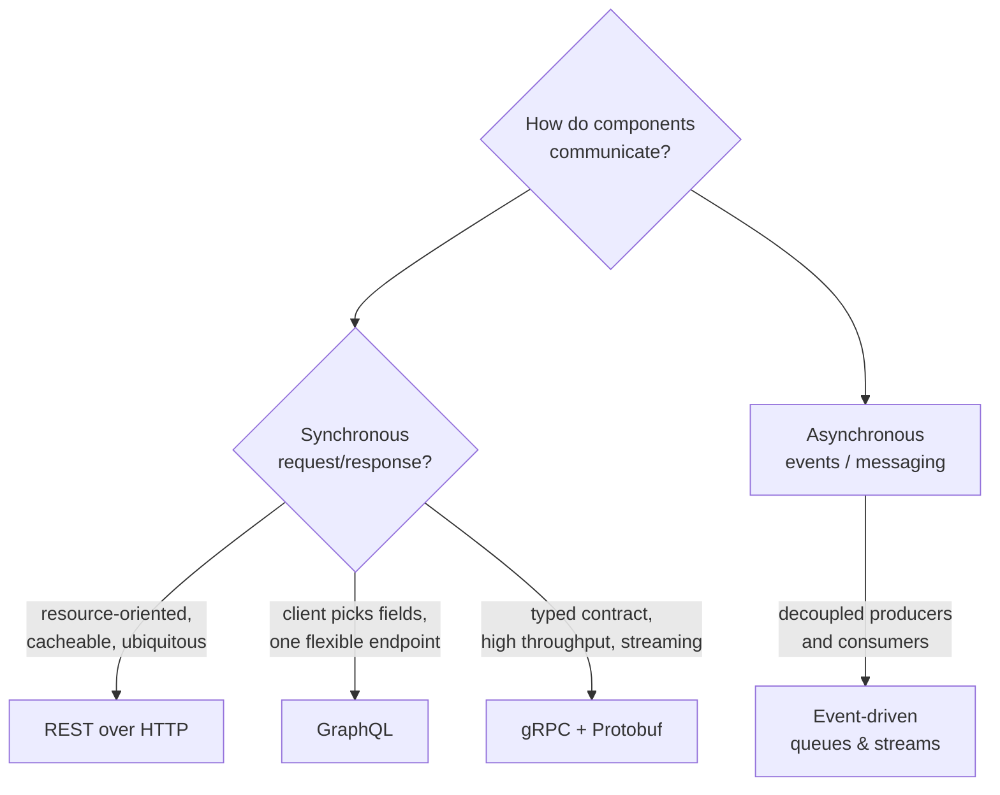

  <h1 style="color: white; margin: 0; font-size: 2.5rem;">API Design &amp; Communication</h1>
  
REST, GraphQL, gRPC, and event-driven messaging — choosing and designing the contracts between services

An API is a contract. It defines how a client and a server — or two services, or a service and the outside world — agree to exchange information without either side knowing the other's internals. The hard part is rarely the wire protocol; it is choosing the *style* that fits your coupling, evolution, and performance needs, then designing a contract that stays stable as both sides change. This hub frames the major API styles, shows when each one earns its keep, and routes you into focused pages for REST, GraphQL, gRPC/Protocol Buffers, and asynchronous event-driven communication.

  
<i class="fas fa-file-signature"></i><h4>An API is a contract, not code</h4>
The interface is a promise about request shapes, responses, and errors. Implementations change freely; the contract must stay stable or version explicitly.

  
<i class="fas fa-exchange-alt"></i><h4>Coupling is the real choice</h4>
Synchronous request/response couples caller to callee in time and availability. Asynchronous events decouple them — at the cost of eventual consistency and harder debugging.

  
<i class="fas fa-code-branch"></i><h4>Design for evolution</h4>
Every API outlives its first client. Additive change, explicit versioning, and forward/backward-compatible schemas are not luxuries — they are the difference between a living API and a frozen one.

  
<i class="fas fa-ruler-combined"></i><h4>No style is universally best</h4>
REST, GraphQL, gRPC, and events each optimize for different forces — cacheability, flexible queries, raw throughput, or decoupling. The right answer is "it depends," and this hub makes the dependencies explicit.

## Overview

Every non-trivial system is a collection of components that must talk to each other: a browser to a backend, a mobile app to an aggregation layer, one microservice to another, a producer to a stream of consumers. **API design is the discipline of defining those conversations well** — choosing how requests are shaped, how responses come back, how errors are reported, and how the whole contract evolves without breaking the people who depend on it.

**What you'll get:** a working mental model of the four dominant communication styles, a decision framework for picking among them, and curated links into focused pages that develop each style with concrete schemas, code, and trade-offs.

**Assumed background:** comfort with HTTP, JSON, and at least one programming language. No prior experience with GraphQL, gRPC, or message brokers is required — each child page builds from first principles.

### Two Axes That Decide Everything

Most API decisions collapse onto two questions. First, **is the interaction synchronous or asynchronous?** Synchronous means the caller blocks waiting for a reply and is coupled to the callee's availability; asynchronous means the caller fires a message and moves on, decoupled in time. Second, **who owns the shape of the response — the server or the client?** REST and gRPC hand the server a fixed set of endpoints; GraphQL lets the client compose exactly the fields it needs.

### The Four Styles at a Glance

The pages in this hub cover four families of API style. They are not mutually exclusive — a real system often exposes REST to the public web, GraphQL to its own front-ends, gRPC between internal services, and events for background work — but each optimizes for a different set of forces.

| Style | Shape | Optimizes for | Pays with |
|-------|-------|---------------|-----------|
| **REST** | Resources + HTTP verbs | Cacheability, simplicity, ubiquity, statelessness | Over-/under-fetching, many round trips |
| **GraphQL** | Single endpoint + typed query | Client-driven shaping, no over-fetching, schema introspection | Caching complexity, N+1 risk, server effort |
| **gRPC** | Typed RPC over HTTP/2 | Throughput, low latency, streaming, strong contracts | Browser/firewall friction, less human-readable |
| **Events** | Messages over a broker | Decoupling, buffering, fan-out, resilience | Eventual consistency, harder tracing & ordering |

### Choosing a Style

There is no universally correct answer, but the forces below push strongly in one direction or another. Use this as a starting heuristic, then read the relevant child page for the full trade-off analysis.

- **Public, cache-friendly, broadly consumed API?** Reach for [REST](rest.html). It rides on HTTP semantics every client, proxy, and CDN already understands, and stateless resources scale horizontally without coordination.
- **Rich client (mobile/SPA) hitting many resources per screen?** [GraphQL](graphql.html) lets the client fetch exactly the graph it needs in one round trip, eliminating the over-fetching and chatty round trips that plague REST front-ends.
- **High-volume internal service-to-service calls?** [gRPC](grpc-and-protobuf.html) gives you a strongly typed, binary, HTTP/2 contract with bidirectional streaming and code generation — ideal inside a trusted network where raw throughput and latency matter.
- **Work that should not block the caller, or many consumers of one event?** [Asynchronous messaging](async-and-events.html) decouples producers from consumers, absorbs traffic spikes, and lets you fan out a single event to many independent handlers.

### Design Concerns Every Style Shares

Regardless of the style you pick, a handful of cross-cutting concerns recur on every page in this hub:

1. **Versioning & evolution** — additive change where possible; explicit versioning (URI, header, or schema-level) when a breaking change is unavoidable.
2. **Error handling** — a consistent, machine-readable error model so clients can distinguish "retry me" from "you sent garbage."
3. **Idempotency** — designing operations so that a client safely retrying a request (after a timeout or partition) does not double-charge or double-create.
4. **Authentication & authorization** — who may call which operation, carried in a way the transport supports.
5. **Pagination, filtering, and rate limiting** — bounding the size and frequency of responses so one client cannot exhaust the server.

These concerns connect directly to the [Distributed Systems](../distributed-systems/) hub — idempotency, retries, and partial failure are distributed-systems problems wearing an API hat — and to [Networking](../technology/networking/), which governs the latency, ordering, and reliability of the bytes underneath every call.

## Explore the Topics

The pages below are ordered from the most familiar style to the most decoupled. Start with REST for the resource-oriented baseline, then layer in client-driven querying, high-performance RPC, and finally asynchronous messaging.

  <a href="rest.html" class="nav-card">
    <h4><i class="fas fa-server"></i> REST APIs</h4>
    
Resource-oriented design over HTTP — verbs, status codes, statelessness, HATEOAS, caching, pagination, and versioning.

  </a>
  <a href="graphql.html" class="nav-card">
    <h4><i class="fas fa-project-diagram"></i> GraphQL</h4>
    
A typed schema and a single endpoint where the client asks for exactly the fields it needs — resolvers, the N+1 problem, and caching.

  </a>
  <a href="grpc-and-protobuf.html" class="nav-card">
    <h4><i class="fas fa-bolt"></i> gRPC &amp; Protocol Buffers</h4>
    
Strongly typed RPC over HTTP/2 with binary Protobuf messages, code generation, deadlines, and four flavors of streaming.

  </a>
  <a href="async-and-events.html" class="nav-card">
    <h4><i class="fas fa-stream"></i> Async &amp; Event-Driven</h4>
    
Decoupling with queues and streams — messaging patterns, delivery guarantees, ordering, idempotent consumers, and webhooks.

  </a>

### What You'll Find

| Page | What it covers |
|------|----------------|
| [REST APIs](rest.html) | Resources and HTTP verbs, status codes, statelessness, HATEOAS, caching, pagination, idempotency, and versioning strategies |
| [GraphQL](graphql.html) | Schema definition language, queries/mutations/subscriptions, resolvers, the N+1 problem and dataloaders, caching, and federation |
| [gRPC & Protocol Buffers](grpc-and-protobuf.html) | Protobuf message and service definitions, code generation, unary and streaming RPCs, deadlines, interceptors, and wire-format evolution |
| [Async & Event-Driven](async-and-events.html) | Queues vs. streams, pub/sub, at-least-once vs. exactly-once delivery, ordering, idempotency, the outbox pattern, and webhooks |

## Learning Path

There is no single correct route, but the following order builds each idea on the one before it:

1. **Start with the baseline.** Read [REST APIs](rest.html) for resource-oriented design, HTTP semantics, and the versioning and error-handling concerns that recur everywhere else.
2. **Let the client drive.** [GraphQL](graphql.html) shows how moving response-shaping to the client fixes REST's over-/under-fetching — and the new problems (caching, N+1) that creates.
3. **Optimize the internal hop.** [gRPC & Protocol Buffers](grpc-and-protobuf.html) trades human-readability for a typed, binary, streaming contract built for high-throughput service-to-service calls.
4. **Cut the synchronous cord.** [Async & Event-Driven](async-and-events.html) replaces request/response with messages, decoupling producers from consumers and trading immediacy for resilience.

To see how these contracts behave under partition, retry, and partial failure, branch into [Distributed Systems](../distributed-systems/); to understand the transport beneath every call, see [Networking](../technology/networking/).

## Key Takeaways

  
<h4>Design the contract first</h4>
Agree on request shapes, responses, and errors before writing implementations. The contract is the product; the code behind it is replaceable.

  
<h4>Match the style to the coupling</h4>
Synchronous REST/GraphQL/gRPC for "I need an answer now"; asynchronous events for "do this eventually" and one-to-many fan-out.

  
<h4>Plan for evolution from day one</h4>
Prefer additive changes, version explicitly when you must break, and keep schemas forward- and backward-compatible.

  
<h4>Make retries safe</h4>
Networks fail mid-request. Idempotency keys and idempotent consumers turn a client retry from a double-charge into a no-op.

  
<h4>Errors are part of the API</h4>
A consistent, machine-readable error model is as important as the success path — clients code against both.

  
<h4>Mix styles deliberately</h4>
Real systems combine REST at the edge, GraphQL for front-ends, gRPC internally, and events for background work. Choose per interaction, not per system.

## See Also

  <h4>Where to go next</h4>
  <ul>
    <li><a href="../distributed-systems/">Distributed Systems</a> — idempotency, retries, partial failure, and the consistency models your APIs must respect.</li>
    <li><a href="../technology/networking/">Networking</a> — TCP/IP, HTTP/2, latency, and ordering: the substrate every API call rides on.</li>
    <li><a href="../technology/database-design/">Database Design</a> — the data models your resources, types, and events are projections of.</li>
    <li><a href="../technology/kubernetes/">Kubernetes</a> — deploying, discovering, and load-balancing the services your APIs expose.</li>
    <li><a href="../technology/cybersecurity/">Cybersecurity</a> — authentication, authorization, and securing API endpoints against abuse.</li>
  </ul>

### Further Reading

- "Designing Data-Intensive Applications" by Martin Kleppmann — the trade-offs behind every API and messaging choice
- "RESTful Web APIs" by Leonard Richardson, Mike Amundsen & Sam Ruby
- "Production-Ready GraphQL" by Marc-André Giroux
- [Google API Design Guide](https://cloud.google.com/apis/design)
- [gRPC documentation](https://grpc.io/docs/)
