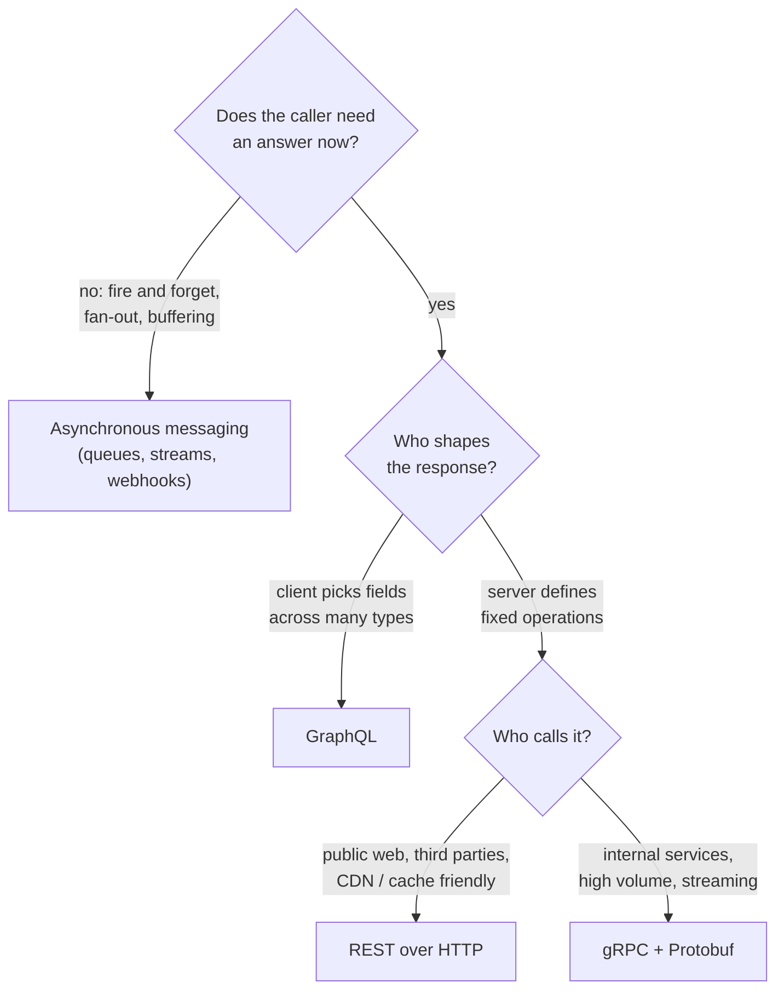
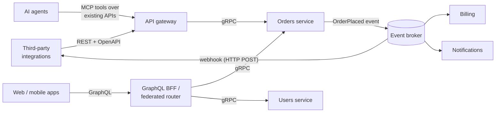

  <h1 style="color: white; margin: 0; font-size: 2.5rem;">API Design &amp; Communication</h1>
  
REST, GraphQL, gRPC, and event-driven messaging — choosing and designing the contracts between services

An **API** is a contract that lets two pieces of software exchange information without knowing each other's internals: a browser and a backend, a mobile app and an aggregation layer, two microservices, a producer and its consumers. The wire protocol is rarely the hard part. The hard part is picking the *style* that fits the coupling, evolution, and performance needs of an interaction, then keeping the contract stable while both sides keep changing. This hub compares the four main styles and links to a page on each: REST, GraphQL, gRPC/Protocol Buffers, and asynchronous messaging.

The pages assume you are comfortable with HTTP, JSON, and at least one programming language. They do not assume prior GraphQL, gRPC, or message-broker experience.

## Core principles

A few ideas apply to every style covered here:

- **The contract is the product.** The interface is a promise about request shapes, responses, and errors. Implementations can be rewritten freely; the contract must either stay compatible or be versioned explicitly.
- **Coupling is the real decision.** Synchronous request/response couples the caller to the callee's latency and availability. Asynchronous messaging removes that coupling but brings eventual consistency and harder debugging.
- **Every API outlives its first client.** Additive change, explicit versioning, and schemas that stay compatible in both directions separate an API that can evolve from one that is frozen.
- **No style wins everywhere.** Each one optimizes for something different: cacheability, client-shaped queries, raw throughput, or decoupling.

## Two questions that narrow the choice

Most API style decisions come down to two questions:

1. **Synchronous or asynchronous?** In a synchronous call the caller waits for the reply and depends on the callee being up. In an asynchronous exchange the caller publishes a message and moves on.
2. **Who shapes the response?** REST and gRPC give the server a fixed set of operations with fixed response types. GraphQL lets the client choose exactly which fields it gets back.

## The four styles compared

The styles can be combined. Many production systems expose REST to the public web, run GraphQL as a backend-for-frontend for their own apps, use gRPC between internal services, and use events for background work.

| | REST | GraphQL | gRPC | Async messaging |
|---|---|---|---|---|
| **Model** | Resources + HTTP methods | Typed graph, one endpoint | Remote procedures on typed services | Messages/events on a broker |
| **Contract / IDL** | OpenAPI (3.2, Sept 2025) | GraphQL SDL (spec edition Sept 2025) | Protocol Buffers (`.proto`, Editions) | AsyncAPI (3.1), schema registries |
| **Transport** | HTTP/1.1, /2, /3 | Usually HTTP POST; WebSocket/SSE for subscriptions | HTTP/2 (gRPC-Web or Connect for browsers) | Kafka, AMQP, MQTT, NATS, HTTP webhooks |
| **Encoding** | JSON (usually) | JSON | Binary protobuf | Any (JSON, Avro, protobuf) |
| **Streaming** | SSE, chunked responses | Subscriptions, `@defer`/`@stream` (proposals) | Unary, client-, server-, and bidi streams | Native |
| **HTTP caching** | Native (`Cache-Control`, ETags, CDNs) | Hard (POST, one URL); persisted queries help | None built in | N/A |
| **Optimizes for** | Simplicity, ubiquity, cacheability | Client-driven shaping, fewer round trips | Throughput, latency, strong typing | Decoupling, buffering, fan-out |
| **Pays with** | Over-/under-fetching, chatty clients | Server complexity, N+1 risk, cost control | Browser/proxy friction, opaque on the wire | Eventual consistency, ordering, tracing |

### Choosing a style

These are starting heuristics. Each child page covers the trade-offs in detail.

- **Public, broadly consumed, or cache-heavy API:** [REST](rest.html). It builds on HTTP semantics that every client, proxy, and CDN already implements, and stateless resources scale horizontally.
- **Rich clients (SPA, mobile) that load many related resources per screen:** [GraphQL](graphql.html). The client fetches the exact graph it needs in one round trip, avoiding over-fetching and request waterfalls.
- **High-volume internal service-to-service calls:** [gRPC](grpc-and-protobuf.html). You get a strongly typed binary contract over HTTP/2 with generated clients, deadlines, and bidirectional streaming.
- **Work that should not block the caller, or one event with many consumers:** [asynchronous messaging](async-and-events.html). A broker absorbs traffic spikes, keeps working when consumers are down, and fans a single event out to independent handlers.

### Styles in one system

In practice the choice is made per interaction, not per system. A typical layout:

AI agents have become a significant class of API consumer. The **Model Context Protocol (MCP)**, released by Anthropic in November 2024 and handed to the Linux Foundation's Agentic AI Foundation in December 2025, is now the common way to expose existing APIs to LLM-based agents as tools. An API with clear operation descriptions, precise schemas, and machine-readable errors works well for agents for the same reasons it works well for human developers.

## Concerns every style shares

The same cross-cutting problems come up on every page in this hub:

| Concern | What it means | REST | GraphQL | gRPC | Async |
|---|---|---|---|---|---|
| **Evolution & versioning** | Changing the contract without breaking clients | URI or media-type versions, `Deprecation`/`Sunset` headers | Additive schema, `@deprecated`, no versions | Field numbers, reserved tags, package versions | Schema registry compatibility rules |
| **Errors** | Machine-readable failure model | Status codes + RFC 9457 problem details | `errors` array beside partial `data` | Status codes + rich `google.rpc.Status` details | Dead-letter queues, error events |
| **Idempotency** | Safe retries after timeouts | Method semantics + `Idempotency-Key` | Client-supplied mutation IDs | Idempotent method design, retry policy | Idempotent consumers, dedup keys |
| **Auth** | Who may call what | OAuth 2 bearer tokens, API keys | Same, plus field-level authorization | mTLS + per-call tokens | Broker ACLs, signed webhooks |
| **Bounding load** | Keeping one client from exhausting the server | Pagination, rate limits (`429`) | Depth/complexity limits, persisted queries | Deadlines, flow control, message size limits | Backpressure, consumer lag |

These problems overlap heavily with the [Distributed Systems](../distributed-systems/) hub, since idempotency, retries, and partial failure are distributed-systems problems that show up at the API boundary. The latency, ordering, and reliability of the bytes underneath every call are covered in [Networking](../technology/networking/).

## Pages in this section

The pages run from the most familiar style to the most decoupled. REST sets up the HTTP semantics, versioning, and error-handling ideas that recur everywhere. GraphQL moves response shaping to the client, which fixes over- and under-fetching but creates caching and N+1 problems. gRPC gives up human readability to get a typed, binary, streaming contract. Asynchronous messaging drops request/response entirely and gets decoupling and resilience in exchange for immediacy.

| Page | What it covers |
|------|----------------|
| [REST APIs](rest.html) | Constraints, resource modeling, HTTP method and status semantics, versioning and deprecation, pagination, idempotency keys, rate limiting, caching and concurrency control, problem details, OpenAPI |
| [GraphQL](graphql.html) | Schema definition language, queries/mutations/subscriptions, resolvers, the N+1 problem and DataLoader, caching, and federation |
| [gRPC & Protocol Buffers](grpc-and-protobuf.html) | Protobuf messages and services, code generation, unary and streaming RPCs, deadlines, interceptors, and wire-format evolution |
| [Async & Event-Driven](async-and-events.html) | Queues vs. streams, pub/sub, delivery guarantees, ordering, idempotent consumers, the outbox pattern, and webhooks |

## See also

- [Distributed Systems](../distributed-systems/): idempotency, retries, partial failure, and the consistency models your APIs must respect.
- [Microservices & Event-Driven Architecture](../distributed-systems/microservices-and-event-driven.html): API gateways and service-to-service communication patterns.
- [Event-Driven Architecture](../event-driven/): brokers, streaming platforms, and event patterns in depth.
- [Networking](../technology/networking/): TCP/IP, HTTP/2 and HTTP/3, latency, and ordering.
- [Database Design](../technology/database-design/): the data models your resources, types, and events project.
- [Kubernetes](../technology/kubernetes/): deploying, discovering, and load-balancing the services behind your APIs.
- [Cybersecurity](../technology/cybersecurity/): authentication, authorization, and protecting API endpoints from abuse.

### Further reading

- Martin Kleppmann, *Designing Data-Intensive Applications* (2nd ed. with Chris Riccomini, O'Reilly): the trade-offs behind every API and messaging choice.
- Leonard Richardson, Mike Amundsen & Sam Ruby, *RESTful Web APIs* (O'Reilly).
- Marc-André Giroux, *Production Ready GraphQL*.
- [Google API Design Guide](https://cloud.google.com/apis/design) and the [AIP](https://google.aip.dev/) series.
- [OpenAPI Specification](https://spec.openapis.org/oas/latest.html), [GraphQL specification](https://spec.graphql.org/), [gRPC documentation](https://grpc.io/docs/), [AsyncAPI](https://www.asyncapi.com/).
- [OWASP API Security Top 10 (2023)](https://owasp.org/API-Security/editions/2023/en/0x11-t10/).
