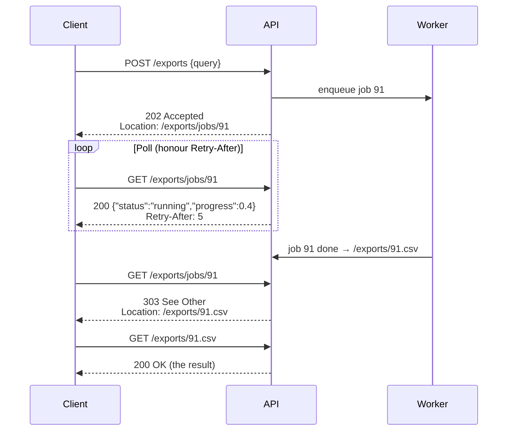
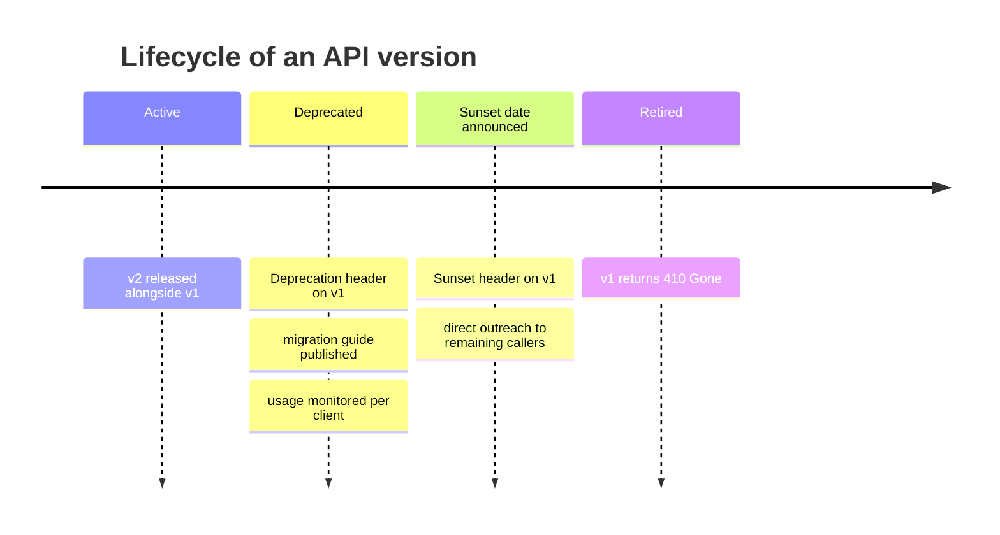
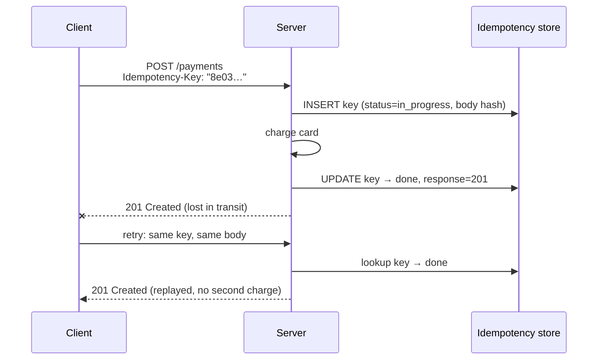
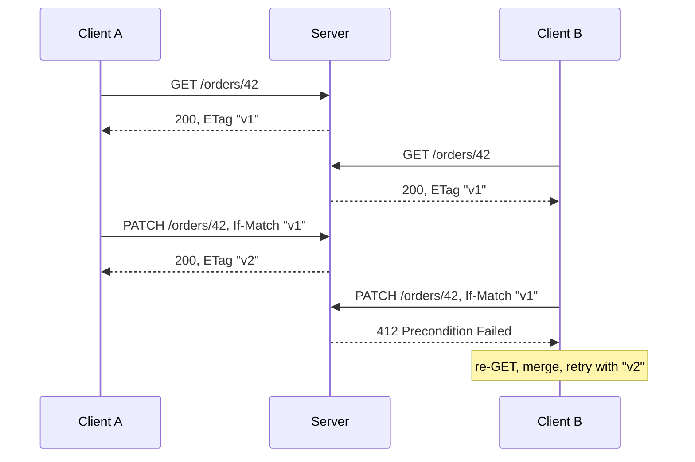
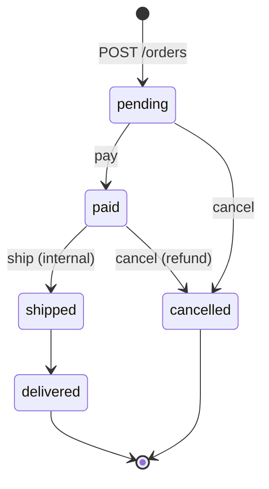

[API Design](./) &raquo; REST

**REST** (Representational State Transfer) is an *architectural style*, not a protocol or framework. It is a set of constraints that, when an API follows them, give it the same scalability, evolvability, and cacheability as the web. In everyday use "REST API" usually just means "JSON over HTTP". The benefits, though, come from applying the underlying ideas: model the domain as **resources** with stable identifiers, operate on them through the **uniform interface** of HTTP methods, status codes, and headers, keep each request **stateless**, and have responses declare their own cacheability.

This page covers the REST constraints, resource and URI design, HTTP method and status-code semantics (per RFC 9110), error bodies (RFC 9457), versioning and deprecation, pagination and filtering, idempotency keys, concurrency control and caching, rate limiting, authentication, hypermedia, and OpenAPI contracts.

## Table of contents
{: .no_toc .text-delta }

1. TOC
{:toc}

---

## Constraints

Roy Fielding defined REST in his 2000 doctoral dissertation as the architectural style behind HTTP and the web. It consists of six constraints. The first five are required, and the sixth is optional.

| Constraint | Requirement | What it gives you |
|---|---|---|
| **Client–server** | UI concerns are separated from data storage | Each side can evolve independently |
| **Stateless** | Every request carries everything the server needs to process it, and the server keeps no per-client session | Any instance can serve any request, so you scale horizontally behind a load balancer |
| **Cacheable** | Responses state whether and for how long they can be cached | Browsers, proxies, and CDNs can answer repeat requests without contacting the origin |
| **Uniform interface** | A fixed, shared set of methods and conventions (see below) | Generic clients, proxies, and tools work with any API |
| **Layered system** | A client cannot tell whether it is talking to the origin or an intermediary | Gateways, caches, and WAFs can be inserted transparently |
| **Code on demand** *(optional)* | The server may send executable code to the client | Rarely relevant to API design |

The **uniform interface** is the central constraint and has four parts:

- **Resource identification**: every resource has a stable URI.
- **Manipulation through representations**: a client changes a resource by exchanging representations of it (such as a JSON document), not by invoking server procedures.
- **Self-descriptive messages**: the method, status, `Content-Type`, and caching headers make each message understandable on its own.
- **Hypermedia as the engine of application state (HATEOAS)**: responses contain links to the valid next actions (see [Hypermedia](#hypermedia-hateoas)).

Breaking a constraint has concrete costs. Server-side sessions break horizontal scaling. `POST /getUser` hides a safe read from every cache. Returning `200 OK` with an error body hides failures from monitoring. In each case you give up something the constraint was providing.

### Richardson Maturity Model

Leonard Richardson's maturity model is a common way to describe how fully an API adopts REST:

| Level | Name | What it looks like |
|---|---|---|
| 0 | The swamp of POX | One URI, one method; RPC tunneled through HTTP (`POST /api` with an action in the body) |
| 1 | Resources | Separate URIs per resource, but every call is still one method (usually POST) |
| 2 | HTTP verbs | Correct methods and status codes; this is where most production "REST" APIs sit |
| 3 | Hypermedia controls | Responses include links that drive state transitions |

Few public APIs reach level 3. Stopping at level 2 is a reasonable, deliberate choice for most APIs.

## Resource modeling

The first design task is to identify the **resources**, meaning the nouns the API exposes, and give each one a stable identifier. Anything worth naming can be a resource: an order, a user, the collection of all users, a saved search, even a long-running job. The central skill is moving from a procedural view (`createOrder`, `cancelOrder`) to a resource view (`POST /orders`, then `PATCH /orders/42` or `POST /orders/42/cancellation`).

### URI design

- **Use nouns.** The HTTP method is the verb: `GET /orders`, not `GET /getOrders`.
- **Name collections in the plural.** `/orders` is the collection and `/orders/42` is a member of it.
- **Nest only to show ownership, and keep it shallow.** `/users/7/orders` means "user 7's orders". Stop at one or two levels. Once a child has a globally unique ID, give it a top-level address (`/orders/42`) as well.
- **Use lowercase, hyphenated path segments**, for example `/shipping-addresses`. Choose one casing for JSON fields (`camelCase` or `snake_case`) and apply it everywhere.
- **Use opaque, stable identifiers.** Prefer UUIDs or similar IDs over auto-increment integers in public URIs. Sequential IDs leak volume and invite enumeration attacks (see [Security](#authentication-and-security)).
- **Model awkward actions as resources where you can.** A "cancel" operation can be a state change (`PATCH /orders/42 {"status":"cancelled"}`) or a new resource (`POST /orders/42/cancellation`). Keep RPC-style action URIs (`POST /orders/42:cancel` in Google's AIP style, or `POST /orders/42/cancel`) for operations that really are not CRUD.

| Goal | Good | Avoid |
|------|------|-------|
| List a collection | `GET /orders` | `GET /getAllOrders` |
| Fetch one item | `GET /orders/42` | `GET /order?id=42` |
| A user's orders | `GET /users/7/orders` or `GET /orders?customer_id=7` | `GET /users/7/orders/42/items/3/notes` |
| Create | `POST /orders` | `POST /orders/create` |
| Replace | `PUT /orders/42` | `POST /orders/42/update` |
| Non-CRUD action | `POST /orders/42/cancellation` | `GET /cancelOrder?id=42` |

### Representations and content negotiation

A resource is distinct from its **representation**. `/orders/42` is the order, and the JSON document returned by `GET` is one representation of it. With **content negotiation**, the same resource can be served in different formats depending on the `Accept` request header:

```http
GET /orders/42 HTTP/1.1
Accept: application/json
```

The server answers with the matching `Content-Type`. If it cannot produce any acceptable format it returns `406 Not Acceptable`, and if the request *body* is in an unsupported format it returns `415 Unsupported Media Type`. Most APIs only serve JSON, but the principle (one resource, many representations) is the reason a URI names the resource and not a file.

### Relationships

Represent relationships as links between resources, not as copied blobs. An order refers to its customer (`"customer": "/customers/7"`), and the client follows that link when it needs the details. This keeps payloads small and avoids stale duplicated data. When a client almost always needs the related data, allow opt-in embedding with `?expand=customer` (see [Filtering](#filtering-sorting-and-field-selection)).

## HTTP methods

RFC 9110 (*HTTP Semantics*, 2022) is the current definition of methods and status codes. It consolidates and replaces RFC 7230–7235. Following these semantics lets caches, proxies, retry middleware, and client libraries handle your API correctly without knowing anything about your domain.

| Method | Purpose | Safe | Idempotent | Body | Cacheable | Typical success |
|--------|---------|:----:|:----------:|:----:|:---------:|-----------------|
| `GET` | Retrieve a representation | Yes | Yes | No | Yes | `200 OK` |
| `HEAD` | GET without the body | Yes | Yes | No | Yes | `200 OK` |
| `QUERY` | Safe query with a request body (RFC 10008) | Yes | Yes | Yes | Yes | `200 OK` |
| `POST` | Create a subordinate resource, or perform an action | No | No | Yes | Rarely | `201 Created` / `200 OK` / `202 Accepted` |
| `PUT` | Create or replace at a known URI | No | Yes | Yes | No | `200 OK` / `201 Created` / `204 No Content` |
| `PATCH` | Partial update (RFC 5789) | No | Not guaranteed | Yes | No | `200 OK` / `204 No Content` |
| `DELETE` | Remove the resource | No | Yes | No | No | `204 No Content` / `202 Accepted` |
| `OPTIONS` | Describe communication options (and CORS preflight) | Yes | Yes | No | No | `204 No Content` |

- **Safe** methods must not change server state from the client's point of view. Crawlers, link prefetchers, and caches call `GET` freely, so a `GET` that deletes something is a serious bug.
- **Idempotent** methods leave the server in the same state whether they run once or many times. Calling `DELETE /orders/42` twice still leaves the order deleted, although the second call may return `404`. Idempotency is what makes **automatic retries** safe: HTTP clients and proxies may retry idempotent requests after a connection failure.
- **`PATCH` is not inherently idempotent.** A JSON Patch operation `{"op":"add","path":"/tags/-","value":"x"}` appends every time it runs. A merge patch that sets fields to absolute values usually is idempotent. Design patches to be idempotent where possible, and make them safe to retry with preconditions (`If-Match`) or idempotency keys.

### POST, PUT, and PATCH

- **POST** creates a resource at a URI the *server* chooses. `POST /orders` returns `201 Created` and a `Location: /orders/42` header. Two identical POSTs create two orders, which is why POST needs [idempotency keys](#idempotency-keys) to be retried safely.
- **PUT** creates or completely replaces the resource at a URI the *client* already knows. Sending the same `PUT /users/7` twice results in the same state. Fields left out of a PUT body are removed or reset, not left unchanged.
- **PATCH** applies a partial modification. The two standard patch formats are:
  - **JSON Merge Patch** (RFC 7396, `application/merge-patch+json`): send an object shaped like the resource. Fields present are set, and `null` deletes a field. It is simple, but it cannot set a field to `null` or edit individual array elements.
  - **JSON Patch** (RFC 6902, `application/json-patch+json`): an ordered list of `add`/`remove`/`replace`/`move`/`copy`/`test` operations addressed by JSON Pointer. It is more expressive, and `test` operations can act as preconditions.

### QUERY: safe requests with a body

Complex searches have long been awkward in REST. A `GET` query string has practical length limits and cannot carry structured filters, and `POST /orders/search` works but gives up safety, idempotency, and caching. **RFC 10008** (June 2026) standardizes the `QUERY` method for this case. It sends its query in the request body, like POST, but is defined as safe, idempotent, and cacheable, with the request body included in the cache key. Resources advertise support and accepted formats with the `Accept-Query` response header:

```http
QUERY /orders HTTP/1.1
Content-Type: application/json
Accept: application/json

{ "status": ["pending", "paid"], "total": { "gte": 100 }, "sort": "-created_at" }
```

Support in frameworks, proxies, and CDNs is still being rolled out, and OpenAPI 3.2 already describes it. Until your whole request path supports QUERY, `POST .../search` remains the pragmatic fallback.

## Status codes

Return the most specific accurate code. The status line tells generic infrastructure what happened, and the body gives the details.

| Code | Meaning | Use it when |
|---|---|---|
| `200 OK` | Success with a body | Normal reads and updates |
| `201 Created` | A resource was created | After POST/PUT creates something; include `Location` |
| `202 Accepted` | Accepted for asynchronous processing | Long-running work; return a status-monitor URL (see [below](#long-running-operations)) |
| `204 No Content` | Success, no body | DELETE, or updates that return nothing |
| `301` / `308` | Moved permanently | The resource has a new URI. `308` keeps the method and body, `301` may turn POST into GET |
| `304 Not Modified` | Conditional GET hit | The client's cached copy is still valid |
| `400 Bad Request` | Malformed request | Unparseable JSON, wrong types, missing required fields |
| `401 Unauthorized` | Not authenticated | Missing or invalid credentials; **must** include `WWW-Authenticate` |
| `403 Forbidden` | Authenticated but not allowed | The caller lacks permission |
| `404 Not Found` | No such resource | Also used in place of 403 to avoid revealing that a resource exists |
| `405 Method Not Allowed` | Wrong method for this URI | Include an `Allow` header |
| `409 Conflict` | Conflicts with current state | Duplicate unique key, invalid state transition, concurrent idempotent request |
| `410 Gone` | Deliberately removed | A retired endpoint or resource that will not return |
| `412 Precondition Failed` | `If-Match` / `If-Unmodified-Since` failed | Optimistic-concurrency conflict |
| `415 Unsupported Media Type` | Wrong request `Content-Type` | The body format is not accepted |
| `422 Unprocessable Content` | Well-formed but semantically invalid | Business-rule validation failures (renamed from "Unprocessable Entity" in RFC 9110) |
| `428 Precondition Required` | The server requires a conditional request | Enforce `If-Match` on updates |
| `429 Too Many Requests` | Rate-limited | Include `Retry-After` |
| `500 Internal Server Error` | Unexpected fault | A bug; never intentionally |
| `502` / `504` | Bad upstream response / upstream timeout | Gateway-level failures, often transient |
| `503 Service Unavailable` | Overloaded or in maintenance | Transient; include `Retry-After` |

The split between `4xx` and `5xx` tells the client what to do next. A `4xx` means the request is at fault and sending it again unchanged will not help (except `408`, `425`, and `429`, which invite a later retry). A `5xx` means the server is at fault, and retrying later, ideally with exponential backoff and jitter, may succeed.

> **The most common mistake** is returning `200 OK` with `{"error": "..."}` in the body. Every client, monitoring dashboard, proxy, and retry policy that looks at the status line will treat the failure as a success, and every caller has to parse the body to find out what actually happened.

### Error bodies: problem details (RFC 9457)

Ad-hoc error bodies (`{"error":"bad"}` in one place and `{"message":"...","code":7}` in another) force clients to special-case every endpoint. **RFC 9457, *Problem Details for HTTP APIs*** (2023, which replaces RFC 7807) defines a standard JSON shape served as `application/problem+json`:

```http
HTTP/1.1 422 Unprocessable Content
Content-Type: application/problem+json

{
  "type": "https://api.example.com/problems/validation-error",
  "title": "Request failed validation",
  "status": 422,
  "detail": "2 fields are invalid.",
  "instance": "/orders",
  "errors": [
    { "pointer": "#/items/0/quantity", "detail": "must be greater than 0" },
    { "pointer": "#/shipping/postcode", "detail": "is required" }
  ]
}
```

| Member | Purpose |
|---|---|
| `type` | URI identifying the problem type, ideally resolving to documentation. This is the stable field clients should branch on. Defaults to `about:blank`. |
| `title` | Short human-readable summary of the *type*; does not change between occurrences |
| `status` | The HTTP status code, repeated for convenience |
| `detail` | Human-readable explanation of *this* occurrence; clients should not parse it |
| `instance` | URI identifying this specific occurrence (useful for support and log correlation) |

**Extension members** (such as `errors` above, or `balance` for an insufficient-funds problem) carry machine-readable details. RFC 9457 also adds guidance on reporting multiple problems and a shared IANA registry of common problem types. Use one error format across the whole API. Consistency matters more than any particular choice of fields.

### Long-running operations

Work that takes longer than a normal request timeout (exports, video transcoding, provisioning) should not keep a connection open. The standard pattern is **202 Accepted plus a status monitor resource**:



Polling is simple and works through any firewall. If you want to avoid it, let the client register a **webhook** callback, or stream progress with **Server-Sent Events**. Model failures as a terminal job state that contains a problem-details object.

## Versioning and deprecation

Once clients depend on an API, you cannot make breaking changes without warning them. **Additive** changes such as new optional fields, new endpoints, and new enum values that clients are told to tolerate are backward-compatible. **Breaking** changes need a new version or a migration window. These include removing or renaming a field, changing a type, making an optional field required, and tightening validation.

Clients share responsibility for compatibility. They should ignore unknown fields (the *tolerant reader* pattern) and not assume enums are closed. Without that, even additive changes break them.

| Strategy | Example | Pros | Cons |
|----------|---------|------|------|
| **URI path** | `GET /v1/orders` | Visible, simple to route and cache, easy to test in a browser | The same resource has several URIs; tends to encourage "big bang" versions |
| **Header / media type** | `Accept: application/vnd.acme.v2+json` | URIs stay stable; versions each representation | Invisible in logs and browsers; routing and caching need `Vary` |
| **Date-based header** | `Stripe-Version: 2024-06-20` | Fine-grained, per-client pinning; many small changes instead of a v2 | The server must maintain transformation layers for every supported version |
| **Query parameter** | `GET /orders?api-version=2024-10-21` | Easy to set a default | Easy to forget; muddies cache keys |

URI versioning is the most common because it is the simplest to operate. Date-based versioning, where each account is pinned to the version current when it integrated and upgrades explicitly, is used by Stripe and Azure's `api-version` parameter and scales well for large public APIs.

Retire old versions through a published lifecycle, and announce it in the protocol as well as in documentation:

```http
HTTP/1.1 200 OK
Deprecation: @1767225600
Sunset: Sun, 01 Nov 2026 00:00:00 GMT
Link: <https://developer.example.com/migrate-v2>; rel="deprecation"; type="text/html"
```

- **`Deprecation`** (RFC 9745, March 2025) says the resource is or will be deprecated. Its value is a structured-field date (`@` followed by Unix seconds). The resource keeps working unchanged.
- **`Sunset`** (RFC 8594) gives the date after which the resource may stop responding.
- A `Link` with `rel="deprecation"` points to migration documentation.



## Pagination

A collection endpoint must never return an unbounded list. Always paginate, apply a default page size, and enforce a maximum.

| Style | Request | Strengths | Weaknesses |
|---|---|---|---|
| **Offset / limit** | `?limit=20&offset=40` | Jump to any page; easy to show total pages | Slow at depth; rows shift under concurrent inserts and deletes, causing skipped or duplicated items |
| **Cursor / keyset** | `?limit=20&after=eyJpZCI6NDJ9` | Stable under writes; constant cost at any depth | No random access; the sort key must be unique (use a tiebreaker such as `id`) |

Cursor pagination is the right default for large, frequently changing, or infinite-scroll collections. The cursor should be **opaque** to clients (for example, base64-encoded `(created_at, id)` of the last row), so the server can change its encoding later.

```json
{
  "data": [ { "id": 41, "...": "..." }, { "id": 42, "...": "..." } ],
  "next_cursor": "eyJpZCI6NDJ9",
  "has_more": true
}
```

Alternatively, put navigation links in the RFC 8288 `Link` header (`Link: </orders?after=eyJpZCI6NDJ9>; rel="next"`), which is how GitHub's API paginates. Avoid returning an exact `total_count` on very large tables unless clients need it, because `COUNT(*)` can cost more than the page itself.

The performance difference comes from what the database does. Returning $n$ rows after skipping $\text{offset}$ rows costs on the order of

$$
O(\text{offset} + n)
$$

because the engine still reads and discards the skipped rows. A keyset seek (`WHERE (created_at, id) < (?, ?) ORDER BY created_at DESC, id DESC LIMIT n`) on an indexed key costs roughly

$$
O(\log N + n)
$$

for a B-tree of $N$ rows, however deep into the collection the page is.

### Filtering, sorting, and field selection

- **Filtering** uses query parameters: `GET /orders?status=shipped&total[gte]=100`. For anything more complex, define and document an explicit filter grammar (Google's AIP-160 filter syntax is a good model), or accept a structured body via `QUERY`. Never pass client input straight into SQL or query-language strings.
- **Sorting** uses a `sort` parameter with a sign convention: `?sort=-created_at,total` sorts by newest first, then by ascending total. Allow sorting only on indexed fields.
- **Sparse fieldsets** (`?fields=id,total,status`) shrink payloads, and **expansion** (`?expand=customer`) inlines a related resource to save a round trip. Together they give clients some of GraphQL's control over response shape while staying within REST.

## Idempotency keys

Networks lose responses. A client sends `POST /payments`, the server charges the card, and the `201` is lost on the way back. The client sees a timeout and retries. Without protection, the card is charged twice.

GET, PUT, and DELETE are idempotent by definition, but POST (and many PATCHes) are not. The standard fix, popularized by Stripe and being standardized as the IETF `Idempotency-Key` header (draft-ietf-httpapi-idempotency-key-header, not yet an RFC), works like this. The client generates a unique key (a UUID) for each *logical* operation and sends it with every attempt. The server records the key together with the first result and replays that result for any retry.



```python
import hashlib

def create_payment(request):
    key = request.headers.get("Idempotency-Key")
    if key is None:
        return problem(400, "Idempotency-Key header is required")

    fingerprint = hashlib.sha256(request.body).hexdigest()

    # Atomic claim: INSERT ... ON CONFLICT DO NOTHING (or SET NX in Redis).
    claimed = store.insert_if_absent(key, status="in_progress",
                                     fingerprint=fingerprint, ttl_hours=24)
    if not claimed:
        prior = store.get(key)
        if prior.fingerprint != fingerprint:
            return problem(422, "Idempotency-Key reused with a different request body")
        if prior.status == "in_progress":
            return problem(409, "A request with this key is still being processed")
        return prior.response                       # replay the original outcome

    try:
        payment = charge_card(request.body, idempotency_key=key)   # propagate downstream
        response = created(payment, location=f"/payments/{payment.id}")
        store.complete(key, response=response)
        return response
    except TransientError:
        store.delete(key)                           # nothing happened; allow a clean retry
        raise
```

Design points:

- **Claim the key atomically.** Use a unique constraint or `SET NX` so two concurrent retries cannot both run the side effect.
- **Fingerprint the request.** Reusing a key with a different payload is a client bug. The draft recommends `422` for it, `409` for a concurrent duplicate, and `400` for a missing key.
- **Store the key in the same transaction as the side effect** where possible. Otherwise, a crash between the charge and the `complete` call leaves an `in_progress` record that needs reconciliation.
- **Propagate the key downstream.** Pass it (or a key derived from it) to payment processors and other services so the whole chain is idempotent, not just your edge.
- **Expire keys** after a documented window. Stripe keeps them for 24 hours.

## Concurrency control and caching

HTTP's validators, `ETag` and `Last-Modified`, solve two problems: avoiding repeat downloads of unchanged data, and preventing lost updates. Caching behavior is defined in RFC 9111 (*HTTP Caching*).

### Freshness

The server tells caches how long a response stays fresh:

```http
Cache-Control: public, max-age=300, stale-while-revalidate=60
```

For 300 seconds, any cache (browser, proxy, or CDN) may serve the stored copy without contacting the origin. `stale-while-revalidate` (RFC 5861) lets a cache serve a slightly stale copy while it refreshes in the background. Use `private` for per-user responses (only the end client may store them) and `no-store` for sensitive data. If a response varies by request header (such as `Accept` or `Authorization`), declare it with `Vary`.

### Validation and conditional requests

```http
# First response carries a validator
HTTP/1.1 200 OK
ETag: "a1b2c3"
Cache-Control: max-age=60

# After expiry, the client revalidates
GET /orders/42 HTTP/1.1
If-None-Match: "a1b2c3"

# Unchanged: no body is re-sent
HTTP/1.1 304 Not Modified
ETag: "a1b2c3"
```

### Optimistic concurrency with If-Match

The same ETag protects writes. A client that read `ETag: "a1b2c3"` sends `If-Match: "a1b2c3"` with its `PUT` or `PATCH`. If someone else has changed the resource since then, the ETag no longer matches and the server returns `412 Precondition Failed` instead of overwriting the newer data:



To make conditional writes mandatory, reject unconditional updates with `428 Precondition Required`. ETags make updates safe to retry, and idempotency keys do the same for creates.

## Rate limiting

Public APIs need to protect themselves from runaway or abusive clients and share capacity fairly. A rate limiter caps requests per client over a time window and returns **`429 Too Many Requests`** when a client exceeds it. Limits are usually keyed by API key, user, or tenant (and by IP address for unauthenticated traffic), and often vary by plan.

| Algorithm | How it works | Trade-off |
|---|---|---|
| **Fixed window** | Count requests per calendar window (1000/min) | Cheap, but allows up to 2x bursts at window boundaries |
| **Sliding window** | Weight the previous window's count to approximate a rolling limit | Smooth and cheap; approximate |
| **Token bucket** | A bucket holds up to $B$ tokens and refills at $r$ per second; each request spends one | Allows bursts up to $B$ while enforcing an average of $r$; the most common production choice |
| **Leaky bucket** | Requests queue and drain at a constant rate | Smooths output completely; adds queueing latency |

For a token bucket, the long-run sustainable rate is $r$ requests per second and the largest instantaneous burst is $B$. An empty bucket refills in

$$
t_{\text{refill}} = \frac{B}{r}
$$

so a 100-token bucket refilling at 10 tokens per second is full again after 10 seconds. A larger $B$ tolerates bursts better but lets a client hit the backend harder.

### Communicating limits

Tell clients their quota so they can throttle themselves. Many APIs still send the informal `X-RateLimit-Limit` / `-Remaining` / `-Reset` headers. The IETF **RateLimit header fields** draft (draft-ietf-httpapi-ratelimit-headers-11, May 2026, still an Internet-Draft) replaces them with two structured fields: `RateLimit-Policy` describes the quota, and `RateLimit` reports what is left:

```http
HTTP/1.1 429 Too Many Requests
RateLimit-Policy: "default";q=1000;w=60
RateLimit: "default";r=0;t=30
Retry-After: 30
Content-Type: application/problem+json

{ "type": "https://api.example.com/problems/rate-limited",
  "title": "Rate limit exceeded", "status": 429,
  "detail": "Quota of 1000 requests per 60 s exhausted; retry in 30 s." }
```

Here `q` is the quota, `w` the window in seconds, `r` the remaining quota, and `t` the seconds until the quota resets. Because the draft syntax may still change, `Retry-After` (RFC 9110) remains the one header every client should honor. Clients should wait at least that long and add jitter so throttled clients do not all retry at the same moment.

## Authentication and security

Because REST is stateless, credentials travel with **every request**, almost always in the `Authorization` header over TLS.

| Mechanism | Typical use | Notes |
|---|---|---|
| **API keys** | Server-to-server, simple partner access | Identifies an application, not a user. Treat keys as secrets, support rotation, and scope them narrowly |
| **OAuth 2 bearer tokens** (RFC 6750) | Delegated user access, third-party apps | Short-lived access tokens (often JWTs) with scopes. Clients get them through the authorization-code flow with PKCE |
| **Client credentials grant** | Machine-to-machine | The service authenticates as itself to get a token |
| **mTLS / sender-constrained tokens** (RFC 8705, DPoP RFC 9449) | High-assurance APIs (finance, internal zero-trust) | Binds a token to a key, so a stolen token cannot be replayed |

Current OAuth guidance is summarized in the **OAuth 2.0 Security Best Current Practice (RFC 9700, January 2025)**: use PKCE for every authorization-code flow, do not use the implicit or password grants, and prefer sender-constrained tokens. The **OAuth 2.1** draft folds these rules into a single specification but was still an Internet-Draft as of 2026.

The [OWASP API Security Top 10 (2023)](https://owasp.org/API-Security/editions/2023/en/0x11-t10/) lists the most common API vulnerabilities. Most of them come from authorization logic, not cryptography:

- **Broken object-level authorization (BOLA, #1).** Check on *every* request that the caller may access the specific object: `GET /orders/42` must verify that order 42 belongs to the caller. Unguessable IDs make attacks harder but do not replace this check.
- **Broken object-property-level authorization.** Do not return fields the caller should not see, and do not let callers write fields they should not control (mass assignment, such as `{"role":"admin"}` in a profile PATCH). Map requests onto explicit allow-listed DTOs.
- **Unrestricted resource consumption.** Enforce page-size limits, payload size limits, rate limits, and timeouts.
- **Broken function-level authorization.** Admin endpoints need their own checks, not just an unlinked URL.

For APIs called from browsers, configure **CORS** explicitly. Allow specific origins, never reflect arbitrary `Origin` values, and never combine `*` with credentials.

## Hypermedia (HATEOAS)

**Hypermedia as the Engine of Application State** is what separates level-3 REST from "JSON over HTTP". A response contains the data plus **links to the actions that are valid in the resource's current state**, so the client discovers what it can do instead of hard-coding URLs and business rules.

```json
{
  "id": 42,
  "status": "pending",
  "total": 149.90,
  "_links": {
    "self":   { "href": "/orders/42" },
    "cancel": { "href": "/orders/42/cancellation", "method": "POST" },
    "pay":    { "href": "/orders/42/payment", "method": "POST" }
  }
}
```

The links follow a state machine that the server controls:



Once the order is `shipped`, the server stops sending the `cancel` and `pay` links and starts sending `track`. The client does not need to know the rule "only pending or paid orders can be cancelled". It just shows whatever actions it receives.

Common hypermedia formats are **HAL** (`_links`, `_embedded`), **JSON:API** (`links`, `relationships`, a full convention for includes and sparse fieldsets), and **Siren** (which adds `actions` with fields). In practice full HATEOAS is uncommon. Most clients are generated from an OpenAPI document and call documented URLs, so hypermedia controls often cost more than they return. They pay off for long-lived APIs with many independent clients, and for workflows whose rules change frequently.

## OpenAPI

A contract that exists only as prose drifts away from the implementation. The **OpenAPI Specification** (formerly Swagger) is a machine-readable YAML or JSON description of every operation, parameter, schema, status code, and security scheme. From one document you can generate reference documentation, typed client SDKs, server stubs, mock servers, request/response validation middleware, and contract tests.

| Version | Released | Notable changes |
|---|---|---|
| 3.0 | 2017 | Components, `requestBody`, links, callbacks |
| 3.1 | 2021 | Full JSON Schema 2020-12 alignment (`type: [string, "null"]` replaces `nullable`), webhooks, `pathItems` in components |
| 3.2 | September 2025 | Hierarchical tags (`parent`, `kind`), streaming media types (SSE, JSON Lines), the `QUERY` method and arbitrary HTTP methods, OAuth 2 device flow, `$self` base URI |

```yaml
openapi: 3.1.0
info:
  title: Orders API
  version: 1.2.0
paths:
  /orders/{orderId}:
    get:
      summary: Fetch an order
      operationId: getOrder
      parameters:
        - name: orderId
          in: path
          required: true
          schema: { type: string, format: uuid }
      responses:
        '200':
          description: The order
          headers:
            ETag: { schema: { type: string } }
          content:
            application/json:
              schema: { $ref: '#/components/schemas/Order' }
        '404':
          description: No such order
          content:
            application/problem+json:
              schema: { $ref: '#/components/schemas/Problem' }
components:
  schemas:
    Order:
      type: object
      required: [id, status, total]
      properties:
        id:     { type: string, format: uuid }
        status: { type: string, enum: [pending, paid, shipped, delivered, cancelled] }
        total:  { type: string, pattern: '^\d+\.\d{2}$', description: Decimal amount as a string }
        note:   { type: [string, 'null'] }
    Problem:
      type: object
      properties:
        type:     { type: string, format: uri-reference }
        title:    { type: string }
        status:   { type: integer }
        detail:   { type: string }
        instance: { type: string, format: uri-reference }
```

The example sends money as a decimal string rather than a JSON number. JSON numbers are usually parsed as binary floating point, so `0.1 + 0.2` problems can show up in client code. Integer minor units (`"total_cents": 14990`) are the other common choice.

Treat the OpenAPI document as the **source of truth**. Ideally write it before or alongside the implementation (*design-first*) instead of generating it afterwards. In CI, lint it with a style guide (Spectral, Redocly CLI, or Vacuum), diff it against the previous release to catch breaking changes (oasdiff), and check the running server against it with contract tests. Generating client SDKs from the same document keeps documentation, server, and clients in agreement. [AsyncAPI](https://www.asyncapi.com/) does the same job for event-driven interfaces (see [Async & Event-Driven](async-and-events.html)).

## Design checklist

| Area | Check |
|---|---|
| Resources | Plural nouns, shallow nesting, opaque IDs, no verbs in paths except deliberate actions |
| Methods | GET is safe; PUT/DELETE are idempotent; POST accepts `Idempotency-Key` |
| Status codes | Specific codes; never `200` with an error body; `401` includes `WWW-Authenticate` |
| Errors | `application/problem+json` everywhere, with a stable `type` URI |
| Collections | Paginated by default with a maximum page size; cursor-based for large sets |
| Concurrency | ETags on reads, `If-Match` on writes |
| Evolution | Additive changes by default; tolerant readers; `Deprecation`/`Sunset` headers before removal |
| Limits | 429 with `Retry-After`; payload and page-size caps |
| Security | Object-level authorization on every request; allow-listed writable fields; TLS only |
| Contract | OpenAPI 3.1+/3.2, linted and diffed in CI |

## See also

- [API Design hub](./): overview and comparison of all API styles.
- [GraphQL](graphql.html) and [gRPC & Protocol Buffers](grpc-and-protobuf.html): the alternatives when REST's fixed resource shapes or text encoding become the bottleneck.
- [Async & Event-Driven](async-and-events.html): webhooks, queues, and the outbox pattern for work that should not block a request.
- [Microservices & Event-Driven Architecture](../distributed-systems/microservices-and-event-driven.html): API gateways and where REST fits between services.
- [Resilience Patterns](../distributed-systems/resilience-patterns.html): retries, backoff, timeouts, and circuit breakers on the client side of a REST call.
- [Networking](../technology/networking/): HTTP, TLS, and the transport underneath every call.
- [Database Design](../technology/database-design/): the data stores behind your resources, and how keyset pagination maps to indexes.
- [Application Security](../technology/cybersecurity/application-and-cloud-security.html): injection, XSS, CSRF, and the wider OWASP picture.

### Specifications

- [RFC 9110](https://www.rfc-editor.org/rfc/rfc9110) HTTP Semantics, [RFC 9111](https://www.rfc-editor.org/rfc/rfc9111) HTTP Caching
- [RFC 9457](https://www.rfc-editor.org/rfc/rfc9457) Problem Details for HTTP APIs
- [RFC 10008](https://www.rfc-editor.org/rfc/rfc10008) The HTTP QUERY Method
- [RFC 9745](https://www.rfc-editor.org/rfc/rfc9745) Deprecation header, [RFC 8594](https://www.rfc-editor.org/rfc/rfc8594) Sunset header
- [RFC 7396](https://www.rfc-editor.org/rfc/rfc7396) JSON Merge Patch, [RFC 6902](https://www.rfc-editor.org/rfc/rfc6902) JSON Patch
- [RFC 9700](https://www.rfc-editor.org/rfc/rfc9700) OAuth 2.0 Security Best Current Practice
- [OpenAPI Specification](https://spec.openapis.org/oas/latest.html)
