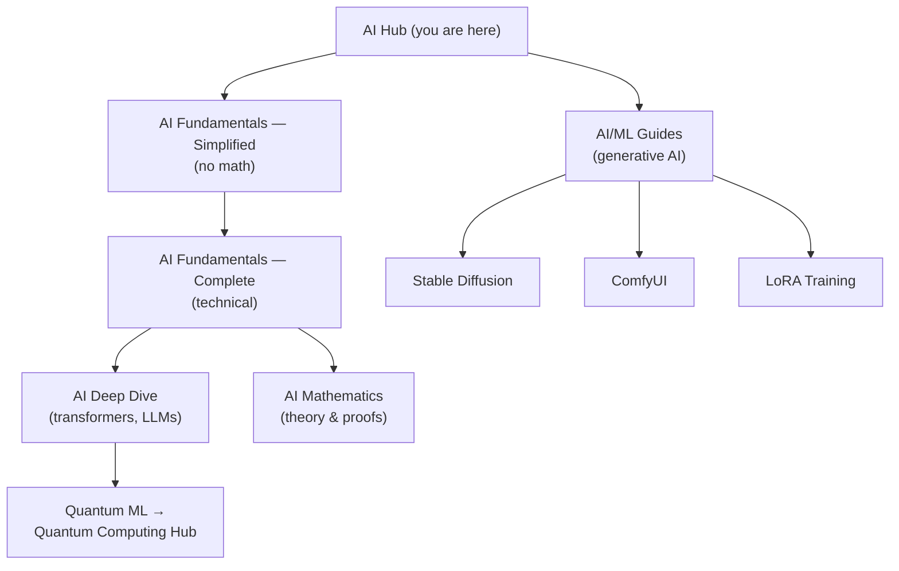

  <h1 style="color: white; margin: 0; font-size: 2.5rem;">Artificial Intelligence</h1>
  
From Fundamentals to Advanced Research

  
This hub is the front door to every AI topic on the site. It connects four depths of theory &mdash; from a plain-English intro to graduate-level proofs &mdash; with the hands-on generative-AI guides. Pick the depth that fits, then branch into practice.

  

    

      <i class="fas fa-layer-group"></i>
      <h4>Four Depth Levels</h4>
      
Simplified → Complete → Deep Dive → Mathematics. Climb only as far as you need.

    

    

      <i class="fas fa-tools"></i>
      <h4>Theory Meets Practice</h4>
      
Every concept links to a hands-on generative-AI guide you can run today.

    

    

      <i class="fas fa-rocket"></i>
      <h4>Current Research</h4>
      
Foundation models, multimodal systems, and alignment &mdash; the 2025&ndash;2026 frontier.

    

  

## How These Pages Fit Together

This hub points to four depth levels of AI theory plus the hands-on generative-AI guides. Pick a depth, then branch into practice:

## Start Here

Four entry points, ordered by depth. Each builds on the one before, but you can stop at whatever level meets your goal.

  <a href="../technology/ai-fundamentals-simple.html" class="nav-card"><h4><i class="fas fa-lightbulb"></i> 1. Simplified</h4>
How AI works, in plain English. No math required.
</a>
  <a href="../technology/ai/" class="nav-card"><h4><i class="fas fa-brain"></i> 2. Complete</h4>
The full technical overview, with equations and architectures.
</a>
  <a href="../technology/ai-lecture-2023.html" class="nav-card"><h4><i class="fas fa-graduation-cap"></i> 3. Deep Dive</h4>
Transformers, large language models, and research directions.
</a>
  <a href="../advanced/ai-mathematics/" class="nav-card"><h4><i class="fas fa-square-root-alt"></i> 4. Mathematics</h4>
Statistical learning theory and proofs &mdash; graduate level.
</a>

### Practical AI/ML Tools

Ready to build? The hands-on [AI/ML Documentation](../ai-ml/) covers generative AI end to end:

  <a href="../ai-ml/stable-diffusion-fundamentals.html" class="nav-card"><h4><i class="fas fa-image"></i> Stable Diffusion</h4>
Core diffusion concepts and image generation.
</a>
  <a href="../ai-ml/comfyui-guide.html" class="nav-card"><h4><i class="fas fa-project-diagram"></i> ComfyUI</h4>
Node-based visual workflow creation.
</a>
  <a href="../ai-ml/lora-training.html" class="nav-card"><h4><i class="fas fa-sliders-h"></i> LoRA Training</h4>
Fine-tune your own models efficiently.
</a>
  <a href="../ai-ml/model-types.html" class="nav-card"><h4><i class="fas fa-layer-group"></i> Model Types</h4>
LoRAs, embeddings, VAEs, and checkpoints.
</a>
  <a href="../ai-ml/advanced-techniques.html" class="nav-card"><h4><i class="fas fa-magic"></i> Advanced Techniques</h4>
Production-grade professional workflows.
</a>

## Core AI Domains

AI is not one field but several overlapping ones, each defined by the *kind* of data it works with and the structure it exploits. The table below is a quick orientation; the sections that follow go into each domain and link to the relevant guides.

| Domain | What it does | Defining method | On this site |
|--------|--------------|-----------------|--------------|
| Machine Learning | Learn patterns from data to predict or decide | Statistical models, gradient descent | [AI Fundamentals](../technology/ai/) |
| Deep Learning | Learn hierarchical features from raw input | Multi-layer neural networks | [AI Deep Dive](../technology/ai-lecture-2023.html) |
| Natural Language Processing | Understand and generate human language | Transformers, large language models | [AI Deep Dive](../technology/ai-lecture-2023.html) |
| Computer Vision | Interpret and generate visual information | CNNs, diffusion models | [Stable Diffusion](../ai-ml/stable-diffusion-fundamentals.html) |
| Generative AI | Create new images, text, audio, and video | Diffusion, GANs, autoregressive LLMs | [ComfyUI Guide](../ai-ml/comfyui-guide.html) |

Deep learning is a subset of machine learning; NLP, computer vision, and most of generative AI are in turn powered by deep learning today. Understanding that nesting is the fastest way to navigate the field.

### Machine Learning
Machine Learning enables computers to learn from data without being explicitly programmed. It forms the foundation of modern AI systems.

**Key Topics:**
- Supervised Learning (Classification, Regression)
- Unsupervised Learning (Clustering, Dimensionality Reduction)
- Reinforcement Learning
- Feature Engineering
- Model Evaluation and Validation

**Resources:**
- [AI Fundamentals](../technology/ai/#machine-learning-teaching-computers-to-learn)
- [Base Models Comparison](../ai-ml/base-models-comparison.html)

### Deep Learning
Deep Learning uses neural networks with multiple layers to progressively extract higher-level features from raw input.

**Key Topics:**
- Neural Network Architectures
- Convolutional Neural Networks (CNNs)
- Recurrent Neural Networks (RNNs)
- Transformers and Attention Mechanisms
- Training Techniques and Optimization

**Resources:**
- [AI Deep Dive](../technology/ai-lecture-2023.html)
- [Model Types](../ai-ml/model-types.html)

### Natural Language Processing
NLP focuses on enabling computers to understand, interpret, and generate human language.

**Key Topics:**
- Text Classification and Sentiment Analysis
- Named Entity Recognition
- Machine Translation
- Question Answering Systems
- Large Language Models (LLMs)

**Applications:**
- Chatbots and Virtual Assistants
- Document Analysis
- Language Generation

### Computer Vision
Computer Vision enables machines to interpret and understand visual information from the world.

**Key Topics:**
- Image Classification
- Object Detection and Segmentation
- Face Recognition
- Image Generation (Diffusion Models)
- Video Analysis

**Resources:**
- [Stable Diffusion Fundamentals](../ai-ml/stable-diffusion-fundamentals.html)
- [ControlNet Guide](../ai-ml/controlnet.html)
- [Output Formats Guide](../ai-ml/output-formats.html)

### Generative AI
Generative AI creates new content including images, text, audio, and video.

**Key Technologies:**
- Diffusion Models (Stable Diffusion, FLUX)
- GANs (Generative Adversarial Networks)
- Variational Autoencoders (VAEs)
- Large Language Models
- Multi-modal Models

**Resources:**
- [ComfyUI Workflows](../ai-ml/comfyui-guide.html)
- [LoRA Training](../ai-ml/lora-training.html)
- [Advanced Techniques](../ai-ml/advanced-techniques.html)

## Resource Categories

### Foundational Resources
- [AI Fundamentals - Simplified](../technology/ai-fundamentals-simple.html) - Core concepts without mathematics
- [AI Fundamentals - Complete](../technology/ai/) - Comprehensive technical overview
- [Model Types](../ai-ml/model-types.html) - Understanding different AI architectures

### Implementation Guides
- [ComfyUI Guide](../ai-ml/comfyui-guide.html) - Visual workflow interface
- [Stable Diffusion](../ai-ml/stable-diffusion-fundamentals.html) - Image generation technology
- [LoRA Training](../ai-ml/lora-training.html) - Model fine-tuning techniques

### Advanced Topics
- [AI Mathematics](../advanced/ai-mathematics/) - Mathematical foundations
- [Advanced AI Lecture](../technology/ai-lecture-2023.html) - Research-level content
- [Advanced Techniques](../ai-ml/advanced-techniques.html) - State-of-the-art methods

## Learning Paths

Choose a path based on your goals:

### Path 1: AI Fundamentals (Theory-Focused)
**For:** Understanding how AI works conceptually and mathematically

1. [AI Fundamentals - Simplified](../technology/ai-fundamentals-simple.html) *(Start here - no math required)*
2. [AI Fundamentals - Complete](../technology/ai/) *(Technical deep-dive)*
3. [AI Deep Dive](../technology/ai-lecture-2023.html) *(Transformers, LLMs, research)*
4. [AI Mathematics](../advanced/ai-mathematics/) *(Statistical learning theory)*

### Path 2: Generative AI (Practice-Focused)
**For:** Creating images, training models, building AI applications

1. [Stable Diffusion Fundamentals](../ai-ml/stable-diffusion-fundamentals.html) *(Core concepts)*
2. [ComfyUI Guide](../ai-ml/comfyui-guide.html) *(Workflow creation)*
3. [Model Types](../ai-ml/model-types.html) *(LoRAs, VAEs, etc.)*
4. [LoRA Training](../ai-ml/lora-training.html) *(Train custom models)*
5. [Advanced Techniques](../ai-ml/advanced-techniques.html) *(Professional workflows)*

### Path 3: Research Track
**For:** Those pursuing AI research or advanced development

1. [AI Fundamentals - Complete](../technology/ai/) *(Foundation)*
2. [AI Deep Dive](../technology/ai-lecture-2023.html) *(Modern architectures)*
3. [AI Mathematics](../advanced/ai-mathematics/) *(Theoretical foundations)*
4. [Quantum Computing](../quantum-computing/) *(Quantum ML)*

## Related Topics

### Infrastructure & Tools
- [Docker for AI/ML](../technology/docker/)
- [Docker Essentials](../technology/docker-essentials.html)
- [Cloud Computing (AWS)](../technology/aws/)
- [CI/CD for ML Pipelines](../technology/ci-cd/)

### Theoretical Foundations
- [Quantum Computing](../technology/quantumcomputing.html)
- [Quantum Computing Hub](../quantum-computing/)
- [Statistical Mechanics](../physics/statistical-mechanics/)

## Current Trends & Research

### 2025-2026 Focus Areas
- **Foundation Models**: Large-scale pre-trained models (GPT, CLIP, DALL-E)
- **Multimodal AI**: Systems that process multiple data types
- **AI Safety & Alignment**: Ensuring AI systems behave as intended
- **Efficient AI**: Reducing computational requirements
- **Explainable AI**: Making AI decisions interpretable

### Emerging Technologies
- Quantum Machine Learning
- Neuromorphic Computing
- Edge AI and TinyML
- AI-assisted Scientific Discovery
- Autonomous Systems

## Contributing

This documentation is continuously evolving. If you notice areas for improvement or have expertise to share, we welcome contributions through our [GitHub repository](https://github.com/AndrewAltimit/Documentation).

## Next Steps

  

    <h3>Learn the Basics</h3>
    
Start with simplified AI fundamentals

    <a href="../technology/ai-fundamentals-simple.html" class="btn btn-primary">Begin Learning</a>
  

  
  

    <h3>Build Something</h3>
    
Try ComfyUI for hands-on experience

    <a href="../ai-ml/comfyui-guide.html" class="btn btn-primary">Start Building</a>
  

  
  

    <h3>Go Deeper</h3>
    
Explore advanced AI mathematics

    <a href="../advanced/ai-mathematics/" class="btn btn-primary">Advanced Topics</a>
  

#### See Also
- [AI Fundamentals - Simplified](../technology/ai-fundamentals-simple.html) - No-math starting point
- [AI Fundamentals - Complete](../technology/ai/) - Technical reference with equations
- [AI Deep Dive](../technology/ai-lecture-2023.html) - Transformers, LLMs, and research
- [AI/ML Documentation](../ai-ml/) - Hands-on generative AI guides
- [Quantum Computing Hub](../quantum-computing/) - Where quantum meets machine learning

