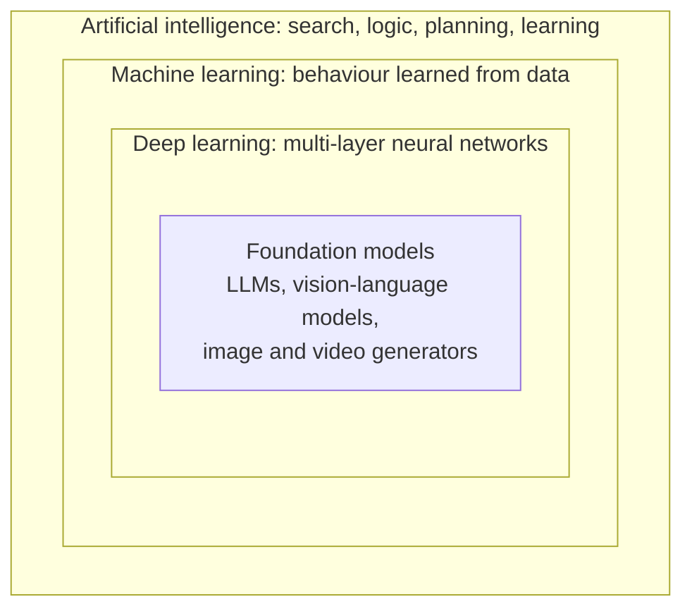
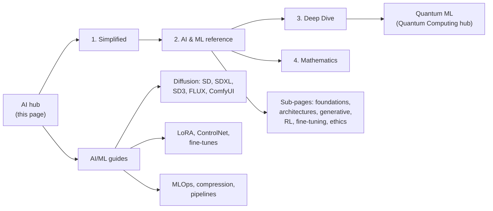
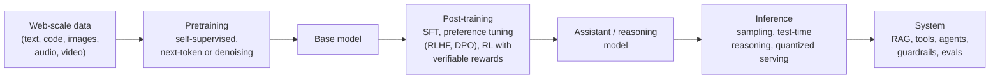
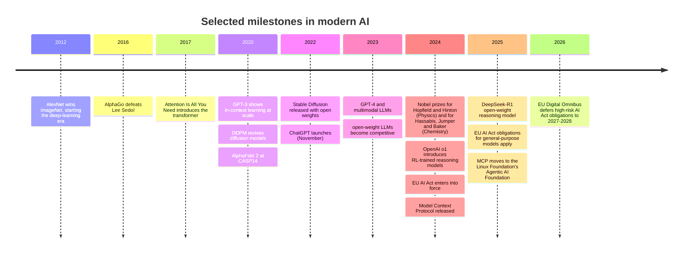

  <h1 style="color: white; margin: 0; font-size: 2.5rem;">Artificial Intelligence</h1>
  
From fundamentals to frontier models

**Artificial intelligence** is the study and engineering of systems that perform tasks associated with intelligence: perceiving, predicting, reasoning, generating language and images, and acting toward goals. Almost all practical AI today is **machine learning**, where behavior is learned from data instead of written as rules. Most of that is **deep learning**, and the systems in the headlines are large **foundation models** trained on broad data and then adapted to many tasks.

This hub is the entry point to the site's AI material. It covers the theory at four levels of depth, from a no-math introduction to graduate-level learning theory, the individual subfields, and the hands-on generative-AI guides. It also gives a short account of how modern models are built and where the field stands in late 2026.

## How the field nests

The terms AI, machine learning, deep learning, and generative AI are often used interchangeably, but they name nested sets. Each inner set is a specific approach within the one around it:

Symbolic AI (search, logic, knowledge representation, planning) is the part of AI outside machine learning. It still underpins route planning, game-tree search, constraint solvers, and formal verification, and it increasingly shows up *inside* learned systems as tools an LLM calls.

## Reading levels

The core theory is written at four depths. Each builds on the one before it, but you can stop at whichever level fits your goal.

| Level | Page | Audience | Covers |
|---|---|---|---|
| 1 | [AI Fundamentals: Simplified](../technology/ai-fundamentals-simple.html) | Anyone; no math | What learning from data means, neural networks by analogy, what LLMs and image generators do |
| 2 | [AI & Machine Learning](../technology/ai/) | Engineers; some calculus and linear algebra | The full technical reference, split into focused sub-pages (listed below) |
| 3 | [AI Deep Dive](../technology/ai-lecture-2023.html) | Practitioners | Transformers, large language models, and research directions |
| 4 | [Advanced AI Mathematics](../advanced/ai-mathematics/) | Graduate level | Statistical learning theory, optimization, generalization bounds, and proofs |

The hands-on material lives in the [AI/ML guides](../ai-ml/), which focus on image generation with diffusion models (Stable Diffusion, SDXL, SD3, FLUX, ComfyUI, LoRA training, ControlNet) along with MLOps and model compression.

## Subfields

AI is several overlapping fields, distinguished mostly by the kind of data they work with and the structure they exploit. Since the late 2010s the transformer architecture has pulled most of them together: the same basic model family now handles text, images, audio, video, and actions.

| Subfield | Problem | Characteristic methods | On this site |
|---|---|---|---|
| **Machine learning** | Learn a function from examples to predict or decide | Linear models, decision trees and gradient boosting, SVMs, clustering, dimensionality reduction | [ML Foundations](../technology/ai/ml-foundations.html), [Core ML Algorithms](../technology/ai/core-ml-algorithms.html), [Loss Functions](../technology/ai/loss-functions.html) |
| **Deep learning** | Learn hierarchical representations from raw input | Backpropagation, CNNs, RNNs, transformers, normalization, residual connections | [Deep Learning Architectures](../technology/ai/deep-learning-architectures.html), [Deep Learning Theory](../technology/ai/deep-learning-theory.html) |
| **Natural language processing** | Understand and generate human language | Tokenization, pretrained transformers, LLMs, retrieval-augmented generation | [AI Deep Dive](../technology/ai-lecture-2023.html) |
| **Computer vision** | Interpret images and video | CNNs, vision transformers, detection and segmentation models, vision-language models | [ControlNet](../ai-ml/controlnet.html), [Inpainting & Editing](../ai-ml/inpainting-editing.html) |
| **Generative modeling** | Sample new data from a learned distribution | Autoregressive models, diffusion and flow matching, VAEs, GANs | [Generative Models](../technology/ai/generative-models.html), [Stable Diffusion](../ai-ml/stable-diffusion-fundamentals.html), [FLUX](../ai-ml/flux-guide.html) |
| **Reinforcement learning** | Learn to act by trial, error, and reward | MDPs, Q-learning, policy gradients, PPO, RL from human or verifiable feedback | [Reinforcement Learning](../technology/ai/reinforcement-learning.html), [Game AI](../ai-ml/game-ai.html) |
| **Adaptation & deployment** | Specialize and serve pretrained models efficiently | Fine-tuning, LoRA/PEFT, quantization, distillation, MLOps | [Fine-Tuning](../technology/ai/fine-tuning.html), [LoRA Training](../ai-ml/lora-training.html), [Model Compression](../ai-ml/model-compression.html), [MLOps](../ai-ml/mlops-production.html) |

The main learning paradigms cut across all of these subfields:

| Paradigm | Training signal | Examples |
|---|---|---|
| Supervised | Labeled input/output pairs | Image classification, spam filtering, regression |
| Unsupervised | Structure in unlabeled data | Clustering, PCA, density estimation |
| Self-supervised | Labels derived from the data itself (predict the next token, the masked patch, the added noise) | LLM and diffusion pretraining |
| Reinforcement | Scalar reward from an environment or evaluator | Game playing, robotics, RLHF, reasoning-model training |

## How a modern foundation model is built

Most of the models discussed on this site, whether language models or image generators, go through the same broad stages. Understanding them explains much of their behavior, including their strengths, failure modes, and cost profile.

1. **Pretraining.** A large network, usually a transformer and often a sparse **mixture-of-experts**, is trained with a self-supervised objective on a very large corpus: predict the next token for language models, or predict the noise or velocity for diffusion and flow-matching image models. **Scaling laws** (Kaplan et al., 2020; the "Chinchilla" results of Hoffmann et al., 2022) showed that loss falls predictably as parameters, data, and compute grow together. Much of the compute and almost all of the model's knowledge comes from this stage.
2. **Post-training.** Supervised fine-tuning on curated demonstrations teaches the model to follow instructions. Preference optimization (reinforcement learning from human feedback, or direct preference optimization) steers it toward responses people prefer. Since 2024, large-scale **reinforcement learning on verifiable tasks** such as mathematics with checkable answers and code with tests has produced *reasoning models* that generate long chains of intermediate steps before answering.
3. **Inference.** Output quality now also depends on **test-time compute**: letting a model think longer, sample several candidates, or check its own work can improve accuracy on hard problems, trading latency and cost for quality. Serving costs are reduced with quantization, distillation into smaller models, speculative decoding, and caching.
4. **Systems around the model.** Production applications seldom call a bare model. They add **retrieval-augmented generation** (RAG) to ground answers in current or private data, **tool use** to act on external systems, **agent loops** that plan and execute multi-step tasks, and evaluation and guardrail layers to measure and constrain behavior.

The same stages apply to image models. A diffusion model is pretrained to denoise, fine-tuned for aesthetics or instruction following, adapted with LoRA or ControlNet, and served with fewer sampling steps through distillation. The [AI/ML guides](../ai-ml/) cover these steps in practice.

## State of the field (late 2026)

### Milestones

### Current directions

- **Reasoning models and test-time compute.** Following OpenAI's o1 (September 2024) and the open-weight DeepSeek-R1 (January 2025), which published its reinforcement-learning recipe, every major lab now ships models that reason at length before answering. Many let the caller set a thinking budget. Progress on mathematics, science, and coding benchmarks has been rapid enough that many older benchmarks are saturated, and evaluation has shifted toward harder expert-written sets and long, realistic tasks.
- **Agents and tool use.** Models increasingly operate software instead of only producing text: calling APIs, writing and running code, browsing, and working over multi-hour tasks. The **Model Context Protocol** (released by Anthropic in November 2024 and donated to the Linux Foundation's Agentic AI Foundation in December 2025) has become the common interface between models and tools. The main open problems are reliability over long horizons, security (especially prompt injection through untrusted content), and evaluation.
- **Multimodality.** Frontier models take text, images, audio, and video as input. Generation of images, speech, and increasingly video with synchronized audio has become routine. In image generation, diffusion transformers trained with flow matching (such as SD3 and FLUX) have largely replaced U-Net latent diffusion.
- **Open-weight models.** Open-weight language and image models trail the closed frontier by a relatively short margin, which makes local deployment, fine-tuning, and research on model internals practical.
- **Efficiency.** Mixture-of-experts architectures, low-bit quantization, distillation, and better inference kernels have steadily lowered the cost of a given capability level, and capable models now run on laptops and phones.
- **Safety, alignment, and interpretability.** Work covers training models to follow specified behavior, evaluating dangerous capabilities before release, and *mechanistic interpretability*, which tries to identify the internal features and circuits a network uses. See [Frontier Research & Ethics](../technology/ai/frontier-and-ethics.html).
- **Regulation.** The EU AI Act entered into force in August 2024, with obligations for general-purpose AI models applying from August 2025. The Digital Omnibus on AI (in force July 2026) deferred the high-risk system obligations to December 2027 for stand-alone systems and August 2028 for AI embedded in regulated products, while the Article 50 transparency obligations still applied from August 2026.
- **AI for science.** Following AlphaFold's impact on protein-structure prediction, learned models are widely used in materials discovery, weather forecasting, mathematics, and as research assistants.

Specific model names and benchmark leaders change every few months, so this hub deliberately leaves them out. The sub-pages describe architectures and techniques, which age more slowly.

## Learning paths

| Goal | Path |
|---|---|
| **Understand how AI works** | [Simplified](../technology/ai-fundamentals-simple.html) → [AI & ML reference](../technology/ai/) → [ML Foundations](../technology/ai/ml-foundations.html) → [Deep Learning Architectures](../technology/ai/deep-learning-architectures.html) → [AI Deep Dive](../technology/ai-lecture-2023.html) |
| **Generate images and train models** | [Stable Diffusion Fundamentals](../ai-ml/stable-diffusion-fundamentals.html) → [ComfyUI](../ai-ml/comfyui-guide.html) → [Model Types](../ai-ml/model-types.html) → [Base Models Comparison](../ai-ml/base-models-comparison.html) → [LoRA Training](../ai-ml/lora-training.html) → [Advanced Techniques](../ai-ml/advanced-techniques.html) |
| **Ship ML to production** | [Fine-Tuning](../technology/ai/fine-tuning.html) → [Model Compression](../ai-ml/model-compression.html) → [Optimization & Performance](../ai-ml/optimization-guide.html) → [MLOps & Production](../ai-ml/mlops-production.html) → [Production Pipelines](../ai-ml/production-pipelines.html) |
| **Research and theory** | [AI & ML reference](../technology/ai/) → [Deep Learning Theory](../technology/ai/deep-learning-theory.html) → [Advanced AI Mathematics](../advanced/ai-mathematics/) → [Quantum Computing](../quantum-computing/) (quantum ML) |

## Related topics

| Area | Pages |
|---|---|
| Infrastructure | [Docker](../technology/docker/), [Kubernetes](../technology/kubernetes/), [AWS](../technology/aws/), [CI/CD](../technology/ci-cd/) |
| Serving models behind APIs | [API Design](../api-design/), [Distributed Systems](../distributed-systems/), [Observability](../observability/) |
| Theoretical connections | [Statistical Mechanics](../physics/statistical-mechanics/) (energy-based models, the physics behind diffusion), [Quantum Computing](../technology/quantumcomputing.html) |

## See also

- [AI Fundamentals: Simplified](../technology/ai-fundamentals-simple.html): no-math starting point.
- [AI & Machine Learning](../technology/ai/): technical reference with equations.
- [AI Deep Dive](../technology/ai-lecture-2023.html): transformers, LLMs, and research directions.
- [Frontier Research & Ethics](../technology/ai/frontier-and-ethics.html): alignment, interpretability, and societal impact.
- [AI/ML guides](../ai-ml/): hands-on generative AI.
- [Quantum Computing hub](../quantum-computing/): where quantum computing meets machine learning.
