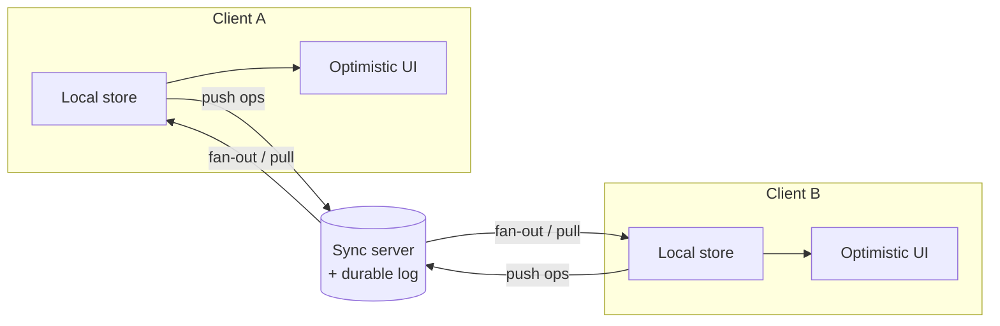
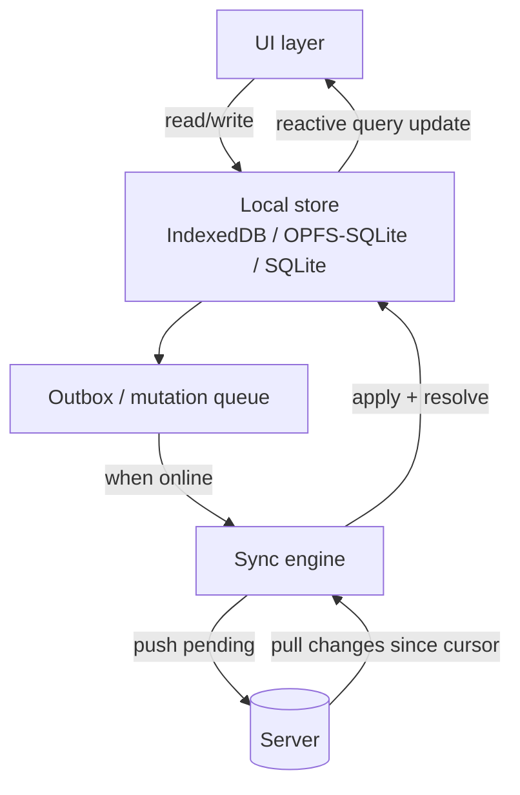
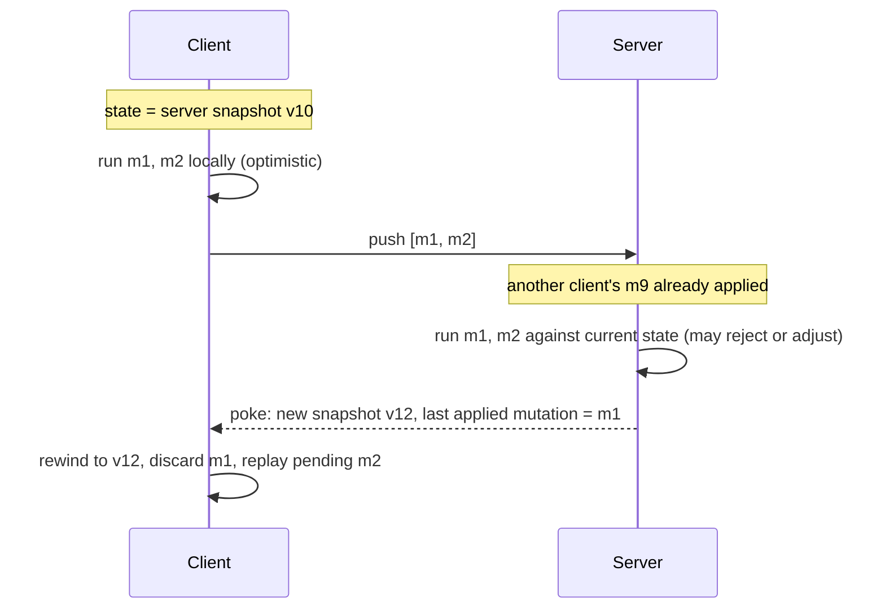
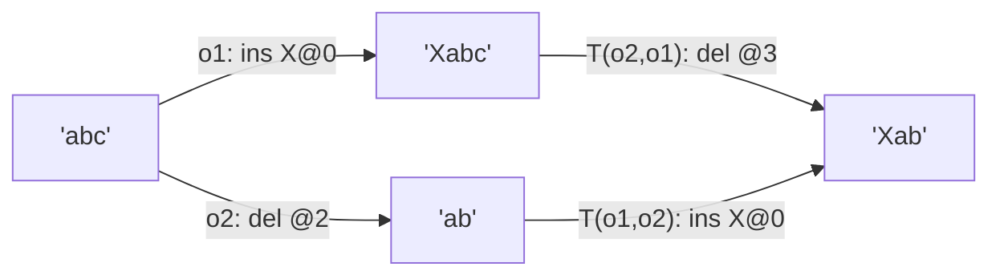
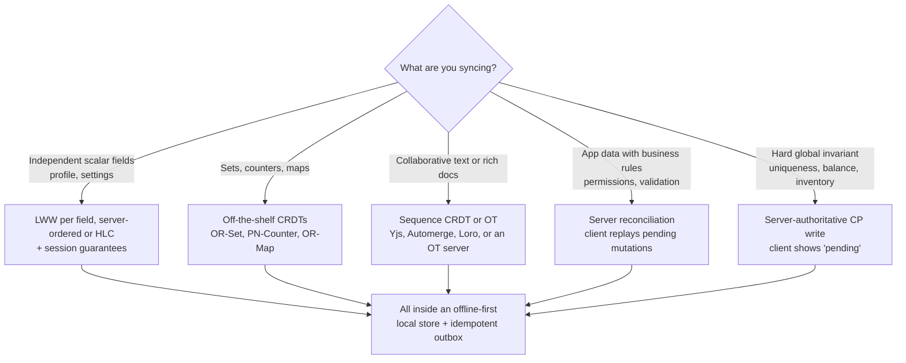

[Distributed Systems](./) &raquo; Client-Side Consistency &amp; Sync

Most consistency theory is written from the server's side: how do replicas in a data center agree on a value? This page looks at it from the client's side. A phone in a tunnel, a laptop on a plane, or two cursors in one document are all replicas. Each one changes state locally, loses contact, and has to reconcile later. The page covers offline-first and local-first application architecture, the three main ways to merge divergent edits (last-writer-wins, CRDTs, and operational transformation, plus the server-reconciliation approach used by modern sync engines), the session guarantees a single user can rely on, and the wire protocols that move and reconcile the data.

## The client as a replica

In a classic replicated system every replica is a server run by the same operator. A client cache, a service worker, or a mobile app that accepts writes offline changes that. The client is now a full replica. The operator does not control it and cannot coordinate with it when it writes.

That rules out the usual toolkit. Raft or Paxos cannot run when one participant has been in airplane mode for six hours. The client has to:

1. **Accept writes locally** without a round trip, so the UI updates at once ("optimistic" UI).
2. **Diverge** from the server and from other clients while disconnected.
3. **Converge** deterministically once connectivity returns, ideally without asking a human to resolve conflicts.

The same impossibility results that constrain servers apply here (see [Distributed Systems Theory](../advanced/distributed-systems-theory/) for FLP, CAP, and happens-before), but the right choices are different. A client that blocks every write until the server confirms it is a CP design, and on a flaky network the user experience is poor. Offline-first apps are deliberately AP: always writable, eventually consistent.



The hard questions are about the arrows: what travels on them (operations, full state, or deltas), who decides the final order, and which guarantees still hold during a partition.

## Offline-first and local-first

**Offline-first** means the local store is the source of truth for the UI. The network is an optional, asynchronous extra. This reverses the traditional model, where the app is online by default, shows a spinner while it waits, and fails when there is no network.

**Local-first software** (Kleppmann, Wiggins, van Hardenberg and McGranaghan, Ink & Switch, 2019) goes further. It asks that data stay usable and owned by the user even if the vendor's servers disappear, which in practice means CRDT-based, peer-capable storage. Most commercial "sync engines" sit between the two. They keep a full local replica for instant reads and writes, but a server stays authoritative.

### Anatomy of an offline-first app



| Component | Role |
|-----------|------|
| **Local store** | Durable on-device storage (IndexedDB, SQLite compiled to WebAssembly on top of the Origin Private File System, native SQLite, Realm). Reads and writes never block on the network. |
| **Mutation queue (outbox)** | Records each write as a durable, ordered, idempotent intent, so it survives a crash and can be retried safely. |
| **Sync engine** | Reconciles local and remote state in both directions whenever connectivity allows. |
| **Change feed and cursor** | The server exposes changes since a per-client high-water mark, so the client pulls only deltas. |

### A minimal outbox and sync loop

```javascript
// Every local write is recorded as a durable, idempotent intent in the
// same local transaction that applies it optimistically.
async function applyLocalWrite(mutation) {
  // mutation = { id: crypto.randomUUID(), name, args, baseVersion, ts }
  await db.transaction('rw', db.entities, db.outbox, async () => {
    await applyToLocalState(mutation);            // UI updates now
    await db.outbox.add({ ...mutation, status: 'pending' });
  });
}

// Runs whenever connectivity is available.
async function syncOnce(cursor) {
  // 1. PUSH: flush pending mutations in order. The server dedupes on
  //    mutation.id, so a retry after a lost ACK does not double-apply.
  const pending = await db.outbox.where('status').equals('pending').sortBy('ts');
  for (const m of pending) {
    const res = await api.push(m);                // 409 => rejected / conflict
    await db.outbox.update(m.id, { status: res.ok ? 'acked' : 'conflict' });
    if (!res.ok) await reconcile(m, res.serverState);
  }
  // 2. PULL: fetch remote changes since our last durable cursor.
  const { changes, nextCursor } = await api.pull({ since: cursor });
  for (const c of changes) await mergeRemoteChange(c);
  return nextCursor;
}
```

The browser's Background Sync API, which lets a service worker defer a sync until connectivity returns, is still only available in Chromium-based browsers. Portable code triggers `syncOnce` itself on `online` events, on app focus, and on a timer.

### Idempotency

A client cannot tell "my write was lost" apart from "my write succeeded but the ACK was lost." It has to retry, so the server has to deduplicate. The standard approach is a client-generated unique **idempotency key** for each mutation. The server records the keys it has applied and answers a repeat with the original result instead of applying it again. The [Saga pattern](resilience-patterns.html#the-saga-pattern-and-compensation) depends on the same retry safety, and the [Idempotency](resilience-patterns.html#idempotency) section covers it on the server side.

### Where offline-first stops working

Offline-first is the right default for user-owned data such as notes, drafts, to-dos, and form entries. It is the wrong default for any operation guarded by a global invariant that the client cannot check locally:

| Invariant | Why offline writes break it |
|-----------|-----------------------------|
| Uniqueness ("claim this username") | Two offline clients can both believe they won. |
| Limited inventory ("buy the last ticket") | Overselling is unacceptable. |
| Balance ("don't overdraw") | Needs a single linearizable authority. |

For these operations, use a server-authoritative [CP](consensus-and-coordination.html#cap-theorem) write. The client treats it as *pending until confirmed*, and the UI should show that pending state rather than optimistically claiming success.

## Choosing a merge strategy

When two replicas edit while disconnected, their states diverge and have to be reconciled. There are four main families of approach:

| Strategy | Mechanism | Needs a coordinator? | Loses concurrent edits? | Main cost |
|----------|-----------|----------------------|-------------------------|-----------|
| **Last-writer-wins (LWW)** | Keep the value with the highest timestamp | No | **Yes**, silently | Trivial, but relies on clock quality |
| **Server reconciliation (rebase)** | The server applies mutations in its own order, and clients replay their pending mutations on top of the result | Yes, the server | No, mutations re-run against fresh state | Server must run the same mutation logic |
| **Operational transformation (OT)** | Transform concurrent operations against each other | Usually (a central server fixes the order) | No | Transform functions are subtle |
| **CRDTs** | Data types whose merge converges by construction | **No**, works peer-to-peer | No (for the merge semantics chosen) | Metadata and history overhead |

### Last-writer-wins and clocks

LWW is what a naive "sync the whole row, newest timestamp wins" design gives you. It works for independent scalar fields such as a display name or a theme setting, especially when applied **per field** rather than per row. It is disastrous for collaborative text, where it would silently discard one person's paragraph.

LWW is only as good as its timestamps. Client wall clocks can be minutes off, so a phone with a fast clock wins every conflict. Common mitigations:

- Let the **server** assign the order. Figma's multiplayer model works this way: last-writer-wins per object property, with the server's arrival order in place of timestamps.
- Use **hybrid logical clocks** (HLC). An HLC combines physical time with a logical counter, so it stays close to wall-clock time but never goes backwards and always respects causality.
- Break ties deterministically with the replica ID, so every replica picks the same winner.

### Server reconciliation (rebase)

Many production sync engines (Replicache and its successor Zero from Rocicorp, and a similar architecture in many game netcode and mobile stacks) avoid general-purpose merge algorithms altogether. Mutations are named functions such as `createTodo(args)`, not state diffs. Each one runs twice: once optimistically on the client, then authoritatively on the server.



Because mutations re-run against the latest authoritative state, they can enforce invariants such as permissions, uniqueness, and stock limits. A rejected mutation simply disappears on the next rebase. The cost is that the server must be reachable before any write becomes final, which makes this design offline-tolerant rather than local-first.

## CRDTs (conflict-free replicated data types)

A **CRDT** is a data type designed so that concurrent updates on different replicas always merge to the same value, whatever order the updates arrive in, without central coordination (Shapiro, Preguiça, Baquero and Zawirski, 2011). CRDTs are the basis of Yjs, Automerge, and Loro, and of the data types in Riak and Redis Enterprise's active-active replication.

### State-based and operation-based CRDTs

| Flavor | What replicas exchange | Requirement | Delivery assumptions |
|--------|------------------------|-------------|----------------------|
| **State-based (CvRDT, convergent)** | Full state | `merge` is a semilattice join: commutative, associative, idempotent | Any order, duplicates allowed |
| **Operation-based (CmRDT, commutative)** | Operations | Concurrent operations commute | Reliable, exactly-once, causal delivery |
| **Delta-state** | Small state fragments (deltas) | Deltas are joined like states | Any order; a middle ground between the two |

The guarantee is **strong eventual consistency** (SEC). Any two replicas that have received the same set of updates are in the same state, and they get there without conflict resolution, rollback, or consensus.

### Why a semilattice guarantees convergence

Take the replica states as a partially ordered set with a join operator $\sqcup$ (the merge). A state-based CRDT requires, for all states $x, y, z$:

$$
x \sqcup y = y \sqcup x \qquad (x \sqcup y) \sqcup z = x \sqcup (y \sqcup z) \qquad x \sqcup x = x
$$

These are commutativity, associativity, and idempotence. Every local update must also be **inflationary**: it only moves the state upward, so $x \le f(x)$. Given that, however merges and updates interleave, every replica climbs monotonically toward the same least upper bound of the updates it has received. Idempotence makes duplicated messages harmless, and commutativity and associativity make reordering harmless. This is why CRDTs tolerate the unreliable, out-of-order delivery common on mobile networks.

### Worked example: the grow-only counter

The G-Counter is the simplest non-trivial CRDT. Each of $n$ replicas owns one entry in a vector of per-replica counts. The value is the sum, and merge takes the element-wise maximum:

$$
\mathrm{value}(P) = \sum_{k=1}^{n} P[k] \qquad \mathrm{merge}(P, Q)[k] = \max\bigl(P[k],\, Q[k]\bigr)
$$

Element-wise `max` is a valid join, and `increment` only raises the replica's own entry, so it is inflationary.

```python
class GCounter:
    def __init__(self, replica_id, num_replicas):
        self.id = replica_id
        self.p = [0] * num_replicas          # per-replica counts

    def increment(self, amount=1):
        assert amount >= 0                   # grow-only
        self.p[self.id] += amount            # only ever raise our own entry

    def value(self):
        return sum(self.p)

    def merge(self, other):
        # element-wise max: commutative, associative, idempotent
        self.p = [max(a, b) for a, b in zip(self.p, other.p)]
        return self

a, b = GCounter(0, 2), GCounter(1, 2)
a.increment(3); b.increment(5)       # a.p = [3, 0], b.p = [0, 5]
a.merge(b); b.merge(a)               # both [3, 5] whichever order
assert a.value() == b.value() == 8
```

A **PN-Counter** supports decrements. It pairs two G-Counters, $P$ for increments and $N$ for decrements, and its value is $\sum P - \sum N$.

### Common CRDTs

| CRDT | Models | Merge rule |
|------|--------|------------|
| **G-Counter / PN-Counter** | Counters | Element-wise max of per-replica counts |
| **G-Set** | Grow-only set | Union |
| **2P-Set** | Add/remove set, no re-add | Union of an add set and a tombstone set |
| **OR-Set** (observed-remove) | Add/remove set with re-add | Tag each add with a unique ID; a remove deletes only the tags it observed |
| **LWW-Register** | Single value | Highest (timestamp, replica ID) wins |
| **MV-Register** | Single value | Keep every causally concurrent value and surface the conflict |
| **LWW-Map / OR-Map** | JSON-like documents | A register or nested CRDT per key |
| **Sequence (RGA, YATA, Fugue)** | Ordered lists and text | Stable per-element IDs with deterministic interleaving |

The **OR-Set** shows the kind of problem CRDTs solve. A naive add/remove set has an add-versus-remove conflict: one replica adds `x` while another removes `x`, so which result is right? The OR-Set answers deterministically. Every add carries a unique tag, and a remove deletes only the tagged adds it has actually seen. A concurrent add that the remover never saw survives. This "add wins" bias is chosen because data that reappears usually surprises users less than data that vanishes.

### Sequence CRDTs and collaborative text

Collaborative text uses a **sequence CRDT** (RGA, Logoot, YATA in Yjs, Fugue). Integer positions shift under concurrent inserts and cause the "we both inserted at position 5" problem. Instead, each character gets a stable, globally unique identifier, usually a (replica ID, counter) pair plus a reference to its left and/or right neighbour at insertion time. Concurrent inserts at the same position are ordered by a deterministic tiebreak, so every replica interleaves them the same way. Deletes leave **tombstones**, so a concurrent insert next to a deleted character still has a valid anchor.

A good sequence CRDT also has to avoid **interleaving anomalies**. When two users type whole words at the same spot concurrently, some algorithms merge the characters letter by letter into a jumble. Weidner and Kleppmann's *Fugue* (2023) characterizes the anomaly and gives an algorithm with *maximal non-interleaving*.

### Cost and recent progress

The main cost of a CRDT is metadata. Tombstones and per-element IDs build up, so memory grows with edit history, not just with live content. Mature libraries address this in several ways:

- **Tombstone garbage collection** once every replica has seen a delete. This needs knowledge of the replica set, which is hard in open peer-to-peer settings.
- **Columnar, run-length-encoded storage.** Automerge 3.0 (2025) keeps its compressed on-disk format in memory as well, and cut memory use by more than 10x for typical documents.
- **Delta-state sync**, which ships only recent changes instead of whole states.

Budget for this overhead before using CRDTs on very large or very long-lived documents.

## Operational transformation (OT)

Operational transformation is older than CRDTs. It powered Jupiter (1995), Google Wave, Google Docs, and Etherpad. It reaches the same goal of convergent concurrent editing by a different route. The data model stays plain, just a string, and concurrent operations are **transformed against each other** so that applying them in different orders produces the same result.

### The core idea

Start both users from `"abc"`. User 1 inserts `"X"` at position 0, and User 2 deletes position 2 (the `"c"`). If the server applies User 1's insert and then User 2's *original* delete, it removes the wrong character, because the insert shifted everything one place to the right.

OT resolves this with a **transform function** $T$. Given two concurrent operations built against the same base state, $T$ rewrites each one so that both application orders converge:

$$
\mathrm{apply}\bigl(\mathrm{apply}(s, o_1),\, T(o_2, o_1)\bigr) = \mathrm{apply}\bigl(\mathrm{apply}(s, o_2),\, T(o_1, o_2)\bigr)
$$

This is transformation property **TP1**. In the example, $T$ moves User 2's delete from position 2 to position 3, and User 1's insert at position 0 is unchanged. Both orders end at `"Xab"`.



```python
# Transform op_a so it can apply AFTER op_b; both were generated against the
# same base state. Insert/insert case; ties broken by site id.
def transform_insert_insert(op_a, op_b):
    if op_a.pos < op_b.pos or (op_a.pos == op_b.pos and op_a.site < op_b.site):
        return op_a                                   # unaffected
    return Op('insert', op_a.pos + len(op_b.text), op_a.text, op_a.site)
```

A second property, **TP2**, is required when operations can be transformed along different paths, as happens in peer-to-peer OT without a central order. Several published algorithms turned out to violate TP2. That is why practical OT systems (the Jupiter model, Google Docs) route every operation through a server that imposes a single total order, which leaves only TP1 to satisfy.

### OT compared with CRDTs

| | Operational transformation | CRDT |
|---|---|---|
| Data model | Plain string or array | Per-element IDs and metadata |
| Coordination | Usually a central server to order operations | None needed; works peer-to-peer |
| Correctness burden | Many transform functions, easy to get wrong (TP1/TP2) | Convergence proven once per data type |
| Steady-state memory | Low | Higher (IDs, tombstones) |
| Merging long offline branches | Slow (transforms grow as O(n·m)) | Fast |
| Examples | Google Docs, Etherpad, ShareDB | Yjs, Automerge, Loro |

The gap between the two approaches is narrowing. **Eg-walker** (Gentle and Kleppmann, EuroSys 2025) stores a plain operation log like OT, and only when merging concurrent branches does it build a temporary CRDT-style structure. The paper reports steady-state memory an order of magnitude below existing CRDTs, and merges of long-diverged branches orders of magnitude faster than OT. Loro uses a related event-graph design.

## Session guarantees

Eventual consistency promises nothing about what a single user's session sees, and the anomalies it allows are exactly the ones users notice. **Session guarantees** (Terry et al., Bayou project, 1994) restore the minimum needed for eventual consistency to feel sane to one client, without paying for global strong consistency.

| Guarantee | Promise | Anomaly without it |
|-----------|---------|--------------------|
| **Read your writes (RYW)** | Later reads in the session reflect your earlier writes | You save a profile edit, the next read hits a stale replica, and the change "didn't take" |
| **Monotonic reads** | Reads never go back in time | A post shows 10 likes, and after a refresh it shows 7 |
| **Monotonic writes** | Your writes apply in the order you issued them, on every replica | "draft" then "published" land out of order, and the post reverts to draft |
| **Writes follow reads (WFR)** | A write made after a read is ordered after what you read, everywhere | Your reply appears on some replica before the comment it answers |

When every client gets all four, the result is equivalent to causal consistency (Brzezinski, Sobaniec and Wawrzyniak, 2004). See the [consistency models](consensus-and-coordination.html#consistency-models) table for where that sits.

### How they are enforced

The classic mechanism is a **version vector carried in the session**, not held server-wide. The client tracks which writes it has observed. Each read requires a replica at least that fresh, and each write carries the dependencies it must not precede.

```python
# Session-scoped guarantees via a version vector the client carries.
class Session:
    def __init__(self):
        self.observed = {}        # replica_id -> highest version seen by THIS client

    def read(self, replica):
        if not replica.dominates(self.observed):             # too stale for us
            replica = pick_replica_at_least(self.observed)   # or wait / retry
        value, version = replica.read()
        self.merge_observed(version)        # monotonic reads
        return value

    def write(self, replica, value):
        version = replica.write(value, deps=self.observed)   # writes follow reads
        self.merge_observed(version)        # read your writes
        return version
```

Session guarantees are per client, cheap, and compatible with weak global consistency. Common production shortcuts:

- **Sticky routing** sends a session to the same replica. This is simple, but it breaks on failover.
- **Read-after-write tokens** return a log position, LSN, or GTID with each write. Later reads say "at least this position" and wait for, or skip, replicas that are further behind. MongoDB's causally consistent sessions and many Postgres read-replica routers work this way.
- **Read from the primary for N seconds after a write.** Crude, but common.

Formal definitions are in [Distributed Systems Theory](../advanced/distributed-systems-theory/#consistency-models).

## Sync protocols

A sync protocol is the wire-level exchange that moves divergent state between client and server, or between peers, and reconciles it.

### What travels on the wire

| Payload | Used with | Strengths | Weaknesses |
|---------|-----------|-----------|------------|
| **Snapshot** (full record) | LWW, state CRDTs | Simple; tolerates lost messages | Bandwidth-heavy; LWW loses fine-grained edits |
| **Operation log** | OT, op-based CRDTs, server reconciliation | Precise merges; natural audit trail and undo | Needs reliable, ordered or causal delivery |
| **Delta / delta-state** | Yjs, Automerge, Loro sync | CRDT correctness at close to operation-log bandwidth | Needs causal tracking (state vectors) |
| **Row-level change stream** | Postgres-backed sync (Electric, Zero) | Reuses the database's replication log | Merge semantics are the server's (usually LWW or rebase) |

Yjs shows the delta approach clearly. Each peer sends a compact **state vector**, a map from client ID to the highest clock value seen. The other peer answers with exactly the updates that vector is missing. The exchange takes one round trip in each direction and is independent of document size.

### Incremental pull with a cursor

Whatever the payload, clients should pull incrementally. The server exposes an ordered change feed, and the client remembers a **cursor**: a sequence number, logical clock, or opaque token marking the last change it has durably applied. On reconnect it asks only for changes after the cursor.

```python
# Idempotent, resumable incremental pull keyed on a durable cursor.
async def pull_changes(client_cursor):
    changes = await server.changes_since(client_cursor)   # ordered, gap-free
    for change in changes:
        if change.seq <= client_cursor:
            continue                          # already applied; safe to skip
        apply_change(change)                  # local merge (CRDT / OT / LWW)
        client_cursor = change.seq
    persist(client_cursor)                    # ideally in the same transaction as the applies
    return client_cursor
```

If the cursor is persisted in the same local transaction as the changes it covers, the pull is crash-safe. A client that dies mid-sync resumes from the last persisted cursor and re-applies, idempotently, at most the batch that was in flight. The server also needs a policy for cursors older than its retained change log, usually a forced full resync.

### Efficient reconciliation

When two peers each hold a large set and need only the *difference*, naive sync sends $O(n)$ data. Better protocols send roughly $O(d)$, where $d$ is the number of differences:

- **Merkle trees.** Hash the data into a tree and compare root hashes. Matching subtrees are pruned, and only mismatched branches are explored. Dynamo-style anti-entropy (Cassandra, Riak) and Git use this. See [Failure Detection & Gossip](failure-detection.html#anti-entropy-and-merkle-trees).
- **Range-based set reconciliation.** Recursively split the key range, exchange a fingerprint per range, and descend only where fingerprints differ. The Negentropy protocol used in Nostr relays is an example.
- **Invertible Bloom lookup tables.** A fixed-size sketch from which the symmetric difference can be decoded in a single message, provided $d$ is below the sketch's capacity.

All three keep re-sync cost proportional to how far the replicas have diverged, not to the size of the dataset.

### Real-time transport

Live collaboration needs a bidirectional, low-latency transport so remote operations arrive within a frame or two:

- **WebSockets** are the workhorse.
- **Server-Sent Events** and HTTP long-polling are fallbacks, and suit read-mostly change streams (Electric uses plain HTTP long-polling so that responses can be cached by CDNs).
- **WebRTC data channels** allow direct peer-to-peer sync.
- **WebTransport** over HTTP/3 is an emerging option.

Op-based CRDTs and OT both need **reliable, causally ordered delivery**, either from the transport or from an application-level sequencing layer. Causal order rests on happens-before and logical clocks (see [Distributed Systems Theory](../advanced/distributed-systems-theory/#time-and-clocks)).

## Libraries and sync engines (2026)

| Project | Model | Notes |
|---------|-------|-------|
| **Yjs** | Sequence and map CRDTs (YATA) | 13.6.x is the stable line. v14 (pre-release in 2026) adds attribution and change tracking. Large editor ecosystem (ProseMirror, Tiptap, BlockNote, CodeMirror, Monaco). |
| **Automerge** | JSON-document CRDT | 3.0 (2025) uses compressed columnar storage in memory. `automerge-repo` handles networking and storage. |
| **Loro** | Event-graph CRDTs (text, list, map, movable tree) | 1.0 (2024) stabilized the format. Built-in version history. |
| **Replicache / Zero** (Rocicorp) | Server reconciliation | Zero adds a query-driven partial-sync layer over Postgres. |
| **Electric** | Postgres read-path sync ("shapes") over HTTP | 1.0 GA in March 2025. Writes go through your own API. |

## Decision guide



In summary: make the local store authoritative for the user experience, and match the merge strategy to the shape of the data. Use LWW for independent fields, CRDTs or OT for concurrent structured edits, server reconciliation where business rules must hold, and a CP write for true invariants. Give every user read-your-writes and monotonic reads within their session. Move data with incremental, idempotent, causally ordered sync.

## See also

- **[Distributed Systems Hub](./)**: overview of the section
- **[Consensus & Coordination](consensus-and-coordination.html)**: CAP, PACELC, and the consistency-model spectrum
- **[Replication Strategies](replication-strategies.html)**: server-side leader, multi-leader, and leaderless replication
- **[Failure Detection & Gossip](failure-detection.html)**: anti-entropy and Merkle-tree reconciliation between servers
- **[Distributed Systems Theory](../advanced/distributed-systems-theory/)**: formal consistency models, impossibility results, logical clocks
- **[Database Design](../technology/database-design/)**: replication, sharding, and server-side consistency
- **[Networking](../technology/networking/)**: transport fundamentals behind WebSockets, long-polling, and P2P sync

### References

- Terry et al., *Session Guarantees for Weakly Consistent Replicated Data* (1994)
- Shapiro, Preguiça, Baquero, Zawirski, *Conflict-free Replicated Data Types* (2011)
- Kleppmann, Wiggins, van Hardenberg, McGranaghan, *Local-First Software: You Own Your Data, in Spite of the Cloud* (2019)
- Weidner, Kleppmann, *The Art of the Fugue: Minimizing Interleaving in Collaborative Text Editing* (2023)
- Gentle, Kleppmann, *Collaborative Text Editing with Eg-walker: Better, Faster, Smaller* (EuroSys 2025)
