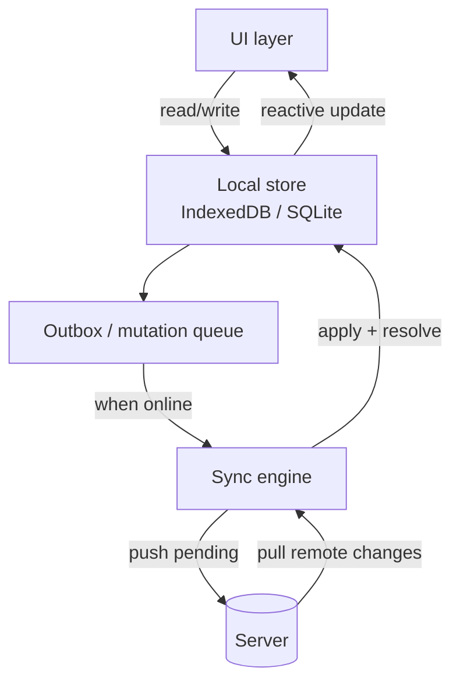
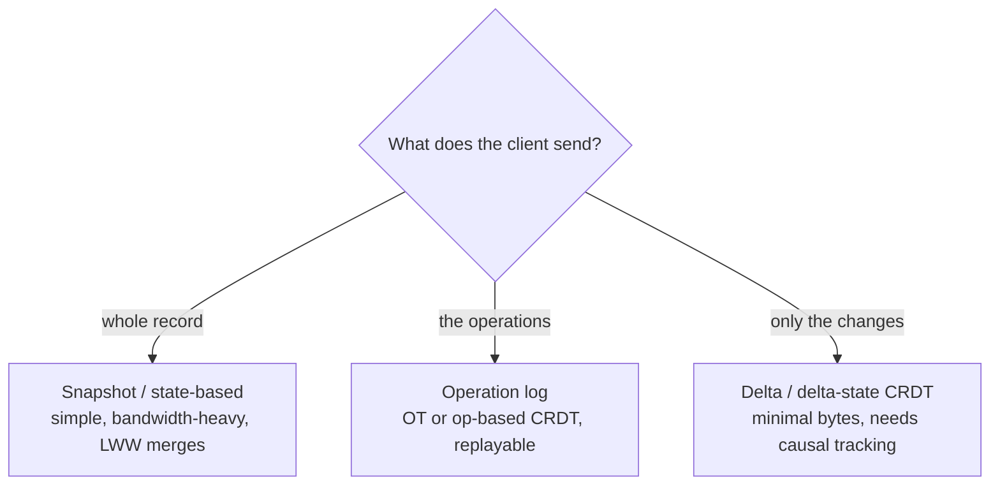
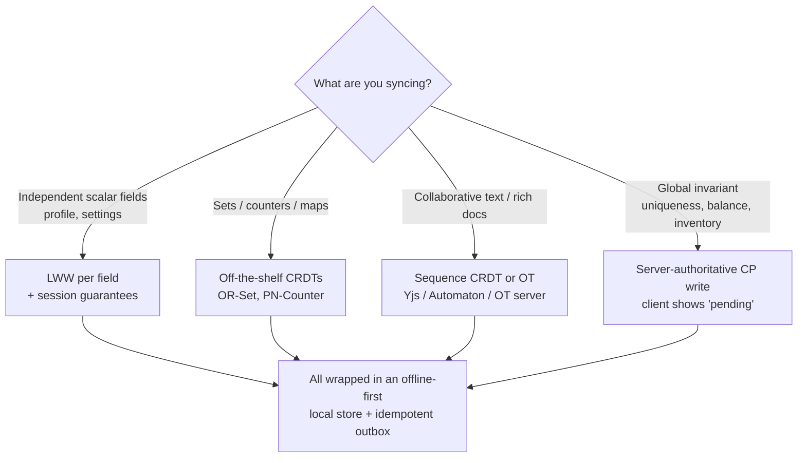

<div class="hero-section" style="background: linear-gradient(135deg, #667eea 0%, #764ba2 100%); color: white; padding: 3rem 2rem; margin: -2rem -3rem 2rem -3rem; text-align: center;">
  <h1 style="color: white; margin: 0; font-size: 2.5rem;">Client-Side Consistency &amp; Sync</h1>
  <p style="font-size: 1.25rem; margin-top: 1rem; opacity: 0.9;">Offline-first sync, CRDTs and operational transforms, conflict resolution, and session guarantees from the client's point of view</p>
</div>

[Distributed Systems](./) &raquo; Client-Side Consistency &amp; Sync

<div class="code-example" markdown="1">
Most consistency theory is written from the *server's* perspective: how do replicas in a data center agree on a value? This page takes the opposite view. The client — a phone in a tunnel, a laptop on a plane, two cursors in the same document — is itself a replica that mutates state locally, drifts out of contact, and must later reconcile. We cover how to build software that stays usable while disconnected (offline-first), the data structures that merge divergent edits *without* a coordinator (CRDTs and operational transformation), the guarantees a single user can still rely on (session guarantees), and the protocols that move and reconcile the bytes (sync protocols).
</div>

## The Client as a Replica

In a classic replicated system the replicas are servers under one operator's control. Add a client cache, a service worker, or a mobile app that accepts writes while offline, and the client becomes a *first-class replica* that the operator does not control and cannot coordinate with on the write path.

This breaks the usual playbook. You cannot run Raft or Paxos when one of the participants is a phone that has been in airplane mode for six hours. The client must:

1. **Accept writes locally** with no round trip — the UI updates immediately ("optimistic" UI).
2. **Diverge** from the server and from other clients while disconnected.
3. **Converge** deterministically once connectivity returns, ideally without a human resolving conflicts.

The design space is governed by the same impossibility results that constrain servers — see [Distributed Systems Theory](../advanced/distributed-systems-theory/) for FLP, CAP, and the happens-before relation — but the *choices* differ. A client that blocks every write on server confirmation is a CP design with terrible UX on a flaky network. Offline-first apps are deliberately AP: always writable, eventually consistent.


The hard part is the edges of that diagram: what travels on the arrows (ops, state, or deltas), and what guarantees survive a partition.

## Offline-First Sync

"Offline-first" means the local store is the source of truth for the UI, and the network is treated as an optional, asynchronous enhancement — the inverse of the traditional "online by default, show a spinner, fail if no network" model.

### Anatomy of an Offline-First App



Four components do the work:

- **Local store** — durable on-device storage (IndexedDB, SQLite, WatermelonDB, Realm). Reads and writes never block on the network.
- **Mutation queue (outbox)** — every write is recorded as a durable, ordered, *idempotent* intent so it survives a crash and can be retried safely.
- **Sync engine** — reconciles local and remote state when connectivity allows, in both directions.
- **Change feed / cursor** — the server exposes changes since a per-client high-water mark so the client pulls only deltas, not the whole dataset.

### A Minimal Outbox + Sync Loop

```javascript
// Every local write is recorded as a durable, idempotent intent.
async function applyLocalWrite(mutation) {
  // mutation = { id: uuid(), entity, op, payload, baseVersion, ts }
  await db.transaction('rw', db.entities, db.outbox, async () => {
    await applyToLocalState(mutation);      // optimistic: UI updates now
    await db.outbox.add({ ...mutation, status: 'pending' });
  });
}

// Runs whenever connectivity is available (e.g. via the Background Sync API).
async function syncOnce(cursor) {
  // 1. PUSH: flush pending local mutations. Server is idempotent on mutation.id,
  //    so a retried push after a flaky ACK does not double-apply.
  const pending = await db.outbox.where('status').equals('pending').sortBy('ts');
  for (const m of pending) {
    const res = await api.push(m);          // 409 => server rejected/transformed
    await db.outbox.update(m.id, { status: res.ok ? 'acked' : 'conflict' });
    if (!res.ok) await reconcile(m, res.serverState);
  }
  // 2. PULL: fetch remote changes since our last cursor (incremental, not full).
  const { changes, nextCursor } = await api.pull({ since: cursor });
  for (const c of changes) await mergeRemoteChange(c);
  return nextCursor;
}
```

### Idempotency Is Non-Negotiable

A client cannot tell the difference between "my write was lost" and "my write succeeded but the ACK was lost." It *must* retry, so the server must dedupe. The standard mechanism is a client-generated unique key per mutation (an *idempotency key*); the server records applied keys and treats a repeat as a no-op that returns the original result. This is the same retry-safety discipline that the [Saga pattern](resilience-patterns.html#the-saga-pattern-and-compensation) relies on, applied at the edge.

### The Boundaries of Offline-First

Offline-first is the right default for *user-owned* data (notes, drafts, todos, form entry). It is the *wrong* default for operations that need a global invariant the client cannot evaluate locally:

- **Uniqueness** ("claim this username") — two offline clients can both believe they won.
- **Limited inventory** ("buy the last ticket") — overselling is unacceptable.
- **Monetary balance** ("don't overdraw") — needs a linearizable authority.

For these, fall back to a server-authoritative, [CP](consensus-and-coordination.html#cap-theorem) write that the client treats as *pending until confirmed*, and design the UI to show that pending state honestly rather than lying optimistically.

## Convergence Without a Coordinator

When two clients edit while disconnected, their states diverge. Reconciling them is *conflict resolution*. There are three families of approaches, in increasing order of automatic-merge quality (and complexity):

| Strategy | Mechanism | Converges automatically? | Cost |
|----------|-----------|--------------------------|------|
| **Last-Write-Wins (LWW)** | Compare timestamps; newest wins | Yes, but **loses data** | Trivial |
| **Operational Transformation (OT)** | Transform concurrent ops against each other; needs a server to order | Yes, with a central authority | Moderate; transform functions are subtle |
| **CRDTs** | Data types whose merge is mathematically guaranteed to converge | Yes, **no coordinator required** | Higher memory/metadata overhead |

LWW is the baseline (it is how a naive "sync the whole row, newest timestamp wins" works) and it is fine for independent scalar fields. It is catastrophic for collaborative text, where it would silently throw away one person's paragraph. The next two sections cover the two serious answers.

## CRDTs (Conflict-Free Replicated Data Types)

A **CRDT** is a data type designed so that concurrent updates on different replicas always merge to the same value, *regardless of the order in which updates arrive*, with no central coordination. They are the mathematical foundation of modern offline-first sync libraries (Yjs, Automerge, Riak's data types).

### The Two Flavors

- **State-based (CvRDT, convergent)** — replicas exchange their *full state*; a `merge` function combines two states. `merge` must be a **join** in a semilattice: commutative, associative, and idempotent. Convergence then follows automatically because any interleaving of merges reaches the least upper bound.
- **Operation-based (CmRDT, commutative)** — replicas exchange *operations*; concurrent operations must **commute**. Requires reliable, exactly-once, causal-order delivery of ops (typically via the network layer), in exchange for sending much less data than full state.

The convergence guarantee for the state-based form is *Strong Eventual Consistency* (SEC): any two replicas that have received the same set of updates are in the same state — and they reach it without conflict resolution, rollback, or consensus.

### Why a Semilattice Guarantees Convergence

Let the set of replica states be a partially ordered set with a join operator $\sqcup$ (the merge). For a state-based CRDT we require, for all states $x, y, z$:

$$
x \sqcup y = y \sqcup x \qquad \text{(commutativity)}
$$

$$
(x \sqcup y) \sqcup z = x \sqcup (y \sqcup z) \qquad \text{(associativity)}
$$

$$
x \sqcup x = x \qquad \text{(idempotence)}
$$

If every local update only moves a replica's state *upward* in this order (it is *inflationary*: $x \le f(x)$), then no matter how merges and updates interleave — including duplicated or reordered messages — all replicas monotonically climb toward the same least upper bound of the delivered updates. Duplication is harmless (idempotence) and reordering is harmless (commutativity and associativity), which is exactly why CRDTs tolerate the unreliable, out-of-order delivery typical of a mobile network.

### Worked Example: A Grow-Only Counter (G-Counter)

The simplest non-trivial CRDT. Each of $n$ replicas owns one entry of a vector of per-replica counts; the logical value is the sum. Merge takes the element-wise maximum.

For replicas $i$ and $j$ with state vectors $P$ and $Q$:

$$
\mathrm{value}(P) = \sum_{k=1}^{n} P[k]
$$

$$
\mathrm{merge}(P, Q)[k] = \max\bigl(P[k],\, Q[k]\bigr)
$$

Element-wise `max` is commutative, associative, and idempotent, so it is a valid join; and `increment` (which only raises the owning replica's own entry) is inflationary. Hence the G-Counter converges.

```python
class GCounter:
    def __init__(self, replica_id, num_replicas):
        self.id = replica_id
        self.p = [0] * num_replicas          # per-replica counts

    def increment(self, amount=1):
        self.p[self.id] += amount            # only ever raise our own entry

    def value(self):
        return sum(self.p)

    def merge(self, other):
        # element-wise max: commutative, associative, idempotent
        self.p = [max(a, b) for a, b in zip(self.p, other.p)]
        return self

# Two replicas increment while partitioned, then merge in EITHER order.
a = GCounter(0, 2); b = GCounter(1, 2)
a.increment(3)        # a.p = [3, 0]
b.increment(5)        # b.p = [0, 5]
a.merge(b)            # a.p = [3, 5]  -> value 8
b.merge(a)            # b.p = [3, 5]  -> value 8  (same result)
assert a.value() == b.value() == 8
```

To support decrement you use a **PN-Counter**: two G-Counters, one for increments ($P$) and one for decrements ($N$), with value $\sum P - \sum N$.

### The CRDT Zoo

Real applications compose larger types from these primitives:

| CRDT | Models | Merge idea |
|------|--------|-----------|
| **G-Counter / PN-Counter** | counters | element-wise max of per-replica counts |
| **G-Set** | grow-only set | set union |
| **2P-Set** | add/remove set (no re-add) | union of an add-set and a tombstone-set |
| **OR-Set** (observed-remove) | add/remove set with re-add | tag each add with a unique id; remove only the ids you observed |
| **LWW-Register** | a single value | keep the value with the highest timestamp |
| **MV-Register** | a single value | keep all causally-concurrent values, surface the conflict |
| **RGA / sequence** | ordered text/list | position ids that interleave deterministically |

The **OR-Set** illustrates the subtlety that motivates CRDTs. A naive add/remove set has an *add-vs-remove* conflict: if one replica adds `x` while another removes `x`, what is the result? The OR-Set resolves it deterministically by tagging every add with a unique id and stipulating that a remove only deletes the *specific tagged adds it has observed* — so a concurrent add (which the remover never saw) survives. The bias is "add wins," chosen because re-appearing data is usually less surprising to a user than vanishing data.

### Sequence CRDTs and Collaborative Text

The crown jewel for collaborative editing is the **sequence CRDT** (RGA, Logoot, Yjs's YATA). Instead of integer indices — which shift under concurrent inserts and cause the classic "we both inserted at position 5" conflict — each character gets a stable, globally unique, densely-orderable identifier. Concurrent inserts at "the same place" are ordered by a deterministic tiebreak (e.g. replica id), so every replica interleaves them identically. Deletes leave **tombstones** so that a concurrent insert "after the deleted character" still has a valid anchor.

This is what powers production tools like Yjs and Automerge: peer-to-peer collaborative editing with **no central server required for correctness** — a server, if present, is merely a relay and a durability point, not an arbiter.

### The Cost

CRDTs are not free. Tombstones and per-element metadata accumulate, so memory can grow with edit *history*, not just live content. Mature libraries fight this with garbage collection of tombstones once all replicas have observed a delete, and with **delta-state CRDTs** that ship only the recent changes instead of whole states. Budget for the metadata overhead before choosing CRDTs for very large or very long-lived documents.

## Operational Transformation (OT)

Operational Transformation predates CRDTs (it powered Google Docs and earlier groupware) and reaches the same goal — convergent concurrent editing — by a different route. Instead of designing data types that commute by construction, OT keeps a simple data model (a plain string) and **transforms operations against each other** so that applying them in different orders yields the same result.

### The Core Idea

Suppose two users start from `"abc"`. User 1 inserts `"X"` at position 0; User 2 deletes the character at position 2 (`"c"`). If the server naively applies User 1's op and then User 2's *original* op, User 2's "delete position 2" now deletes the wrong character, because User 1's insert shifted everything right.

OT fixes this with a **transform function** $T$. Given two concurrent operations $op_1$ and $op_2$ defined against the *same* base state, $T$ produces transformed versions so that applying them in either order converges:

$$
\mathrm{apply}\bigl(\mathrm{apply}(s, op_1),\, T(op_2, op_1)\bigr) = \mathrm{apply}\bigl(\mathrm{apply}(s, op_2),\, T(op_1, op_2)\bigr)
$$

This is the **transformation property TP1** (convergence). In the example, $T$ shifts User 2's delete from position 2 to position 3 to account for the inserted character, so both orders end at `"XabC-deleted"` = `"Xab"`.

```python
# Transform op_a so it can apply AFTER op_b, where both were created against
# the same base state. (Insert/insert case shown.)
def transform_insert_insert(op_a, op_b):
    if op_a.pos < op_b.pos or (op_a.pos == op_b.pos and op_a.site < op_b.site):
        return op_a                       # a is unaffected by b
    else:
        return Op('insert', op_a.pos + len(op_b.text), op_a.text)  # shift right
```

### OT vs CRDT: The Trade-off

| | Operational Transformation | CRDT |
|---|---|---|
| Data model | Simple (plain string/array) | Rich, with per-element ids/metadata |
| Coordination | Usually needs a **central server** to order ops | **No coordinator** needed; true P2P |
| Correctness burden | Many transform functions; subtle to get right (TP1, TP2) | Convergence proven once per data type |
| Metadata overhead | Low | Higher (ids, tombstones) |
| Canonical users | Google Docs, Etherpad | Yjs, Automerge, Figma |

The conventional wisdom: OT is lean and battle-tested but pushes correctness into a thicket of transform functions and typically assumes a server to impose a total order; CRDTs front-load the proof burden into the data type and then merge anywhere, anytime, even peer-to-peer — at the price of metadata. Modern collaborative apps increasingly choose CRDTs precisely to *avoid* a mandatory central authority on the edit path.

## Session Guarantees (the Client's-Eye View)

Eventual consistency makes no promise about what a *single user's own session* sees, and the anomalies it allows are exactly the ones users notice: posting a comment and not seeing it, or watching a counter jump backwards. **Session guarantees** (Terry et al., Bayou, 1994) restore the minimum that makes eventual consistency *feel* sane to one client, without paying for global strong consistency.

There are four, and you usually want all four for a given session:

- **Read Your Writes (RYW)** — once you've written a value, every later read in your session reflects it (or something newer). *Without it:* you save a profile edit, the read hits a stale replica, and your change "didn't take."
- **Monotonic Reads** — successive reads never go backwards in time; once you've seen a value, you never see an older one. *Without it:* a feed shows 10 likes, refresh shows 7.
- **Monotonic Writes** — your writes are applied in the order you issued them on every replica. *Without it:* "set status = draft" then "set status = published" can land out of order and you're back to draft.
- **Writes Follow Reads (WFR)** — a write you make after reading some value is ordered *after* that value everywhere. *Without it:* you reply to a comment, but on another replica your reply appears before the comment you replied to.

### How They're Enforced

The classic mechanism is **version vectors** carried *in the session*, not server-wide. The client tracks the set of writes it has observed; each read demands a replica at least as fresh as that set, and each write is stamped with the dependencies it must not precede.

```python
# Session-scoped read-your-writes via a version vector the client carries.
class Session:
    def __init__(self):
        self.observed = {}        # replica_id -> highest version seen by THIS client

    def read(self, replica):
        # Refuse a replica that is behind what we've already observed.
        if not replica.dominates(self.observed):
            replica = pick_replica_at_least(self.observed)   # route to a fresh one
        value, version = replica.read()
        self.merge_observed(version)        # monotonic reads: never go backward
        return value

    def write(self, replica, value):
        version = replica.write(value, deps=self.observed)   # writes-follow-reads
        self.merge_observed(version)        # read-your-writes for later reads
        return version
```

Crucially, session guarantees are **per client, cheap, and composable with weak global consistency**. A system can be globally eventually consistent yet still give each user RYW + monotonic reads by routing that user's requests through version-vector–aware replicas (or, pragmatically, "sticky" routing to the same replica for a session). For the formal placement of these guarantees in the consistency hierarchy, see the [consistency models in the hub](consensus-and-coordination.html#consistency-models) and the [formal treatment in Distributed Systems Theory](../advanced/distributed-systems-theory/#consistency-models).

## Sync Protocols

A sync protocol is the wire-level dance that moves divergent state between client and server (or peer and peer) and reconciles it. The choices below trade bandwidth, server complexity, and merge quality.

### What Travels on the Wire



- **Snapshot (state-based):** ship the whole record; merge with LWW or a state CRDT `merge`. Dead simple, robust to lost messages, but wasteful and lossy for fine-grained edits.
- **Operation log:** ship an ordered, idempotent log of operations and replay them. This is what OT and op-based CRDTs use; it gives precise merges and a natural audit trail, at the cost of reliable, causal delivery.
- **Delta / delta-state CRDT:** ship only what changed since the peer's last known version — the best of both worlds (CRDT correctness, near-op bandwidth) and the modern default for libraries like Yjs.

### Incremental Pull with a Cursor

Whatever the payload, clients should pull *incrementally*. The server exposes an ordered change feed and the client remembers a **cursor** (a sequence number, a logical clock, or an opaque token) marking the last change it has durably applied. On reconnect it asks only for changes after the cursor — turning a re-sync from "download everything" into "download the diff."

```python
# Idempotent, resumable incremental pull keyed on a durable cursor.
async def pull_changes(client_cursor):
    changes = await server.changes_since(client_cursor)   # ordered, gap-free
    for change in changes:
        if change.seq <= client_cursor:
            continue                          # already applied; safe to skip
        apply_change(change)                  # local merge (CRDT / OT / LWW)
        client_cursor = change.seq            # advance only after durable apply
    persist(client_cursor)                    # survive a crash mid-sync
    return client_cursor
```

Anchoring cursor advancement *after* a durable local apply makes the pull crash-safe: a client that dies mid-sync simply resumes from the last persisted cursor, re-receiving (and idempotently re-applying) at most the in-flight batch.

### Efficient Reconciliation: Set Reconciliation & Merkle Trees

When two peers each hold a large set and need to find the *difference* without shipping everything, naive sync sends $O(n)$ data. Better protocols send roughly $O(d)$ where $d$ is the number of differences:

- **Merkle trees** — hash the data into a tree; peers compare root hashes, and where roots match they prune the whole subtree, recursing only into mismatched branches. This is how anti-entropy works in Dynamo-style stores (Cassandra, Riak) and how Git compares histories.
- **Range-based set reconciliation** — recursively split the key range and exchange fingerprints (hashes) per range, descending only into ranges whose fingerprints differ.

These keep re-sync cost proportional to the *divergence*, not the dataset — essential when a client returns after a long offline stretch but only a handful of things actually changed.

### Real-Time Transport

For live collaboration the transport must be **bidirectional and low-latency** so remote ops fan out within a frame or two of being made: WebSockets are the workhorse; WebRTC data channels enable true peer-to-peer sync (used by some CRDT setups to drop the server from the hot path); and HTTP long-poll / Server-Sent Events serve as graceful fallbacks. Underneath, op-based CRDTs and OT both require the transport (or an application-level sequencing layer) to provide **reliable, causal-order delivery** — out-of-order or dropped ops break their convergence assumptions unless the layer above repairs ordering. Causal order rests on the happens-before relation and logical clocks covered in [Distributed Systems Theory](../advanced/distributed-systems-theory/#time-and-clocks).

## Putting It Together: A Decision Guide



The throughline: make the local store authoritative for UX, choose a merge strategy matched to the *shape* of the data (LWW for independent fields, CRDTs/OT for structured concurrent edits, server-authoritative CP for true invariants), guarantee each user RYW + monotonic reads within their session, and move bytes with incremental, idempotent, causally-ordered sync.

## Key Takeaways

<div class="takeaway-grid">
  <div class="takeaway-card"><h4>The client is a replica</h4><p>An offline-capable client mutates state, diverges, and must converge — it plays by replication rules, just without a coordinator on the write path.</p></div>
  <div class="takeaway-card"><h4>Idempotency makes offline safe</h4><p>Clients must retry blindly, so every mutation needs a stable id and a server that dedupes. Without it, sync double-applies.</p></div>
  <div class="takeaway-card"><h4>CRDTs converge by construction</h4><p>Semilattice merges (commutative, associative, idempotent) guarantee Strong Eventual Consistency with no central authority — at a metadata cost.</p></div>
  <div class="takeaway-card"><h4>OT trades data simplicity for transform complexity</h4><p>It keeps plain strings but needs subtle transform functions and usually a server to order ops; CRDTs invert that bargain.</p></div>
  <div class="takeaway-card"><h4>Session guarantees rescue UX</h4><p>Read-your-writes and monotonic reads make eventual consistency feel sane per user — cheaply, without global linearizability.</p></div>
  <div class="takeaway-card"><h4>Sync the diff, not the dataset</h4><p>Cursors, delta-state CRDTs, and Merkle reconciliation keep re-sync proportional to what changed, not to how much you store.</p></div>
</div>

## See Also

- **[Distributed Systems Hub](./)** — CAP, consistency models, sagas, and the patterns this page builds on
- **[Distributed Systems Theory](../advanced/distributed-systems-theory/)** — formal consistency models, FLP/CAP impossibility, logical clocks and happens-before
- **[Database Design](../technology/database-design/)** — replication, sharding, and server-side consistency models
- **[Networking](../technology/networking/)** — transport fundamentals behind WebSockets, long-polling, and P2P sync
- **[Quantum Computing](../quantum-computing/)** — distributed quantum networking and entanglement-based coordination
