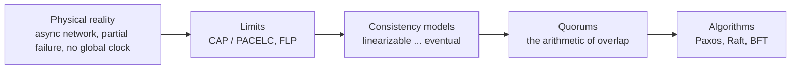
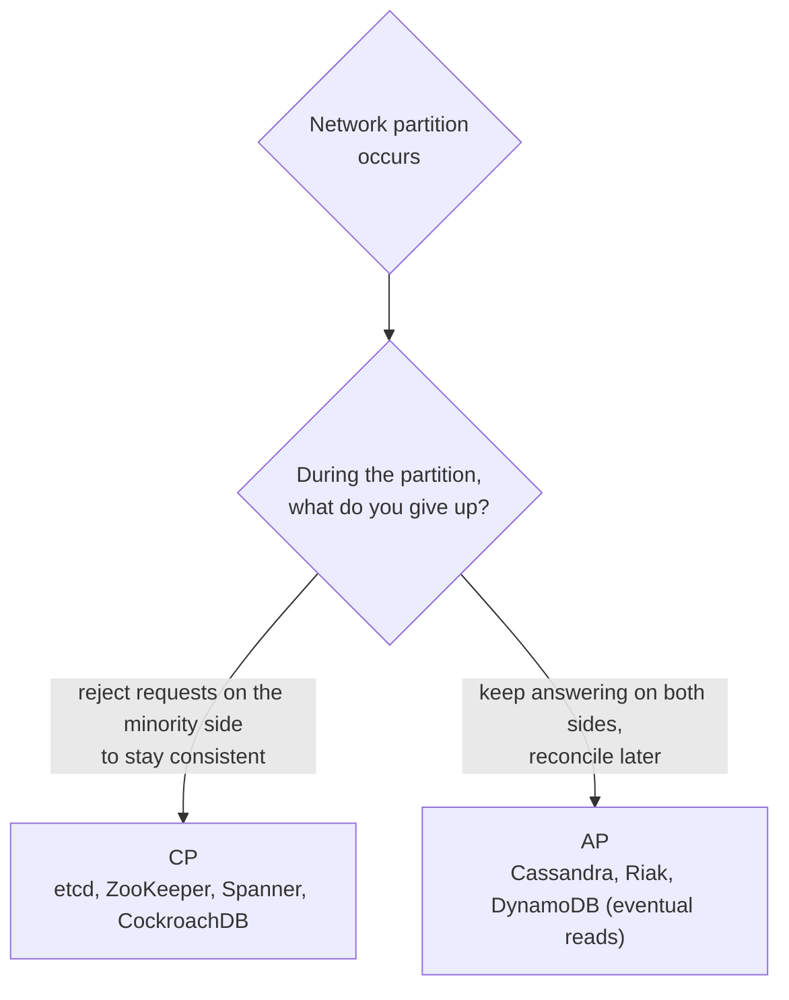
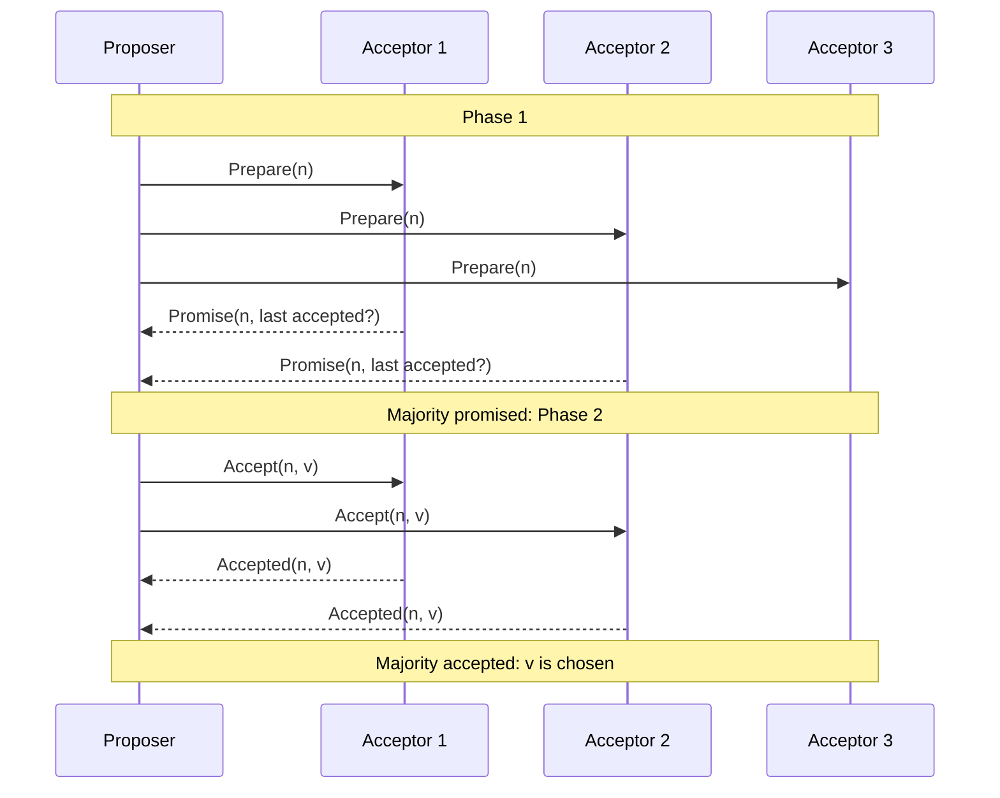
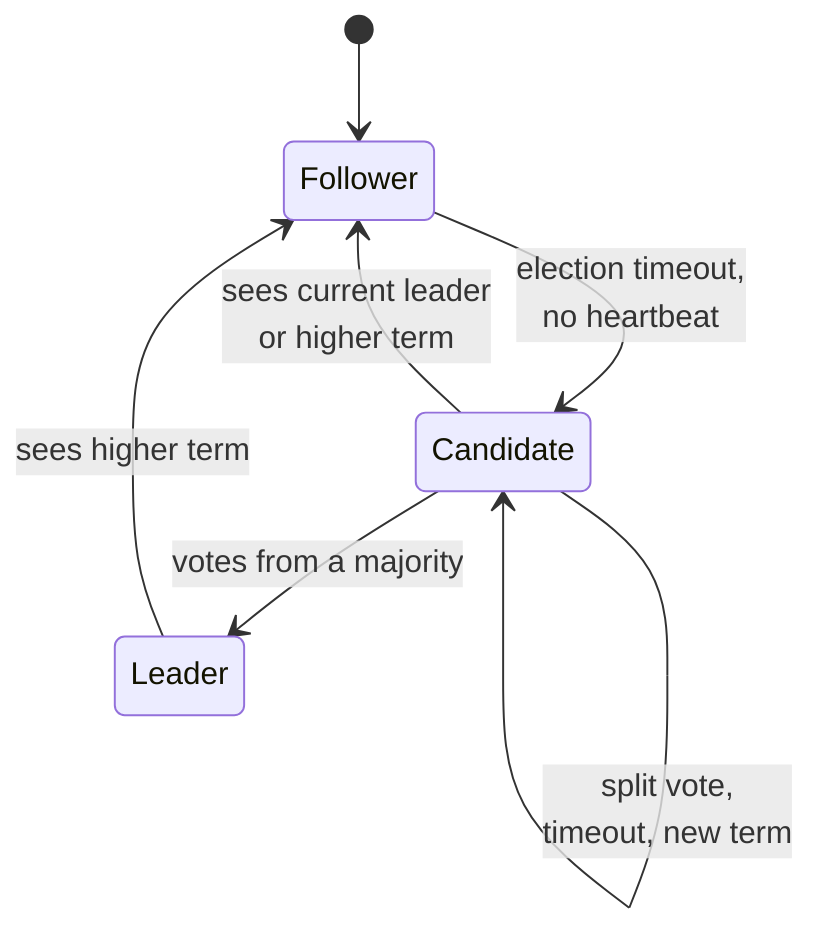
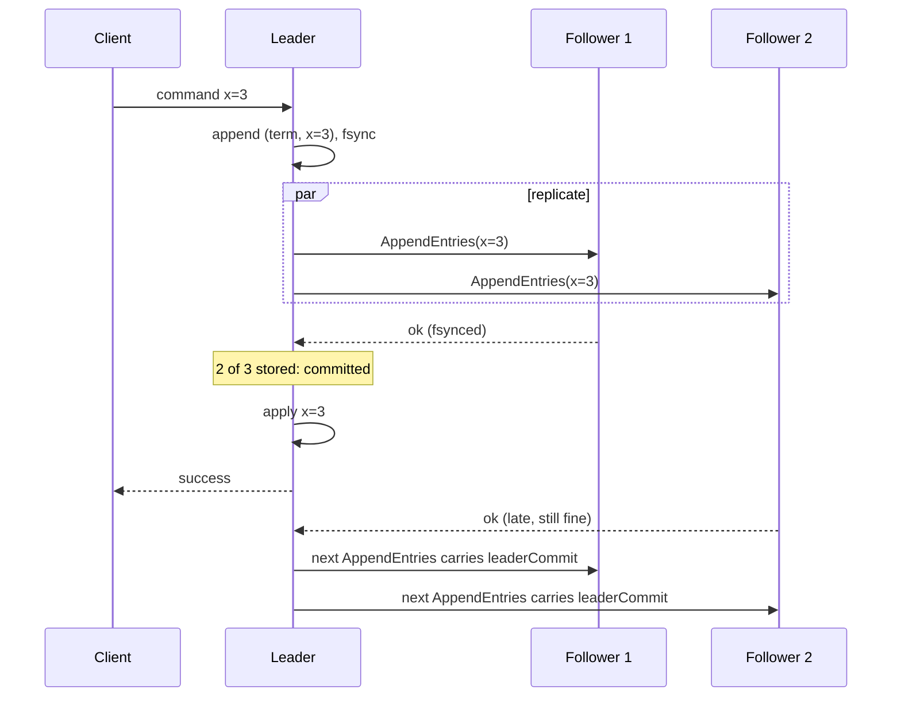
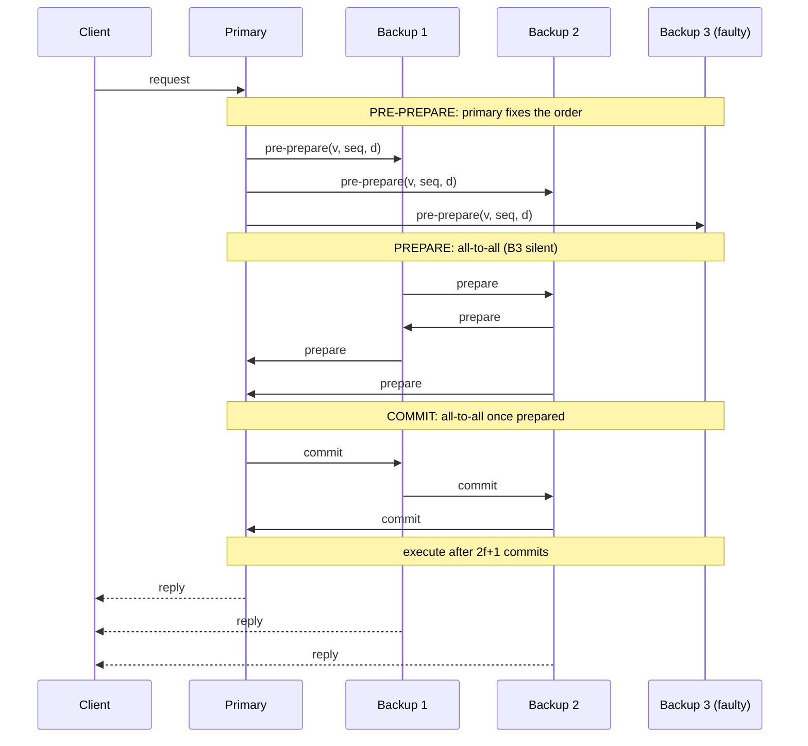
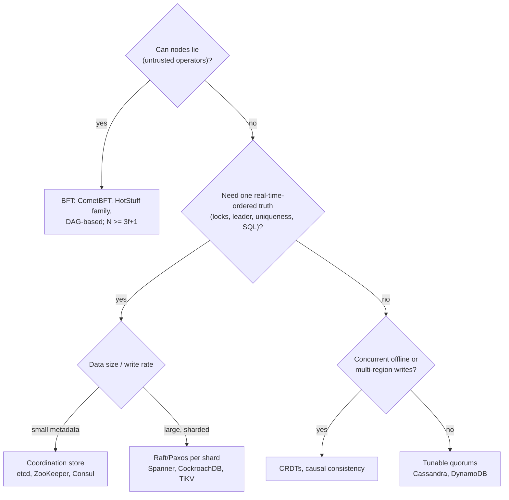

[Distributed Systems Hub](./) &raquo; Consensus &amp; Coordination

**Consensus** is the problem of getting a group of unreliable machines to agree on a value, or on a sequence of values, even though some of them crash and messages are delayed or lost. It underlies every replicated database, lock service, and cluster orchestrator. This page starts with the limits that make agreement hard (CAP, PACELC, FLP). It then covers the consistency guarantees a system can offer, the quorum arithmetic that makes agreement safe, the main algorithms (Paxos, Raft, and Byzantine protocols from PBFT to HotStuff), and how production systems use them in 2026. Formal proofs are on the [Distributed Systems Theory](../advanced/distributed-systems-theory/) page.

## Table of contents
{: .no_toc .text-delta }

1. TOC
{:toc}

---

## Why Coordination Is Hard

A single machine has one clock, one memory, and a simple failure mode: it either works or it stops. A distributed system has none of these properties. Coordination is the work of making several such nodes behave as though they were one reliable machine. Three facts shape everything on this page:

1. **The network is asynchronous and unreliable.** Messages can be delayed, reordered, duplicated, or lost. You cannot tell "the remote node is slow" from "the remote node is dead" by waiting, because any finite timeout can be wrong (see [Failure Detection](failure-detection.html)).
2. **Failures are partial.** Some nodes keep running while others crash, so the system has to make progress with an incomplete and possibly contradictory view of the world.
3. **There is no global clock.** Ordering events across nodes needs explicit machinery such as logical clocks, leaders, or consensus. Wall-clock timestamps are not enough.

The **Two Generals Problem** shows the core difficulty. Two armies must attack at the same time, and they can communicate only through messengers who may be captured. No finite exchange of messages can guarantee that both generals commit, because the sender of the last message never knows whether it arrived. Real systems therefore settle for *eventual* or *probabilistic* certainty rather than the absolute kind (see the [formal statement](../advanced/distributed-systems-theory/#two-generals-problem)).



## CAP and PACELC

### CAP Theorem

The CAP theorem (conjectured by Brewer in 2000, proved by Gilbert and Lynch in 2002) involves three properties of a replicated data store:

- **Consistency (C):** every read returns the most recent write. Here this specifically means *linearizability*.
- **Availability (A):** every request to a non-failing node eventually gets a non-error response.
- **Partition tolerance (P):** the system keeps operating even when messages between groups of nodes are lost.

Real networks do partition, so P is not optional. The theorem therefore comes down to one choice, which only applies *while a partition is in progress*:



A **CP** system refuses requests it cannot prove are consistent, so the minority side of a partition stops accepting writes and often stops serving linearizable reads too. An **AP** system keeps answering on both sides and reconciles divergent writes afterwards, so some reads will be stale.

"Pick two of three" is a common misreading. CAP forces a choice only during a partition, and only for the two narrow definitions of C and A above. Most real systems are neither fully CP nor fully AP. Many offer per-operation choices, and many satisfy neither definition exactly (Kleppmann, *A Critique of the CAP Theorem*, 2015). PACELC is the more useful way to describe them.

### PACELC

PACELC (Abadi, 2012) adds the normal case, when there is no partition, to CAP:

> **If** there is a **P**artition, trade **A**vailability against **C**onsistency; **E**lse, trade **L**atency against **C**onsistency.

The "else" half matters more day to day. Stronger consistency means coordinating with more replicas on each operation, which adds latency. A linearizable read may have to contact a quorum or confirm leadership, while an eventually consistent read can be served by the nearest replica.

| System | During a partition | Normal operation | PACELC |
|--------|--------------------|------------------|--------|
| Spanner, CockroachDB | Consistent; minority stalls | Consistent; pays quorum and commit-wait latency | PC/EC |
| etcd, ZooKeeper, Consul | PC | EC | PC/EC |
| MongoDB (majority write/read concerns) | PC | EC | PC/EC; weaker concerns move it toward PA/EL |
| Cassandra, ScyllaDB (`ONE`/`LOCAL_ONE`) | PA | EL | PA/EL; `QUORUM` moves it toward EC |
| DynamoDB (default eventually consistent reads) | PA | EL | PA/EL; strongly consistent reads are opt-in |

Describe a data store by both halves. "It's AP" tells you what happens during a rare partition. "It's EL" tells you the trade-off you pay on every request.

## The FLP Impossibility Result

The **Fischer–Lynch–Paterson** theorem (1985) is the formal foundation of consensus:

> In an asynchronous system in which even **one** process may crash, **no** deterministic algorithm can guarantee that all non-faulty processes reach agreement.

"Asynchronous" means there is no bound on message delay or processing time, so a timeout cannot reliably detect a crash. The proof constructs an execution that stays forever *bivalent*, meaning both decision values remain reachable. An adversarial scheduler can always delay the one message that would force a decision (see the [full argument](../advanced/distributed-systems-theory/#flp-impossibility-theorem)).

FLP limits *guaranteed termination*, not safety. It does not say consensus is impossible in practice. It says no algorithm can be **safe** (never decides wrongly), **live** (always eventually decides), and **fully asynchronous** at the same time. Real systems get around it by relaxing one assumption:

| Escape route | Idea | Used by |
|--------------|------|---------|
| **Partial synchrony** | Assume the network *eventually* delivers messages within some unknown bound (Dwork, Lynch, Stockmeyer, 1988). The protocol is always safe, and becomes live once that bound holds. | Paxos, Raft, PBFT, HotStuff: almost everything in production |
| **Randomization** | Random coin flips stop the adversary from scheduling the system into permanent indecision. Termination happens with probability 1. | Ben-Or (1983), asynchronous BFT (HoneyBadgerBFT and descendants) |
| **Failure detectors** | Add an unreliable oracle that suspects crashed processes. Chandra, Hadzilacos and Toueg (1996) showed that the weakest detector sufficient for consensus is $\Omega$, which eventually names the same correct leader at every process. $\Omega$ is equivalent to $\Diamond W$. | The theoretical model behind leader election |

The practical lesson is to **keep safety unconditional and accept that liveness is conditional**. A consensus system that sometimes stalls and resumes when the network heals is correct. One that sometimes decides two different values is broken.

## Consistency Models

Consistency is a spectrum. Stronger guarantees need more coordination and cost more latency, so pick the *weakest* model your application can tolerate. The single-object models, strongest first:

| Model | Guarantee | Available under partition? | Typical use |
|-------|-----------|----------------------------|-------------|
| **Linearizable** | Each operation appears to happen atomically at one instant between its call and its return, in real-time order | No | Locks, leader election, config stores, uniqueness |
| **Sequential** | One global order consistent with each process's program order, not necessarily with real time | No | Replicated state machines without real-time reads |
| **Causal** | Operations related by happens-before are seen in that order everywhere; concurrent operations may appear in different orders | Yes (the strongest model that is) | Comment threads, collaborative editing |
| **Eventual** | If writes stop, replicas converge; intermediate reads may be stale | Yes | Caches, DNS, shopping carts, feeds |

Consistency models describe **single operations on single objects**. Isolation levels (serializable, snapshot isolation, and so on) describe **multi-object transactions**. The two meet in **strict serializability**: transactions that are serializable *and* respect real-time order. Spanner, CockroachDB, FoundationDB, and Cassandra 6's Accord transactions aim for this. For how these claims are tested, see [Testing Distributed Systems](testing-distributed-systems.html).

### Linearizability

A linearizable register behaves exactly like a single, non-replicated variable. If operation A completes before operation B starts in wall-clock time, then A is ordered before B. Linearizability is also *composable*: a system made of linearizable objects is linearizable as a whole. Consensus protocols exist to provide linearizable replicated state. For example, etcd's default reads and writes are linearizable, and its `serializable` read option trades that for lower latency.

### Sequential Consistency

There is *some* total order of all operations that respects each process's program order, but it does not have to match real time across processes. A client can write a value, tell a friend by phone, and the friend's read can still legally return the old value. A replicated state machine that serves reads from any follower's local copy gives roughly this model.

### Causal Consistency

If one operation happens-before another (Lamport's relation), every node sees them in that order. Concurrent operations may be seen in different orders on different nodes. This is the strongest model that can stay available on both sides of a partition, so it fits well where cause and effect must be preserved but global agreement is too expensive. A reply must never appear before the comment it answers.

### Eventual Consistency

If writes stop, all replicas eventually converge. Nothing is promised about *when*, or about what reads return in the meantime. Systems make this tolerable with **session guarantees** (read-your-writes, monotonic reads, monotonic writes, writes-follow-reads), which are described on [Client-Side Consistency](client-side-consistency.html#session-guarantees). Convergence comes from conflict resolution: last-writer-wins timestamps, version vectors with application-level merges, or [CRDTs](client-side-consistency.html#crdts-conflict-free-replicated-data-types).

Formal definitions are in [Distributed Systems Theory](../advanced/distributed-systems-theory/#consistency-models).

## Quorums: The Arithmetic Underneath

Every algorithm below rests on one counting argument. A **quorum** is a set of nodes chosen so that *any two quorums that must not conflict share at least one node*. If every committed decision is recorded by a quorum, any later quorum includes at least one node that knows about it. That shared node prevents a contradictory decision from committing.

For $N$ replicas with read quorum $R$ and write quorum $W$:

$$
W + R > N \qquad \text{and} \qquad 2W > N
$$

- $W + R > N$: every read quorum overlaps every write quorum, so a read reaches at least one replica holding the latest write.
- $2W > N$: any two write quorums overlap, so two conflicting writes cannot both commit.

The usual choice is a **strict majority**, $W = R = \lfloor N/2 \rfloor + 1$:

| Cluster size $N$ | Majority | Crash failures tolerated |
|:---:|:---:|:---:|
| 3 | 2 | 1 |
| 4 | 3 | 1 |
| 5 | 3 | 2 |
| 7 | 4 | 3 |
| $2f+1$ | $f+1$ | $f$ |

The $N=4$ row shows why consensus clusters use odd sizes: a fourth node adds no fault tolerance and makes the quorum larger. Clusters larger than 5 or 7 voters are rare because each write waits for more acknowledgements. Systems scale reads with **non-voting members** instead (etcd learners, ZooKeeper observers).

Dynamo-style stores expose $N$, $R$ and $W$ as per-request settings. $R = W = 1$ is fast but gives no overlap. $R + W > N$ gives overlap but not linearizability, because concurrent writes and read repair still allow anomalies without extra machinery. Consensus systems fix both quorums at a majority.

**Flexible Paxos** (Howard, Malkhi and Spiegelman, 2016) showed that majority-for-everything is stronger than necessary. Leader election (Paxos phase 1) and replication (phase 2) must intersect *each other*, but two replication quorums do not need to intersect. The condition is $Q_1 + Q_2 > N$. For example, with $N = 10$ a system can replicate to 3 nodes and elect with 8, which trades slower, rarer elections for faster commits.

## Paxos

Paxos (Lamport; written in 1989, published in 1998 as *The Part-Time Parliament*, and re-explained in *Paxos Made Simple*, 2001) was the first practical consensus algorithm proven correct, and almost every later protocol derives from it. It lets a set of nodes agree on one value despite crashes and lost, delayed, or reordered messages. Its safety does not depend on timing at all. FLP costs it only liveness.

### Roles

- **Proposers** suggest values.
- **Acceptors** vote. A value is *chosen* once a majority of acceptors accept it.
- **Learners** find out which value was chosen.

In practice each process plays all three roles. The protocol proceeds in **ballots**, each with a unique, increasing proposal number (typically a counter paired with the node ID).

### The Two Phases

**Phase 1: Prepare and Promise.**

1. A proposer picks a number `n` and sends `Prepare(n)` to the acceptors.
2. An acceptor that has not promised anything higher replies `Promise(n)`, including the highest-numbered proposal `(n', v')` it has already accepted, if any. It then ignores any proposal numbered below `n`.

**Phase 2: Accept and Accepted.**

3. Once a proposer has promises from a majority, it chooses a value. If any promise reported an accepted `(n', v')`, it **must** use the value with the highest `n'`, and this rule is what preserves agreement. Otherwise it may propose its own value. It sends `Accept(n, v)`.
4. An acceptor accepts `(n, v)` unless it has since promised a higher number. Once a majority accept, `v` is **chosen** permanently.



The safety invariant: **once a value is chosen, every higher-numbered proposal that completes carries the same value.** Phase 1 makes a new proposer adopt the highest accepted value reported by a majority, and that majority overlaps the majority that chose the value.

### Multi-Paxos

Basic Paxos agrees on *one* value. A replicated state machine needs agreement on an unbounded *log* of commands. Running a separate two-phase instance for each log slot is slow. Competing proposers can also **livelock**: each keeps raising its proposal number above the other's, so neither ever finishes phase 2. This is the liveness gap FLP predicts, showing up in practice.

**Multi-Paxos** addresses both problems. It elects a stable **leader** (a distinguished proposer), which runs phase 1 once for all future slots and then commits each new command with a single phase-2 round trip. Google's Chubby and Spanner use this form. Raft has the same structure, described more concretely.

## Raft

Raft (Ongaro and Ousterhout, 2014) was designed to be *understandable* while giving the same guarantees as Multi-Paxos. It splits consensus into **leader election**, **log replication**, and **safety**. etcd (and therefore Kubernetes), Consul, CockroachDB, TiKV, YugabyteDB, and Kafka's KRaft metadata quorum all use Raft or a close variant.

Every node is a follower, a candidate, or the leader. Time is divided into **terms**, increasing integers that act as a logical clock. Each term starts with an election and has at most one leader. A node that sees a higher term immediately adopts it and becomes a follower.



### Leader Election

- Each follower has a randomized **election timeout**. The paper suggests 150–300 ms; etcd defaults to a 100 ms heartbeat and a 1000 ms election timeout. The leader's periodic `AppendEntries` heartbeats reset the timeout.
- When the timeout fires, the follower increments its term, becomes a **candidate**, votes for itself, and sends `RequestVote` to every peer.
- A node grants at most one vote per term. It votes only for a candidate whose log is **at least as up-to-date** as its own: a higher last term, or the same last term and an equal or longer log. A candidate with votes from a majority becomes leader.
- **Split votes** are resolved by the randomized timeouts: in the next round one node almost always times out first.

The receiving side of `RequestVote` is where the safety rules are enforced:

```python
def handle_request_vote(self, term, candidate_id, last_log_index, last_log_term):
    if term > self.current_term:              # newer term: step down, forget old vote
        self.current_term, self.voted_for, self.state = term, None, "follower"
    if term < self.current_term:
        return self.current_term, False       # stale candidate

    my_last_term = self.log[-1].term if self.log else 0
    my_last_index = len(self.log)
    log_ok = (last_log_term > my_last_term or
              (last_log_term == my_last_term and last_log_index >= my_last_index))

    if self.voted_for in (None, candidate_id) and log_ok:
        self.voted_for = candidate_id
        self.persist()                        # term + vote must hit disk before replying
        self.reset_election_timer()
        return self.current_term, True
    return self.current_term, False

def is_majority(votes, cluster_size):
    return votes >= cluster_size // 2 + 1     # cluster_size counts the candidate itself
```

### Log Replication

The leader is the only entry point for commands:

1. The leader appends the command to its log with the current term and the next index.
2. It sends `AppendEntries(term, prevLogIndex, prevLogTerm, entries, leaderCommit)` to each follower.
3. A follower accepts only if its log contains an entry at `prevLogIndex` with term `prevLogTerm`. This consistency check enforces the **Log Matching Property**. If the check fails, the leader moves `prevLogIndex` back until the logs agree, then overwrites the follower's divergent tail.
4. When the entry is stored on a **majority**, it is **committed**. The leader applies it and replies to the client. Followers learn the new commit index from later `AppendEntries` messages.



Log Matching gives an inductive guarantee: if two logs have an entry with the same index and term, they are identical up to that index. A follower therefore only needs to check a single `(index, term)` pair.

### Safety

| Rule | Statement | Why it matters |
|------|-----------|----------------|
| **Election restriction** | Only a candidate whose log is at least as up-to-date as a majority's can win | Committed entries are on a majority, the voters are a majority, and the two overlap, so a new leader already has every committed entry |
| **Leader append-only** | A leader never overwrites or deletes its own entries | Divergence is always repaired on followers, never on the leader |
| **Current-term commit rule** | A leader counts replicas only for entries **from its own term**. Earlier entries commit indirectly when a current-term entry above them commits. | Closes the case (Figure 8 in the paper) where an old entry stored on a majority could still be overwritten by a later leader. New leaders therefore commit a no-op entry at once. |

Together these rules give **State Machine Safety**: if any node has applied an entry at some index, no node will ever apply a different entry at that index.

### Linearizable Reads

A leader cannot simply answer reads from local state, because it may have been deposed without knowing it. Serving local reads could return stale data. The options:

| Technique | How | Cost |
|-----------|-----|------|
| **Log read** | Append the read to the log like a write | A full replication round and a disk write |
| **ReadIndex** | Record the commit index, confirm leadership with one heartbeat round to a majority, wait until that index is applied, then read locally | One network round trip, no disk write. etcd's default. |
| **Lease read** | The leader assumes that no rival can be elected until its lease expires, so it reads locally with no network round | No extra round, but **depends on bounded clock drift** |
| **Follower read** | A follower asks the leader for the current ReadIndex, waits to catch up, then serves the read | Spreads read load across followers |

### Operational Refinements

- **PreVote.** Before incrementing its term, a would-be candidate asks whether it *could* win. This stops a node that has been partitioned away, and has been raising its term in isolation, from disrupting a healthy leader when it rejoins.
- **CheckQuorum.** A leader that has not heard from a majority within an election timeout steps down, so a leader on the minority side of a partition stops acting as leader.
- **Membership changes.** The paper's **joint consensus** moves through a configuration that requires majorities of *both* the old and new member sets, so two disjoint majorities cannot exist during the change. Ongaro's dissertation adds a simpler method: change **one server at a time**, since any two majorities of configurations that differ by one node overlap. etcd adds **learners**, non-voting members that catch up before being promoted.
- **Snapshots.** Nodes periodically snapshot the state machine and discard the log prefix it covers. A follower that falls behind the snapshot is caught up with `InstallSnapshot`.

## Beyond a Single Leader

A single stable leader is simple, but the leader is a throughput bottleneck, and in a geo-distributed cluster clients far from it pay extra round trips.

| Approach | Idea | Examples |
|----------|------|----------|
| **Sharded consensus** | Split the keyspace into ranges, each with its own Raft or Paxos group and its own leader, spread across nodes | Spanner, CockroachDB, TiKV, YugabyteDB |
| **Leaderless / multi-leader Paxos** | Any replica can lead a command. Commands that don't conflict commit in one round trip. | EPaxos (2013), Accord (Cassandra 6, pre-GA in 2026) |
| **Flexible quorums** | Smaller replication quorums, larger election quorums | Flexible Paxos |
| **Consensus for metadata only** | Replicate data with a simpler primary-backup protocol, and use consensus only to choose the primary and configuration | Kafka (KRaft controller quorum), FoundationDB, many storage systems |

## Byzantine Fault Tolerance

Paxos and Raft assume **crash faults**: a node may stop or fall behind, but it never lies. **Byzantine** faults cover everything else. A node may send conflicting messages to different peers, forge values, or collude with others, whether because of a bug, corrupted hardware, or an attacker. This is the fault model for permissionless blockchains, multi-organization consortia, and some safety-critical avionics.

### The 3f + 1 Bound

Lamport, Shostak and Pease (1982) showed that with unauthenticated ("oral") messages, tolerating $f$ Byzantine nodes requires

$$
N \ge 3f + 1
$$

The same bound applies to any consensus protocol under **partial synchrony**, even when messages are signed (Dwork, Lynch and Stockmeyer, 1988). Only in fully synchronous models can signatures do better: the Dolev–Strong protocol tolerates any $f < N$, at the cost of $f + 1$ rounds.

The reason is quorum overlap again. With $N = 3f + 1$, the protocol can wait for only $N - f = 2f + 1$ replies, because $f$ nodes may never answer. Two quorums of size $2f + 1$ overlap in at least

$$
2(2f + 1) - (3f + 1) = f + 1
$$

nodes, so at least one node in the overlap is honest. Crash tolerance needs only one overlapping node. Byzantine tolerance needs $f$ more, because faulty nodes can vote on both sides. The [proof is on the theory page](../advanced/distributed-systems-theory/#byzantine-fault-tolerance).

### PBFT

**Practical Byzantine Fault Tolerance** (Castro and Liskov, 1999) was the first BFT protocol fast enough for real use. It runs with $N = 3f + 1$ replicas under partial synchrony and uses MACs or signatures to authenticate messages. One replica is the **primary** and the others are **backups**. Each request goes through three phases:



1. **Pre-prepare.** The primary assigns the request a sequence number in the current view `v` and broadcasts `pre-prepare` with the request digest `d`.
2. **Prepare.** Each backup that accepts the pre-prepare broadcasts `prepare`. A replica with the pre-prepare and $2f$ matching prepares from other replicas is **prepared**. A quorum of $2f + 1$ replicas has endorsed this order in this view, so no conflicting order can be prepared.
3. **Commit.** Each prepared replica broadcasts `commit`. With $2f + 1$ matching commits, a replica executes the request and replies.

The client waits for **$f + 1$ matching replies**. At most $f$ replicas are faulty, so at least one of those replies is from an honest replica.

If the primary is faulty (it equivocates or stalls), backups time out and start a **view change** to the next primary. The view change carries proof of every prepared request, so committed history survives.

### Modern BFT

PBFT's all-to-all phases cost $O(N^2)$ messages per decision, and its view change is more expensive still. That limits it to a few dozen replicas. Later protocols keep the $3f + 1$ bound and the quorum logic but change how messages flow:

| Protocol | Key idea | Deployed in |
|----------|----------|-------------|
| **Tendermint / CometBFT** | Round-based BFT with a rotating proposer and gossip dissemination | Cosmos-ecosystem chains |
| **HotStuff** (Yin et al., 2019) | Leader gathers votes into threshold or aggregated signatures. Linear communication, including view change. Pipelined phases. | Diem (discontinued), and descendants in Aptos and others |
| **DAG-based BFT** (Narwhal/Bullshark, Mysticeti) | Separate data dissemination (a DAG of certified or uncertified blocks) from ordering. The order is read off the DAG with no extra messages. | Sui (Mysticeti on mainnet since 2024) |

### When to Pay for BFT

Byzantine tolerance is expensive: more replicas, more messages, and cryptographic signing on the critical path. Use it only when a node really cannot be trusted to fail cleanly, as in permissionless blockchains, consortia of mutually distrustful organizations, or systems where one corrupted component must not be able to drive the others to a wrong decision. Within a single operator's data center, crash-tolerant Raft or Paxos plus end-to-end checksums is almost always the better choice.

## Consensus in Production (2026)

| System | Protocol | Notes |
|--------|----------|-------|
| **etcd** (Kubernetes control plane) | Raft | v3.6 (May 2025) removed the v2 store and added `/livez` and `/readyz` endpoints. Linearizable reads use ReadIndex. |
| **Apache Kafka** | KRaft (Raft variant) | ZooKeeper mode was removed in Kafka 4.0 (March 2025). Metadata lives in a Raft-replicated log on controller nodes. |
| **ZooKeeper** | ZAB (atomic broadcast, Paxos-like) | Still widely used (HBase, older Hadoop stacks, Solr). |
| **Consul, Nomad, Vault** | Raft (`hashicorp/raft`) | Consul and Nomad also use SWIM gossip (Serf/memberlist) for membership (see [Failure Detection](failure-detection.html#swim)). |
| **Spanner** | Multi-Paxos per split | TrueTime commit-wait gives external consistency. |
| **CockroachDB, TiKV, YugabyteDB** | Raft per range or tablet | Thousands of Raft groups per node, with batched heartbeats. |
| **Apache Cassandra** | Paxos (LWT); Accord and Transactional Cluster Metadata in 6.0 | Cassandra 6.0 was still pre-GA as of September 2026. It moves cluster metadata from gossip to a linearized log. |

## Choosing the Right Tool



In short: if nodes can lie, you need **BFT**. Otherwise, if you need a single real-time-ordered truth, you need **consensus** (Raft or Paxos). Otherwise, use **quorums or CRDTs** at the weakest consistency your application tolerates, and take the latency and availability gains.

## See Also

- **[Distributed Systems Hub](./)**: section index
- **[Failure Detection & Gossip](failure-detection.html)**: the timeouts and membership views that consensus relies on for liveness
- **[Replication Strategies](replication-strategies.html)**: leader, multi-leader and leaderless replication built on these primitives
- **[Client-Side Consistency & Sync](client-side-consistency.html)**: CRDTs, session guarantees, offline-first sync
- **[Testing Distributed Systems](testing-distributed-systems.html)**: Jepsen-style checking of consistency claims
- **[Distributed Systems Theory](../advanced/distributed-systems-theory/)**: proofs of FLP, CAP and the Byzantine bound, plus TLA+ specifications
- **[Kubernetes](../technology/kubernetes/)**: etcd as the cluster's consistent control-plane store
- **[Database Design](../technology/database-design/)**: replication, sharding and consistency in databases

### Foundational References

- Lamport, Shostak, Pease, *The Byzantine Generals Problem* (1982)
- Fischer, Lynch, Paterson, *Impossibility of Distributed Consensus with One Faulty Process* (1985)
- Dwork, Lynch, Stockmeyer, *Consensus in the Presence of Partial Synchrony* (1988)
- Chandra, Hadzilacos, Toueg, *The Weakest Failure Detector for Solving Consensus* (1996)
- Lamport, *The Part-Time Parliament* (1998) and *Paxos Made Simple* (2001)
- Castro, Liskov, *Practical Byzantine Fault Tolerance* (1999)
- Gilbert, Lynch, *Brewer's Conjecture and the Feasibility of Consistent, Available, Partition-Tolerant Web Services* (2002)
- Abadi, *Consistency Tradeoffs in Modern Distributed Database System Design* (2012)
- Ongaro, Ousterhout, *In Search of an Understandable Consensus Algorithm* (2014); Ongaro, *Consensus: Bridging Theory and Practice* (PhD thesis, 2014)
- Howard, Malkhi, Spiegelman, *Flexible Paxos: Quorum Intersection Revisited* (2016)
- Yin et al., *HotStuff: BFT Consensus with Linearity and Responsiveness* (2019)
