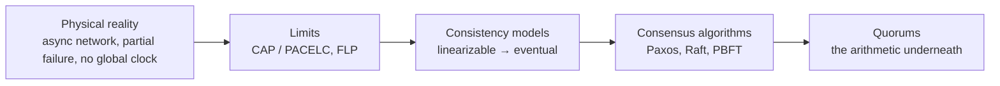
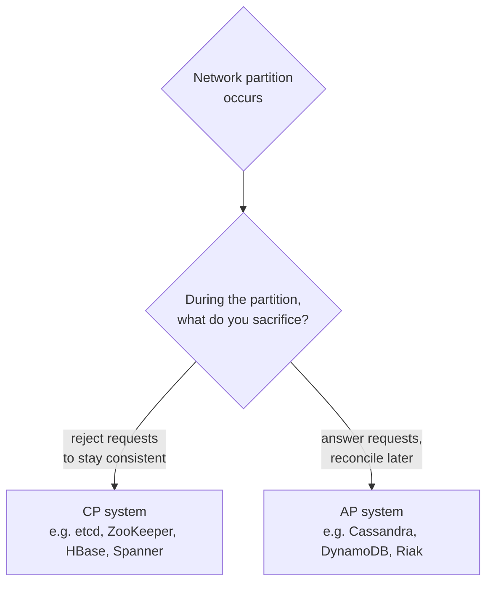
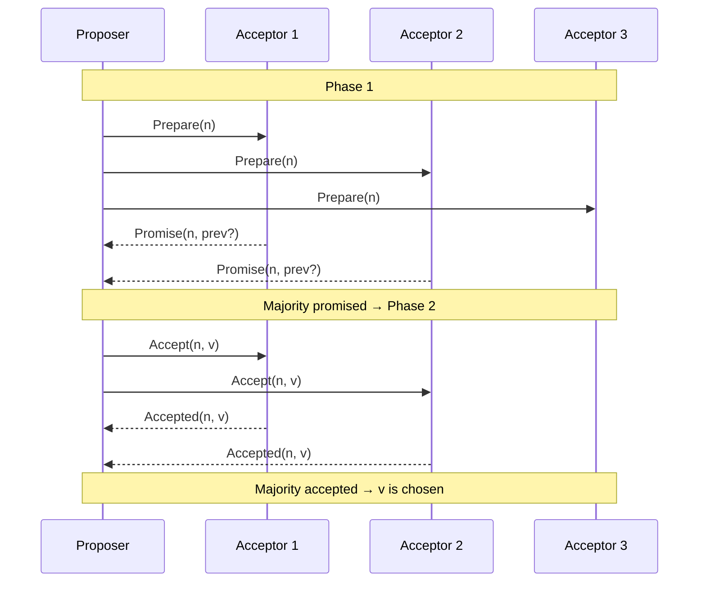
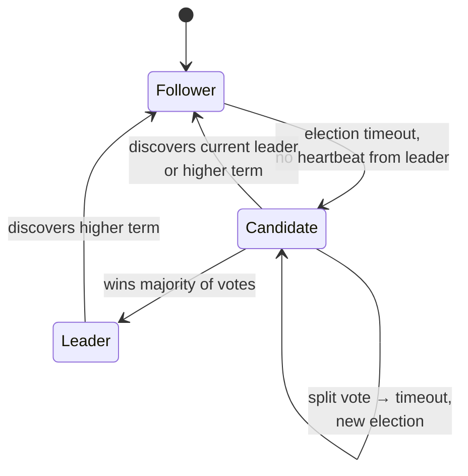
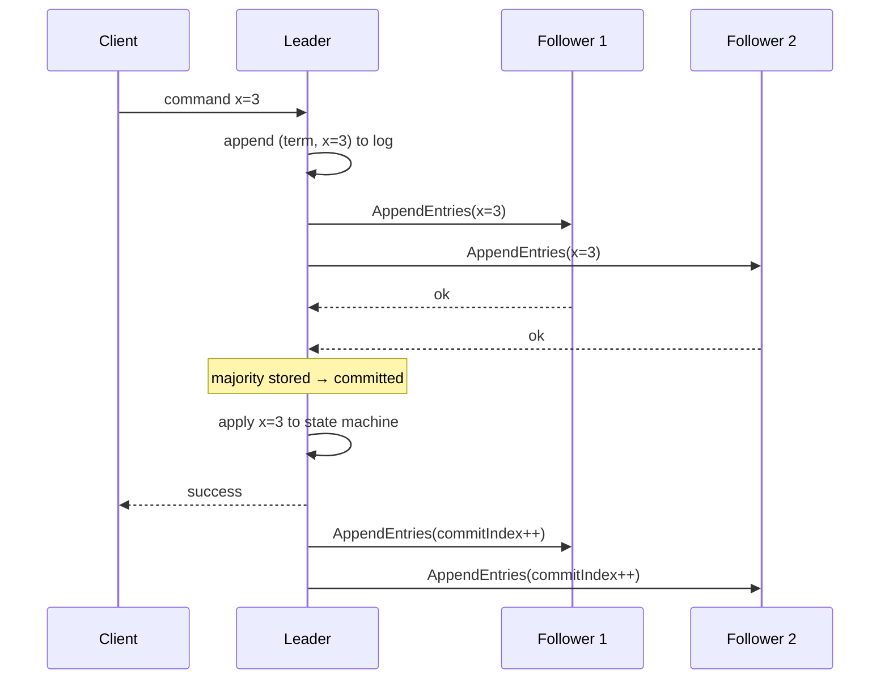
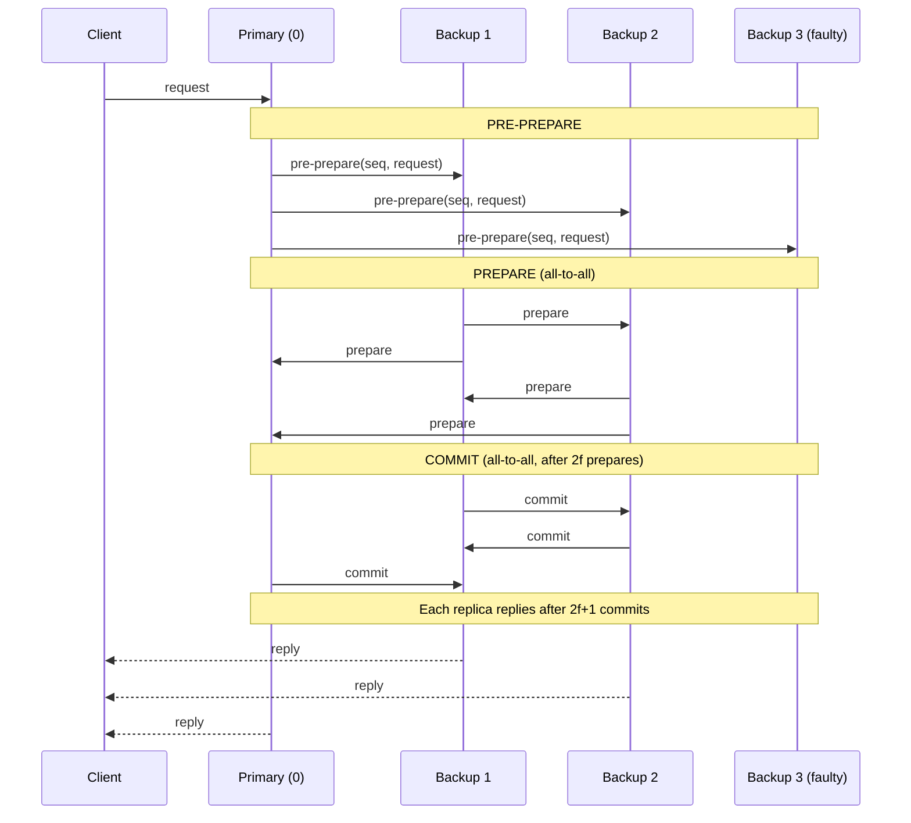

<div class="hero-section" style="background: linear-gradient(135deg, #667eea 0%, #764ba2 100%); color: white; padding: 3rem 2rem; margin: -2rem -3rem 2rem -3rem; text-align: center;">
  <h1 style="color: white; margin: 0; font-size: 2.5rem;">Consensus &amp; Coordination</h1>
  <p style="font-size: 1.25rem; margin-top: 1rem; opacity: 0.9;">How unreliable nodes agree on a single truth: CAP, FLP, consistency models, Paxos, Raft, BFT, and quorums</p>
</div>

[Distributed Systems Hub](./) &raquo; Consensus &amp; Coordination

<div class="code-example" markdown="1">
Consensus is the beating heart of every replicated database, lock service, and orchestrator. This page builds from the limits that make agreement *hard* (CAP, PACELC, FLP), through the consistency guarantees a system can offer, into the algorithms that actually deliver them (Paxos, Raft, PBFT), and the quorum arithmetic that ties them together. For the formal proofs behind the impossibility results, see [Distributed Systems Theory](../advanced/distributed-systems-theory/).
</div>

## Table of contents
{: .no_toc .text-delta }

1. TOC
{:toc}

---

## Why Coordination Is Hard

A single machine has one clock, one memory, and one failure mode: it either works or it stops. A distributed system has none of those luxuries. Messages are delayed, reordered, duplicated, or lost; nodes crash and recover with stale state; and there is no shared "now" to order events against. Coordination is the discipline of getting several such nodes to behave *as if* they were one reliable machine.

Three physical realities drive everything that follows:

1. **The network is asynchronous and unreliable.** You cannot distinguish "the remote node is slow" from "the remote node is dead" by waiting — any finite timeout can be wrong.
2. **Failures are partial.** Some nodes keep running while others crash, so the system must make progress with an incomplete and possibly contradictory view of the world.
3. **There is no global clock.** Ordering events across nodes requires explicit machinery (logical clocks, leaders, or consensus), not wall-clock timestamps.

The classic illustration is the **Two Generals Problem**: two armies must attack simultaneously, communicating only by messengers who may be captured. No finite exchange of messages can guarantee both generals commit to attacking, because the last message sent is never known to have arrived. This is the seed of the impossibility results below, and it is why every real system substitutes *probabilistic* or *eventual* certainty for the absolute kind. The formal statement lives in [Distributed Systems Theory](../advanced/distributed-systems-theory/#two-generals-problem).



## CAP and PACELC

### CAP Theorem

Every distributed system that replicates data must, when a network partition splits its nodes, choose between two of three properties:

- **Consistency (C):** every read returns the most recent write (here, *linearizable* consistency — a single, real-time-ordered view).
- **Availability (A):** every request to a non-failing node receives a (non-error) response.
- **Partition tolerance (P):** the system keeps operating despite arbitrary message loss between node groups.

Because real networks *do* partition, P is not optional. The theorem therefore reduces to a binary choice *during a partition*:



A **CP** system (etcd, ZooKeeper, consensus-backed databases) refuses to serve requests it cannot prove are consistent — the minority side of a partition stops accepting writes. An **AP** system (Cassandra, Dynamo-style stores) keeps answering on both sides and reconciles divergent writes afterward, accepting that some reads will be stale.

The common misreading is "pick two of three at all times." CAP only forces a choice *while a partition is in progress*. When the network is healthy, a well-designed system can be both consistent and available — which is exactly what PACELC captures.

### PACELC

PACELC (Abadi, 2012) extends CAP to the common case where there is no partition:

> **If** there is a **P**artition, trade between **A**vailability and **C**onsistency; **E**lse (normal operation), trade between **L**atency and **C**onsistency.

The "else" half is the part CAP ignores and the part you actually live with day to day: stronger consistency requires coordinating more replicas per operation, which costs latency. A linearizable read may need to contact a quorum; an eventually consistent read can be served by the nearest replica.

| System | Partition behavior | Normal-operation behavior | PACELC class |
|--------|-------------------|---------------------------|--------------|
| Spanner | PC (consistent, may stall) | EC (consistent, higher latency) | PC/EC |
| etcd / ZooKeeper | PC | EC | PC/EC |
| Cassandra (tunable) | PA (available, may diverge) | EL (low latency, weaker consistency) | PA/EL |
| DynamoDB (eventual) | PA | EL | PA/EL |
| MongoDB (default) | PC | EC | PC/EC |

The takeaway: characterize a datastore by *both* halves. "It's AP" tells you what happens during the rare partition; "it's EL" tells you the latency/consistency tradeoff you pay on every single request.

## The FLP Impossibility Result

The **Fischer–Lynch–Paterson** theorem (1985) is the formal bedrock under all of consensus:

> In an asynchronous system where even **one** process may crash, **no** deterministic algorithm can guarantee that all non-faulty processes reach agreement (consensus) in bounded time.

"Asynchronous" here means messages can be delayed arbitrarily and there is no upper bound on processing time — so you cannot use a timeout to reliably detect a crash. The proof constructs an infinite execution that stays forever "bivalent" (a state from which both decision values are still reachable): an adversarial scheduler can always delay the one message that would force a decision, keeping the system undecided indefinitely. The full argument is on the [theory page](../advanced/distributed-systems-theory/#flp-impossibility-theorem).

FLP is an impossibility about *guaranteed termination*, not about safety. It does **not** say consensus is impossible in practice — it says no algorithm can be simultaneously **safe** (never decides wrong), **live** (always eventually decides), and **fully asynchronous**. Real systems escape FLP by relaxing one assumption:

- **Partial synchrony / timeouts (Raft, Paxos, Multi-Paxos).** Assume that *eventually* the network behaves well enough (messages arrive within some unknown bound). Algorithms stay safe always and become live once that synchrony holds. This is the route nearly all production systems take — failure detectors built on timeouts are the practical embodiment.
- **Randomization (Ben-Or, modern BFT).** Flip coins so the adversary cannot deterministically schedule the system into eternal indecision; termination becomes probabilistic (probability 1 in the limit).
- **Stronger failure detectors.** Chandra–Toueg showed the *weakest* failure detector that makes consensus solvable is ◇W ("eventually weak") — one that eventually stops suspecting some correct process. This is, in effect, a leader that eventually stays up.

The practical lesson encoded in every algorithm below: **prioritize safety, accept that liveness is conditional.** A consensus system that occasionally stalls (and resumes when the network heals) is correct; one that occasionally decides two different values is catastrophically broken.

## Consistency Models

Consistency is a spectrum, not a switch. The stronger the guarantee, the more coordination (and latency) it costs — so the rule of thumb is to pick the *weakest* model your application can tolerate. The models below are ordered from strongest to weakest:

| Model | Guarantee | Cost | Typical use |
|-------|-----------|------|-------------|
| **Linearizable** | Operations appear atomic and instantaneous, in real-time order | Highest (cross-node coordination per op) | Locks, leader election, financial ledgers |
| **Sequential** | A single global order consistent with each process's program order | High | Replicated state machines |
| **Causal** | Causally related operations seen in the same order everywhere | Moderate | Collaborative editing, comment threads |
| **Eventual** | Replicas converge if updates stop; readers may see stale data | Lowest (no coordination on the write path) | Shopping carts, DNS, social feeds |

### Linearizability

The gold standard. Every operation appears to take effect atomically at some single instant between its invocation and its response, and that instant respects real-time order: if operation A completes before operation B begins (in wall-clock time), then A is ordered before B. A linearizable register behaves exactly like a single, non-replicated variable. Consensus protocols exist precisely to provide linearizable replicated state — etcd's `Get`/`Put` and a Raft-backed key are linearizable.

### Sequential Consistency

Weaker than linearizable: there exists *some* total order of all operations consistent with each process's program order, but that order need not respect real time across processes. Two clients can each see a self-consistent history, yet a later write by one may be ordered before an earlier write by another. Sequential consistency is what a naive "all replicas apply ops in the same order" replicated state machine gives you when you do not also tie ordering to a global clock.

### Causal Consistency

Operations that are *causally related* (one happens-before another, via the Lamport happens-before relation) are seen in that order by every node; concurrent operations may be seen in different orders on different nodes. This is the strongest model achievable **without** sacrificing availability under partition — you can serve reads and writes on both sides of a split and still preserve cause-and-effect. It is the natural fit for comment threads (a reply must never appear before the comment it answers) and collaborative editors.

### Eventual Consistency

The weakest useful guarantee: if writes stop, all replicas eventually converge to the same value. Nothing is promised about *when*, or about what intermediate reads return. To make this tolerable for users, systems layer on **session guarantees**:

- **Read-your-writes:** a process always sees its own prior writes.
- **Monotonic reads:** once a process has seen a value, it never sees an older one.
- **Monotonic writes / writes-follow-reads:** a process's writes are applied in order, and respect the values it read.

Convergence is usually achieved with conflict resolution — last-writer-wins (LWW) timestamps, version vectors, or **CRDTs** (conflict-free replicated data types) whose merge operation is commutative, associative, and idempotent so replicas converge regardless of message order or duplication.

For the formal definitions and the happens-before relation that underpins causal ordering, see [Distributed Systems Theory](../advanced/distributed-systems-theory/#consistency-models).

## Quorums: The Arithmetic Underneath

Before the named algorithms, it pays to understand the counting argument that makes all of them safe. A **quorum** is any subset of nodes large enough that *any two quorums overlap in at least one node*. That overlap is the entire trick: if every committed decision is witnessed by a quorum, and every later quorum shares a node with every earlier one, then no two contradictory decisions can both commit — the shared node would have to remember both, which it refuses to do.

For a cluster of $N$ replicas using a read quorum $R$ and write quorum $W$, the safety condition is:

$$
W + R > N \quad \text{and} \quad W > N/2
$$

- $W + R > N$ guarantees every read quorum overlaps every write quorum, so a read sees at least one replica holding the latest write.
- $W > N/2$ guarantees any two write quorums overlap, preventing two conflicting writes from both committing (this is the **majority** quorum used by consensus protocols).

The simplest and most common choice is the **strict majority**: $W = R = \lfloor N/2 \rfloor + 1$. With $N = 5$, a majority is $3$; the system tolerates the loss of $2$ nodes and still forms a quorum. This is why consensus clusters are sized at odd numbers (3, 5, 7): an even cluster gets no extra fault tolerance but needs more nodes for a majority.

| Cluster size $N$ | Majority quorum | Crash failures tolerated |
|:---:|:---:|:---:|
| 3 | 2 | 1 |
| 5 | 3 | 2 |
| 7 | 4 | 3 |
| 2f+1 | f+1 | f |

Dynamo-style AP stores expose $N$, $R$, and $W$ as tunable knobs so you can slide along the consistency/latency curve per request: $R=W=1$ is fast but offers no overlap guarantee (eventual); $W=N, R=1$ makes writes expensive but reads cheap and strongly consistent. CP consensus systems fix $W=R=$ majority and never relax it.

## Paxos

Paxos (Lamport, 1998) is the original proven-correct consensus algorithm and the conceptual ancestor of nearly everything else. It lets a set of nodes agree on a single value even though nodes may crash and messages may be lost, delayed, or reordered. Its reputation for being hard to understand is deserved; the payoff is that its *safety* is airtight regardless of timing — it never violates agreement, and FLP only costs it liveness.

### Roles

- **Proposers** suggest values to be chosen.
- **Acceptors** vote on proposals; a value is chosen when a majority of acceptors accept it.
- **Learners** discover the chosen value.

In practice a single process plays all three roles. The protocol proceeds in numbered **rounds** (ballots), each identified by a globally unique, monotonically increasing proposal number.

### The Two Phases

**Phase 1 — Prepare / Promise.**
1. A proposer picks a proposal number `n` (higher than any it has used) and sends `Prepare(n)` to a majority of acceptors.
2. An acceptor receiving `Prepare(n)`: if `n` is greater than any proposal it has already promised, it replies `Promise(n)` and includes the highest-numbered proposal `(n', v')` it has *already accepted*, if any. From then on it refuses any proposal numbered below `n`.

**Phase 2 — Accept / Accepted.**
3. If the proposer gets `Promise` from a majority, it picks the value `v`: if any acceptor returned an already-accepted `(n', v')`, it **must** reuse the value with the highest `n'` (this is what preserves agreement); otherwise it is free to choose its own value. It sends `Accept(n, v)`.
4. An acceptor receiving `Accept(n, v)` accepts it *unless* it has already promised a higher number. Once a majority accept `(n, v)`, `v` is **chosen** — permanently.



The crucial safety invariant: **once a value is chosen, every higher-numbered proposal that completes will choose the same value**, because Phase 1 forces a new proposer to adopt the highest already-accepted value it discovers from a majority. Two majorities always overlap (the quorum argument above), so the new proposer is guaranteed to learn about any chosen value.

### Why Bare Paxos Isn't Enough, and Multi-Paxos

"Basic" Paxos agrees on *one* value. A replicated state machine needs to agree on an unbounded *log* of commands. Running independent Paxos instances per log slot works but pays the two-phase cost every time, and competing proposers can livelock — two proposers leapfrogging each other's proposal numbers so neither ever completes Phase 2 (FLP's liveness gap made concrete).

**Multi-Paxos** fixes both: elect a stable **leader** (a distinguished proposer) and let it skip Phase 1 for subsequent log entries. Once the leader has run Phase 1 once and become established, it streams `Accept` messages for each new command with a single round-trip. This is the dominant production form (used inside Google Chubby and Spanner) — and it is essentially the structure Raft formalizes more legibly.

## Raft

Raft (Ongaro & Ousterhout, 2014) was explicitly designed to be *understandable* while providing exactly the same guarantees as Multi-Paxos. It decomposes consensus into three subproblems — **leader election**, **log replication**, and **safety** — and most production coordination systems (etcd, Consul, TiKV, CockroachDB's range consensus) are built on it.

Each node is in one of three states and time is divided into **terms**, monotonically increasing integers that act as a logical clock. Each term begins with an election and has at most one leader.



### Leader Election

- Every follower runs a randomized **election timeout** (e.g. 150–300 ms). The leader sends periodic empty `AppendEntries` (heartbeats) to reset these timers.
- If a follower's timer fires without a heartbeat, it increments its term, becomes a **candidate**, votes for itself, and sends `RequestVote` RPCs to all peers.
- A node grants its vote at most once per term, and only if the candidate's log is *at least as up-to-date* as its own (see safety). A candidate that collects votes from a majority becomes **leader** and immediately sends heartbeats to assert authority.
- **Split votes** (two candidates start simultaneously and neither wins a majority) are resolved by the *randomized* timeouts: the next round, one node almost certainly times out first and wins uncontested. Randomization is Raft's escape from the FLP liveness trap.

```python
# Simple Raft-like leader election
import asyncio
import random

class Node:
    def __init__(self, node_id, peers):
        self.id = node_id
        self.peers = peers
        self.state = "follower"
        self.term = 0
        self.voted_for = None
        self.leader = None

    async def start_election(self):
        self.state = "candidate"
        self.term += 1
        self.voted_for = self.id

        votes = 1  # Vote for self
        for peer in self.peers:
            if await self.request_vote(peer):
                votes += 1

        if votes > len(self.peers) / 2:
            self.become_leader()

    def become_leader(self):
        self.state = "leader"
        self.leader = self.id
        print(f"Node {self.id} became leader for term {self.term}")
```

### Log Replication

Once elected, the leader is the sole entry point for client commands:

1. The leader appends the command to its own log as a new entry tagged with the current term and its index.
2. It sends `AppendEntries(term, prevLogIndex, prevLogTerm, entries, leaderCommit)` to all followers.
3. A follower accepts the entries only if its log matches the leader's at `prevLogIndex`/`prevLogTerm` — the **Log Matching Property**. If not, it rejects, and the leader walks `prevLogIndex` backward until it finds the last point of agreement, then overwrites the follower's divergent tail.
4. When the entry is stored on a **majority** of nodes, the leader marks it **committed**, applies it to its state machine, and returns success to the client. Followers learn the commit index from the next `AppendEntries` and apply the entry in turn.



The Log Matching Property gives a powerful inductive guarantee: if two logs contain an entry with the same index *and* term, then the logs are identical in all entries up to that index. This is what lets a follower trust a single matching `(index, term)` pair instead of comparing whole logs.

### Safety

Three rules make Raft's log a true replicated state machine, never diverging:

- **Election restriction.** A candidate cannot win unless its log is at least as up-to-date as a majority of voters' logs ("up-to-date" = higher last term, or same last term and longer log). This guarantees the new leader already contains every committed entry — committed entries are on a majority, the leader was elected by a majority, the two majorities overlap.
- **Leader append-only.** A leader never overwrites or deletes entries in its own log; it only appends. Divergence is repaired by overwriting *followers*, never the leader.
- **Commitment rule (the subtle one).** A leader may only mark an entry committed by counting replicas *for an entry from its own current term*. An entry from a previous term, even if replicated to a majority, is committed only indirectly — once a current-term entry above it commits. This closes a corner case where a leader could otherwise believe an old, majority-replicated entry was safe and then have it overwritten by a future leader.

Together these yield the **State Machine Safety Property**: if any node has applied a log entry at a given index to its state machine, no other node will ever apply a *different* entry at that index. That is exactly the linearizable replicated log every consensus-backed datastore is built on.

### Membership Changes and Snapshots

Two operational details round out a real Raft deployment:

- **Joint consensus** changes cluster membership safely. Rather than switching from old to new configuration directly (which can momentarily allow two disjoint majorities), Raft transitions through a joint configuration that requires majorities of *both* old and new sets, eliminating the split.
- **Log compaction / snapshots** prevent the log from growing forever. Each node periodically snapshots its state machine and discards the prefix of the log the snapshot covers; a lagging follower that has fallen behind the snapshot is caught up via an `InstallSnapshot` RPC.

## Byzantine Fault Tolerance and PBFT

Paxos and Raft assume **crash-stop** (or fail-recover) faults: a node may stop or lag, but it never lies. **Byzantine** faults are the general case — a node may behave *arbitrarily*: send conflicting messages to different peers, forge values, or actively collude to subvert agreement (whether from a bug, corruption, or a malicious attacker). This is the model for open/adversarial settings like blockchains and high-assurance avionics.

### The Byzantine Generals Bound

Lamport, Shostak, and Pease (1982) proved the fundamental limit:

> To tolerate $f$ Byzantine (arbitrarily faulty) nodes, you need at least $3f + 1$ total nodes.

$$
N \ge 3f + 1
$$

The intuition: with $N = 3f + 1$, any quorum of $N - f = 2f + 1$ honest-enough responses still overlaps any other such quorum in at least $f + 1$ nodes, of which at least one is honest. That one guaranteed-honest overlapping node is what prevents two conflicting decisions from both gathering "support." Crash tolerance needed only $2f + 1$ (one honest overlap); Byzantine tolerance needs the extra $f$ because faulty nodes can *actively* vote on both sides. The proof is on the [theory page](../advanced/distributed-systems-theory/#byzantine-fault-tolerance).

### PBFT

**Practical Byzantine Fault Tolerance** (Castro & Liskov, 1999) was the first BFT protocol efficient enough for real use, achieving consensus with cryptographic authentication and $N = 3f + 1$ replicas in a partially synchronous network. One replica is the **primary** (leader); the rest are **backups**. A request runs a three-phase agreement:



1. **Pre-prepare.** The primary assigns the client request a sequence number and broadcasts a signed `pre-prepare` to all backups, fixing the order.
2. **Prepare.** Each backup that accepts the pre-prepare broadcasts `prepare`. When a replica has collected $2f$ matching `prepare` messages (plus the pre-prepare), it is *prepared* — it has proof that a majority of honest replicas agree on this order for this view.
3. **Commit.** Each prepared replica broadcasts `commit`. When a replica collects $2f + 1$ matching `commit` messages, it executes the request and replies to the client.

The client waits for **$f + 1$ matching replies** before trusting the result — since at most $f$ replicas are faulty, $f + 1$ agreeing replies guarantees at least one came from an honest node, and the protocol ensures honest replicas agree.

If the primary is faulty (e.g. it sends conflicting orderings, or stalls), backups that time out trigger a **view change** to rotate to a new primary, carrying forward proof of any request that reached the prepared state so committed history is never lost.

PBFT's cost is its message complexity: the all-to-all prepare and commit phases are $O(N^2)$ messages per request, which limits classic PBFT to small clusters (tens of nodes). Modern descendants — HotStuff (used in Diem/Aptos), Tendermint (Cosmos), and the partially-synchronous BFT used in many blockchains — reduce this toward $O(N)$ with leader-aggregated threshold signatures and pipelining, and add economic incentives, but the $3f+1$ bound and three-phase skeleton remain.

### When to Pay for BFT

Byzantine tolerance is expensive (more nodes, more messages, cryptographic signing). Use it only when a node genuinely cannot be trusted to fail cleanly: permissionless blockchains, cross-organizational consortia, and safety-critical systems where a corrupted component must not be able to drive the others to a wrong decision. Inside a single trusted datacenter, crash-tolerant Raft/Paxos is almost always the right (and far cheaper) choice.

## Choosing the Right Tool

| Need | Use | Why |
|------|-----|-----|
| Linearizable config / locks in one trusted datacenter | Raft (etcd, Consul, ZooKeeper-ZAB) | Crash-tolerant, understandable, battle-tested |
| Replicated SQL across regions | Multi-Paxos / Raft per shard (Spanner, CockroachDB) | Strong consistency with per-range consensus groups |
| High availability, low latency, can tolerate staleness | Quorum-tunable AP store (Cassandra, Dynamo) | $R+W>N$ knobs trade consistency for latency |
| Agreement among mutually distrustful parties | BFT (PBFT, HotStuff, Tendermint) | Survives arbitrary/malicious nodes at $N \ge 3f+1$ |
| Collaborative state with offline edits | CRDTs (eventual + causal) | Conflict-free merge, available under partition |

The decision cascade in one sentence: if nodes can lie, you need **BFT**; otherwise if you need a single real-time-ordered truth, you need **consensus (Raft/Paxos)**; otherwise tune **quorums / CRDTs** for the weakest consistency your application tolerates and reap the latency and availability.

## Key Takeaways

<div class="takeaway-grid">
  <div class="takeaway-card"><h4>Safety over liveness</h4><p>FLP forbids an algorithm that is safe, live, and fully asynchronous. Every real protocol keeps safety absolute and makes liveness conditional on timeouts or randomness.</p></div>
  <div class="takeaway-card"><h4>Characterize with PACELC, not just CAP</h4><p>CAP describes the rare partition; the "else latency-vs-consistency" half is the tradeoff you pay on every request.</p></div>
  <div class="takeaway-card"><h4>Quorum overlap is the whole trick</h4><p>W + R &gt; N and W &gt; N/2 guarantee any two quorums share a node — the counting argument under Paxos, Raft, and Dynamo alike.</p></div>
  <div class="takeaway-card"><h4>Raft = understandable Multi-Paxos</h4><p>Same guarantees, decomposed into leader election, log replication, and safety. It backs etcd, Consul, CockroachDB, and more.</p></div>
  <div class="takeaway-card"><h4>Pick the weakest consistency you can</h4><p>Linearizable costs the most coordination; causal is the strongest you get while staying available; eventual + session guarantees often suffice.</p></div>
  <div class="takeaway-card"><h4>Pay for BFT only when nodes can lie</h4><p>N ≥ 3f+1 and O(N²) messaging are worth it for blockchains and adversarial settings — not for a trusted datacenter.</p></div>
</div>

## See Also

- **[Distributed Systems Hub](./)** — architecture patterns, technologies, and the full section index
- **[Distributed Systems Theory](../advanced/distributed-systems-theory/)** — the FLP, CAP, and Byzantine *proofs*, TLA+ specifications, and formal consistency definitions behind this page
- **[Kubernetes](../technology/kubernetes/)** — etcd (Raft) as the cluster's consistent control-plane store
- **[Database Design](../technology/database-design/)** — replication, sharding, and consistency in distributed databases
- **[Quantum Computing](../quantum-computing/)** — quantum networking and distributed quantum protocols

### Foundational References

- Fischer, Lynch, Paterson, *Impossibility of Distributed Consensus with One Faulty Process* (1985)
- Lamport, *The Part-Time Parliament* / *Paxos Made Simple* (1998/2001)
- Ongaro & Ousterhout, *In Search of an Understandable Consensus Algorithm (Raft)* (2014)
- Castro & Liskov, *Practical Byzantine Fault Tolerance* (1999)
- Lamport, Shostak, Pease, *The Byzantine Generals Problem* (1982)
- Gilbert & Lynch, *Brewer's Conjecture and the Feasibility of Consistent, Available, Partition-Tolerant Web Services* (2002)
