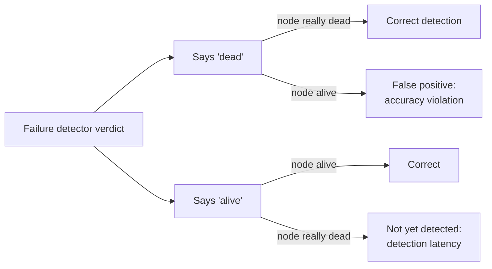
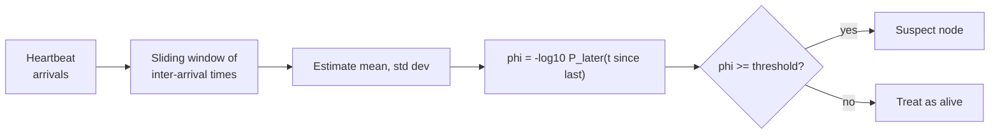
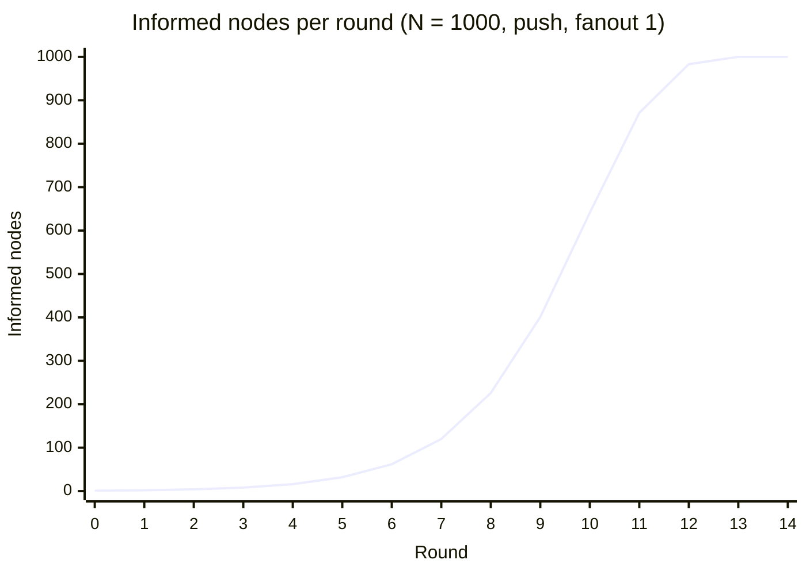
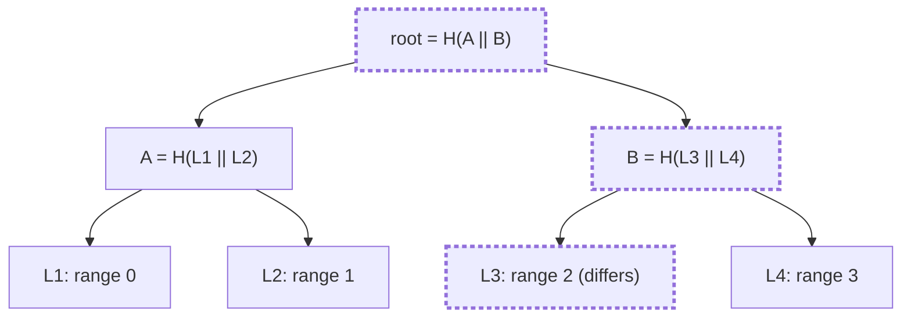
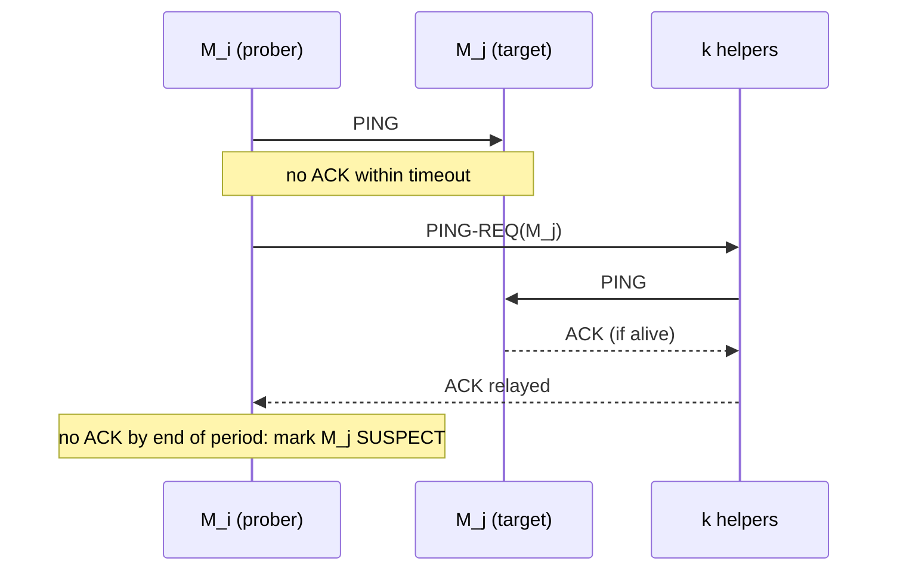
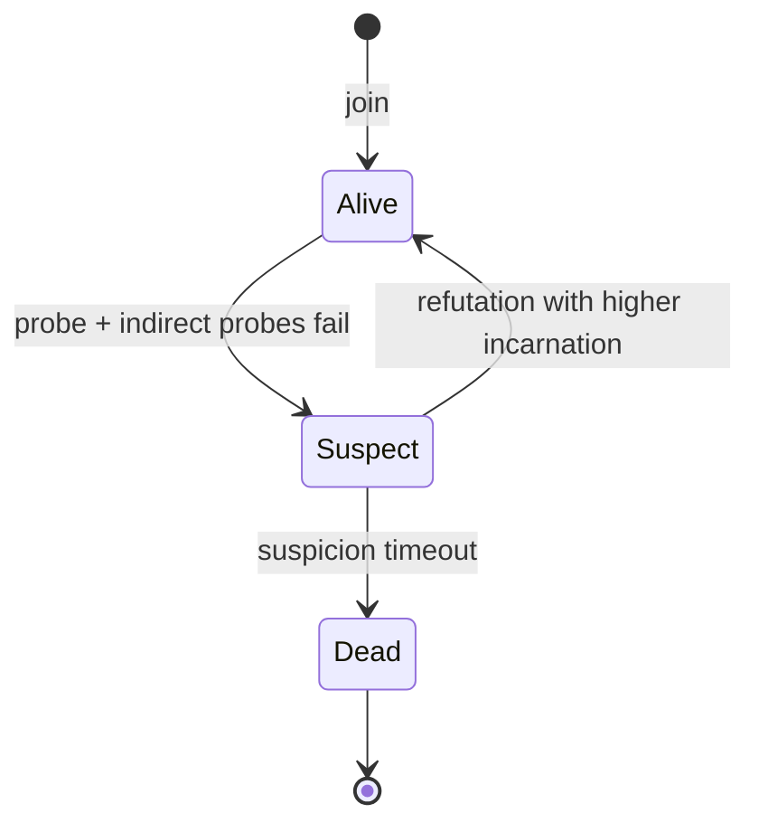
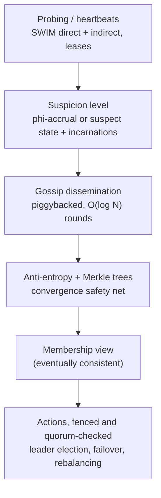

[Distributed Systems](./) &raquo; Failure Detection &amp; Gossip

A distributed system cannot tell a node that has *crashed* apart from one that is merely *slow* or *unreachable*. A **failure detector** turns that uncertainty into something the system can act on: a suspicion that a process has failed. A **membership protocol** spreads those suspicions so that the cluster keeps a roughly consistent view of who is alive. This page covers the detectors, from fixed-timeout heartbeats to the phi-accrual detector used by Cassandra and Akka. It then covers the gossip mechanisms that spread their verdicts (epidemic dissemination, Merkle-tree anti-entropy, and SWIM with HashiCorp's Lifeguard extensions), and closes with how production systems such as Kubernetes, Raft and Redis Cluster detect failures and act on them safely.

## Why Failure Detection Is Hard

In an asynchronous network there is no upper bound on message delay. A node that has been silent for 5 seconds might be:

| State | Typical causes | Will it come back? |
|-------|----------------|--------------------|
| **Crashed** | Process exit, kernel panic, power loss | No, or only after a restart with reset state |
| **Slow** | Stop-the-world GC pause, CPU throttling, disk stall, swap | Yes, possibly still believing it holds a lease or leadership |
| **Partitioned** | Broken network path between *you* and it | Yes, and it may have kept serving other clients all along |

From outside, these cases look the same. A **perfect** failure detector, one that never suspects a live process, therefore cannot be built in an asynchronous system. If it could, it would solve consensus, which the [FLP result](consensus-and-coordination.html#the-flp-impossibility-result) rules out. Practical systems add **timing assumptions**: they assume the network is *usually* well behaved and use timeouts as an imperfect oracle.

Two further failure modes make the problem harder in practice:

- **Gray failure** (Huang et al., HotOS 2017). A component is broken from its clients' point of view but looks healthy to the failure detector. For example, a node answers heartbeats while its disk-bound request path is stuck. The underlying cause is *differential observability*: the detector observes something different from what the clients use.
- **Fail-slow hardware** (Gunawi et al., FAST 2018). Disks, NICs, and SSDs that run at a fraction of their normal speed without ever failing outright. A single slow replica can drag down a whole quorum.

### Completeness and Accuracy

Chandra and Toueg (1996) describe a failure detector by two properties:

- **Completeness:** every process that crashes is eventually suspected by every correct process. The detector does not miss real failures.
- **Accuracy:** correct processes are not wrongly suspected. The detector does not raise false alarms.

The two pull against each other. Short timeouts catch crashes quickly but evict slow nodes that are still alive. Long timeouts avoid false alarms but leave real crashes unnoticed for longer. All the standard detector classes have strong completeness and differ in how accurate they are:

| Class | Accuracy guarantee |
|-------|--------------------|
| **P** (Perfect) | No correct process is ever suspected |
| **$\Diamond$P** (Eventually Perfect) | After some unknown time, no correct process is suspected |
| **S** (Strong) | Some correct process is never suspected |
| **$\Diamond$S** (Eventually Strong) | After some unknown time, some correct process is never suspected |

$\Diamond$S, and the equivalent leader oracle $\Omega$, is the weakest detector that makes consensus solvable when a majority of processes are correct. This is why Raft and Paxos only need timeouts to work *eventually*, not a perfect oracle.



### Measuring a Detector

Chen, Toueg and Aguilera (2002) proposed quality-of-service metrics that make the trade-off measurable:

| Metric | Meaning | Improves with |
|--------|---------|---------------|
| **Detection time** $T_D$ | Time from a crash until it is permanently suspected | Shorter timeouts, faster heartbeats |
| **Mistake recurrence time** $T_{MR}$ | Average time between false suspicions | Longer timeouts |
| **Mistake duration** $T_M$ | How long a false suspicion lasts before it is corrected | Faster heartbeats, refutation mechanisms |

Heartbeat frequency is the only setting that improves *both* sides of the trade-off, and it costs bandwidth and CPU.

## Heartbeats and Timeouts

The baseline mechanism is simple. Each process periodically signals that it is alive, and a monitor suspects it if the signal stops for longer than a timeout.

### Push and Pull

| Style | Mechanism | Examples |
|-------|-----------|----------|
| **Push (heartbeat)** | The monitored process sends `HEARTBEAT` every $\Delta_i$; the monitor suspects it after $\Delta_{to}$ of silence | Raft leader heartbeats, Kubernetes node leases, Cassandra gossip |
| **Pull (probe)** | The monitor sends `PING` and expects an `ACK` before a deadline | Load-balancer health checks, Kubernetes liveness probes, SWIM |

Push costs the monitor less when many processes are watched, and one message can serve many monitors. Pull lets the monitor set its own pace, and it tests the full request path, including the process's ability to answer.

### Choosing the Timeout

If the timer is measured from the last heartbeat *received*, the worst-case detection time after a crash is

$$
T_D \le \Delta_{to} + d_{\max}
$$

where $d_{\max}$ is the maximum one-way network delay. The worst case is a crash just after sending a heartbeat that then took $d_{\max}$ to arrive. A shorter heartbeat interval $\Delta_i$ does not lower this bound directly. It does let $\Delta_{to}$ be set to a smaller multiple of $\Delta_i$ without causing false positives.

Timeouts are usually derived from observed behaviour in the same way TCP computes its retransmission timeout (RFC 6298: $\mathrm{RTO} = \mathrm{SRTT} + 4 \cdot \mathrm{RTTVAR}$):

$$
\Delta_{to} = \mu + \alpha \, \sigma + \Delta_{\mathrm{pause}}
$$

Here $\mu$ and $\sigma$ are the mean and standard deviation of heartbeat inter-arrival times, $\alpha$ is a safety multiplier (typically 3 to 4), and $\Delta_{\mathrm{pause}}$ is an allowance for known pauses such as garbage collection. A fixed threshold still cannot adapt on its own: a LAN and a cross-region link need very different values, and conditions change during the day.

```python
import time

class HeartbeatDetector:
    """Fixed-timeout push heartbeat detector (monotonic clock)."""
    def __init__(self, timeout=10.0):
        self.timeout = timeout
        self.last_seen = {}                 # node_id -> monotonic time of last heartbeat

    def heartbeat(self, node_id):
        self.last_seen[node_id] = time.monotonic()

    def is_suspected(self, node_id):
        last = self.last_seen.get(node_id)
        if last is None:
            return True                     # never heard from it
        return time.monotonic() - last > self.timeout
```

Always measure timeouts with a **monotonic** clock. If the timer uses wall-clock time, an NTP step adjustment can suspect every node at once, or none.

## The Phi-Accrual Failure Detector

Hayashibara, Défago, Yared and Katayama (2004) separated *detecting* a failure from *acting* on it. The detector does not return alive or dead. It returns a continuous suspicion level $\varphi$ that grows the longer a heartbeat is overdue. Each consumer applies its own threshold $\varphi_{\mathrm{th}}$, so one stream of heartbeats can serve a latency-sensitive component (low threshold, fast but jumpy) and a conservative one (high threshold) at the same time.

### Definition

The detector keeps a sliding window of recent heartbeat **inter-arrival times** and fits a distribution to them. When queried, it computes how surprising the current silence is. Let $t_{\Delta} = t_{\mathrm{now}} - t_{\mathrm{last}}$ be the time since the last heartbeat, and let $P_{\mathrm{later}}(t)$ be the probability, under the fitted distribution, that the next heartbeat arrives more than $t$ after the previous one:

$$
\varphi(t_{\mathrm{now}}) = -\log_{10} P_{\mathrm{later}}(t_{\Delta})
$$

Each unit of $\varphi$ is one order of magnitude. At $\varphi = 1$, a live node would stay silent this long about 10% of the time. At $\varphi = 2$ that falls to about 1%, and at $\varphi = 3$ to about 0.1%. A threshold of $\varphi_{\mathrm{th}} = 8$ corresponds to a false-positive probability of about $10^{-8}$ *per decision, if the fitted model is correct*. Real inter-arrival times have heavier tails than a normal distribution, so treat $\varphi$ as a well-calibrated scale rather than a literal probability.

### Choice of Distribution

The original paper models inter-arrival times as **normally distributed**, with mean $\mu$ and standard deviation $\sigma$ taken from the window. The tail probability is then

$$
P_{\mathrm{later}}(t) = 1 - \Phi\!\left(\frac{t - \mu}{\sigma}\right)
$$

where $\Phi$ is the standard normal CDF. Cassandra uses an **exponential** model instead, $P_{\mathrm{later}}(t) = e^{-t/\mu}$, which gives a simple linear formula:

$$
\varphi(t_{\Delta}) = \frac{t_{\Delta}}{\mu \ln 10} \approx 0.434 \, \frac{t_{\Delta}}{\mu}
$$

The exponential model ignores jitter, but it is much more forgiving. With one-second gossip, Cassandra's default `phi_convict_threshold` of 8 convicts after about $8 \times 2.303 \approx 18$ seconds of silence. Akka and Apache Pekko use the normal model, approximate $\Phi$ with a logistic function, and add an `acceptable-heartbeat-pause` to $\mu$ to absorb GC pauses.



### Worked Example

Heartbeats have arrived every $\mu = 1.0$ s with $\sigma = 0.1$ s, and the last one arrived at $t = 0$. Under the normal model:

| $t_{\Delta}$ | $z = (t_{\Delta} - \mu)/\sigma$ | $P_{\mathrm{later}}$ | $\varphi$ | Interpretation |
|:---:|:---:|:---:|:---:|---|
| 1.0 s | 0 | 0.5 | 0.30 | Normal; no suspicion |
| 1.3 s | 3 | $1.35 \times 10^{-3}$ | 2.87 | A threshold of 3 is about to fire |
| 1.5 s | 5 | $2.9 \times 10^{-7}$ | 6.54 | Strong evidence |
| 1.56 s | 5.6 | $1.1 \times 10^{-8}$ | 7.97 | A threshold of 8 fires here |

The same silence under Cassandra's exponential model gives $\varphi \approx 0.65$ at 1.5 s. The choice of distribution matters as much as the threshold. A very small $\sigma$ also makes the normal model too eager, which is why implementations set a minimum standard deviation.

```python
import math
from collections import deque

class PhiAccrualDetector:
    """Phi-accrual failure detector, normal-distribution variant."""
    def __init__(self, window_size=1000, min_std=0.1,
                 acceptable_pause=0.0, first_interval=1.0):
        # Seed with a plausible interval so a cold start doesn't over-suspect.
        self.intervals = deque([first_interval, first_interval], maxlen=window_size)
        self.min_std = min_std
        self.acceptable_pause = acceptable_pause
        self.last_ts = None

    def heartbeat(self, now):
        if self.last_ts is not None:
            self.intervals.append(now - self.last_ts)
        self.last_ts = now

    def phi(self, now):
        if self.last_ts is None:
            return 0.0
        n = len(self.intervals)
        mean = sum(self.intervals) / n
        std = max(math.sqrt(sum((x - mean) ** 2 for x in self.intervals) / n),
                  self.min_std)
        z = (now - self.last_ts - (mean + self.acceptable_pause)) / std
        p_later = 0.5 * math.erfc(z / math.sqrt(2.0))   # upper normal tail, stable for large z
        return -math.log10(max(p_later, 1e-300))

    def is_suspected(self, now, threshold=8.0):
        return self.phi(now) >= threshold
```

Adaptivity is the main advantage over a fixed timeout. When a WAN link gets slower and more jittery, $\sigma$ grows and the implied timeout grows with it, which avoids the burst of false positives a fixed threshold would produce. The drawback is that adaptation works both ways: a node that is getting steadily slower teaches the detector to tolerate it, which is how gray failures slip through.

## Gossip Protocols

Failure detection answers "is node X alive?" **Membership** answers "who is in the cluster, and in what state?" With hundreds or thousands of nodes, all-to-all heartbeating costs $O(N^2)$ messages per interval. **Gossip** (epidemic) protocols spread information the way a rumour spreads: in each round, every node exchanges state with a few randomly chosen peers. No single node coordinates, yet the whole cluster converges.

### Epidemic Spreading

The analysis borrows from epidemiology. A node is *susceptible* if it has not yet heard an update and *infected* if it has heard it and is spreading it. If each infected node contacts $b$ random peers per round, the expected number of informed nodes follows logistic growth:

$$
i_{r+1} \approx i_{r} + b \, i_{r} \, \frac{N - i_{r}}{N}
$$

Growth is slow at first, very fast in the middle, and slows again as almost everyone has heard. With one push per node per round, the number of rounds needed to inform everyone is $\log_2 N + \ln N + O(1)$ with high probability (Pittel, 1987). For $N = 10{,}000$ that is about 23 rounds. **Push-pull** gossip finishes in $\log_3 N + O(\log \log N)$ rounds (Karp, Schindelhauer, Shenker and Vöcking, 2000). Either way, latency grows **logarithmically** while each node's load stays **constant**. This is why gossip is used for membership in large clusters.



The curve is the deterministic approximation above with $b = 1$, which saturates after about 13 rounds. Real runs are randomized: reaching the last few stragglers takes the extra $\ln N$ term, so about 17 rounds for $N = 1000$.

### Gossip Styles

| Style | Mechanism | Trade-off |
|-------|-----------|-----------|
| **Push** | An informed node sends the update to a random peer | Fast early; wasteful late, because most targets already know |
| **Pull** | A node asks a random peer for anything new | Slow early; fast late, because it reaches stragglers |
| **Push-pull** | Both directions in one exchange | Best overall, and the usual choice in production |

### Rumour Mongering and Anti-Entropy

Demers et al. (1987) described two complementary modes:

- **Rumour mongering** spreads a *delta*, such as "node 7 joined" or "node 3 is suspected." Each node forwards a new rumour for a limited number of rounds and then drops it. Bandwidth is low, but a rumour dropped too early can miss a few nodes.
- **Anti-entropy** periodically compares *full state* (or a digest of it) with a random peer and repairs the differences. It is slower and heavier, but it guarantees eventual convergence even when rumours are lost. It is the safety net under rumour mongering.

```python
import random

class GossipNode:
    """Push-pull anti-entropy over a versioned key-value map (LWW by version)."""
    def __init__(self, node_id):
        self.node_id = node_id
        self.peers = []                           # other GossipNode objects
        self.state = {}                           # key -> (value, version)

    def update(self, key, value):
        _, ver = self.state.get(key, (None, 0))
        self.state[key] = (value, ver + 1)

    def digest(self):
        return {k: ver for k, (_, ver) in self.state.items()}   # cheap summary

    def newer_than(self, digest):
        return {k: (v, ver) for k, (v, ver) in self.state.items()
                if ver > digest.get(k, 0)}

    def merge(self, entries):
        for k, (v, ver) in entries.items():
            if ver > self.state.get(k, (None, 0))[1]:
                self.state[k] = (v, ver)

    def gossip_round(self):
        if not self.peers:
            return
        peer = random.choice(self.peers)
        # 1. send my digest; peer returns what I'm missing (pull)
        self.merge(peer.newer_than(self.digest()))
        # 2. send what the peer is missing (push)
        peer.merge(self.newer_than(peer.digest()))
```

## Anti-Entropy and Merkle Trees

Exchanging full state works for a small membership table, but not for replicas holding millions of keys, as in Dynamo-style stores such as Cassandra and Riak. Two replicas are usually *almost* identical, and the task is to find the few keys that differ without transferring everything. **Merkle trees** (hash trees) find the differences in a number of comparisons proportional to the number of differences multiplied by the tree depth.

### Structure

- **Leaves** hash one fixed partition of the key space, such as a token range or hash bucket.
- **Internal nodes** hash the concatenation of their children's hashes.
- The **root** is a single fingerprint for the whole dataset.

$$
h_{\mathrm{parent}} = H\bigl(h_{\mathrm{left}} \,\|\, h_{\mathrm{right}}\bigr)
$$

Here $H$ is a collision-resistant hash function and $\|$ denotes concatenation. Leaves must cover **fixed key ranges** agreed by both replicas. If leaves were simply "the i-th key in sorted order," one inserted key would shift every later leaf and make the whole tree look different.



The dashed nodes are the only ones that differ between the two replicas. The comparison descends only along that path, and only range 2 is streamed.

### Reconciliation Walk

1. Exchange **root** hashes. If they match, the replicas are identical and nothing needs to be transferred.
2. If they differ, compare the children and descend only into subtrees whose hashes differ.
3. At the differing **leaves**, transfer the keys in those ranges.

Locating $d$ differing leaves in a tree of depth $\log L$ costs $O(d \log L)$ hash comparisons, far less than streaming every key. Cassandra's `nodetool repair` works this way: each replica builds a Merkle tree over a token range in a validation compaction, the trees are compared, and only mismatched ranges are streamed. Leaf granularity is a trade-off. Coarse leaves mean small trees but *overstreaming*, because a single differing key forces its whole range to be resent.

```python
import hashlib

def H(b: bytes) -> bytes:
    return hashlib.sha256(b).digest()

class MerkleTree:
    """Merkle tree over 2**depth fixed hash buckets of the key space."""
    def __init__(self, kv: dict, depth: int = 10):
        self.depth = depth
        n = 1 << depth
        buckets = [[] for _ in range(n)]
        for k, v in kv.items():
            buckets[int.from_bytes(H(k.encode())[:8], "big") % n].append((k, v))
        leaves = [H(b"".join(H(f"{k}={v}".encode()) for k, v in sorted(b)))
                  for b in buckets]
        self.levels = [leaves]
        while len(self.levels[-1]) > 1:
            prev = self.levels[-1]
            self.levels.append([H(prev[i] + prev[i + 1]) for i in range(0, len(prev), 2)])

    @property
    def root(self) -> bytes:
        return self.levels[-1][0]

def differing_buckets(a: MerkleTree, b: MerkleTree) -> list[int]:
    """Bucket indices whose contents differ; prunes every matching subtree."""
    assert a.depth == b.depth
    out = []
    def walk(level, idx):
        if a.levels[level][idx] == b.levels[level][idx]:
            return                                  # whole subtree identical
        if level == 0:
            out.append(idx)
            return
        walk(level - 1, 2 * idx)
        walk(level - 1, 2 * idx + 1)
    walk(a.depth, 0)
    return out
```

## SWIM

**SWIM** (Scalable Weakly-consistent Infection-style process group Membership; Das, Gupta and Motivala, 2002) combines failure detection and gossip in one protocol. HashiCorp's `memberlist` library implements it, and that library underlies Serf, Consul, Nomad, and the memberlist key-value store used by Grafana Loki, Mimir and Tempo. All-to-all heartbeating costs $O(N^2)$ messages in total. SWIM keeps the **per-node** load **constant** (so the total is $O(N)$), and its expected detection time does not depend on cluster size.

SWIM separates two components:

1. **Failure detection** by randomized direct and indirect probing.
2. **Dissemination** of membership changes, *piggybacked* on the probe messages, so it adds no extra traffic.

### The Probe Protocol

In every protocol period $T$, each member $M_i$ runs one round:

1. $M_i$ picks a member $M_j$ and sends it `PING`.
2. If $M_j$ answers with `ACK` before the timeout, it is alive and the round ends.
3. Otherwise $M_i$ asks $k$ other members to probe $M_j$ on its behalf with `PING-REQ`. Each of them pings $M_j$ and relays any `ACK` back.
4. If no `ACK` arrives by the end of the period, $M_i$ marks $M_j$ **suspect**.

Indirect probing separates "$M_j$ is dead" from "the path between $M_i$ and $M_j$ is congested." If any of the $k$ helpers reaches $M_j$, the false positive is avoided.



### Suspicion and Incarnation Numbers

Declaring a node dead after one failed round causes false positives whenever a node has a brief hiccup. The full protocol (called SWIM+Inf.+Susp. in the paper, and the form always used in practice) adds a **suspicion** stage:

- A failed probe marks the target **suspect**, and the suspicion is gossiped.
- A live node that hears it is suspected increments its **incarnation number** and gossips `alive` with the new number. This refutes the suspicion across the cluster.
- If no refutation arrives before the suspicion timeout, the node is declared **dead**, and that is gossiped too.

Only a node can increment its own incarnation number. Conflicting rumours are resolved by fixed precedence rules:

| Incoming message about node X | Overrides the local view if |
|-------------------------------|-----------------------------|
| `alive(X, i)` | local is `alive(X, j)` or `suspect(X, j)` with $i > j$ |
| `suspect(X, i)` | local is `suspect(X, j)` with $i > j$, or `alive(X, j)` with $i \ge j$ |
| `dead(X, i)` | always, since dead is final; X must rejoin with a new identity or incarnation |



```python
RANK = {"alive": 0, "suspect": 1, "dead": 2}

def should_apply(local, incoming):
    """SWIM precedence: local/incoming are (state, incarnation) or None."""
    if local is None:
        return True
    (ls, li), (s, i) = local, incoming
    if ls == "dead":
        return False                      # dead is final
    if s == "dead":
        return True
    if s == "alive":
        return i > li                     # only a newer incarnation clears suspicion
    # s == "suspect"
    return i > li or (i == li and ls == "alive")
```

### Dissemination and Target Selection

- **Piggybacking.** Membership updates (`join`, `suspect`, `alive`, `dead`) travel inside `PING`, `ACK` and `PING-REQ` messages. Each update is retransmitted about $\lambda \log N$ times, the epidemic bound from above, with the newest updates sent first.
- **Round-robin targets.** Picking a uniformly random target each period gives an expected first detection after $e/(e-1) \approx 1.58$ periods, but no worst-case bound. SWIM instead walks a randomly shuffled member list, which guarantees that every failed member is probed within $2N - 1$ periods.
- **Constant load.** Each period a node sends one `PING` and at most $k$ `PING-REQ`s, regardless of $N$.

### Lifeguard

SWIM assumes that the node doing the probing is healthy. In practice a prober that is itself overloaded, for example CPU-starved or with a backed-up network queue, misses `ACK`s and falsely accuses healthy peers. **Lifeguard** (Dadgar, Phillips and Currey, HashiCorp, 2018) adds *local health awareness* and is enabled in `memberlist` by default:

| Extension | Mechanism |
|-----------|-----------|
| **Local Health Multiplier (LHM)** | A saturating counter that rises when the node's own probes fail, when it gets no NACK from helpers, or when it has to refute suspicion of itself. It scales the node's probe interval and timeout, so an unhealthy node slows down instead of accusing others. |
| **Local Health Aware Suspicion** | The suspicion timeout starts long and shrinks logarithmically as *independent* members confirm the suspicion. A single possibly-sick accuser cannot convict quickly. |
| **Buddy System** | A prober tells a suspected target directly in its `PING` that it is suspected, so the target can refute immediately rather than waiting for gossip to reach it. |

The paper reports false positives reduced by more than 50x in controlled tests, with little change in detection time for real failures.

## Failure Detection in Production

| System | Mechanism | Defaults and notes |
|--------|-----------|--------------------|
| **Raft (etcd, Consul, KRaft)** | Leader heartbeats; a follower whose randomized election timeout expires starts an election | etcd: 100 ms heartbeat, 1000 ms election timeout. PreVote and CheckQuorum limit disruption from nodes on the wrong side of a partition. See [Raft](consensus-and-coordination.html#raft). |
| **Kubernetes nodes** | The kubelet renews a `Lease` object in `kube-node-lease` (every 10 s); the node lifecycle controller marks the node `NotReady` after `node-monitor-grace-period` | The grace period default rose from 40 s to 50 s in v1.32. Pods are then evicted through taint-based eviction (`not-ready`/`unreachable` taints, 300 s default toleration). |
| **Kubernetes pods** | Pull probes: liveness (restart), readiness (remove from endpoints), startup (delay the other two) | A liveness probe that checks dependencies can cause cascading restarts. Keep it local. See [Health Checks](resilience-patterns.html#health-checks). |
| **Cassandra** | Gossip every second with heartbeat versions, plus exponential phi-accrual | `phi_convict_threshold` defaults to 8. In Cassandra 6.0 (pre-GA in 2026), topology and schema move from gossip to Transactional Cluster Metadata, a linearized log, while gossip remains for liveness. |
| **Akka / Apache Pekko Cluster** | Normal-model phi-accrual with heartbeats sent to a subset of neighbours; gossip for membership | Threshold 8, plus `acceptable-heartbeat-pause` for GC. |
| **Consul, Nomad, Serf** | SWIM + Lifeguard via `memberlist` | Separate LAN and WAN gossip pools with different timing profiles. |
| **Redis Cluster** | Each node pings peers over the cluster bus; a peer silent past `cluster-node-timeout` is flagged `PFAIL` locally | `PFAIL` becomes `FAIL` once a majority of primaries report it. A replica of the failed primary is then promoted. |

### Acting on a Suspicion Safely

A suspicion can always be wrong. Whatever the system does next, such as promoting a replica, reassigning a lock, or rescheduling a pod, has to be safe even if the "dead" node is still running:

- **Leases** mean a node's authority expires on its own. A node that cannot renew its lease stops acting before anyone else takes over, provided clock drift is bounded.
- **Fencing tokens** are monotonically increasing epochs, such as a Raft term or a lock version, checked by the *resource*. The resource rejects writes from a deposed holder even if that holder has just woken from a long GC pause. See [Distributed Locks](resilience-patterns.html#distributed-locks).
- **STONITH** ("shoot the other node in the head") powers off or isolates a suspected node through an out-of-band channel before failing over, as in Pacemaker clusters.
- **Quorum-based decisions** mean no single observer's opinion is enough. Redis's `PFAIL`-to-`FAIL` promotion, Lifeguard's independent confirmations, and Raft's majority votes all apply this principle.

## Putting It Together



- **Probing** with indirect checks keeps accuracy acceptable on lossy networks.
- **Accrual or suspicion** turns noisy timing into a graded, refutable signal rather than a brittle yes/no.
- **Gossip** spreads the resulting membership changes in $O(\log N)$ rounds at constant cost per node.
- **Anti-entropy** ensures replicas converge even when rumours are lost, transferring only the differences.
- **Fencing and quorums** keep the actions that follow safe when the detector is wrong.

The membership view this produces is an input to consensus, not a replacement for it. Protocols like [Raft and Paxos](consensus-and-coordination.html) use timeouts only for liveness, and their safety never depends on a failure detector being right.

## See Also

- **[Distributed Systems Hub](./)**: section index
- **[Consensus & Coordination](consensus-and-coordination.html)**: FLP, quorums, and how Raft uses timeouts for leader election
- **[Resilience Patterns](resilience-patterns.html)**: health checks, circuit breakers, distributed locks and fencing
- **[Service Discovery](service-discovery.html)**: turning a membership view into routable endpoints
- **[Distributed Systems Theory](../advanced/distributed-systems-theory/#failure-detectors)**: formal failure-detector classes and reductions
- **[Kubernetes](../technology/kubernetes/)**: node leases and liveness, readiness and startup probes
- **[Networking](../technology/networking/)**: RTT, jitter, and the timing assumptions detectors depend on

### Foundational Papers

- Demers et al., *Epidemic Algorithms for Replicated Database Maintenance* (1987)
- Pittel, *On Spreading a Rumor* (1987)
- Chandra, Toueg, *Unreliable Failure Detectors for Reliable Distributed Systems* (1996)
- Karp, Schindelhauer, Shenker, Vöcking, *Randomized Rumor Spreading* (2000)
- Chen, Toueg, Aguilera, *On the Quality of Service of Failure Detectors* (2002)
- Das, Gupta, Motivala, *SWIM: Scalable Weakly-consistent Infection-style Process Group Membership Protocol* (2002)
- Hayashibara, Défago, Yared, Katayama, *The φ Accrual Failure Detector* (2004)
- Huang et al., *Gray Failure: The Achilles' Heel of Cloud-Scale Systems* (HotOS 2017)
- Gunawi et al., *Fail-Slow at Scale: Evidence of Hardware Performance Faults in Large Production Systems* (FAST 2018)
- Dadgar, Phillips, Currey, *Lifeguard: Local Health Awareness for More Accurate Failure Detection* (2018)
