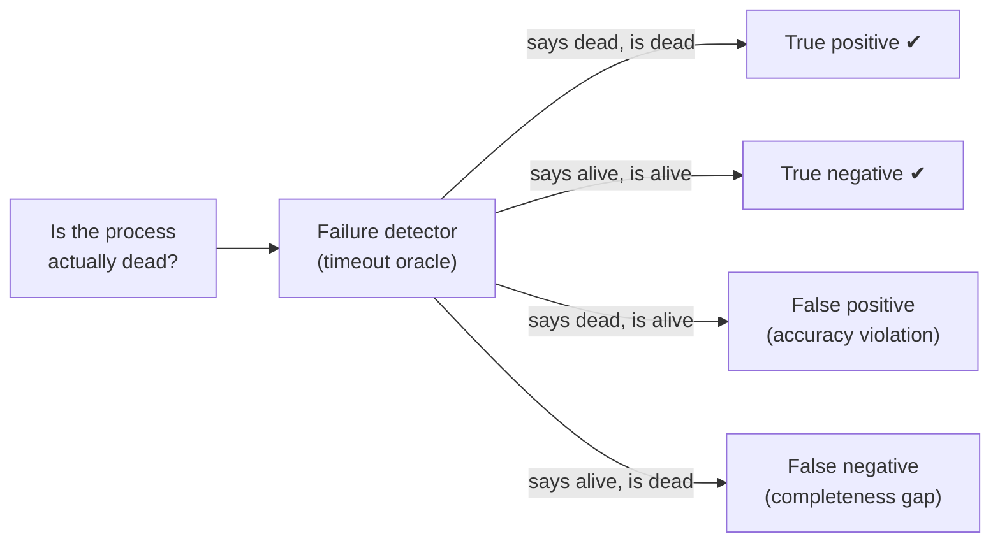
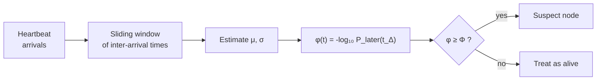
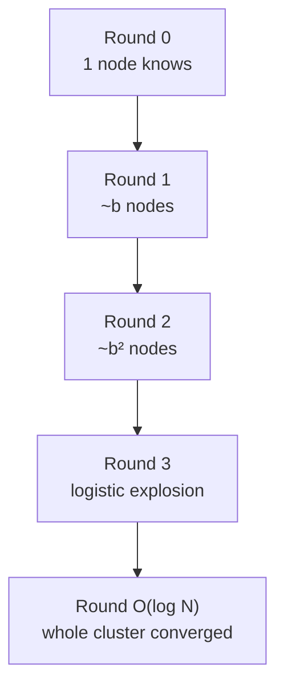
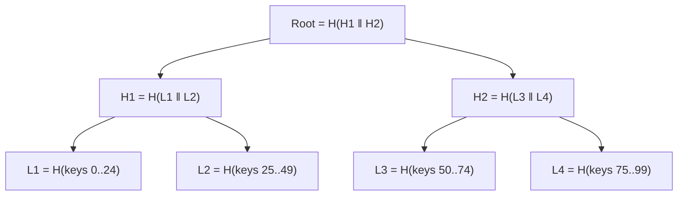
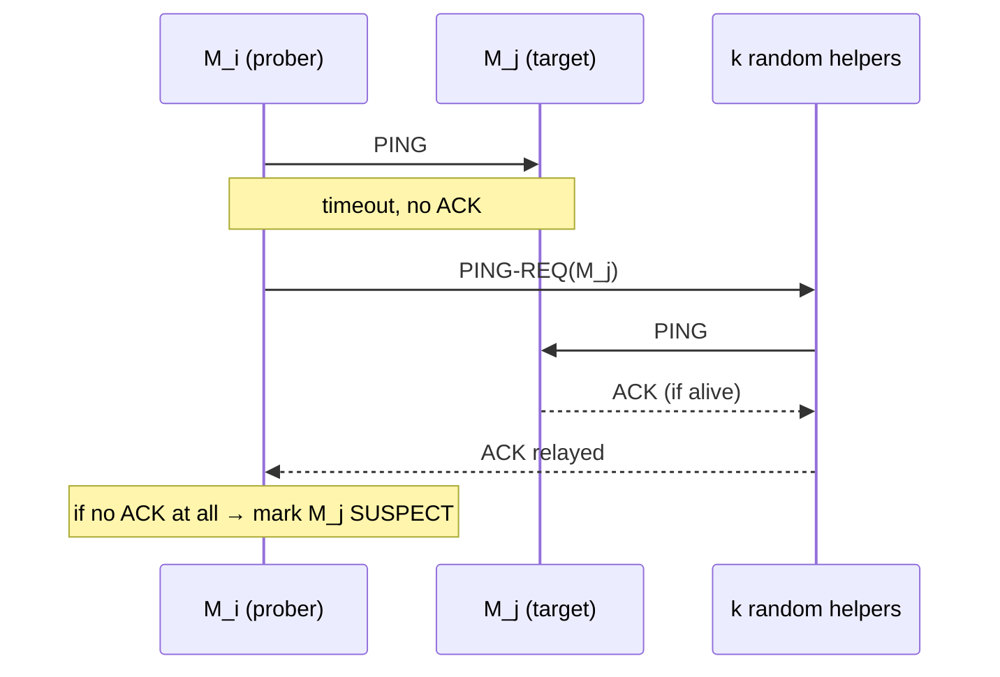
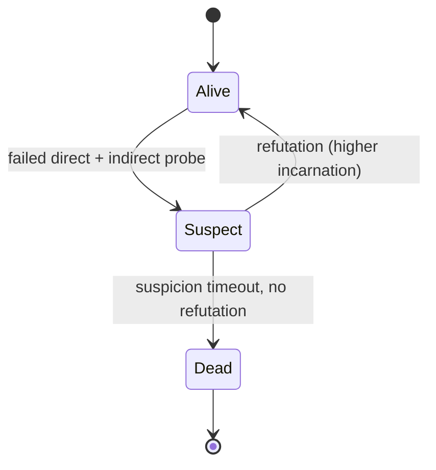
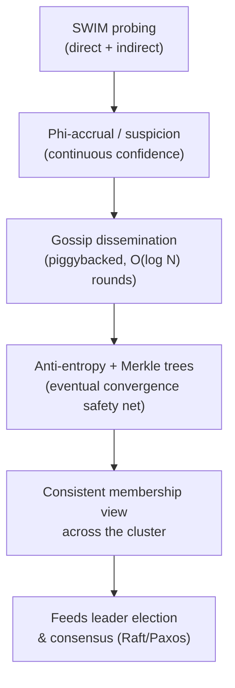

[Distributed Systems](./) &raquo; Failure Detection &amp; Gossip

A distributed system cannot tell the difference between a node that has *crashed* and one that is merely *slow* or *unreachable*. Failure detection is the discipline of converting that fundamental uncertainty into an actionable signal — a suspicion that a process is dead — and propagating that signal across the cluster cheaply and robustly. This page covers the spectrum from simple heartbeats to the phi-accrual detector used by Cassandra and Akka, and then the gossip family (epidemic dissemination, anti-entropy, Merkle trees, and SWIM) that membership systems use to keep that view consistent at scale.

## Why Failure Detection Is Hard

In an asynchronous network there is no upper bound on message delay. A node that has sent no heartbeat for 5 seconds might be:

- **Crashed** — it will never respond again.
- **Slow** — garbage-collection pause, CPU starvation, or disk stall.
- **Partitioned** — alive and well, but the network path to *you* is broken.

These cases are observationally indistinguishable from the outside. The [FLP impossibility result](../advanced/distributed-systems-theory/) makes this precise: with even one faulty process and no timing assumptions, no deterministic algorithm can *guarantee* it will ever decide that a process has failed without risking a false positive. Practical systems escape FLP by adding **timing assumptions** — they assume the network is "mostly synchronous" and use timeouts as an oracle. A failure detector is exactly that oracle, and its quality is judged on two axes.

### Completeness and Accuracy

Chandra and Toueg's classic framework characterizes a failure detector by two properties:

- **Completeness** — every process that actually crashes is *eventually* suspected by every correct process. (Don't miss real deaths.)
- **Accuracy** — correct processes are *not* wrongly suspected. (Don't raise false alarms.)

These are in tension. Aggressive timeouts give strong completeness (you notice deaths fast) but weak accuracy (you wrongly evict slow-but-alive nodes). Conservative timeouts do the reverse. The famous classes of detector are:

| Class | Completeness | Accuracy |
|-------|--------------|----------|
| **P** (Perfect) | Strong | Strong |
| **♦P** (Eventually Perfect) | Strong | Eventually strong |
| **S** (Strong) | Strong | Weak |
| **♦S** (Eventually Strong) | Strong | Eventually weak |

`♦S` is the weakest detector that still lets you solve consensus (with a majority of correct processes) — which is why Raft and Paxos implementations only need "eventually, timeouts mostly work," not a perfect oracle.



## Heartbeats and Timeouts

The baseline mechanism: each process periodically sends an "I'm alive" heartbeat to its monitors. The monitor maintains a timer; if no heartbeat arrives within a timeout window, the process is suspected.

### Push vs. Pull

- **Push (heartbeat):** the monitored process sends `HEARTBEAT` every interval `Δi`. The monitor suspects after `Δto` of silence.
- **Pull (ping):** the monitor sends `ARE-YOU-ALIVE` and expects an `ACK` within a round-trip deadline. This is what most health checks (Kubernetes liveness probes, load-balancer health checks) actually do.

Push scales better with many monitors (one broadcast vs. N pings) and survives a monitor that is itself slow; pull lets the monitor control the cadence and detect asymmetric reachability.

### Choosing the Timeout

A fixed timeout `Δto` is the crux of the accuracy/completeness trade-off. Too short and a GC pause triggers a false eviction; too long and a real crash goes unnoticed, stalling progress. The detection time after a real crash is bounded by:

$$
T_{D} \le \Delta_{i} + \Delta_{to}
$$

where the heartbeat arrives just before the crash in the worst case. A safe-but-slow rule of thumb sets the timeout from the observed network behavior:

$$
\Delta_{to} = \mathrm{RTT}_{\max} + \alpha \cdot \sigma_{\mathrm{RTT}}
$$

with `α` a safety multiplier (typically 3–4) over the standard deviation of round-trip times. The trouble is that a single fixed threshold cannot adapt: a datacenter LAN and a cross-region WAN link need wildly different `Δto`, and conditions drift over the day.

```python
import time

class HeartbeatDetector:
    """Fixed-timeout push heartbeat detector."""
    def __init__(self, timeout=10.0):
        self.timeout = timeout
        self.last_seen = {}        # node_id -> timestamp of last heartbeat

    def heartbeat(self, node_id, now=None):
        self.last_seen[node_id] = now if now is not None else time.time()

    def is_suspected(self, node_id, now=None):
        now = now if now is not None else time.time()
        last = self.last_seen.get(node_id)
        if last is None:
            return True             # never heard from it
        return (now - last) > self.timeout
```

The fixed-timeout detector is binary (alive/dead) and brittle. The phi-accrual detector replaces the binary verdict with a continuous *suspicion level*.

## The Phi-Accrual Failure Detector

Hayashibara et al. (2004) proposed decoupling *failure detection* from *action*. Instead of returning a boolean, the detector outputs a continuous value **φ** (phi) that grows the longer a heartbeat is overdue. Each application chooses its own threshold `Φ` on that value, so the same detector can serve a latency-sensitive lock service (low threshold, fast but jumpy) and a conservative replication manager (high threshold) simultaneously.

### The Core Idea

The detector keeps a sliding window of recent **inter-arrival times** between heartbeats and fits a distribution to them. When asked at time `t_now`, it computes how surprising it is that no heartbeat has arrived since the last one at `t_last`. Define the elapsed time:

$$
t_{\Delta} = t_{\mathrm{now}} - t_{\mathrm{last}}
$$

Let `P_later(t)` be the probability, under the fitted distribution, that a heartbeat arrives *more than* `t` after the previous one. Then:

$$
\varphi(t_{\mathrm{now}}) = -\log_{10}\bigl(P_{\mathrm{later}}(t_{\Delta})\bigr)
$$

The value of φ has a clean operational meaning: **φ = 1 means roughly a 10% chance of a false positive if you decide "dead" right now, φ = 2 means ~1%, φ = 3 means ~0.1%**, and so on — each unit is one order of magnitude of confidence. An application that suspects at `Φ = 8` accepts a false-positive rate around `10^-8` per decision.

### Fitting the Distribution

The original paper assumes inter-arrival times are **normally distributed** with mean `μ` and standard deviation `σ` estimated from the sliding window of the last `n` samples. Under that assumption, `P_later(t)` is the upper tail of the normal CDF:

$$
P_{\mathrm{later}}(t) = 1 - F(t) = 1 - \Phi\!\left(\frac{t - \mu}{\sigma}\right)
$$

where `Φ` here is the standard-normal CDF. Combining:

$$
\varphi(t_{\Delta}) = -\log_{10}\!\left(1 - \Phi\!\left(\frac{t_{\Delta} - \mu}{\sigma}\right)\right)
$$

As `t_Δ` grows beyond the mean inter-arrival time, the tail probability shrinks toward zero and φ climbs without bound — so a node that has gone truly silent accrues an ever-higher suspicion, while a node whose heartbeats are merely jittery (large σ) is forgiven for longer. Cassandra uses a related exponential-distribution variant; the structure is identical, only `P_later` changes.



### Worked Example

Suppose the last 1000 heartbeats arrived every 1.0 s on average, with σ = 0.1 s. The last heartbeat was received `t_last = 0`. We poll at several `t_Δ`:

- `t_Δ = 1.0 s`: `z = (1.0 − 1.0)/0.1 = 0`, tail = 0.5, **φ = −log₁₀(0.5) ≈ 0.30** — completely normal, no suspicion.
- `t_Δ = 1.3 s`: `z = 3`, tail ≈ 0.00135, **φ ≈ 2.87** — ~0.1% false-positive risk; a jumpy detector might already act.
- `t_Δ = 1.5 s`: `z = 5`, tail ≈ 2.9×10⁻⁷, **φ ≈ 6.5** — strong evidence of death.

A service using `Φ = 8` would wait a little longer; one using `Φ = 3` acts at ~1.3 s. The same stream of heartbeats serves both, which is the whole point.

```python
import math

class PhiAccrualDetector:
    """
    Phi-accrual failure detector (normal-distribution variant).
    Maintains a sliding window of heartbeat inter-arrival times and
    reports a continuous suspicion level phi for the monitored node.
    """
    def __init__(self, window_size=1000, min_std=0.1, initial_interval=1.0):
        self.window_size = window_size
        self.min_std = min_std            # floor on sigma; avoids div-by-zero
        self.intervals = []               # recent inter-arrival times
        self.last_ts = None
        # Seed the window so cold-start does not over-suspect.
        self.intervals = [initial_interval] * 10

    def heartbeat(self, now):
        if self.last_ts is not None:
            delta = now - self.last_ts
            self.intervals.append(delta)
            if len(self.intervals) > self.window_size:
                self.intervals.pop(0)
        self.last_ts = now

    def _mean_std(self):
        n = len(self.intervals)
        mean = sum(self.intervals) / n
        var = sum((x - mean) ** 2 for x in self.intervals) / n
        std = max(math.sqrt(var), self.min_std)
        return mean, std

    @staticmethod
    def _normal_cdf(x, mean, std):
        # CDF of N(mean, std^2) via the error function.
        return 0.5 * (1.0 + math.erf((x - mean) / (std * math.sqrt(2.0))))

    def phi(self, now):
        if self.last_ts is None:
            return 0.0
        t_delta = now - self.last_ts
        mean, std = self._mean_std()
        p_later = 1.0 - self._normal_cdf(t_delta, mean, std)
        # Clamp the tail so log stays finite for very overdue heartbeats.
        p_later = max(p_later, 1e-300)
        return -math.log10(p_later)

    def is_suspected(self, now, threshold=8.0):
        return self.phi(now) >= threshold
```

### Where It Is Used

- **Apache Cassandra** — the `FailureDetector` uses a phi-accrual variant; the `phi_convict_threshold` (default 8) is operator-tunable.
- **Akka Cluster** — `akka.cluster.failure-detector` is phi-accrual with a configurable threshold and `acceptable-heartbeat-pause` to absorb GC.
- **Riak, ScyllaDB** — similar adaptive detectors.

The benefit over fixed timeouts is adaptivity: a transient WAN slowdown widens σ, which *raises* the timeout the detector implicitly applies, suppressing the false-positive storm that a fixed threshold would produce.

## Gossip / Epidemic Protocols

Failure detection answers "is node X alive?"; **membership** answers "who is in the cluster, and what is their state?" At scale (hundreds to thousands of nodes), having every node heartbeat every other node is `O(N²)` traffic and a single point of overload. **Gossip protocols** (a.k.a. epidemic protocols) disseminate information the way a rumor — or a virus — spreads through a population: each round, every node picks a few random peers and exchanges state. No node has the full picture, yet the whole cluster converges.

### Why "Epidemic"

The math is literally that of disease spread. Model each node as *susceptible* (hasn't heard the update) or *infected* (has it and is spreading it). If each infected node contacts `b` random peers per round, the number of informed nodes grows roughly:

$$
i_{r+1} = i_{r} + b \cdot i_{r} \cdot \frac{N - i_{r}}{N}
$$

This is logistic growth: slow start, explosive middle, saturating tail. The headline result is that an update reaches all `N` nodes in:

$$
R = O(\log N)
$$

rounds with high probability. For a 10,000-node cluster, an update saturates in roughly `log₂(10000) ≈ 14` rounds — and each node sends only `b` messages per round regardless of cluster size, so per-node load is constant. That `O(log N)` latency with `O(1)` per-node bandwidth is why gossip is the backbone of large-scale membership.



### Gossip Styles

Three interaction modes, with different convergence/bandwidth trade-offs:

| Style | Mechanism | Trade-off |
|-------|-----------|-----------|
| **Push** | Infected node pushes update to a random peer | Fast early, wasteful late (most targets already know) |
| **Pull** | Node asks a random peer "anything new?" | Fast late (mops up stragglers), wasteful early |
| **Push-Pull** | Both directions in one exchange | Best overall; convergence in `~log N` with low residue |

Production systems use **push-pull** because pull's late-stage efficiency complements push's early-stage speed.

### Dissemination vs. State

Gossip carries two kinds of payload:

- **Rumor mongering (event dissemination):** spread a *delta* — "node 7 just joined," "node 3 is suspected." Each node forwards a hot rumor for a few rounds, then stops once it's "old news." Low bandwidth, but a rumor stopped too early can leave a few nodes uninformed.
- **Anti-entropy (state reconciliation):** periodically compare *full state* with a random peer and reconcile differences. Slower and heavier, but guarantees eventual convergence even if individual rumors are lost — it's the safety net underneath rumor mongering.

```python
import random

class GossipNode:
    """Minimal push-pull anti-entropy gossip over a versioned key-value state."""
    def __init__(self, node_id, peers):
        self.node_id = node_id
        self.peers = peers                  # list of other GossipNode refs
        self.state = {}                     # key -> (value, version)

    def update(self, key, value):
        _, ver = self.state.get(key, (None, 0))
        self.state[key] = (value, ver + 1)

    def _digest(self):
        # Compact summary: key -> version. Cheap to send.
        return {k: ver for k, (_, ver) in self.state.items()}

    def _merge(self, incoming):
        # Last-writer-wins by version number.
        for k, (val, ver) in incoming.items():
            _, mine = self.state.get(k, (None, -1))
            if ver > mine:
                self.state[k] = (val, ver)

    def gossip_round(self):
        if not self.peers:
            return
        peer = random.choice(self.peers)
        # PUSH-PULL: send my digest, peer replies with what I'm missing,
        # and asks for what it is missing in return.
        their_digest = peer._digest()
        deltas_to_send = {
            k: (val, ver) for k, (val, ver) in self.state.items()
            if ver > their_digest.get(k, -1)
        }
        peer._merge(deltas_to_send)
        their_newer = peer._collect_newer(self._digest())
        self._merge(their_newer)

    def _collect_newer(self, asker_digest):
        return {
            k: (val, ver) for k, (val, ver) in self.state.items()
            if ver > asker_digest.get(k, -1)
        }
```

## Anti-Entropy and Merkle Trees

Anti-entropy that ships *full state* every round is fine for small membership tables but ruinous for a replica holding millions of keys (Dynamo, Cassandra, Riak). The problem: two replicas are *almost* identical and you must find the *few* keys that differ without transferring everything. **Merkle trees** solve this with a hierarchical hash that lets two nodes localize differences in `O(log N)` exchanges.

### Structure

A Merkle (hash) tree is a binary tree where:

- **Leaves** hash a partition of the key space (e.g., a range of keys or a bucket).
- **Internal nodes** hash the concatenation of their children's hashes.
- The **root** is a single fingerprint of the entire dataset.

$$
h_{\mathrm{parent}} = H\bigl(h_{\mathrm{left}} \,\|\, h_{\mathrm{right}}\bigr)
$$

where `H` is a collision-resistant hash (SHA-256) and `‖` is concatenation.



### Reconciliation Walk

To compare two replicas:

1. Exchange **root** hashes. If equal, the datasets are identical — **done, zero key transfer**.
2. If they differ, exchange the two **child** hashes and recurse only into subtrees whose hashes disagree.
3. Continue until you reach the differing **leaves**, then transfer only the keys in those buckets.

Because each mismatch prunes half the tree, locating `d` differing leaves costs `O(d · log N)` hash comparisons — vastly less than streaming all `N` keys. This is exactly how Cassandra's `nodetool repair` and DynamoDB-style anti-entropy work: replicas trade Merkle trees, and only the divergent ranges are streamed.

```python
import hashlib

def _h(data: bytes) -> str:
    return hashlib.sha256(data).hexdigest()

class MerkleTree:
    """Merkle tree over an ordered list of (key, value) leaves."""
    def __init__(self, kv_pairs):
        # Leaf hashes in key order.
        self.leaves = [_h(f"{k}={v}".encode()) for k, v in sorted(kv_pairs)]
        self.levels = self._build(self.leaves)

    def _build(self, leaves):
        if not leaves:
            return [[_h(b"")]]
        levels = [leaves]
        cur = leaves
        while len(cur) > 1:
            nxt = []
            for i in range(0, len(cur), 2):
                left = cur[i]
                right = cur[i + 1] if i + 1 < len(cur) else cur[i]
                nxt.append(_h((left + right).encode()))
            levels.append(nxt)
            cur = nxt
        return levels

    @property
    def root(self):
        return self.levels[-1][0]

def diff_leaf_ranges(a: MerkleTree, b: MerkleTree):
    """Return leaf indices that differ. O(d log N) by pruning equal subtrees."""
    if a.root == b.root:
        return []                     # identical: nothing to repair
    differing = []
    # Walk top-down comparing nodes at each level.
    def recurse(level, idx):
        a_level, b_level = a.levels[level], b.levels[level]
        if idx >= len(a_level) or idx >= len(b_level):
            return
        if a_level[idx] == b_level[idx]:
            return                    # prune: whole subtree matches
        if level == 0:
            differing.append(idx)     # a differing leaf
            return
        recurse(level - 1, idx * 2)
        recurse(level - 1, idx * 2 + 1)
    recurse(len(a.levels) - 1, 0)
    return sorted(differing)
```

## SWIM

**SWIM** — Scalable Weakly-consistent Infection-style process Group Membership (Das, Gupta, Motivala, 2002) — is the protocol that ties failure detection and gossip together, and it underpins HashiCorp's Serf/Consul (`memberlist`), Uber's Ringpop, and many service meshes. Naïve all-to-all heartbeating is `O(N²)`; SWIM achieves `O(N)`-per-node failure detection with a **constant** per-node message load and a detection time independent of cluster size.

### The Two Components

SWIM cleanly separates the *failure detector* from the *dissemination* mechanism:

1. **Failure detection** via randomized direct + indirect probing.
2. **Dissemination** of membership changes piggybacked on those probe messages (no separate gossip traffic).

### The Probe Protocol

Each protocol period (a fixed interval `T`), a node `M_i` runs one detection round:

1. `M_i` picks a **random** member `M_j` and sends it a `PING`.
2. If `M_j` replies with `ACK` before a timeout, it's alive — done.
3. If not, `M_i` does **not** immediately declare `M_j` dead. Instead it picks `k` other random members and asks each to **indirectly probe** `M_j` via `PING-REQ`. Those `k` nodes ping `M_j` and relay any `ACK` back.
4. If neither the direct nor any indirect probe yields an `ACK` within the period, `M_i` marks `M_j` as **suspect**.

Indirect probing is the crucial trick: it distinguishes "`M_j` is dead" from "the *direct path* `M_i → M_j` is congested or lossy." If even one of the `k` helpers reaches `M_j`, the false positive is avoided. This is what makes SWIM's accuracy hold up on real, lossy networks.



### Suspicion Mechanism

The original SWIM declares a node dead the moment a probe round fails, which still produces false positives under bad luck. The **SWIM+Inf.+Susp.** extension (almost always used in practice) adds a *suspicion subprotocol*:

- A failed probe marks the target **suspect**, not dead, and this suspicion is **gossiped**.
- The suspected node, on hearing it is suspected, broadcasts an **alive/refute** message with a higher *incarnation number*, clearing the suspicion cluster-wide.
- If no refutation arrives within a suspicion timeout, the node is promoted **suspect → dead** and that confirmation is gossiped.

Incarnation numbers (a per-node logical counter the node alone may increment) resolve conflicting rumors: a higher-incarnation "alive" always beats a lower-incarnation "suspect," so a briefly-slow node can authoritatively clear its own name.



### Dissemination and Round-Robin Probing

SWIM piggybacks membership updates (`joined`, `suspect`, `alive`, `dead`) onto the `PING`/`ACK`/`PING-REQ` messages it is already sending, so dissemination costs no extra packets. Newer updates are gossiped preferentially and each is forwarded for `O(log N)` rounds — the epidemic bound from earlier.

Two refinements give SWIM its stable, size-independent quality:

- **Round-robin target selection:** rather than picking the probe target uniformly at random each period, nodes shuffle the member list and probe each member once per traversal. This bounds the worst-case detection time to roughly one traversal (deterministic coverage) instead of relying on randomness to eventually hit every node.
- **Constant per-node load:** each period a node sends one `PING` plus at most `k` `PING-REQ`s — independent of `N` — so total cluster traffic is `O(N)`, not `O(N²)`.

```python
import random

class SwimNode:
    """
    SWIM membership with indirect probing and suspicion.
    Simplified to a single synchronous protocol period for clarity.
    """
    K_INDIRECT = 3
    SUSPECT_TIMEOUT = 3       # protocol periods before suspect -> dead

    def __init__(self, node_id, network):
        self.node_id = node_id
        self.network = network            # maps id -> SwimNode (test harness)
        self.members = {}                 # id -> {"state", "incarnation"}
        self.suspect_since = {}           # id -> period when first suspected
        self.incarnation = 0
        self._round_robin = []
        self._rr_idx = 0

    def _next_target(self, period):
        # Round-robin over a shuffled member list for deterministic coverage.
        alive = [m for m, info in self.members.items()
                 if info["state"] != "dead" and m != self.node_id]
        if self._rr_idx >= len(self._round_robin):
            self._round_robin = alive
            random.shuffle(self._round_robin)
            self._rr_idx = 0
        if not self._round_robin:
            return None
        target = self._round_robin[self._rr_idx]
        self._rr_idx += 1
        return target

    def _direct_ping(self, target):
        node = self.network.get(target)
        return node is not None and node.alive_for_probe()

    def _indirect_ping(self, target):
        helpers = [m for m in self.members
                   if m not in (self.node_id, target)
                   and self.members[m]["state"] != "dead"]
        random.shuffle(helpers)
        for helper in helpers[:self.K_INDIRECT]:
            hnode = self.network.get(helper)
            if hnode and hnode._direct_ping(target):
                return True
        return False

    def alive_for_probe(self):
        # Real node would reply to a PING; here always True if instantiated.
        return True

    def mark_suspect(self, target, period):
        info = self.members.get(target)
        if info and info["state"] == "alive":
            info["state"] = "suspect"
            self.suspect_since[target] = period
            # (gossip this suspicion to peers via piggybacking)

    def protocol_period(self, period):
        # 1. Probe one target this period.
        target = self._next_target(period)
        if target is not None:
            if not self._direct_ping(target):
                if not self._indirect_ping(target):
                    self.mark_suspect(target, period)
        # 2. Promote stale suspects to dead.
        for m, since in list(self.suspect_since.items()):
            if period - since >= self.SUSPECT_TIMEOUT:
                self.members[m]["state"] = "dead"
                del self.suspect_since[m]

    def refute(self, target):
        # Node clears its own suspicion with a higher incarnation number.
        if target == self.node_id:
            self.incarnation += 1
            self.members[self.node_id] = {
                "state": "alive", "incarnation": self.incarnation
            }
```

### SWIM in the Wild

| System | Library | Notes |
|--------|---------|-------|
| **Consul / Serf** | HashiCorp `memberlist` | SWIM + Lifeguard refinements to cut false positives under load |
| **Ringpop** | Uber | SWIM for sharding/membership of stateful services |
| **Cassandra (newer)** | — | Gossip-based membership inspired by these ideas |

HashiCorp's **Lifeguard** extensions are worth knowing: they make the suspicion timeout *self-aware* (a node that suspects it is itself overloaded — because its own probes are timing out — becomes more lenient before accusing others), which dramatically reduces false positives during cluster-wide load spikes or partial network degradation.

## Putting It Together

A production membership/failure-detection stack composes all of these layers:



- **SWIM** provides scalable, accuracy-preserving detection with indirect probes.
- **Phi-accrual** (or SWIM's suspicion subprotocol) converts noisy timing into a tunable confidence signal instead of a brittle boolean.
- **Gossip** disseminates the resulting membership deltas in `O(log N)` rounds at constant per-node cost.
- **Anti-entropy + Merkle trees** guarantee that even with lost rumors, replicas eventually converge while transferring only the differences.

The output — a reasonably consistent view of who is alive — is the *input* that consensus protocols like [Raft and Paxos](../advanced/distributed-systems-theory/) assume when they elect leaders and require a majority of "live" nodes to make progress.

## See Also

- **[Distributed Systems Hub](./)** — patterns, consensus, and consistency models in context
- **[Distributed Systems Theory](../advanced/distributed-systems-theory/)** — FLP impossibility, failure-detector classes, and consensus proofs
- **[Database Design](../technology/database-design/)** — replication and anti-entropy in distributed datastores
- **[Kubernetes](../technology/kubernetes/)** — liveness/readiness probes as practical pull-based health checks
- **[Networking](../technology/networking/)** — RTT, jitter, and the timing assumptions detectors rely on

### Foundational Papers

- Chandra & Toueg, *Unreliable Failure Detectors for Reliable Distributed Systems* (1996)
- Hayashibara et al., *The φ Accrual Failure Detector* (2004)
- Das, Gupta & Motivala, *SWIM: Scalable Weakly-consistent Infection-style Process Group Membership* (2002)
- Demers et al., *Epidemic Algorithms for Replicated Database Maintenance* (1987)
