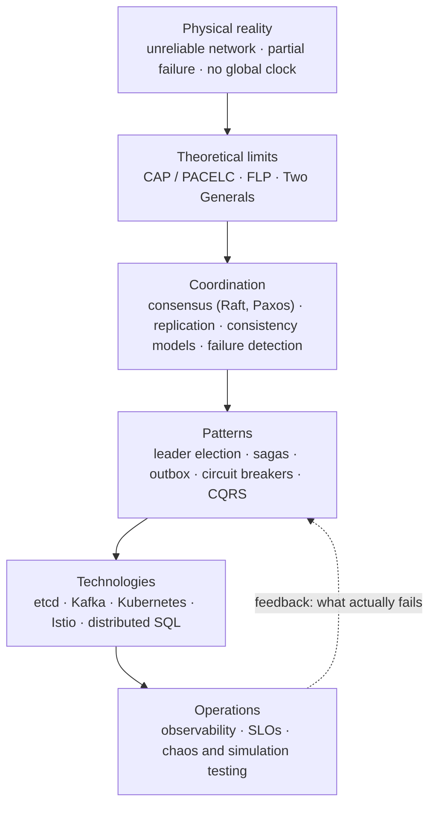
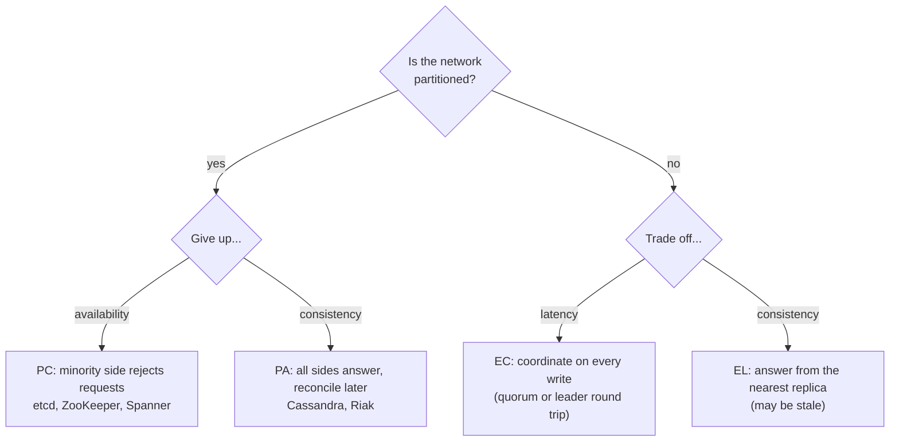
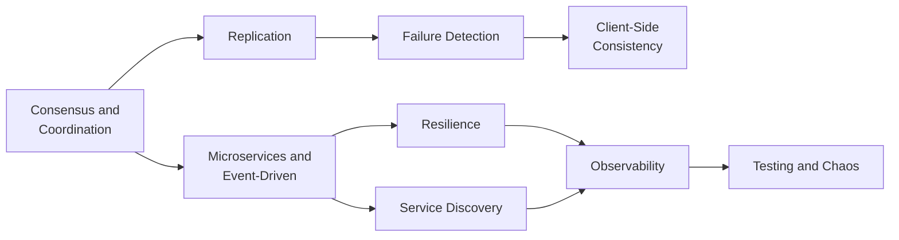

  <h1 style="color: white; margin: 0; font-size: 2.5rem;">Distributed Systems Hub</h1>
  
Architecture patterns, consensus algorithms, and implementation strategies for scalable systems

A **distributed system** is a set of independent computers that cooperate over a network and present themselves to users as one coherent service. Every replicated database, message broker, container orchestrator, and microservice architecture is one. This hub explains why they are hard, summarizes the few results that constrain every design, and routes you to the focused pages in this section and to the related sections on event-driven architecture, observability, and API design.

**Assumed background:** networking basics, concurrency, and at least one programming language. No prior distributed-systems experience is needed; the pages build from first principles.

## Why Distributed Systems Are Hard

The difficulty is not incidental complexity. It follows from three physical facts that no amount of engineering removes:

1. **The network is unreliable and asynchronous.** Messages can be delayed, reordered, duplicated, or lost, and there is no upper bound on delay. A node that has not replied may be slow, crashed, or cut off, and waiting longer cannot tell you which.
2. **Failures are partial.** Some components fail while others keep running, and the survivors have an incomplete, possibly contradictory view of who is alive.
3. **There is no global clock.** Each node's clock drifts independently, so wall-clock timestamps cannot reliably order events across nodes. Ordering needs explicit machinery: logical clocks, a leader, or consensus.

Some systems must also tolerate **Byzantine** faults, where a component behaves arbitrarily (corrupted state, buggy or malicious messages) rather than simply stopping. Most datacenter systems assume crash faults only. Byzantine tolerance appears mainly in blockchains and safety-critical avionics.

These facts are why the **fallacies of distributed computing** (Deutsch and others at Sun, 1994–97) still cause outages. Each is an assumption that feels true on one machine and is false across a network:

| Fallacy | Reality | Where it bites |
|---------|---------|----------------|
| The network is reliable | Packets drop, links flap, partitions happen | Unretried calls, lost messages |
| Latency is zero | Every hop costs 0.1 ms in a datacenter, 100+ ms across the globe | Chatty service calls, N+1 queries |
| Bandwidth is infinite | Links saturate; cross-region egress is billed | Large payloads, replication storms |
| The network is secure | Traffic can be observed or forged | Plaintext east-west traffic (use mTLS) |
| Topology doesn't change | Pods and IPs churn continuously | Hard-coded addresses (use service discovery) |
| There is one administrator | Many teams, providers, and policies | Uncoordinated config changes |
| Transport cost is zero | Serialization, TLS, and egress all cost CPU and money | Over-fine-grained services |
| The network is homogeneous | Mixed protocols, versions, and hardware | Version skew during rolling deploys |

## How the Pieces Fit Together

The field is a stack of consequences. Physical reality imposes theoretical limits; the coordination layer works within those limits; patterns package the coordination layer into reusable designs; technologies implement the patterns. Read top-down to learn *what to build*, bottom-up to learn *why it has to be built that way*.

## Results Every Design Must Respect

### CAP and PACELC

**CAP** (Brewer's conjecture, proved by Gilbert and Lynch in 2002): while a network partition is in progress, a replicated system can offer linearizable consistency or availability (every request to a live node gets a non-error answer), but not both. Partitions cannot be ruled out in a real network, so the practical choice is what to give up *during a partition*:

- **CP**: refuse or block requests on the minority side to stay consistent. Examples: etcd, ZooKeeper, Consul's catalog, Spanner, CockroachDB.
- **AP**: keep answering on both sides and reconcile afterwards. Examples: Cassandra, Riak, DynamoDB with its default eventually consistent reads.

CAP says nothing about the normal case. **PACELC** (Abadi, 2012) completes it: *if* partitioned, choose Availability or Consistency; *else*, choose Latency or Consistency. The "else" half is the trade-off you pay on every request, because strong consistency requires cross-replica coordination even when the network is healthy.

### FLP Impossibility

Fischer, Lynch, and Paterson (1985) proved that no deterministic protocol can guarantee consensus in a fully asynchronous system if even one process may crash. Practical protocols such as Raft and Paxos therefore always preserve *safety* (never decide two different values) but guarantee *liveness* (eventually decide) only when the network behaves for long enough. They get there with timeouts, randomized election delays, or partial-synchrony assumptions.

Formal statements and proofs are in [Distributed Systems Theory](../advanced/distributed-systems-theory/). The engineering consequences are in [Consensus & Coordination](consensus-and-coordination.html).

### Consistency Is a Dial

Stronger guarantees cost more coordination, and so more latency and less availability. Choose the *weakest* model the application can tolerate. From strongest to weakest:

| Model | Guarantee | Coordination cost | Typical use |
|-------|-----------|-------------------|-------------|
| **Linearizable** | Each operation appears to take effect atomically at one instant between its start and end, in real-time order | Highest: a quorum or leader round trip per operation | Locks, leader election, uniqueness constraints, ledgers |
| **Sequential** | One global order consistent with each process's program order, not necessarily real time | High | Replicated state machines |
| **Causal** | Operations that are causally related are seen in the same order everywhere; concurrent ones may differ | Moderate: metadata such as vector clocks | Collaborative editing, comment threads |
| **Eventual** | Replicas converge once updates stop; reads may be stale | Lowest: no coordination on the write path | Shopping carts, DNS, social feeds, caches |

**Session guarantees** (read-your-writes, monotonic reads, monotonic writes, writes-follow-reads) make weak models tolerable for a single user without paying for global coordination. Transactional isolation (serializable, snapshot isolation) is a separate axis about multi-object operations. Strict serializability combines it with linearizability.

## Topics in This Section

The pages are ordered so that **concepts come before patterns**. Start with the limits that constrain every design, then move to the patterns and infrastructure that work within them.

### Concepts and Foundations

| Page | What it covers |
|------|----------------|
| [Consensus & Coordination](consensus-and-coordination.html) | CAP and PACELC, FLP, consistency models, Paxos, Raft, Byzantine fault tolerance, quorums |
| [Replication Strategies](replication-strategies.html) | Single-leader, multi-leader, and leaderless replication; replication lag; conflict resolution |
| [Failure Detection & Gossip](failure-detection.html) | Heartbeats, phi-accrual detectors, SWIM, epidemic dissemination, anti-entropy |
| [Client-Side Consistency & Sync](client-side-consistency.html) | Offline-first sync, CRDTs, operational transformation, session guarantees |

### Patterns and Infrastructure

| Page | What it covers |
|------|----------------|
| [Microservices & Event-Driven](microservices-and-event-driven.html) | Service boundaries, data ownership, sync vs async communication, gateways and meshes, workflows, the outbox |
| [Resilience Patterns](resilience-patterns.html) | Timeouts, retries with jitter, circuit breakers, bulkheads, sagas, idempotency, distributed locks |
| [Service Discovery & Configuration](service-discovery.html) | Registries, DNS vs API discovery, health checks, dynamic configuration |
| [Observability](observability.html) | Context propagation, tracing at scale, the OpenTelemetry pipeline, SLOs across dependency chains |
| [Testing & Chaos Engineering](testing-distributed-systems.html) | Fault injection, property-based testing, deterministic simulation, Jepsen-style checking, load testing |

### Suggested Reading Order

The left branch explains how data stays correct across replicas; the right branch explains how services are composed and kept running. Both depend on the limits in Consensus & Coordination.

## Related Sections

Several neighbouring sections go deeper on topics this one introduces:

| Section | Go there for |
|---------|--------------|
| [Event-Driven Architecture](../event-driven/) | Broker internals (Kafka, RabbitMQ, cloud brokers), event sourcing, CQRS, sagas, outbox/inbox, schema evolution |
| [Observability](../observability/) | Metrics and PromQL, logging pipelines, tracing backends and instrumentation detail |
| [API Design](../api-design/) | REST, gRPC and Protocol Buffers, GraphQL, webhooks, AsyncAPI |
| [Database Design: Distributed Transactions](../technology/database-design/distributed-transactions.html) | Two-phase commit, sagas, exactly-once semantics at the database layer |
| [Distributed Systems Theory](../advanced/distributed-systems-theory/) | Formal models, happens-before, impossibility proofs, consensus correctness |

## Design Principles

- **Design for failure.** Assume every node, link, and dependency will fail. Timeouts, retries with backoff, idempotency, and circuit breakers turn failure from an outage into routine noise.
- **Choose consistency per operation.** Decide deliberately where you need linearizability (uniqueness, money, leadership) and where eventual consistency is fine. Document the choice.
- **Keep services stateless where possible.** Put state in purpose-built stores so compute scales horizontally and recovers by restarting.
- **Make every side effect idempotent.** At-least-once delivery is the norm, so duplicates must be harmless.
- **Observe from the start.** Propagate trace context across every boundary and define SLOs before the first incident, not after.
- **Start simple.** A modular monolith with clear internal boundaries is cheaper to run and easier to split later than a premature microservice mesh.

## See Also

- [Kubernetes](../technology/kubernetes/): container orchestration and cluster management
- [Docker](../technology/docker/): containerization fundamentals
- [AWS Cloud Services](../technology/aws/): managed distributed infrastructure
- [Database Design](../technology/database-design/): sharding, replication, and consistency in data stores
- [Networking](../technology/networking/): the unreliable substrate every distributed system runs on
- [CI/CD Pipelines](../technology/ci-cd/): progressive delivery and rollouts for distributed services

### Further Reading

- Martin Kleppmann and Chris Riccomini, *Designing Data-Intensive Applications*, 2nd ed. (O'Reilly, 2026)
- Maarten van Steen and Andrew S. Tanenbaum, *Distributed Systems*, 4th ed. (free PDF at [distributed-systems.net](https://www.distributed-systems.net/))
- Betsy Beyer et al., *Site Reliability Engineering* and *The Site Reliability Workbook* (Google, free online at [sre.google/books](https://sre.google/books/))
- DeCandia et al., [Dynamo: Amazon's Highly Available Key-value Store](https://www.allthingsdistributed.com/files/amazon-dynamo-sosp2007.pdf) (SOSP 2007)
- Ongaro and Ousterhout, [In Search of an Understandable Consensus Algorithm](https://raft.github.io/raft.pdf) (Raft, USENIX ATC 2014)
- [MIT 6.5840: Distributed Systems](https://pdos.csail.mit.edu/6.824/) (formerly 6.824), lectures and labs
