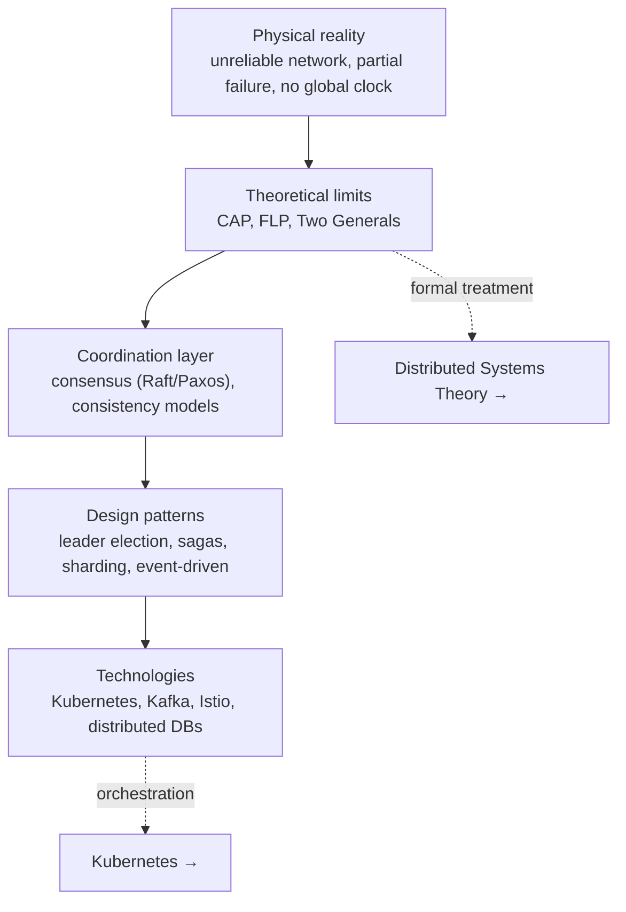
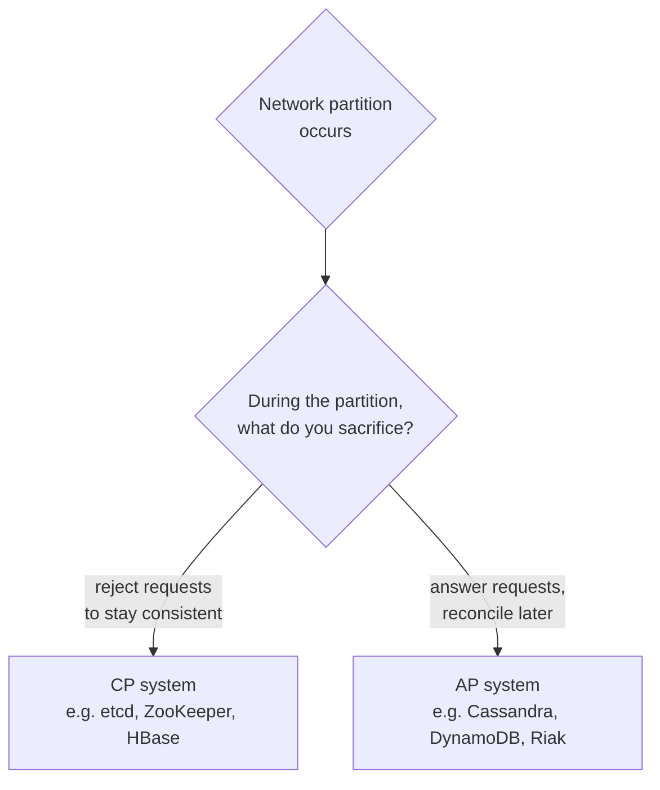

  <h1 style="color: white; margin: 0; font-size: 2.5rem;">Distributed Systems Hub</h1>
  
Architecture patterns, consensus algorithms, and implementation strategies for scalable systems

Comprehensive documentation for distributed systems architecture, design patterns, and implementation strategies. From consensus algorithms to microservices, from message queuing to service mesh. This hub frames the core ideas and routes you into focused pages for each concept and pattern.

  
<i class="fas fa-network-wired"></i><h4>Failure is the default</h4>
Networks partition, nodes crash, clocks drift. Distributed systems are designed assuming components <em>will</em> fail, not hoping they won't.

  
<i class="fas fa-vote-yea"></i><h4>Consensus enables coordination</h4>
Paxos, Raft, and BFT let unreliable nodes agree on a single value — the foundation of replicated state machines and distributed databases.

  
<i class="fas fa-sliders-h"></i><h4>Consistency is a dial</h4>
From linearizable to eventual, you trade coordination latency for stronger guarantees. Choose the weakest model your app tolerates.

  
<i class="fas fa-eye"></i><h4>Observability is mandatory</h4>
You cannot debug what you cannot see. Tracing, metrics, and structured logs are first-class design concerns, not afterthoughts.

## Overview

Distributed systems form the backbone of modern computing infrastructure, enabling applications to scale beyond single machines while maintaining reliability, consistency, and performance. They are also genuinely *hard*: the difficulty is not incidental complexity but the consequence of three physical facts that no amount of engineering removes — the network is unreliable, failures are partial, and there is no global clock.

**What you'll get:** a working mental model of why distributed systems are hard, the patterns that tame that difficulty, and curated links into the deeper theory and the concrete technologies that implement it.

**Assumed background:** comfort with networking basics, concurrency, and at least one programming language. No prior distributed-systems experience required — we build up from first principles.

### How the Pieces Fit Together

A distributed system is a stack of decisions. The physical reality at the bottom (unreliable networks, independent failures) forces theoretical limits (CAP, FLP), which the consensus and consistency layers work around, which in turn are packaged into the patterns and technologies you actually deploy. Reading top-down tells you *what to build*; reading bottom-up tells you *why it has to be that way*.

### The Distributed Systems Challenge

Building distributed systems introduces difficulty along several axes at once:

1. **Network partitions** — network failures can isolate parts of the system from each other.
2. **Partial failures** — some components fail while others continue operating, and the survivors cannot always tell which is which.
3. **Concurrency** — multiple operations happen simultaneously with no global coordinator.
4. **No global clock** — each node has its own clock, making the ordering of events across nodes ambiguous.
5. **Byzantine failures** — components may fail in arbitrary ways, including corrupted or malicious behavior.

### Two Impossibility Results Worth Knowing

Two theorems shape almost every design decision below.

**CAP theorem.** When a network partition occurs, a system can preserve either consistency (every read sees the latest write) or availability (every request gets a non-error response), but not both. Partition tolerance is not optional in a real network, so the real choice is **CP** (reject requests to stay consistent — etcd, ZooKeeper, HBase) versus **AP** (answer requests and reconcile later — Cassandra, DynamoDB, Riak).

**FLP impossibility.** The Fischer–Lynch–Paterson result proves that deterministic consensus is impossible in a fully asynchronous system if even one process may fail. This is why real consensus protocols lean on timeouts and failure detectors, randomization, or partial-synchrony assumptions rather than promising agreement in bounded time.

For the formal statements, the happens-before relation, and the impossibility proofs themselves, see [Distributed Systems Theory](../advanced/distributed-systems-theory/).

### Consistency Is a Dial, Not a Switch

The stronger the guarantee, the more coordination (and latency) it costs — so the rule of thumb is to pick the *weakest* model your application can tolerate. The models below run from strongest to weakest:

| Model | Guarantee | Cost | Typical use |
|-------|-----------|------|-------------|
| **Linearizable** | Operations appear atomic and instantaneous, in real-time order | Highest (cross-node coordination per op) | Locks, leader election, financial ledgers |
| **Sequential** | A single global order consistent with each process's program order | High | Replicated state machines |
| **Causal** | Causally related operations seen in the same order everywhere | Moderate | Collaborative editing, comment threads |
| **Eventual** | Replicas converge if updates stop; readers may see stale data | Lowest (no coordination on the write path) | Shopping carts, DNS, social feeds |

Weaker models add *session guarantees* — read-your-writes (a process always sees its own updates) and monotonic reads (data never appears to go backwards) — to make eventual consistency tolerable for users. Consensus, consistency models, and the quorum mechanics behind them are developed in depth in [Consensus & Coordination](consensus-and-coordination.html); how clients experience and reconcile these guarantees is covered in [Client-Side Consistency & Sync](client-side-consistency.html).

## Explore the Topics

The pages below are ordered so that **concepts come before patterns**: start with the theory that constrains every design, then move into the patterns and infrastructure that work within those constraints.

### Concepts &amp; Foundations

  <a href="consensus-and-coordination.html" class="nav-card">
    <h4><i class="fas fa-vote-yea"></i> Consensus &amp; Coordination</h4>
    
How unreliable nodes agree on a single truth: CAP, FLP, consistency models, Paxos, Raft, BFT, and quorums.

  </a>
  <a href="replication-strategies.html" class="nav-card">
    <h4><i class="fas fa-copy"></i> Replication Strategies</h4>
    
Keeping copies of data in sync across machines — leaders, quorums, replication lag, and the conflicts you cannot avoid.

  </a>
  <a href="failure-detection.html" class="nav-card">
    <h4><i class="fas fa-heartbeat"></i> Failure Detection &amp; Gossip</h4>
    
Heartbeats, the phi-accrual detector, epidemic protocols, anti-entropy, and SWIM membership.

  </a>
  <a href="client-side-consistency.html" class="nav-card">
    <h4><i class="fas fa-mobile-alt"></i> Client-Side Consistency &amp; Sync</h4>
    
Offline-first sync, CRDTs and operational transforms, conflict resolution, and session guarantees from the client's view.

  </a>

### Patterns &amp; Infrastructure

  <a href="microservices-and-event-driven.html" class="nav-card">
    <h4><i class="fas fa-project-diagram"></i> Microservices &amp; Event-Driven</h4>
    
Decomposing systems into services, wiring them with synchronous calls and asynchronous events, with Kafka, event sourcing, and CQRS.

  </a>
  <a href="resilience-patterns.html" class="nav-card">
    <h4><i class="fas fa-shield-alt"></i> Resilience Patterns</h4>
    
Circuit breakers, retries, bulkheads, sagas, idempotency, distributed locks, and graceful degradation.

  </a>
  <a href="service-discovery.html" class="nav-card">
    <h4><i class="fas fa-compass"></i> Service Discovery &amp; Configuration</h4>
    
How services find each other, stay healthy, and absorb configuration changes without a redeploy.

  </a>
  <a href="observability.html" class="nav-card">
    <h4><i class="fas fa-eye"></i> Observability</h4>
    
Tracing, metrics, structured logs, and SLOs — seeing inside emergent multi-node behavior.

  </a>
  <a href="testing-distributed-systems.html" class="nav-card">
    <h4><i class="fas fa-vial"></i> Testing &amp; Chaos Engineering</h4>
    
Finding the bugs that only appear under failure, concurrency, and partition — chaos and property-based testing.

  </a>

### What You'll Find

| Page | What it covers |
|------|----------------|
| [Consensus & Coordination](consensus-and-coordination.html) | CAP, FLP, consistency models, Paxos, Raft, Byzantine fault tolerance, quorums |
| [Replication Strategies](replication-strategies.html) | Leader/follower, multi-leader, leaderless quorums, replication lag, conflict handling |
| [Failure Detection & Gossip](failure-detection.html) | Heartbeats, phi-accrual detectors, epidemic protocols, anti-entropy, SWIM |
| [Client-Side Consistency & Sync](client-side-consistency.html) | Offline-first sync, CRDTs, operational transforms, session guarantees |
| [Microservices & Event-Driven](microservices-and-event-driven.html) | Service decomposition, sync vs async messaging, Kafka, event sourcing, CQRS |
| [Resilience Patterns](resilience-patterns.html) | Circuit breakers, retries, bulkheads, sagas, idempotency, distributed locks |
| [Service Discovery & Configuration](service-discovery.html) | Registries, health checks, dynamic configuration, service mesh discovery |
| [Observability](observability.html) | Distributed tracing, metrics, structured logging, SLOs and error budgets |
| [Testing & Chaos Engineering](testing-distributed-systems.html) | Chaos engineering, fault injection, property-based and deterministic simulation testing |

## Learning Path

There is no single correct route, but the following order builds each idea on the one before it:

1. **Start with the limits.** Read [Consensus & Coordination](consensus-and-coordination.html) for CAP, FLP, and the consistency spectrum. Everything else is an engineering response to these constraints.
2. **See how data survives.** [Replication Strategies](replication-strategies.html) shows how those consistency choices play out when you keep multiple copies of state.
3. **Learn how nodes notice trouble.** [Failure Detection & Gossip](failure-detection.html) covers how a cluster decides a peer is dead — the input every coordination protocol depends on.
4. **Move the guarantees to the edge.** [Client-Side Consistency & Sync](client-side-consistency.html) extends consistency thinking to offline clients, CRDTs, and conflict resolution.
5. **Compose services.** [Microservices & Event-Driven](microservices-and-event-driven.html) assembles these pieces into a system of independently deployable services.
6. **Make it survive production.** Layer on [Resilience Patterns](resilience-patterns.html), wire services together with [Service Discovery & Configuration](service-discovery.html), instrument them with [Observability](observability.html), and prove it all under stress with [Testing & Chaos Engineering](testing-distributed-systems.html).

For the formal underpinnings at any step, branch into [Distributed Systems Theory](../advanced/distributed-systems-theory/); to deploy what you build, see [Kubernetes](../technology/kubernetes/).

## Key Takeaways

  
<h4>Design for failure</h4>
Assume every node, link, and dependency can fail. Idempotency, timeouts, retries, and circuit breakers turn failure from catastrophic to routine.

  
<h4>Pick your CAP side deliberately</h4>
Partitions are unavoidable, so decide up front whether each service is CP or AP — and document why.

  
<h4>Keep services stateless</h4>
Push state into databases and caches so services scale horizontally and recover by simply restarting.

  
<h4>Use proven patterns</h4>
Leader election, distributed locks, sagas, and event-driven messaging solve recurring problems — don't reinvent them.

  
<h4>Observe everything</h4>
Distributed tracing, metrics, and structured logs are the only way to reason about emergent, multi-node behavior.

  
<h4>Start simple</h4>
Add complexity only when scale demands it. A well-run monolith beats a poorly-run microservice mesh.

## See Also

  <h4>Where to go next</h4>
  <ul>
    <li><a href="../advanced/distributed-systems-theory/">Distributed Systems Theory</a> — formal foundations, impossibility results, and consensus proofs.</li>
    <li><a href="../technology/kubernetes/">Kubernetes</a> — container orchestration and cluster management.</li>
    <li><a href="../technology/docker/">Docker</a> — containerization fundamentals and best practices.</li>
    <li><a href="../technology/aws/">AWS Cloud Services</a> — cloud infrastructure and distributed services at scale.</li>
    <li><a href="../technology/database-design/">Database Design</a> — sharding, replication, and consistency in data stores.</li>
    <li><a href="../technology/networking/">Networking</a> — the unreliable substrate every distributed system runs on.</li>
    <li><a href="../technology/ci-cd/">CI/CD Pipelines</a> — progressive delivery and rollouts for distributed services.</li>
  </ul>

### Further Reading

- "Designing Data-Intensive Applications" by Martin Kleppmann
- "Distributed Systems: Principles and Paradigms" by Tanenbaum & Van Steen
- "Site Reliability Engineering" by Google
- [Dynamo: Amazon's Highly Available Key-value Store](https://www.allthingsdistributed.com/files/amazon-dynamo-sosp2007.pdf)
- [MIT 6.824: Distributed Systems](https://pdos.csail.mit.edu/6.824/)
