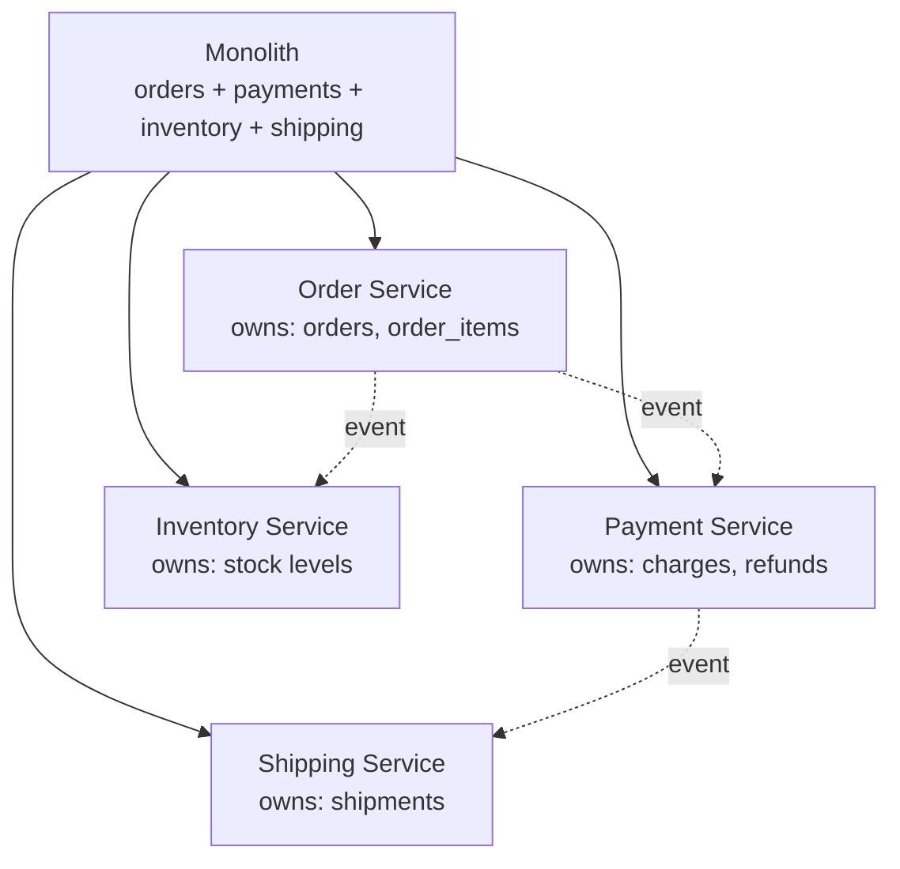
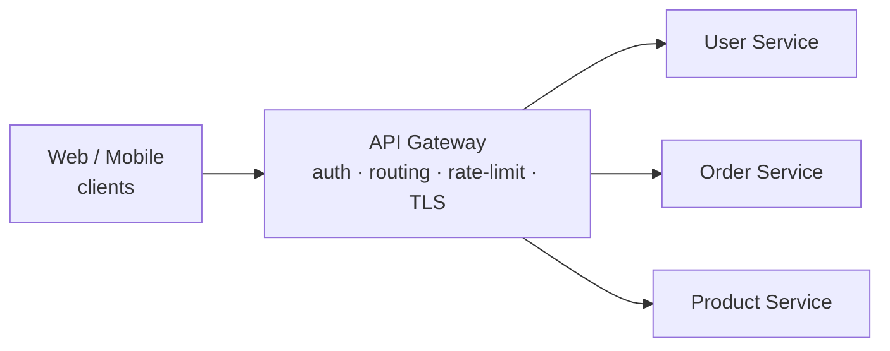
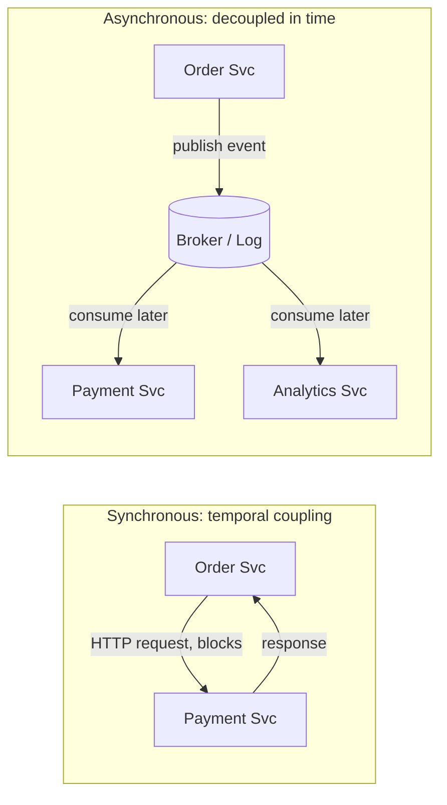
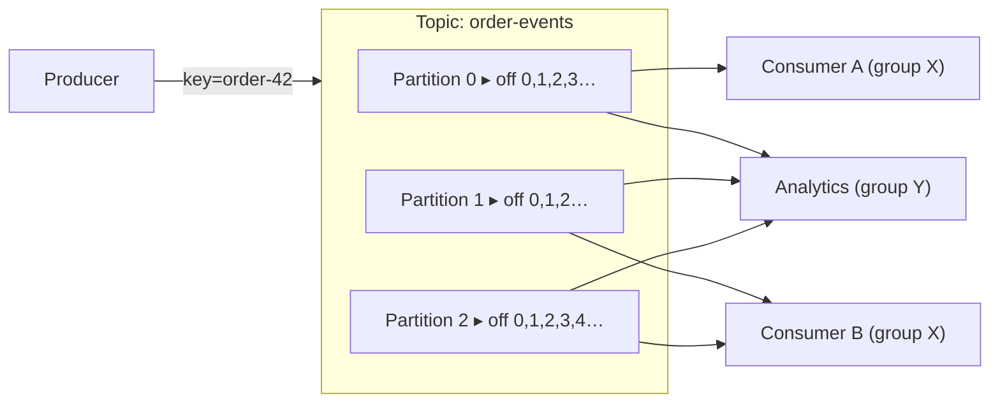
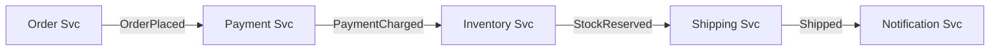
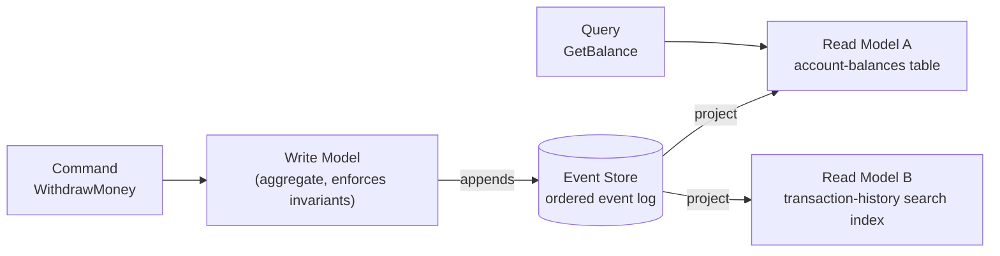
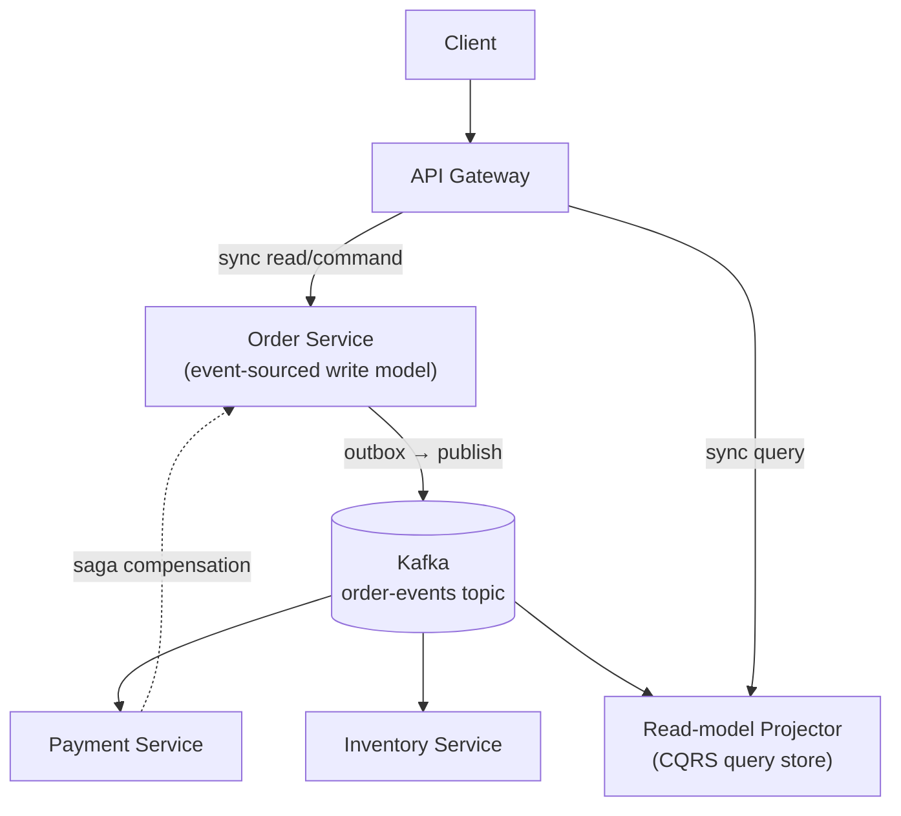

<div class="hero-section" style="background: linear-gradient(135deg, #667eea 0%, #764ba2 100%); color: white; padding: 3rem 2rem; margin: -2rem -3rem 2rem -3rem; text-align: center;">
  <h1 style="color: white; margin: 0; font-size: 2.5rem;">Microservices &amp; Event-Driven Architecture</h1>
  <p style="font-size: 1.25rem; margin-top: 1rem; opacity: 0.9;">Decomposing systems into services, wiring them with synchronous calls and asynchronous events, and using Kafka, event sourcing, and CQRS to keep them loosely coupled.</p>
</div>

[Distributed Systems](./) &raquo; Microservices &amp; Event-Driven Architecture

<div class="intro-card">
  <p class="lead-text">A microservice architecture trades the simplicity of a single deployable for independent scaling, independent deployment, and team autonomy — at the cost of turning every in-process function call into a network call that can be slow, fail, or arrive out of order. The discipline of microservices is mostly the discipline of <em>communication</em>: deciding where to draw service boundaries, choosing between synchronous request/response and asynchronous events, and building the messaging backbone (queues, log-structured streams like Kafka) that lets services stay loosely coupled. This page covers service decomposition, API gateways, the sync-vs-async decision, message queues and event streaming, event-driven architecture, and the event sourcing / CQRS patterns that fall out of treating events as the source of truth.</p>
</div>

<div class="key-insights">
  <div class="insight-card">
    <i class="fas fa-cubes"></i>
    <h4>Boundaries follow business capabilities</h4>
    <p>Good services own a single capability and its data; bad ones share a database and chat constantly across the wire.</p>
  </div>
  <div class="insight-card">
    <i class="fas fa-plug"></i>
    <h4>Async decouples in time</h4>
    <p>A message broker lets a producer and consumer run, fail, and scale independently — the queue absorbs the difference.</p>
  </div>
  <div class="insight-card">
    <i class="fas fa-stream"></i>
    <h4>The log is a database turned inside out</h4>
    <p>Kafka stores an ordered, replayable history of events; consumers materialize whatever views they need from it.</p>
  </div>
  <div class="insight-card">
    <i class="fas fa-history"></i>
    <h4>Events can be the source of truth</h4>
    <p>Event sourcing persists <em>what happened</em>, not just current state, giving you audit, time-travel, and rebuildable read models.</p>
  </div>
</div>

## Table of contents
{: .no_toc .text-delta }

1. TOC
{:toc}

---

## Service Decomposition

A microservice architecture breaks a monolith into independently deployable services, each owning a slice of the domain and its own data store. The hard part is not the splitting — it is choosing *where* to split so that the seams are stable and the chatter across them is low.

### Decompose by Business Capability

The most durable boundary is the **business capability**: a thing the organization does (take payments, manage inventory, fulfill orders) rather than a technical layer (a "validation service", a "database service"). Capability boundaries change slowly, map onto teams (Conway's Law works *for* you here), and tend to encapsulate the data a service needs so it can answer most requests without a network round trip.

A complementary lens is the **bounded context** from Domain-Driven Design: the region of the domain within which a particular model and its vocabulary are consistent. The word "customer" might mean a billing account in one context and a shipping recipient in another; each bounded context is a strong candidate for its own service with its own model.



### The Database-per-Service Rule

Each service owns its data and is the only thing that touches its database. Other services may read that data *only through the owning service's API or its published events* — never by querying its tables directly. Shared databases are the single most common way a "microservice" architecture collapses back into a distributed monolith: a schema change in one service silently breaks three others, and you lose the independent-deployability that justified the split.

The consequence is that you give up cross-service `JOIN`s and multi-table transactions. Data that used to live in one row now lives in two services, and keeping it consistent becomes a coordination problem solved with events and sagas (below) rather than a database transaction.

### Sizing Services: Avoid the Two Extremes

| Symptom | Likely problem | Fix |
|---------|----------------|-----|
| Every feature touches 5 services | Boundaries cut across a capability | Merge services; align to capability |
| Two services always deploy together | They are really one bounded context | Merge them |
| A service is a CRUD wrapper over one table | Too fine-grained ("nanoservice") | Fold into its aggregate owner |
| A service owns half the domain | Still a monolith | Split along an internal seam |

The pragmatic guidance: **start with a well-structured monolith**, let the seams reveal themselves under load and team growth, then extract services along those seams. Premature decomposition pays the full distributed-systems tax (latency, partial failure, operational overhead) before you have the scale to need it.

## API Gateways

When clients face dozens of services, you do not want each client to know every service's address, auth scheme, and protocol. An **API gateway** is a single entry point that fronts the service mesh and handles cross-cutting concerns so individual services do not have to.

A gateway typically provides:

- **Routing** — map an external path (`/api/orders/*`) to an internal service.
- **Authentication / authorization** — verify a token once at the edge, pass a trusted identity inward.
- **Rate limiting and throttling** — protect backends from abusive or runaway clients.
- **TLS termination** — handle certificates at the edge.
- **Request aggregation** — fan out to several services and compose one response (often via a dedicated *Backend-for-Frontend* per client type).
- **Observability** — a natural place to emit per-request metrics, logs, and the root span of a trace.



The reverse-proxy core of a gateway can be as simple as an nginx config in front of the services. The following declarative compose file (moved from the section hub) shows a minimal gateway plus two backing services, each with its own datastore — the database-per-service rule made concrete:

```yaml
# docker-compose.yml for microservices
version: '3.8'
services:
  api-gateway:
    image: nginx:alpine
    ports:
      - "80:80"
    volumes:
      - ./nginx.conf:/etc/nginx/nginx.conf
    depends_on:
      - user-service
      - order-service

  user-service:
    build: ./user-service
    environment:
      - DB_HOST=user-db
      - REDIS_HOST=cache

  order-service:
    build: ./order-service
    environment:
      - DB_HOST=order-db
      - KAFKA_BROKERS=kafka:9092
```

> **Gateway vs. service mesh.** A gateway handles *north-south* traffic (clients into the system). A service mesh (Istio, Linkerd) handles *east-west* traffic (service to service) — mutual TLS, retries, traffic splitting — at the infrastructure layer via sidecars. They are complementary, not alternatives. The service-mesh patterns live on the section hub; this page focuses on the application-level communication choices.

## Inter-Service Communication: Synchronous vs Asynchronous

Once the monolith's function calls become network calls, you must choose *how* services talk. The fundamental fork is synchronous request/response versus asynchronous messaging.

### Synchronous (Request/Response)

The caller sends a request and blocks until a response arrives — typically over REST/HTTP or gRPC.

- **Pros:** simple mental model, immediate result, easy to reason about and debug.
- **Cons:** **temporal coupling** — the callee must be up *right now*; latency adds up across a call chain; a slow or failed dependency propagates backward as a cascading failure.

A request that fans through five services has its latencies *add*, and its availability *multiply*: five 99.9%-available services in a synchronous chain yield only ~99.5% combined. Synchronous chains therefore need **circuit breakers**, timeouts, and retries with backoff to keep one slow dependency from taking down the whole call tree. (The `ResilientService` circuit-breaker example lives on [Resilience Patterns](resilience-patterns.html#circuit-breakers).)

gRPC is usually preferred over REST for *internal* synchronous calls: it uses HTTP/2 multiplexing, compact protobuf binary encoding, and generated typed stubs, which lowers latency and catches interface drift at compile time. REST/JSON remains the lingua franca at the *edge* (the API gateway) where human-debuggability and broad client support matter more.

### Asynchronous (Messaging)

The sender publishes a message to a broker and moves on; one or more consumers process it later. There is no temporal coupling — producer and consumer need not be up at the same time, and the broker absorbs bursts.

- **Pros:** loose coupling in time, natural buffering and back-pressure, easy fan-out to multiple consumers, resilience to consumer downtime.
- **Cons:** eventual consistency (the result is not available immediately), harder end-to-end debugging, and the operational burden of running a broker.



### Choosing Between Them

| Use synchronous when… | Use asynchronous when… |
|-----------------------|------------------------|
| The caller needs the result to proceed (read a value, validate input) | The work can happen later (send email, update a read model) |
| The operation is naturally a query | The operation is a fact ("order placed") others react to |
| Strong, immediate consistency is required | Eventual consistency is acceptable |
| One caller, one callee | One producer, many interested consumers |

A healthy architecture mixes both: synchronous reads at the edge for snappy UX, asynchronous events behind them so that side effects (inventory, analytics, notifications) do not slow the user's request or couple to its availability.

## Message Queues & Event Streaming

Asynchronous communication runs over a **broker**. There are two broad broker families, and the difference shapes everything downstream.

### Queues vs. Logs

A **message queue** (RabbitMQ, Amazon SQS, ActiveMQ) treats a message as a *task*. A message is delivered to one consumer in a competing-consumers group and then *removed* (acknowledged). Queues excel at distributing work: add consumers to drain the queue faster. Once consumed, a message is gone.

A **log-structured stream** (Apache Kafka, AWS Kinesis, Redpanda, Pulsar) treats a message as an *immutable fact* appended to an ordered, durable log. Messages are **not** deleted on consumption — they are retained for a configured time (or forever) and consumers track their own position (offset). Many independent consumer groups can read the same log at their own pace, and a new consumer can replay history from the beginning.

| | Message Queue (e.g. RabbitMQ) | Log Stream (e.g. Kafka) |
|---|---|---|
| Message model | Transient task | Durable, ordered fact |
| After consumption | Removed | Retained (replayable) |
| Consumers per message | One (competing consumers) | Many (independent groups) |
| Ordering | Per-queue, fragile under scale | Strict per-partition |
| Re-read history | No | Yes (seek to offset) |
| Best for | Work distribution, RPC-style jobs | Event streaming, event sourcing, analytics |

### Kafka's Model: Topics, Partitions, Offsets

Kafka is the dominant event-streaming platform, so it is worth understanding its primitives precisely.

- A **topic** is a named stream of events (e.g. `order-events`).
- A topic is split into **partitions**, each an independent, totally-ordered, append-only log. Partitioning is how Kafka scales: partitions of one topic spread across brokers and are consumed in parallel.
- Each event has an **offset** — its monotonically increasing position within its partition. Consumers commit offsets to record progress.
- A **consumer group** is a set of cooperating consumers; Kafka assigns each partition to exactly one consumer in the group, so adding consumers (up to the partition count) increases throughput. Different groups consuming the same topic each get the *full* stream independently.



#### Key Kafka Patterns

**Partitioning by key for ordering.** Kafka guarantees order only *within* a partition. To keep all events for one entity ordered, partition by a stable key (e.g. the order ID): every event with the same key lands in the same partition and is therefore consumed in produced order. Cross-key order is not guaranteed and should not be relied upon.

**Consumer groups for horizontal scale.** Scale a consumer by adding members to its group, up to the partition count. Beyond that, increase partitions. Each partition is processed by at most one consumer per group, which is exactly what preserves per-key ordering while still parallelizing.

**Log compaction.** With `cleanup.policy=compact`, Kafka retains only the *latest* value per key, turning a topic into a durable, replayable snapshot of current state — ideal for "current account balance per user" style topics that double as a changelog.

**At-least-once delivery and idempotent consumers.** Default delivery is at-least-once: a consumer may see a message twice if it crashes after processing but before committing its offset. Consumers must therefore be **idempotent** — processing the same event twice must equal processing it once (dedupe on event ID, use upserts, etc.). Kafka also offers idempotent producers and exactly-once *processing* semantics (transactions) for read-process-write pipelines, at some throughput cost.

The producer/consumer pair below (moved from the section hub) shows the basic Kafka client flow with `aiokafka` — a producer publishing an order event keyed for ordering, and a consumer group draining it:

```python
# Producer
import json
import asyncio
from aiokafka import AIOKafkaProducer

async def send_order_event(order_data):
    producer = AIOKafkaProducer(
        bootstrap_servers='localhost:9092',
        value_serializer=lambda v: json.dumps(v).encode()
    )
    await producer.start()
    try:
        await producer.send_and_wait(
            "order-events",
            {"order_id": order_data["id"], "status": "created"},
            # partition by order id so all events for an order stay ordered
            key=str(order_data["id"]).encode()
        )
    finally:
        await producer.stop()

# Consumer
from aiokafka import AIOKafkaConsumer

async def process_orders():
    consumer = AIOKafkaConsumer(
        'order-events',
        bootstrap_servers='localhost:9092',
        group_id="order-processor"  # members of this group share the partitions
    )
    await consumer.start()
    try:
        async for msg in consumer:
            order = json.loads(msg.value)
            await handle_order(order)  # must be idempotent
            # offset committed (auto or manual) after successful processing
    finally:
        await consumer.stop()
```

### Dead-Letter Queues and Poison Messages

A message that repeatedly fails processing (a "poison message") must not block the queue forever. The standard remedy is a **dead-letter queue (DLQ)**: after N failed attempts, route the message to a separate topic/queue for inspection and out-of-band reprocessing, and let the consumer move on. This keeps one bad message from halting an entire partition or queue.

## Event-Driven Architecture

**Event-driven architecture (EDA)** inverts the usual control flow. Instead of a service *commanding* another ("PaymentService, charge this card"), a service *announces a fact* ("OrderPlaced") and any number of other services react however they choose. The producer does not know — and must not care — who consumes the event.

### Commands vs. Events

The distinction is central:

- A **command** is an imperative addressed to a specific handler that *may reject it*: `ChargePayment`. There is one logical recipient.
- An **event** is a past-tense statement of fact that has already happened and cannot be rejected: `PaymentCharged`. There may be zero or many recipients.

Designing around events forces loose coupling: adding a new reaction (say, a loyalty-points service that listens for `OrderPlaced`) requires *no change* to the producer.

### Choreography vs. Orchestration

There are two ways to coordinate a multi-step business process across services.

**Choreography** — each service reacts to events and emits its own, with no central coordinator. The workflow emerges from the chain of reactions.



Choreography is maximally decoupled but the end-to-end flow is *implicit* — no single place tells you "what happens when an order is placed," which makes complex flows hard to follow and debug.

**Orchestration** — a central coordinator (an orchestrator or workflow engine) explicitly invokes each step and decides what comes next. The flow is *explicit and centralized*, easier to reason about and modify, at the cost of a coordinator that becomes a focal point of coupling and a potential bottleneck.

The rule of thumb: prefer **choreography** for simple, stable, two-or-three-step flows; prefer **orchestration** once a process has many steps, branches, or compensation logic — which leads directly into the saga pattern.

### The Saga Pattern for Distributed Transactions

Because each service owns its own database, you cannot wrap "create order, charge payment, reserve inventory" in a single ACID transaction. A **saga** replaces the distributed transaction with a sequence of *local* transactions, each publishing an event that triggers the next — and a matching **compensating** action that semantically undoes a step if a later one fails. Sagas give up atomicity and isolation in exchange for availability; the system passes through intermediate states and converges to either "all committed" or "all compensated."

The orchestrator below (moved from the section hub) runs the forward steps in order and, on any failure, replays the compensations in reverse — refunding a payment, restoring inventory — to unwind the partial transaction:

```python
class SagaOrchestrator:
    def __init__(self):
        self.steps = []
        self.compensations = []

    def add_step(self, action, compensation):
        self.steps.append(action)
        self.compensations.append(compensation)

    async def execute(self):
        completed_steps = []

        try:
            # Execute all steps
            for i, step in enumerate(self.steps):
                result = await step()
                completed_steps.append(i)

        except Exception as e:
            # Compensate in reverse order
            for i in reversed(completed_steps):
                try:
                    await self.compensations[i]()
                except Exception as comp_error:
                    # Log compensation failure
                    print(f"Compensation {i} failed: {comp_error}")
            raise e

# Usage example
saga = SagaOrchestrator()

saga.add_step(
    lambda: create_order(order_data),
    lambda: cancel_order(order_id)
)

saga.add_step(
    lambda: charge_payment(payment_data),
    lambda: refund_payment(payment_id)
)

saga.add_step(
    lambda: update_inventory(items),
    lambda: restore_inventory(items)
)

await saga.execute()
```

Two practical caveats. Compensations must themselves be reliable and idempotent — a compensation that fails leaves the system in a bad state, so compensation failures are typically retried and alerted on. And because there is no isolation, other transactions can observe intermediate states; guard against this with semantic locks (e.g. an order status of `PENDING`) so downstream readers know the data is not yet final.

### The Dual-Write Problem and the Outbox Pattern

A subtle trap lurks in event-driven services: a handler that must both **write to its database** and **publish an event** is performing a *dual write* across two systems with no shared transaction. If it commits the DB row but crashes before publishing (or vice versa), the database and the event stream diverge — silently and permanently.

The fix is the **transactional outbox**: within the *same* local DB transaction that changes business state, insert the event into an `outbox` table. A separate relay process (or Kafka Connect / Debezium reading the DB's change-log) then reads the outbox and publishes to the broker, marking rows as sent. Because the business write and the outbox insert commit atomically, no event is ever lost or invented. This is the standard, robust way to bridge "change my state" and "tell the world" without distributed transactions.

## Event Sourcing & CQRS

The two patterns below take event thinking to its conclusion: events become the *primary* representation of state, not a side effect of it.

### Event Sourcing

In a conventional system you store *current state* and overwrite it on every change; the history of how you got there is lost. **Event sourcing** instead persists the full, append-only sequence of **events** that changed an entity. Current state is not stored at all — it is *derived* by replaying the events from the beginning (`fold` over the event stream).

For a bank account, you do not store `balance = 80`; you store:

```
AccountOpened(balance=0)
Deposited(amount=100)
Withdrawn(amount=20)
```

and compute `balance = 80` by folding these events. The benefits are substantial:

- **Complete audit log** — every change is a first-class, immutable record of *why* state is what it is. This is often a regulatory requirement (finance, healthcare) you get for free.
- **Temporal queries** — reconstruct the state of any entity *as of any past moment* by replaying up to that point.
- **Replay and rebuild** — derive entirely new read models from history, fix a bug in a projection and re-run it over all events, or debug by replaying a problematic sequence.

The costs are real too: querying ("which accounts are overdrawn?") is awkward when state is a stream of events, the event schema must be versioned and evolved carefully (old events are immutable and must remain replayable forever), and replaying long histories is slow — mitigated with **snapshots** (periodically persist the folded state so replay can start from the latest snapshot rather than event zero).

```python
# A minimal event-sourced aggregate
class Account:
    def __init__(self):
        self.balance = 0
        self.version = 0

    def apply(self, event):
        """Fold one event into current state."""
        if event["type"] == "AccountOpened":
            self.balance = event["balance"]
        elif event["type"] == "Deposited":
            self.balance += event["amount"]
        elif event["type"] == "Withdrawn":
            self.balance -= event["amount"]
        self.version += 1

    @classmethod
    def rehydrate(cls, events):
        """Rebuild current state by replaying the event stream."""
        account = cls()
        for event in events:
            account.apply(event)
        return account

# A command produces new events (after validating against current state)
def withdraw(account, amount):
    if amount > account.balance:
        raise ValueError("Insufficient funds")  # invariant enforced on write
    return {"type": "Withdrawn", "amount": amount}
```

### CQRS (Command Query Responsibility Segregation)

**CQRS** separates the model used to *change* state (the **write model**, handling commands) from the model used to *read* state (one or more **read models**, serving queries). The two no longer share a schema: writes go through a normalized, invariant-enforcing aggregate; reads are served by denormalized projections shaped exactly for each query.

CQRS and event sourcing are independent but combine naturally: the write model emits events (event sourcing), and each read model is a **projection** built by subscribing to those events and updating a query-optimized store (a relational view, a search index, a cache). Because read models are derived, you can add a new one at any time by replaying the event stream, and scale reads independently of writes.



The trade-off is that read models are **eventually consistent** with the write model — there is a small lag between a command committing and the projection updating. This is acceptable for most domains (a transaction list that is 50 ms stale is fine) but must be designed for explicitly: a UI that issues a command and immediately re-queries may not see its own write, so use read-your-writes session guarantees, optimistic UI updates, or return the new state directly from the command.

CQRS adds significant complexity (two models, projection plumbing, eventual consistency) and is **not** a default. It earns its keep when read and write workloads have very different shapes or scaling needs, when the domain demands a rich audit trail, or when many divergent read views must be served from the same writes. For ordinary CRUD, a single model is simpler and correct.

## Putting It Together

A mature event-driven microservice system layers these patterns:



Synchronous calls at the edge keep the user experience responsive; the transactional outbox bridges state changes to the event log without dual-write bugs; Kafka's replayable, partitioned log carries facts to every interested service; sagas coordinate multi-service business transactions with compensations; and CQRS read models, projected from the same event stream, serve queries at scale. Each pattern addresses a specific failure mode of naive microservices — adopt them as the pain they solve actually appears, not before.

## See Also

- **[Distributed Systems Hub](./)** — section overview: CAP/FLP, consistency models, service mesh, observability, and the resilience patterns (circuit breakers, leader election, distributed locks) referenced above
- **[Distributed Systems Theory](../advanced/distributed-systems-theory/)** — formal foundations: consensus, the happens-before relation, and consistency-model definitions
- **[Kubernetes](../technology/kubernetes/)** — deploying and orchestrating the services described here
- **[Docker](../technology/docker/)** — containerizing individual services
- **[Database Design](../technology/database-design/)** — sharding, replication, and the data stores behind database-per-service
- **[Networking](../technology/networking/)** — the transport beneath synchronous and asynchronous communication
