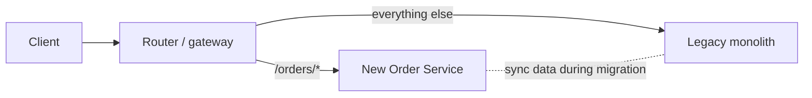
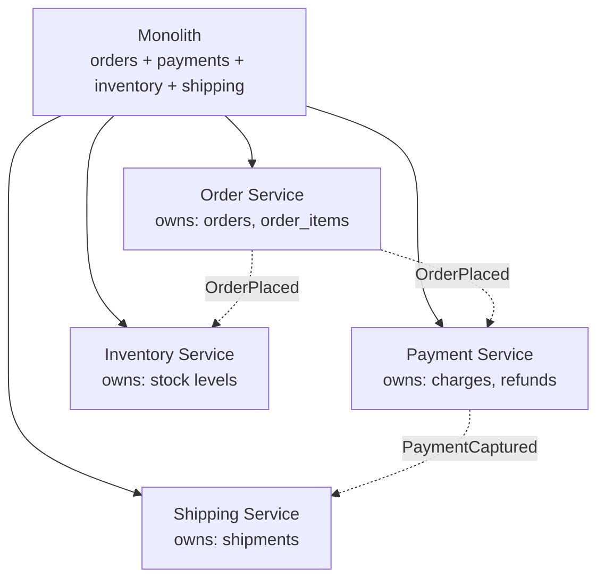
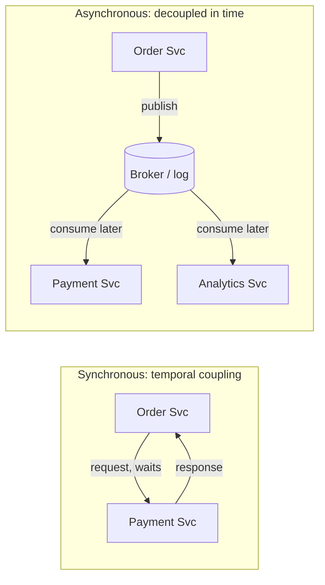
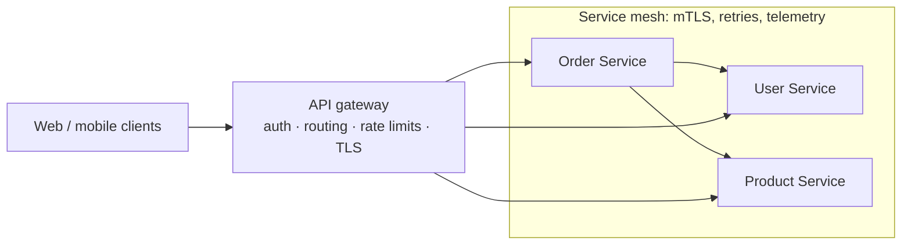
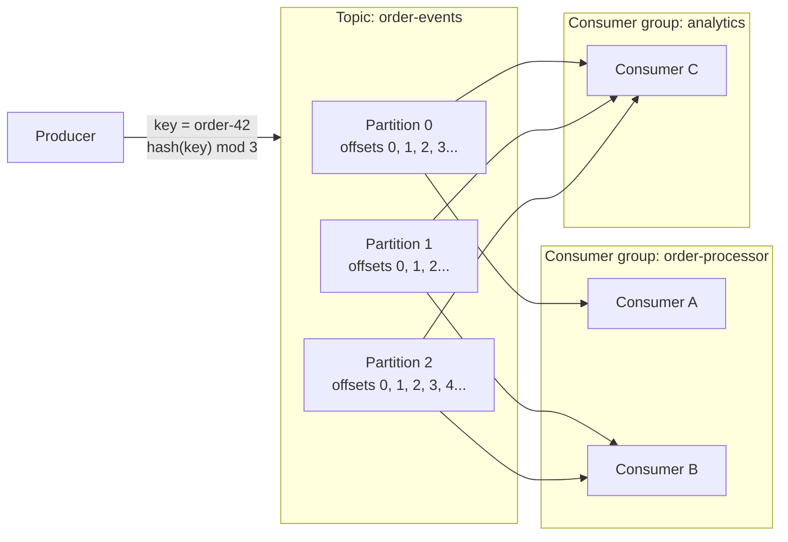
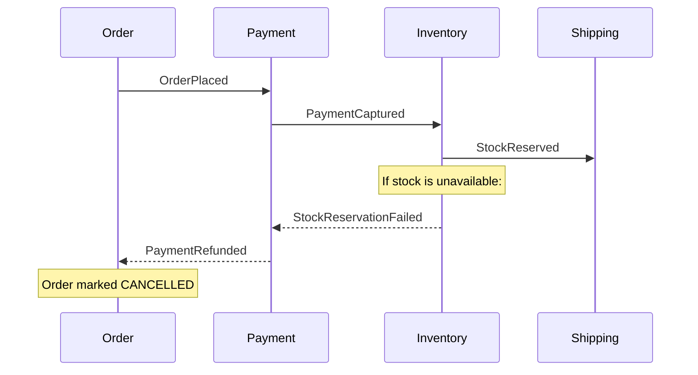
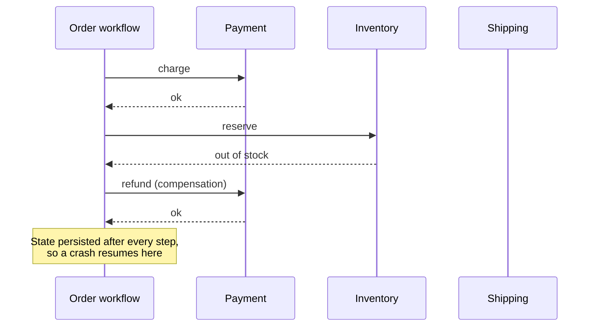
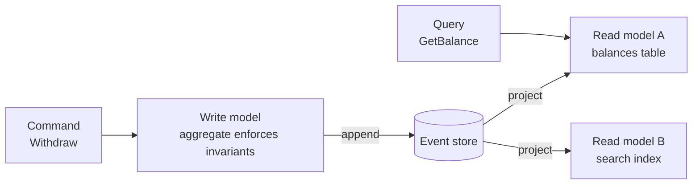
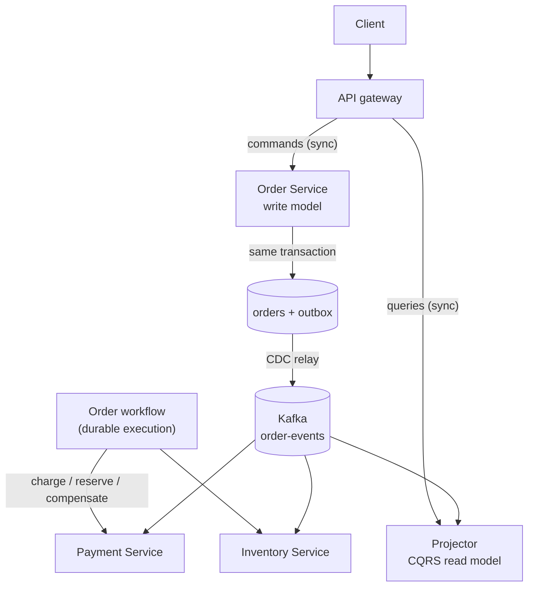

[Distributed Systems](./) &raquo; Microservices &amp; Event-Driven Architecture

A **microservice architecture** splits an application into independently deployable services, each owning one business capability and its data. It buys independent deployment, independent scaling, and team autonomy. The price is that every in-process call becomes a network call, which can be slow, can fail, or can arrive twice or out of order. This page covers the system-level decisions: whether to split at all, where to draw boundaries, how services communicate (synchronously or through a broker), how traffic enters and moves between services, how multi-service business processes are coordinated, and how the outbox, event sourcing, and CQRS patterns keep data consistent without distributed transactions.

Broker internals and the event patterns in full detail are in the [Event-Driven Architecture](../event-driven/) section. Failure-handling mechanics (timeouts, retries, circuit breakers) are in [Resilience Patterns](resilience-patterns.html).

## Table of contents
{: .no_toc .text-delta }

1. TOC
{:toc}

---

## Monolith, Modular Monolith, or Microservices

Microservices are an organizational scaling tool first and a technical one second. They pay off when many teams need to ship independently. They do not pay off for a small team, where they add network failure modes, distributed data, and operational overhead with nothing to show for it.

| | Monolith | Modular monolith | Microservices |
|---|---|---|---|
| Deployable units | One | One | Many |
| Module boundaries | Often implicit | Enforced in code (packages, build rules) | Enforced by the network |
| Data | One shared database | One database, schema per module | Database per service |
| Cross-module call | Function call | Function call through a public interface | Network call (HTTP, gRPC, messages) |
| Failure modes | Process crash | Process crash | Partial failure, timeouts, duplicates, version skew |
| Team scaling | Poor beyond a few teams | Good up to many teams | Best for many autonomous teams |
| Operational cost | Low | Low | High: CI/CD, observability, and on-call per service |

The widely recommended path is to **start with a modular monolith**, keep module boundaries strict, and extract a module into a service only when there is a concrete reason: it needs to scale differently, deploy on a different cadence, use a different runtime, or belong to a different team. Migrating an existing monolith is usually done incrementally with the **strangler fig** pattern: a routing layer sends one capability at a time to a new service until the old code path can be deleted.



## Service Decomposition

The hard part of microservices is not splitting the code. It is choosing seams that are stable and that minimize traffic across them.

### Boundaries Follow Business Capabilities

The most durable boundary is a **business capability**, something the organization does (take payments, manage inventory, fulfil orders), rather than a technical layer (a "validation service" or a "database service"). Capabilities change slowly, map onto teams, and tend to contain the data they need, so most requests can be answered without a network hop. Conway's Law says systems mirror the communication structure of the organization that builds them. Aligning services with team ownership makes that law work in your favour.

The **bounded context** from Domain-Driven Design refines this. A bounded context is a region of the domain within which one model and its vocabulary are consistent. "Customer" may mean a billing account in one context and a delivery address in another. Each bounded context is a strong candidate for its own service with its own model, and translation happens explicitly at the boundary.



### Database per Service

Each service is the only thing that reads or writes its database. Other services get that data **only through the owner's API or its published events**, never by querying its tables. Shared databases are the most common way a microservice architecture decays into a *distributed monolith*: a schema change in one service silently breaks three others, and the independent deployability that justified the split is gone.

The consequence is the loss of cross-service `JOIN`s and multi-table ACID transactions. Data that used to live in one row now spans two services. Keeping it consistent becomes a coordination problem, solved with events, sagas, and the outbox pattern rather than with a database transaction. Services that need another service's data for queries typically keep a local, read-only **replica** of just the fields they need, updated from that service's events.

### Sizing Services

| Symptom | Likely problem | Fix |
|---------|----------------|-----|
| Every feature touches five services | Boundaries cut across a capability | Merge; realign to the capability |
| Two services always deploy together | They are one bounded context | Merge them |
| A service is a CRUD wrapper over one table | Too fine-grained ("nanoservice") | Fold into the owning aggregate's service |
| A service owns half the domain | Still a monolith | Split along an internal seam |
| Long synchronous call chains on every request | Data is in the wrong place | Replicate the needed data via events, or merge |

## Synchronous vs Asynchronous Communication

Once function calls become network calls, the fundamental choice is between synchronous request/response and asynchronous messaging.



### Synchronous Request/Response

The caller sends a request, usually over HTTP (REST) or gRPC, and waits for the answer. The model is simple and the result is immediate. The cost is **temporal coupling**: the callee must be up at that moment. Latencies along a call chain add, and availabilities multiply. For a chain of $n$ services that must all succeed:

$$
A_{\text{chain}} = \prod_{i=1}^{n} A_i, \qquad \text{e.g. } 0.999^{5} \approx 0.995
$$

Five services at 99.9% each give roughly 99.5% end to end, about 3.6 hours of failure per month instead of 43 minutes. Synchronous chains therefore need deadlines that shrink as they propagate, bounded retries with jitter, and circuit breakers; see [Resilience Patterns](resilience-patterns.html#circuit-breakers).

**gRPC** is the usual choice for internal synchronous calls. It runs over HTTP/2 with multiplexed streams, uses compact Protocol Buffers encoding, generates typed client stubs, and propagates deadlines natively. **REST/JSON** remains the default at the public edge, where debuggability and broad client support matter more. See [gRPC & Protocol Buffers](../api-design/grpc-and-protobuf.html) and [REST](../api-design/rest.html).

### Asynchronous Messaging

The sender publishes a message to a broker and continues. Consumers process it later. Producer and consumer need not be up at the same time, the broker absorbs bursts, and new consumers can be added without changing the producer. The costs are eventual consistency (the effect is not visible immediately), harder end-to-end debugging, duplicate delivery, and a broker to operate.

### Choosing

| Use synchronous when... | Use asynchronous when... |
|-------------------------|--------------------------|
| The caller needs the result to continue (read a value, validate input) | The work can finish later (send email, update a read model) |
| The operation is a query | The operation is a fact others react to ("order placed") |
| The user is waiting and the call is fast | The work is slow or bursty |
| There is exactly one callee | Several services care about the same change |

Most systems mix both: synchronous reads and commands at the edge for a responsive user experience, with asynchronous events behind them so that side effects (inventory, analytics, notifications) neither slow the request nor share its availability.

## Edge and Service-to-Service Traffic

### API Gateway and Backend for Frontend

An **API gateway** is the single entry point for external (north-south) traffic. It keeps clients from needing to know each service's address, protocol, and auth scheme, and it centralizes cross-cutting concerns:

- **Routing**: map `/api/orders/*` to the order service.
- **Authentication**: validate a token once at the edge and pass a trusted identity inward.
- **Rate limiting and quotas**: protect backends from abusive or runaway clients.
- **TLS termination** and certificate management.
- **Aggregation**: fan out to several services and compose one response.
- **Telemetry**: start the root span of every trace and emit per-route metrics.

A **Backend for Frontend (BFF)** is a gateway specialized for one client type (web, iOS, partner API), so that each client gets responses shaped for it without bloating the shared services. GraphQL federation plays a similar role; see [GraphQL](../api-design/graphql.html#schema-federation).

On Kubernetes, the standard way to configure edge routing is now the **Gateway API** (`Gateway`, `HTTPRoute`, `GRPCRoute`), which replaced the older `Ingress` resource as the actively developed interface. The widely used community ingress-nginx controller was retired in March 2026 and no longer receives security fixes, so new clusters should use a Gateway API implementation (Envoy Gateway, Istio, Cilium, NGINX Gateway Fabric, cloud load-balancer controllers, and others).

### Service Mesh

A **service mesh** handles east-west (service-to-service) traffic at the infrastructure layer: mutual TLS and workload identity, retries and timeouts, traffic splitting for canaries, and uniform telemetry, without application code changes. Gateways and meshes are complementary.

| Data-plane model | How it works | Trade-off |
|------------------|--------------|-----------|
| **Sidecar** (Istio classic, Linkerd) | A proxy container in every pod intercepts its traffic | Full L7 features per pod; memory and CPU overhead on every pod; upgrades require pod restarts |
| **Sidecarless / ambient** (Istio ambient mode, GA since Istio 1.24; Cilium) | A per-node proxy handles L4 and mTLS; optional shared L7 proxies ("waypoints") are deployed only where needed | Much lower overhead and no pod restarts; L7 policy only where waypoints exist |



### A Minimal Local Topology

For local development, a Compose file makes the database-per-service rule concrete: each service gets its own datastore, and only the gateway is exposed. (The top-level `version:` key is obsolete in the current Compose Specification and is omitted.)

```yaml
# compose.yaml
services:
  gateway:
    image: nginx:stable-alpine
    ports: ["8080:80"]
    volumes: ["./nginx.conf:/etc/nginx/nginx.conf:ro"]
    depends_on: [user-service, order-service]

  user-service:
    build: ./user-service
    environment:
      DB_URL: postgres://user-db:5432/users
    depends_on: [user-db]

  order-service:
    build: ./order-service
    environment:
      DB_URL: postgres://order-db:5432/orders
      KAFKA_BOOTSTRAP: kafka:9092
    depends_on: [order-db, kafka]

  user-db:
    image: postgres:17
    environment: { POSTGRES_DB: users, POSTGRES_PASSWORD: dev }

  order-db:
    image: postgres:17
    environment: { POSTGRES_DB: orders, POSTGRES_PASSWORD: dev }

  kafka:
    image: apache/kafka:latest   # single-node KRaft broker; no ZooKeeper
```

## The Messaging Backbone

Asynchronous communication runs over a **broker**. The two broker families behave differently enough that the choice shapes the whole design. For configuration, operations, and cloud-managed options, see [Message Brokers & Streaming](../event-driven/message-brokers.html).

### Queues vs Logs

| | Message queue (RabbitMQ, SQS) | Log / stream (Kafka, Kinesis, Redpanda, Pulsar) |
|---|---|---|
| A message is... | A task to be done | An immutable fact in an ordered log |
| After consumption | Removed once acknowledged | Retained for a configured period (or forever) |
| Consumers per message | One, among competing consumers | Every consumer group reads every message |
| Consumer position | Broker tracks per-message acks | Consumer tracks its own offset |
| Replay history | No | Yes: seek to any retained offset |
| Ordering | Per queue, weakened by redelivery and parallelism | Strict within a partition |
| Best for | Work distribution, background jobs | Event streaming, event sourcing, change data capture, analytics |

The line is blurring. Kafka 4.x adds **share groups** (KIP-932, "Queues for Kafka"): consumers in a share group cooperatively consume a topic with per-message acknowledgement and redelivery, and the number of consumers is no longer capped by the partition count. Share groups were a preview in Kafka 4.1 and are production-ready from Kafka 4.2.

### Kafka's Model: Topics, Partitions, Offsets

- A **topic** is a named stream of events, such as `order-events`.
- A topic is split into **partitions**, each an independent, totally ordered, append-only log. Partitions are spread across brokers and consumed in parallel; they are Kafka's unit of scale.
- Each record has an **offset**, its position within the partition. Consumers commit offsets to record progress.
- A **consumer group** is a set of cooperating consumers. Each partition is assigned to exactly one member of the group, so a group scales up to the partition count. Different groups each receive the full stream independently.



Kafka 4.0 (March 2025) removed ZooKeeper entirely; clusters run in **KRaft** mode, with metadata managed by a Raft quorum of controller nodes. The same release made the **next-generation consumer rebalance protocol** (KIP-848) generally available: the broker-side group coordinator assigns partitions incrementally, so a consumer joining or leaving no longer pauses the whole group. Consumers opt in with `group.protocol=consumer`.

### Ordering, Delivery Guarantees, and Idempotency

- **Ordering is per partition.** To keep all events for one entity in order, use a stable key such as the order ID. Records with the same key go to the same partition. Never rely on ordering across keys.
- **Delivery is at-least-once by default.** A consumer that crashes after processing a record but before committing its offset will see the record again. Every consumer must therefore be **idempotent**: processing a message twice must have the same effect as processing it once. Typical techniques are a processed-message table keyed by event ID, upserts, or conditional writes on a version number.
- **Exactly-once inside Kafka.** Idempotent producers (the default since Kafka 3.0) remove duplicates caused by producer retries. Transactions make a read-process-write pipeline atomic when both input and output are Kafka topics. As soon as a side effect leaves Kafka (a database write, an email, an HTTP call), you are back to at-least-once plus idempotency.
- **Poison messages go to a dead-letter queue.** A message that fails repeatedly is moved to a separate DLQ topic after N attempts, with the error attached, so it cannot block the partition. DLQs need an owner and a replay tool, or they become a silent data-loss bin.

The client below uses `aiokafka`. The producer is long-lived (creating one per message is a common and expensive mistake), keys records for per-order ordering, and requires acknowledgement from all in-sync replicas. The consumer disables auto-commit and commits only after the handler succeeds, which gives at-least-once processing:

```python
import json
from aiokafka import AIOKafkaProducer, AIOKafkaConsumer

producer = AIOKafkaProducer(
    bootstrap_servers="kafka:9092",
    acks="all",                      # wait for all in-sync replicas
    enable_idempotence=True,         # no duplicates from producer retries
    value_serializer=lambda v: json.dumps(v).encode(),
)

async def publish_order_created(order: dict) -> None:
    await producer.send_and_wait(
        "order-events",
        {"event_id": order["event_id"], "type": "OrderCreated", "order_id": order["id"]},
        key=str(order["id"]).encode(),   # same key -> same partition -> ordered
    )

async def run_consumer() -> None:
    consumer = AIOKafkaConsumer(
        "order-events",
        bootstrap_servers="kafka:9092",
        group_id="order-processor",
        enable_auto_commit=False,        # commit only after successful processing
        auto_offset_reset="earliest",
    )
    await consumer.start()
    try:
        async for msg in consumer:
            event = json.loads(msg.value)
            await handle_idempotently(event)   # dedupe on event["event_id"]
            await consumer.commit()
    finally:
        await consumer.stop()

# At service startup: await producer.start(); at shutdown: await producer.stop()
```

## Event Contracts

### Commands vs Events

- A **command** is an imperative addressed to one handler, which may reject it: `ChargePayment`.
- An **event** is a past-tense statement of something that already happened and cannot be rejected: `PaymentCaptured`. It may have zero, one, or many consumers.

Designing around events keeps producers ignorant of consumers. Adding a loyalty-points service that listens for `OrderPlaced` requires no change to the order service.

### How Much Data an Event Carries

| Style | Payload | Consumer behaviour | Trade-off |
|-------|---------|--------------------|-----------|
| **Event notification** | IDs only (`OrderPlaced{order_id}`) | Calls back to the producer for details | Small events; reintroduces synchronous coupling and load on the producer |
| **Event-carried state transfer** | The relevant state (`OrderPlaced{order_id, items, total, customer}`) | Acts on the event alone, may keep a local replica | No callbacks; larger events, and the schema becomes a public contract |
| **Domain event for event sourcing** | The precise state change | Folded into an aggregate's state | Full history; strictest versioning discipline |

### Schemas Are Public APIs

An event schema is a contract with every current and future consumer, so it needs the same care as an HTTP API:

- Define payloads in a schema language (Avro, Protocol Buffers, or JSON Schema) and enforce compatibility in a **schema registry** so incompatible changes are rejected before they reach production.
- Evolve additively: add optional fields, never repurpose or remove required ones. For breaking changes, publish a new event type or version alongside the old one.
- Use a standard envelope for metadata. **CloudEvents** (a CNCF graduated specification) defines common attributes (`id`, `source`, `type`, `time`, `subject`) and bindings for HTTP, Kafka, AMQP, and others.
- Document channels and messages with **AsyncAPI**, the event-driven counterpart of OpenAPI; see [Async & Event-Driven APIs](../api-design/async-and-events.html#the-asyncapi-specification).

Versioning and upcasting strategies are covered in [Event-Driven Patterns](../event-driven/patterns.html#event-versioning--schema-registry).

## Coordinating Multi-Service Workflows

Because each service owns its own database, "create the order, charge the card, reserve stock" cannot be one ACID transaction. Two-phase commit across services blocks when the coordinator fails and couples every participant's availability, so it is rarely used between microservices. The standard replacement is the **saga**: a sequence of local transactions, each with a **compensating action** that semantically undoes it (a refund, not an "un-charge"). A saga gives up isolation and atomicity in exchange for availability; the system passes through visible intermediate states and ends either fully committed or fully compensated.

### Choreography vs Orchestration

**Choreography**: each service reacts to events and emits its own. There is no central coordinator; the workflow emerges from the chain of reactions.



**Orchestration**: a coordinator explicitly invokes each step, records progress, and runs compensations on failure.



| | Choreography | Orchestration |
|---|---|---|
| Coupling | Lowest: services only know event types | Coordinator knows every step |
| Visibility of the flow | Implicit, spread across services | Explicit, in one place |
| Changing the flow | Touch several services | Change the workflow definition |
| Failure handling | Each service must react to failure events | Centralized compensation and retries |
| Good fit | Short, stable flows of two or three steps | Long flows, branching, timeouts, human steps |

The saga mechanics (compensation ordering, semantic locks, a hand-rolled orchestrator) are covered in [Resilience Patterns](resilience-patterns.html#the-saga-pattern-and-compensation) and [Event-Driven Patterns](../event-driven/patterns.html#the-saga-pattern).

### Durable Execution

A hand-written orchestrator has to persist its own progress, survive crashes mid-saga, retry steps, and handle timers that last days. **Durable execution** engines do this for you: workflow code is written as ordinary sequential code, and the engine records every step's result in an event history so that a crashed workflow resumes from where it stopped by replaying that history. Examples include Temporal, Restate, AWS Step Functions, Azure Durable Functions, and Camunda (BPMN-based). The same saga written for Temporal's Python SDK:

```python
from datetime import timedelta
from temporalio import workflow

with workflow.unsafe.imports_passed_through():
    from activities import (charge_card, refund_card,
                            reserve_stock, release_stock, create_shipment)

STEP = {"start_to_close_timeout": timedelta(seconds=30)}

@workflow.defn
class PlaceOrder:
    @workflow.run
    async def run(self, order: dict) -> str:
        compensations = []
        try:
            await workflow.execute_activity(charge_card, order, **STEP)
            compensations.append(refund_card)

            await workflow.execute_activity(reserve_stock, order, **STEP)
            compensations.append(release_stock)

            await workflow.execute_activity(create_shipment, order, **STEP)
            return "COMPLETED"
        except Exception:
            # Undo completed steps in reverse order. Activities are retried
            # by the engine, so compensations must be idempotent.
            for undo in reversed(compensations):
                await workflow.execute_activity(undo, order, **STEP)
            raise
```

Workflow code must be deterministic (no direct I/O, clocks, or random numbers; those go in activities), because it is replayed after a crash. Activities perform the side effects and must be idempotent, since the engine retries them.

## The Dual-Write Problem and the Outbox Pattern

A handler that must both **update its database** and **publish an event** is performing a *dual write* to two systems with no shared transaction. If it commits the row and crashes before publishing, the event is lost. If it publishes and then the commit fails, the event describes something that never happened. Either way, the database and the event stream diverge silently.

The **transactional outbox** fixes this. In the *same* local transaction that changes business state, the service inserts the event into an `outbox` table. A separate relay reads the outbox and publishes to the broker. Because the business write and the outbox insert commit atomically, an event is published if and only if the state change happened.

```sql
BEGIN;
UPDATE orders SET status = 'PLACED' WHERE id = 42;
INSERT INTO outbox (id, aggregate_type, aggregate_id, event_type, payload)
VALUES (gen_random_uuid(), 'order', '42', 'OrderPlaced',
        '{"order_id": 42, "total": 99.50}');
COMMIT;
```

```mermaid
sequenceDiagram
    participant S as Order Service
    participant DB as Order DB
    participant R as Relay (poller or CDC)
    participant K as Kafka
    participant C as Consumer
    S->>DB: BEGIN; update order; insert outbox row; COMMIT
    R->>DB: read new outbox rows (or tail the WAL)
    R->>K: publish OrderPlaced (key = order id)
    R->>DB: mark rows sent / advance position
    K->>C: deliver (at least once)
    C->>C: skip if event id already in inbox table
```

There are two ways to run the relay:

- **Polling publisher**: a process queries unsent outbox rows, publishes them, and marks them sent. Simple, but adds polling latency and database load.
- **Change data capture (CDC)**: a connector such as Debezium tails the database's transaction log (the PostgreSQL WAL or MySQL binlog) and publishes outbox inserts as they commit. Lower latency and no polling, at the cost of running Kafka Connect or an equivalent.

The relay can crash between publishing and recording progress, so it delivers **at least once**. The consuming side completes the pattern with an **inbox** (idempotent consumer): record each processed event ID in the same transaction as the consumer's own state change, and skip IDs already seen. See [Event-Driven Patterns](../event-driven/patterns.html#idempotent-consumers).

## Event Sourcing and CQRS

These two patterns treat events as the primary record of state rather than a side effect of it. Both are powerful and both are frequently over-applied. Full treatments are in [Event-Driven Patterns](../event-driven/patterns.html#event-sourcing).

### Event Sourcing

A conventional system stores current state and overwrites it on each change. **Event sourcing** stores the append-only sequence of events that changed each entity, and derives current state by replaying (folding) them. For a bank account, instead of `balance = 80` the store holds `AccountOpened(0)`, `Deposited(100)`, `Withdrawn(20)`.

```python
from dataclasses import dataclass

@dataclass
class Account:
    balance: int = 0
    version: int = 0

    def apply(self, event: dict) -> None:
        match event["type"]:
            case "AccountOpened": self.balance = event["balance"]
            case "Deposited":     self.balance += event["amount"]
            case "Withdrawn":     self.balance -= event["amount"]
        self.version += 1

    @classmethod
    def rehydrate(cls, events) -> "Account":
        acct = cls()
        for e in events:
            acct.apply(e)
        return acct

def withdraw(acct: Account, amount: int) -> dict:
    if amount > acct.balance:
        raise ValueError("insufficient funds")   # invariant checked on write
    return {"type": "Withdrawn", "amount": amount}
# The event store appends the new event only if the stream is still at
# acct.version (optimistic concurrency), so concurrent writers cannot both win.
```

| Benefit | Cost |
|---------|------|
| A complete, immutable audit trail of *why* state is what it is | Queries over current state need projections |
| Temporal queries: state as of any past moment | Events are immutable forever, so schema evolution needs upcasting or versioned types |
| Rebuild or add read models by replaying history | Long streams are slow to replay; mitigate with snapshots |
| Natural fit with event-driven integration | Deleting personal data (GDPR erasure) needs crypto-shredding or similar techniques |

### CQRS

**Command Query Responsibility Segregation** separates the model that *changes* state (the write model, which validates commands and enforces invariants) from one or more models that *serve reads* (denormalized projections shaped for specific queries). CQRS does not require event sourcing, but they combine naturally: the write model appends events, and each read model is a projection that subscribes to them.



Read models are **eventually consistent** with the write model. A UI that sends a command and immediately re-queries may not see its own write, so return the new state from the command, apply optimistic UI updates, or have the read side wait until it has processed the command's event position.

Use CQRS when read and write workloads differ sharply in shape or scale, or when many different views are served from the same writes. For ordinary CRUD, one model is simpler and correct.

## Putting It Together



Synchronous calls at the edge keep the user experience responsive. The outbox connects state changes to the event log without dual-write bugs. A partitioned, replayable log carries facts to every interested service. A saga, ideally on a durable execution engine, coordinates multi-service business transactions with compensations. CQRS read models projected from the same events serve queries at scale. Each pattern addresses a specific failure of naive microservices, so adopt each one when its problem actually appears.

## See Also

- [Distributed Systems Hub](./): CAP, PACELC, consistency models, and the section overview
- [Resilience Patterns](resilience-patterns.html): timeouts, retries, circuit breakers, bulkheads, sagas, idempotency
- [Service Discovery & Configuration](service-discovery.html): how services find each other
- [Observability](observability.html): tracing requests across synchronous and asynchronous hops
- [Event-Driven Architecture](../event-driven/): brokers and event patterns in depth
- [API Design](../api-design/): REST, gRPC, GraphQL, and async APIs
- [Database Design: Distributed Transactions](../technology/database-design/distributed-transactions.html): 2PC, sagas, and the outbox at the data layer
- [Kubernetes](../technology/kubernetes/): deploying and operating the services described here
