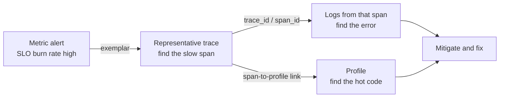
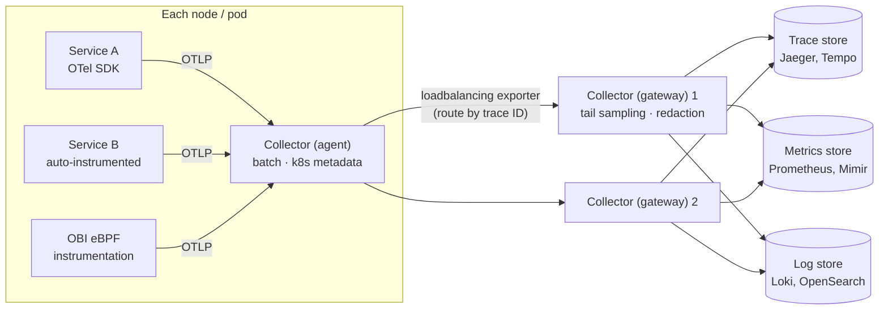
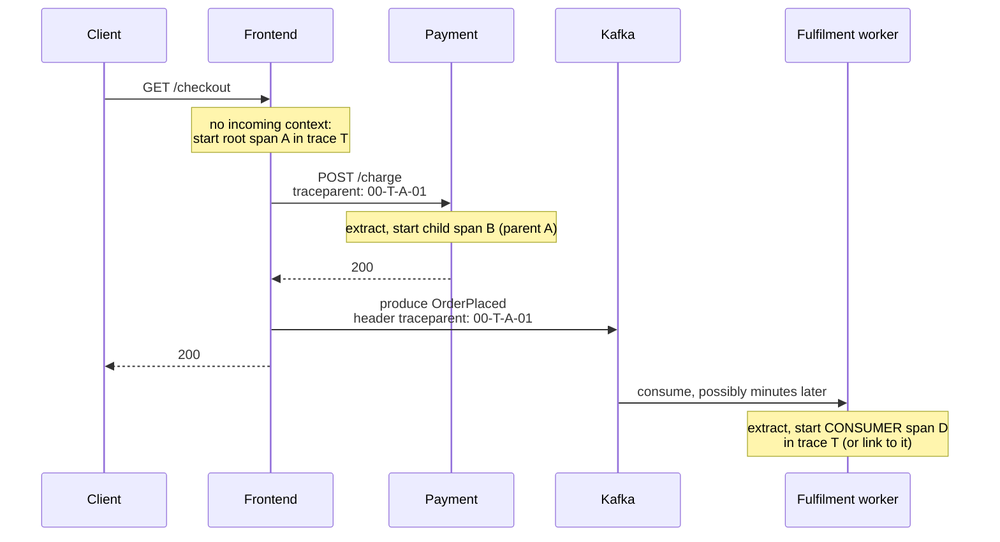
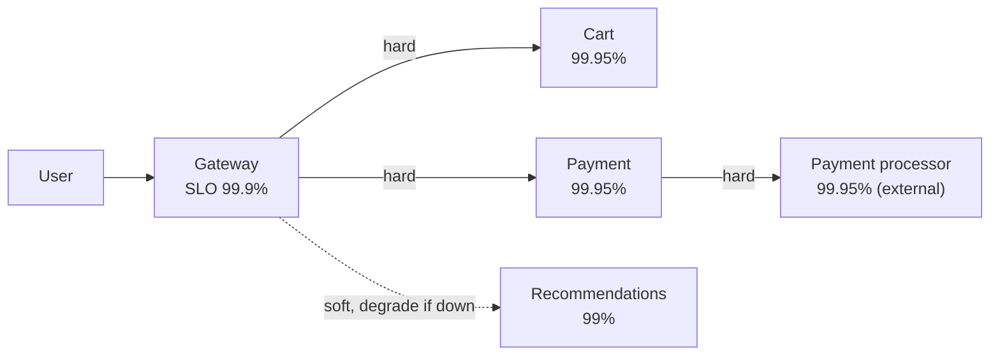

[Distributed Systems Hub](./) &raquo; Observability

In a distributed system a single user request crosses many processes, hosts, and queues, each with its own clock and logs, and the failure is often in the *interaction* between components rather than inside any one of them. This page covers observability from the distributed-systems angle: how request context is propagated across synchronous and asynchronous boundaries, how traces are collected and sampled at scale, how the OpenTelemetry pipeline is structured, how the signals are joined together, and how SLOs and error budgets turn telemetry into reliability decisions across chains of dependent services.

Per-signal depth (PromQL and Alertmanager, log pipelines, tracing backends) is in the [Observability](../observability/) section: [Metrics](../observability/metrics.html), [Logging](../observability/logging.html), and [Tracing](../observability/tracing.html).

## Table of contents
{: .no_toc .text-delta }

1. TOC
{:toc}

---

## Monitoring vs Observability

- **Monitoring** answers questions decided in advance: is the error rate above 1%, is the disk 90% full? It covers failure modes you have already imagined.
- **Observability** is the property of a system that lets you answer *new* questions about its behaviour from the telemetry it already emits, without shipping new code. The term comes from control theory, where a system is observable if its internal state can be reconstructed from its outputs.

Distributed systems need the second, because their failures are emergent: a retry storm, a slow shard, a noisy neighbour, a version skew between two services during a rolling deploy. Nobody writes a dashboard for those in advance.

### The Signals

| Signal | Answers | Cardinality | Cost profile | Maturity in OpenTelemetry |
|--------|---------|-------------|--------------|---------------------------|
| **Traces** | Where did the time go, and where did the error start, for one request across services? | Per request | Sampled; storage-heavy | Stable |
| **Metrics** | How much and how often, aggregated over time? | Low (aggregated series) | Cheap and roughly constant regardless of traffic | Stable |
| **Logs** | Exactly what happened in this event, in full detail? | Very high | Expensive at volume | Stable data model; bridges from existing log libraries |
| **Profiles** | Which functions consumed CPU or memory? | Per stack sample | Low with continuous sampling (often eBPF) | Public alpha since March 2026 |

The signals are complementary. A metric shows *that* p99 latency rose; a trace shows *which* downstream call caused it; that span's logs show *why* (a specific exception or payload); a profile shows *which code* burned the CPU. What lets you move between them for one request is a shared **trace ID**.



## The OpenTelemetry Pipeline

**OpenTelemetry (OTel)** is the CNCF standard for producing and moving telemetry. It is not a backend. It provides:

- **APIs and SDKs** in the major languages, so instrumentation is written once and is independent of the storage backend.
- **Automatic instrumentation**: language agents that instrument common HTTP, gRPC, database, and messaging libraries with no code changes, and **OpenTelemetry eBPF Instrumentation (OBI)**, donated by Grafana Labs from its Beyla project in 2025, which observes HTTP and gRPC traffic from the kernel without touching the process.
- **Semantic conventions**: standard attribute names such as `http.request.method`, `http.response.status_code`, `server.address`, `db.system.name`, and `messaging.system`, so that dashboards and queries work across services written in different languages.
- **OTLP**, the wire protocol, and the **OpenTelemetry Collector**, a standalone process that receives, processes, and exports telemetry.

A production pipeline usually has two tiers of Collectors:



- The **agent** tier runs next to workloads (a DaemonSet or sidecar). It batches data, adds resource attributes such as pod, node, and namespace, and offloads export and retry logic from the application.
- The **gateway** tier is a horizontally scaled pool that does whole-trace work (tail sampling), enforces redaction and filtering policy, and fans out to backends. Changing backends means changing Collector configuration, not application code.

Backends have converged on OTLP. **Jaeger v2** (released November 2024) is built on the OpenTelemetry Collector framework and accepts OTLP natively; Jaeger v1 reached end of life on 31 December 2025. **Prometheus 3** can ingest OTLP metrics directly (enabled with `--web.enable-otlp-receiver`), and Grafana Tempo, Loki, and most commercial vendors accept OTLP as well.

## Distributed Tracing

A **trace** records one request's path through the system as a tree of **spans**. Each span is one unit of work: an HTTP handler, a database query, a message being processed.

### The Span Data Model

| Field | Purpose |
|-------|---------|
| Trace ID (16 bytes) | Shared by every span in the request; the join key for the whole picture |
| Span ID (8 bytes) | Identifies this span |
| Parent span ID | The span that caused this one; empty for the root. Parent links form the tree |
| Name and kind | For example `GET /checkout`; kind is `SERVER`, `CLIENT`, `PRODUCER`, `CONSUMER`, or `INTERNAL` |
| Start time and duration | Measured with the local clock of the host that recorded the span |
| Attributes | Key/value pairs, following semantic conventions where they exist |
| Events | Timestamped annotations within the span, such as a recorded exception |
| Links | References to spans in *other* traces or other branches (used for batching and fan-in) |
| Status | Unset, OK, or Error |

A trace viewer draws the spans as a waterfall, with wall-clock time on the horizontal axis and nesting showing causality:

```
trace_id = 4bf92f3577b34da6a3ce929d0e0e4736
[ frontend  GET /checkout ........................................ 220 ms ]
   [ auth  verify_token ..... 18 ms ]
   [ cart  get_items ........................ 95 ms ]
      [ db  SELECT items .......... 60 ms ]
      [ cache  GET cart:42 .. 5 ms ]
   [ payment  charge ........................... 90 ms ]   <- critical path
      [ psp  POST /charges ................ 82 ms ]
```

The **critical path** is the chain of sequential spans that determines total latency. Optimizing a span that is not on it (for example, one running in parallel that finishes early) does not make the request faster.

Because each span is timed by its own host's clock, **clock skew** between hosts can make a child appear to start before its parent. Keep hosts synchronized with NTP or PTP, and interpret small cross-host offsets with care; some backends apply a skew adjustment when rendering.

## Context Propagation

A trace only exists if every hop passes the trace context along. Within a process, the current span lives in a context object (thread-local or async-local storage). Across a process boundary it must be **injected** into the outgoing request and **extracted** on the receiving side. Any hop that fails to do this splits the trace into disconnected fragments.

### W3C Trace Context

The vendor-neutral format is the W3C Trace Context recommendation, which defines two HTTP headers:

```
traceparent: 00-4bf92f3577b34da6a3ce929d0e0e4736-00f067aa0ba902b7-01
             |  |                                |                |
             |  trace-id (16 bytes, hex)         parent-id        trace-flags
             version                             (8 bytes, hex)   (01 = sampled)

tracestate:  vendorA=opaque,vendorB=opaque      # optional vendor-specific data
```

A third header, `baggage`, defined by the W3C Baggage specification, carries application key/value pairs (for example a tenant ID) to every downstream service. Baggage is sent on every hop and is visible to every service and proxy, so keep it small and never put credentials or personal data in it.



### Propagation in Code

Most HTTP and gRPC client and server libraries propagate context automatically once the OTel instrumentation package for them is installed. Messaging clients often need it done explicitly. The example below propagates context through Kafka record headers with `aiokafka`:

```python
from opentelemetry import trace
from opentelemetry.propagate import inject, extract
from opentelemetry.trace import SpanKind, Link

tracer = trace.get_tracer("order-service")

# Producer: inject the current context into the record headers
async def publish(producer, key: bytes, value: bytes) -> None:
    with tracer.start_as_current_span("order-events publish", kind=SpanKind.PRODUCER) as span:
        span.set_attribute("messaging.system", "kafka")
        span.set_attribute("messaging.destination.name", "order-events")
        carrier: dict[str, str] = {}
        inject(carrier)  # adds traceparent (and tracestate, baggage if set)
        headers = [(k, v.encode()) for k, v in carrier.items()]
        await producer.send_and_wait("order-events", value, key=key, headers=headers)

def context_from(msg):
    return extract({k: v.decode() for k, v in (msg.headers or [])})

# Consumer, one record at a time: continue the producer's trace
async def process_one(msg) -> None:
    with tracer.start_as_current_span(
        "order-events process", context=context_from(msg), kind=SpanKind.CONSUMER
    ):
        await handle(msg)

# Consumer, batch: one span cannot have many parents, so link to each producer
async def process_batch(msgs) -> None:
    links = [Link(trace.get_current_span(context_from(m)).get_span_context()) for m in msgs]
    with tracer.start_as_current_span(
        "order-events process", kind=SpanKind.CONSUMER, links=links
    ):
        for m in msgs:
            await handle(m)
```

Asynchronous hops raise a modelling question: should a consumer that runs hours later really be part of the same trace? For short, request-driven pipelines, a parent-child relationship produces one readable trace. For batch processing, fan-in, and long-delayed work, OpenTelemetry's messaging conventions recommend **span links**, which keep traces bounded while preserving the causal connection.

## Sampling at Scale

Recording every span of every request at high volume is expensive in CPU, network, and storage. **Sampling** keeps a representative subset.

| Strategy | Where the decision is made | Strengths | Weaknesses |
|----------|----------------------------|-----------|------------|
| **Head-based** (e.g. `ParentBased(TraceIdRatioBased(0.01))`) | At the root span, then propagated in `trace-flags` | Cheap; no buffering; downstream services honour the parent's decision | Blind to outcome: most rare errors and slow requests are discarded |
| **Tail-based** (Collector `tail_sampling` processor) | After the whole trace has been collected | Keep 100% of errors and slow traces, a small fraction of the rest | Must buffer spans in memory; all spans of a trace must reach the same Collector |
| **Hybrid** | Generous head sampling, then tail rules | Bounds cost at the source while keeping interesting traces | Two places to configure and reason about |

Tail sampling has an architectural consequence. Because the decision needs the complete trace, spans from many services must converge on **one** gateway Collector per trace. The agent tier does this with the `loadbalancing` exporter, which routes by trace ID (the fan-out shown in the pipeline diagram above). The gateway waits a configured decision period for late spans, so choose it to cover the latency of your slowest normal request.

Sampling also biases metrics derived from traces. Compute request rates, error ratios, and latency percentiles from **metrics**, which see every request, not from sampled spans. Use traces to explain, not to count.

## Metrics for Distributed Services

Metrics are the right basis for dashboards and alerts because their cost does not grow with traffic: a counter is the same size after ten events or ten billion. Two complementary checklists cover most needs; both are developed in [Metrics & Monitoring](../observability/metrics.html#the-red-and-use-methods).

- **RED**, for every request-driven service and endpoint: **R**ate, **E**rrors, **D**uration (as a distribution, never an average).
- **USE**, for every resource (CPU, memory, disk, network, connection pools, thread pools, queues): **U**tilization, **S**aturation, **E**rrors. Saturation (queued work) is the most predictive: a resource at 70% utilization with a growing queue is about to fail.

In a microservice system, RED tells you *which* service is unhealthy, and USE tells you *which resource* inside it is the bottleneck. For consumers of a message broker, add **consumer lag** (how far the group is behind the head of each partition): a queue that grows faster than it drains is the asynchronous equivalent of rising latency.

```promql
# Rate: requests per second per route
sum by (route) (rate(http_requests_total[5m]))

# Errors: fraction of requests returning 5xx
sum by (route) (rate(http_requests_total{status=~"5.."}[5m]))
  / sum by (route) (rate(http_requests_total[5m]))

# Duration: fleet-wide p99, aggregated from histogram buckets across instances
histogram_quantile(0.99,
  sum by (route, le) (rate(http_request_duration_seconds_bucket[5m])))
```

Three details matter more in distributed systems than on a single host:

- **Percentiles do not average.** You cannot average per-instance p99 values to get a fleet p99. Export **histograms** and aggregate the buckets, as the query above does. Prometheus **native histograms** (stable since Prometheus 3.8, enabled per scrape with `scrape_native_histograms`) use exponential buckets chosen automatically, giving much better quantile accuracy in a single series.
- **Tail latency amplifies with fan-out.** If a request calls 100 backends in parallel and waits for all, and each backend is slow 1% of the time, the request is slow with probability $1 - 0.99^{100} \approx 63\%$. Service-level p99 matters because it becomes the median one level up.
- **Cardinality is the main cost driver.** Every unique combination of label values is a separate time series. Never use unbounded values (user ID, raw URL, trace ID) as labels; use route templates and status classes, and put high-cardinality detail in traces and logs. See [Cardinality Pitfalls](../observability/metrics.html#cardinality-pitfalls).

## Structured Logs and Correlation

Free-text logs spread across hundreds of pods are close to useless. Two disciplines make them usable: **structure** (emit JSON or another key/value format so the backend can index and filter by field) and **correlation** (stamp every line with the active trace and span IDs so that a log line can be joined to its trace and vice versa).

The filter below adds service identity and the current OTel trace context to every record. It uses `python-json-logger`, whose formatter moved to `pythonjsonlogger.json` in version 3 (the old `pythonjsonlogger.jsonlogger` import is a deprecated shim):

```python
import logging
from pythonjsonlogger.json import JsonFormatter
from opentelemetry import trace

class TraceContextFilter(logging.Filter):
    """Stamp service identity and the active trace/span IDs on every record."""
    def __init__(self, service: str, instance: str):
        super().__init__()
        self.service, self.instance = service, instance

    def filter(self, record: logging.LogRecord) -> bool:
        record.service = self.service
        record.instance = self.instance
        ctx = trace.get_current_span().get_span_context()
        if ctx.is_valid:
            record.trace_id = format(ctx.trace_id, "032x")   # same hex form the trace UI shows
            record.span_id = format(ctx.span_id, "016x")
        return True

handler = logging.StreamHandler()
handler.setFormatter(JsonFormatter("{asctime}{levelname}{name}{message}", style="{"))
handler.addFilter(TraceContextFilter("order-service", "order-7c9f"))
logging.basicConfig(level=logging.INFO, handlers=[handler])

log = logging.getLogger("order")
log.info("order processed", extra={"order_id": "12345"})
# {"asctime": "...", "levelname": "INFO", "name": "order", "message": "order processed",
#  "service": "order-service", "instance": "order-7c9f",
#  "trace_id": "4bf92f3577b34da6a3ce929d0e0e4736", "span_id": "00f067aa0ba902b7",
#  "order_id": "12345"}
```

Alternatively, the OTel logging instrumentation or a log bridge can attach trace context and export logs over OTLP through the same Collector pipeline as traces and metrics.

Operational rules at scale:

- Sample or rate-limit high-volume debug and info logs; always keep warnings and errors.
- Redact secrets and personal data at the source or in the Collector, never downstream.
- Log structured fields rather than interpolated strings, so the backend can aggregate by field.

Collection pipelines, retention, and PII handling are covered in [Logging](../observability/logging.html).

## SLIs, SLOs, and Error Budgets

Telemetry says what is happening. **Service level objectives** say what "good enough" means, and turn reliability into a quantity that can be managed and traded against feature velocity.

### Definitions

- **SLI (service level indicator)**: a measure of user-visible behaviour, expressed as the ratio of good events to valid events. Example: the fraction of checkout requests that return a non-5xx response in under 300 ms, measured at the load balancer.

$$
\text{SLI} = \frac{\text{good events}}{\text{valid events}}
$$

- **SLO (service level objective)**: a target for an SLI over a window. Example: 99.9% of checkout requests are good over a rolling 28 days. It is an internal goal.
- **SLA (service level agreement)**: a contractual promise with financial consequences. It is set looser than the SLO, so that missing the SLO is an early warning rather than a breach.

Measure SLIs as close to the user as possible (the edge load balancer, gateway, or client), because internal metrics miss failures that happen before a request reaches your service.

### The Error Budget

The error budget is the unreliability the SLO permits:

$$
\text{error budget} = 1 - \text{SLO}, \qquad \text{e.g. } 1 - 0.999 = 0.001
$$

| SLO | Error budget | Allowed full unavailability per 30 days |
|-----|--------------|-----------------------------------------|
| 99% | 1% | 7 h 12 min |
| 99.5% | 0.5% | 3 h 36 min |
| 99.9% | 0.1% | 43 min 12 s |
| 99.95% | 0.05% | 21 min 36 s |
| 99.99% | 0.01% | 4 min 19 s |
| 99.999% | 0.001% | 26 s |

The budget reframes reliability as a resource to spend. While budget remains, the team ships features and takes risks. When it is exhausted, risky changes pause and effort shifts to reliability until it recovers. A service that never spends its budget is probably over-engineered for its SLO, and the unused budget is velocity that was never used.

### SLOs Across Dependency Chains

Availabilities multiply along synchronous chains, so a service cannot be more reliable than the product of its hard dependencies. If a checkout path depends synchronously on four services at 99.95% each, the best achievable availability is about $0.9995^4 \approx 99.8\%$ before counting its own failures. Consequences:

- **Hard dependencies need tighter SLOs than their callers.** A common rule of thumb is roughly an order of magnitude less unreliability (one extra "nine") for critical dependencies.
- **Soft dependencies need graceful degradation.** If recommendations are down, show the page without them. Make optional calls asynchronous, cached, or time-boxed so they do not consume the caller's budget.
- **Retries trade budget for load.** Retrying can hide transient failures from the SLI, but uncoordinated retries across layers multiply load during an incident. Budget retries and apply them at one layer; see [Resilience Patterns](resilience-patterns.html#retries-backoff-and-jitter).



### Burn-Rate Alerting

Alerting whenever the SLI dips below the SLO is both noisy (it fires on brief blips) and slow (it tolerates a steady leak that quietly exhausts the budget). The approach in Google's *Site Reliability Workbook* alerts on the **burn rate**, the rate of budget consumption relative to the rate that would use it up exactly at the end of the SLO window:

$$
\text{burn rate} = \frac{\text{observed error ratio}}{1 - \text{SLO}}, \qquad
\text{budget consumed} = \text{burn rate} \times \frac{\text{alert window}}{\text{SLO window}}
$$

A burn rate of 1 spends the budget exactly over the window. A burn rate of 14.4 sustained for 1 hour spends $14.4 \times 1/720 = 2\%$ of a 30-day budget. The workbook's recommended multi-window, multi-burn-rate set for a 30-day SLO:

| Severity | Long window | Short window | Burn rate | Budget consumed when it fires |
|----------|-------------|--------------|-----------|-------------------------------|
| Page | 1 h | 5 min | 14.4 | 2% |
| Page | 6 h | 30 min | 6 | 5% |
| Ticket | 3 d | 6 h | 1 | 10% |

Each alert requires both windows to exceed the threshold: the long window proves the burn is significant, and the short window proves it is still happening, so the alert resets quickly after recovery. For a 99.9% SLO, the fast-burn page is:

```promql
(
  sum(rate(http_requests_total{job="checkout", status=~"5.."}[1h]))
    / sum(rate(http_requests_total{job="checkout"}[1h]))
  > (14.4 * 0.001)
)
and
(
  sum(rate(http_requests_total{job="checkout", status=~"5.."}[5m]))
    / sum(rate(http_requests_total{job="checkout"}[5m]))
  > (14.4 * 0.001)
)
```

In practice the error ratios are precomputed as Prometheus recording rules, and tools such as Sloth or Pyrra, or the OpenSLO specification, generate the whole rule set from a short SLO definition.

## Putting It Together

A working setup connects everything on this page into one incident loop:

1. **SLIs** are computed from edge **RED metrics**, which see every request.
2. **Burn-rate alerts** page an engineer when the error budget is at risk.
3. An **exemplar** on the latency histogram, or a query for error traces, leads from the metric to a representative **trace**, kept by **tail sampling**.
4. The trace's **critical path** identifies the slow or failing span, even when it sits behind a queue, thanks to **context propagation** through message headers.
5. The span's `trace_id` joins it to its **structured logs**, which show the exception, and to a **profile**, which shows the hot code.
6. **USE metrics** and consumer lag confirm whether an exhausted resource or a backlog is the underlying cause.

The shared trace ID and a consistent OpenTelemetry pipeline make this possible. The SLO decides whether it is worth waking someone up.

## See Also

- [Observability](../observability/): the section hub, with dedicated pages on [Metrics](../observability/metrics.html), [Logging](../observability/logging.html), and [Tracing](../observability/tracing.html)
- [Resilience Patterns](resilience-patterns.html): the mechanisms whose behaviour SLOs and burn rates measure
- [Microservices & Event-Driven](microservices-and-event-driven.html): the synchronous and asynchronous hops that context propagation must cross
- [Testing & Chaos Engineering](testing-distributed-systems.html): using telemetry to verify hypotheses during fault injection
- [Kubernetes](../technology/kubernetes/): where most of these services and Collectors run
- [CI/CD Pipelines](../technology/ci-cd/): gating rollouts on SLOs and burn rates
