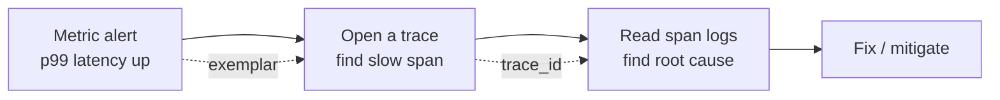
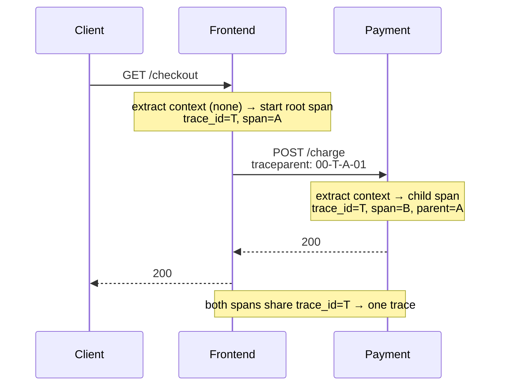

[Distributed Systems Hub](./) &raquo; Observability

Tracing, metrics, structured logs, and SLOs — seeing inside emergent multi-node behavior.

## Why Observability Is a First-Class Concern

In a single-process program you can attach a debugger, set a breakpoint, and read the entire state of the world. In a distributed system that luxury is gone. A single user request fans out across dozens of services, each on a different host, each with its own clock, logs, and failure modes. When something is slow or wrong, no one node holds the answer — the *interaction* between nodes is the bug. You cannot debug what you cannot see, so observability is a design concern, not an afterthought.

It is useful to separate two terms that are often conflated:

- **Monitoring** answers *known* questions you decided to ask in advance: "Is CPU above 90%? Is the error rate above 1%?" You build dashboards and alerts for failure modes you already anticipated.
- **Observability** is the property of a system that lets you ask *new* questions about its behavior — questions you did not anticipate — without shipping new code. It is measured by how well you can explain *any* state the system gets into from its external outputs alone.

Observability rests on three complementary signals, often called the **three pillars**:

| Pillar | Question it answers | Cardinality | Cost profile |
|--------|---------------------|-------------|--------------|
| **Traces** | *Where* did the time go / the error happen, across services, for one request? | High (per-request) | Sampled; storage-heavy |
| **Metrics** | *How much / how often* is happening, aggregated over time? | Low (aggregated) | Cheap, constant-size |
| **Logs** | *What exactly* happened in this event, with full detail? | Very high | Expensive at volume |

They are complementary, not redundant. Metrics tell you *that* the p99 latency spiked; a trace tells you *which* downstream call caused it; the logs on that span tell you *why* (a specific exception, a malformed payload). The connective tissue that lets you pivot between all three for a single request is the **correlation ID** / **trace ID**, discussed throughout this page.



## Distributed Tracing

A **trace** captures the full lifecycle of a single request as it propagates through a distributed system. It is a tree (more precisely a directed acyclic graph) of **spans**, where each span is one unit of work — an HTTP handler, a database query, a call to a downstream service.

### The Span Data Model

Every span carries, at minimum:

- A **trace ID** — a globally unique identifier shared by *every* span in the request. This is the join key that stitches the distributed picture together.
- A **span ID** — unique to this span.
- A **parent span ID** — the span that caused this one (empty for the root span). Parent links are what turn a flat list of spans into a tree.
- A **start time** and **duration**.
- **Attributes** (key/value tags) — `http.method`, `db.statement`, `peer.service`, etc.
- **Events** — timestamped log lines scoped to the span ("cache miss", "retrying").
- A **status** — OK or ERROR.

Visualized, a trace becomes a waterfall (flame graph) where the horizontal axis is wall-clock time and nesting shows the call hierarchy:

```
trace_id = 4bf92f3577b34da6
[ frontend: GET /checkout ........................................ 220ms ]
   [ auth: verify_token ...... 18ms ]
   [ cart: get_items .......................... 95ms ]
       [ db: SELECT items ........... 60ms ]
       [ cache: GET cart:42 .. 5ms ]
   [ payment: charge ........................... 90ms ]   <-- critical path
       [ stripe: POST /charges ............ 82ms ]
```

The **critical path** — the chain of spans whose sum dictates total latency — is what you optimize. A span that runs in parallel and finishes early does not lengthen the request even if it is individually slow.

### Context Propagation

The single hardest part of tracing is **context propagation**: making the trace ID and parent span ID flow from one service to the next, including across process and network boundaries. Within a process this is carried in a thread-local / async-local "current span". Across a network call it must be **injected** into the outgoing request and **extracted** on the receiving side, almost always via headers.

The vendor-neutral standard is **W3C Trace Context**, which defines two HTTP headers:

```
traceparent: 00-4bf92f3577b34da6a3ce929d0e0e4736-00f067aa0ba902b7-01
             │  └── trace-id (16 bytes) ─────┘ └ parent-id (8B) ┘ │
             version                                         trace-flags (01 = sampled)
tracestate:  vendorA=opaque,vendorB=opaque   (per-vendor key/value continuation)
```

For message queues the same IDs are stamped into message headers/metadata so the consumer can continue the trace asynchronously. The golden rule: **propagate context everywhere a request crosses a boundary** — HTTP clients, gRPC, Kafka producers/consumers, background jobs — or the trace breaks into disconnected fragments.



### Sampling

Tracing every request at high volume is expensive in CPU, network, and storage. **Sampling** keeps a representative subset:

- **Head-based sampling** decides at the root span (e.g. keep 1%). Cheap and simple, but you may discard the rare slow/error traces you most want.
- **Tail-based sampling** buffers all spans and decides *after* the trace completes, so you can keep 100% of error traces and slow traces while sampling the boring fast ones. More accurate, but requires a collector that holds spans in memory until the trace finishes.

A common production setup is head-based sampling at a low rate plus tail-based rules that force-keep any trace containing an error or exceeding a latency threshold. The sampling decision itself propagates in the `traceparent` trace-flags so all services in a trace agree to keep or drop it consistently.

### OpenTelemetry and Jaeger

**OpenTelemetry (OTel)** is the CNCF standard that unifies the instrumentation layer. It provides:

- A **vendor-neutral API and SDK** for traces, metrics, and logs, so you instrument once and can switch backends without touching application code.
- The **OTLP** wire protocol and the **OpenTelemetry Collector**, a standalone process that receives, batches, processes, and exports telemetry to one or more backends (Jaeger, Tempo, Prometheus, a vendor SaaS).

**Jaeger** is a popular open-source tracing backend: it ingests spans, stores them, and provides a UI to search by trace ID / service / tags and view the waterfall.

The snippet below — moved and expanded from the hub — wires OpenTelemetry to export spans, and shows nested spans on the critical path:

```python
from opentelemetry import trace
from opentelemetry.sdk.trace import TracerProvider
from opentelemetry.sdk.trace.export import BatchSpanProcessor
from opentelemetry.sdk.resources import Resource
# Modern OTel exports via OTLP to a Collector, which fans out to Jaeger/Tempo/etc.
from opentelemetry.exporter.otlp.proto.grpc.trace_exporter import OTLPSpanExporter

# Identify this service so spans are attributed correctly in the backend
resource = Resource.create({"service.name": "order-service", "service.version": "1.4.0"})
trace.set_tracer_provider(TracerProvider(resource=resource))
tracer = trace.get_tracer(__name__)

# Export spans in batches to the local OTel Collector (which forwards to Jaeger)
otlp_exporter = OTLPSpanExporter(endpoint="http://otel-collector:4317", insecure=True)
trace.get_tracer_provider().add_span_processor(BatchSpanProcessor(otlp_exporter))


async def process_request(request_id):
    # start_as_current_span sets the active span; child spans auto-link as parent→child
    with tracer.start_as_current_span("process_request") as span:
        span.set_attribute("request.id", request_id)

        with tracer.start_as_current_span("validate"):
            await validate_request(request_id)

        with tracer.start_as_current_span("process"):
            result = await process_data(request_id)

        with tracer.start_as_current_span("persist") as persist_span:
            try:
                await save_result(result)
            except Exception as exc:
                # Record the error on the span so it surfaces in the trace UI
                persist_span.record_exception(exc)
                persist_span.set_status(trace.Status(trace.StatusCode.ERROR))
                raise

        return result
```

Cross-service propagation uses OTel's `inject`/`extract` on the W3C headers. Most HTTP and gRPC libraries do this automatically once the OTel instrumentation is installed; the manual form makes the mechanism explicit:

```python
from opentelemetry.propagate import inject, extract

# --- Caller side: inject current context into outgoing headers ---
headers = {}
inject(headers)                       # adds 'traceparent' / 'tracestate'
await http_client.post(url, headers=headers, json=payload)

# --- Callee side: extract context, continue the same trace ---
ctx = extract(incoming_request.headers)
with tracer.start_as_current_span("handle_charge", context=ctx):
    ...
```

## Metrics

Metrics are numeric measurements aggregated over time. Unlike traces and logs, their cost is roughly *constant* regardless of request volume — a counter is the same size whether it counted ten events or ten billion — which makes them the cheapest signal and the right basis for dashboards and alerts.

### Metric Types

| Type | Semantics | Example |
|------|-----------|---------|
| **Counter** | Monotonically increasing total; you query its *rate* | `http_requests_total` |
| **Gauge** | A value that goes up and down; sampled instantaneously | `active_connections`, `queue_depth` |
| **Histogram** | Bucketed distribution; lets you compute quantiles (p50/p99) | `http_request_duration_seconds` |
| **Summary** | Client-side computed quantiles (cannot be aggregated across instances) | request latency per instance |

A subtle but critical point: **average latency lies**. If 99 requests take 10ms and one takes 5s, the mean (~60ms) hides the disaster. Always alert on **tail percentiles** (p95, p99, p99.9), which histograms make possible by bucketing durations and letting the backend interpolate quantiles across all instances.

Beware **cardinality**: every unique combination of label values is a separate time series. Putting an unbounded value (user ID, full URL with IDs, trace ID) in a metric label can explode memory and bankrupt your metrics backend. Keep labels low-cardinality (method, route *template*, status class) and push high-cardinality detail into traces and logs instead.

### Instrumenting Metrics (Prometheus)

This middleware — moved and expanded from the hub — emits the three core HTTP metrics. Note that `request_duration` is a **histogram** (so we get percentiles), `request_count` is a **counter**, and `active_connections` is a **gauge**:

```python
from prometheus_client import Counter, Histogram, Gauge
import time

# Counter: total requests, labelled by method/route/status class
request_count = Counter(
    "http_requests_total", "Total HTTP requests",
    ["method", "route", "status"],
)
# Histogram: request duration with explicit buckets tuned to SLO thresholds
request_duration = Histogram(
    "http_request_duration_seconds", "HTTP request duration",
    ["method", "route"],
    buckets=(0.005, 0.01, 0.025, 0.05, 0.1, 0.25, 0.5, 1, 2.5, 5),
)
# Gauge: in-flight requests (saturation signal)
active_connections = Gauge("active_connections", "In-flight HTTP requests")


async def metrics_middleware(request, handler):
    start = time.perf_counter()
    active_connections.inc()
    status = "5xx"  # default so we record errors even if the handler raises
    try:
        response = await handler(request)
        status = f"{response.status // 100}xx"
        return response
    finally:
        # Use the ROUTE TEMPLATE (/orders/{id}), never the raw path, to bound cardinality
        route = request.match_info.route.resource.canonical
        request_count.labels(request.method, route, status).inc()
        request_duration.labels(request.method, route).observe(time.perf_counter() - start)
        active_connections.dec()
```

### The RED Method (request-driven services)

For any **request-driven** service (an API, a web server, an RPC handler), the **RED method** prescribes exactly three metrics to track per endpoint:

- **R**ate — requests per second.
- **E**rrors — failed requests per second (or as a fraction of rate).
- **D**uration — the distribution of request latencies (track percentiles, not averages).

RED is *workload-centric*: it describes what your users experience. The three metrics emitted by the middleware above are precisely RED. A typical PromQL dashboard:

```promql
# Rate: requests/sec per route
sum by (route) (rate(http_requests_total[5m]))

# Errors: fraction of requests that are 5xx
sum by (route) (rate(http_requests_total{status="5xx"}[5m]))
  / sum by (route) (rate(http_requests_total[5m]))

# Duration: p99 latency, computed across all instances from the histogram
histogram_quantile(0.99,
  sum by (route, le) (rate(http_request_duration_seconds_bucket[5m])))
```

### The USE Method (resources)

Where RED watches *requests*, the **USE method** watches *resources* — CPUs, disks, memory, network links, connection pools, thread pools. For every resource track:

- **U**tilization — the fraction of time the resource was busy (or fraction of capacity used).
- **S**aturation — the degree to which work is queued waiting for the resource (run-queue length, queue depth, swap).
- **E**rrors — error events from the resource (disk I/O errors, dropped packets, pool-exhaustion rejections).

USE is *resource-centric*: it finds the bottleneck. The two methods are complementary — RED tells you a service is slow; USE tells you *which exhausted resource* is making it slow. Saturation is the most predictive signal: a resource at 70% utilization with a growing queue is about to fall over even though it is "not yet full."

| Resource | Utilization | Saturation | Errors |
|----------|-------------|------------|--------|
| CPU | `% busy` | run-queue length | (n/a) |
| Memory | `% used` | swap rate, OOM kills | alloc failures |
| Disk | `% I/O time` | I/O queue depth | I/O errors |
| Network | `bytes/s ÷ link capacity` | dropped/retransmitted packets | NIC errors |
| Conn pool | `in-use ÷ size` | waiters blocked on checkout | checkout timeouts |

## Structured Logging and Correlation IDs

Logs are the highest-fidelity, highest-cost signal: a record of discrete events with arbitrary detail. In a distributed system, **unstructured free-text logs are nearly useless** — you cannot reliably grep across machines, filter by field, or join a request's journey. The fix is two disciplines: structure and correlation.

### Structured (JSON) Logging

Emit logs as machine-parseable key/value records (typically JSON) rather than prose. This lets your log backend (ELK/OpenSearch, Loki, a SaaS) index fields and run queries like `service="payment" AND status="error" AND latency_ms>500`.

### Correlation IDs

A **correlation ID** (often the trace ID itself, sometimes a separate `request_id`) is a single identifier attached to *every* log line emitted while handling one request, across *every* service it touches. It is what turns scattered logs into a coherent story: given one ID, you retrieve the complete, ordered narrative of a request no matter how many hosts it crossed. The ID is propagated by exactly the same mechanism as trace context (headers in, async-local storage within a process, headers out).

The crucial integration: **emit the active trace and span IDs on every log line.** Once your logs carry `trace_id`, you can pivot directly from a slow span in Jaeger to every log line that span produced, and from an error log back to the full trace — the three pillars become one navigable surface.

This logger — moved and expanded from the hub — auto-injects service identity and the *current* trace/span IDs from the active OpenTelemetry context, so callers never have to thread IDs by hand:

```python
import logging, time
from pythonjsonlogger import jsonlogger
from opentelemetry import trace

# Emit JSON so the log backend can index every field
handler = logging.StreamHandler()
handler.setFormatter(jsonlogger.JsonFormatter())
root = logging.getLogger()
root.addHandler(handler)
root.setLevel(logging.INFO)


class TraceContextFilter(logging.Filter):
    """Stamp the active trace_id/span_id onto every record automatically."""
    def __init__(self, service_name, node_id):
        super().__init__()
        self.service_name = service_name
        self.node_id = node_id

    def filter(self, record):
        record.service = self.service_name
        record.node_id = self.node_id
        ctx = trace.get_current_span().get_span_context()
        if ctx.is_valid:
            # 32-/16-hex-char IDs that match exactly what Jaeger shows
            record.trace_id = format(ctx.trace_id, "032x")
            record.span_id = format(ctx.span_id, "016x")
        return True


handler.addFilter(TraceContextFilter("order-service", "node-1"))
log = logging.getLogger("order")

# Usage: structured fields, correlation IDs added automatically
log.info("Order processed", extra={"order_id": "12345", "user_id": "user-789"})
# -> {"message": "Order processed", "service": "order-service", "node_id": "node-1",
#     "trace_id": "4bf92f3577b34da6a3ce929d0e0e4736", "span_id": "00f067aa0ba902b7",
#     "order_id": "12345", "user_id": "user-789", ...}
```

Operational guidance for logs at scale:

- **Sample or rate-limit** high-volume info/debug logs; always keep errors.
- **Never log secrets or PII** — tokens, passwords, full card numbers. Redact at the logging layer.
- **Use leveled logging** (DEBUG/INFO/WARN/ERROR) and ship structured fields, not interpolated strings, so the backend can aggregate by field.

## SLIs, SLOs, and Error Budgets

Metrics and traces tell you *what is happening*; **SLOs** tell you *what good enough means* and turn reliability into a number you can manage against. This is the language of Site Reliability Engineering.

### Definitions

- **SLI — Service Level Indicator:** a carefully chosen quantitative measure of the service's behavior, expressed as a ratio of good events to total events. Example: *the fraction of HTTP requests that return non-5xx in under 300ms*. Good SLIs measure what the *user* experiences (success and latency at the edge), not internal proxies like CPU.

$$
\text{SLI} = \frac{\text{good events}}{\text{total valid events}}
$$

- **SLO — Service Level Objective:** the target value for an SLI over a rolling window. Example: *99.9% of requests succeed under 300ms, measured over 28 days*. The SLO is an internal goal, deliberately set somewhat tighter than what you promise customers.

- **SLA — Service Level Agreement:** a *contractual* promise to customers with financial or legal consequences if breached. The SLA is looser than the SLO so that crossing the SLO is an early warning, not yet a contract breach.

### The Error Budget

The most useful consequence of an SLO is the **error budget**: the amount of unreliability you are *allowed* before breaching the objective. If the SLO is 99.9% over 28 days, the budget is the remaining 0.1%:

$$
\text{Error budget} = 1 - \text{SLO} = 1 - 0.999 = 0.001
$$

Translated to allowed downtime/failures, "number of nines" maps to concrete time per period:

| SLO (availability) | Error budget | Allowed unavailability / 30 days |
|--------------------|--------------|----------------------------------|
| 99% (two nines) | 1% | ~7h 18m |
| 99.9% (three nines) | 0.1% | ~43m 12s |
| 99.95% | 0.05% | ~21m 36s |
| 99.99% (four nines) | 0.01% | ~4m 19s |
| 99.999% (five nines) | 0.001% | ~26s |

The error budget reframes reliability as a *resource to spend*, resolving the eternal tension between feature velocity and stability:

- **Budget remaining** → ship features, take risks, deploy faster. Reliability is "good enough"; spending the budget on velocity is rational.
- **Budget exhausted** → freeze risky changes, redirect effort to reliability until the budget recovers.

This makes the dev-vs-ops conflict a data-driven decision instead of an argument. A service that *never* spends its budget is over-engineered for its SLO — that surplus reliability is wasted velocity.

### Burn-Rate Alerting

The naive alert "fire when the SLI dips below the SLO" is bad: it is noisy on brief blips and slow on slow bleeds. The SRE-standard approach alerts on the **burn rate** — how fast you are consuming the error budget relative to the rate that would exhaust it exactly at the window's end. A burn rate of 1 spends the whole budget precisely over the SLO window; a burn rate of 14.4 spends it in ~2% of the window.

Use **multi-window, multi-burn-rate** alerts: a *fast* page on a high burn rate over a short window (catches outages quickly) combined with a *slow* ticket on a moderate burn rate over a long window (catches gradual erosion), each confirmed by a shorter sub-window to suppress flapping.

```promql
# Fast burn: consuming budget 14.4x too fast over 1h (with a 5m confirmation window)
# fires when ~2% of a 30d budget is spent in 1h → page immediately
(
  sum(rate(http_requests_total{status="5xx"}[1h]))
    / sum(rate(http_requests_total[1h]))            > (14.4 * 0.001)
)
and
(
  sum(rate(http_requests_total{status="5xx"}[5m]))
    / sum(rate(http_requests_total[5m]))            > (14.4 * 0.001)
)
```

### Putting It Together

A mature observability setup connects all four topics on this page into one loop:

1. **SLIs** are computed from **RED metrics** (success ratio and latency at the edge).
2. **Burn-rate alerts** on the SLO budget page an engineer when reliability is at risk.
3. The engineer pivots from the alerting **metric** to a representative **trace** (via exemplars or by querying error traces in Jaeger).
4. The slow/failing **span** links to the **structured logs** it produced (joined by `trace_id`), revealing the root cause.
5. **USE metrics** confirm whether an exhausted resource is the underlying bottleneck.

That pivot — metric → trace → log, anchored by a shared trace ID and governed by an SLO — is the whole point of observability.

## See Also

- **[Distributed Systems Hub](./)** — architecture patterns, consensus, and consistency models
- **[Distributed Systems Theory](../advanced/distributed-systems-theory/)** — formal foundations behind the failures observability surfaces
- **[Kubernetes](../technology/kubernetes/)** — where most of these services run; native metrics and health probes
- **[Networking](../technology/networking/)** — the latency and failure modes traces and the USE method expose
- **[Database Design](../technology/database-design/)** — instrumenting and tracing data-tier calls
- **[CI/CD Pipelines](../technology/ci-cd/)** — wiring SLO gates and burn-rate checks into deployment
