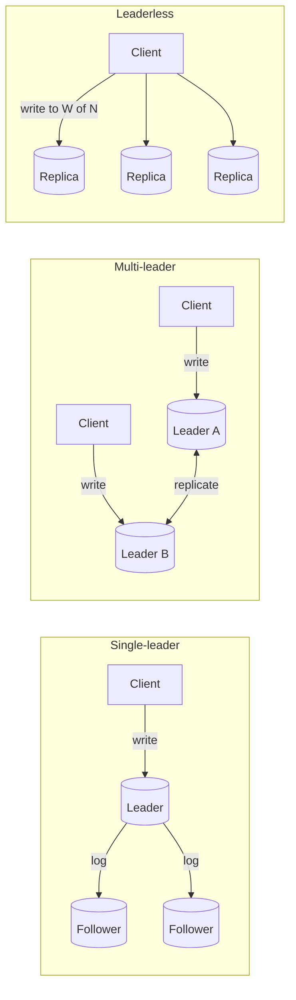
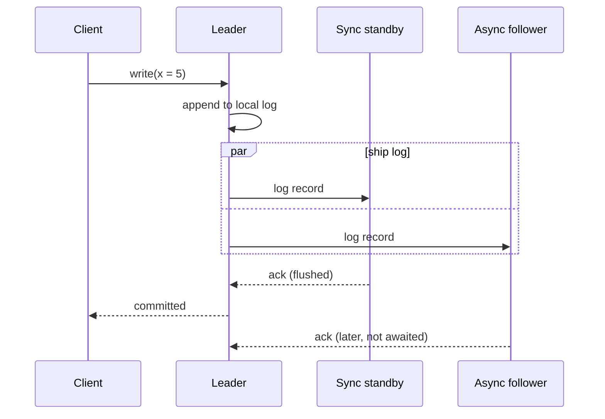
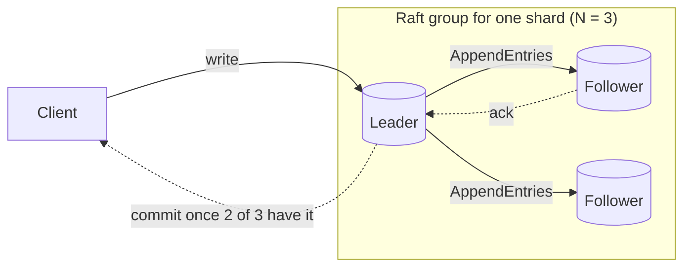
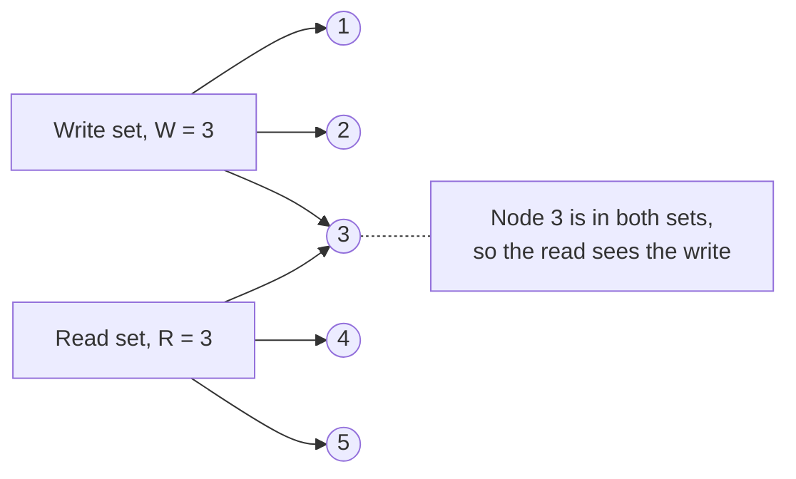
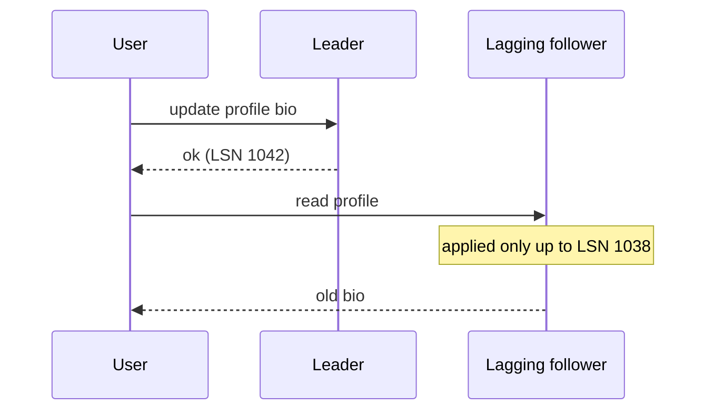
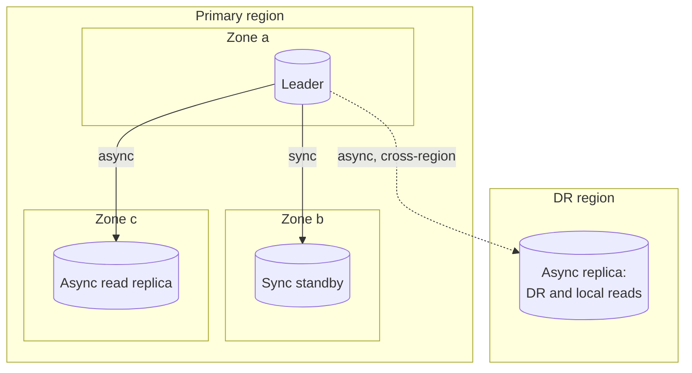
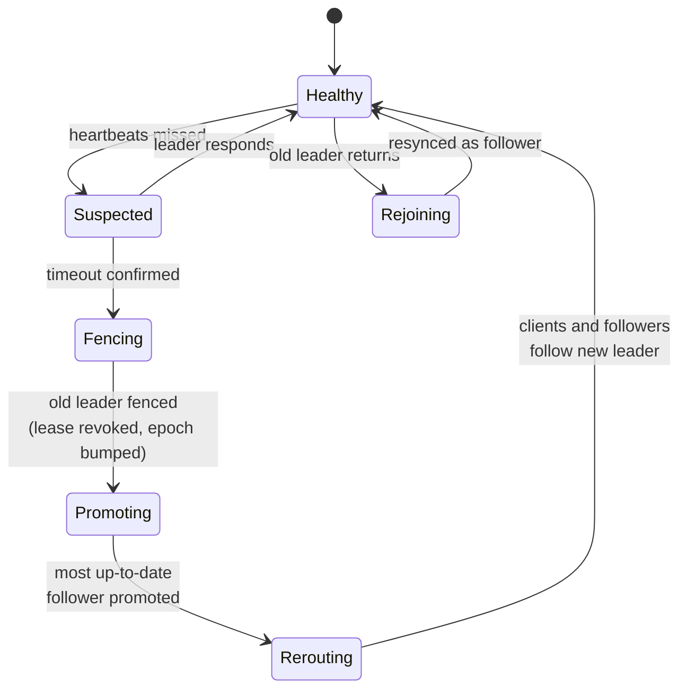
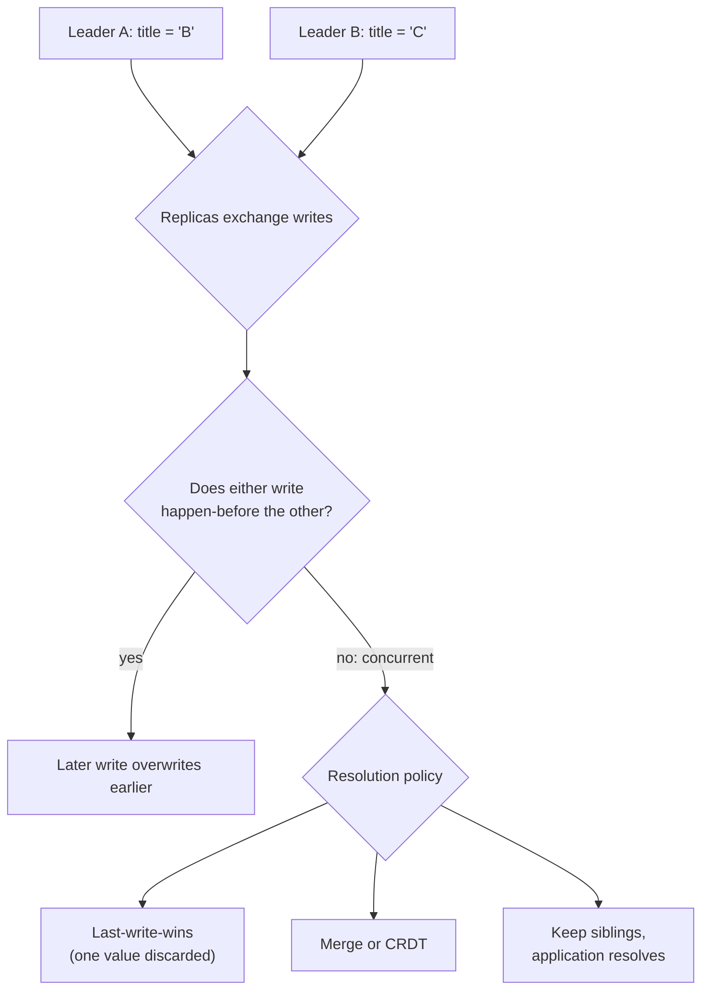
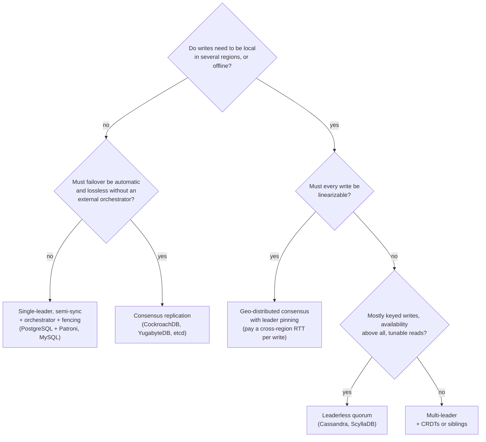

[Distributed Systems](./) &raquo; Replication Strategies

**Replication** keeps a copy of the same data on several machines. Systems replicate for availability (surviving the loss of a node or a zone), for latency (serving reads from a copy near the user), and for read throughput (spreading reads across copies). Making copies is easy. The difficulty is keeping them consistent while writes keep arriving and machines keep failing. This page covers the main replication architectures, the quorum arithmetic behind tunable consistency, failover and fencing, how to measure replication lag, and how systems that accept concurrent writes resolve conflicts.

Four ideas run through the rest of the page:

- **One writer is simplest.** Single-leader replication avoids write conflicts because one node orders every write. The leader is then a throughput bottleneck and a failover hazard.
- **Overlapping quorums bound staleness.** If read and write quorums must intersect ($R + W > N$), every read contacts at least one replica that holds the latest acknowledged write.
- **Asynchronous replicas always trail.** The question is how far behind they are and whether clients can observe it.
- **More than one writer means conflicts.** Once two nodes can accept writes to the same key, the system needs a defined rule for concurrent updates.

## Goals and Trade-offs

The reasons to replicate pull in different directions, so it helps to know which one dominates before picking a design.

| Goal | What it requires | What it costs |
|------|------------------|---------------|
| High availability | Copies in independent failure domains; automatic failover | Failover complexity; split-brain risk |
| Low read latency | A replica near each user population | Staleness; cross-region write latency |
| Read scaling | Many copies to absorb reads | More lag to manage; more copies to keep healthy |
| Disaster recovery | A durable copy in another region | Asynchronous replication, so a small loss window (RPO greater than 0) |

A replica that is never stale would need synchronous replication to every copy on every write. Writes would then run at the speed of the slowest replica and would stop whenever any replica was down. Real systems therefore replicate asynchronously or to a quorum, and most of this page deals with the resulting staleness.

Replication is separate from **partitioning** (sharding), which spreads *different* data across nodes for capacity. The two are combined in practice: each shard is replicated independently. See [Database Design](../technology/database-design/) for partitioning, and [Replication & Consensus](../technology/database-design/replication-and-consensus.html) for a database-operator view of the same material.

## Replication Architectures

Replication schemes differ mainly in which nodes may accept writes and how a write becomes durable.



| Architecture | Who accepts writes | Write conflicts | Failover | Typical systems |
|--------------|-------------------|-----------------|----------|-----------------|
| Single-leader, async/semi-sync | One leader | None | External orchestrator promotes a follower | PostgreSQL streaming replication, MySQL, SQL Server, Redis/Valkey, Kafka partitions (ISR) |
| Single-leader, consensus (Raft/Paxos) | One elected leader per group | None | Built into the protocol | etcd, CockroachDB, TiKV, YugabyteDB, Spanner, MongoDB replica sets, Kafka's KRaft metadata quorum |
| Multi-leader | One leader per region or device | Yes | Not needed for writes; each site keeps writing | MySQL/PostgreSQL bidirectional logical replication, CouchDB, offline-first apps |
| Leaderless (Dynamo-style) | Any replica | Yes | Not needed; live replicas keep serving | Cassandra, ScyllaDB, Riak |

### Single-Leader Replication

One node, the **leader** (primary), accepts all writes. It applies each write locally and sends the change to its **followers** (replicas, standbys) through a **replication log**. Followers apply the changes in log order and can serve reads. Because the leader imposes one total order on writes, followers never disagree about the order of updates. They can only be behind.

The main design choice is when a write counts as committed relative to follower acknowledgements.

| Mode | Leader waits for | Leader crash loses | Cost |
|------|------------------|--------------------|------|
| Asynchronous | Nothing | Writes not yet shipped | Fastest; a loss window on failover |
| Synchronous (one standby) | That standby's ack | Nothing, if the standby survives | Writes stall if the standby is slow or down |
| Quorum commit | Any $k$ of the standbys | Nothing, if one of the $k$ survives | One slow standby no longer stalls writes |
| Majority (consensus) | A majority of the group | Nothing while a majority survives | One majority round-trip per commit |

Waiting for *every* follower is impractical, because any slow follower stalls every write. Production systems wait for one designated standby, for any $k$ of a set, or for a majority:

- **PostgreSQL** sets this with `synchronous_standby_names`. `FIRST 1 (a, b)` waits for the highest-priority available standby, and `ANY 2 (a, b, c)` waits for any two (quorum commit). `synchronous_commit` then selects how far along each standby must be: `remote_write`, `on` (flushed to disk), or `remote_apply` (visible to queries).
- **MySQL** semi-synchronous replication waits for `rpl_semi_sync_source_wait_for_replica_count` replicas to acknowledge receipt. Group Replication (InnoDB Cluster) uses a Paxos-derived protocol instead.
- **Kafka** tracks an **in-sync replica set (ISR)** per partition. A producer using `acks=all` is acknowledged once every ISR member has the record, and `min.insync.replicas` makes the leader refuse writes when the ISR shrinks below that floor. Kafka 4.0 removed ZooKeeper in favor of the Raft-based KRaft controller. Kafka 4.1 enables **Eligible Leader Replicas** (KIP-966) by default on new clusters: the controller tracks replicas that have fallen out of the ISR but are still known to hold every committed record, so a leader can be elected from them without data loss.



#### What the Replication Log Carries

| Log format | What ships | Strengths | Weaknesses | Examples |
|------------|-----------|-----------|------------|----------|
| Statement-based | SQL statements | Compact | Breaks on nondeterminism (`NOW()`, `RAND()`, triggers) | Old MySQL default; largely abandoned |
| Physical (WAL shipping) | Storage-engine page changes | Exact byte-for-byte copy; cheap to apply | Same major version and architecture on both ends; entire cluster only | PostgreSQL streaming replication |
| Logical (row-based) | Row-level changes per table | Crosses versions (enables upgrades); selective; feeds **change data capture** | More CPU; DDL often not replicated | MySQL row-based binlog, PostgreSQL logical replication, Debezium |
| Trigger-based | Rows written by triggers into a change table | Arbitrary filtering and transformation | Slow; fragile | Legacy tools such as Slony |

Logical replication has absorbed most of the special cases. It is how zero-downtime major-version upgrades, cross-database migrations, and CDC pipelines work. PostgreSQL 17 added **failover slots**: with `sync_replication_slots` on a physical standby and `failover = true` on the subscription, logical replication slots are synchronized to the standby, so CDC consumers survive a primary failover without a full resync. PostgreSQL 17 also added `pg_createsubscriber`, which converts a physical standby into a logical subscriber without recopying the data.

#### Adding a Follower Without Downtime

1. Take a consistent snapshot of the leader at a known log position without blocking writes (PostgreSQL `pg_basebackup`, MySQL `CLONE` or Percona XtraBackup).
2. Restore the snapshot on the new node.
3. Stream every change since the snapshot's log position (the PostgreSQL **LSN**, MySQL **GTID** set, or Kafka offset).
4. Once the backlog is applied, the follower is caught up and continues streaming live changes.

### Consensus-Based Replication

Many modern databases keep the single-leader shape but replace the external failover machinery with a consensus protocol. Each shard (a "range" in CockroachDB, a "region" in TiKV, a "tablet" in YugabyteDB) is a Raft or Paxos group of usually three or five replicas. The leader appends each write to the replicated log and commits it once a **majority** has persisted it. Leader election is part of the protocol, so failover needs no orchestrator and can never produce two leaders in the same term.



The trade-offs:

- **Consistency:** writes are linearizable, and reads can be too when served by the leader under a lease or through a read-index round.
- **Availability:** a group of $2f + 1$ replicas tolerates $f$ failures. A minority partition cannot write.
- **Latency:** every commit costs one round-trip to the nearest majority. With replicas in three regions, that is a cross-region round-trip per write. This is why such databases let you pin leaders (leaseholders) near the users who write most.
- **Scale:** each shard has its own leader, so write throughput scales with the number of shards even though any single key has one writer.

Raft and Paxos themselves are covered in [Consensus and Coordination](consensus-and-coordination.html).

### Multi-Leader Replication

Several nodes accept writes and replicate them to one another. Each leader is also a follower of the others. Typical reasons:

- **Multi-region writes.** A leader in each region keeps writes local and lets each region keep accepting writes when another is down.
- **Offline clients.** Every device is effectively a leader that syncs later. A calendar app on a plane is the standard example. See [Client-Side Consistency](client-side-consistency.html).
- **Collaborative editing.** Each user's edits apply locally first and propagate afterward.

The cost is **write conflicts**. Two leaders can modify the same record concurrently, and nothing orders the two writes. Conflict handling (see [below](#conflict-handling)) must be designed in from the start, which is why multi-leader replication is used only where one of these needs is real.

The replication topology also matters. In **ring** and **star** topologies, one failed node can break propagation for the others. **All-to-all** topologies avoid that, but writes can arrive out of causal order when links have different latencies: an update can reach a node before the insert it modifies. Version vectors (below) detect this. Wall-clock timestamps do not.

### Leaderless Replication

There is no leader. The client, or a coordinator node acting for it, sends each write to all $N$ replicas of a key and each read to several of them, and uses **quorums** to decide success. This design comes from Amazon's 2007 Dynamo paper and is used by Cassandra, ScyllaDB, and Riak. (The managed DynamoDB service uses a different, Paxos-based design internally despite the name.)

There is no failover. When a replica dies the others keep serving, which makes leaderless stores highly available for writes. In exchange, consistency is reassembled at read time, and concurrent writes to the same key can conflict.

## Quorum Reads and Writes

Let $N$ be the number of replicas that store a key. A write is sent to all $N$ and reported successful once $W$ have acknowledged it. A read queries replicas until $R$ have responded and returns the newest version among them. The central condition is:

$$
R + W > N
$$

When it holds, any set of $R$ replicas and any set of $W$ replicas must share at least one node (pigeonhole principle). Every read therefore reaches at least one replica that acknowledged the latest successful write, and version metadata lets the coordinator recognize that value as the newest.



The number of unavailable replicas each path can tolerate follows from the same arithmetic. Reads succeed while $N - R$ or fewer replicas are down, and writes succeed while $N - W$ or fewer are down.

| N | W | R | $R + W > N$? | Write survives | Read survives | Character |
|---|---|---|------------|----------------|---------------|-----------|
| 3 | 2 | 2 | yes | 1 down | 1 down | Balanced; the common default |
| 3 | 3 | 1 | yes | 0 down | 2 down | Fast reads, fragile writes |
| 3 | 1 | 3 | yes | 2 down | 0 down | Fast writes, fragile reads |
| 5 | 3 | 3 | yes | 2 down | 2 down | Survives two failures on both paths |
| 3 | 1 | 1 | **no** | 2 down | 2 down | Eventual consistency; lowest latency |

The coordinator waits only for the fastest $W$ or $R$ responses, so a larger $N$ with the same quorum sizes also hides slow replicas and cuts tail latency.

Cassandra and ScyllaDB expose the dial per request as a **consistency level**:

| Level | Replicas that must respond | Use |
|-------|---------------------------|-----|
| `ONE`, `LOCAL_ONE` | 1 (in the local DC for `LOCAL_ONE`) | Lowest latency, weakest guarantee |
| `QUORUM` | Majority of all replicas across DCs | Strong reads and writes in a single-DC cluster |
| `LOCAL_QUORUM` | Majority in the coordinator's DC | Usual multi-DC choice: strong within the region, no cross-region wait |
| `EACH_QUORUM` (writes) | Majority in every DC | Writes that must be durable in every region before returning |
| `ALL` | Every replica | Rarely justified; any one failure blocks the request |

### Why Quorums Are Not Linearizable

$R + W > N$ is weaker than it looks. Several cases break it:

- **Sloppy quorums.** When some of a key's home replicas are unreachable, Dynamo and Riak can accept the write on other nodes and hand it back later (**hinted handoff**). Until then, the read and write sets need not overlap. Cassandra stores hints too, but hints do not count toward the consistency level except for the explicit `ANY` level.
- **Concurrent writes.** Two writes to the same key can land in different orders on different replicas. Without a conflict rule, "the newest value" is undefined.
- **Partial writes.** A write that reaches fewer than $W$ replicas is reported as failed but is not rolled back where it did land. Later reads may or may not return it.
- **Restores from stale copies.** If a replica holding the new value fails and is rebuilt from an older one, the number of replicas holding the new value can drop below $W$.
- **Read-then-write races.** Even with quorums on both paths, a reader can see a new value and a later reader can see the old one while the write is still propagating. Making that impossible requires read repair to complete before the read returns (Cassandra's blocking read repair does this), and even then sequences of operations are not linearizable.

Quorums provide good staleness bounds and high availability, not linearizability. For linearizable reads and writes, use a [consensus-backed system](consensus-and-coordination.html). Cassandra offers lightweight transactions (Paxos-based compare-and-set) for single-partition cases. Cassandra 6.0, still in alpha in September 2026, adds **Accord**, a leaderless consensus protocol for multi-partition strict-serializable transactions.

### Anti-Entropy

Leaderless stores use two background mechanisms to bring divergent replicas back together:

- **Read repair.** When a read sees a replica return an older version, the coordinator writes the newer one back to it. Frequently read keys get fixed this way. Keys that are rarely read do not. Cassandra 4.0 removed the probabilistic background read repair setting (`read_repair_chance`) and kept blocking read repair on quorum reads.
- **Merkle-tree repair.** Replicas exchange hash trees over their key ranges, skip subtrees whose hashes match, and recurse only into ranges that differ, so the data transferred is proportional to the divergence rather than the dataset. Cassandra runs this as `nodetool repair`, usually incrementally and on a schedule shorter than `gc_grace_seconds` so that deleted data cannot come back. [Failure Detection](failure-detection.html#anti-entropy-and-merkle-trees) walks through the tree comparison.

```python
# Sketch of a leaderless quorum coordinator with read repair.
# Replica clients are assumed to expose store(key, value, version) and
# fetch(key) -> (value, version), raising ReplicaUnavailable on failure.

class QuorumStore:
    def __init__(self, replicas, w, r):
        self.replicas = replicas               # the N replicas that own this key
        self.N, self.W, self.R = len(replicas), w, r
        assert self.R + self.W > self.N, "quorums must overlap"

    def put(self, key, value, version):
        # version: from a logical clock or version vector, not time.time()
        acks = 0
        for replica in self.replicas:          # real systems send in parallel
            try:
                replica.store(key, value, version)
                acks += 1
            except ReplicaUnavailable:
                continue
        if acks < self.W:
            raise QuorumNotReached(f"{acks}/{self.W} write acks")

    def get(self, key):
        responses = []                          # (value, version, replica)
        for replica in self.replicas:
            try:
                value, version = replica.fetch(key)
                responses.append((value, version, replica))
            except ReplicaUnavailable:
                continue
            if len(responses) == self.R:
                break
        if len(responses) < self.R:
            raise QuorumNotReached(f"{len(responses)}/{self.R} read acks")

        value, newest, _ = max(responses, key=lambda t: t[1])
        for _, version, replica in responses:
            if version < newest:
                replica.store(key, value, newest)   # read repair
        return value
```

## Session Guarantees

With asynchronous followers, a client can write to the leader and then read from a follower that has not applied the write yet. From the user's point of view the edit has vanished. Full linearizability everywhere is expensive, so systems offer cheaper **session guarantees** (client-centric consistency) that remove the anomalies users notice.



| Guarantee | Promise to one session | Anomaly prevented |
|-----------|------------------------|-------------------|
| Read-your-writes | You see your own completed writes | A posted comment disappears on refresh |
| Monotonic reads | Successive reads never go back in time | Data appears, then disappears on the next refresh |
| Consistent prefix | You never see an effect before its cause | An answer shown before its question |
| Writes-follow-reads | Your writes are ordered after writes you have read | A reply to a comment that other replicas do not have yet |

Common implementations, cheapest first:

- **Route by recency.** Read a user's own recently modified data from the leader and everything else from followers.
- **Carry a position token.** The session remembers the LSN, GTID, or version vector of its last write and reads only from replicas that have applied at least that position, falling back to the leader otherwise. MongoDB's causally consistent sessions and CockroachDB's follower reads are built-in forms of this.
- **Stick to one replica.** Pinning a session to one replica gives monotonic reads. If that replica fails, the session must move to a replica that is at least as far ahead.

These guarantees apply to one session only and say nothing about what other clients observe. That is what makes them cheap. [Client-Side Consistency](client-side-consistency.html#session-guarantees) covers enforcement with version vectors, and [Consensus and Coordination](consensus-and-coordination.html#consistency-models) places them in the consistency hierarchy.

```python
# Read-your-writes by tracking the session's last-write LSN.
class Session:
    def __init__(self, leader, followers):
        self.leader, self.followers = leader, followers
        self.last_write_lsn = 0

    def write(self, key, value):
        self.last_write_lsn = self.leader.write(key, value)  # leader returns commit LSN

    def read(self, key):
        for f in self.followers:
            if f.replay_lsn() >= self.last_write_lsn:
                return f.read(key)
        return self.leader.read(key)   # no follower has caught up yet
```

## Replica Placement

Where the copies live determines which failures the system survives and what latency users see. Put replicas in **independent failure domains** and weigh that against the latency cost of distance.

| Domain | Survives | Replication latency | Typical use |
|--------|----------|---------------------|-------------|
| Different hosts and racks | Host, top-of-rack switch, or power-feed failure | Tens of microseconds | Minimum for any replicated store (HDFS rack awareness, Kubernetes topology spread) |
| Availability zones in one region | Loss of a datacenter | Usually around 1 ms or less; a few ms at most | Synchronous or quorum replication |
| Regions | Loss of a whole region | Tens to hundreds of ms | Async disaster-recovery copies, local reads, or multi-leader/consensus with leader pinning |

Quorum systems should also make the quorum span failure domains. With three replicas in three zones and $W = 2$, losing one zone leaves every key writable and readable. Cassandra's `NetworkTopologyStrategy` places replicas by rack and DC for this reason.



The layout shown is a common single-leader production setup: a leader and a synchronous standby in two zones (a zone failure loses no data), an asynchronous replica in a third zone for read scaling, and an asynchronous replica in a second region for disaster recovery.

## Failover and Failback

When the leader of a single-leader system fails, a follower has to be promoted. Failover is the most dangerous routine operation in replication: it happens rarely, it happens under stress, and it has many edge cases. Consensus-based systems run it inside the protocol. Everything else relies on an external orchestrator such as **Patroni** or **CloudNativePG** for PostgreSQL, **Orchestrator** or InnoDB Cluster for MySQL, or Sentinel for Redis/Valkey.



1. **Detect the failure.** No failure detector is perfect in an asynchronous network (see [Failure Detection](failure-detection.html)), so systems use heartbeat timeouts, typically tens of seconds. A short timeout mistakes a GC pause or network blip for a crash. A long one extends the outage.
2. **Fence the old leader.** Before a new leader starts accepting writes, make sure the old one cannot. Options: let its lease expire (Patroni's leader key in etcd or Consul has a TTL, and a primary that cannot renew it demotes itself), bump an **epoch** or fencing token that storage rejects when stale, or cut power (STONITH, "shoot the other node in the head").
3. **Choose the new leader.** Pick the follower with the highest applied log position to minimize lost writes. With synchronous or quorum commit, promote a replica known to hold every committed write.
4. **Reroute clients.** Point writers at the new leader through a virtual IP, a proxy (HAProxy, PgBouncer, ProxySQL), DNS, or [service discovery](service-discovery.html). Clients holding connections to the old leader must be disconnected.

### How Failover Goes Wrong

- **Lost writes.** Under asynchronous replication, writes acknowledged by the old leader but not yet shipped disappear when a less advanced follower is promoted. In a 2012 GitHub incident, an out-of-date MySQL follower was promoted and reissued auto-increment primary keys that were already referenced in Redis, which exposed some private data to the wrong users.
- **Split brain.** Without fencing, the old and new leaders both accept writes, and one history must later be discarded or reconciled by hand.
- **Flapping.** An aggressive timeout under heavy load triggers a failover, the new leader is just as overloaded, and leadership moves back and forth while no work gets done. Rate-limit automatic failovers.
- **Stranded consumers.** CDC pipelines and logical subscribers attached to the old primary break unless their replication slots were synchronized. This is the gap PostgreSQL 17 failover slots close.

### Failback

**Failback** returns leadership to the original or preferred node. The recovered node rejoins as a follower first. If its log diverged (it accepted writes the new leader never saw), it has to be rewound (`pg_rewind`) or rebuilt. Only then, and during a quiet period, should it be promoted back. Many teams automate failover but leave failback manual, because each leadership change is a disruption and the new leader is usually fine where it is.

```python
# Orchestrator-driven failover with an epoch-based fencing token.
class FailoverController:
    def __init__(self, followers, coord):
        self.followers = followers
        self.coord = coord          # linearizable store (etcd/ZooKeeper) holding the epoch

    def on_leader_suspected(self):
        if not self._confirm_dead():            # re-check across the timeout window
            return
        epoch = self.coord.increment("leader_epoch")   # atomic; old leader's epoch is now stale
        candidate = max(self.followers, key=lambda f: f.applied_lsn())
        candidate.promote(epoch=epoch)          # storage rejects writes carrying an older epoch
        self._repoint_clients(candidate)
```

## Replication Lag

**Replication lag** is the delay between a write committing on the leader and becoming visible on a replica. Under normal load it is milliseconds. Large transactions, long-running queries on the replica, network trouble, or a single-threaded apply process can stretch it to minutes, and that is when the session anomalies above become visible to users.

Track lag in two forms:

- **Time lag:** how many seconds the replica is behind. Easy to state as an SLO ("replicas within 1 s").
- **Position lag:** how many WAL bytes, binlog events, or offsets the replica has not applied. It shows a growing backlog before time lag does.

| Signal | System | Notes |
|--------|--------|-------|
| `write_lag`, `flush_lag`, `replay_lag` in `pg_stat_replication` | PostgreSQL (on the primary) | Time lag at each stage for each standby |
| `pg_wal_lsn_diff(pg_current_wal_lsn(), replay_lsn)` | PostgreSQL | Byte lag for each standby |
| `pg_replication_slots.wal_status`, retained WAL | PostgreSQL | An abandoned slot retains WAL until the disk fills; cap it with `max_slot_wal_keep_size` |
| `Seconds_Behind_Source` from `SHOW REPLICA STATUS` | MySQL 8.0.22+ (formerly `Seconds_Behind_Master`) | See the caveat below |
| Heartbeat table (for example `pt-heartbeat`) | MySQL, any database | The leader writes a timestamp every second; lag is the replica's age of that row |
| `UnderReplicatedPartitions`, `UnderMinIsrPartitionCount` | Kafka | ISR shrinkage; partitions under the minimum reject `acks=all` writes |
| Replication connection status | All | A dead link can look like zero lag |

**The `Seconds_Behind_Source` caveat.** MySQL computes it from the timestamp of the last event the applier (SQL) thread executed from the relay log. If the receiver (I/O) thread stalls, for example because of a network problem, the applier drains the relay log and the value drops to 0 while the replica falls further and further behind. The value is NULL when replication is stopped. Always check `Replica_IO_Running` and `Replica_SQL_Running`, and prefer a heartbeat table for real end-to-end lag.

```python
# Lag monitor: alert on a dead link first, then on byte or time lag.
def check_replicas(leader, replicas, max_bytes, max_seconds):
    head = leader.current_lsn()
    alerts = []
    for r in replicas:
        if not r.replication_connected():
            alerts.append(f"{r.id}: replication link down")   # would otherwise read as 0 lag
            continue
        if (lag := head - r.replay_lsn()) > max_bytes:
            alerts.append(f"{r.id}: {lag} bytes behind")
        if (secs := r.replay_lag_seconds()) > max_seconds:
            alerts.append(f"{r.id}: {secs:.1f}s behind")
    return alerts
```

Lag also drives routing policy. Send consistency-sensitive reads to the leader or to replicas below a lag threshold, take badly lagging replicas out of the read pool, and set a minimum in-sync replica count (Kafka `min.insync.replicas`, MySQL semi-sync wait count, PostgreSQL `ANY k`) so the leader refuses writes instead of silently weakening durability.

## Conflict Handling

Once more than one node accepts writes to the same key (multi-leader or leaderless), two clients can update that key concurrently, and each replica may see the updates in a different order. There is no way to design this away. The only choice is which resolution policy to use.



### Detecting Concurrency with Version Vectors

Resolving a conflict requires first telling a **concurrent** write apart from a **sequential** update. Wall-clock timestamps cannot do this: clocks are not synchronized, and a timestamp order says nothing about whether one writer had seen the other's value. A **version vector** holds one counter per replica:

- A replica increments its own counter for each write it accepts.
- Each value carries the vector of writes it reflects.
- Compare two vectors component by component. If every entry of $A$ is at least the matching entry of $B$ and one is greater, $A$ descends from $B$ and cleanly replaces it. If neither dominates, the writes are concurrent.

Dynamo used vector clocks, and Riak uses **dotted version vectors**, a refinement that stops the number of siblings from growing without bound. **Cassandra does not use vector clocks.** Each cell carries a write timestamp and the highest timestamp wins, so Cassandra is last-write-wins at cell granularity. The happens-before relation behind all of this is covered in [Distributed Systems Theory](../advanced/distributed-systems-theory/#time-and-clocks).

```python
def relation(a: dict, b: dict) -> str:
    """Compare two version vectors ({replica_id: counter})."""
    keys = a.keys() | b.keys()
    a_ge = all(a.get(k, 0) >= b.get(k, 0) for k in keys)
    b_ge = all(b.get(k, 0) >= a.get(k, 0) for k in keys)
    if a_ge and b_ge:
        return "equal"
    if a_ge:
        return "a_after_b"
    if b_ge:
        return "b_after_a"
    return "concurrent"          # a genuine conflict

def merge_vectors(a: dict, b: dict) -> dict:
    return {k: max(a.get(k, 0), b.get(k, 0)) for k in a.keys() | b.keys()}
```

### Resolution Strategies

| Strategy | How it resolves | Data loss? | Suitable for |
|----------|-----------------|-----------|--------------|
| Last-write-wins (LWW) | Highest timestamp wins | Yes, silently; clock skew can pick the "older" write | Caches, metrics, immutable-once-written data |
| Designated winner | A fixed site or priority wins | Yes, for the losing sites | Simple primary/secondary region setups |
| Siblings | Store every concurrent version and return them all on the next read | No; the application or user chooses | Shopping carts, documents (Riak's model) |
| Application merge | Custom merge function run on conflict | Depends on the function | Domain-specific records |
| CRDTs | Data types whose merge is commutative, associative, and idempotent | No; replicas converge automatically | Counters, sets, maps, collaborative text |

**CRDTs** (conflict-free replicated data types) make convergence a property of the data type. Any two replicas that have received the same set of updates reach the same state, in any order, with no coordination. Grow-only and PN counters, observed-remove sets, LWW registers, and sequence CRDTs for text are the standard building blocks. They underlie collaborative editors (Automerge, Yjs), Redis Enterprise active-active databases, and Riak data types. The cost is modeling data as CRDTs and carrying extra metadata. [Client-Side Consistency](client-side-consistency.html#crdts-conflict-free-replicated-data-types) covers how they work.

In practice, **avoid concurrent writes to the same key where possible**. Route all writes for a given record to one home region (partition users by region, for example) so conflicts are rare. Where concurrent writes are unavoidable, prefer CRDTs or siblings over LWW for user data. Use LWW only where losing one of two concurrent values does no harm.

## Choosing a Strategy



- **Default to single-leader.** It is the simplest correct design and suits most applications. Invest in fencing, promotion of the most up-to-date replica, and lag monitoring.
- **Choose consensus replication** when failover has to be automatic and lossless, or when data is sharded across many nodes. Expect the latency of a majority round-trip on every write.
- **Choose multi-leader** only for real multi-region write locality or offline clients, and plan conflict handling from the start.
- **Choose leaderless quorums** when write availability and throughput matter more than strict consistency. Tune $N$, $R$, and $W$ per workload and schedule anti-entropy repair.
- In every case: measure lag, fence on failover, and never silently drop concurrent writes to user data.

## See Also

- [Distributed Systems Hub](./): overview of the section and the results that constrain every design
- [Consensus and Coordination](consensus-and-coordination.html): CAP and PACELC, consistency models, Paxos, and Raft
- [Failure Detection](failure-detection.html): heartbeats, phi-accrual detectors, gossip, and Merkle-tree anti-entropy
- [Client-Side Consistency](client-side-consistency.html): offline-first clients, CRDTs, and session guarantees
- [Replication & Consensus (Database Design)](../technology/database-design/replication-and-consensus.html): PostgreSQL and MySQL replication in operational detail
- [Distributed Systems Theory](../advanced/distributed-systems-theory/): formal consistency models, logical clocks, and impossibility results
- [Kubernetes](../technology/kubernetes/) and [AWS](../technology/aws/): failure domains and topology-aware placement in practice
