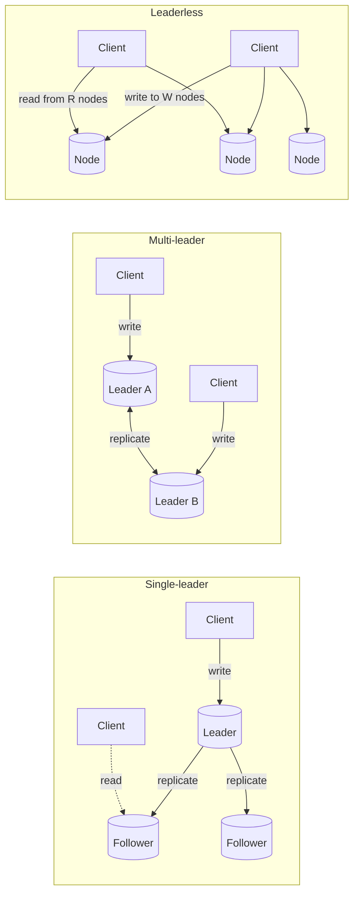
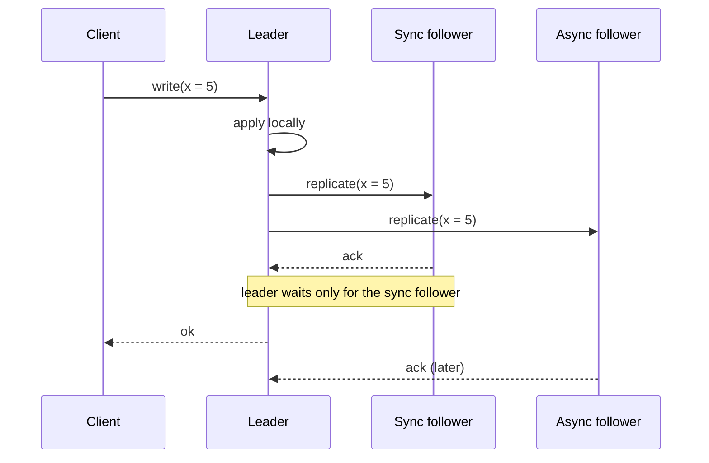
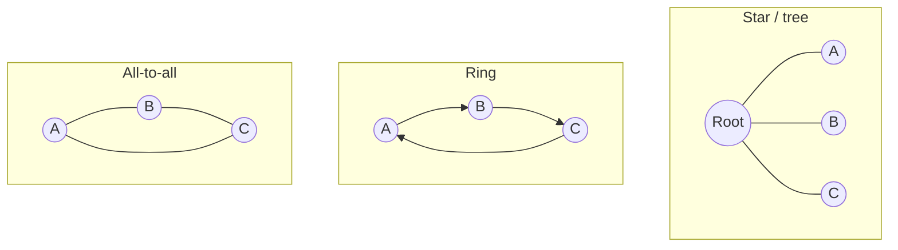
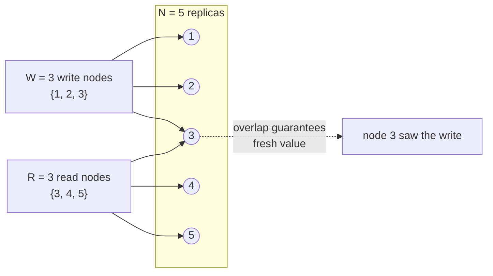
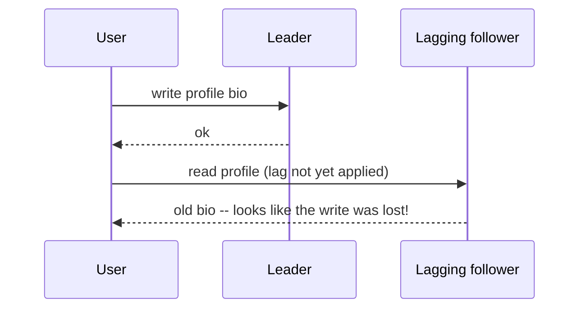
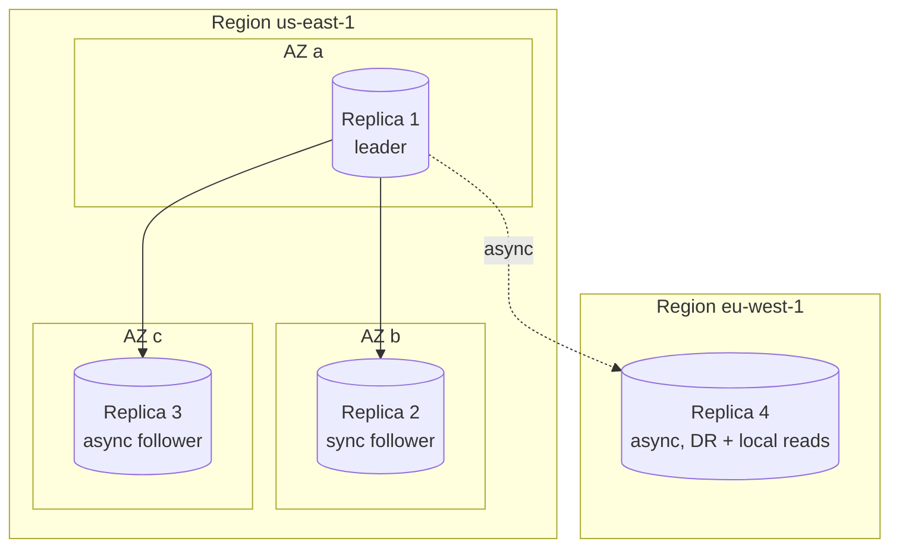
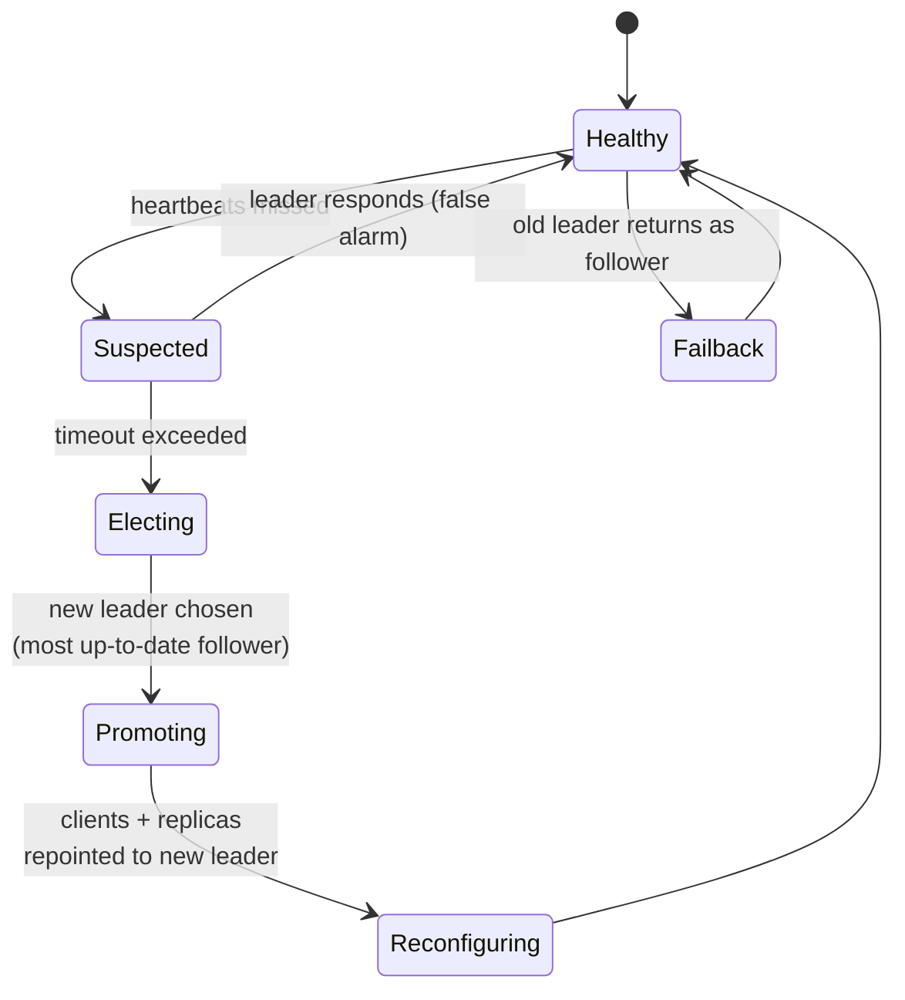
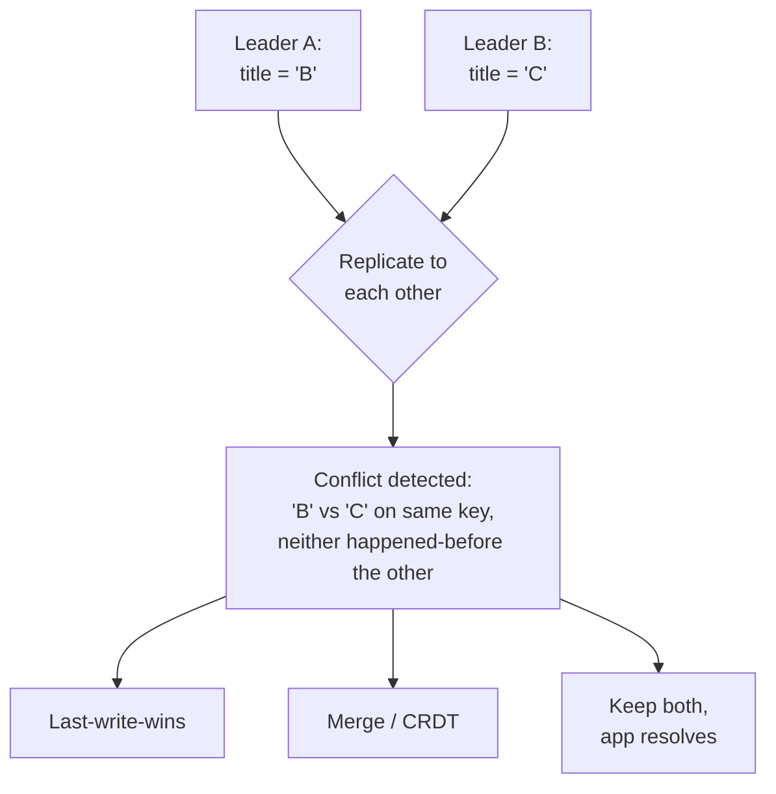
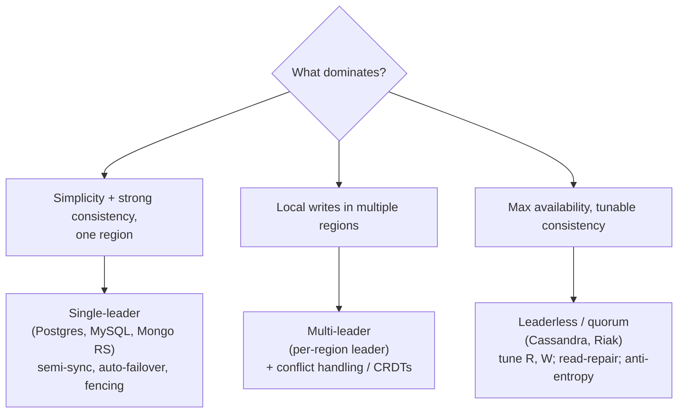

[Distributed Systems](./) &raquo; Replication Strategies

**Replication** means keeping a copy of the same data on multiple machines. You do it for three reasons: **availability** (survive a node failure), **latency** (serve reads from a replica geographically close to the user), and **read throughput** (spread reads across many copies). The hard part is not making copies — it is keeping them *consistent* while writes keep arriving and machines keep failing. This page covers the three replication architectures, the quorum math that lets you tune the consistency/availability trade-off, the session guarantees that make weak consistency tolerable, and the failover and conflict-resolution machinery you need in production. Four ideas recur:

- **One writer is simplest.** Single-leader replication is the default in most databases because it sidesteps write conflicts entirely — but the leader is a bottleneck and a failure point.
- **R + W > N buys overlap.** Quorum reads and writes guarantee that any read set intersects the latest write set, giving strong-ish consistency without a single leader.
- **Lag is unavoidable.** Asynchronous replication always trails. The question is not whether replicas are stale, but how stale, and whether your clients can tell.
- **Concurrent writes conflict.** The moment you allow more than one node to accept writes, you must define what happens when two of them disagree — there is no way to dodge it.

## Why Replicate at All

Before choosing a strategy, be clear about which goal dominates, because they pull in different directions:

| Goal | What it demands | Tension |
|------|-----------------|---------|
| **High availability** | Data survives node/datacenter loss; reads/writes continue | More replicas, automatic failover |
| **Low read latency** | A replica near every user population | Geo-distribution, multi-leader or leaderless |
| **Read scalability** | Many copies to absorb read traffic | Replication lag grows with copy count |
| **Disaster recovery** | A durable, possibly delayed copy off-site | Async replication, accept some data loss |

A replica that is always perfectly up to date with the leader would require synchronous replication to *every* copy on *every* write — which makes writes as slow as the slowest replica and unavailable if any replica is down. So real systems replicate asynchronously (or to a quorum), and everything below is about managing the staleness that creates.

Replication is distinct from **partitioning (sharding)**, which splits *different* data across nodes for capacity. The two are orthogonal and usually combined: each shard is independently replicated. See [Database Design](../technology/database-design/) for the partitioning side.

## The Three Architectures

Every replication scheme is one of three shapes, defined by *which nodes may accept writes*.



### Single-Leader (Primary/Replica)

One node is designated the **leader** (primary, master). All writes go to the leader. The leader applies the write to its local storage, then sends the change to its **followers** (replicas, secondaries) as a **replication log**. Followers apply the changes in the same order and may serve reads.

This is the model used by PostgreSQL, MySQL, MongoDB (replica sets), Oracle Data Guard, SQL Server, and many message brokers (Kafka per-partition). It dominates because it has **no write conflicts**: a single node imposes a total order on all writes.

The key choice is *when* a write is considered durable relative to follower acknowledgement:

| Mode | Leader waits for | On leader crash | Cost |
|------|------------------|-----------------|------|
| **Synchronous** | At least one follower to ack | No data loss (that follower has it) | Write blocks if follower is slow/down |
| **Asynchronous** | Nothing (fire and forget) | Last writes may be lost | Fast, but weaker durability |
| **Semi-synchronous** | One designated sync follower; rest async | No loss if both leader and sync follower don't fail together | Practical middle ground |

Making *all* followers synchronous is impractical — any single slow follower stalls every write. The common production pattern is **semi-synchronous**: exactly one follower is synchronous, so there is always one up-to-date copy, while the others lag asynchronously.



**Setting up a new follower** without downtime follows a standard recipe:

1. Take a consistent **snapshot** of the leader's data at a known log position (most databases can do this without locking writes, e.g. PostgreSQL `pg_basebackup`).
2. Copy the snapshot to the new follower.
3. The follower connects to the leader and requests **all changes since the snapshot's log position** (the *log sequence number* / LSN / replication offset).
4. Once the follower has caught up the backlog, it is *in sync* and continues streaming live changes.

**What gets replicated** — the replication log can take several forms, each with trade-offs:

- **Statement-based**: ship the SQL statements. Compact, but breaks on nondeterminism (`NOW()`, `RAND()`, auto-increment, triggers). Largely abandoned.
- **Write-ahead log (WAL) shipping**: ship the low-level storage-engine log of which bytes changed on disk. Very tight coupling — follower must run a compatible storage-engine version, which complicates rolling upgrades. (PostgreSQL.)
- **Logical (row-based) log**: ship the logical changes — "row R in table T now has these column values." Decoupled from storage format, so it survives version skew and can feed external consumers (this is what powers **change data capture / CDC**). (MySQL binlog in row mode, PostgreSQL logical replication.)
- **Trigger-based**: application-level, using DB triggers to record changes into a table the replicator reads. Flexible but slower and more error-prone; used when you need selective/transformed replication.

### Multi-Leader

Each leader accepts writes and also acts as a follower to the other leaders, forwarding its writes to them. The motivating use cases:

- **Multi-datacenter operation**: one leader per datacenter so writes are local (low latency) and a datacenter outage does not block writes globally.
- **Offline-capable clients**: each device is effectively a leader (your calendar app keeps working on a plane, then syncs).
- **Collaborative editing**: each user's edits apply locally and propagate.

The price is **write conflicts**: two leaders can concurrently modify the same record, and the replication that carries those writes to each other will discover the disagreement. Conflict handling (covered [below](#conflict-handling)) becomes mandatory, which is why multi-leader is avoided unless the use case truly needs it.

Topologies matter — how leaders forward writes to one another affects fault tolerance:



In **circular** and **star** topologies a single node failure can break the propagation path. **All-to-all** is more fault tolerant but can suffer **causality violations** — a write and its update can arrive at a node out of order if links have different latencies. This is the failure mode behind subtle multi-leader bugs, and it is fixed with version vectors (below) rather than wall-clock timestamps.

### Leaderless (Dynamo-style)

There is no leader. The client (or a coordinator node on its behalf) sends each write to *several* replicas and each read to *several* replicas, and uses **quorums** to decide what counts as a successful, consistent operation. This is the Amazon Dynamo design, adopted by Cassandra, Riak, and ScyllaDB.

Because any replica accepts writes at any time, leaderless systems are highly available — there is no failover to perform when a node dies; the live replicas just keep serving. The trade-off is that consistency must be reconstructed at read time, and conflicts are again possible. The quorum math is what makes this manageable, so we treat it next as its own topic.

## Quorum Reads and Writes

Let **N** be the number of replicas a given key is stored on. On each write, the coordinator sends to all N and waits for **W** successful acknowledgements before reporting success. On each read, it queries all N (or enough of them) and waits for **R** responses, returning the most recent value among them.

The central inequality is:

$$
R + W > N
$$

If the read set (R nodes) and the write set (W nodes) must together exceed N, then by the pigeonhole principle **they overlap in at least one node** — so any read is guaranteed to contact at least one replica that saw the latest acknowledged write. That overlapping node carries the fresh value, and version metadata lets the reader recognize it as newest.



The number of node failures the system tolerates while still satisfying a quorum is governed by the same arithmetic:

$$
\text{tolerable failures} = N - \max(R, W)
$$

Common configurations, with N = 3 and N = 5, illustrate the tuning dial:

| N | W | R | R+W>N? | Reads tolerate | Writes tolerate | Character |
|---|---|---|--------|----------------|-----------------|-----------|
| 3 | 2 | 2 | yes (4>3) | 1 node down | 1 node down | Balanced strong quorum |
| 3 | 3 | 1 | yes (4>3) | 2 down | 0 down | Fast reads, fragile writes |
| 3 | 1 | 3 | yes (4>3) | 0 down | 2 down | Fast writes, fragile reads |
| 5 | 3 | 3 | yes (6>5) | 2 down | 2 down | Robust strong quorum |
| 3 | 1 | 1 | **no** (2<3) | 2 down | 2 down | Eventual consistency, max availability |

A typical default is **N = 3, W = 2, R = 2**: a strict quorum that survives one node failure on both paths. Choosing **W = R = 1** abandons the overlap guarantee for maximum availability and lowest latency — pure eventual consistency.

### Why Quorums Are Not Actually Linearizable

The `R + W > N` rule is weaker than it looks. Several edge cases mean a strict quorum is *not* guaranteed to be linearizable:

- **Sloppy quorums with hinted handoff.** If the W "home" nodes for a key are unreachable, the system may accept the write on *other* reachable nodes (a sloppy quorum) and hand the data off later when the home nodes recover. The W writes and R reads can then land on disjoint node sets, breaking the overlap until handoff completes. This trades consistency for higher write availability.
- **Concurrent writes** to the same key may be ordered differently at different replicas; without a merge rule, "the latest value" is ambiguous.
- **A write that succeeds on some but fewer than W replicas** is not rolled back on the replicas that did accept it — a later read may or may not see it.
- **Read-repair timing**: if a node carrying a fresh value is restored from an older replica, the quorum count can be satisfied by stale nodes.

So quorums give you *strong eventual* behavior and good staleness bounds, not the strict linearizability of consensus (Raft/Paxos). When you need true linearizability, use a [consensus-backed system](../advanced/distributed-systems-theory/). The quorum dial is for when "usually fresh, always available" is the right trade.

### Anti-Entropy: Keeping Replicas Convergent

Two background mechanisms repair divergence in leaderless systems:

- **Read repair.** When a read contacts R replicas and notices one returned a stale value, the coordinator writes the fresh value back to the stale replica. This opportunistically repairs frequently-read keys — but keys that are rarely read drift indefinitely.
- **Anti-entropy / Merkle trees.** A background process continually compares replicas and copies missing data. To avoid transferring everything, replicas exchange **Merkle trees** (hash trees over key ranges): identical subtree hashes are skipped, and the process recurses only into ranges whose hashes differ, so the data moved is proportional to the divergence, not the dataset size.

```python
# Sketch of a leaderless quorum coordinator (read path with read-repair)
import time
from collections import Counter

class QuorumStore:
    def __init__(self, replicas, n, w, r):
        self.replicas = replicas      # list of replica client objects
        self.N, self.W, self.R = n, w, r
        assert self.R + self.W > self.N, "R + W must exceed N for quorum overlap"

    def put(self, key, value):
        version = time.time_ns()                  # version stamp (real systems use a logical clock)
        acks = 0
        for replica in self.replicas[:self.N]:
            try:
                replica.store(key, value, version)
                acks += 1
                if acks >= self.W:
                    return True                    # quorum of writes satisfied
            except ReplicaUnavailable:
                continue
        raise QuorumNotReached(f"only {acks}/{self.W} write acks")

    def get(self, key):
        responses = []                             # (value, version, replica)
        for replica in self.replicas[:self.N]:
            try:
                responses.append((*replica.fetch(key), replica))
            except ReplicaUnavailable:
                continue
            if len(responses) >= self.R:
                break
        if len(responses) < self.R:
            raise QuorumNotReached(f"only {len(responses)}/{self.R} read acks")

        # Newest version wins; repair any stale replica we read from.
        value, newest, _ = max(responses, key=lambda t: t[1])
        for v, ver, replica in responses:
            if ver < newest:
                replica.store(key, value, newest)  # read repair
        return value
```

## Read-Your-Writes and Session Guarantees

Asynchronous replication means a client can write to the leader, then immediately read from a *lagging* follower and not see its own write — a jarring "did my edit just vanish?" experience. Rather than pay for full linearizability everywhere, systems offer a menu of **session guarantees** (also called *client-centric consistency*) that fix the most visible anomalies cheaply.



| Guarantee | Promise to a single client/session | Anomaly it prevents |
|-----------|------------------------------------|---------------------|
| **Read-your-writes** (read-after-write) | You always see your own most recent writes | "My comment disappeared after I posted it" |
| **Monotonic reads** | Successive reads never go backward in time | Refreshing and seeing newer data, then older |
| **Consistent prefix reads** | If you see write B, you've seen everything causally before B (write A) | Seeing an answer before its question |
| **Writes-follow-reads** (session causality) | Writes are ordered after any writes you read | Replying to a comment you can no longer see |

Implementation techniques, in increasing cost:

- **Read-your-writes**:
  - Read recently-modified data from the leader (e.g., your own profile from the leader, everyone else's from a follower).
  - Track the **last write timestamp/LSN** in the client session; route reads to a replica that has applied at least that position, or wait until it has.
  - Use the client's last-write time to reject too-stale replicas.
- **Monotonic reads**: pin a session to a single replica (e.g., hash the user ID to a replica) so reads never jump to a less-advanced one. If that replica fails, the session must move forward, not backward.
- **Consistent prefix / writes-follow-reads**: track causal dependencies (logical timestamps or version vectors) and only serve a read once the replica has applied all causally-prior writes.

These are *per-session* properties — they say nothing about what *other* clients see. That is exactly why they are cheap: they require tracking a little state per client rather than coordinating across the cluster. For the formal placement of these in the consistency hierarchy, see [Distributed Systems Theory](../advanced/distributed-systems-theory/#consistency-models) and the consistency-model table in the [hub overview](consensus-and-coordination.html#consistency-models).

```python
# Read-your-writes via LSN tracking in the client session
class Session:
    def __init__(self, leader, followers):
        self.leader = leader
        self.followers = followers
        self.last_write_lsn = 0           # high-water mark of this session's writes

    def write(self, key, value):
        self.last_write_lsn = self.leader.write(key, value)   # leader returns the LSN it assigned

    def read(self, key):
        # Pick any follower that has applied at least our last write; else fall back to leader.
        for f in self.followers:
            if f.applied_lsn() >= self.last_write_lsn:
                return f.read(key)
        return self.leader.read(key)      # no follower caught up yet -> read the source of truth
```

## Replica Placement

*Where* copies live determines the failure correlations you survive and the latencies your users feel. The guiding principle: **place replicas in independent failure domains**, and weigh that against the latency cost of distance.

- **Rack and host diversity.** Two replicas on the same physical host, top-of-rack switch, or power circuit share a failure. Placement policies (Cassandra's `NetworkTopologyStrategy`, Kubernetes pod anti-affinity, HDFS rack awareness) spread replicas across racks so a rack outage loses at most one copy.
- **Availability zones.** Within a cloud region, replicas across AZs survive a datacenter (AZ) outage with low (sub-millisecond to single-digit-ms) inter-AZ latency. This is the standard durable-and-fast tier.
- **Regions.** Cross-region replicas survive a whole region's loss and serve local reads to distant users, but inter-region latency (tens to hundreds of ms) makes synchronous cross-region writes painful — hence multi-leader or async region replication for geo-distribution.
- **Quorum-aware placement.** In leaderless/quorum systems you can require that a write quorum spans at least two AZs (e.g., Cassandra's `LOCAL_QUORUM` vs `EACH_QUORUM`) so that no single AZ failure both loses data and breaks the quorum.



A common production layout: leader + synchronous follower in two AZs of the primary region (no data loss on an AZ failure), an async follower in a third AZ (read scaling), and an async replica in a second region (disaster recovery and low-latency reads for that region's users).

## Failover and Failback

When the leader dies, a single-leader system must promote a follower. **Failover** is the most dangerous operation in replication because it is rarely exercised and full of edge cases.



The steps and their hazards:

1. **Detect failure.** No perfect failure detector exists (FLP) — you use timeouts on heartbeats. Too short causes spurious failovers (a GC pause or network blip looks like death); too long extends downtime. Typical timeouts are 5–30 s.
2. **Choose a new leader.** Either by **election** (the replicas run a consensus round, e.g., Raft) or by a designated **controller/orchestrator** (Patroni + etcd, MongoDB's replica-set election, Orchestrator for MySQL). The best candidate is the follower with the **most recent data** (highest applied LSN) to minimize loss.
3. **Reconfigure routing.** Clients and the other followers must start sending writes to the new leader, usually via a virtual IP, a proxy (HAProxy/ProxySQL), or service discovery (DNS/etcd). Stale clients that still hold the old endpoint must be fenced off.
4. **Constrain the old leader (fencing).** When the old leader comes back it may still believe it is leader — a **split brain** with two leaders accepting conflicting writes. **Fencing** (a.k.a. STONITH — "shoot the other node in the head") forces the old leader to step down: a fencing token (a monotonically increasing epoch number that storage/locks reject if stale), revoking its lease, or powering it off.

### Failure Modes of Failover

These are the classic ways failover causes *more* damage than the original crash:

- **Lost writes (async replication).** Writes acknowledged by the old leader but not yet replicated are gone when a less-advanced follower is promoted. If those IDs were used elsewhere (e.g., reused primary keys that another system already referenced), discarding them causes cross-system corruption. (A real GitHub incident discarded MySQL writes that Redis had already consumed.)
- **Split brain.** Two nodes both accept writes; without fencing, their divergent histories must be reconciled or one is discarded, losing data.
- **Cascading failover storms.** A too-aggressive timeout under high load triggers failover, the new leader is also overloaded, and the cluster thrashes between leaders.

### Failback

**Failback** is returning to the original (or preferred) leader after it recovers, or after a region is restored. The recovered node must rejoin as a **follower first**, catch up on everything it missed (often via a full resync if its log diverged), and only then — during a controlled, low-traffic window — be promoted back if a preferred-leader policy demands it. Automated failover is common; automated *failback* is often deliberately manual, because flipping the leader twice doubles the disruption and many teams prefer to leave the new leader in place until a maintenance window.

```python
# Sketch of orchestrator-driven failover with fencing tokens
class FailoverController:
    def __init__(self, followers, lease_store):
        self.followers = followers
        self.lease_store = lease_store     # provides monotonically increasing epoch tokens
        self.epoch = 0

    def on_leader_suspected(self):
        if not self._confirm_dead():       # re-check across the timeout window
            return                         # false alarm; do nothing
        candidate = max(self.followers, key=lambda f: f.applied_lsn())  # least data loss
        self.epoch += 1                    # new fencing epoch invalidates the old leader
        self.lease_store.grant_leader(candidate.id, self.epoch)
        candidate.promote(epoch=self.epoch)
        self._repoint_clients(candidate)   # update proxy / service discovery
        # Any write from the old leader now carries a stale epoch and is rejected by storage.
```

## Replication Lag and Monitoring

Replication lag is the delay between a write landing on the leader and that write being visible on a given replica. Under healthy conditions it is milliseconds; under load, large transactions, or network strain it can balloon to seconds or minutes, and that is when the session anomalies above start hurting users.

Two ways to express lag, and you should track both:

- **Time lag** — wall-clock seconds the replica is behind. Intuitive for SLOs ("replicas within 1 s").
- **Byte/offset lag (LSN gap)** — how many WAL bytes / log entries the replica has not yet applied. The leading indicator: byte lag spikes *before* time lag, because a replica can be many bytes behind while still appearing time-current if it just caught up.

Concrete signals to alert on:

| Metric | Source | Why it matters |
|--------|--------|----------------|
| `pg_last_wal_replay_lsn` vs `pg_current_wal_lsn` (PostgreSQL) | leader/replica | Byte lag per replica |
| `Seconds_Behind_Master` (MySQL) | replica | Time lag (beware: pauses to 0 if replication thread stalls) |
| Replica apply rate vs leader write rate | both | Whether the gap is growing or shrinking |
| Number of in-sync replicas (ISR) | leader | Below the min breaks the durability/quorum guarantee |
| Replication connection up/down | each link | A broken link looks like "0 lag" until you check the connection |

Watch for the **MySQL `Seconds_Behind_Master` trap**: it reports 0 when the replica's SQL thread is *stopped* (it isn't behind, it isn't applying anything), masking a total stall. Always pair time lag with a liveness/connection check and with byte lag.

```python
# Minimal lag monitor: alert on growing byte lag or a dead replication link
class LagMonitor:
    def __init__(self, leader, replicas, max_byte_lag, max_time_lag_s):
        self.leader = leader
        self.replicas = replicas
        self.max_byte_lag = max_byte_lag
        self.max_time_lag_s = max_time_lag_s

    def check(self):
        head = self.leader.current_lsn()
        alerts = []
        for r in self.replicas:
            if not r.replication_connected():
                alerts.append(f"{r.id}: replication link DOWN")   # the 'silent 0 lag' case
                continue
            byte_lag = head - r.applied_lsn()
            time_lag = r.replay_time_lag_seconds()
            if byte_lag > self.max_byte_lag:
                alerts.append(f"{r.id}: byte lag {byte_lag} > {self.max_byte_lag}")
            if time_lag > self.max_time_lag_s:
                alerts.append(f"{r.id}: time lag {time_lag:.1f}s > {self.max_time_lag_s}")
        return alerts
```

Operationally, lag drives policy: route latency-sensitive consistent reads to the leader or to replicas within a lag threshold; remove a too-lagged replica from the read pool; and in quorum systems, refuse to count an out-of-sync replica toward W. Lag is also why **min in-sync replicas** (Kafka `min.insync.replicas`, etc.) exists — if too few replicas are caught up, the leader should refuse writes rather than silently weaken durability.

## Conflict Handling

The instant you allow more than one node to accept writes — multi-leader or leaderless — two clients can concurrently write the same key, and replication will surface the disagreement. Conflicts are *not* a bug you can engineer away; they are inherent to concurrent writes without a single ordering authority. What you choose is the resolution policy.



### Detecting Concurrency: Version Vectors

You cannot resolve a conflict until you can tell a *concurrent* write from a *sequential update*. Wall-clock timestamps fail here because clocks are unsynchronized — this is the trap behind naive last-write-wins. The correct tool is a **version vector** (a vector of per-replica counters; a generalization of Lamport's logical clocks to multiple writers):

- Each replica tracks a counter, incremented on each write it originates.
- A value carries the vector of counters it has "seen."
- Compare two versions component-wise: if every component of A is ≥ B's (and at least one is strictly greater), A **descends from** (causally follows) B — a clean overwrite. If neither dominates, the writes are **concurrent** — a genuine conflict.

This is what Dynamo, Riak, and Cassandra use to distinguish "newer" from "concurrent," instead of trusting clocks. See the happens-before relation in [Distributed Systems Theory](../advanced/distributed-systems-theory/).

### Resolution Strategies

| Strategy | How it resolves | Pro | Con |
|----------|-----------------|-----|-----|
| **Last-write-wins (LWW)** | Highest timestamp wins; discard the rest | Simple, no app logic | **Silently drops data**; needs synced clocks; nondeterministic on ties |
| **Highest priority / origin wins** | Designate a winner (e.g., a "main" datacenter) | Deterministic | Arbitrary data loss for losers |
| **Merge values** | Combine concurrent values (union a set, sum counters, concatenate) | No data loss | Needs commutative semantics; can produce nonsense if naive |
| **Keep both (siblings)** | Store all concurrent versions; surface to the application/user on next read | No data loss; user intent preserved | Pushes complexity to the app (Riak's "siblings") |
| **CRDTs** | Data types whose merges are provably convergent | Automatic, correct, no coordination | Limited to types you can express as a CRDT |

**CRDTs (Conflict-free Replicated Data Types)** deserve emphasis: they are data structures (counters, sets, maps, sequences) whose merge operation is **commutative, associative, and idempotent**, so replicas applying the same set of updates in any order converge to the same state automatically — no conflict resolution code, no coordination. A grow-only counter, an observed-remove set, and a sequence CRDT (the basis of collaborative text editors) are the canonical examples. The cost is that you must model your data in CRDT terms and accept some metadata overhead.

```python
# Version-vector comparison: the core of conflict detection
def relation(vv_a, vv_b):
    """Return 'a_after_b', 'b_after_a', 'equal', or 'concurrent'."""
    a_ge = all(vv_a.get(k, 0) >= vv_b.get(k, 0) for k in set(vv_a) | set(vv_b))
    b_ge = all(vv_b.get(k, 0) >= vv_a.get(k, 0) for k in set(vv_a) | set(vv_b))
    if a_ge and b_ge:
        return "equal"
    if a_ge:
        return "a_after_b"      # a cleanly overwrites b
    if b_ge:
        return "b_after_a"      # b cleanly overwrites a
    return "concurrent"         # genuine conflict -> apply a resolution strategy


def resolve(value_a, vv_a, value_b, vv_b, merge):
    rel = relation(vv_a, vv_b)
    if rel == "a_after_b" or rel == "equal":
        return value_a, vv_a
    if rel == "b_after_a":
        return value_b, vv_b
    # concurrent: merge component-wise vectors and merge the values
    merged_vv = {k: max(vv_a.get(k, 0), vv_b.get(k, 0)) for k in set(vv_a) | set(vv_b)}
    return merge(value_a, value_b), merged_vv   # e.g. merge = set.union for an add-only set
```

The pragmatic guidance: **avoid multi-master writes to the same key when you can** (route a given record's writes to one leader, partition by user/region so concurrent writes to one key are rare). When you cannot, prefer **CRDTs or keep-both** over last-write-wins so you never silently lose a user's data — LWW is acceptable only for caches and metrics where dropping a concurrent value is harmless.

## Putting It Together: A Decision Guide



- **Default to single-leader.** It is the simplest correct thing and covers the vast majority of applications. Invest in robust failover (fencing, most-up-to-date promotion) and lag monitoring.
- **Reach for multi-leader only** when you genuinely need local writes in multiple regions or offline-capable clients — and budget for conflict handling from day one.
- **Reach for leaderless/quorum** when availability and write throughput trump strict consistency, and tune `R`/`W`/`N` to your durability needs, leaning on read-repair and anti-entropy.
- Regardless of architecture, **measure lag, fence aggressively on failover, and never silently drop concurrent writes** to user data.

## See Also

- **[Distributed Systems Hub](./)** — CAP, consistency models, consensus, and the broader pattern catalog
- **[Distributed Systems Theory](../advanced/distributed-systems-theory/)** — formal consistency models, the happens-before relation, FLP/CAP proofs, and consensus (Raft/Paxos)
- **[Database Design](../technology/database-design/)** — partitioning/sharding, which combines with replication, and distributed-database tuning
- **[Kubernetes](../technology/kubernetes/)** — pod anti-affinity and topology spread for replica placement
- **[AWS Cloud Services](../technology/aws/)** — availability zones and regions as failure domains for placement
