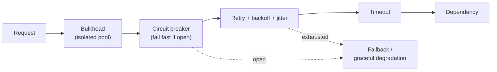
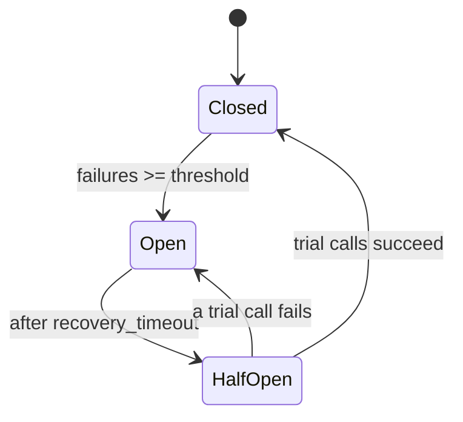
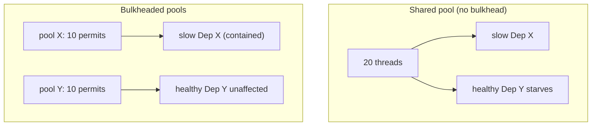
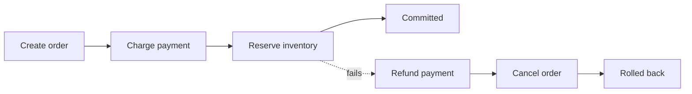
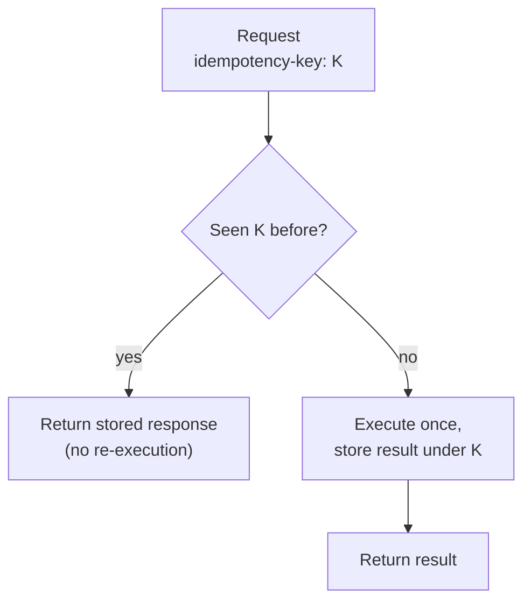
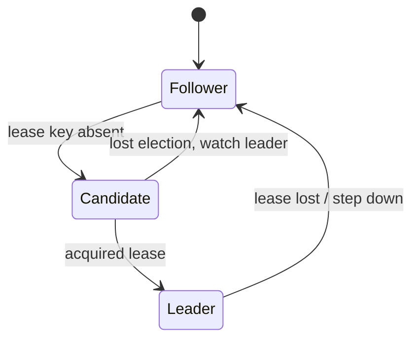

[Distributed Systems](./) &raquo; Resilience Patterns

In a distributed system, *failure is the default*. Networks partition, dependencies time out, nodes crash mid-operation, and clocks drift. Resilience patterns are the engineering vocabulary for turning those failures from catastrophic outages into routine, contained events. This page collects the patterns you reach for most often — how each one works, when to use it, the failure mode it guards against, and runnable implementation code.

## Table of contents
{: .no_toc .text-delta }

1. TOC
{:toc}

---

## Why Resilience Is a First-Class Concern

A single-machine program either runs or it doesn't. A distributed call can succeed, fail, time out, succeed-but-the-response-is-lost, or partially complete — and you cannot always tell which. This ambiguity is the root of distributed-systems difficulty (the [Two Generals and FLP results](../advanced/distributed-systems-theory/) formalize why). Resilience patterns are pragmatic answers to that ambiguity:

- **Stop hammering a sick dependency** → circuit breakers.
- **Tolerate transient blips** → retries with backoff and jitter.
- **Contain a failure so it doesn't sink the whole ship** → bulkheads.
- **Know what's actually broken** → health checks.
- **Undo a multi-service operation that failed halfway** → sagas and compensation.
- **Make retries safe** → idempotency.
- **Coordinate exclusive access** → distributed locks and leader election.
- **Degrade instead of dying** → graceful degradation.

The patterns compose. A robust outbound call typically wraps a *timeout* inside a *retry-with-backoff* inside a *circuit breaker* inside a *bulkhead*, with a *fallback* for graceful degradation when all of that still fails.



## Circuit Breakers

A circuit breaker wraps a call to a remote dependency and *trips* (opens) after too many consecutive failures, so that subsequent calls fail fast instead of piling up against a service that is already struggling. This prevents the cascading failure where slow upstream calls exhaust thread pools and take down healthy services along with the sick one.

The breaker is a small state machine with three states:

- **Closed** — calls flow through normally; failures are counted. When the failure count crosses the threshold, the breaker trips to **open**.
- **Open** — calls fail immediately (without touching the dependency) for a `recovery_timeout`. This gives the downstream service room to recover and protects the caller's resources.
- **Half-open** — after the timeout, a limited number of trial calls are allowed through. If they succeed, the breaker closes; if any fail, it re-opens and the timer restarts.



A reference implementation wrapping an outbound HTTP call:

```python
from circuit_breaker import CircuitBreaker
import aiohttp
import asyncio

class ResilientService:
    def __init__(self):
        self.circuit_breaker = CircuitBreaker(
            failure_threshold=5,
            recovery_timeout=60,
            expected_exception=aiohttp.ClientError
        )

    @circuit_breaker
    async def call_external_service(self, endpoint):
        async with aiohttp.ClientSession() as session:
            async with session.get(endpoint) as response:
                return await response.json()
```

A minimal from-scratch breaker, to show the state machine explicitly:

```python
import time

class CircuitBreaker:
    CLOSED, OPEN, HALF_OPEN = "closed", "open", "half_open"

    def __init__(self, failure_threshold=5, recovery_timeout=60):
        self.failure_threshold = failure_threshold
        self.recovery_timeout = recovery_timeout
        self.state = self.CLOSED
        self.failures = 0
        self.opened_at = 0.0

    async def call(self, fn, *args, **kwargs):
        if self.state == self.OPEN:
            if time.monotonic() - self.opened_at >= self.recovery_timeout:
                self.state = self.HALF_OPEN  # allow a trial call
            else:
                raise RuntimeError("circuit open")
        try:
            result = await fn(*args, **kwargs)
        except Exception:
            self._on_failure()
            raise
        self._on_success()
        return result

    def _on_success(self):
        self.failures = 0
        self.state = self.CLOSED

    def _on_failure(self):
        self.failures += 1
        if self.failures >= self.failure_threshold:
            self.state = self.OPEN
            self.opened_at = time.monotonic()
```

**Tuning guidance.** Set `failure_threshold` high enough to avoid tripping on a single transient blip, but low enough to react before resource exhaustion. Track the *failure rate over a rolling window* rather than a raw consecutive count for high-traffic services. Always pair a breaker with a [timeout](#retries-backoff-and-jitter) — a breaker only counts errors, and a hung call that never returns is the most dangerous kind of failure. Production libraries (resilience4j, Polly, Hystrix's successors) add rolling-window statistics, a half-open trial-call limit, and per-endpoint breakers.

## Retries, Backoff, and Jitter

Many distributed failures are *transient*: a brief network hiccup, a momentary GC pause, a node restarting. Retrying often succeeds. But naive retries are dangerous — they amplify load on an already-struggling service and can synchronize clients into a **thundering herd** that prevents recovery.

The disciplined approach has four ingredients:

1. **Bounded retries** — a hard cap (e.g. 3 attempts) so failures eventually surface.
2. **Exponential backoff** — wait longer after each failure, giving the dependency time to recover:

   $$ \text{delay}(n) = \text{base} \times 2^{n} $$

   where `n` is the (zero-based) attempt number and `base` is the initial delay.
3. **A delay cap** — clamp the exponential so waits don't grow unboundedly:

   $$ \text{delay}(n) = \min\left(\text{cap},\; \text{base} \times 2^{n}\right) $$

4. **Jitter** — randomize the delay so retrying clients don't re-synchronize. *Full jitter* picks the actual delay uniformly from `[0, delay(n)]`:

   $$ \text{sleep}(n) = \text{uniform}\!\left(0,\; \min\left(\text{cap},\; \text{base} \times 2^{n}\right)\right) $$

Full jitter is the variant AWS recommends; it spreads retries evenly and minimizes contention.

```python
import asyncio
import random

async def retry_with_backoff(
    fn,
    max_attempts=3,
    base=0.1,       # seconds
    cap=10.0,       # max single delay
    retryable=(Exception,),
):
    last_exc = None
    for attempt in range(max_attempts):
        try:
            return await fn()
        except retryable as exc:
            last_exc = exc
            if attempt == max_attempts - 1:
                break
            # full jitter: uniform(0, min(cap, base * 2**attempt))
            ceiling = min(cap, base * (2 ** attempt))
            await asyncio.sleep(random.uniform(0, ceiling))
    raise last_exc
```

**When NOT to retry.** Retry only *transient* and *idempotent* operations. Retrying a non-idempotent write (charge a card, append to a log) can double-execute it — which is exactly why [idempotency](#idempotency) is the prerequisite for safe retries. Never retry deterministic client errors (HTTP 4xx other than 429); they will fail identically every time and just waste resources. Honor `Retry-After` headers when the server provides them. Finally, beware **retry storms in depth**: if every layer of a call chain retries 3 times, a 4-deep chain can produce 3⁴ = 81 attempts. Retry at *one* layer (usually the edge or a dedicated client), not at every hop.

## Bulkheads

The bulkhead pattern is named after the watertight compartments in a ship's hull: if one floods, the others keep the ship afloat. In software, a bulkhead **partitions resources** (thread pools, connection pools, concurrency permits) so that a failure or slowdown in one dependency cannot consume *all* of a service's capacity and starve the others.

The classic failure it prevents: Service A calls a slow Dependency X and a fast Dependency Y from a *shared* thread pool. When X gets slow, every thread blocks waiting on X, and calls to the healthy Y also fail — the slowness has spread. Giving X and Y *separate* pools contains the damage to X.



A semaphore-based bulkhead caps the concurrency allowed against each dependency:

```python
import asyncio

class Bulkhead:
    """Limit concurrent calls into one dependency; reject (fail fast)
    rather than queue unboundedly when the pool is exhausted."""

    def __init__(self, max_concurrent=10, max_queue=0):
        self._sem = asyncio.Semaphore(max_concurrent)
        self._max_queue = max_queue
        self._waiting = 0

    async def run(self, fn, *args, **kwargs):
        if self._waiting >= self._max_queue and self._sem.locked():
            raise RuntimeError("bulkhead full")  # shed load, fail fast
        self._waiting += 1
        try:
            async with self._sem:
                self._waiting -= 1
                return await fn(*args, **kwargs)
        finally:
            if self._waiting > 0 and self._sem.locked():
                pass  # accounting handled above

# One bulkhead per downstream dependency:
payments = Bulkhead(max_concurrent=10)
inventory = Bulkhead(max_concurrent=20)
```

**Sizing.** Pick each pool's size from the dependency's expected latency and your throughput target (Little's Law: `concurrency = throughput × latency`). The key property is that the *sum* of pool sizes is bounded, and no single dependency can grab more than its slice. Kubernetes resource limits, separate database connection pools, and Istio's connection-pool settings are bulkheads at the infrastructure level.

## Health Checks

A health check is an endpoint a service exposes so that orchestrators, load balancers, and monitoring systems can ask *"are you able to serve traffic right now?"* Health checks drive automated decisions: a load balancer removes an unhealthy backend from rotation; Kubernetes restarts a failing pod; a deployment halts a rollout when new replicas don't come up.

There are three distinct kinds, and conflating them causes outages:

| Probe | Question it answers | Failure action | Should it check dependencies? |
|-------|--------------------|----------------|------------------------------|
| **Liveness** | Is the process wedged/deadlocked? | Restart the instance | **No** — a DB outage shouldn't restart your pods |
| **Readiness** | Can it serve traffic *now*? | Remove from load-balancer rotation | Yes — if a hard dependency is down, stop sending traffic |
| **Startup** | Has slow initialization finished? | Delay liveness/readiness until done | Only init steps |

The most common mistake is making the **liveness** probe check downstream dependencies. If the database goes down and every pod's liveness probe fails, Kubernetes restarts *every pod simultaneously* — turning a recoverable dependency blip into a full self-inflicted outage. Liveness should check only that *this process* is responsive; readiness checks whether it can do useful work.

The deep health check, used by readiness probes, inspects dependencies:

```python
class ResilientService:
    async def health_check(self):
        checks = {
            "database": await self.check_database(),
            "cache": await self.check_cache(),
            "dependencies": await self.check_dependencies()
        }
        status = "healthy" if all(checks.values()) else "unhealthy"
        return {"status": status, "checks": checks}
```

A Flask service exposing the three probe types separately:

```python
from flask import Flask, jsonify
import os

app = Flask(__name__)
_ready = False

@app.route('/livez')          # liveness: just "am I responsive?"
def livez():
    return jsonify(status="ok", node=os.environ.get('HOSTNAME', 'unknown'))

@app.route('/readyz')         # readiness: can I serve? checks deps
def readyz():
    if not _ready or not check_database():
        return jsonify(status="not_ready"), 503
    return jsonify(status="ready")

@app.route('/startupz')       # startup: has init finished?
def startupz():
    return (jsonify(status="started"), 200) if _ready else (jsonify(status="starting"), 503)
```

Corresponding Kubernetes probes:

```yaml
livenessProbe:
  httpGet: { path: /livez, port: 5000 }
  periodSeconds: 10
  failureThreshold: 3
readinessProbe:
  httpGet: { path: /readyz, port: 5000 }
  periodSeconds: 5
  failureThreshold: 2
startupProbe:
  httpGet: { path: /startupz, port: 5000 }
  failureThreshold: 30      # allow up to 30 * periodSeconds to start
  periodSeconds: 5
```

## The Saga Pattern and Compensation

Distributed transactions can't rely on a single ACID commit across multiple services — two-phase commit (2PC) blocks on coordinator failure and doesn't scale. The **saga** pattern is the alternative: model a business transaction as a *sequence of local transactions*, each in its own service, where every step has a corresponding **compensating action** that semantically undoes it. If any step fails, the saga runs the compensations for all completed steps *in reverse order*, rolling the system back to a consistent state.

Compensation is not a database rollback — the local transactions already committed. A compensation is a *new* transaction that counteracts the effect: you don't "un-charge" a card, you *issue a refund*; you don't "un-send" an email, you send a correction. This makes sagas **eventually consistent**, not atomic, and requires that intermediate states be tolerable.



Two coordination styles:

- **Orchestration** — a central coordinator tells each service what to do and invokes compensations on failure. Easier to reason about and observe; the orchestrator is a single place to see saga state.
- **Choreography** — each service emits events that the next service reacts to, with no central brain. More decoupled, but the saga's logic is smeared across services and harder to debug.

An orchestrator implementation:

```python
class SagaOrchestrator:
    def __init__(self):
        self.steps = []
        self.compensations = []

    def add_step(self, action, compensation):
        self.steps.append(action)
        self.compensations.append(compensation)

    async def execute(self):
        completed_steps = []
        try:
            # Execute all steps
            for i, step in enumerate(self.steps):
                result = await step()
                completed_steps.append(i)
        except Exception as e:
            # Compensate in reverse order
            for i in reversed(completed_steps):
                try:
                    await self.compensations[i]()
                except Exception as comp_error:
                    # Log compensation failure
                    print(f"Compensation {i} failed: {comp_error}")
            raise e

# Usage example
saga = SagaOrchestrator()

saga.add_step(
    lambda: create_order(order_data),
    lambda: cancel_order(order_id)
)

saga.add_step(
    lambda: charge_payment(payment_data),
    lambda: refund_payment(payment_id)
)

saga.add_step(
    lambda: update_inventory(items),
    lambda: restore_inventory(items)
)

await saga.execute()
```

**Make compensations idempotent and retryable.** A compensation can itself fail or be retried, so `refund_payment` must be safe to call twice (see [idempotency](#idempotency)). Persist saga state durably (an event log or a saga table) so that an orchestrator crash mid-saga can resume rather than leaving the system half-rolled-back. Design steps so that compensations always *can* run — for instance, reserve inventory before shipping it, because you can release a reservation but you cannot un-ship a package.

## Idempotency

An operation is **idempotent** if performing it multiple times has the same effect as performing it once. Idempotency is the keystone that makes every other pattern here safe: retries, at-least-once message delivery, and saga compensations all depend on it. Because a distributed caller often cannot tell whether a timed-out request actually executed, it *must* be able to retry without fear of double-execution.

Some operations are naturally idempotent: `SET balance = 100` (absolute assignment), `DELETE user 42`, `PUT` of a full resource. Others are inherently not: `balance += 50` (relative), "send email", "charge card", "append to log". For the non-idempotent ones, you make them idempotent by attaching an **idempotency key** — a unique client-generated id for the *logical* operation — and deduplicating on the server.



A server-side idempotency layer backed by a key/value store:

```python
import json

class IdempotencyStore:
    """Dedup by client-supplied idempotency key. The first request with a
    given key executes; later requests with the same key return the stored
    response without re-running the side effect."""

    def __init__(self, redis_client, ttl=86400):
        self.redis = redis_client
        self.ttl = ttl

    async def execute_once(self, key, operation):
        cache_key = f"idem:{key}"
        # Atomically claim the key; nx=True succeeds only for the first caller.
        claimed = await self.redis.set(cache_key, "__pending__", nx=True, ex=self.ttl)
        if not claimed:
            stored = await self.redis.get(cache_key)
            if stored == "__pending__":
                raise RuntimeError("operation in progress, retry later")
            return json.loads(stored)          # replay stored response

        result = await operation()              # run the side effect exactly once
        await self.redis.set(cache_key, json.dumps(result), ex=self.ttl)
        return result
```

**Practical notes.** Generate idempotency keys on the *client* (a UUID per logical attempt) so retries of the *same* attempt share a key, but distinct user actions get distinct keys. Store the key claim and the side effect in the *same* transaction where possible, so a crash between "did the work" and "recorded the key" can't double-execute. Stripe, PayPal, and most payment APIs expose an `Idempotency-Key` header precisely for this. For message consumers, the equivalent is a **processed-message-id** table that the consumer checks before acting, giving effectively-once processing on top of at-least-once delivery.

## Distributed Locks

A distributed lock provides *mutual exclusion across machines* — only one process at a time may hold the lock and enter the critical section. They're used to prevent duplicate work (only one worker processes a job), serialize access to a shared external resource, or guard a non-idempotent operation that can't be made idempotent.

Distributed locks are notoriously subtle. Three properties matter:

1. **Mutual exclusion** — at most one holder at a time.
2. **Deadlock freedom** — a crashed holder must not lock everyone out forever; locks carry a **TTL / lease** that auto-expires.
3. **Safety on release** — a holder must release *only its own* lock, never one a slow predecessor's lease handed to someone else. This requires a unique fencing token per acquisition and an atomic compare-and-delete.

A Redis lock that embodies all three: it sets the key with `NX` (only if absent) and an expiry (the TTL), stores a unique identifier, and on release uses a watch/compare so it deletes the key *only if* it still owns it.

```python
import redis
import uuid
import time

class RedisLock:
    def __init__(self, redis_client, key, timeout=10):
        self.redis = redis_client
        self.key = key
        self.timeout = timeout
        self.identifier = str(uuid.uuid4())

    def acquire(self):
        """Acquire lock with timeout"""
        end = time.time() + self.timeout
        while time.time() < end:
            if self.redis.set(self.key, self.identifier, nx=True, ex=self.timeout):
                return True
            time.sleep(0.001)
        return False

    def release(self):
        """Release lock if we own it"""
        pipe = self.redis.pipeline(True)
        while True:
            try:
                pipe.watch(self.key)
                if pipe.get(self.key) == self.identifier:
                    pipe.multi()
                    pipe.delete(self.key)
                    pipe.execute()
                    return True
                pipe.unwatch()
                break
            except redis.WatchError:
                pass
        return False

    def __enter__(self):
        if not self.acquire():
            raise Exception("Could not acquire lock")
        return self

    def __exit__(self, exc_type, exc_val, exc_tb):
        self.release()
```

**The fencing-token caveat.** A TTL-based lock is not perfectly safe: if the holder pauses (GC, VM migration) past its TTL, the lock expires, another process acquires it, and now *two* processes believe they hold it. The robust fix is a monotonically increasing **fencing token** issued with each lock grant; the protected resource rejects any write carrying a token older than the highest it has seen. This is why distributed locks should guard [idempotent](#idempotency) operations whenever possible — so an occasional double-acquire is harmless. For correctness-critical locks, use a consensus-backed store (etcd, ZooKeeper) with leases and fencing rather than a single Redis node; the Redlock multi-node algorithm exists for this reason but remains debated.

## Leader Election (as a Pattern)

Many coordination tasks need *exactly one* actor in charge: a single writer to avoid split-brain, one scheduler so cron jobs don't double-fire, one node that owns a partition. **Leader election** is the pattern that designates one instance as leader and automatically promotes a new one when the leader fails. It is essentially a distributed lock with *automatic failover and notification*: the leader holds a lease, renews it to stay leader, and when it stops renewing (crash, partition), a follower wins the next election.



The robust way to implement leader election is to lean on a consensus-backed coordination service (etcd, ZooKeeper, Consul) rather than rolling your own — they provide the linearizable compare-and-set and the lease primitives that make election correct. Using etcd, a candidate races to create a leader key bound to a TTL lease; whoever wins keeps the lease alive to remain leader, and followers *watch* the key to campaign the instant it's deleted:

```python
import etcd3
import threading
import time

class LeaderElection:
    def __init__(self, node_id, etcd_host='localhost'):
        self.node_id = node_id
        self.etcd = etcd3.client(host=etcd_host)
        self.lease = None
        self.is_leader = False

    def campaign(self):
        """Run for leader position"""
        # Create lease with TTL
        self.lease = self.etcd.lease(5)  # 5 second TTL

        # Try to create leader key
        try:
            self.etcd.put(
                '/election/leader',
                self.node_id,
                lease=self.lease
            )
            self.is_leader = True
            print(f"Node {self.node_id} became leader")

            # Keep lease alive
            self.lease.refresh()

        except etcd3.exceptions.PreconditionFailedError:
            # Another node is leader
            self.is_leader = False
            self.watch_leader()

    def watch_leader(self):
        """Watch for leader changes"""
        events_iterator, cancel = self.etcd.watch('/election/leader')
        for event in events_iterator:
            if isinstance(event, etcd3.events.DeleteEvent):
                # Leader stepped down, campaign again
                self.campaign()
                break
```

If you can't depend on an external coordinator, the election logic lives inside a consensus protocol itself — Raft, for example, elects a leader per term via randomized election timeouts and majority votes:

```python
# Simple Raft-like leader election
import asyncio
import random
import time

class Node:
    def __init__(self, node_id, peers):
        self.id = node_id
        self.peers = peers
        self.state = "follower"
        self.term = 0
        self.voted_for = None
        self.leader = None

    async def start_election(self):
        self.state = "candidate"
        self.term += 1
        self.voted_for = self.id

        votes = 1  # Vote for self
        for peer in self.peers:
            if await self.request_vote(peer):
                votes += 1

        if votes > len(self.peers) / 2:
            self.become_leader()

    def become_leader(self):
        self.state = "leader"
        self.leader = self.id
        print(f"Node {self.id} became leader for term {self.term}")
```

**Beware split-brain.** A naive election over a partition can elect *two* leaders, one on each side — catastrophic for a single-writer system. The defense is to require a **majority quorum** to win (a minority partition cannot elect a leader) and to use [fencing tokens](#distributed-locks) so a stale ex-leader's writes are rejected after it's deposed. For the formal treatment of why election needs a majority and how Raft and Paxos guarantee a single leader per term, see [Distributed Systems Theory](../advanced/distributed-systems-theory/).

## Graceful Degradation

Graceful degradation is the principle that a system under stress or partial failure should **shed quality, not service** — returning a slightly worse but still useful response rather than an error page. It's what separates a resilient system from a brittle one: when a non-critical dependency fails, users should barely notice.

Concrete degradation tactics:

- **Fallbacks** — when the breaker is open or a call fails, return a cached value, a default, or a stripped-down response (e.g. show product details but hide the unavailable "customers also bought" carousel).
- **Load shedding** — when overloaded, proactively reject low-priority requests so high-priority ones keep flowing. Better to fast-fail 10% of traffic than to slow-fail 100%.
- **Feature toggles / kill switches** — turn off expensive, non-essential features under load (personalization, real-time recommendations) to protect the core path.
- **Timeouts everywhere** — a missing timeout converts a slow dependency into an outage; a present one converts it into a fast fallback.
- **Serve stale** — prefer slightly-stale cached data over no data when the source of truth is unreachable.

```python
async def get_recommendations(user_id, rec_breaker, cache):
    """Degrade gracefully: fall back to a cached/generic list when the
    recommendation service is unavailable, instead of failing the page."""
    try:
        return await rec_breaker.call(fetch_personalized, user_id)
    except RuntimeError:                  # circuit open or call failed
        cached = await cache.get(f"recs:{user_id}")
        if cached is not None:
            return cached                 # stale-but-useful
        return DEFAULT_POPULAR_ITEMS      # generic fallback
```

The discipline is to classify every dependency as **critical** (failure must surface) or **non-critical** (failure must degrade), and to build the fallback path *before* you need it. A checkout flow must fail loudly if payment is down; it should silently hide a recommendations widget if that service is down. Combined with [circuit breakers](#circuit-breakers) (to detect the failure fast) and [bulkheads](#bulkheads) (to contain it), graceful degradation is what keeps the lights on during a partial outage.

## Composing the Patterns

No single pattern is sufficient; resilience comes from layering them so each covers the others' blind spots:

| Pattern | Guards against | Depends on |
|---------|----------------|-----------|
| Timeout | Hung calls | — (foundation for everything) |
| Retry + backoff + jitter | Transient failures | Idempotency, timeouts |
| Circuit breaker | Cascading failure on a sick dependency | Timeouts |
| Bulkhead | One slow dependency starving all capacity | — |
| Health check | Routing traffic to broken instances | — |
| Idempotency | Double-execution from retries/redelivery | — |
| Saga + compensation | Half-completed multi-service transactions | Idempotency |
| Distributed lock | Concurrent access / duplicate work | Fencing, idempotency |
| Leader election | Split-brain, duplicate schedulers | Quorum, fencing |
| Graceful degradation | Total outage from partial failure | Circuit breakers, timeouts |

A practical default for an outbound dependency call: wrap it in a **timeout**, inside a **retry-with-jitter** (only if idempotent), inside a **circuit breaker**, inside a **bulkhead**, with a **fallback** for graceful degradation. Then verify the whole stack under fault injection — see [chaos engineering](testing-distributed-systems.html#chaos-engineering).

## See Also

- **[Distributed Systems Hub](./)** — architecture patterns, consensus, consistency models, and observability
- **[Distributed Systems Theory](../advanced/distributed-systems-theory/)** — CAP, FLP, consensus proofs, and why these patterns are necessary
- **[Kubernetes](../technology/kubernetes/)** — liveness/readiness probes, resource limits as bulkheads, and rollout safety
- **[Database Design](../technology/database-design/)** — replication, sharding, and transactional consistency
- **[AWS Cloud Services](../technology/aws/)** — managed building blocks (DynamoDB conditional writes, SQS, retries) for these patterns
