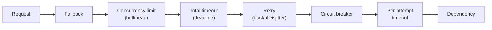
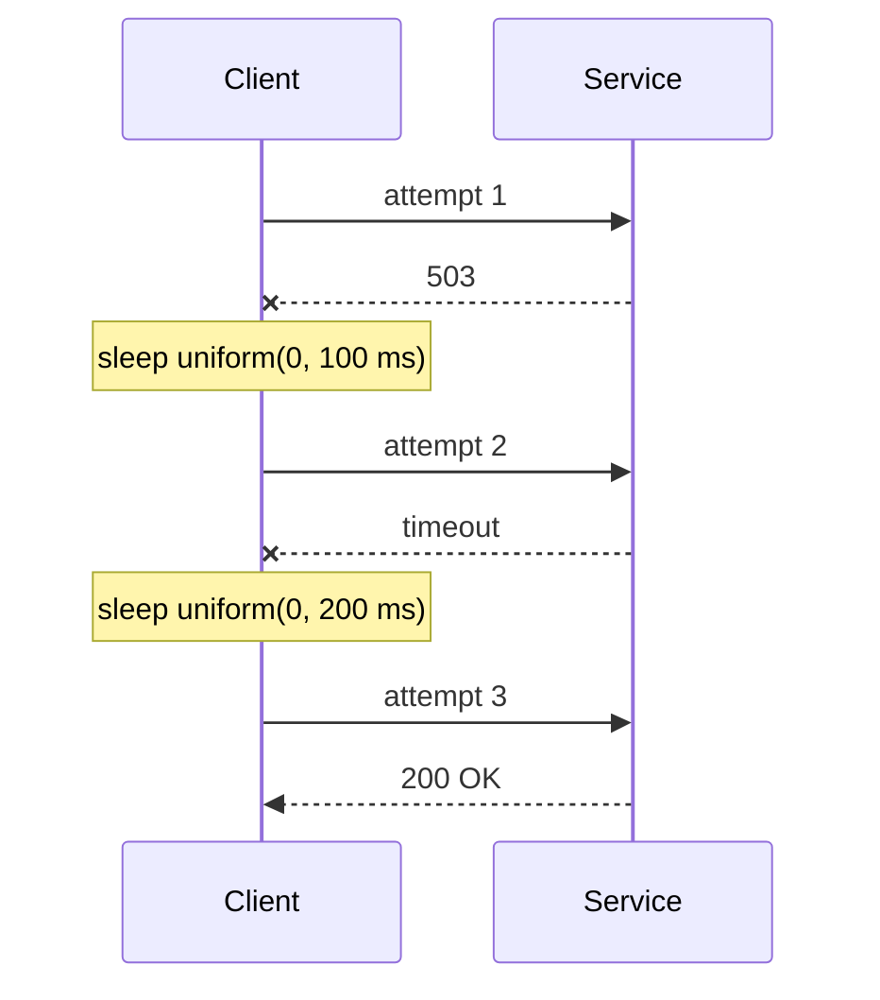
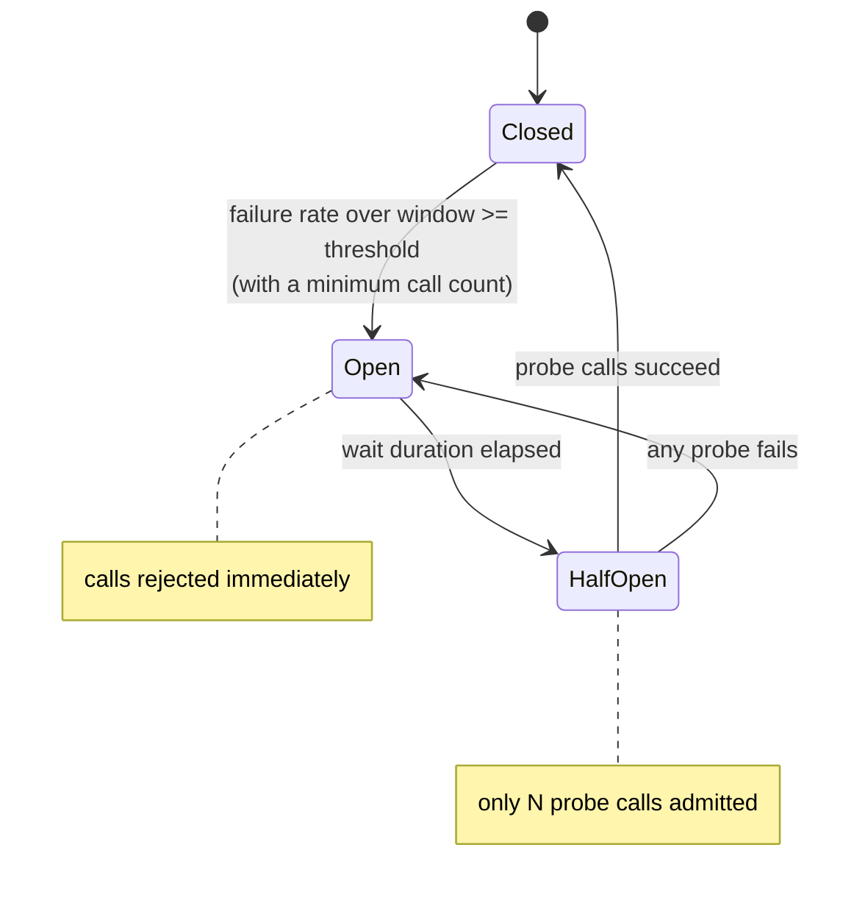
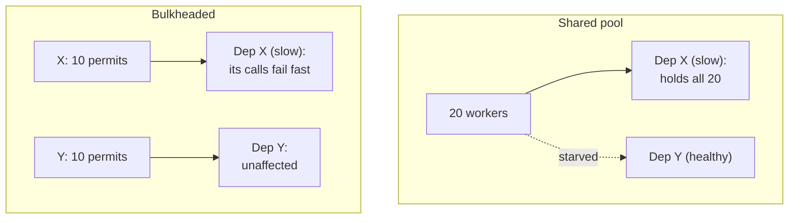
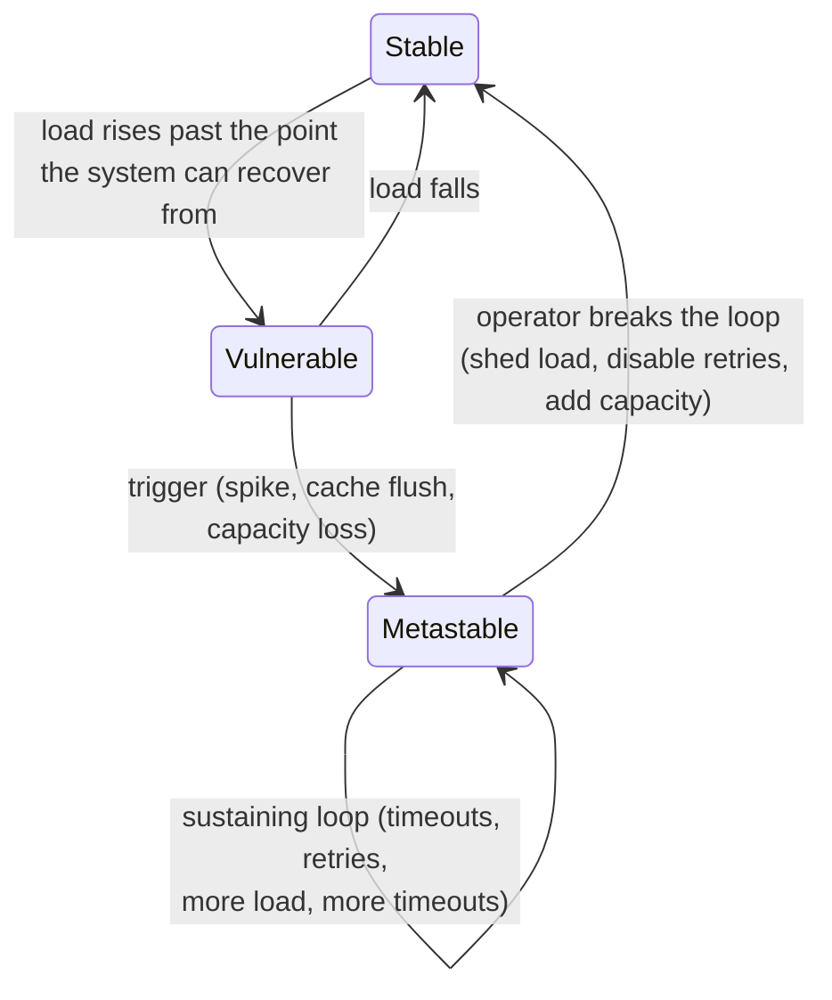
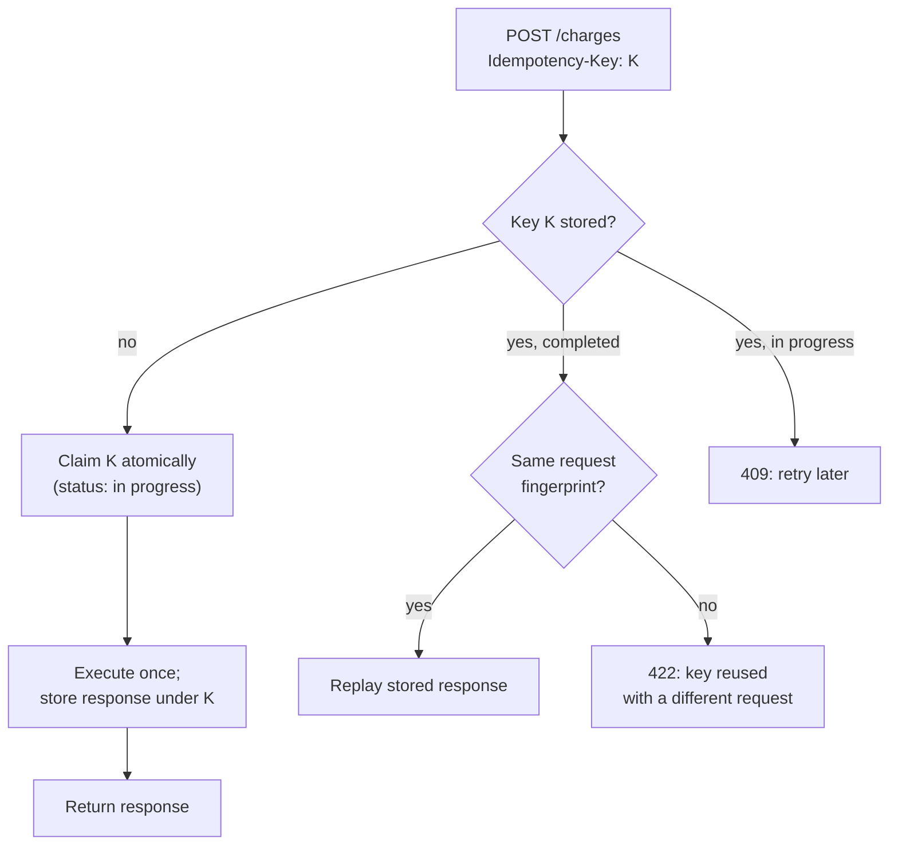
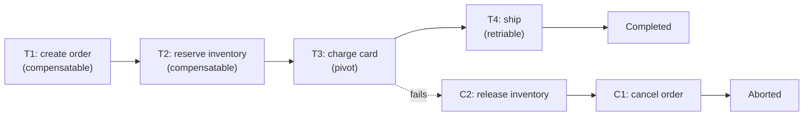
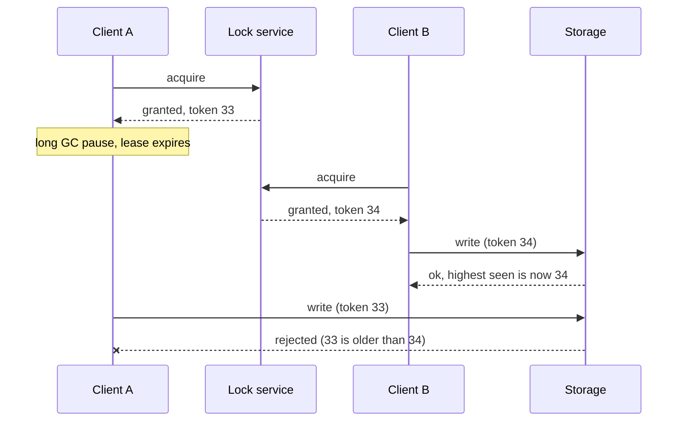
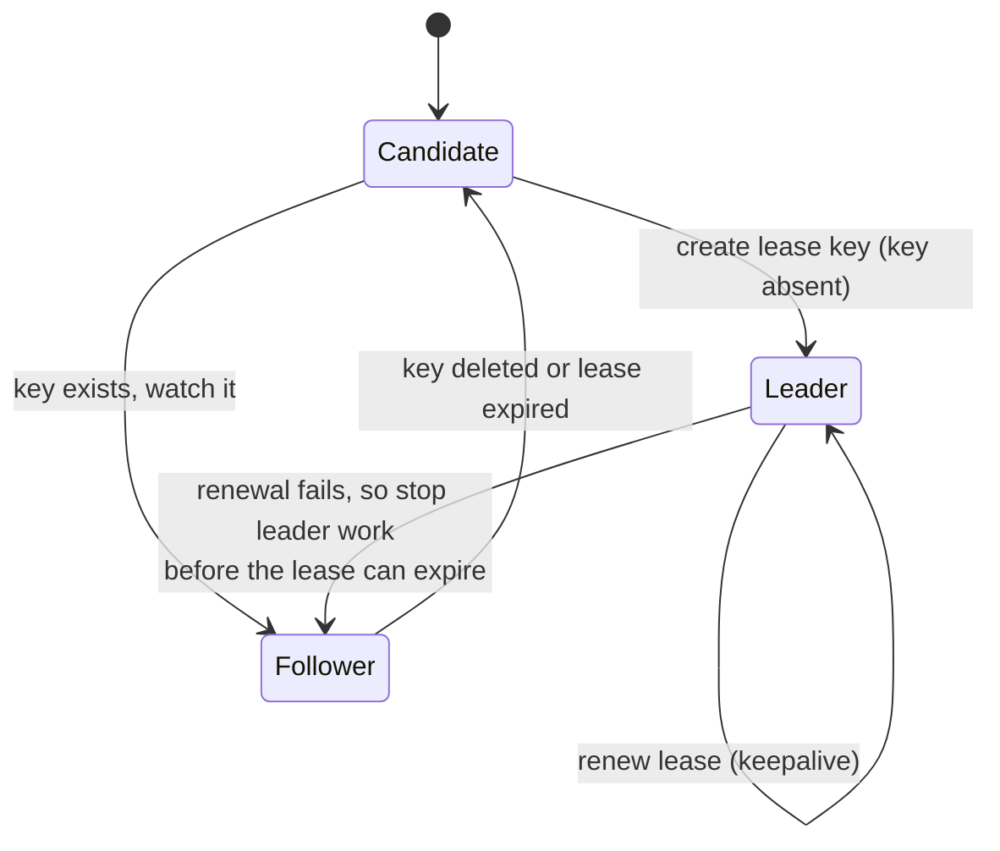

[Distributed Systems](./) &raquo; Resilience Patterns

In a distributed system, partial failure is the normal condition. Networks drop packets, dependencies slow down, processes crash partway through an operation, and load arrives in bursts. **Resilience patterns** are the standard techniques for keeping those failures contained: a slow dependency costs a few failed requests instead of an outage. This page describes each pattern, what failure it addresses, how to configure it, and how the patterns fit together. Code samples are short Python sketches. Production code should use a maintained library, and the relevant ones are named in each section.

## Table of contents
{: .no_toc .text-delta }

1. TOC
{:toc}

---

## Failure Modes and the Patterns That Address Them

A local function call either returns or throws. A remote call can succeed, fail, hang, succeed with the response lost, or partly complete, and the caller often cannot tell which happened. (The [Two Generals and FLP results](../advanced/distributed-systems-theory/) show that this uncertainty cannot be engineered away.) Each pattern below handles one part of the problem.

| Failure mode | Pattern | Section |
|--------------|---------|---------|
| A call hangs and holds resources | Timeouts and deadlines | [Timeouts](#timeouts-and-deadlines) |
| A transient error (packet loss, restart, leader change) | Retry with backoff and jitter | [Retries](#retries-backoff-and-jitter) |
| Callers keep sending traffic to a failing dependency | Circuit breaker | [Circuit breakers](#circuit-breakers) |
| One slow dependency exhausts shared threads or connections | Bulkhead, concurrency limit | [Bulkheads](#bulkheads-and-concurrency-limits) |
| More work arrives than the service can handle | Load shedding, backpressure | [Overload](#overload-load-shedding-and-metastable-failures) |
| Traffic is routed to broken instances | Health checks | [Health checks](#health-checks) |
| A retried request executes twice | Idempotency keys | [Idempotency](#idempotency) |
| A multi-service operation fails partway through | Saga with compensations | [Sagas](#the-saga-pattern-and-compensation) |
| Two workers do the same exclusive work | Distributed lock with fencing | [Locks](#distributed-locks) |
| Two nodes both act as the single coordinator | Leader election | [Leader election](#leader-election) |
| A non-critical dependency fails the whole request | Fallbacks, graceful degradation | [Degradation](#graceful-degradation) |

The patterns are layered around each outbound call. The ordering below, from outermost to innermost, is the one .NET's standard resilience handler (`Microsoft.Extensions.Http.Resilience`) uses, with a fallback added on the outside:



Retry wraps the circuit breaker, so every attempt is counted by the breaker, and once the breaker opens, further retries fail immediately instead of reaching the dependency. The total timeout wraps the retry loop, so retries can never exceed the caller's deadline. The fallback is outermost and runs when everything else has given up. Libraries differ: resilience4j's documented decorator order, for example, puts the time limiter and bulkhead inside the breaker. The rule that matters is that each layer's behavior is predictable when an inner layer fails.

## Timeouts and Deadlines

A call without a timeout can wait forever while holding a thread, a connection, and memory. It is the most common way a slow dependency becomes an outage, so every network call needs one.

- **Set separate connect and request timeouts.** A connection attempt to a dead host should fail within tens or hundreds of milliseconds. The request timeout depends on the operation.
- **Derive the value from measured latency.** Start near the dependency's p99.9 latency plus a margin. Set it lower and healthy-but-slow requests fail and get retried. Set it higher and a hung dependency holds resources for longer.
- **Propagate a deadline instead of stacking timeouts.** When A calls B, which calls C, each service should know how much of the original caller's time budget remains. gRPC does this natively: a client deadline travels in the `grpc-timeout` header and each hop sees the remaining time. With HTTP, pass the deadline in a header and check it before starting expensive work. Work whose caller has already given up is wasted work.
- **Cancel on timeout.** Timing out without cancelling the in-flight operation (closing the stream or aborting the query) leaves it consuming resources.

```python
import asyncio, time

async def call_with_deadline(fn, deadline: float, *args):
    """Run fn within the remaining budget of an absolute deadline (monotonic seconds)."""
    remaining = deadline - time.monotonic()
    if remaining <= 0:
        raise TimeoutError("deadline already exceeded; skip the call")
    # wait_for cancels the call when the budget runs out
    return await asyncio.wait_for(fn(*args), timeout=remaining)
```

## Retries, Backoff, and Jitter

Many failures are transient: a dropped packet, a pod restarting, a leader election in progress. Retrying often succeeds. Retries also add load at the moment a dependency is struggling, and synchronized retries from many clients arrive as a **thundering herd** that can keep a recovering service down.

A well-behaved retry policy has five parts.

1. **Bounded attempts.** Usually two or three in total, so failures surface.
2. **Exponential backoff.** Each wait is longer than the last, which gives the dependency time to recover. With `base` the initial delay and `n` the zero-based attempt number:

   $$
   \text{delay}(n) = \min\left(\text{cap},\; \text{base} \cdot 2^{n}\right)
   $$

3. **Jitter.** Randomizing each wait keeps clients from retrying in lockstep. *Full jitter*, recommended by the AWS Architecture Blog's analysis of backoff strategies, draws the sleep uniformly from zero to the backoff ceiling:

   $$
   \text{sleep}(n) \sim \mathrm{Uniform}\left(0,\; \min\left(\text{cap},\; \text{base} \cdot 2^{n}\right)\right)
   $$

4. **A retry budget.** Limit retries to a fraction of total traffic (for example 10%) instead of a fixed count per request. A per-request limit still triples the load in a full outage. A budget caps the extra load at the chosen fraction, however bad the outage. gRPC's retry throttling, Envoy's retry budgets, Finagle, and the AWS SDKs' "standard" retry mode (a token bucket that retries draw from) all use this approach.
5. **Respect server signals.** Honor `Retry-After` on `429 Too Many Requests` and `503 Service Unavailable`. Do not retry other 4xx responses (except `408 Request Timeout`), which will fail the same way every time.



```python
import asyncio, random

class RetryBudget:
    """Token bucket: each request earns `ratio` tokens and each retry spends one,
    so retries stay under roughly `ratio` of traffic (plus a small burst)."""
    def __init__(self, ratio=0.1, max_tokens=10.0):
        self.ratio, self.max_tokens, self.tokens = ratio, max_tokens, max_tokens

    def on_request(self):
        self.tokens = min(self.tokens + self.ratio, self.max_tokens)

    def try_spend(self) -> bool:
        if self.tokens >= 1:
            self.tokens -= 1
            return True
        return False

async def retry(fn, budget: RetryBudget, attempts=3, base=0.1, cap=5.0,
                retryable=(ConnectionError, TimeoutError)):
    budget.on_request()
    for n in range(attempts):
        try:
            return await fn()
        except retryable:
            if n == attempts - 1 or not budget.try_spend():
                raise
            await asyncio.sleep(random.uniform(0, min(cap, base * 2 ** n)))
```

**Retry only what is safe to repeat.** Retrying a non-idempotent write (charging a card, appending to a ledger) can apply it twice, so [idempotency](#idempotency) has to come first.

**Retry at one layer.** If every hop in a call chain retries, the attempts multiply. With $a$ attempts per layer and $d$ layers, one user request can generate up to

$$
a^{d}
$$

calls to the deepest service. Three attempts at each of four layers gives 81. Retry at the edge or in one client library, and have inner layers fail fast.

**Hedged requests** address tail latency rather than failures. If the first request has not answered by roughly the p95 latency, send a second copy to another replica and use whichever answers first. Dean and Barroso's "The Tail at Scale" (2013) showed this cuts tail latency sharply for about 5% extra load. Hedge only idempotent reads.

## Circuit Breakers

A **circuit breaker** watches calls to a dependency and, once too many fail, stops sending them for a while. Calls then fail immediately instead of queuing behind a dependency that is already struggling. This protects the caller's threads and connections and gives the dependency room to recover.



- **Closed:** calls pass through, and outcomes are recorded in a sliding window (the last $n$ calls, or the last $t$ seconds).
- **Open:** calls are rejected immediately (or sent to a fallback) for a wait duration.
- **Half-open:** a small, fixed number of probe calls go through. If they succeed, the breaker closes. If any fails, it opens again.

**Configuration.** Trip on a failure *rate* over a window with a minimum call count (for example, at least 20 calls with 50% failing), not on a count of consecutive failures, so one burst on a quiet endpoint does not trip it. Count slow calls as failures: resilience4j has a slow-call-rate threshold for this, because a dependency that answers in 30 seconds causes as much damage as one that errors. Keep one breaker per dependency, or per endpoint where endpoints fail independently. Exclude client errors (4xx) from the failure count.

```python
import time

class CircuitOpen(Exception):
    pass

class CircuitBreaker:
    def __init__(self, window=20, min_calls=10, failure_rate=0.5,
                 open_seconds=30, probes=3):
        self.window, self.min_calls, self.rate = window, min_calls, failure_rate
        self.open_seconds, self.probes = open_seconds, probes
        self.state, self.results, self.opened_at, self.in_flight = "closed", [], 0.0, 0

    async def call(self, fn, *args):
        if self.state == "open":
            if time.monotonic() - self.opened_at < self.open_seconds:
                raise CircuitOpen()
            self.state, self.in_flight = "half_open", 0
        if self.state == "half_open":
            if self.in_flight >= self.probes:
                raise CircuitOpen()          # admit only a few probes
            self.in_flight += 1
        try:
            result = await fn(*args)
        except Exception:
            self._record(False)
            raise
        self._record(True)
        return result

    def _record(self, ok: bool):
        if self.state == "half_open":
            if not ok:
                self._trip()
            elif (self.in_flight := self.in_flight - 1) == 0:
                self.state, self.results = "closed", []
            return
        self.results = (self.results + [ok])[-self.window:]
        failures = self.results.count(False)
        if len(self.results) >= self.min_calls and failures / len(self.results) >= self.rate:
            self._trip()

    def _trip(self):
        self.state, self.opened_at, self.results = "open", time.monotonic(), []
```

**Libraries.** Netflix Hystrix has been in maintenance mode since 2018, and Spring Cloud removed it in 2020. Current options:

| Ecosystem | Library |
|-----------|---------|
| Java / Kotlin | resilience4j (circuit breaker, retry, bulkhead, rate limiter, time limiter) |
| .NET | Polly v8 resilience pipelines; `Microsoft.Extensions.Http.Resilience` |
| Go | `sony/gobreaker`; `failsafe-go` |
| Python | `pybreaker`, `circuitbreaker`, `tenacity` (retries) |
| Service mesh / proxy | Envoy outlier detection and circuit-breaking thresholds, as configured through Istio `DestinationRule` or Linkerd |

A mesh-level breaker ejects individual unhealthy *hosts* from the load-balancing pool, which is different from an in-process breaker that trips on the *whole dependency*. Using both is common.

## Bulkheads and Concurrency Limits

The name comes from the watertight compartments in a ship's hull, which keep one breach from flooding the whole ship. A software **bulkhead** gives each dependency its own share of the service's limited resources (worker threads, connection-pool slots, concurrency permits) so that one slow dependency cannot use them all.

The failure it prevents: Service A calls a slow dependency X and a healthy dependency Y from one shared pool of 20 workers. X slows down, every worker ends up blocked on X, and calls to Y start failing even though Y is fine. With separate pools, only X's calls fail.



```python
import asyncio

class BulkheadFull(Exception):
    pass

class Bulkhead:
    """Cap concurrent calls into one dependency, with a small bounded wait queue."""
    def __init__(self, max_concurrent=10, max_waiting=0):
        self._sem = asyncio.Semaphore(max_concurrent)
        self._max_waiting, self._waiting = max_waiting, 0

    async def run(self, fn, *args):
        if self._sem.locked() and self._waiting >= self._max_waiting:
            raise BulkheadFull()            # reject rather than queue without bound
        self._waiting += 1
        try:
            await self._sem.acquire()
        finally:
            self._waiting -= 1
        try:
            return await fn(*args)
        finally:
            self._sem.release()

payments = Bulkhead(max_concurrent=10)
inventory = Bulkhead(max_concurrent=20, max_waiting=5)
```

**Sizing.** Little's Law gives the concurrency a dependency needs at a target throughput $\lambda$ and latency $L$:

$$
\text{concurrency} = \lambda \cdot L
$$

At 200 requests per second and 50 ms, that is 10 permits. Add headroom for latency variance, but not so much that one dependency can take most of the service's capacity.

**Adaptive concurrency limits** remove the need to guess. Following TCP congestion control, the limit rises while latency stays near its minimum and falls when latency increases, which indicates queuing. Netflix's `concurrency-limits` library and Envoy's adaptive concurrency filter do this. Fixed bulkheads also exist at the infrastructure level: Kubernetes CPU and memory limits, separate connection pools per database, and Envoy's `maxConnections` and `maxPendingRequests`.

## Overload: Load Shedding and Metastable Failures

A service offered more work than it can handle should reject the excess quickly rather than accept everything and slow down for everyone. Queuing under overload is the worst option: latency grows without limit, callers time out, work is completed for clients that are no longer waiting, and throughput collapses.

- **Load shedding.** When a utilization signal (in-flight requests, queue delay, CPU) crosses a threshold, reject new requests at the door with `503` or `429`. Rejecting 10% of requests quickly is better than serving 100% slowly.
- **Priority-aware shedding.** Tag requests by criticality (user-facing checkout above background batch jobs above prefetch) and shed from the bottom. Google's SRE practice and Envoy's overload manager both work this way.
- **Queue-age limits.** Drop queued requests older than the client's timeout, and consider LIFO service under overload so the newest requests, whose callers are still waiting, are served first.
- **Backpressure.** In streaming and messaging systems, a slow consumer should slow the producer (bounded queues, reactive-streams demand signalling, gRPC flow control) instead of buffering without limit.
- **Rate limiting.** A per-client token bucket stops a single tenant from causing overload. It complements load shedding, which protects the server regardless of who sends the traffic.

**Metastable failures** are the failure mode these techniques exist for. A trigger such as a load spike, a cache flush, or a brief capacity loss pushes the system into a degraded state. A feedback loop then keeps it there after the trigger is gone. In the most common loop, requests time out, clients retry, the retries add load, and more requests time out. Huang et al. ("Metastable Failures in the Wild", OSDI 2022) studied 22 such incidents at 11 organizations and found retry amplification to be the sustaining effect in more than half.



The defenses are the patterns on this page applied together: retry budgets (not just retry counts), load shedding at the server, circuit breakers at the client, cache designs that tolerate a cold start (request coalescing, serving stale data), and running well below the capacity from which the system can still recover.

## Health Checks

A **health check** is an endpoint that lets an orchestrator or load balancer decide what to do with an instance: route traffic to it, stop routing to it, or restart it. There are three kinds, and conflating them causes outages.

| Probe | Question | Action on failure | Check dependencies? |
|-------|----------|-------------------|---------------------|
| Liveness | Is this process stuck (deadlocked, wedged event loop)? | Restart the container | **No** |
| Readiness | Should this instance receive traffic now? | Remove it from load balancing; do not restart | Only what is specific to this instance |
| Startup | Has slow initialization finished? | Hold off liveness and readiness checks until it has | Initialization steps only |

**Never check shared dependencies in liveness.** If liveness checks the database and the database has a problem, every pod fails liveness at once and Kubernetes restarts all of them. A dependency outage the service could have survived becomes a full outage caused by the restarts.

**Be careful with shared dependencies in readiness, too.** If every replica reports not-ready when the shared database is down, the Service has no endpoints and clients get connection errors instead of a fast, meaningful `503` or a degraded response. Readiness should reflect whether *this instance* can serve: warm-up complete, not draining, its own connection pool healthy. Handle shared-dependency outages with circuit breakers and fallbacks.

**Readiness also controls graceful shutdown.** On `SIGTERM`, stop reporting ready, keep serving in-flight and newly routed requests for a few seconds while endpoint removal propagates to load balancers (a `preStop` sleep is the usual approach), then drain and exit before `terminationGracePeriodSeconds` expires.

```python
from flask import Flask, jsonify

app = Flask(__name__)
state = {"started": False, "draining": False}

@app.get("/livez")      # liveness: the process can respond at all
def livez():
    return jsonify(status="ok")

@app.get("/readyz")     # readiness: this instance should receive traffic
def readyz():
    if not state["started"] or state["draining"] or not local_pool_healthy():
        return jsonify(status="not_ready"), 503
    return jsonify(status="ready")

@app.get("/startupz")   # startup: initialization finished
def startupz():
    return (jsonify(status="started"), 200) if state["started"] else (jsonify(status="starting"), 503)
```

```yaml
startupProbe:
  httpGet: { path: /startupz, port: 8080 }
  periodSeconds: 5
  failureThreshold: 30        # up to 150 s to start before liveness takes over
livenessProbe:
  httpGet: { path: /livez, port: 8080 }
  periodSeconds: 10
  failureThreshold: 3
readinessProbe:
  httpGet: { path: /readyz, port: 8080 }
  periodSeconds: 5
  failureThreshold: 2
lifecycle:
  preStop:
    sleep: { seconds: 5 }     # let endpoint removal propagate before shutdown
```

Kubernetes also supports native gRPC probes (`grpc:` with a port), which call the standard `grpc.health.v1.Health` service, so gRPC servers do not need an HTTP sidecar endpoint. The `sleep` action for `preStop` is a newer built-in. On older clusters, use `exec` with a `sleep` command. Health checks also drive [service discovery](service-discovery.html#health-checking-integration): an instance that fails readiness is removed from the endpoints that callers see.

## Idempotency

An operation is **idempotent** if performing it several times has the same effect as performing it once. Retries, at-least-once message delivery, and saga compensations all depend on it. A caller whose request timed out cannot know whether the request executed, so it must be able to send it again safely.

Some operations are idempotent by nature: `SET balance = 100`, `DELETE /users/42`, a `PUT` of a full resource. Others are not: `balance += 50`, "send email", "charge card", a `POST` that creates a resource. For those, the client attaches an **idempotency key**, a unique identifier for the *logical* operation, and the server stores the outcome under that key.



```python
import hashlib, json

class IdempotencyStore:
    """First request with a key executes; repeats replay the stored response."""
    def __init__(self, redis, ttl=24 * 3600):
        self.redis, self.ttl = redis, ttl

    async def execute_once(self, key: str, request_body: dict, operation):
        k = f"idem:{key}"
        fingerprint = hashlib.sha256(json.dumps(request_body, sort_keys=True).encode()).hexdigest()
        claim = json.dumps({"state": "pending", "fp": fingerprint})
        if not await self.redis.set(k, claim, nx=True, ex=self.ttl):
            stored = json.loads(await self.redis.get(k))
            if stored["fp"] != fingerprint:
                raise ValueError("idempotency key reused with a different request")  # 422
            if stored["state"] == "pending":
                raise RuntimeError("request in progress")                             # 409
            return stored["response"]
        try:
            response = await operation()
        except Exception:
            await self.redis.delete(k)      # let a retry run it again
            raise
        await self.redis.set(k, json.dumps({"state": "done", "fp": fingerprint,
                                            "response": response}), ex=self.ttl)
        return response
```

**Practical notes.**

- **Clients generate the key**, for example a UUID per user action. Retries of that action reuse the key, and a new action gets a new one.
- **Record the key in the same transaction as the side effect** where possible (a row in the same database), so a crash between doing the work and recording the key cannot cause a second execution. A separate Redis store, as in the sketch, leaves that window open.
- **Standards.** Stripe popularized the `Idempotency-Key` header, and many payment APIs use it. The IETF HTTPAPI working group's `draft-ietf-httpapi-idempotency-key-header` standardizes it but was still an Internet-Draft as of late 2025.
- **Message consumers** get the same effect by recording each processed message ID in the same transaction as the consumer's state change (the *inbox* pattern), which gives effectively-once processing on top of at-least-once delivery. See [Event-Driven Patterns](../event-driven/patterns.html).

## The Saga Pattern and Compensation

A single ACID transaction cannot span several services' databases, and two-phase commit blocks when its coordinator fails. A **saga** replaces the distributed transaction with a sequence of local transactions, one per service. Each step $T_i$ has a **compensating action** $C_i$ that semantically undoes it. If step $T_{k+1}$ fails, the saga runs $C_k, \ldots, C_1$ in reverse order.

A compensation is not a rollback, because the local transaction has already committed. It is a new business action that counteracts the first: a refund rather than an "un-charge", a cancellation notice rather than an "un-send". Other transactions can see the intermediate states, so sagas are eventually consistent rather than isolated.



**Order the steps by reversibility.** Chris Richardson's taxonomy classifies steps as follows:

- **Compensatable** steps can be undone. They go first.
- The **pivot** step is the point of no return. If it succeeds, the saga will complete.
- **Retriable** steps come after the pivot and must eventually succeed, so they are retried until they do.

In the diagram, inventory is *reserved* before the card is charged and shipping happens last, because a reservation can be released but a shipped package cannot be recalled.

**Coordination styles.**

- **Orchestration.** A coordinator issues each step and runs compensations on failure. Saga state lives in one place, which makes it easier to observe and debug.
- **Choreography.** Each service reacts to the previous service's events. Coupling is lower, but the saga's logic is spread across services.

**Durable execution** engines such as Temporal, Restate, DBOS, AWS Step Functions, and Azure Durable Functions have become the usual way to run orchestrated sagas. They persist workflow state after every step, so a crashed orchestrator resumes where it stopped instead of leaving a half-compensated transaction. See [Microservices and Event-Driven Architecture](microservices-and-event-driven.html#durable-execution).

```python
class SagaFailed(Exception):
    pass

async def run_saga(steps, ctx: dict):
    """steps: list of (action, compensation) coroutines taking a shared context.
    A real orchestrator persists `done` after each step so it can resume after a crash."""
    done = []
    for action, compensate in steps:
        try:
            await action(ctx)          # e.g. sets ctx["order_id"], ctx["charge_id"]
            done.append(compensate)
        except Exception as exc:
            for comp in reversed(done):
                await retry_forever(comp, ctx)   # compensations must eventually succeed
            raise SagaFailed() from exc

steps = [
    (create_order,      cancel_order),
    (reserve_inventory, release_inventory),
    (charge_card,       refund_card),      # pivot: nothing after it compensates
    (ship_order,        None),             # retriable, never compensated
]
```

**Compensations must be idempotent and retriable.** A compensation can fail or run twice, so `refund_card` must look up the charge by its ID and do nothing if the refund already exists. Because sagas are not isolated, add countermeasures where intermediate states cause harm. A *semantic lock*, for example, marks an order `PENDING` so other operations treat it with care until the saga ends. [Distributed Transactions](../technology/database-design/distributed-transactions.html) and [Event-Driven Patterns](../event-driven/patterns.html#the-saga-pattern) cover the pattern from the database and event-driven perspectives.

## Distributed Locks

A **distributed lock** gives mutual exclusion across machines: at most one holder at a time. Locks are used to stop two workers from doing the same job, to serialize access to an external resource, or to protect an operation that cannot be made idempotent.

A usable distributed lock needs three properties:

1. **Mutual exclusion:** at most one holder at a time, as far as the lock service knows.
2. **Liveness:** a crashed holder cannot block everyone forever. Locks are **leases** with a TTL.
3. **Safe release:** a holder may delete only its own lock, never one that expired and was granted to someone else. This needs a unique token per acquisition and an atomic compare-and-delete.

```python
import uuid

RELEASE = """
if redis.call('get', KEYS[1]) == ARGV[1] then
  return redis.call('del', KEYS[1])
end
return 0
"""

class RedisLease:
    def __init__(self, redis, key, ttl_ms=10_000):
        self.redis, self.key, self.ttl_ms = redis, key, ttl_ms
        self.token = str(uuid.uuid4())

    def acquire(self) -> bool:
        # SET NX PX: create only if absent, with an expiry
        return bool(self.redis.set(self.key, self.token, nx=True, px=self.ttl_ms))

    def release(self) -> bool:
        # Atomic compare-and-delete in Lua: never delete someone else's lease
        return self.redis.eval(RELEASE, 1, self.key, self.token) == 1
```

(`redis-py` ships an equivalent `redis.lock.Lock`. The same code works against Valkey, the Linux Foundation fork of Redis.)

**Leases alone are not safe.** Suppose the holder pauses (a GC pause, VM migration, or page fault) for longer than the TTL. The lease expires, a second client acquires it, and the first client resumes and writes while still believing it holds the lock. No lease-based lock prevents this on its own. The fix is a **fencing token**: the lock service issues a number that increases with every grant, the client sends it with each write, and the protected resource rejects any token lower than the highest it has already seen.



Choosing a lock service:

| Option | Safety | Notes |
|--------|--------|-------|
| Single Redis/Valkey node | Efficiency only | Fast; a failover to an async replica can hand the same lock to two clients. Fine for deduplicating best-effort work. |
| Redlock (majority of independent Redis nodes) | Disputed | Kleppmann's 2016 critique argued it depends on timing assumptions and provides no fencing tokens; Sanfilippo (antirez) disputed this. Avoid it where correctness matters. |
| etcd, ZooKeeper, Consul | Correctness | Linearizable, lease-based. etcd's revision number, ZooKeeper's `zxid`, and a Consul session's lock index can serve as fencing tokens. |
| Database locks (PostgreSQL `pg_advisory_lock`, `SELECT ... FOR UPDATE`) | Correctness within that database | Often the simplest choice when the protected state lives in the same database. |
| Conditional writes (DynamoDB condition expressions, S3 `If-None-Match` and `If-Match`, added in 2024) | Correctness | Compare-and-set on the storage itself, usable for leases and leader election without running a coordinator. |

The most robust option is to make the protected operation [idempotent](#idempotency) or version-checked on the storage side, so an occasional double acquisition does no harm.

## Leader Election

Many tasks need exactly one active instance: one scheduler so cron jobs do not run twice, one writer per partition, one controller reconciling a resource. **Leader election** chooses that instance and replaces it automatically when it fails. In effect it is a distributed lock that is held continuously: the leader holds a lease and renews it, and when renewal stops because of a crash or partition, another candidate takes over.



Use a coordination service rather than writing the election logic yourself. etcd's Go client provides a ready-made election built on a lease and an atomic create-if-absent transaction:

```go
import (
    "context"

    clientv3 "go.etcd.io/etcd/client/v3"
    "go.etcd.io/etcd/client/v3/concurrency"
)

func runForLeader(ctx context.Context, cli *clientv3.Client, id string, lead func(context.Context)) error {
    sess, err := concurrency.NewSession(cli, concurrency.WithTTL(10)) // lease, kept alive automatically
    if err != nil {
        return err
    }
    defer sess.Close()

    e := concurrency.NewElection(sess, "/election/scheduler")
    if err := e.Campaign(ctx, id); err != nil { // blocks until this node is leader
        return err
    }
    leaderCtx, cancel := context.WithCancel(ctx)
    go func() { <-sess.Done(); cancel() }() // lease lost: stop acting as leader
    lead(leaderCtx)
    return e.Resign(context.Background())
}
```

On Kubernetes, controllers use **Lease** objects (`coordination.k8s.io/v1`) through client-go's `leaderelection` package, which is how `kube-controller-manager`, `kube-scheduler`, and most operators ensure only one active replica. Coordinated leader election, which lets the control plane choose among `LeaseCandidate` objects and prefer the oldest version during upgrades, was beta as of Kubernetes 1.33.

**Split brain.** A leader cut off by a partition may keep acting as leader until it notices its lease has expired, and by then a new leader may already exist. Two safeguards are needed:

- Require a **majority** to win, so a minority partition cannot elect a leader. Consensus-backed stores do this for you.
- Use the leader's term or lease revision as a **fencing token** on every write, as in [Distributed Locks](#distributed-locks), so the deposed leader's writes are rejected.

A leader should also stop leader work *before* its lease could have expired, allowing for clock drift. Raft and Paxos handle election inside the protocol with terms and majority votes. See [Consensus and Coordination](consensus-and-coordination.html#leader-election).

## Graceful Degradation

**Graceful degradation** means that under stress or partial failure, a system gives up quality before it gives up service, returning a slightly worse response instead of an error page.

Tactics:

- **Fallbacks.** When a breaker is open or a call fails, return a cached value, a default, or a reduced response. A product page can still show without its "customers also bought" panel.
- **Serve stale data.** Slightly stale cached data is usually better than none. HTTP's `stale-if-error` and `stale-while-revalidate` cache directives (RFC 5861) express this for CDNs and proxies.
- **Kill switches.** Feature flags that turn off expensive, non-essential features (personalization, live recommendations) under load to protect the core path.
- **Reduced fidelity.** Lower-resolution images, fewer search results, approximate counts.
- **Static fallback.** A cached or static version of the page served from the CDN when the origin is down.

```python
async def recommendations(user_id, breaker, cache):
    """A non-critical dependency: degrade instead of failing the page."""
    try:
        return await breaker.call(fetch_personalized, user_id)
    except (CircuitOpen, TimeoutError, ConnectionError):
        if (cached := await cache.get(f"recs:{user_id}")) is not None:
            return cached              # stale but useful
        return POPULAR_ITEMS           # generic fallback
```

Classify every dependency as **critical** (its failure must surface: checkout cannot succeed if payment is down) or **non-critical** (its failure must be hidden: a recommendations outage should not affect checkout). Build and test the fallback path before an incident needs it. An untested fallback often fails when first used, for example because it depends on the same cache that just went down.

## Combining the Patterns

| Pattern | Protects against | Depends on |
|---------|------------------|------------|
| Timeout / deadline | Hung calls holding resources | None; everything else relies on it |
| Retry with backoff, jitter, budget | Transient failures | Idempotency; timeouts |
| Circuit breaker | Repeated calls to a failing dependency | Timeouts, so slow calls count as failures |
| Bulkhead / concurrency limit | One dependency using all shared capacity | Sizing from measured latency |
| Load shedding | Overload collapse; metastable states | A cheap, early rejection path |
| Health checks | Routing to broken instances; restart loops | Correct liveness/readiness split |
| Idempotency | Duplicate execution from retries and redelivery | Durable key storage |
| Saga | Half-finished multi-service operations | Idempotent compensations; durable state |
| Distributed lock | Concurrent exclusive work | Leases plus fencing tokens |
| Leader election | Two coordinators at once | Majority quorum; fencing |
| Graceful degradation | Partial failure becoming total failure | Breakers and timeouts to detect failure quickly |

A reasonable default for any outbound call: a per-attempt **timeout**, a **circuit breaker**, a budgeted **retry with jitter** (only if the operation is idempotent), an overall **deadline**, a **concurrency limit**, and a **fallback** where the dependency is non-critical. Then check that the combination behaves as intended under injected faults (see [chaos engineering](testing-distributed-systems.html#chaos-engineering)), and watch breaker state, retry rate, and shed-request counts on the service's [dashboards](observability.html).

## See Also

- [Distributed Systems Hub](./): overview of the section
- [Failure Detection](failure-detection.html): heartbeats, timeouts, and phi-accrual detectors behind "is it dead?"
- [Testing Distributed Systems](testing-distributed-systems.html): fault injection, chaos engineering, and load testing
- [Microservices and Event-Driven Architecture](microservices-and-event-driven.html): where these patterns sit in a service architecture
- [Service Discovery](service-discovery.html): health checks feeding the registry
- [Distributed Transactions](../technology/database-design/distributed-transactions.html): 2PC, sagas, outbox, and idempotency keys from the database side
- [Distributed Systems Theory](../advanced/distributed-systems-theory/): the impossibility results these patterns work around
- [Kubernetes](../technology/kubernetes/): probes, resource limits, and Lease-based leader election in practice
