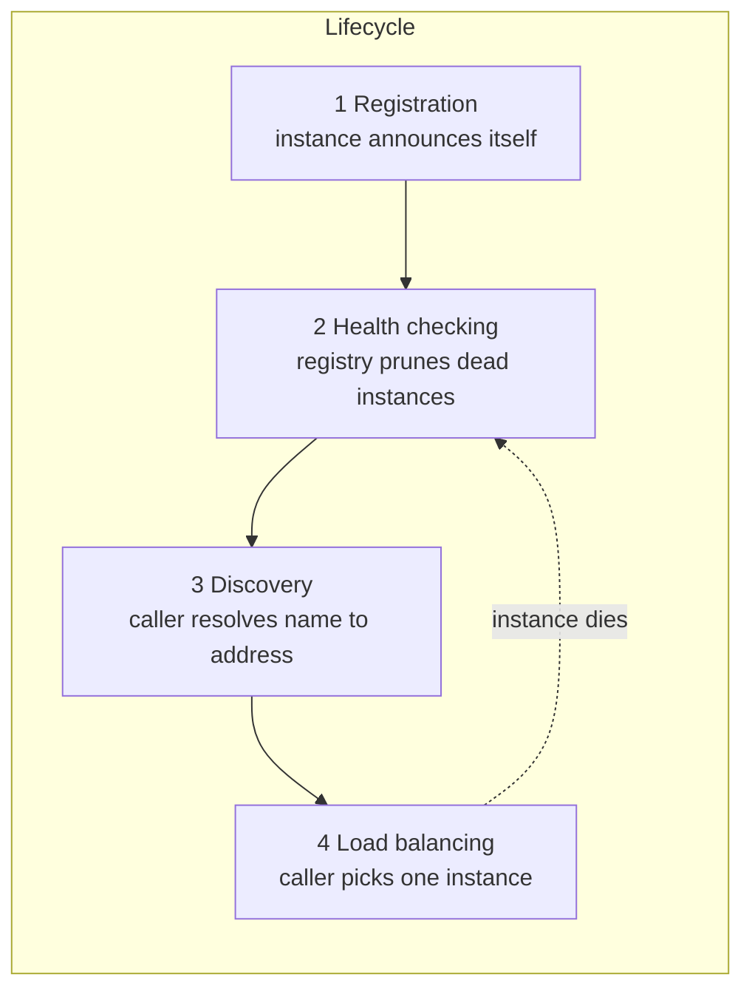
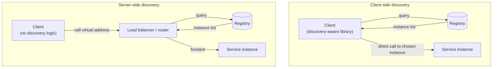
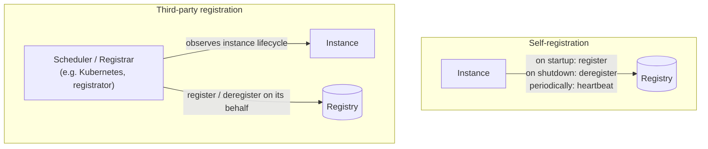
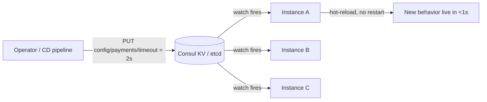

[Distributed Systems](./) &raquo; Service Discovery &amp; Configuration

How services find each other, stay healthy, and absorb configuration changes without a redeploy.

## Why Service Discovery Exists

In a monolith, calling another component is a function call — the callee's address is its memory location, resolved by the linker. In a distributed system, the "callee" is a *fleet* of process instances scattered across hosts, each with an ephemeral IP and port, each able to crash, scale, or migrate at any moment. The fundamental question becomes: **given the logical name of a service, how does a caller obtain a current, healthy network address for an instance of it?**

Hard-coding addresses fails immediately because the address set is *dynamic*:

- **Autoscaling** adds and removes instances minute-to-minute.
- **Schedulers** (Kubernetes, Nomad) move containers between hosts, changing IPs.
- **Failures** make a previously-good address a black hole until it is removed.
- **Deployments** roll instances of a new version in while draining the old.

Service discovery is the indirection layer that decouples a *logical service identity* (`payments`) from its *current physical locations* (`10.4.2.7:8080`, `10.4.5.1:8080`, ...). It rests on three moving parts that recur in every implementation:



A **service registry** is the authoritative database mapping service names to the set of currently-registered instances, their addresses, health status, and metadata. Everything below is a different answer to *who reads the registry* and *who keeps it accurate*.

## Client-Side vs Server-Side Discovery

The first architectural fork is **where the lookup-and-choose logic lives**. This single decision shapes latency, operational surface, and how language-agnostic your platform is.



### Client-Side Discovery

The client queries the registry directly, receives the full list of healthy instances, and applies its own load-balancing algorithm before connecting straight to a chosen instance.

- **Examples:** Netflix Eureka + Ribbon, Consul with a smart client library, gRPC's built-in name resolver + `pick_first`/`round_robin` policies.
- **Pros:** One fewer network hop (no proxy in the data path); the client can make application-aware routing decisions (e.g. zone affinity, request-hashing for cache locality); no shared load-balancer to provision or scale.
- **Cons:** Discovery logic must be implemented per language — a polyglot estate needs a maintained client library for each runtime. Clients are coupled to the registry's API and to the registry being reachable.

```python
# Client-side discovery against a Consul HTTP catalog.
import random
import requests

class ConsulClientDiscovery:
    def __init__(self, consul_addr="http://localhost:8500"):
        self.consul = consul_addr

    def resolve(self, service_name):
        """Return only passing (healthy) instances for a service."""
        r = requests.get(
            f"{self.consul}/v1/health/service/{service_name}",
            params={"passing": "true"},  # filter to checks in 'passing' state
        )
        r.raise_for_status()
        return [
            (e["Service"]["Address"], e["Service"]["Port"])
            for e in r.json()
        ]

    def call(self, service_name, path):
        instances = self.resolve(service_name)
        if not instances:
            raise RuntimeError(f"no healthy instances for {service_name}")
        host, port = random.choice(instances)  # naive client-side LB
        return requests.get(f"http://{host}:{port}{path}")
```

### Server-Side Discovery

The client makes a request to a stable virtual address — a load balancer, reverse proxy, or the platform's router — and that component owns the registry lookup and instance selection.

- **Examples:** A Kubernetes `Service` (kube-proxy / a CNI dataplane resolves the ClusterIP to a pod), an AWS ALB fronting an ECS service, an NGINX/Envoy proxy reading an upstream from Consul.
- **Pros:** Clients stay dumb and language-agnostic — they just call a DNS name or a stable IP. Routing policy is centralized and operated by the platform team. This is the model a **service mesh** generalizes: a per-pod Envoy sidecar performs server-side discovery transparently, so even the "client library" disappears.
- **Cons:** The router is an extra hop and a component that must itself be highly available and scaled. Routing decisions cannot easily use application-specific context the proxy does not see.

In practice modern platforms blur the line: Kubernetes gives you server-side discovery by default (ClusterIP), while a mesh sidecar gives you client-side-style flexibility with server-side-style transparency.

## DNS-Based vs API-Based Discovery

The second fork is the **protocol** the caller uses to read the registry. The two dominant styles are plain DNS and a purpose-built HTTP/gRPC API, and they trade *ubiquity* against *freshness and richness*.

| Dimension | DNS-based | API-based (Consul/etcd) |
|-----------|-----------|-------------------------|
| Client support | Universal — every language and OS resolves DNS | Needs a client library or sidecar |
| Data carried | Address (A/AAAA) + port (SRV); little metadata | Full instance metadata, tags, health, KV |
| Freshness | Bounded by TTL and resolver caching (often stale) | Push/watch updates in milliseconds |
| Health awareness | Usually only healthy records published, but TTL lag | Streaming health state, immediate removal |
| Load balancing | Round-robin by record order; client rarely controls it | Caller sees the list and chooses freely |

### DNS-Based Discovery

The registry exposes itself as a DNS server. A lookup of `payments.service.consul` returns `A` records for healthy instances; an `SRV` lookup additionally returns ports and weights. Kubernetes does the same with `payments.default.svc.cluster.local`.

```bash
# Consul publishes a DNS interface on port 8600.
# A-record lookup: just the addresses of healthy instances.
dig @127.0.0.1 -p 8600 payments.service.consul +short
# 10.4.2.7
# 10.4.5.1

# SRV lookup: address, port, priority and weight together.
dig @127.0.0.1 -p 8600 payments.service.consul SRV +short
# 1 1 8080 ip-10-4-2-7.node.dc1.consul.
# 1 1 8080 ip-10-4-5-1.node.dc1.consul.
```

The appeal is **zero client integration**: any process that can resolve a hostname participates. The cost is **staleness**. DNS was designed for slowly-changing records, so resolvers, language runtimes, and connection pools cache aggressively. A 60-second TTL means a crashed instance can keep receiving traffic for up to a minute, and many JVM/glibc resolvers ignore short TTLs entirely. Mitigations: publish very low TTLs (Consul uses 0 by default for service records), keep healthy-only records, and disable resolver caching where you can — but you can never fully escape the protocol's caching assumptions.

### API-Based Discovery

The caller (or its sidecar) talks to the registry over a rich API and, crucially, can **watch** for changes rather than polling on a TTL. This is how Consul, etcd, and ZooKeeper-based systems achieve sub-second propagation.

The decisive feature is the **blocking query / watch**: the client sends a request carrying the index it last saw, and the server holds the connection open until something changes, then responds immediately. This converts polling into push without sacrificing a simple request/response transport.

```python
# Consul blocking query: long-poll that returns the instant the
# service's instance set changes, not on a fixed timer.
import requests

def watch_service(service_name, consul="http://localhost:8500"):
    index = 0  # Consul's monotonically increasing change index
    while True:
        r = requests.get(
            f"{consul}/v1/health/service/{service_name}",
            params={"passing": "true", "index": index, "wait": "55s"},
            timeout=60,
        )
        new_index = int(r.headers["X-Consul-Index"])
        if new_index != index:           # something actually changed
            index = new_index
            instances = [
                (e["Service"]["Address"], e["Service"]["Port"])
                for e in r.json()
            ]
            yield instances              # push the fresh set to the caller
```

### Consul vs etcd vs ZooKeeper

These are the registries you will actually encounter; they differ in scope and consistency posture.

| System | Consensus | Consistency | Built for | Discovery interface |
|--------|-----------|-------------|-----------|---------------------|
| **etcd** | Raft | Strongly consistent (CP) | A reliable key-value store; the backing store of Kubernetes | gRPC/HTTP KV + lease + watch |
| **Consul** | Raft (server quorum) | CP for the catalog, with an explicit gossip-based health layer | Turnkey service discovery + health + KV + mesh | DNS *and* HTTP API + watch |
| **ZooKeeper** | Zab | Strongly consistent (CP) | Coordination primitives (locks, leader election, ephemeral nodes) | Custom client; ephemeral znodes |

etcd and ZooKeeper are general coordination stores onto which discovery is *built* (an instance writes a key/znode keyed by a lease/session; readers watch the prefix). Consul ships service discovery, health checking, a DNS interface, and a multi-datacenter gossip layer as first-class features, which is why it is the canonical "service discovery" product. All three are **CP** under the [CAP theorem](consensus-and-coordination.html#cap-theorem): during a partition the minority side stops accepting writes to preserve a single consistent view of the registry — the right trade-off, because a registry that returns *contradictory* membership is worse than one that briefly returns *stale-but-consistent* membership. (Eureka deliberately chose AP instead, favoring availability of the registry over strict consistency.)

## Registration: Self vs Third-Party

A registry is only as good as the freshness of its contents, and freshness starts at **registration** — how an instance gets *into* the registry. There are two patterns.



- **Self-registration:** the instance calls the registry's API itself — registering on boot, sending periodic heartbeats tied to a *lease*, and deregistering on graceful shutdown. Simple and requires no extra component, but couples every service to the registry's client API and leaves *stale* entries if a process dies before deregistering (the lease/heartbeat is what eventually cleans those up).
- **Third-party registration:** a separate **registrar** watches instance lifecycles and maintains registry entries on their behalf. Kubernetes is the archetype — the kubelet and endpoints controller register/deregister pod IPs into the cluster's Endpoints/EndpointSlice objects automatically, so application code stays oblivious to discovery entirely. Cleaner separation of concerns at the cost of running and trusting the registrar.

```python
# Self-registration with a lease/TTL so a crashed instance self-expires.
import requests, socket

class SelfRegistration:
    def __init__(self, name, port, consul="http://localhost:8500"):
        self.name, self.port, self.consul = name, port, consul
        self.id = f"{name}-{socket.gethostname()}-{port}"

    def register(self):
        requests.put(f"{self.consul}/v1/agent/service/register", json={
            "ID": self.id,
            "Name": self.name,
            "Address": socket.gethostbyname(socket.gethostname()),
            "Port": self.port,
            "Check": {                       # tie liveness to a TTL check
                "CheckID": f"{self.id}-ttl",
                "TTL": "15s",                # must heartbeat within 15s
                "DeregisterCriticalServiceAfter": "1m",  # reap if dead 1m
            },
        }).raise_for_status()

    def heartbeat(self):
        # Call on a timer < TTL; failing to do so marks the check critical.
        requests.put(f"{self.consul}/v1/agent/check/pass/{self.id}-ttl")

    def deregister(self):
        requests.put(f"{self.consul}/v1/agent/service/deregister/{self.id}")
```

## Health-Checking Integration

Registration gets an instance *in*; health checking keeps the registry *honest* by removing instances that can no longer serve. Discovery without health checking is actively dangerous: it routes traffic into black holes. The registry must continuously answer "is this instance still able to serve?" and publish only those that pass.

Three complementary mechanisms cover the failure modes:

1. **Active (push) checks — TTL / heartbeat.** The instance must periodically prove liveness (the `TTL` check above). If a heartbeat is missed, the check goes *critical* and the instance is dropped from discovery results. Detects crashes and hangs *from the instance's own perspective*, but cannot detect an instance that is alive yet partitioned from its dependencies.
2. **Active (pull) checks — probes.** The registry (or an agent next to the instance) periodically hits an `HTTP /health` endpoint, opens a TCP socket, or runs a script. Detects an instance that is up but *unhealthy* (e.g. its database connection is dead). This is exactly Kubernetes' **readiness** and **liveness** probes — a pod failing its readiness probe is removed from its Service's Endpoints (discovery), while a failing liveness probe gets it restarted.
3. **Gossip / failure detection.** Consul agents run a SWIM-style gossip protocol so that node-level failures are detected by peers in seconds and propagated without every check hammering a central server — this scales health detection to thousands of nodes.

A subtle but critical design rule: **distinguish liveness from readiness**. Liveness asks "is the process alive (else restart it)?"; readiness asks "can it serve traffic *right now* (else stop sending it requests, but don't kill it)?" A starting instance is alive-but-not-ready; an instance whose dependency is briefly down is alive-and-should-not-receive-traffic-yet. Conflating them causes restart loops or routing to instances that 503.

```yaml
# Kubernetes ties health checks directly to discovery:
# a pod failing its readiness probe is pulled from the Service's
# Endpoints (so kube-proxy / the mesh stops routing to it) WITHOUT
# being restarted, while a failing liveness probe triggers a restart.
apiVersion: v1
kind: Pod
metadata:
  name: payments
spec:
  containers:
    - name: payments
      image: payments:v2
      ports:
        - containerPort: 8080
      readinessProbe:            # gates inclusion in Service discovery
        httpGet: { path: /ready, port: 8080 }
        initialDelaySeconds: 5   # allow warm-up before first probe
        periodSeconds: 5
        failureThreshold: 3      # 3 consecutive fails -> removed from endpoints
      livenessProbe:             # gates restart, NOT discovery
        httpGet: { path: /healthz, port: 8080 }
        periodSeconds: 10
        failureThreshold: 3
```

Because a registry is itself a [distributed system](./#the-distributed-systems-challenge), health checks must tolerate transient blips: use a `failureThreshold` so a single dropped packet does not evict a healthy instance, and a `DeregisterCriticalServiceAfter` grace window so a brief crash-restart does not lose the registration entirely.

## Dynamic Configuration Propagation

Service discovery answers *where* a service is; **dynamic configuration** answers *how it should behave* — feature flags, timeouts, log levels, rate limits, connection strings — and changes them at runtime **without a redeploy**. The same registries used for discovery (Consul KV, etcd) double as the configuration substrate, because the hard part is identical: get a change from one writer to every running instance, fast and consistently.

### The Watch-and-Reload Pattern

The mechanism mirrors API-based discovery exactly: instances **watch** a configuration key (or prefix) and atomically swap in the new value when it changes, rather than restarting.



```python
# Watch a config key in etcd and hot-reload on every change.
# The instance never restarts; it swaps the live value atomically.
import etcd3, json, threading

class DynamicConfig:
    def __init__(self, key, host="localhost"):
        self.key = key
        self.client = etcd3.client(host=host)
        self._value = self._load()
        self._lock = threading.Lock()
        # watch_prefix delivers an event on every PUT under the key.
        self.client.add_watch_prefix_callback(key, self._on_change)

    def _load(self):
        raw, _ = self.client.get(self.key)
        return json.loads(raw) if raw else {}

    def _on_change(self, event):
        with self._lock:               # atomic swap — readers never see a torn value
            self._value = self._load()

    def get(self, name, default=None):
        with self._lock:
            return self._value.get(name, default)

# Usage: the running service reads the *current* timeout each request,
# and an operator changing it in etcd takes effect within milliseconds.
cfg = DynamicConfig("config/payments")
timeout = cfg.get("request_timeout_s", 5)
```

### Consistency and Safety of Config Changes

Pushing configuration to a fleet is itself a distributed operation, and the same hazards apply as to any state change:

- **Atomic, versioned writes.** Use the store's compare-and-swap (etcd's revision-guarded `Txn`, Consul's `cas` index) so two operators cannot clobber each other, and so each instance can detect which version it is running.
- **Validate before apply.** A bad config pushed simultaneously to every instance is a fleet-wide outage with no rolling-deploy safety net. Validate the new value *in each instance* before swapping it in, and keep the last-known-good to fall back to.
- **Stagger / canary the rollout.** Propagating instantly to 100% of instances removes the blast-radius protection a phased deployment gives you. Gate risky changes behind a flag that ramps, or namespace config by deployment ring.
- **Make reload idempotent and side-effect-aware.** Re-reading the same value must be a no-op; a config change that, say, reopens database pools must do so without dropping in-flight work.

This is why feature-flag systems (LaunchDarkly, Unleash, or a homegrown Consul-KV scheme) layer targeting, gradual rollout, and audit logging on top of the raw watch primitive — the primitive gives you *fast propagation*, and the safety machinery is what makes fast propagation survivable.

## Putting It Together

A production discovery-and-config stack composes all of the above:

1. A **registry** (Consul / etcd, or the Kubernetes API) holds service membership and configuration, kept consistent by Raft.
2. Instances enter it via **registration** — self-registration with leases, or third-party registration by the scheduler.
3. **Health checks** (readiness probes + heartbeats + gossip) continuously prune the registry so only servable instances appear.
4. Callers **discover** instances either client-side (library/sidecar reads the registry and load-balances) or server-side (a proxy/`Service` does it for them), over **DNS** for ubiquity or an **API/watch** for freshness.
5. **Dynamic configuration** rides the same watch machinery so behavior can change at runtime without redeploys, guarded by CAS writes, validation, and staged rollout.

```mermaid
flowchart TD
    subgraph Registry["Registry (CP, Raft-backed)"]
        Catalog[("Service catalog<br/>+ health state")]
        Config[("Config / KV store")]
    end
    Sched["Scheduler"] -->|3rd-party register| Catalog
    Inst["Service instances"] -->|self-register + heartbeat| Catalog
    Probe["Health probes / gossip"] -->|prune unhealthy| Catalog
    Caller["Caller / sidecar"] -->|discover (DNS or watch)| Catalog
    Caller -->|watch| Config
    Ops["Operator / CD"] -->|CAS write| Config
```

The throughline: **service discovery and dynamic configuration are the same problem viewed twice** — propagating a small, frequently-changing piece of authoritative state (an address set, or a config value) from a consistent store to a fleet of consumers, quickly, while a [partition-tolerant](consensus-and-coordination.html#cap-theorem) registry guarantees they all see a coherent view.

## See Also

- **[Distributed Systems Hub](./)** — CAP theorem, consistency models, and the patterns this page builds on
- **[Distributed Systems Theory](../advanced/distributed-systems-theory/)** — the consensus (Raft/Paxos) that makes a CP registry possible, and the impossibility results behind health-check timeouts
- **[Kubernetes](../technology/kubernetes/)** — Services, Endpoints, and readiness/liveness probes as built-in server-side discovery
- **[Database Design](../technology/database-design/)** — replication and consistency models shared by distributed registries
- **[Networking](../technology/networking/)** — DNS, TCP, and the resolver-caching behavior that limits DNS-based discovery
