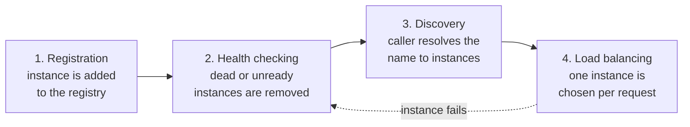
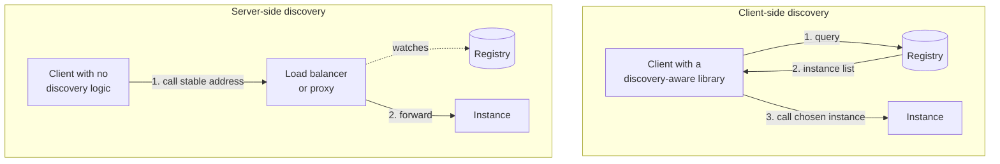
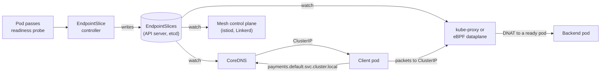
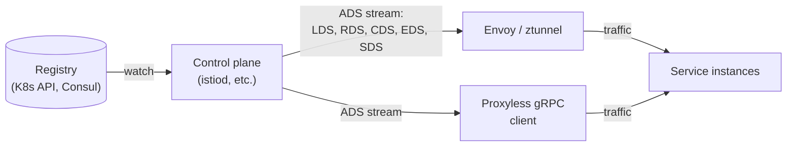
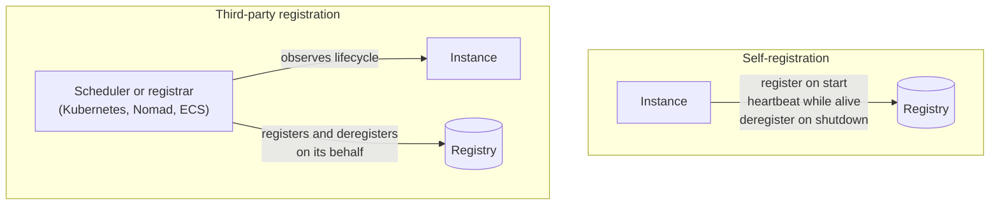
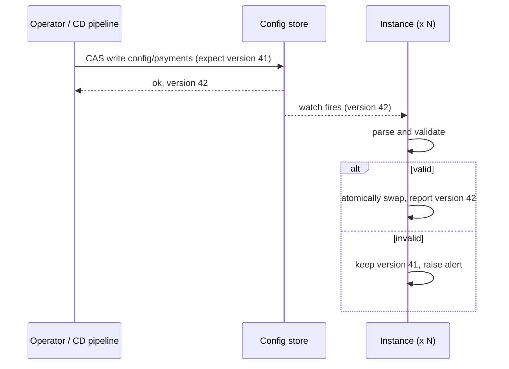
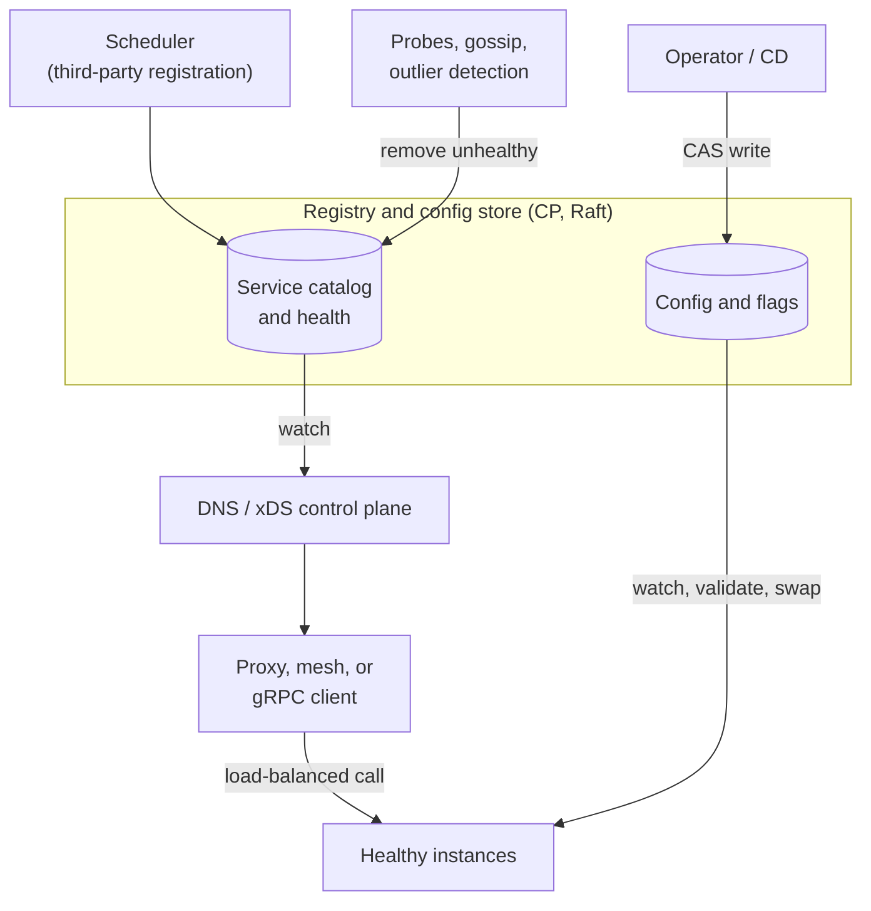

[Distributed Systems](./) &raquo; Service Discovery &amp; Configuration

**Service discovery** is how a caller turns a logical service name such as `payments` into the network address of a healthy instance, in a fleet where instances start, stop, and move all the time. **Dynamic configuration** is the closely related problem of changing how running instances behave (timeouts, feature flags, rate limits) without redeploying them. This page covers the service registry, client-side and server-side discovery, DNS versus API-based lookup, the xDS protocol used by service meshes, registration and health checking, load-balancing choices, and how to propagate configuration changes safely.

## The Problem

Inside one process, calling another component is a function call. In a distributed system, the callee is a set of processes on different hosts, each with its own IP address and port, and that set keeps changing:

- **Autoscaling** adds and removes instances from minute to minute.
- **Schedulers** such as Kubernetes and Nomad reschedule containers onto other hosts, giving them new IP addresses.
- **Failures** turn a working address into one that drops or refuses traffic until someone removes it.
- **Deployments** add instances running the new version and drain the old ones.

Hard-coded addresses therefore go stale almost immediately. Service discovery adds a level of indirection between a stable **logical identity** (`payments`) and its current **locations** (`10.4.2.7:8080`, `10.4.5.1:8080`, and so on). Every implementation does the same four things:



The **service registry** is the authoritative mapping from service name to the current set of instances, with their addresses, health, and metadata such as zone, version, and weight. The designs below differ in who keeps the registry accurate and who reads it.

## Client-Side vs Server-Side Discovery

The first design decision is where the lookup and instance-selection logic runs.



| | Client-side | Server-side |
|---|---|---|
| Where selection happens | In the calling process | In a load balancer, proxy, or kernel dataplane |
| Extra network hop | No | Yes, unless the proxy runs on the same node |
| Language support | Needs a client library for every language | Any client that can open a connection |
| Routing context | Can use application knowledge (request hashing for cache locality, zone preference) | Limited to what the proxy can see in the request |
| Operational cost | Library upgrades across every service | Running a highly available proxy tier |
| Examples | gRPC name resolvers and LB policies, Spring Cloud LoadBalancer with Eureka or Consul, Finagle | Kubernetes `ClusterIP` Services, AWS ALB/NLB target groups, NGINX or HAProxy with a registry-driven upstream |

Netflix's Eureka registry and Ribbon client were the canonical client-side stack of the 2010s. Ribbon has been retired (Spring Cloud replaced it with Spring Cloud LoadBalancer in 2020), and Eureka is the one Spring Cloud Netflix component still maintained.

A **service mesh** combines the two. A proxy running next to each workload (an Envoy sidecar in classic Istio, a per-node `ztunnel` plus optional waypoint proxies in Istio's ambient mode, which became GA in Istio 1.24 in November 2024, or Linkerd's Rust micro-proxy) does client-side-style discovery and load balancing. The application only sees a plain hostname, as with server-side discovery. **Proxyless gRPC** goes one step further: the gRPC library itself speaks the mesh's discovery protocol ([xDS](#xds-the-control-plane-protocol)), so there is no proxy at all.

```python
# Client-side discovery against Consul's health API.
import random
import requests

def healthy_instances(service, consul="http://localhost:8500"):
    r = requests.get(f"{consul}/v1/health/service/{service}",
                     params={"passing": "true"}, timeout=2)
    r.raise_for_status()
    # Service.Address may be empty, in which case the node address applies
    return [(e["Service"]["Address"] or e["Node"]["Address"], e["Service"]["Port"])
            for e in r.json()]

def call(service, path):
    instances = healthy_instances(service)
    if not instances:
        raise RuntimeError(f"no healthy instances of {service}")
    host, port = random.choice(instances)          # naive load balancing
    return requests.get(f"http://{host}:{port}{path}", timeout=2)
```

## Discovery in Kubernetes

Kubernetes is the most common discovery system in use today, and it is a third-party, server-side design by default.



- **Services and EndpointSlices.** A `Service` selects pods by label. The EndpointSlice controller records each matching pod's IP, port, readiness, and zone in **EndpointSlice** objects. The older `Endpoints` API was deprecated in Kubernetes 1.33 (April 2025). Newer features such as dual-stack networking and traffic distribution exist only in EndpointSlices, so any tooling that reads endpoints should use them.
- **DNS.** CoreDNS answers `payments.<namespace>.svc.cluster.local` with the Service's stable `ClusterIP`. It also serves SRV records for named ports.
- **Dataplane.** kube-proxy (iptables, IPVS, or the nftables mode added in recent releases) or an eBPF dataplane such as Cilium translates the virtual `ClusterIP` to a ready pod IP on each node.
- **Headless Services** (`clusterIP: None`) skip the virtual IP. DNS returns the pod IPs directly, for client-side load balancing (for example with gRPC) or for stateful sets whose members need stable individual names.
- **Topology-aware routing.** Setting `spec.trafficDistribution` on a Service prefers nearby endpoints. `PreferSameZone` (the renamed `PreferClose`) and `PreferSameNode` were added in Kubernetes 1.34, and both fall back to more distant endpoints when no local one is ready. Keeping traffic in-zone reduces both latency and cross-zone data-transfer cost.

Across clusters and outside Kubernetes, the same role is filled by the Multi-Cluster Services API (`ServiceExport` and `ServiceImport`), mesh federation, Consul, or cloud registries such as AWS Cloud Map, which ECS Service Connect is built on. [Kubernetes Networking](../technology/kubernetes/fundamentals-networking.html) covers Services, kube-proxy, and Ingress and Gateway API in more depth.

## DNS-Based vs API-Based Discovery

The second design decision is the protocol clients use to read the registry. DNS works everywhere. A dedicated API gives fresher and richer data.

| Dimension | DNS | Registry API (Consul, etcd, xDS) |
|-----------|-----|----------------------------------|
| Client support | Universal | Needs a library, agent, or proxy |
| Data | Addresses (A/AAAA); ports, priority, and weight (SRV) | Full metadata: zone, version, weights, health, tags |
| Freshness | Limited by TTL and by caches you do not control | Changes pushed within milliseconds to seconds |
| Load balancing | Record order or client choice; little control | Caller sees the full set and chooses |
| Failure behavior | Stale records keep sending traffic to dead instances | Subscribers see removals almost immediately |

### DNS-Based Discovery

The registry acts as a DNS server. Consul answers `payments.service.consul` with A records for passing instances only. An SRV query also returns ports and weights:

```bash
# Consul's DNS interface listens on port 8600 by default.
dig @127.0.0.1 -p 8600 payments.service.consul +short
# 10.4.2.7
# 10.4.5.1

dig @127.0.0.1 -p 8600 payments.service.consul SRV +short
# 1 1 8080 0a040207.addr.dc1.consul.
# 1 1 8080 0a040501.addr.dc1.consul.
```

The advantage is that nothing in the client changes: any process that can resolve a hostname can use it. The cost is **staleness**, because DNS was designed for records that rarely change and caching happens at many layers:

- **Recursive resolvers** (the node-local cache, `systemd-resolved`, `dnsmasq`, NodeLocal DNSCache) respect TTLs, but some enforce a minimum.
- **The JVM caches lookups itself** for 30 seconds by default (`networkaddress.cache.ttl`), regardless of the record's TTL, and forever if a security manager is installed. glibc does not cache at all unless `nscd` or a local resolver is in use.
- **Connection pools** keep connections to an address open long after its DNS record has changed. This is often the largest source of staleness in practice: long-lived HTTP/2 and gRPC connections never re-resolve unless the client is told to (for example with a maximum connection age on the server).

Consul serves service records with a TTL of 0 by default for this reason. Low TTLs, healthy-only answers, and a bounded connection lifetime reduce staleness, but DNS-based discovery is always somewhat eventual. The newer **SVCB and HTTPS** record types (RFC 9460, 2023) let DNS carry ports, ALPN protocols, and alternative endpoints, which closes some of the gap with SRV for HTTP clients.

### API-Based Discovery and Watches

With a registry API, the caller (or its proxy) subscribes to changes instead of polling a cached answer. Consul's **blocking queries** are the simplest form. The client sends the last index it saw, and the server holds the request open until something changes or the wait times out. etcd and ZooKeeper provide watch streams. The client-side code is still a plain request loop, but updates arrive as soon as the data changes.

```python
# Consul blocking query: returns as soon as the healthy set changes.
import requests

def watch_service(service, consul="http://localhost:8500"):
    index = 0
    while True:
        r = requests.get(f"{consul}/v1/health/service/{service}",
                         params={"passing": "true", "index": index, "wait": "55s"},
                         timeout=65)
        r.raise_for_status()
        new_index = int(r.headers["X-Consul-Index"])
        if new_index < index:           # index went backwards (e.g. snapshot restore): reset
            new_index = 0
        if new_index != index:
            index = new_index
            yield [(e["Service"]["Address"] or e["Node"]["Address"], e["Service"]["Port"])
                   for e in r.json()]
```

### xDS: The Control-Plane Protocol

**xDS** began as Envoy's discovery API and is now the common protocol between service-mesh control planes and their data planes: Envoy, Istio's ztunnel, and proxyless gRPC clients. A control plane (istiod, Consul, Kuma, Google Cloud Service Mesh, or a custom one built with `go-control-plane`) watches the registry and streams configuration to every proxy over one gRPC stream (ADS, the aggregated discovery service):

| Resource | Discovery service | Describes |
|----------|-------------------|-----------|
| Listener | LDS | Ports and protocols the proxy accepts |
| Route | RDS | How requests are matched to clusters (paths, headers, weights) |
| Cluster | CDS | Upstream services and their load-balancing, timeout, and circuit-breaking settings |
| Endpoint | EDS | The current healthy instances of each cluster, with zone and weight |
| Secret | SDS | TLS certificates and keys for mTLS |



Discovery through xDS carries more than addresses: it also delivers routing rules, retry and timeout policies, outlier-detection settings, and certificates. This is how a mesh applies the [resilience patterns](resilience-patterns.html) outside application code.

### Choosing a Registry

| Registry | Consistency | Replication | Built for | Discovery interface |
|----------|-------------|-------------|-----------|---------------------|
| Kubernetes API (etcd) | CP | Raft | Container orchestration | Watches on EndpointSlices; DNS via CoreDNS |
| etcd | CP | Raft | Reliable key-value store for coordination | KV plus leases plus watch (gRPC) |
| Consul | CP catalog; gossip for node liveness | Raft among servers; Serf/SWIM gossip | Turnkey discovery, health checks, KV, mesh | DNS, HTTP API with blocking queries, xDS |
| ZooKeeper | CP | Zab | Coordination (locks, ephemeral nodes) | Custom client; ephemeral znodes plus watches |
| Eureka | AP | Peer-to-peer copying, no consensus | Availability of the registry above all | REST; clients cache the full registry |

etcd and ZooKeeper are general coordination stores that discovery is built on. An instance creates a key or ephemeral znode tied to its lease or session, and readers watch the prefix. Consul provides discovery, health checking, DNS, multi-datacenter federation, and a mesh control plane in one product. (Consul, like other HashiCorp products, moved from the MPL to the Business Source License in 2023, and IBM completed its acquisition of HashiCorp in February 2025. Check the license terms if you embed or redistribute it.)

The CP registries follow the [CAP theorem](consensus-and-coordination.html#cap-theorem): during a partition, the minority side cannot write, so every reader sees one consistent membership list. Eureka made the opposite choice deliberately. Its servers keep serving possibly stale registrations during a partition, and a "self-preservation" mode stops them from expiring instances en masse when many heartbeats stop at once, on the theory that a network problem is more likely than a mass failure. Clients of any registry should cache the last known instance list and keep using it if the registry becomes unreachable. A registry outage should stop *changes* to routing, not routing itself.

## Registration: Self vs Third-Party

The registry can only be as accurate as the process that adds and removes entries.



- **Self-registration.** The instance calls the registry's API itself: it registers at startup, heartbeats against a lease or TTL, and deregisters on graceful shutdown. No extra component is needed, but every service depends on the registry client, and an instance that crashes leaves its entry behind until the lease expires.
- **Third-party registration.** A registrar that already knows instance lifecycles maintains the entries. Kubernetes is the standard example: the scheduler and kubelet know when a pod starts, becomes ready, and terminates, and the EndpointSlice controller updates the registry accordingly. Nomad with its built-in service catalog, ECS with Cloud Map, and Consul's catalog sync for Kubernetes work the same way. Application code has no discovery logic at all, which is why this model has largely won.

```python
# Self-registration in Consul with a TTL check, so a crashed instance expires.
import socket
import requests

class ConsulRegistration:
    def __init__(self, name, port, consul="http://localhost:8500"):
        self.name, self.port, self.consul = name, port, consul
        self.id = f"{name}-{socket.gethostname()}-{port}"

    def register(self):
        requests.put(f"{self.consul}/v1/agent/service/register", json={
            "ID": self.id, "Name": self.name, "Port": self.port,
            "Check": {
                "CheckID": f"{self.id}-ttl",
                "TTL": "15s",                                # heartbeat at least every 15 s
                "DeregisterCriticalServiceAfter": "1m",      # remove after 1 min critical
            },
        }, timeout=2).raise_for_status()

    def heartbeat(self):                                     # call every ~5 s
        requests.put(f"{self.consul}/v1/agent/check/pass/{self.id}-ttl", timeout=2)

    def deregister(self):
        requests.put(f"{self.consul}/v1/agent/service/deregister/{self.id}", timeout=2)
```

## Health-Checking Integration

Registration adds instances. Health checking removes the ones that can no longer serve. Discovery without health checking is harmful, because it keeps sending traffic to instances that drop or refuse it.

| Mechanism | How it works | Detects | Misses |
|-----------|-------------|---------|--------|
| TTL / heartbeat (push) | Instance must report "alive" periodically | Crashes and hangs | An instance that heartbeats but cannot serve |
| Active probe (pull) | Agent or kubelet calls `/ready`, opens a TCP connection, or calls gRPC `Health/Check` | Unready or broken instances | Problems visible only from other network locations |
| Gossip (SWIM) | Nodes probe each other at random and spread suspicions | Node failures, in seconds, at scale | Service-level problems on a live node |
| Passive (outlier detection) | Proxy ejects hosts that return consecutive 5xx errors or time out | Instances failing real traffic | Nothing until real traffic fails |

Production systems combine several. Kubernetes uses readiness probes to control EndpointSlice membership, Consul pairs agent-run checks with gossip-based node liveness (see [SWIM](failure-detection.html#swim)), and a mesh adds passive outlier detection on top.

**Readiness controls discovery, liveness controls restarts.** A pod failing its readiness probe is marked not-ready in its EndpointSlices, so the dataplane and mesh stop routing to it, but it is not restarted. A failing liveness probe restarts the container but does not by itself change discovery. Mixing the two causes restart loops, or traffic sent to instances that answer every request with 503. [Resilience Patterns](resilience-patterns.html#health-checks) covers probe design, including why liveness must not check shared dependencies.

```yaml
# Readiness gates Service membership; liveness gates restarts.
apiVersion: apps/v1
kind: Deployment
metadata:
  name: payments
spec:
  replicas: 3
  selector:
    matchLabels: { app: payments }
  template:
    metadata:
      labels: { app: payments }
    spec:
      containers:
        - name: payments
          image: registry.example.com/payments:2.4.1
          ports:
            - containerPort: 8080
          readinessProbe:              # failing: removed from EndpointSlices
            httpGet: { path: /readyz, port: 8080 }
            periodSeconds: 5
            failureThreshold: 3
          livenessProbe:               # failing: container restarted
            httpGet: { path: /livez, port: 8080 }
            periodSeconds: 10
            failureThreshold: 3
```

Health signals are noisy, so use thresholds: a `failureThreshold` so one lost probe does not evict a healthy instance, and a grace window (Consul's `DeregisterCriticalServiceAfter`) so a quick crash and restart does not lose the registration. Removal also takes time to propagate: the registry, then DNS or xDS, then every client or proxy. Graceful shutdown should therefore stop reporting ready and keep serving for a few seconds before exiting.

## Load Balancing After Discovery

Discovery produces a set of instances. The load-balancing policy chooses one per request (or per connection) and has a large effect on tail latency.

| Policy | How it chooses | Good for |
|--------|---------------|----------|
| Round robin | Rotates through the instances | Uniform instances and request costs |
| Weighted round robin | Rotation proportional to weights, which may come from server-reported load | Mixed instance sizes; gradual traffic shifts |
| Least request / power of two choices (P2C) | Picks two instances at random and sends to the one with fewer outstanding requests | Variable request costs; Envoy's and Linkerd's usual choice |
| Ring hash / Maglev | Consistent hashing on a request key | Cache affinity and sticky sessions with minimal reshuffling when instances change |
| Zone-aware / locality | Prefers the caller's zone, spills over when it is unhealthy or overloaded | Lower latency and cross-zone cost |

gRPC deserves a specific note. HTTP/2 multiplexes every request over one long-lived connection, so a connection-level (L4) load balancer such as a plain `ClusterIP` pins each client to one backend. Use request-level balancing: a gRPC client with a headless Service and the `round_robin` policy (the default policy, `pick_first`, uses a single connection), an L7 proxy or mesh, or proxyless gRPC with xDS.

## Dynamic Configuration

Service discovery says *where* a service is. **Dynamic configuration** controls *how it behaves*: feature flags, timeouts, log levels, rate limits, routing weights. The goal is to change these at runtime without a redeploy. The same stores used for discovery (Consul KV, etcd, the Kubernetes API) often hold configuration too, because the problem is the same: get a change from one writer to every running instance quickly and consistently.

### Watch, Validate, Swap

Instances watch a key or prefix, validate each new value, and swap it in atomically. If validation fails, they keep the last known good value.



```python
# Watch a JSON config document in Consul KV; validate before swapping in.
import base64, json, logging, threading
import requests

log = logging.getLogger(__name__)

class DynamicConfig:
    def __init__(self, key, validate, consul="http://localhost:8500"):
        self.key, self.validate, self.consul = key, validate, consul
        self.current, self.version = {}, 0
        threading.Thread(target=self._watch, daemon=True).start()

    def _watch(self):
        index = 0
        while True:
            try:
                r = requests.get(f"{self.consul}/v1/kv/{self.key}",
                                 params={"index": index, "wait": "55s"}, timeout=65)
                index = int(r.headers.get("X-Consul-Index", 0))
                if r.status_code != 200:
                    continue
                entry = r.json()[0]
                candidate = json.loads(base64.b64decode(entry["Value"]))
                self.validate(candidate)                  # raises on a bad config
                self.current, self.version = candidate, entry["ModifyIndex"]  # atomic rebind
            except Exception as exc:
                log.warning("config %s rejected or unavailable: %s", self.key, exc)  # keep last known good

    def get(self, name, default=None):
        return self.current.get(name, default)
```

On Kubernetes, the usual equivalent is a **ConfigMap** mounted as a volume. The kubelet updates the mounted files after a delay of up to about a minute by default (its sync period plus cache TTL), and the application watches the files. ConfigMaps consumed as environment variables or through `subPath` mounts are **not** updated; those require a pod restart, which tools such as Reloader automate by rolling the Deployment.

### Making Config Changes Safe

Pushing configuration to a whole fleet at once is a deployment without a deployment's safeguards. The same precautions apply:

- **Versioned, compare-and-set writes.** Use etcd transactions on `mod_revision` or Consul's `?cas=<index>` so two operators cannot silently overwrite each other, and have each instance report the version it is running.
- **Validate before applying.** Validate against a schema in CI and again inside each instance before swapping, and keep the last known good value. A bad value pushed everywhere at once is a fleet-wide outage.
- **Roll out in stages.** Instant propagation to 100% of instances removes the blast-radius limit a phased deployment provides. Scope configuration by deployment ring (canary, then 10%, then everyone), or put risky changes behind a percentage-based flag.
- **Make reloads idempotent and non-disruptive.** Reapplying the same value should do nothing, and a change that rebuilds a connection pool must drain in-flight work first.
- **Audit and roll back.** Keep a history of who changed what and when, and make returning to the previous version a single action.

Feature-flag platforms (LaunchDarkly, Unleash, Flagsmith, flagd) add targeting, percentage rollouts, and audit logs on top of this basic watch mechanism. **OpenFeature**, a CNCF incubating project, standardizes the SDK API so application code is not tied to one vendor.

## Putting It Together



1. A **registry** (the Kubernetes API, Consul, or etcd) holds membership and configuration, kept consistent by Raft.
2. Instances enter it through **registration**, almost always done by the scheduler today.
3. **Health checks** (readiness probes, gossip, passive outlier detection) keep only instances that can serve in the registry.
4. Callers **discover** instances through DNS, which works everywhere, or through watches and xDS, which are faster and carry more data, and choose one with a **load-balancing** policy suited to the traffic.
5. **Dynamic configuration** uses the same watch mechanism, protected by compare-and-set writes, validation, and staged rollout.

Service discovery and dynamic configuration are the same problem seen twice: delivering a small, frequently changing piece of authoritative state (an address set or a config value) from a consistent store to a large fleet of consumers, quickly, while tolerating the store being briefly unreachable.

## See Also

- [Distributed Systems Hub](./#why-distributed-systems-are-hard): why dynamic topology is one of the fallacies of distributed computing
- [Consensus and Coordination](consensus-and-coordination.html): the Raft consensus behind CP registries, and CAP
- [Failure Detection](failure-detection.html): heartbeats, phi-accrual detection, and SWIM gossip as used by Consul
- [Resilience Patterns](resilience-patterns.html): health-probe design, timeouts, retries, and circuit breakers
- [Microservices and Event-Driven Architecture](microservices-and-event-driven.html#service-mesh): API gateways and service meshes
- [Kubernetes Networking](../technology/kubernetes/fundamentals-networking.html): Services, EndpointSlices, DNS, and Ingress
- [Networking](../technology/networking/): DNS and resolver caching behavior
