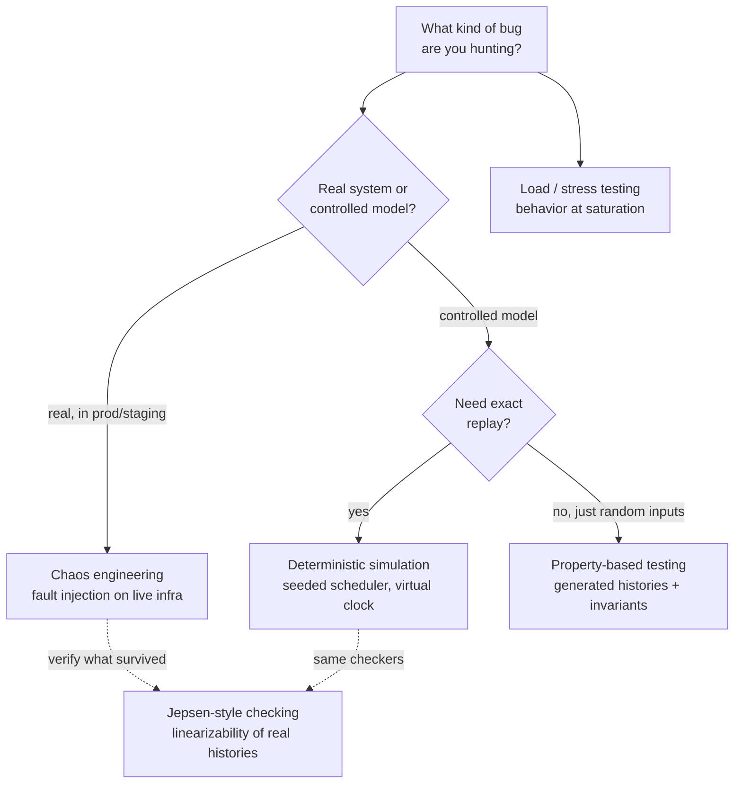
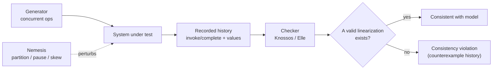

<div class="hero-section" style="background: linear-gradient(135deg, #667eea 0%, #764ba2 100%); color: white; padding: 3rem 2rem; margin: -2rem -3rem 2rem -3rem; text-align: center;">
  <h1 style="color: white; margin: 0; font-size: 2.5rem;">Testing &amp; Chaos Engineering</h1>
  <p style="font-size: 1.25rem; margin-top: 1rem; opacity: 0.9;">Finding the bugs that only appear under failure, concurrency, and partition</p>
</div>

[Distributed Systems Hub](./) &raquo; Testing &amp; Chaos Engineering

<div class="code-example" markdown="1">
The bugs that matter in distributed systems are *emergent*: they live in the interleavings of concurrent operations, the moments during a network partition, and the recovery path after a crash. Ordinary unit and integration tests rarely exercise those states. This page collects the techniques that do — fault injection and chaos engineering, property-based and deterministic-simulation testing, Jepsen-style consistency checking, and load/stress testing — with the theory of *why* each one finds bugs the others miss.
</div>

<div class="key-insights">
  <div class="insight-card"><i class="fas fa-bug"></i><h4>Test the failure path, not the happy path</h4><p>Most production incidents are recovery bugs. If you never inject the failure, you never run the recovery code — and it rots.</p></div>
  <div class="insight-card"><i class="fas fa-dice"></i><h4>Make the nondeterminism reproducible</h4><p>A concurrency bug you can't replay is a bug you can't fix. Seeded schedulers and simulation turn "flaky once a week" into "fails every time on seed 42."</p></div>
  <div class="insight-card"><i class="fas fa-check-double"></i><h4>Check a property, not an example</h4><p>Asserting "this specific history is correct" scales poorly. Asserting "every history is linearizable" generalizes across the infinite space of interleavings.</p></div>
  <div class="insight-card"><i class="fas fa-tachometer-alt"></i><h4>Load reveals coordinated failure</h4><p>Queues back up, retries amplify, and timeouts cascade only under load. Steady-state correctness says nothing about behavior at saturation.</p></div>
</div>

## Table of contents
{: .no_toc .text-delta }

1. TOC
{:toc}

---

## Why Testing Distributed Systems Is Different

A single-process program has one timeline. A distributed system has *N* independent timelines that interact only through messages, and the relative ordering of those messages is not under your control. The number of distinct global states a system of $n$ nodes can reach grows combinatorially with the number of in-flight messages and pending operations, so exhaustive enumeration is hopeless for anything but toy models. Worse, the interesting states are the rare ones: the partition that strands the leader, the message that arrives after a timeout has already fired, the crash that lands exactly between a write to disk and the acknowledgement to the client.

Three properties make distributed testing its own discipline:

- **Partial failure.** Components fail independently. The hard cases are not "everything is down" but "half of it is down, and the half that is up cannot tell which half failed" — the [Two Generals and FLP](../advanced/distributed-systems-theory/) regime.
- **No global clock.** Events on different nodes have no inherent total order. Bugs hide in the gap between *physical* time (what a stopwatch sees) and *logical* time (the happens-before order your code assumes).
- **Nondeterministic scheduling.** Message delays, GC pauses, and thread scheduling reorder events differently on every run, so the same code can pass a thousand times and fail on the thousand-and-first.

The techniques below attack this from two directions. **Fault injection / chaos** *increases the probability* of reaching a bad state by actively perturbing a real system. **Property-based and simulation testing** *control the schedule* so you can search the state space systematically and reproduce any failure deterministically. They are complementary: chaos finds the failures you didn't model, simulation finds the ones you did but implemented wrong.



## Chaos Engineering

Chaos engineering is the practice of running controlled, blast-radius-limited failure experiments against a system to validate that it tolerates the failures you *believe* it tolerates. It was popularized by Netflix's Chaos Monkey (which randomly terminates production instances) and formalized into a discipline by the [Principles of Chaos Engineering](https://principlesofchaos.org/). The core idea is empirical: you do not *know* your retries, timeouts, and failovers work until you have watched them work under real failure.

### The Experiment Loop

A chaos experiment is a hypothesis test, not random vandalism:

1. **Define steady state.** Pick a measurable, business-relevant metric that captures "the system is healthy" — e.g. successful checkout rate, p99 latency, or replication lag. This is your null hypothesis.
2. **Hypothesize.** "If we kill one replica of the order service, steady state holds (checkout success stays > 99.9%)."
3. **Inject the fault** in the smallest blast radius that tests the hypothesis — one instance, one availability zone, one dependency.
4. **Measure** the steady-state metric during the experiment.
5. **Learn and roll back.** If steady state held, you have evidence (not proof) of resilience. If it broke, you found a real weakness *before* a real outage did.

The discipline lives in the *controls*: a defined blast radius, an automated abort ("big red button") that halts the experiment if a guardrail metric crosses a threshold, and ideally a way to run in production where the real dependencies and real traffic are — because staging never reproduces production's failure modes.

### A Fault-Injection Harness

The original `ChaosMonkey` below is a minimal in-process injector — useful in tests and for understanding the mechanics. Production tools (Gremlin, Chaos Mesh, AWS FIS, Litmus) inject at the OS/network/orchestrator layer instead, but the structure is the same: a menu of fault types, a probability, and a trigger.

```python
import random
import asyncio

class ChaosMonkey:
    def __init__(self, failure_rate=0.1):
        self.failure_rate = failure_rate
        self.failures = {
            "network_delay": self.inject_network_delay,
            "service_crash": self.inject_service_crash,
            "disk_full": self.inject_disk_full,
            "cpu_spike": self.inject_cpu_spike
        }

    async def inject_failure(self):
        if random.random() < self.failure_rate:
            failure_type = random.choice(list(self.failures.keys()))
            await self.failures[failure_type]()

    async def inject_network_delay(self):
        delay = random.uniform(0.1, 2.0)
        await asyncio.sleep(delay)

    async def inject_service_crash(self):
        if random.random() < 0.5:
            raise Exception("Service crashed!")
```

### The Fault Taxonomy

Real systems fail in more ways than "the process died." A useful chaos program exercises each layer:

| Layer | Faults to inject | What it validates |
|-------|------------------|-------------------|
| **Process** | kill, OOM, GC pause, slow start | restart logic, health checks, leader re-election |
| **Network** | latency, packet loss, partition, asymmetric partition, DNS failure | timeouts, retries, partition handling, the CP/AP choice |
| **Resource** | CPU saturation, disk full, fd exhaustion, memory pressure | backpressure, graceful degradation, shedding |
| **Dependency** | downstream 500s, slow responses, expired certs, throttling | circuit breakers, fallbacks, bulkheads |
| **Clock** | skew, leap second, jump backward | time-based leases, token expiry, ordering assumptions |
| **State** | corrupt replica, stale read, split brain | reconciliation, anti-entropy, quorum logic |

The most instructive — and most overlooked — fault is the **asymmetric (one-way) network partition**, where A can send to B but B's replies are dropped. It breaks the common-but-wrong assumption that "if I can reach you, you can reach me," and it is precisely the regime in which naive leader-election protocols form two leaders.

### Game Days and Blast Radius

A *game day* is a scheduled, supervised chaos exercise where a team injects a significant fault (e.g. fails an entire availability zone) and rehearses the response live. The point is dual: validate the system *and* validate the humans, runbooks, dashboards, and alerts around it. Blast radius is controlled by scope (one zone, not all), by traffic fraction (1% of users), and by the abort condition — if the guardrail metric degrades past a threshold, automation halts and reverts the experiment without waiting for a human.

## Fault Injection at the Infrastructure Layer

In-process injectors like the one above only reach code paths you instrumented. To test faults the application cannot see — a TCP retransmit storm, a kernel-level pause — you inject below the application. Common mechanisms:

- **Network emulation** with `tc`/`netem` to add latency, jitter, loss, or reordering on an interface; `iptables`/`nftables` `DROP` rules to simulate partitions.
- **Resource pressure** with `cgroups` (CPU/memory caps) and `stress-ng`.
- **Syscall-level fault injection** with `strace --inject` or eBPF to fail specific calls (`write` returns `ENOSPC`).
- **Orchestrator chaos** (Chaos Mesh, Litmus on Kubernetes) declaratively expressing pod-kill, network-partition, and IO-fault experiments as custom resources.

```bash
# Add 200ms ± 50ms latency with 5% packet loss on eth0 (Linux tc/netem)
tc qdisc add dev eth0 root netem delay 200ms 50ms loss 5%

# Simulate a partition: drop everything to/from a peer's IP
iptables -A INPUT  -s 10.0.0.7 -j DROP
iptables -A OUTPUT -d 10.0.0.7 -j DROP

# Asymmetric partition: peer can reach us, but our replies are dropped
iptables -A OUTPUT -d 10.0.0.7 -j DROP

# Always script the teardown — a partition you forget to remove is an outage
tc qdisc del dev eth0 root
iptables -F
```

The cardinal rule of infrastructure fault injection: **the cleanup must be automatic and idempotent.** A `netem` rule or a dropped route that survives the test is no longer a test — it is the incident. Wrap every injection in a time-boxed lease or a trap that reverts on exit.

## Property-Based Testing

Example-based tests assert a fact about one input: "increment three times, total is three." Property-based testing (PBT) inverts this — you state an *invariant that must hold for all inputs*, and a generator produces hundreds of randomized inputs (including adversarial edge cases) trying to violate it. When it finds a failure, it **shrinks** the input to the minimal reproducing case, which is the feature that makes PBT practical: instead of a 200-operation history, you get the 3-operation history that actually breaks.

For distributed code, the "input" is typically a *generated history* — a sequence of operations, possibly concurrent, possibly interleaved with faults — and the property is a correctness predicate over the observed results.

```python
from hypothesis import given, strategies as st
import asyncio
import random

class DistributedCounter:
    def __init__(self, nodes=3):
        self.counters = [0] * nodes
        self.nodes = nodes

    async def increment(self, node_id):
        # Simulate network delay
        await asyncio.sleep(random.uniform(0, 0.1))
        self.counters[node_id] += 1

    async def get_total(self):
        # Eventually consistent read
        await asyncio.sleep(0.2)
        return sum(self.counters)

# Property: Total equals number of increments
@given(st.lists(st.integers(min_value=0, max_value=2), min_size=1, max_size=100))
async def test_counter_consistency(operations):
    counter = DistributedCounter()

    # Perform operations concurrently
    tasks = [counter.increment(node_id) for node_id in operations]
    await asyncio.gather(*tasks)

    # Check eventual consistency
    total = await counter.get_total()
    assert total == len(operations)
```

### Choosing Good Properties

The hard part of PBT is not the framework — it is articulating a property strong enough to catch bugs but checkable without reimplementing the system. Useful classes of property for distributed code:

- **Invariants** — something always true: "total tokens conserved," "no key has two owners," "the committed log is a prefix of every replica's log."
- **Metamorphic relations** — a known relationship between outputs for related inputs: "reading a key after writing it returns the written value," "the result is independent of replica order."
- **Model equivalence (oracle)** — run the same operations against a simple, obviously-correct sequential model and assert the distributed system's externally-visible results are consistent with *some* valid ordering of that model. This is the bridge to linearizability checking below.
- **Idempotency and commutativity** — "applying the same update twice equals applying it once," "CRDT merges commute and are associative" — directly testing the algebraic laws the system relies on.

PBT's blind spot is *scheduling*: with `asyncio.sleep(random(...))` you only sample whatever interleavings the runtime happens to produce, and you cannot replay a failing one. That limitation is exactly what deterministic simulation removes.

## Deterministic Simulation Testing

Deterministic simulation testing (DST) runs the *entire* system — every node, the network, the clock, the disk — inside a single process, on top of a scheduler whose only source of randomness is a seed. Because every nondeterministic decision (which message to deliver next, how long an RPC takes, whether a disk write fails, when a node crashes) is drawn from that one seeded PRNG, a run is a pure function of the seed: **same seed, byte-for-byte same execution.** This is the technique behind FoundationDB's legendary reliability, and it underlies systems like TigerBeetle and Antithesis.

The payoff is twofold. First, a bug that surfaces on seed `0x9c4f` reproduces *every single time* you replay that seed — no more "flaky in CI." Second, because simulated time is virtual, you can run *months* of wall-clock scenarios (clock skew, slow background compaction, week-long partitions) in seconds, and explore millions of seeds in a CI budget.

### How It Works

Three pieces make a run deterministic:

1. **A simulated clock.** Code never calls the OS clock directly; it asks the simulator for "now." Time advances only when the scheduler decides, so a 30-second lease timeout costs zero real seconds.
2. **A simulated network.** Messages go into a queue the scheduler owns. The scheduler picks delivery order, delays, drops, and duplicates — all seeded — so you sweep the space of interleavings by sweeping seeds.
3. **Injected, seeded I/O and faults.** Disk writes can return errors or torn writes; nodes can be paused or killed; all decisions come from the same PRNG.

```python
import heapq
import random

class Simulation:
    """A minimal seeded discrete-event simulator: same seed -> same run."""
    def __init__(self, seed):
        self.rng = random.Random(seed)
        self.now = 0.0
        self.queue = []          # priority queue of (time, seq, callback)
        self._seq = 0

    def schedule(self, delay, callback):
        # All "delays" are virtual; the rng makes them reproducible
        self._seq += 1
        heapq.heappush(self.queue, (self.now + delay, self._seq, callback))

    def send(self, callback, payload):
        # Seeded network behavior: drop, delay, or duplicate
        roll = self.rng.random()
        if roll < 0.02:
            return                       # message dropped
        delay = self.rng.uniform(0.001, 0.050)
        self.schedule(delay, lambda: callback(payload))
        if roll > 0.98:
            self.schedule(delay * 2, lambda: callback(payload))  # duplicate

    def run(self, until):
        while self.queue and self.queue[0][0] <= until:
            self.now, _, callback = heapq.heappop(self.queue)
            callback()

# A failure on a given seed is perfectly reproducible:
def run_scenario(seed):
    sim = Simulation(seed)
    # ... wire up nodes whose only I/O goes through sim.send / sim.schedule ...
    sim.run(until=86400.0)   # simulate a full day in milliseconds of real time
    # assert invariants over the recorded history

for seed in range(100_000):   # sweep the state space by sweeping seeds
    run_scenario(seed)
```

The discipline DST demands is architectural: **all** nondeterminism must flow through the simulator. A single stray `time.time()`, `os.urandom`, `Thread`, or direct socket call breaks determinism and reintroduces the flakiness DST exists to eliminate. Systems built for DST therefore route every clock read, random number, and I/O through an injectable interface — which, conveniently, is also good design.

### PBT vs. DST

| | Property-based testing | Deterministic simulation |
|---|---|---|
| **Controls scheduling?** | No — samples runtime interleavings | Yes — scheduler owns every event |
| **Reproducible failures?** | Shrinks input, but schedule may vary | Exact byte-for-byte replay from seed |
| **Coverage of rare interleavings** | Whatever the OS happens to do | Systematic — sweep seeds, bias toward rare events |
| **Cost to adopt** | Low — drop a library into existing tests | High — system must be built injectable |
| **Best for** | Pure logic, data structures, CRDTs, serializers | Whole-system correctness of stateful protocols |

## Jepsen-Style Consistency Testing

Jepsen, by Kyle Kingsbury, is the black-box approach: instead of controlling the system's internals, you treat the database as an opaque box, hammer it with concurrent clients while injecting partitions, and then *analyze the recorded history* to decide whether the results could have been produced by a system actually providing the consistency it advertises. Jepsen has found serious correctness bugs in nearly every major distributed database, precisely because vendors' claimed guarantees and their actual behavior under partition frequently diverge.

### The Method

A Jepsen test has four moving parts:

1. **A generator** producing a stream of operations (reads, writes, compare-and-swap) for many concurrent clients.
2. **A nemesis** — the fault injector — that partitions the cluster, pauses processes, skews clocks, and heals, interleaved with the operations.
3. **A recorded history**: every operation logged with an *invoke* time and a *complete* time (or a known failure), so concurrency is explicit — two operations are concurrent if their `[invoke, complete]` intervals overlap.
4. **A checker** that asks: *does there exist a valid sequential ordering of these operations, consistent with the real-time constraints, that a correct system could have produced?* If no such ordering exists, the system violated its claimed consistency model.



### Linearizability Checking

The checker's core question is a search problem. A history is **linearizable** if you can assign each operation a single instant — its *linearization point* — lying between its invoke and complete times, such that the operations executed in that order produce the observed results under the object's sequential specification. Formally, given a concurrent history $H$, linearizability requires a legal sequential history $S$ that is a permutation of $H$'s completed operations, respects each object's sequential spec, and preserves the real-time order: if operation $a$ completes before operation $b$ is invoked in $H$, then $a$ precedes $b$ in $S$.

Searching for that ordering is NP-hard in general (Jepsen's original `Knossos` checker uses the Wing–Gong algorithm with aggressive pruning), which is why modern Jepsen uses **Elle**, a checker that reconstructs a *dependency graph* over transactions — write-read, write-write, and read-write edges — and checks it for cycles. A cycle in the dependency graph is a direct witness of a consistency anomaly (e.g. a write-skew, a lost update, a stale read), and crucially Elle's output *names the anomaly* rather than just saying "not linearizable," which makes the bug actionable.

The conceptual sketch below shows what a checker does — try to thread a consistent order through overlapping operations:

```python
from itertools import permutations

def is_linearizable(history, sequential_spec, initial_state):
    """
    history: list of ops, each {op, value, invoke, complete}
    Returns True if SOME ordering respecting real-time order is legal
    under sequential_spec. (Brute force; real checkers prune heavily.)
    """
    def respects_realtime(order):
        pos = {id(op): i for i, op in enumerate(order)}
        for a in history:
            for b in history:
                if a["complete"] < b["invoke"] and pos[id(a)] > pos[id(b)]:
                    return False   # a finished before b started, but ordered after
        return True

    for order in permutations(history):
        if not respects_realtime(order):
            continue
        state = initial_state
        ok = True
        for op in order:
            state, legal = sequential_spec(state, op)
            if not legal:
                ok = False
                break
        if ok:
            return True   # found a valid linearization
    return False
```

This brute-force version is exponential and only for intuition; the lesson it encodes is the important part: **consistency is a property of the whole history, not of any single operation.** You cannot decide whether a read returned a "wrong" value by looking at it alone — only by asking whether *any* global order explains all the reads and writes together.

### Weaker Models Have Weaker Checkers

Not every system claims linearizability, so the checker must match the claim. The same history can be legal under causal consistency and illegal under linearizability. Elle and related tools check a ladder of models — strict serializable, serializable, snapshot isolation, repeatable read, read committed, causal — by checking for the specific dependency-cycle patterns each model forbids. Testing against a *stronger* model than the system promises produces false alarms; testing against a *weaker* one misses real bugs. Knowing exactly which model your system claims (see the consistency-model table in the [hub](consensus-and-coordination.html#consistency-models)) is a prerequisite to checking it.

## Load and Stress Testing

Correctness under one client says nothing about behavior under ten thousand. Load testing characterizes a system's response — latency, throughput, error rate — as offered load rises, and stress testing pushes past the breaking point to observe *how* it fails. The two questions are distinct: load testing asks "what is the latency at expected peak?", stress testing asks "when it breaks, does it shed load gracefully or collapse?"

### What to Measure

- **Throughput** (requests/sec) at each load level, and the load at which it plateaus or *decreases* — a decrease past saturation is the signature of a system spending all its capacity on retries and context switches rather than work.
- **Latency distribution**, reported as percentiles (p50, p99, p999) — never the mean. In a distributed request that fans out to many backends, the *tail* dominates: if a request touches 100 services each with a 1% chance of being slow, ~63% of requests hit at least one slow backend. This is **tail latency amplification**, and it is why p99 of the components becomes p50 of the whole.
- **Error rate** and its composition (timeouts vs. 5xx vs. connection-refused) as a function of load.
- **Saturation** of the underlying resources (CPU, memory, connection pools, queue depth) — the leading indicator that precedes latency blowup.

### The Cascading-Failure Anti-Pattern

The most important thing load testing reveals is *coordinated* failure. Under saturation, three mechanisms conspire:

- **Queues fill.** When arrival rate exceeds service rate, queue depth — and therefore latency — grows without bound (a direct consequence of Little's Law: $L = \lambda W$). Latency does not degrade gracefully; it goes vertical at the saturation point.
- **Retries amplify.** A slow backend triggers client retries, which *add* load to the already-overloaded backend — a positive feedback loop that turns a brief slowdown into a sustained outage. The mitigations (exponential backoff with jitter, retry budgets, circuit breakers) only get exercised under load.
- **Timeouts cascade.** A timeout upstream abandons in-flight work downstream, wasting the capacity already spent on it, while the client immediately re-requests — again amplifying load.

Stress testing is how you confirm the defenses against this — load shedding, backpressure, bulkheads, and circuit breakers — actually engage *before* collapse, rather than discovering during an incident that they don't.

### A Closed vs. Open Load Model

A subtle but critical choice: a **closed-loop** load generator has a fixed pool of virtual users that wait for a response before issuing the next request, so it *automatically slows down* when the system slows — masking the very overload you want to study. An **open-loop** generator issues requests at a fixed arrival *rate* regardless of responses, faithfully reproducing the coordinated-omission-free behavior of real internet traffic that does not wait. Tools like `wrk2`, `vegeta`, and `k6` (in arrival-rate mode) implement open-loop generation specifically to avoid **coordinator omission**, the measurement bias where a stalled load generator simply stops sending requests during the exact window the system is slowest, and so never records the latencies that matter.

```bash
# Open-loop: a constant 5,000 requests/sec for 60s, regardless of latency
echo "GET https://api.example.com/health" \
  | vegeta attack -rate=5000/s -duration=60s \
  | vegeta report -type='hist[0,10ms,50ms,100ms,500ms,1s]'

# k6 arrival-rate executor: ramp the *rate*, not the VU count
# (constant-arrival-rate avoids the closed-loop self-throttling trap)
```

### From Synthetic to Realistic

Synthetic uniform load understates real risk because production traffic is bursty and skewed. Two refinements make load tests predictive: **hotspotting** the key distribution (real workloads are Zipfian — a few keys take most of the traffic, overloading individual shards), and **replaying captured production traffic** (shadow traffic) so the request mix, payload sizes, and cache-hit ratios match reality. The combination of realistic load *and* a chaos nemesis — load testing *during* a partition — is where the most expensive production surprises are found cheaply.

## Putting It Together: A Testing Strategy

No single technique is sufficient; they form a defense in depth, each catching what the others miss:

| Technique | Catches | Misses | Run it… |
|-----------|---------|--------|---------|
| **Property-based** | Logic bugs, broken invariants, bad edge cases | Rare interleavings, real-infra faults | Every CI run (fast) |
| **Deterministic simulation** | Concurrency & recovery bugs, with exact replay | Bugs in unmodeled real components | Every CI run + nightly seed sweeps |
| **Jepsen-style** | Consistency violations of the *real* system under partition | Performance, slow-burn resource leaks | Per release / per major change |
| **Chaos engineering** | Unmodeled failure modes, ops/runbook gaps | Anything you didn't think to inject | Continuously in prod, plus game days |
| **Load / stress** | Saturation collapse, tail amplification, retry storms | Logical correctness | Pre-release, capacity planning, before peak events |

A mature program runs PBT and DST in CI on every change, Jepsen-style consistency checks on every release, load tests before any capacity-relevant change, and continuous low-blast-radius chaos in production with periodic game days. The throughline is the chaos-engineering mindset applied everywhere: **you do not know a property holds until you have actively tried to break it.**

## See Also

- **[Distributed Systems Hub](./)** — patterns, consistency models, and implementation strategies these tests validate
- **[Distributed Systems Theory](../advanced/distributed-systems-theory/)** — CAP, FLP, and the formal consistency-model definitions that consistency checkers verify against
- **[Database Design](../technology/database-design/)** — replication and isolation levels that Jepsen-style tests target
- **[Kubernetes](../technology/kubernetes/)** — the orchestration layer where pod-kill and network-partition chaos experiments run
- **[CI/CD Pipelines](../technology/ci-cd/)** — where property-based and simulation tests live in the validation pipeline
- **[Performance Optimization](../optimization/)** — interpreting the latency distributions and saturation curves load testing produces
