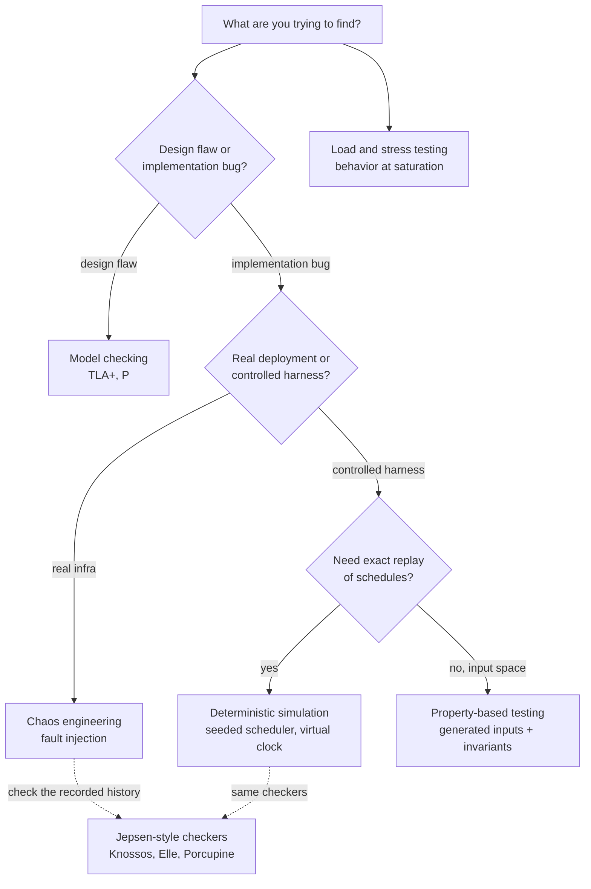
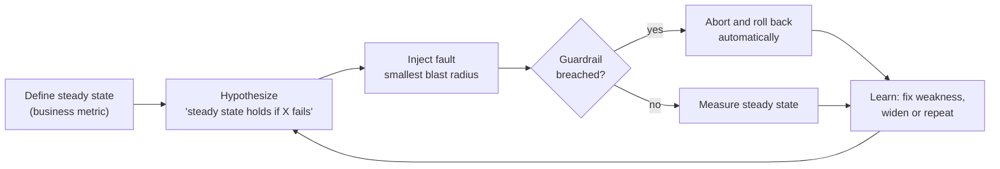
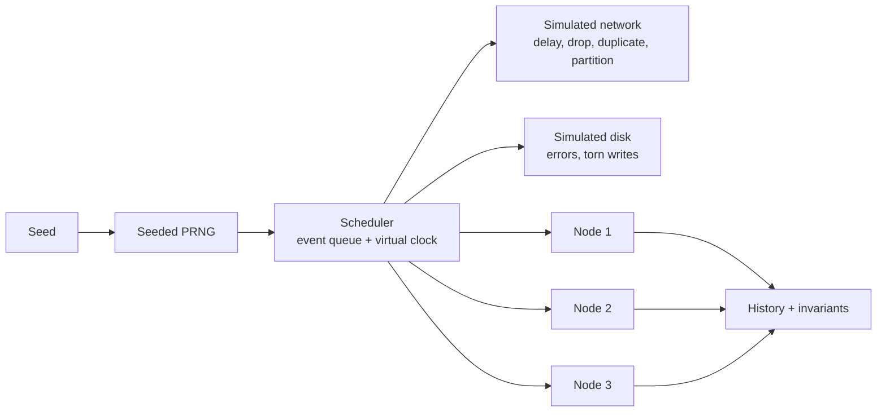
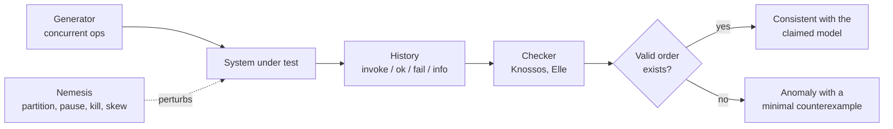
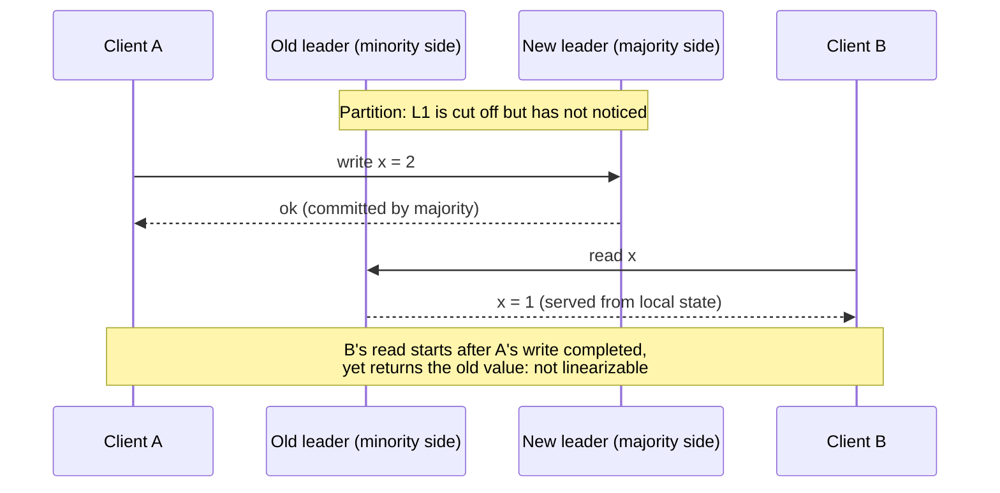
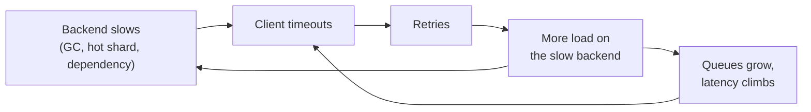

[Distributed Systems Hub](./) &raquo; Testing &amp; Chaos Engineering

The bugs that matter in distributed systems are *emergent*. They live in the interleavings of concurrent operations, in the seconds during a network partition, and in the recovery path after a crash, and ordinary unit and integration tests rarely reach any of those states. This page covers the techniques that do: chaos engineering and infrastructure fault injection, property-based testing, deterministic simulation testing, model checking of designs, Jepsen-style consistency checking, and load and stress testing. For each one it explains which class of bug it finds and why the others miss it.

Four principles run through all of them:

- **Test the failure path.** Most serious outages are bugs in recovery code. Recovery code that never runs in a test rots.
- **Make nondeterminism reproducible.** A concurrency bug that cannot be replayed cannot be fixed with confidence. Seeded schedulers turn "flaky once a week" into "fails every time on seed 42."
- **Check properties, not examples.** Asserting that one specific history is correct does not scale; asserting that *every* history is linearizable covers the whole space of interleavings.
- **Test at saturation.** Queues, retry storms, and timeout cascades appear only under load. Correctness at low load says nothing about behavior at peak.

## Table of contents
{: .no_toc .text-delta }

1. TOC
{:toc}

---

## Why Distributed Testing Is Different

A single-process program has one timeline. A distributed system has *N* timelines that interact only through messages whose relative order you do not control. The number of reachable global states grows combinatorially with the number of nodes, in-flight messages, and pending operations, so exhaustive enumeration is impossible outside toy models. The interesting states are also the rare ones: the partition that strands a leader, the reply that arrives after its timeout fired, the crash between an `fsync` and the acknowledgement to the client.

Three properties make this its own discipline:

| Property | What it means for testing |
|----------|---------------------------|
| **Partial failure** | Components fail independently, and the survivors often cannot tell which part failed. The hard cases are "half is down and the other half disagrees about which half," the regime of the [Two Generals and FLP results](../advanced/distributed-systems-theory/). |
| **No global clock** | Events on different nodes have no inherent total order. Bugs hide in the gap between physical time and the happens-before order the code assumes. |
| **Nondeterministic scheduling** | Network delay, GC pauses, and thread scheduling reorder events on every run, so the same code can pass a thousand times and fail on run 1,001. |

The techniques below attack the problem from two directions. **Fault injection and chaos engineering** raise the probability of reaching a bad state by perturbing a *real* system. **Property-based testing, simulation, and model checking** control the schedule so the state space can be searched systematically and failures replayed exactly. They complement each other: chaos finds failure modes nobody modeled; simulation finds bugs in the modes you did model but implemented wrong.



## Chaos Engineering

Chaos engineering is the practice of running controlled failure experiments against a system to confirm that it tolerates the failures it is believed to tolerate. Netflix's Chaos Monkey, which terminated random production instances, popularized the idea; the [Principles of Chaos Engineering](https://principlesofchaos.org/) formalized it. The premise is empirical: retries, timeouts, and failover are not known to work until they have been observed working under a real fault.

### The Experiment Loop

A chaos experiment is a hypothesis test, not random breakage.



1. **Define steady state.** Choose a measurable, user-relevant signal, such as checkout success rate, p99 latency, or replication lag. Host metrics like CPU are poor choices because they do not say whether users are affected.
2. **Hypothesize.** "If one replica of the order service is killed, checkout success stays above 99.9%."
3. **Inject the fault** at the smallest scope that tests the hypothesis: one instance, one availability zone, one dependency, a small traffic fraction.
4. **Measure** the steady-state signal against a control group or baseline.
5. **Learn.** If steady state held, you have evidence (not proof) of resilience. If it broke, you found a weakness before an outage did.

The discipline is in the controls: a bounded blast radius, **stop conditions** that abort automatically when a guardrail metric crosses a threshold, and teardown that runs even if the harness crashes. Mature programs run experiments in production, because staging rarely has production's traffic shape, data volume, or dependency behavior.

### Fault Taxonomy

Real systems fail in more ways than "the process died." A useful program exercises every layer:

| Layer | Faults to inject | What it validates |
|-------|------------------|-------------------|
| **Process** | kill, OOM, long GC or `SIGSTOP` pause, slow start | Restart logic, health checks, leader re-election, lease expiry |
| **Network** | latency, jitter, loss, reordering, full and asymmetric partitions, DNS failure | Timeouts, retries, partition handling, the CP/AP choice |
| **Storage** | `fsync` errors, disk full, torn or lost writes, slow I/O | Durability claims, write-ahead-log recovery, error propagation |
| **Resource** | CPU saturation, memory pressure, file-descriptor or connection-pool exhaustion | Backpressure, load shedding, graceful degradation |
| **Dependency** | downstream 5xx, slow responses, throttling, expired certificates | Circuit breakers, fallbacks, bulkheads |
| **Clock** | skew, jumps backward, drift between nodes | Time-based leases, token expiry, timestamp ordering |
| **Infrastructure** | availability-zone or region loss, control-plane outage | Multi-AZ failover, static stability, runbooks |

Two faults deserve special attention. The **asymmetric partition**, where A can reach B but B's replies are dropped, breaks the assumption that reachability is symmetric; naive leader election can end up with two leaders. The **process pause** (a stop-the-world GC, a VM migration, `SIGSTOP`) is worse than a crash because the paused node resumes believing it still holds its lease or leadership. Both are covered in [Failure Detection](failure-detection.html) and [Resilience Patterns](resilience-patterns.html).

### Game Days

A **game day** is a scheduled, supervised exercise in which a team injects a large fault, such as losing an entire availability zone, and rehearses the response live. It tests the system and also the people around it: alerting, dashboards, runbooks, escalation paths, and the time to detect and mitigate. Blast radius is limited by scope (one zone, not all), by traffic fraction, and by automated abort conditions.

### Chaos Tooling

| Tool | Layer | Notes |
|------|-------|-------|
| **AWS Fault Injection Service (FIS)** | AWS resources | Managed experiments with CloudWatch-alarm stop conditions and a scenario library (AZ power interruption, AZ application slowdown, cross-Region connectivity disruption). |
| **Azure Chaos Studio** | Azure resources | Service-direct and agent-based faults for Azure resources. |
| **Chaos Mesh** | Kubernetes | CNCF project; experiments as custom resources (`PodChaos`, `NetworkChaos`, `IOChaos`, `TimeChaos`). |
| **LitmusChaos** | Kubernetes | CNCF project; experiment hub and workflow-based chaos. |
| **Gremlin**, **Steadybit** | Hosts, containers, Kubernetes | Commercial platforms with safety controls and reporting. |
| **Toxiproxy** | Application network | TCP proxy that adds latency, bandwidth limits, and connection resets between a service and a dependency; well suited to integration tests. |

### An In-Process Fault Injector

Infrastructure tools inject faults below the application. In tests it is often simpler to wrap a dependency client in a proxy that injects faults with a seeded random source, so a failing run can be replayed:

```python
import asyncio
import random


class InjectedFault(Exception):
    """Raised in place of a real dependency failure."""


class FaultyClient:
    """Wraps an async client and injects latency, errors, and timeouts.

    The RNG is seeded, so the same seed produces the same fault sequence.
    """

    def __init__(self, inner, seed, p_delay=0.10, p_error=0.05, p_hang=0.01):
        self.inner = inner
        self.rng = random.Random(seed)
        self.p_delay, self.p_error, self.p_hang = p_delay, p_error, p_hang

    async def call(self, method, *args, **kwargs):
        roll = self.rng.random()
        if roll < self.p_hang:
            await asyncio.sleep(3600)                  # caller's timeout must fire
        elif roll < self.p_hang + self.p_error:
            raise InjectedFault(f"injected failure in {method}")
        elif roll < self.p_hang + self.p_error + self.p_delay:
            await asyncio.sleep(self.rng.uniform(0.1, 2.0))
        return await getattr(self.inner, method)(*args, **kwargs)
```

A test then asserts the caller's contract under faults, for example that every request either succeeds or fails within its deadline and that no operation is applied twice.

## Fault Injection at the Infrastructure Layer

An in-process injector only reaches code paths someone thought to wrap. To test faults the application cannot see, such as packet loss or a failing `write` syscall, inject below it:

- **Network emulation** with `tc`/`netem` (latency, jitter, loss, reordering, duplication) and `iptables`/`nftables` drop rules for partitions.
- **Resource pressure** with cgroup limits and `stress-ng`.
- **Syscall faults** with `strace`'s `inject` qualifier or eBPF-based tools, to make a specific call fail with a chosen errno.
- **Process pauses** with `kill -STOP` / `kill -CONT`.
- **Clock faults** with `libfaketime` or a time-namespaced container.

```bash
# 200ms +/- 50ms latency and 5% loss on eth0
tc qdisc add dev eth0 root netem delay 200ms 50ms loss 5%

# Full partition from a peer: drop traffic in both directions
iptables -A INPUT  -s 10.0.0.7 -j DROP
iptables -A OUTPUT -d 10.0.0.7 -j DROP

# Make every write(2) in a process fail with ENOSPC
strace -f -e trace=write -e inject=write:error=ENOSPC -p "$PID"

# Pause a process for 30s to simulate a long GC or VM stall
kill -STOP "$PID"; sleep 30; kill -CONT "$PID"

# Teardown: delete exactly the rules that were added (never flush all rules)
tc qdisc del dev eth0 root
iptables -D INPUT  -s 10.0.0.7 -j DROP
iptables -D OUTPUT -d 10.0.0.7 -j DROP
```

The cardinal rule is that **cleanup must be automatic and idempotent**. A `netem` qdisc or drop rule that outlives the test is no longer a test; it is the incident. Wrap every injection in a time-boxed lease or a shell `trap ... EXIT`, and delete only the rules the experiment created. Flushing an entire firewall table can remove unrelated production rules.

## Property-Based Testing

Example-based tests assert a fact about one input. **Property-based testing (PBT)** states an invariant that must hold for *all* inputs and lets a generator search for a counterexample, including adversarial edge cases. When it finds one, it **shrinks** the input to a minimal failing case: instead of a 200-operation history, you get the three operations that break the invariant. Hypothesis (Python), QuickCheck (Haskell, Erlang), proptest (Rust), and jqwik (Java) are common implementations; the general technique is covered in [Advanced Testing](../testing/advanced-testing.html#property-based-testing).

For distributed code, the most valuable targets are the algebraic laws the system depends on. A state-based CRDT converges only if its merge function is commutative, associative, and idempotent, so those laws, plus convergence under any delivery order, make a strong test:

```python
from functools import reduce

from hypothesis import given, strategies as st

NODES = 3


def increment(state, node):
    """G-Counter: each node increments only its own slot."""
    s = list(state)
    s[node] += 1
    return tuple(s)


def merge(a, b):
    return tuple(max(x, y) for x, y in zip(a, b))


def value(state):
    return sum(state)


counters = st.tuples(*[st.integers(min_value=0, max_value=1000)] * NODES)


@given(counters, counters)
def test_merge_commutative(a, b):
    assert merge(a, b) == merge(b, a)


@given(counters, counters, counters)
def test_merge_associative(a, b, c):
    assert merge(merge(a, b), c) == merge(a, merge(b, c))


@given(counters)
def test_merge_idempotent(a):
    assert merge(a, a) == a


@given(st.lists(st.integers(min_value=0, max_value=NODES - 1), max_size=50),
       st.randoms())
def test_replicas_converge_in_any_delivery_order(ops, rnd):
    # Each op increments on one node; every node's state is then delivered
    # to a fresh replica in a random order, with duplicates.
    replicas = [(0,) * NODES for _ in range(NODES)]
    for node in ops:
        replicas[node] = increment(replicas[node], node)
    deliveries = replicas * 2
    rnd.shuffle(deliveries)
    merged = reduce(merge, deliveries, (0,) * NODES)
    assert value(merged) == len(ops)
```

### Choosing Properties

The hard part of PBT is stating a property strong enough to catch bugs but checkable without reimplementing the system:

- **Invariants**: "tokens are conserved," "no key has two owners," "the committed log is a prefix of every replica's log."
- **Algebraic laws**: commutativity, associativity, and idempotence of merges; idempotence of retried operations.
- **Round trips**: `decode(encode(x)) == x` for every wire format and schema version.
- **Model equivalence**: run the same operations against a simple sequential model and check that the real system's results match *some* valid ordering. Hypothesis's stateful testing (`RuleBasedStateMachine`) generates operation sequences for this, and it is the bridge to linearizability checking below.

PBT's blind spot is scheduling. Generated inputs are explored systematically, but the interleaving of threads, messages, and timers is whatever the runtime happens to produce, so a failure caused by a rare schedule may not reproduce. Deterministic simulation removes that limitation.

## Deterministic Simulation Testing

**Deterministic simulation testing (DST)** runs the entire system (every node, the network, the clock, the disk) inside one process on a scheduler whose only source of randomness is a seed. Every nondeterministic decision, such as which message is delivered next, how long an RPC takes, whether a write fails, or when a node crashes, is drawn from that seeded PRNG, so a run is a pure function of the seed: **same seed, same execution.** FoundationDB built its reputation for reliability on this approach, and TigerBeetle (the VOPR simulator), Antithesis, and the Rust frameworks `turmoil` and `madsim` apply it today.

The payoff is twofold. A bug found on seed `0x9c4f` reproduces every time that seed is replayed, which ends "flaky in CI." And because simulated time is virtual, a 30-second timeout costs no real time, so days of simulated operation, including clock skew and long partitions, run in seconds and millions of seeds fit in a CI budget.

### How It Works



Three components make a run deterministic:

1. **A simulated clock.** Code never reads the OS clock; it asks the simulator for "now," and time advances only when the scheduler moves it.
2. **A simulated network.** Messages go into a queue the scheduler owns. The scheduler chooses delivery order, delay, loss, and duplication from the seed, so sweeping seeds sweeps interleavings.
3. **Simulated I/O and faults.** Disk writes can fail or tear; nodes can be paused, killed, and restarted, with all decisions drawn from the same PRNG.

```python
import heapq
import random


class Simulation:
    """Minimal seeded discrete-event simulator: same seed, same run."""

    def __init__(self, seed):
        self.rng = random.Random(seed)
        self.now = 0.0
        self.queue = []          # (time, seq, callback)
        self._seq = 0

    def schedule(self, delay, callback):
        self._seq += 1           # seq breaks ties deterministically
        heapq.heappush(self.queue, (self.now + delay, self._seq, callback))

    def send(self, deliver, payload):
        roll = self.rng.random()
        if roll < 0.02:
            return                                   # dropped
        delay = self.rng.uniform(0.001, 0.050)
        self.schedule(delay, lambda: deliver(payload))
        if roll > 0.98:                              # duplicated
            self.schedule(delay * 2, lambda: deliver(payload))

    def run(self, until):
        while self.queue and self.queue[0][0] <= until:
            self.now, _, callback = heapq.heappop(self.queue)
            callback()


def run_scenario(seed):
    sim = Simulation(seed)
    # ... build nodes whose only I/O goes through sim.send / sim.schedule ...
    sim.run(until=86_400.0)      # one simulated day
    # ... assert invariants over the recorded history ...


for seed in range(100_000):      # explore the state space by sweeping seeds
    run_scenario(seed)
```

### Making It Find Bugs

A uniform random schedule rarely hits the rare states. Effective simulators bias the search:

- **Fault amplification.** FoundationDB's `BUGGIFY` macro marks points in production code where the simulator may inject unusual but legal behavior (a smaller buffer, an early timeout, an extra retry), enabled only in simulation.
- **Swarm testing.** Each seed also randomizes *which* fault types are active and at what rates, so some runs have heavy partitions and no disk faults, others the reverse. This covers more combinations than one fixed fault mix.
- **Liveness checks.** After the fault phase, the simulator heals the network and asserts that the system makes progress within a bounded time, which catches deadlocks and livelocks as well as safety violations.

The discipline DST demands is architectural: **all** nondeterminism must go through the simulator. One stray `time.time()`, `os.urandom`, OS thread, or direct socket call breaks determinism. Systems designed for DST route clocks, randomness, and I/O through injectable interfaces from the start. For systems that were not, Antithesis runs unmodified software inside a deterministic hypervisor, which makes the whole machine, including the OS scheduler, replayable.

### PBT vs. DST

| | Property-based testing | Deterministic simulation |
|---|---|---|
| **Controls scheduling** | No; schedules come from the runtime | Yes; the scheduler owns every event |
| **Reproducing failures** | Input shrinks and replays; schedule may differ | Exact replay from the seed |
| **Rare interleavings** | Found only by chance | Explored systematically and biased toward faults |
| **Adoption cost** | Low; add a library to existing tests | High; the system must be built for it (or run under a deterministic hypervisor) |
| **Best for** | Pure logic, data structures, CRDTs, codecs | Whole-system correctness of stateful protocols |

## Model Checking the Design

Some bugs are in the design, not the code: a protocol that loses committed writes in a particular failover order will do so however carefully it is implemented. **Model checking** describes the protocol as a state machine in a specification language and has a tool explore every reachable state of a small configuration (for example three nodes, two clients, a bounded number of messages), checking safety invariants and liveness properties in each.

- **TLA+** with the TLC or Apalache checkers is the most widely used; AWS reported using it on DynamoDB, S3, and other services to find design bugs that testing had missed (Newcombe et al., "How Amazon Web Services Uses Formal Methods," CACM 2015). Raft, Paxos variants, and many database commit protocols have published TLA+ specifications.
- **P** is an event-driven state-machine language from Microsoft that is closer to implementation code and is also used at AWS.

Model checking is exhaustive but only for the model: it says nothing about whether the code implements the specification. It pairs naturally with DST, which tests the code, and with Jepsen-style testing, which tests the deployed artifact.

## Jepsen-Style Consistency Testing

[Jepsen](https://jepsen.io/), created by Kyle Kingsbury, is the black-box approach. Rather than control the system's internals, it treats the database as an opaque box, runs concurrent clients against it while injecting faults, records every operation, and then asks whether the recorded history is consistent with the guarantees the system advertises. Jepsen analyses have found safety bugs in most of the distributed databases and queues they have examined, because documented guarantees and behavior under partition often diverge.

Recent analyses show the range of findings. The NATS 2.12.1 analysis (December 2025) found that JetStream acknowledged writes but by default flushed them to disk only every two minutes, so a power loss or OS crash could lose acknowledged messages, and that file corruption on a minority of nodes could cause large data loss and split brain. The Bufstream 0.1.0 analysis (November 2024) found issues in Bufstream and, more broadly, in the Kafka transaction protocol itself, where the lack of ordering across client connections could produce "torn" transactions affecting any Kafka-compatible system.

### The Method

A Jepsen test has four parts:

1. **A generator** that produces operations (reads, writes, compare-and-set, list appends) for many concurrent clients.
2. **A nemesis**, the fault injector, which partitions the cluster, pauses and kills processes, skews clocks, and corrupts files, interleaved with the workload.
3. **A recorded history.** Each operation is logged when invoked and when it completes (`ok`), definitely fails (`fail`), or has an unknown outcome (`info`, typically a timeout). Two operations are concurrent if their invoke-to-complete intervals overlap.
4. **A checker** that decides whether some valid sequential order of the operations, consistent with real time, could have produced the observed results.



Operations with unknown outcomes matter. A write that timed out may or may not have taken effect, so the checker must consider both possibilities; treating a timeout as a failure is a common source of both false alarms in tests and real bugs in clients.

### What a Violation Looks Like

The classic linearizability violation is a stale read from a deposed leader. The old leader, partitioned from the majority, still believes it leads and answers reads locally:



Neither operation is wrong on its own. The violation exists only in the combination of the two and their real-time order, which is why the checker must look at the whole history. The fix is to confirm leadership before serving reads (a read index or quorum read) or to use leases with bounded clock drift; see [Linearizable Reads](consensus-and-coordination.html#linearizable-reads).

### Linearizability Checking

A history is **linearizable** if each operation can be assigned a single instant, its *linearization point*, between its invocation and completion, such that executing the operations in that order under the object's sequential specification produces the observed results. Formally, a concurrent history $H$ is linearizable if there is a legal sequential history $S$ containing the completed operations of $H$ (and possibly some of the pending ones) such that

$$
\forall a, b \in H:\quad \mathrm{complete}(a) < \mathrm{invoke}(b) \;\Longrightarrow\; a \prec_S b .
$$

Deciding this is NP-complete in general (Gibbons and Korach, 1997), so checkers rely on pruning. **Knossos**, Jepsen's original checker, and **Porcupine**, a fast checker in Go, search for a linearization using variants of the Wing–Gong algorithm and work well for single-object histories of moderate size. The brute-force version below shows the idea; it is exponential and only for intuition:

```python
from itertools import permutations


def is_linearizable(history, apply, initial_state):
    """history: list of ops with 'invoke' and 'complete' timestamps.
    apply(state, op) -> (new_state, legal). Brute force for intuition only."""

    def respects_real_time(order):
        pos = {id(op): i for i, op in enumerate(order)}
        return all(
            not (a["complete"] < b["invoke"] and pos[id(a)] > pos[id(b)])
            for a in history for b in history
        )

    for order in permutations(history):
        if not respects_real_time(order):
            continue
        state, legal = initial_state, True
        for op in order:
            state, legal = apply(state, op)
            if not legal:
                break
        if legal:
            return True
    return False
```

### Transactional Checking with Elle

For transactional databases Jepsen uses **Elle** (Kingsbury and Alvaro, VLDB 2020). Elle has clients write unique values, often by appending to lists, so every read reveals exactly which writes preceded it. From that it builds a **dependency graph** between transactions with write-write, write-read, and read-write (anti-dependency) edges, following Adya's formalization of isolation levels, and then searches for cycles. Each forbidden cycle pattern corresponds to a named anomaly (G0 dirty write, G1c circular information flow, G-single read skew, G2 write skew), so Elle reports *which* anomaly occurred with a concrete witness rather than a bare "not serializable." Its analysis runs in roughly linear time, which makes it practical for histories of hundreds of thousands of transactions.

### Match the Checker to the Claim

The same history can be valid under snapshot isolation and invalid under serializability. Elle checks a ladder of models (strict serializable, serializable, snapshot isolation, repeatable read, read committed, and others) by looking for the cycles each model forbids. Checking against a *stronger* model than the system promises produces false alarms; checking against a weaker one misses real bugs. Knowing precisely which model the system claims (see [Consistency Models](consensus-and-coordination.html#consistency-models) and [Transactions and Concurrency](../technology/database-design/transactions-and-concurrency.html)) is a prerequisite.

## Load and Stress Testing

Correctness with one client says little about behavior with ten thousand. **Load testing** measures latency, throughput, and error rate as offered load rises to the expected peak. **Stress testing** pushes past the breaking point to see *how* the system fails: whether it sheds load gracefully or collapses.

### What to Measure

- **Throughput** at each load level, and the point where it plateaus or *falls*. Falling throughput past saturation means capacity is going to retries, queueing, and contention instead of useful work.
- **Latency percentiles** (p50, p99, p99.9), never the mean.
- **Error rate and its mix**: timeouts, 5xx, connection refused, and rejections from load shedding, as a function of load.
- **Saturation** of CPU, memory, connection pools, thread pools, and queue depth. Saturation is the leading indicator; latency blowup follows it.

### Tail Latency Amplification

When one request fans out to many backends, the slowest backend sets the response time. If a request touches $n$ backends and each independently has probability $p$ of being slow, the probability that the request is slow is

$$
P(\text{slow request}) = 1 - (1 - p)^{n} .
$$

With $p = 0.01$ and $n = 100$ this is about $0.63$: a component's p99 becomes roughly the median of the whole request. This is why distributed systems are specified and tested on tail percentiles, and why techniques such as hedged requests exist (Dean and Barroso, "The Tail at Scale," CACM 2013).

### How Overload Becomes Collapse

Three mechanisms combine under saturation:

- **Queues grow without bound.** Little's Law, $L = \lambda W$, ties queue length $L$ to arrival rate $\lambda$ and time in system $W$. As utilization approaches 1, waiting time rises sharply; in the simplest single-server queue (M/M/1) the mean time in system is $W = 1/(\mu - \lambda)$, which diverges as the arrival rate $\lambda$ approaches the service rate $\mu$.
- **Retries amplify load.** A slow backend triggers client retries, adding load to the component that is already overloaded. With three retry attempts at each of three layers, one user request can become up to $4^3 = 64$ requests at the bottom layer.
- **Timeouts waste work.** An upstream timeout abandons work already in progress downstream, and the client immediately sends it again.



The result can be a **metastable failure**: the system stays overloaded even after the original trigger is gone, because the retry load alone exceeds capacity (Bronson et al., HotOS 2021). Stress tests confirm that the defenses (retry budgets, exponential backoff with jitter, circuit breakers, admission control, load shedding) engage *before* collapse; see [Resilience Patterns](resilience-patterns.html).

### Open-Loop vs. Closed-Loop Load

A **closed-loop** load generator has a fixed pool of virtual users, each waiting for a response before sending the next request. When the system slows down, the generator slows down with it, which hides the overload being studied. An **open-loop** generator sends requests at a fixed arrival rate regardless of responses, as independent internet users do.

Closed-loop generators also suffer from **coordinated omission**, a term introduced by Gil Tene: when the system stalls, the generator stops sending during exactly the window when latency is worst, so those latencies are never recorded and the reported percentiles look far better than reality. Open-loop tools such as `wrk2`, `vegeta`, and k6's arrival-rate executors avoid this.

```bash
# Open loop: a constant 5,000 requests/s for 60s, regardless of response time
echo "GET https://api.example.com/health" \
  | vegeta attack -rate=5000/s -duration=60s \
  | vegeta report -type='hist[0,10ms,50ms,100ms,500ms,1s]'
```

```javascript
// k6: ramp the arrival rate, not the number of virtual users
import http from 'k6/http';

export const options = {
  scenarios: {
    ramp: {
      executor: 'ramping-arrival-rate',
      startRate: 500,
      timeUnit: '1s',
      preAllocatedVUs: 200,
      maxVUs: 2000,
      stages: [
        { target: 5000, duration: '5m' },   // ramp to 5,000 req/s
        { target: 5000, duration: '10m' },  // hold at peak
      ],
    },
  },
  thresholds: { http_req_duration: ['p(99)<300'] },
};

export default function () {
  http.get('https://api.example.com/health');
}
```

### Realistic Load

Uniform synthetic load understates risk because production traffic is bursty and skewed. Three refinements make load tests predictive:

- **Skewed key distributions.** Real workloads are often Zipfian: a few keys receive most of the traffic and overload individual shards or partitions.
- **Replayed or shadowed production traffic**, so the request mix, payload sizes, and cache-hit ratios match reality.
- **Load combined with faults.** Running a load test while a nemesis partitions the cluster or kills a node exercises failover at realistic traffic, which is where the most expensive surprises are found.

## A Testing Strategy

No single technique is sufficient. Together they form defense in depth:

| Technique | Catches | Misses | When to run |
|-----------|---------|--------|-------------|
| **Property-based** | Logic bugs, broken invariants and algebraic laws, edge-case inputs | Rare schedules, real-infrastructure faults | Every CI run |
| **Deterministic simulation** | Concurrency and recovery bugs, with exact replay | Bugs in components outside the simulation | Every CI run, plus nightly seed sweeps |
| **Model checking** | Design flaws in protocols | Implementation bugs | When designing or changing a protocol |
| **Jepsen-style** | Consistency violations in the real, deployed system | Performance problems, slow leaks | Per release or major change |
| **Chaos engineering** | Unmodeled failure modes, gaps in alerting and runbooks | Faults nobody thought to inject | Continuously at low blast radius, plus game days |
| **Load and stress** | Saturation collapse, tail amplification, retry storms | Logical correctness | Before releases, capacity changes, and peak events |

A mature program runs property-based and simulation tests on every change, model-checks protocol changes, runs consistency checks on every release, load-tests before capacity-relevant changes, and runs continuous small-scope chaos experiments in production with periodic game days. The common thread is that a property is not known to hold until someone has actively tried to break it.

## See Also

- **[Distributed Systems Hub](./)**: the patterns and consistency models these tests validate
- **[Consensus & Coordination](consensus-and-coordination.html)**: Raft, Paxos, quorums, and the consistency models checkers verify against
- **[Failure Detection](failure-detection.html)** and **[Resilience Patterns](resilience-patterns.html)**: timeouts, leases, retries, and circuit breakers that fault injection exercises
- **[Distributed Systems Theory](../advanced/distributed-systems-theory/)**: CAP, FLP, and formal consistency definitions
- **[Advanced Testing](../testing/advanced-testing.html)**: property-based testing, fuzzing, and load-testing tools in a single-service context
- **[Database Design](../technology/database-design/)**: isolation levels and replication that Jepsen-style tests target
- **[Kubernetes](../technology/kubernetes/)**: where pod-kill and network chaos experiments run
- **[CI/CD Pipelines](../technology/ci-cd/)**: where property-based and simulation tests run
- **[Performance Optimization](../optimization/)**: interpreting the latency distributions and saturation curves load tests produce

### Further Reading

- [Principles of Chaos Engineering](https://principlesofchaos.org/)
- [Jepsen analyses](https://jepsen.io/analyses) and the [Jepsen consistency models map](https://jepsen.io/consistency)
- Kingsbury and Alvaro, "Elle: Inferring Isolation Anomalies from Experimental Observations," VLDB 2020
- Newcombe et al., "How Amazon Web Services Uses Formal Methods," CACM 2015
- Dean and Barroso, "The Tail at Scale," CACM 2013
- Bronson et al., "Metastable Failures in Distributed Systems," HotOS 2021
