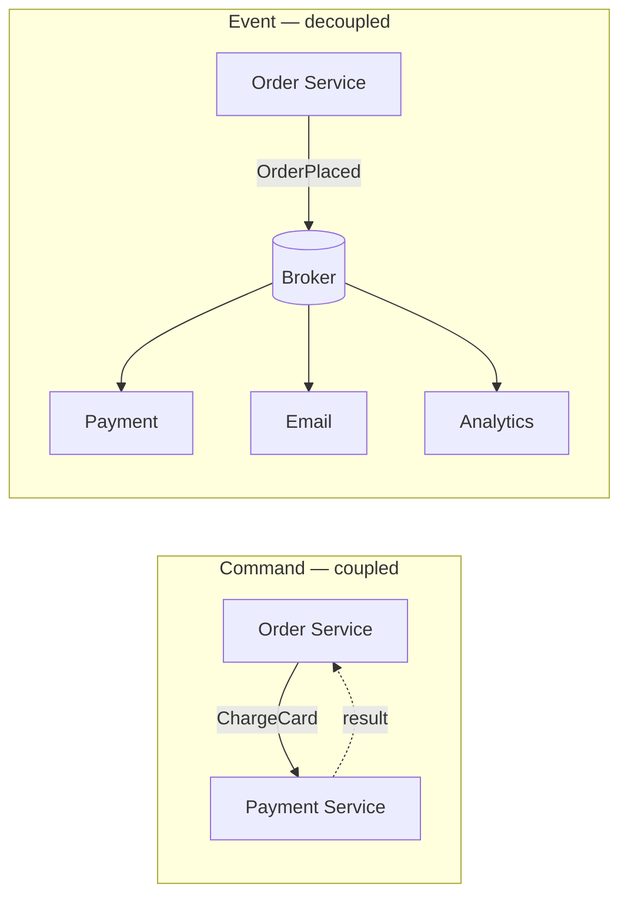
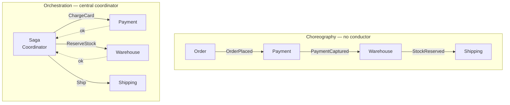
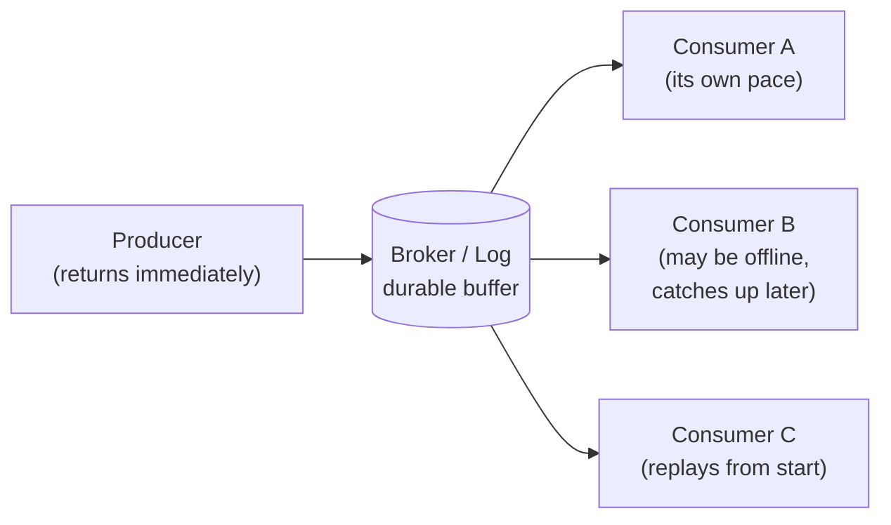

  <h1 style="color: white; margin: 0; font-size: 2.5rem;">Event-Driven Architecture</h1>
  
Building systems that react to facts — events, brokers, choreography, and the patterns that keep async systems sane

An event-driven system is one whose components communicate by announcing that *something happened* rather than by calling each other to *make something happen*. A producer emits an event — "order placed," "payment captured," "user deleted" — onto a broker, and any number of consumers react on their own schedule. The producer neither knows nor cares who is listening. That single inversion — from "tell the other service to act" to "broadcast a fact and let interested parties decide" — is what buys event-driven systems their decoupling, their elasticity, and their resilience, and it is also the source of their hardest problems: eventual consistency, out-of-order delivery, and debugging a flow no single service owns. This hub frames the core mental models — events versus commands, choreography versus orchestration, asynchronous decoupling — and routes you into focused pages on the message brokers that carry events and the patterns that tame them.

## Overview

In a request-driven system, control flows by command: service A calls service B and waits, B calls C and waits, and the whole chain is only as available as its weakest link. **Event-driven architecture inverts that flow.** Instead of issuing commands down a call stack, components publish *events* — immutable records of things that have happened — and other components subscribe to the ones they care about. The result is a system wired together by a stream of facts rather than a web of synchronous calls.

**What you'll get:** a working mental model of event-driven thinking — how events differ from commands, when to let services choreograph themselves versus orchestrate them centrally, and what asynchronous decoupling actually buys and costs — plus curated links into the brokers that move events and the patterns that make them reliable.

**Assumed background:** comfort with services, HTTP/JSON, and at least one programming language. No prior experience with Kafka, queues, or event sourcing is required — each child page builds from first principles.

### Events vs. Commands

The single most important distinction in this entire area is the difference between an **event** and a **command**. They look superficially similar — both are messages on a wire — but they carry opposite intent, and conflating them is the most common way event-driven designs go wrong.

A **command** is an imperative: *do this*. It names a specific handler, expects exactly one recipient to act, and usually anticipates a result or an acknowledgment. `ChargeCard`, `SendEmail`, `ReserveInventory` are commands. The sender is coupled to the receiver's existence and is, in effect, still giving orders down a call chain — just over a message bus instead of a function call.

An **event** is a notification: *this happened*. It is phrased in the past tense, names no recipient, and expects no reply. `CardCharged`, `EmailSent`, `InventoryReserved` are events. The emitter is asserting a fact about the world; whether zero, one, or fifty consumers react to it is none of its concern.

| Aspect | Command | Event |
|--------|---------|-------|
| **Intent** | "Do this" (imperative) | "This happened" (declarative) |
| **Tense** | Present/imperative (`ReserveSeat`) | Past (`SeatReserved`) |
| **Recipients** | Exactly one handler | Zero to many subscribers |
| **Coupling** | Sender knows the receiver | Emitter knows no one |
| **Reply** | Often expects a result | Expects nothing |
| **Ownership** | Owned by the receiver (it defines what it accepts) | Owned by the emitter (it defines what it publishes) |
| **Effect of new consumers** | Requires the sender to route to them | Transparent — emitter is unchanged |

The practical consequence: **commands keep coupling, events shed it.** When you find yourself naming an "event" in the imperative — `OrderShipmentRequested` aimed at exactly one shipping service — you have actually written a command wearing an event's clothes, and you will pay for the disguise the first time you need a second consumer. Both message types are legitimate; mature systems use commands where one party must act and own the outcome, and events where a fact should be broadcast for anyone to react to. The discipline is calling each what it is.

### Choreography vs. Orchestration

Once components talk in events, a second question appears: when a multi-step business process spans several services — place order → charge card → reserve stock → ship — **who drives the sequence?** There are two answers, and the choice is one of the defining decisions of an event-driven system.

**Choreography** has no conductor. Each service subscribes to the events it cares about, does its work, and emits its own event, which the next service happens to be listening for. The order service emits `OrderPlaced`; the payment service reacts and emits `PaymentCaptured`; the warehouse reacts to *that* and emits `StockReserved`; and so on. The overall flow is an emergent property of who-listens-to-what — no single component knows the whole story. This maximizes decoupling and lets you add steps by simply subscribing a new consumer, but the end-to-end process exists only implicitly, scattered across subscriptions, which makes it hard to see, hard to monitor, and hard to reason about when something stalls.

**Orchestration** introduces a coordinator — an orchestrator or saga manager — that holds the process definition explicitly. It sends commands (`ChargeCard`, then `ReserveStock`, then `Ship`), waits for each to report back, and decides what happens next, including compensation if a step fails. The flow lives in one place where you can read it, monitor it, and visualize it, at the cost of reintroducing a central component that every step depends on and that becomes coupled to all of them.

| | Choreography | Orchestration |
|--|--------------|---------------|
| **Control** | Distributed — each service decides | Centralized — coordinator decides |
| **Communication** | Events ("this happened") | Commands ("do this") + replies |
| **Coupling** | Lowest; services don't know the flow | Coordinator coupled to every step |
| **Visibility** | Flow is implicit and scattered | Flow is explicit in one place |
| **Adding a step** | Subscribe a new consumer | Edit the coordinator |
| **Failure handling** | Each service compensates locally | Coordinator runs compensation |
| **Best for** | Simple, loosely related reactions | Complex, long-lived, multi-step transactions |

Neither is universally correct. A good rule of thumb: **choreograph the simple, orchestrate the complex.** Loosely related side-effects — "when an order is placed, also update analytics and send a receipt" — are a natural fit for choreography. A genuine distributed transaction with ordering, timeouts, and compensation — the canonical [saga](../distributed-systems/resilience-patterns.html) — is usually clearer as an orchestration. Many real systems mix both, choreographing across bounded contexts and orchestrating the critical path inside one.

### Asynchronous Decoupling

The deepest benefit of event-driven design is **temporal decoupling**: the producer and the consumer do not have to be available at the same time. In a synchronous call, the caller blocks until the callee answers — they are coupled in time, in availability, and in throughput. The moment a broker sits between them, those couplings dissolve. The producer writes an event and returns immediately; the broker holds it durably; the consumer reads it whenever it is ready, possibly seconds or hours later, possibly after recovering from a crash.

That single change cascades into several concrete properties:

1. **Load leveling.** A traffic spike that would overwhelm a synchronous downstream service simply lengthens the queue. The broker absorbs the burst and the consumer drains it at its own sustainable rate, turning a thundering-herd outage into a temporary lag.
2. **Failure isolation.** If a consumer crashes, the producer is unaffected — events accumulate safely until the consumer returns and catches up. A synchronous dependency, by contrast, would propagate the failure straight back up the call chain.
3. **Independent scaling.** Producers and consumers scale separately. You can run one producer and twenty consumers, or scale the consumer fleet up and down based on queue depth, without the producer knowing or caring.
4. **Fan-out for free.** Because an event names no recipient, adding a new consumer is invisible to everyone else. The same `OrderPlaced` event can feed fulfillment, billing, analytics, and fraud detection, each added independently.
5. **Replayability.** Log-based brokers retain events, so a new or fixed consumer can rewind and reprocess history — invaluable for rebuilding a projection or recovering from a bug.

These gains are not free. Asynchrony means **eventual consistency**: there is a window where the order exists but the invoice does not, and the system as a whole is only "correct" once all consumers have caught up. It means **harder reasoning**: a single user action becomes a cascade of events across services with no stack trace tying them together, so you lean on correlation IDs and distributed tracing instead. And it forces every consumer to be **idempotent**, because the practical delivery guarantee is *at-least-once* — the same event will, eventually, arrive twice. These costs and the patterns that pay them down are the subject of the [Patterns](patterns.html) page; the infrastructure that makes the decoupling possible is the subject of [Message Brokers](message-brokers.html).

### When Event-Driven Earns Its Keep

Event-driven architecture is a tool, not a default. It shines when you have **multiple independent reactions to the same fact**, **spiky or unpredictable load** that benefits from buffering, **long-running or background work** that should not block a user, or **bounded contexts that must stay decoupled** so teams can evolve independently. It is the wrong reflex when you need an **immediate synchronous answer** (a price quote, an authorization decision), when a **strong, read-your-writes consistency** guarantee is non-negotiable, or when the system is small enough that a direct call is simply clearer. As always, the honest answer is "it depends" — and the rest of this hub makes the dependencies concrete.

## Explore the Topics

The two pages below split the area into *infrastructure* and *patterns*: first the brokers that physically carry events, then the design patterns that make event-driven systems correct and maintainable.

| Page | What it covers |
|------|----------------|
| [Message Brokers](message-brokers.html) | Queue vs. log semantics, Apache Kafka, RabbitMQ, NATS, and managed brokers (SQS/SNS, Pub/Sub, EventBridge); partitions, consumer groups, offsets, retention, and at-least-once vs. exactly-once delivery |
| [Event-Driven Patterns](patterns.html) | Publish/subscribe, event notification vs. event-carried state transfer, event sourcing, CQRS, choreographed and orchestrated sagas, the transactional outbox, idempotency keys, and dead-letter queues |

## Learning Path

There is no single correct route, but the following order builds each idea on the one before it:

1. **Internalize the mental models.** This hub's distinctions — events vs. commands, choreography vs. orchestration, async decoupling — are the vocabulary every later page assumes.
2. **Learn what carries the events.** [Message Brokers](message-brokers.html) explains the two broker families (transient queues vs. durable logs) and the delivery guarantees that determine how careful your consumers must be.
3. **Make it correct.** [Event-Driven Patterns](patterns.html) supplies the patterns — idempotency, the outbox, sagas, event sourcing, CQRS — that turn raw messaging into a reliable system.

For how these ideas sit inside a broader service architecture, branch into [Microservices & Event-Driven](../distributed-systems/microservices-and-event-driven.html); for the synchronous-versus-asynchronous API trade-off, see [Async & Event-Driven APIs](../api-design/async-and-events.html).

## Key Takeaways

- **Name events as facts.** Past tense, no recipient, no demand. If it reads like an order to one specific service, it's a command — call it one and accept the coupling deliberately.
- **Decoupling is the payoff.** Producers and consumers never reference each other, so you add, remove, or scale consumers without touching producers — and a slow consumer never stalls the source.
- **Choreograph simple, orchestrate complex.** Let loosely related reactions self-organize through events; give genuine multi-step transactions an explicit coordinator you can read and monitor.
- **Async buys resilience, costs immediacy.** Brokers buffer spikes and isolate failures, but the system is only eventually consistent — design every read path to tolerate lag.
- **Assume at-least-once delivery.** The same event will arrive twice. Make every consumer idempotent so a duplicate is a harmless no-op, not a double charge.
- **Restore the lost trace.** One action becomes a cascade with no stack trace. Correlation IDs and distributed tracing are how you see the whole flow again.

## See Also

- **[Microservices & Event-Driven](../distributed-systems/microservices-and-event-driven.html)** — how event-driven messaging fits into a system of independently deployable services, with Kafka, event sourcing, and CQRS in context.
- **[Async & Event-Driven APIs](../api-design/async-and-events.html)** — the synchronous-vs-asynchronous decision at the API boundary: queues vs. streams, delivery guarantees, and webhooks.
- **[Resilience Patterns](../distributed-systems/resilience-patterns.html)** — sagas, idempotency, and distributed locks: the reliability mechanisms event-driven flows depend on.
- **[Distributed Systems](../distributed-systems/)** — the consistency models, partial-failure realities, and coordination limits that shape every async design.
- **[Database Design](../technology/database-design/)** — the data stores your events project into and the outbox table that bridges writes to the broker.

### Further Reading

- "Designing Data-Intensive Applications" by Martin Kleppmann — the definitive treatment of logs, streams, and derived data
- "Building Event-Driven Microservices" by Adam Bellemare
- "Enterprise Integration Patterns" by Gregor Hohpe & Bobby Woolf — the canonical messaging-pattern catalog
- [Martin Fowler: What do you mean by "Event-Driven"?](https://martinfowler.com/articles/201701-event-driven.html)
- [The Log: What every software engineer should know about real-time data's unifying abstraction](https://engineering.linkedin.com/distributed-systems/log-what-every-software-engineer-should-know-about-real-time-datas-unifying)
