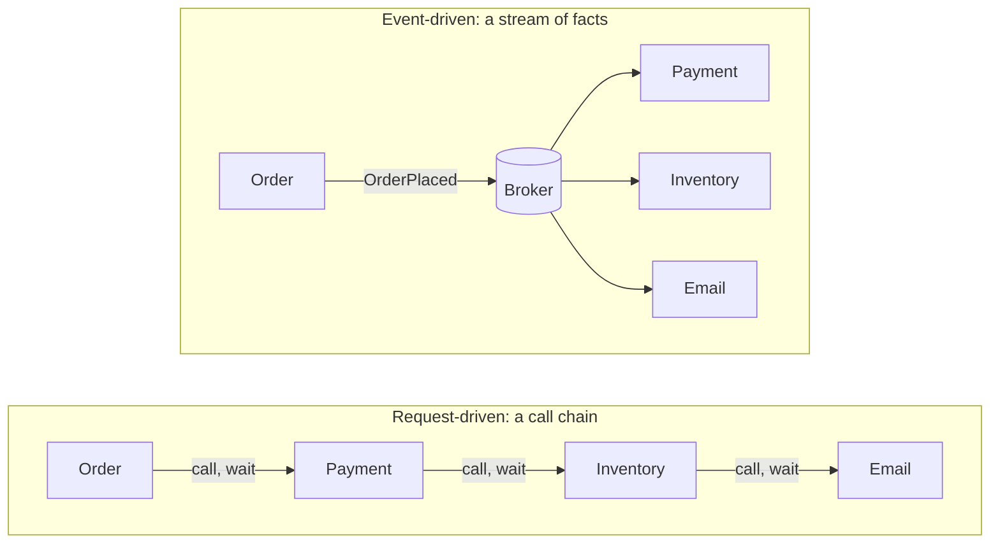
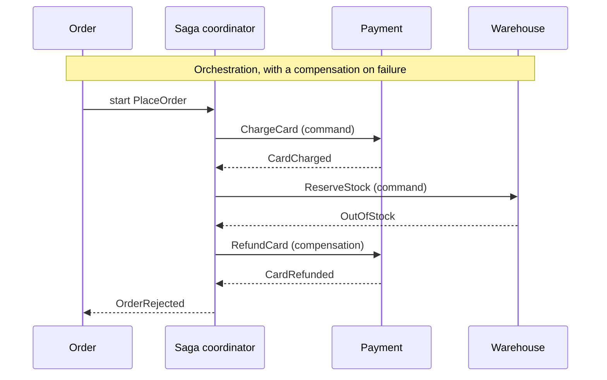
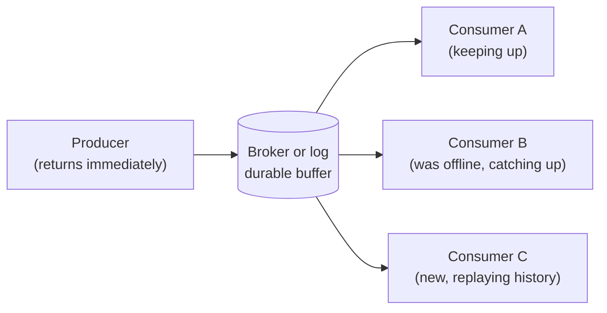

  <h1 style="color: white; margin: 0; font-size: 2.5rem;">Event-Driven Architecture</h1>
  
Building systems that react to facts — events, brokers, choreography, and the patterns that keep async systems sane

In an **event-driven architecture (EDA)**, components communicate by announcing that *something happened* rather than by calling each other to *make something happen*. A producer publishes an event such as "order placed" or "payment captured" to a broker, and any number of consumers react on their own schedule without the producer knowing who they are. That inversion is the source of EDA's decoupling, elasticity, and resilience, and also of its hardest problems: eventual consistency, duplicate and out-of-order delivery, and flows that no single service owns. This hub defines the core concepts (events versus commands, the kinds of event, choreography versus orchestration, and what asynchrony buys and costs) and links to the detailed pages on [message brokers](message-brokers.html) and [event-driven patterns](patterns.html).

## Request-Driven vs. Event-Driven

In a request-driven system, control flows by command: service A calls B and waits, B calls C and waits, and the chain is only as available as its weakest link. Event-driven architecture replaces the call chain with a stream of facts. Components publish immutable records of what happened, and other components subscribe to the ones they care about.

In the call chain, an outage in Email fails the whole order and every added step adds latency. In the event-driven version, Order returns as soon as the event is durably stored, and a failed Email service only delays emails.

## Events vs. Commands

The most important distinction in this area is between an **event** and a **command**. Both are messages, but they carry opposite intent, and confusing them is the most common way event-driven designs go wrong.

- A **command** is an imperative: *do this*. It is addressed to one handler, which owns the outcome and usually replies. `ChargeCard`, `SendEmail`, and `ReserveInventory` are commands. The sender depends on the receiver existing.
- An **event** is a notification: *this happened*. It is named in the past tense, addressed to no one, and expects no reply. `CardCharged`, `EmailSent`, and `InventoryReserved` are events. Whether zero or fifty consumers react is not the emitter's concern.

| Aspect | Command | Event |
|--------|---------|-------|
| **Intent** | "Do this" | "This happened" |
| **Naming** | Imperative (`ReserveSeat`) | Past tense (`SeatReserved`) |
| **Recipients** | Exactly one handler | Zero to many subscribers |
| **Coupling** | Sender knows the receiver | Emitter knows no one |
| **Reply** | Often expects a result | None |
| **Schema owned by** | The receiver (what it accepts) | The emitter (what it publishes) |
| **Can be rejected?** | Yes, by the handler | No; it already happened |
| **Adding a consumer** | Sender must route to it | Emitter is unchanged |

Commands keep coupling; events shed it. An "event" named in the imperative and aimed at one service, such as `OrderShipmentRequested` consumed only by shipping, is a command in disguise, and the disguise costs you the first time a second consumer appears. Both are legitimate: use commands where one party must act and own the result, and events where a fact should be broadcast. The discipline is naming each for what it is.

## What an Event Carries

Martin Fowler distinguishes several patterns that are all called "event-driven" but make different trade-offs:

| Pattern | Event contains | Consumers | Trade-off |
|---------|----------------|-----------|-----------|
| **Event notification** | A minimal signal: type, ID, timestamp | Call back to the source for details | Small, stable events; consumers re-couple through the callback |
| **Event-carried state transfer** | The changed state itself | Keep a local copy of the data they need | Consumers work when the source is down; data is duplicated and eventually consistent |
| **Event sourcing** | Every state change, as the system of record | Rebuild state by replaying events | Full history and audit trail; replay, versioning, and snapshots add complexity |
| **CQRS** | Events feed separate read models | Query-optimized projections | Reads and writes scale independently; read models lag the write side |

The first two concern *messages between services*; the last two concern *how a service stores its own state*. They combine freely. [Event-Driven Patterns](patterns.html) covers event sourcing, CQRS, and projections in depth.

Because events are an interface between teams, their shape is a public contract. Standard envelopes such as [CloudEvents](../api-design/async-and-events.html#describing-events-cloudevents) and a schema registry with compatibility rules keep producers and consumers evolving independently; see [Event Versioning & Schema Registry](patterns.html#event-versioning--schema-registry).

## Choreography vs. Orchestration

When a business process spans several services (place order, charge card, reserve stock, ship), someone has to drive the sequence. There are two answers.

**Choreography** has no conductor. Each service subscribes to the events it cares about, does its work, and emits its own event, which the next service listens for. The flow emerges from who listens to what. This maximizes decoupling and makes adding a reaction easy, but the end-to-end process exists only implicitly, spread across subscriptions, which makes it hard to see, monitor, and change.

**Orchestration** introduces a coordinator that holds the process definition explicitly. It sends commands, waits for replies, and decides what happens next, including **compensating** earlier steps when a later one fails. The flow lives in one place where it can be read and monitored, at the cost of a central component coupled to every step. **Durable execution** engines such as Temporal, Restate, and AWS Step Functions have made orchestration much cheaper to build correctly, because they persist the workflow's progress and resume it after crashes; see [Durable Execution](../distributed-systems/microservices-and-event-driven.html#durable-execution).

In the choreographed version of the same flow, Payment reacts to `OrderPlaced`, Warehouse reacts to `CardCharged`, and on failure Warehouse emits `StockReservationFailed`, to which Payment reacts by refunding. Every service must know which failure events concern it, which is manageable for two steps and hard to follow for ten.

| | Choreography | Orchestration |
|--|--------------|---------------|
| **Control** | Distributed; each service decides | Centralized in a coordinator |
| **Messages** | Events | Commands and replies |
| **Coupling** | Lowest; no service knows the whole flow | Coordinator coupled to every step |
| **Visibility** | Implicit; reconstructed from traces | Explicit; the workflow definition |
| **Adding a step** | Subscribe a new consumer | Change the coordinator |
| **Failure handling** | Each service compensates on failure events | Coordinator runs compensations |
| **Best for** | Independent side effects, few steps | Long-running, multi-step transactions with ordering and timeouts |

A useful rule of thumb is **choreograph the simple, orchestrate the complex**. Independent side effects ("when an order is placed, update analytics and send a receipt") suit choreography. A distributed transaction with ordering, timeouts, and compensation, the [saga](patterns.html#the-saga-pattern), is usually clearer as an orchestration. Many systems use both: choreography between bounded contexts, orchestration for the critical path inside one.

## Asynchronous Decoupling

The central benefit of event-driven design is **temporal decoupling**: producer and consumer need not be available at the same time. A synchronous caller is coupled to its callee in time, availability, and throughput. With a broker in between, the producer writes an event and returns; the broker holds it durably; the consumer processes it when ready, possibly after recovering from a crash.

That change yields several properties:

1. **Load leveling.** A traffic spike lengthens the queue instead of overwhelming the downstream service, which drains it at a sustainable rate.
2. **Failure isolation.** A crashed consumer does not affect the producer; events accumulate until it returns.
3. **Independent scaling.** Producers and consumers scale separately, and consumers can autoscale on backlog.
4. **Cheap fan-out.** New consumers attach without any change to the producer.
5. **Replay.** Log-based brokers retain events, so a new or fixed consumer can reprocess history to build or rebuild a view.

These gains have costs:

| Cost | Consequence | Mitigation |
|------|-------------|------------|
| **Eventual consistency** | The order exists before the invoice does; reads may be stale. | Design read paths and UIs to tolerate lag; show pending states. |
| **Duplicate delivery** | At-least-once delivery means the same event arrives more than once. | [Idempotent consumers](patterns.html#idempotent-consumers). |
| **Reordering** | Events for different keys interleave; retries and redelivery reorder. | Key by entity ID; carry version numbers and discard stale updates. |
| **Dual writes** | Updating a database and publishing an event are two operations that can partially fail. | The [transactional outbox](patterns.html#the-outbox--inbox-patterns) or change data capture. |
| **Lost traceability** | One user action becomes a cascade of events with no stack trace. | Correlation IDs and distributed tracing with context propagated in message headers ([Observability](../distributed-systems/observability.html)). |
| **Poison messages** | A message that always fails blocks its queue or partition. | Bounded retries and [dead-letter queues](message-brokers.html#dead-letter-queues). |

## When Event-Driven Is the Right Choice

Event-driven architecture is a tool, not a default. It fits well when there are **multiple independent reactions to the same fact**, **spiky or unpredictable load** that benefits from buffering, **long-running or background work** that should not block a user, **integration across teams or bounded contexts** that must evolve independently, or a need for an **audit trail or replayable history**.

It is a poor fit when the caller needs an **immediate answer** (a price quote, an authorization decision), when **read-your-writes consistency** is required across services, or when the system is small enough that a direct call is simply clearer. A common, sound design is synchronous requests at the edge for queries and user-facing decisions, with events carrying state changes between services behind it.

## Topics in This Section

| Page | What it covers |
|------|----------------|
| [Message Brokers & Streaming](message-brokers.html) | Queue vs. log storage; Apache Kafka 4.x (KRaft, share groups, transactions), RabbitMQ 4.x (quorum queues, streams), NATS JetStream, Pulsar; SQS, SNS, EventBridge, Kinesis, and Google Pub/Sub; ordering, delivery semantics, exactly-once, backpressure, and dead-letter queues |
| [Event-Driven Patterns](patterns.html) | Event sourcing, CQRS, projections, choreographed and orchestrated sagas, the transactional outbox and inbox, idempotent consumers, schema versioning, and eventual consistency |

A suggested reading order is this page for vocabulary, then [Message Brokers](message-brokers.html) for the infrastructure and its delivery guarantees, then [Event-Driven Patterns](patterns.html) for the techniques that make event-driven systems correct.

## See Also

- **[Microservices & Event-Driven](../distributed-systems/microservices-and-event-driven.html)**: event-driven messaging within a microservice architecture, including durable execution and the outbox pattern
- **[Async & Event-Driven APIs](../api-design/async-and-events.html)**: webhooks, server-sent events, CloudEvents, and AsyncAPI at the API boundary
- **[Resilience Patterns](../distributed-systems/resilience-patterns.html)**: retries, backoff, idempotency, and sagas with compensation
- **[Testing Distributed Systems](../distributed-systems/testing-distributed-systems.html)**: fault injection and consistency checking for asynchronous systems
- **[Distributed Systems](../distributed-systems/)**: consistency models, partial failure, and coordination limits
- **[Database Design](../technology/database-design/)**: the stores events project into and the outbox table that bridges writes to the broker

### Further Reading

- Martin Kleppmann, *Designing Data-Intensive Applications*: logs, streams, and derived data
- Adam Bellemare, *Building Event-Driven Microservices*
- Gregor Hohpe and Bobby Woolf, *Enterprise Integration Patterns*: the canonical messaging-pattern catalog
- [Martin Fowler, "What do you mean by 'Event-Driven'?"](https://martinfowler.com/articles/201701-event-driven.html)
- [Jay Kreps, "The Log: What every software engineer should know about real-time data's unifying abstraction"](https://engineering.linkedin.com/distributed-systems/log-what-every-software-engineer-should-know-about-real-time-datas-unifying)
